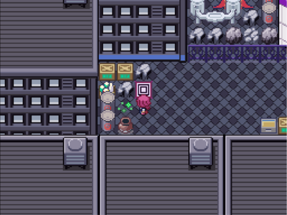
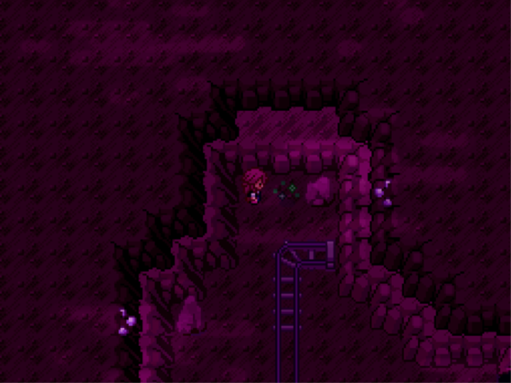
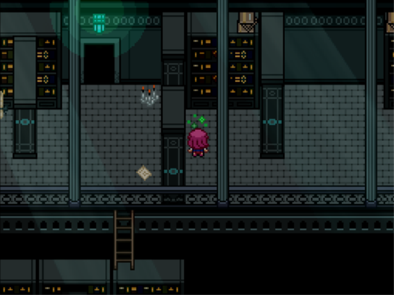
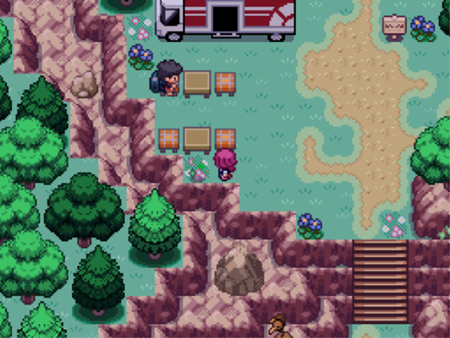
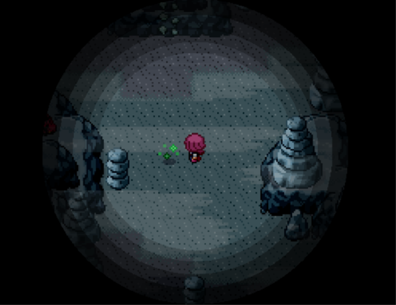
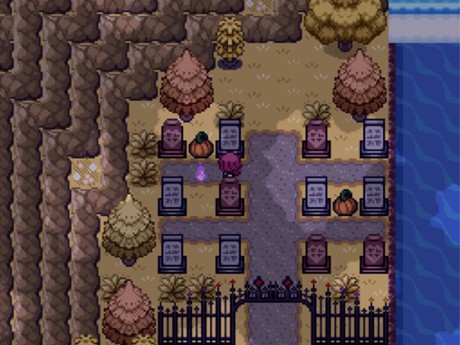
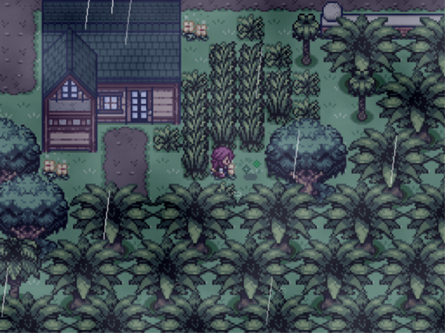
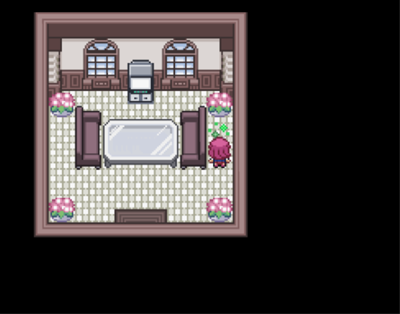
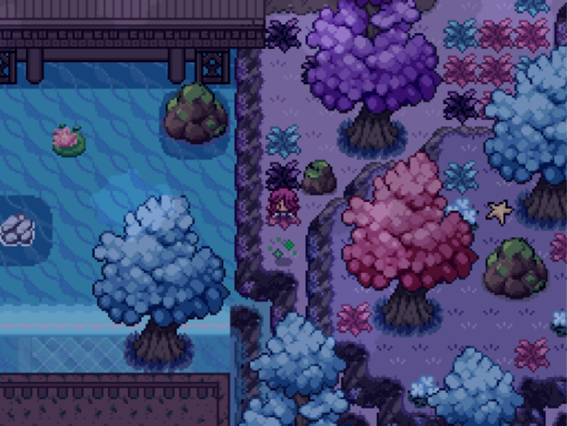
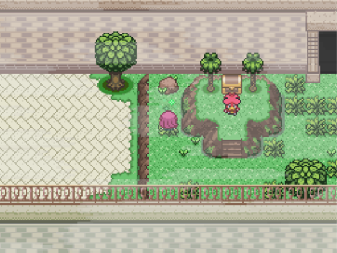

# Rejuvenation 13.5 100% Walkthough
- [About this guide](#about-this-guide)
- [Prologue](#prologue)
- [Intro](#intro)
  - [Passwords](#passwords)
    - [Quality of Life Passwords](#quality-of-life-passwords)
    - [Difficulty Passwords](#difficulty-passwords)
    - [Shenanigans](#shenanigans)
    - [Password Packs](#password-packs)
  - [S.S. Oceana (July XX, 20XX)](#s.s.-oceana-july-xx-20xx)
- [Chapter 1: Crossroads of Destiny](#chapter-1-crossroads-of-destiny)
  - [Oceana Pie](#oceana-pier)
  - [Gearen Laboratory](#gearen-laboratory)
  - [East Gearen City](#east-gearen-city)
    - [Quest 1: Save Starly!](#quest-1-save-starly)
    - [Quest 2: Buizel Event](#quest-2-buizel-event)
    - [Quest 3: Missing Mother](#quest-3-missing-mother)
    - [Quest 4: Hidden Library](#quest-4-hidden-library)
    - [Quest 5: Love Letter!](#quest-5-love-letter)
    - [Quest 6: Dangerous Pokémon!](#quest-6-dangerous-pokémon)
    - [Quest 7: Battle Request!](#quest-7-battle-request)
    - [Quest 8: Wretched Music](#quest-8-wretched-music)
    - [Quest 9: PictoZumi](#quest-9-pictozumi)
    - [Quest 10: Bad Luck](#quest-10-bad-luck)
  - [Gearen Alleway East Side](#gearen-alleway-east-side)
  - [Abandoned Sewers](#abandoned-sewers)
  - [Game Corner Prizes](#game-corner-prizes)
  - [PoisonHeart Badge](#poisonheart-badge)
  - [Post-Gym Quests](#post-gym-quests)
    - [Quest 11: Zygarde Quest](#quest-11-zygarde-quest)
    - [Quest 12: Virtual League (First Gym)](#quest-12-virtual-league-first-gym)
  - [Route 1 and Goldenwood Forest](#route-1-and-goldenwood-forest)
    - [Quest 13: Lost Girl!](#quest-13-lost-girl)
    - [Quest 14: My Darling Furfrou](#quest-14-my-darling-furfrou)
    - [Quest 15: The Big Catch!](#quest-15-the-big-catch)
  - [Goldenwood Cave](#goldenwood-cave)
    - [Quest 16: Culvier Clan Quest (1st Member)](#quest-16-culvier-clan-quest-1st-member)
  - [The Ruins](#the-ruins)
    - [The Silent Grove](#the-silent-grove)
  - [Goldenwood Xen Attack](#goldenwood-xen-attack)
- [Chapter 2: Redemption](#chapter-2-redemption)
  - [Unlocked on Chapter 2 Start](#unlocked-on-chapter-2-start)
    - [Quest 17: Minccino Event](#quest-17-minccino-event)
  - [Junction Bridge](#junction-bridge)
  - [Route 2](#route-2)
    - [Quest 18: Painter Side Quest](#quest-18-painter-side-quest)
  - [Amethyst Cave](#amethyst-cave)
  - [Post-Amethyst Cave](#post-amethyst-cave)
    - [Quest 19: Karrina's Gang Fight](#quest-19-karrinas-gang-fight)
  - [Sheridan Village](#sheridan-village)
    - [Quest 20: Lost Boyfriend](#quest-20-lost-boyfriend)
  - [Amethyst Grotto](#amethyst-grotto)
    - [Quest 21: Hidden Library 2](#quest-21-hidden-library-2)
    - [Quest 22: Stolen Cargo!](#quest-22-stolen-cargo)
    - [Quest 23: Trade Me!](#quest-23-trade-me)
    - [Quest 24: Fetch an Item!](#quest-24-fetch-an-item)
    - [Quest 25: Battle Request 2](#quest-25-battle-request-2)
    - [Quest 26: Move Relearner Quest](#quest-26-move-relearner-quest)
  - [Diamond Punch Badge? - Battle](#diamond-punch-badge---battle)
  - [Carotos Mountain](#carotos-mountain)
  - [Diamond Punch Badge](#diamond-punch-badge)
- [Chapter 3: Tainted Light](#chapter-3-tainted-light)
  - [Cut Detour](#cut-detour)
  - [Chrysalis Courtyard](#chrysalis-courtyard)
  - [Chrysalis Manor](#chrysalis-manor)
    - [Quest 27: Extra Chrysalis Trial](#quest-27-extra-chrysalis-trial)
  - [Normality Badge](#normality-badge)
- [Chapter 4: Isolation](#chapter-4-isolation)
  - [Detour Before Route 3](#detour-before-route-3)
    - [Quest 12: Virtual League (Second Gym)](#quest-12-virtual-league-second-gym)
  - [Journey to Goldenleaf Town](#journey-to-goldenleaf-town)
    - [Quest 12: Virtual League (Third & Fourth Gyms)](#quest-12-virtual-league-third-fourth-gyms)
    - [Mirage Woods](#mirage-woods)
    - [Quest 28: Broken Bell](#quest-28-broken-bell)
    - [Quest 29: Cranky Crobat](#quest-29-cranky-crobat)
    - [Route 3](#route-3)
    - [Phasial Cave](#phasial-cave)
    - [Quest 28: Broken Bell (Continue)](#quest-28-broken-bell-continue)
    - [The Iron Gate](#the-iron-gate)
  - [Goldenleaf Town](#goldenleaf-town)
    - [Detour Before Wispy Path](#detour-before-wispy-path)
  - [Journey to Wispy Tower](#journey-to-wispy-tower)
    - [Wispy Path](#wispy-path)
    - [Goldenwood Forest Revisit](#goldenwood-forest-revisit)
  - [Wispy Tower](#wispy-tower)
    - [Forsaken Laboratory](#forsaken-laboratory)
  - [Phantasm Badge](#phantasm-badge)
    - [Detour Before Wispy Ruins](#detour-before-wispy-ruins)
    - [Quest 16: Culvier Clan Quest (4th Member)](#quest-16-culvier-clan-quest-4th-member)
- [Chapter 5: Imprisoned](#chapter-5-imprisoned)
  - [Wispy Ruins](#wispy-ruins)
    - [Mystery Egg ](#mystery-egg)
  - [Route 4](#route-4)
  - [Before Helping Old Man in Akuwa Town](#before-elping-old-man-in-akuwa-town)
    - [Quest 30: Lost Souls](#quest_30_lost_souls)
  - [Akuwa Town](#akuwa-town)
  - [Blacksteeple Castle](#blacksteeple-castle)
    - [Day 1 - Imprisoned](#day-1---imprisoned)
    - [Night 1 - The Hooded Girl](#night-1---the-hooded-girl)
    - [Day 2 - Blacksteeple Battalion](#day-2---blacksteeple-battalion)
    - [Night 2 - Prestigious Secret](#night-2---prestigious-secret)
    - [Day 3 - A New Friend](#day-3---a-new-friend)
    - [Night 3 - Bittersweet Reunion](#night-3-–-bittersweet-reunion)
    - [Day 4 - Union](#day-4---union)
  - [Xen Battleship](#xen-battleship)
  - [Terajuma Shore](#terajuma-shore)
  - [Terajuma Jungle](#terajuma-jungle)
  - [Kakori Village](#kakori-village)
    - [Quest 12: Virtual League (Fifth & Sixth Gyms)](#quest-12-virtual-league-fifth-sixth-gyms)
    - [Quest 31: Xen Ship Tour](#quest-31-xen-ship-tour)
    - [Quest 32: The Kakori Monster](#quest-32-the-kakori-monster)
  - [Detour Before Dewdrop Badge](#detour-before-dewdrop-badge)
    - [Quest 33: Building Bridges](#quest-33-building-bridges)
    - [Deep Terajuma Jungle (North) and Terajuma Excavation Site](#deep-terajuma-jungle-north-and-terajuma-excavation-site)
    - [Temple Outskirts](#temple-outskirts)
    - [Quest 34: Tantalizing Temple (Start)](#quest-34-tantalizing-temple-start)
  - [Dewdrop Badge](#dewdrop-badge)
- [Chapter 6: Nimpossible Predicament](#chapter-6-nimpossible-predicament)
  - [Surf Detour](#surf-detour)
    - [Quest 34: Tantalizing Temple (Continuation)](#quest-34-tantalizing-temple-continuation)
  - [To Jynnobi Pass](#to-jynnobi-pass)
  - [Jynnobi Pass](#jynnobi-pass)
  - [Terajuma Good Rod Detour](#terajuma-good-rod-detour)
  - [Floria Island After Surf](#floria-island-after-surf)
    - [Quest 35: Dragonite's Lost Mail](#quest-35-dragonites-lost-mail)
    - [Surfing Goldenwood and Spiritomb](#surfing-goldenwood-and-spiritomb)
    - [Quest 36: Dragonite's Lost Mail 2](#quest-36-dragonites-lost-mail-2)
    - [Quest 37: The Inconsistency](#quest-37-the-inconsistency)
    - [Quest 38: Poliwag Quest](#quest-38-poliwag-quest)
    - [Moon Field](#moon-field)
    - [Quest 26: Move Relearner Quest (Continuation)](#quest-26-move-relearner-quest-continuation)
    - [Quest 38: Poliwag Quest (First and Second)](#quest-38-poliwag-quest-first-and-second)
    - [Route 4 After Surf](#route-4-after-surf)
  - [Route 11](#route-11)
    - [Quest 39: Jynx Quest](#quest-38-jynx-quest)
    - [Quest 38: Poliwag Quest (Third)](#quest-38-poliwag-quest-third)
    - [Seabound Cave and Evergreen Cave](#seabound-cave-and-evergreen-cave)
  - [Evergreen Island](#evergreen-island)
  - [Back to Terajuma Island](#back-to-terajuma-island)
    - [Quest 38: Poliwag Quest (Fourth)](#quest-38-poliwag-quest-fourth)
    - [Back to Terajuma Story](#back-to-terajuma-story)
  - [September 2nd: A Trial of Hope](#september-2nd-a-trial-of-hope)
    - [Quest 33: Building Bridges (Continuation)](#quest-33-building-bridges-continuation)
    - [Quest 40: Battle Me Once More!](#quest-40-battle-me-once-more)
    - [Sky Relic](#sky-relic)
    - [Quest 41: Black Shard Secret](#quest-41-black-shard-secret)
    - [Quest 42: Abnormal Phenomenon](#quest-42-abnormal-phenomenon)
    - [Helojak Island](#helojak-island)
    - [Helojak Factory](#helojak-factory)
  - [Kakori Help Plaza](#kakori-help-plaza)
    - [Quest 43: Suspicious Person](#quest-43-suspicious-person)
    - [Quest 44: Chase Team AA](#quest-44-chase-team-aa)
  - [Infested Badge](#infested-badge)
- [Chapter 7: A Teila Fire and Ice](#chapter-7-a-teila-fire-and-ice)
  - [September 8th: A Trial by Fire](#september-8th-a-trial-by-fire)
    - [Quest 45: Dragonite's Lost Mail 3](#quest-45-dragonites-lost-mail-3)
    - [Aquamarine Cave](#aquamarine-cave)
    - [Aquamarine Depths](#aquamarine-depths)
    - [Aquamarine Chamber](#aquamarine-chamber)
    - [Teila Resort](#teila-resort)
    - [Aquamarine Cave (2nd Visit)](#aquamarine-cave-2nd-visit)
    - [Secluded Shore](#secluded-shore)
    - [Quest 38: Poliwag Quest (Fifth)](#quest-38-poliwag-quest-fifth)
    - [Teila Resort (2nd Visit)](#teila-resort-2nd-visit)
  - [September 9th: A Trial of Reunions](#september-9th-a-trial-of-reunions)
  - [September 10th: A Trial of Dragons](#september-10th-a-trial-of-dragons)
    - [Earth Relic](#earth-relic)
    - [Dinner with Tesla](#dinner-with-tesla)
    - [Frozen Kakori](#frozen-kakori)
  - [Rock Climb Detour](#rock-climb-detour)
    - [Quest 46: Phase Dial Quest](#quest-46-phase-dial-quest)
    - [Quest 47: Cliffside Grave Quest](#quest-47-cliffside-grave-quest)
    - [Wispy Chasm Rock Climb](#wispy-chasm-rock-climb)
    - [Quest 48: A Souvenir for Mom](#quest-48-a-souvenir-for-mom)
  - [Against Angie](#against-angie)  
    - [Frozen Kristiline Town](#frozen-kristiline-town)
    - [Tower of Theolia](#tower-of-theolia)
    - [Battlefield of Gods](#battlefield-of-gods)
- [Chapter 8: Those We Lose](#chapter-8-those-we-lose)
  - [September 13th: A Trial of an Envoy](#september-13th-a-trial-of-an-envoy)
    - [Quest 49: Aquamarine Request](#quest-49-aquamarine-request)
    - [Quest 50: Sapphire Museum Quest](#quest-50-sapphire-museum-quest)
    - [Quest 12: Virtual League (Seventh & Eigth Gyms)](#quest-12-virtual-league-seventh-eighth-gyms)
    - [Quest 51: Kristiline Quiz Show](#quest-51-kristiline-quiz-show)
    - [Isle of Angels](#isle-of-angels)
    - [Church and Tower of Theolia](#church-and-tower-of-theolia)
    - [Choosing Companion](#choosing-companion)
    - [Earth Heart](#earth-heart)
  - [September 18th: A Trial of Rebellion](#september-18th-a-trial-of-rebellion)
    - [Route 6](#route-6)
    - [Quest 52: Prince from the Sands](#quest-52-prince-from-the-sands)
    - [Quest 38: Poliwag Quest (Sixth)](#quest-38-poliwag-quest-sixth)
    - [Defeat the Super Xen Battleship (Optional)](#defeat-the-super-xen-battleship-optional)
    - [Valor Shore](#valor-shore)
    - [Quest 53: Save Amber](#quest-53-save-amber)
    - [Valor Mountain](#valor-mountain)
    - [Valor Summit](#valor-summit)
  - [September 25th: A Trial of Moving On](#september-25th-a-trial-of-moving-on)
    - [Quest 54: Lurking Lighthouse](#quest-54-lurking-lighthouse)
    - [Quest 55: My Dearest Rowlet](#quest-55-my-dearest-rowlet)
    - [Quest 56: Tale of Two Hearts](#quest-56-tale-of-two-hearts)
    - [Quest 57: Infinite Potential](#quest-57-infinite-potential)
    - [Return to Akuwa Town](#return-to-akuwa-town)
    - [Floria Island After Valor Mountain](#floria-island-after-valor-mountain)
    - [Quest 38: Poliwag Quest (Finish)](#quest-38-poliwag-quest-finish)
    - [Quest 58: Narcissa's Hauntings](#quest-58-narcissas-hauntings)
    - [Lyric Badge](#lyric-badge)
- [Chapter 9: No Time Left to Lose](#chapter-9-no-time-left-to-lose)
  - [Badge 8 Detour](#badge-8-detour)
  - [Forest of Time](#forest-of-time)
  - [Aevium (Past) 1st Visit](#aevium-past-1st-visit)
  - [West Gearen City Sewer Management](#west-gearen-city-sewer-management)
  - [Detour Before Pulse Badge](#detour-before-pulse-badge)
    - [West Gearen City](#west-gearen-city)
    - [Quest 30: Lost Souls (All Kids)](#quest-30-lost-souls-all-kids)
    - [Quest 12: Virtual League (Finish)](#quest-12-virtual-league-finish)
    - [Quest 59: Generator Problems](#quest-59-generator-problems)
    - [Quest 58: Narcissa's Hauntings (Second Part)](#quest-58-narcissas-hauntings-second-part)
    - [Quest 60: Spector Quest](#quest-60-spector-quest)
    - [Quest 61: House Sit](#quest-59-house-sit)
    - [Quest 62: Hidden Library 3](#quest-21-hidden-library-3)
  - [Pulse Badge](#pulse-badge)
- [Chapter 10: Stopped in Our Tracks](#chapter-10-stopped-in-our-tracks)

**Contents in middle pending to finish. The contents after this point may also be incomplete.**
- [Karma Files (Paragon Route Chapter 0)](#karma-files-paragon-route-chapter-0)
  - [Awakening Adrest](#awakening-adrest)
  - [December 6th: A Light of Determination](#december-6th-a-light-of-determination)
  - [December 7th: A Light of Friendship](#december-7th-a-light-of-friendship)
  - [December 10th: A Light of Feathers](#december-10th-a-light-of-feathers)
    - [Side-story: Become a director](#side-story-become-a-director)
  - [December 11th: A Light of Fire](#december-11th-a-light-of-fire)
    - [Legendary Wings Quest](#legendary-wings-quest)
    - [Teila Resort December 11th](#teila-resort-december-11th)
  - [December 12th: A Light of Ice](#december-12th-a-light-of-ice)
  - [December 13th: 2:00AM.](#december-13th-200am.)
  - [December 15th: A Light of Family](#december-15th-a-light-of-family)
  - [December 16th: A Light of Insanity](#december-16th-a-light-of-insanity)
  - [December 20th: A Light of Violet Rose](#december-20th-a-light-of-violet-rose)
  - [December 21st: A Light of a Violet Tower](#december-21st-a-light-of-a-violet-tower)
  - [December 22nd: A Light of a Hidden Truth](#december-22nd-a-light-of-a-hidden-truth)
  - [December 24th: A Light of a \#######](#december-24th-a-light-of-a)
  - [December 25th: A Light of a Miracle](#december-25th-a-light-of-a-miracle)
- [Appendices](#appendices)
  - [All Special Evolution Locations](#all-special-evolution-locations)
    - [Moss Rock Evolution Environment](#moss-rock-evolution-environment)
    - [Icy Rock Evolution Environment](#icy-rock-evolution-environment)
    - [Magnetic Evolution Environment](#magnetic-evolution-environment)
    - [Cold Evolution Environment](#cold-evolution-environment)
    - [Alolan Marowak Evolution Environment](#alolan-marowak-evolution-environment)
    - [Galarian Weezing Evolution Environment](#galarian-weezing-evolution-environment)
    - [Alolan Exeggutor Evolution Environment](#alolan-exeggutor-evolution-environment)
    - [Hisuian Lilligant Evolution Environment](#hisuian-lilligant-evolution-environment)
    - [Hisuian Braviary Evolution Environment](#hisuian-braviary-evolution-environment)
    - [Hisuian Sliggoo Evolution Environment](#hisuian-sliggoo-evolution-environment)
    - [Hisuian Avalugg Evolution Environment](#hisuian-avalugg-evolution-environment)
  - [Complete the V13.5 Dex (Pending to Update properly)](#complete-the-v13.5-dex-pending-to-update-properly)
    - [Must Breed](#must-breed)
    - [Must Evolve by Level](#must-evolve-by-level)
    - [Must Evolve by Item](#must-evolve-by-item)
    - [Must Evolve by Friendship](#must-evolve-by-friendship)
    - [Must Evolve by Other Means](#must-evolve-by-other-means)
  - [V13.5 Unobtainable Pokémon](#v13.5-unobtainable-pokémon)
    - [Starter Choice](#starter-choice)
    - [Paragon Route Exclusive Legendaries](#paragon-route-exclusive-legendaries)
    - [Renegade Route Exclusive Legendaries](#renegade-route-exclusive-legendaries)
    - [Missable Aevian Forms](#missable-aevian-forms)
    - [Must Breed](#must-breed)
    - [Must Evolve by Level](#must-evolve-by-level)
    - [Must Evolve by Item](#must-evolve-by-item)
    - [Must Evolve by Friendship](#must-evolve-by-friendship)
    - [Must Evolve by Other Means](#must-evolve-by-other-means)
    - [Unobtainable](#unobtainable)
    - [Unobtainable Legendaries](#unobtainable-legendaries)
  - [Pickup Table](#pickup-table)
  - [Crest Descriptions](#crest-descriptions)
- [New Quests](#new-quests)
  - [Spiteful Ex](#spiteful-ex)
  - [Tyluric Temple (Magma Drift)](#tyluric-temple-magma-drift)

# About this guide

This guide is based and inspired on BIGJRA's guide for Rejuvenation V13,
you can consider it an upgraded version of it.

Due to BIGJRA wanting to focus on finishing the Reborn guide with no
date for when the Rejuvenation 13.5 would be started, it was asked in
the Discord if someone else was going to make one due to considering
BIGJRA's discontinued.

The format is inspired on his guide, but I can't say it is the same as
if he did it since I do things my way, although since I use his guide
as a base for text and git page, you will likely feel it similar.

I am adding as much detail as I can and I am putting data for important
battles in both Story Mode and Classic Mode, and all items, including
Hidden Items. Still, I heavily recommend using my mod
**ItemfinderUnhideItems** to make all hidden items visible if you wish
to get them all as it will be far easier than following instructions to
take steps.

There are lots of changes from the previous version. Some areas may
still be similar, but others are completely remade. The bosses now have
HP Bars instead of shields. In general, the difficulty of battles on
Classic seems to be the same or has been lowered a bit on some of the
tougher ones.

It is included on the [Rejuvenation 13.5 QoL Mod Compilation Pack](https://www.rebornevo.com/forums/topic/65994-rejuv-135-qol-mod-compilation-pack-small-bug-fixes/). They
are all modular, so no need to add anything you don't wish to.

I am also using [Dred's Excel guide](https://docs.google.com/spreadsheets/d/1BjtFPXn8G37j621l_68fBcoNx3Qsvrg1idjS6c_Umls) to get information to put on this
written guide, but there are same differences in order of some things
and the rarely wrong encounters:

You can check all Field Effects on a txt that comes with the game. It is
important to use the fields appropriately, so check it when needed. The
game will show which moves you have are boosted or weakened by the
field.

For first time players or those that forgot the \"M\" key toggles a
speed-up of the game.

If you find any errors, please tell me on the forum post or Discord.

# Prologue

The game will start off asking if you want to skip the prologue.
Rejuvenation is a very story-focused game, so I recommend viewing it if
it is your first time playing. If you do skip the prologue, jump ahead
to the **Intro** section.

As soon as you are done reading the Zorua and Pangoro story, you will be
in control of Maria. You have to head downstairs to talk to your mom.
Afterwards you can enter the bottom room on the left side of the first
floor and head downstairs and interact with the summoning table for an
extra scene.

Now, head back upstairs and talk to your dad in the top-left room. Then
return to the kitchen to talk to your mom and once that is done go back
to your room upstairs.

After a scene that indicated something happened downstairs, return there
and talk with the mysterious figure. Head west back down to the basement
to watch the cutscene.

After regaining control, with the character now called Marianette, head
down, right, and up through the hallway. You will watch a final cutscene
before the prologue ends.

# Intro

After either skipping the prologue or finishing it, the game will ask
you which difficulty mode you want. This can be changed latter on Mr.
Luck's tents, but you can't always access them.

As of 13.5 there is only Story Mode and Classic Mode. **This guide will
be showing the teams for both modes, look at the battles of the one you
are using.** If something doesn't match the guide on your difficulty,
please report it. For those looking for harder fights you can pick
Classic Mode as that is the only difference between both modes. Be aware
that the mons of some trainer may vary between both modes, it isn't just
the levels and moves, but the total number and the species.

Register yourself as a trainer. You will choose your pronouns first and
then among genders and six sprites. You can also choose to do a
personality test.

Please note that while the pronouns will affect if you are treated as a
girl, boy, or non-binary in some scenes, usually people will refer to
you as they/them when talking to you in third person regardless of what
you chose. That is fully intended and not a bug.

Now, Amanda will ask if you want to input a password. [You have a full
list of passwords in this link](https://docs.google.com/spreadsheets/d/1UMWQWrvG-NGLXBNHQUsizrFYM1RImfydUT9WN1IZDT8),
but there will be a small explanation of them in the guide.

Some will add QoL things while other will make the game harder or
easier. Choose depending on which you wish for yourself or don't choose
any. I heavily recommend at least giving them a look.

## Passwords

You can freely add passwords at the beginning of the game, but if you
want to add them later, you can with some of them (others are game start
only), but at the cost of a Data Drive, which are quite limited. Some
passwords can't be deactivated after being activated.

### Quality of Life Passwords

The **mintyfresh** password allows you start with some mints, which
means fewer soft resets to get our starter with the nature we wish, same
for mons we want to get in our party later.

The **freeexpall** gives you a free Exp All from the beginning. You can
turn it on and off, so I recommend having it.

The **shinycharm** password let you start with a shiny charm from the
beginning, and the **freemegaz** allows you to get a Mega-Z Ring at the
same point. It doesn't include megastones nor Z crystals.

The **easyhms** password is one of my favorites. Giving you all the
Golden Tools to use HMs without having a mon that knows the mov. You
still need to unlock the HM and have the appropriate badge.

The **powerpack** password gives you the EV training keycards from the
beginning, so you can use the rooms to train the EVs of your mons from
the moment you get your starter.

Until here, they are all things you can get later without the passwords,
so they are just a matter of getting the things early on. The following
Quality of Life passwords are different as are things you won't get
unless using a password or a mod.

The **earlyincu** password enables the Incubator in the Daycare. It lets
you get the eggs without having to wait and making them hatch in one
step. It is extremely useful to save time when breeding. Of course, you
have to get to the Daycare to use it.

The **freeremotepc** password is one that puts Rejuvenation at the same
point as current official games in PC access. Before you had to go to a
PC to access the PC, but on recent games, you can access it anywhere
(with very few exceptions) to change your mons. The Remote PC allows you
to do the same using a Key item. Register it to have it easy to access
without having to go to your bag.

The **nopoisondam** password erases the effects of poison on the
overworld, thing that has been happening in the official games for a
while.

The **nodamageroll** password disables the damage variation for battle.

The **pinata** password allows you to get EXP candied from level up
trainers (breeders) without the need of fighting them.

### Difficulty Passwords

There are diverse passwords both to make the game easier and harder
depending on what one you use.

The **litemode** password makes all the opponents have 0EVs and 0IVs,
which will make fights significantly easier.

The **nopenny** password makes opponents give you only a 20% of the
money, which makes buying items a lot harder requiring you to be more
careful with the spending of money.

The **fullevs** password makes all the opponents have 252EVs in each
stat and 31IVs, which will make fights significantly harder.

The **noitems** password makes it so that the player can't use medical
items in battle.

The **moneybags** password makes opponents give you double money, which
makes buying items a lot easier without having to think that much when
buying.

The **fullivs** password makes that all the mons you get got 31 IVs on
all stats.

The **emptyivs** password makes that all the mons you get got 0 IVs on
all stats.

The **leveloffset** password allows you to increase or decrease levels
from all trainers.

The **percentlevel** password allows you to increase or decrease levels
from all trainers by a set percentage.

The **stopitems** password makes it so that the opponents can't use
items in battle.

The **stopgains** password makes it so that your mons won't gain EVs.

The **noexp** password prevents your mons from getting EXP.

The **flatevs** password makes all the opponents have 85 EVs in each
stat.

The **noevcap** password allows the player to gain 252 EVS in each stat.

### Shenanigans

These are more varied.

The **gen5weather** password makes weather become infinite in battle
unless it is changes by another move or ability.

The **unrealtime** password makes time to not be synced with the real
world. If the password is set, you can toggle it on an off in options,
and also set how fast the times goes in-game. I consider this password a
must have from the beginning even if you don't plan to use it
immediately given that you can toggle it on and off at will on options.

The **eeveeepls** password lets you choose Eevee as your starter. Note
that this will only make Eevee appear as an option, but you won't be
forced to choose it.

The **fieldfrenzy** password makes moves boosted by the field more
powerful and weakened moves weaker.

The **nointro** password allows you to skip the intro. If you use it,
you can continue this guide at Chapter 1. I don't recommend skipping it
if this is your first playthrough. Note that you will miss a Friendship
Point Choice if you use this password.

The **9494** password lets you play as Ana, a character you meet on a
Quest later on that you might now if you have played the game before
even if it was on previous versions.

The **terajuma** password lets you skip the game to start directly on
Terajuma, which is the area that has been changed the most between V13
and 13.5. It also allows you to set your route to either Paragon or
Renegade. Your starting team will predefined based on what character you
are playing. Check the password link shared earlier for more details of
those teams.

The **hello eizen.** password exists (the dot at the end is part of the
password), but using it or not just gives you an extra line of text on a
certain Quest if you do things right. No real effect outside that.

### Password Packs

These give you several passwords at once. If you already put the
password individually, don't use the pack.

The **casspack** password activates: noitems, fullivs, easyhms, norolls

The **easymode** password activates: fullivs, moneybags, litemode,
stopitems

The **hardmode** password activates: noitems, nopenny, fullevs, emptyivs

The **qol** password activates: easyhms, nopoisondam, freeexpall

Once you have finished imputing passwords, you will really start the
inro of the game.

## S.S. Oceana (July XX, 20XX)

Once you are in control of your character, exit the room, which will
trigger a talk to Mom.

With certain actions and dialogue choice, you can gain or lose
Friendship Points. I will document all of them in this guide. (Search
\"Friendship Point\" to see them all). Any choice without mention means
that it is irrelevant or just adds very immediate dialogue variation.

**Friendship Point Choice:**
-   I\'m fine. (Mom +2)
-   \... (Mom -1)

Once the dialogue is finished, you can explore the S.S. Oceana. In this
game talking to everyone and everything you see can be vital to
discovering new mons, items, and lore, so it\'s a good idea to talk to
everyone aboard. This guide aims to document everything important, but
it is still good to enjoy the world and talk to its inhabitants.

You can't have mons yet, and there isn't any item in this ship, but
lore-wise there are some important things to do.

Heading to the stairs on the left, in the two rooms you can enter on the
leftmost side, upper and lower rooms, there are two notches in the wall,
which you can interact to spy the conversations of the neighboring room.

The top one is your room and spying from there lets you see a scene
between Mom and another girl, Crescent.

In the room of the lower side, you can hear the conversation between
unknown people, but they are quite suspicious.

Head up the stairs three times to the right to talk to Captain Augustus
Briney, but feel free to explore the rest of the ship, you can even try
to talk to Crescent on the deck. Once you reach the Capitan the
conversation will start. Now you can ask a few things about Aevium, the
region you are about to reach. You should ask for everything if this is
your first time.

Head downstairs and enter the double doors to the upper middle room to
reach the banquet. Talk to Mom to get the banquet started when you\'re
ready.

Once you regain control, follow the path, and watch the events play out.

# Chapter 1: Crossroads of Destiny

## Oceana Pier

Regardless of if you played the part of the S.S Oceana or skipped it,
you are now at shore on Oceana Pier.

You have been saved by Tesla's Talonflame, although you are the only one
who got saved.

Once you regain control, you can explore Oceana Pier.

If you haven\'t touched options yet, activate backups. Saves may get
corrupted, so having a lot of backups helps. Better to lose a bit of
playtime than everything.

If you used the **unrealtime** password, remember to activate the option
in the options menu for it to work since the password makes the option
appear.

Anyways, if you want to talk to the woman on the northeast pier, you can
get an all-expenses paid trip to Hoenn, but it will trigger a game over.
Otherwise, there isn't anything to do here yet, so head into the gate on
the north side. And to the north again to reach East Gearen City.
Continue north into the Gearen Laboratory as trainers won't let you go
on the other directions yet.

Just before entering the lab check the rock on the right to get a hidden
***Ice Heal***.

Now, enter the lab.

## Gearen Laboratory

You need to follow Amanda to proceed, but you can go to the shop and buy
some things if you with so. Depending on the difficulty you are playing
and your passwords, how much you can bear to expend will be different
through the game, so take it in account when buying.

There are only very basic products available here.

**Gearen Lab Shop**

  |**Item**    |**Price**|
  |------------|---------|
  |*Poké Ball* |\$200     |
  |*Potion*    |\$300     |
  |*Repel*     |\$350     |
  |*Antidote*  |\$100     |

Picking some Poké Balls may be a good idea although you will be gifted
some soon. Having a full team is important on this game, so you will
have to catch some mons soon. Of course, depending on your difficulty
and passwords it may be more or less needed.

After following Amanda and seeing the cutscene will be in the starter
room where you will select your starter among the options below. If you
talk to the rainbow-colored machine on the right side, it will randomly
choose for you among the 24 starters.

Starter Choices (You can only pick one):
-   **Bulbasaur**
-   **Charmander**
-   **Squirtle**
-   **Chikorita**
-   **Cyndaquil**
-   **Totodile**
-   **Treecko**
-   **Torchic**
-   **Mudkip**
-   **Turtwig**
-   **Chimchar**
-   **Piplup**
-   **Snivy**
-   **Tepig**
-   **Oshawott**
-   **Chespin**
-   **Fennekin**
-   **Froakie**
-   **Rowlet**
-   **Litten**
-   **Popplio**
-   **Grookey**
-   **Scorbunny**
-   **Sobble**

If you want to complete as most Dex as possible, **Torchic** is the only
option given that Torchic is the only starter that can't be gotten
anywhere else as of 13.5.

With Speed Boost, which is one of the abilities it can have, is the best
starter, which is also the reason it can't be obtained yet if not as
starter. If you want to aim for better IVs, nature, the ability you want
or to have it shiny, you can soft reset with F12, just save before
picking the starter.

The first gym specializes in Poison, so the Grass-type starters may be
difficult to use at first, making you having to rely on another mons you
catch far more. Still, you can choose whatever you want, starters are
all good on their own way even if they all aren't overpowered.

After having your starter, talk with Amanda to have your first battle.
This is one you can win or lose.

**League Scout Amanda (No Field). Story Mode.**
-   Hatenna. Level 4.
    -   Tackle
    -   Play Nice

**League Scout Amanda (No Field). Classic Mode.**
-   Hatenna. Level 5.
    -   Tackle
    -   Play Nice

Note that in this game you can press \"S\" to check the stats of all the
mons in battle, as well as the weather, field, and move effects in play
to aid you in your fights. Note that for enemies, you can only see the
stage increases in their stats as opposes to all stats like your own
mons. After the battle, she\'ll give you ***5 Poké Balls**.*

You should have leveled up in that battle if you won, remember that
there is a hard Level Cap, so you will only be able to reach level 18
until you get your first badge.

Now you can go back down. You need to approach Professor Jenner and
before you can take control again, you will enter another fight. Again,
you can lose.

**Pokémon Trainer Ren (No Field). Story Mode.**
-   Froakie, Level 4.
    -   Pound
    -   Growl

**Pokémon Trainer Ren (No Field). Classic Mode.**
-   Froakie, Level 5.
    -   Pound
    -   Growl

After the fight with Ren, Jenner asks you to visit Route 1 to help his
daughter, Melia. He then gives you the ***Pokédex*** and the
***CyberNav**!*

Leave the room and now there are some things you can do. First, heal
your starter since this time, you haven't gotten healed automatically.

The EV training center can be accessed by talking to the woman on the
lower part of the right counter. If you used the password, you should
have the keys to enter the rooms. You unlock them interacting to the
panels they have at their side. It is a good moment to train your EVs
before you get undesired ones from future battles. This isn't possible
without the password though.

In the EV Training rooms, you will fight trainers with level 1 mons made
to increase EVs quickly. The EVs should increase by 72 when defeating
the six mons the trainer has. Each mon gives you 12.

You should also have a Macho Brace if you used the password. If you
equip it, the EV gain on all stats will be 8 times the normal. With 3
mons you would have the stat maxed, but the trainers have 6 anyway.

There are also items in the training rooms that are specific to gain EVs
of such stat more quickly:
-   HP Room: ***Power Weight***
-   Attack Room: ***Power Bracer***
-   Defense Room: ***Power Belt***
-   Special Attack Room: ***Power Lens***
-   Special Defense Room: ***Power Band***
-   Speed Room: ***Power Anklet***

In these rooms you will find two items close to the entrance, the one
with yellow top heals you as in a Pokémon Center, while the green one
gives you access to the PC. You will see these a lot.

## East Gearen City

Now we can move freely and explore the city, but there are some Quests
to do, first one can be started inside the Gearen Laboratory.

This guide won't cover all trainers, only important ones, but there are
many through the game.

### Quest 1: Save Starly!

Now you can get your first Quest by talking with the girl with an
exclamation on her head inside the Gearen Laboratory and agreeing.
Strictly speaking, this Quest can also be gotten in the Help Plaza, and
in the guide, we will get them there if they can be gotten there from
now on, but since this is the first one, we will pick it up right now.

If you wish to go to the Renegade Route, I recommend avoiding doing
Quests like this that will give you Karma. If you want to go to the
Paragon Route, it is better to do all Quests. Note that you can do
Renegade Route even if you do all Quests that give Karma, but you will
have to be more careful with other things.

In this Quest you need to save the Starly of the poor girl, so rush to
Oceana Pier.

Before entering the gate, but at the very bottom go a bit west to find a
rock that has a hidden ***Poké Ball***. There is a hidden
**GourmetTreat** in the grass field just above it, the hidden item is on
the only tile without grass, which depicts some flowers.

It is possible to trigger another Quest at the Oceana Pier Gate, but
that one can be started at the Help Plaza, so we will be starting it
there later instead of skipping the first step and starting it here. It
works anyway, but for guide purposes we are not skipping steps. Feel
free to Check Quest 5 if you want to trigger the Quest right now.

Once in Oceana Pier, we can go southwest to find the culprits and the
poor Starly, but there is something to do first.

We can make a small detour on the park full of **Fletchling**. This is a
very good incorporation to our team, and the only place where it can be
caught (its evolution Fletchinder is available later though), and they
come with Quick Guard, which is very useful to have. Even if you don't
want to use them in your main team, it is good to have one. On this area
there are two hidden items, a ***[Sweet Heart]*** on the
bottom right and an ***X Accuracy*** two tiles left and one up.

You can also catch a **Male Nidoran** going up from the park and using
the GourmetTreat we got earlier.

Now go to those thugs who kidnapped Starly, and you will have to fight
one of them.

**Gang Member Den (City Field)**
-   Story Mode: Wimpod level 7, and Grubbin level 8.
-   Classic Mode: Wimpod level 8, and Grubbin level 9.

It is always raining when I do this fight, but I am not certain if this
is my luck or something fixed.

After defeating Gang Member Den, a new character called Karen is
introduced and deals with them all. Starly is safe and can return with
the little girl.

When you go to talk to the girl in the lab again, you will be able to
claim your reward at the Help Center latter which is \$890, 2
***Potions*** and also +1 Karma. Still, check the next Quest before
going back to report to the girl.

### Quest 2: Buizel Event

Before going to claim the rewards of the previous Quest we can trigger
another Quest, but this one isn't tracked by the Quest Menu.

Enter the house that is a bit north to you after saving Starly in the
previous Quest, the Ferry Terminal. This Quest must be done before
obtaining the 12th badge, and it is normal in this game to be locked
out some areas for long periods so not get confident you can do it later
despite the time limit seeming far from you.

You have to speak with the blonde guy to learn that he threw away his
Buizel because it was too weak.

You will hear a Buizel after leaving, and then the Buizel appears and
goes in the direction of Gearen City, so we need to follow.

We will be returning to East Gearen City.

We ignored them before, but the patches of grass around Gearen City are
now available, so we can catch some new mons.

**Left East Gearen City Encounters (City Field)**

|**Grass: Morning**   |**%**   |**Grass: Day**   |**%**   |**Grass: Night**    |**%**  |
|---------------------|--------|-----------------|--------|--------------------|-------|
|**Wurmple**          |27      |**Wurmple**      |27      |**Wurmple**         |27     |
|**Alolan Rattata**   |25      |**Bidoof**       |25      |**Alolan Rattata**  |25     |
|**Pidgey**           |15      |**Pidove**       |15      |**Poochyena**       |15     |
|**Patrat**           |15      |**Patrat**       |15      |**Hoothoot**        |15     |
|**Bellsprout**       |12      |**Bellsprout**   |12      |**Oddish**          |12     |
|**Sunkern**          |6       |**Sunkern**      |6       |**Chingling**       |6      |

**Chingling** can help in the fight against the gym dramatically,
especially if you manage to evolve it. Use the Spice Scent of your
CyberNav and set it to 9999, which will give you a mon on every step.
Flee from those you don't want until you get what you desire. Setting it
to 0 prevent all encounters, so don't buy or use Repels.

Now go to the east to reach the right part of East Gearen City, the mons
here are different. If you turn right at the street just below the
Gearen Lab, you can find a hidden item, ***Oran Berry***, at the right
side of the door of the first house you see with one. This house has the
NPC Name Rater, which isn't really useful since you can rename from your
party menu.

Speak with the glasses guy a bit below to get a ***Reverse Candy***. Go
below and on the rock, there is a hidden ***Potion***.

You are probably already fighting some trainers. They are not difficult,
and several of them are avoidable, but it is better to fight them for
easy money and exp.

Return up and go left as soon as you can, now go down to the rock to
find a hidden ***Green Shard***.

Continue east and you will reach the right part of East Gearen City,
which has different encounters than the left part we were before.

Just before the area changes, there is a hidden ***Oran Berry*** below
the flowers at the north.

Just as the area changes, continue to the right until some barrels,
there is a hidden ***Heart Scale*** here.

**Right East Gearen City Encounters (City Field)**

  |**Grass: Morning**   |**%**   |**Grass: Day** |**%**   |**Grass: Night**   |**%**  |
  |---------------------|--------|---------------|--------|-------------------|-------|
  |Alolan Rattata       |30      |Bidoof         |30      |Alolan Rattata     |30     |
  |**Paras**            |28      |**Paras**      |28      |**Jigglypuff**     |28     |
  |Patrat               |25      |Patrat         |25      |Poochyena          |25     |
  |Pidgey               |15      |Pidove         |15      |Hoothoot           |15     |
  |**Klink**            |2       |**Klink**      |2       |**Klink**          |2      |

Here it is important to catch a female **Jigglypuff** for breeding. You
can also catch a male one if you don't want to bother with Egg Groups
later.

You will find a blue building going up, enter there and go to the 1F.
You can pick **Iron** here on the right side and an **Old Rod** on the
bottom-left side. With the Old Rod, we can now fish. I recommend
assigning it to have it quick to access.

The third floor is dangerous, there is a battle against a trainer that
has a level 76 mon, so avoid it! There is nothing else to do on this
building for now, so leave.

Align yourself with the upper part of the hose on the lower part of the
street and walk five steps to the right to find a hidden ***Repel***.

Continue to the right and you will see the first patches of grass of
this area put yourself on the second from the left and inspect looking
down to find a hidden ***Tiny Mushroom***.

From this place, you should be able to see a Reverse Candy on the right
area of the patches, near the sea. Go left from here until you are two
tiles away from the rightmost side, you will find a hidden ***Blue
Shard***.

Go a bit up and you will see three garbage containers, there is a hidden
**Antidote** on the middle one.

Up, there is a station area, you can't enter the station but in the
middle of the boxes on the right area there is a hidden ***Exp. Candy
S***.

Now we have to go up from the left of the station. Here you will see the
Truck Guy, who will be able to move us between areas, but right now, we
can't move anywhere else even if we try.

On the left there is a Pokémart that sells *GourmetTreats*, which I
heavily recommend to stock since a lot of mons on the overworld require
them to get a chance to catch them.

**East Gearen Market Shop: Top-left**

  |**Item**          |**Price** |
  |------------------|----------|
  |*Poké Ball*       |\$200     |
  |*Burn Heal*       |\$250     |
  |*Potion*          |\$300     |
  |*GourmetTreat*    |\$1500    |
  |*Repel*           |\$350     |
  |*Reverse Candy*   |\$50      |

Go left to find a man that sells overpriced Poké Balls at \$400, buy
four of them to get a **Voltorb**. It is possible to get more later, but
it is nice to get one now if you can afford the total of \$1600.

Only during the daytime on Tuesday, Thursday, and Saturday there is one
more vendor at the side of the one giving you the Voltorb.

**East Gearen Market Shop: Bottom-right**

  |**Item**         |**Price** |
  |-----------------|----------|
  |*Reverse Candy*  |\$50      |
  |*Soda Pop*       |\$300     |

In the garbage container south of that man and the other merchant, there
is a hidden **Clever Wing**.

We are going to ignore the Petal Salon for now, but let's make a quick
visit to the top building in this area, which sells a couple of special
balls you may want.

Poké Ball Boutique

  
  |**Item**      |**Price** |
  |--------------|----------|
  |*Heavy Ball*  |\$300     |
  |*Moon Ball*   |\$300     |

Go east, and on the rock, there is a hidden ***Potion***.

Go to the east to find the Buizel. You will have to fight its previous
trainer.

**Charmer Buzzington (City Field)**
-   Story Mode: Bulbasaur level 8, Exeggcute level 8, and Rhyhorn level
    9.
-   Classic Mode: Bulbasaur level 9, Exeggcute level 9, and Rhyhorn
    level 10.

Once you defeat him, **Buizel** will want to join you.

Just under the entrance of the hotel at the north, on the left side,
there is a hidden ***Paralyze Heal***.

Move west and north and you will see a **Super Potion** close to a
factory, on the rock behind there is a hidden **Resist Wing**. East and
north from the Super Potion there is a hidden **Super Repel** in a rock.
Just under the barrels on the left side, there is a hidden ***Poké
Ball**.*

If you try to go to all way to the west, you will be back on the left
part of East Gearen City, but in the northern part of it, there is a
hidden ***Yellow Shard*** on the left side of the right building, the
one with blue lines.

Go north and on the right part of the container there is hidden
**GourmetTreat** near a **Female Nidoran** and on the end of the small
way on the top left there is a hidden ***Super Repel***.

Talk to the Female Nidoran and she will flee to the west. We need to
find her again, but I will cover this later.

Put yourself on the dark green grass on the right side looking down to
find a hidden ***Grass Gem***. On the bottom right patch of grass, look
down for a hidden ***Resist Wing***.

Enter the green building, the Emerald Apartments, talk to the man in
front of the elevator and defeat him to become able to use the elevator.
Talk with a green-clothed woman to learn of strange things happening on
the third floor at night.

On the second floor talk with the woman in pink to receive a ***Super
Repel***. You can also find a **Red Shard** on the lower right. The red
haired person will gift you a ***Full Heal***. There is also a trainer
to fight.

Enter the third floor at night to battle a level 5 **Shuppet**. Try to
catch it.

You can now go to the building at the left, which is the Help Center.

We can do a small detour first on the northwestern area.

Note that if you try to cross a bridge to access the northwest area, you
will be stopped by a guy, who will ask you to pay \$300 to cross or
defeat him. Defeating him give you Karma +1, so it is better to defeat
him on Paragon Route and pay on Renegade route. 1 of karma isn't very
relevant, but this one is easy enough to get/reject.

**Tourist Kageyama (City Field)**
-   Story Mode: Torchic level 13, Hippopotas level 12, Wingull level 13
-   Classic Mode: Torchic level 12, Hippopotas level 13, Wingull level
    12

On the rock of this area there is a hidden **Super Potion**. On the
upper side of the lowest container, there is a hidden ***Yellow
Shard***.

Go north and on the flowers between three patches of grass there is a
hidden **Red Shard**.

You can also find the Female Nidoran once again. She will run
south-east. Go to the area just right of the Name Rater and you will
find her again. She will run again, but this time, you won't be told the
direction. She is in front of the Help Center in one of the benches.

She runs again. Go to the northwestern are and cross the bridge south,
then move right across the purple building and you will find her again.
This time you can battle and try to catch her.

In the box that is right there, there is a hidden Burn Heal.

Now return to the Help Center.

If you have talked to the girl in the Gearen Lab after saving Starly,
you will receive the Reward from the Save Starly Quest when speaking to
the girl in the counter and you can also accept more Quests by
inspecting the center of board. This guide is going to do them in order.

### Quest 3: Missing Mother

This Quest gives Karma.

Go all way west to find the Petal Salon, which we ignored before. You
can find the Berry Emporium there.

Berry Emporium

  
  |**Item**      |**Price** |
  |--------------|----------|
  |*Oran Berry*  |\$200     |
  |*Pecha Berry* |\$300     |

Berries may be useful for the gym. Especially Pecha Berries for poison
since that is the type of the first gym leader.

On the upper floor you can find the woman who issued the Quest, Sasha.
Talk with her to start the Quest.

You now have to go to the Aqua Apartments, which we visited before.
Remember the blue building. It is a bit south from the Petal Salon.

Your target is on the second floor. Speak with the girl with the
exclamation mark. Remember to avoid the third floor.

Return to Sasha and talk to her. Now go to the Velvet Apartments. They
are at the left of the Gearen Laboratory so return there and enter.

You can find a **Repel** in the house left of the Velvet Apartments, but
due to the existence of Spice Scent, it is already obsolete, you may
want to get it like others just because you don\'t like to left items on
the floor though.

On the Velvet Apartments Floor 1. Talk with the woman in the middle to
get a ball that is better to catch certain types depending on your
choice:
-   Left: ***Mineral Ball*** (Rock, Steel and Ground)
-   Right: ***Steam Ball*** (Fire and Water)

In the same room you can fight a trainer and ger a ***Great Ball***.

On the Floor 2 there is a **Potion** in the ground and a running
**Pachirisu** that appears only at night. You need to give it a
GourmetTreat to fight him and try to catch it.

On the Floor 3 you can find an ***Exp. Candy XS***. Now talk with the
southwest girl , which is close to the item we just got, and our next
target are the Emerald Apartments, which we already visited before.

In case you forgot, the Emerald Apartments are west of the Petal Salon.

Enter and talk to the red-haired person with an exclamation mark to
proceed. When trying to leave you will trigger a cutscene.

Return to the Petal Salon to report to Sasha. Now, follow her and talk
again in front of a building in Oceana Pier. Enter after her. You will
have to defeat a trainer.

**Prima Donna Stella (Factory Field)**
-   Story Mode: Loppuny level 17.
-   Classic Mode: Loppuny level 19.

It should be easy if you picked Torchic and has evolved into Combusken,
or any other starters that evolve into fighting type. Otherwise, try to
have your mons as higher as you can, before the first badge, you can
only reach level 18 due to the level cap.

If we go back to the Petal Salon we can get a free haircut for one of
our mons, which boosts friendship. Helpful for friendship evolving
Pokémon like Chingling, and if you have it on your team, evolving it
before the gym is really recommended. It will cost \$1500 after the
first and it can be done only once a day.

Go to the Help Center to receive \$550 as a reward and +1 Karma.

### Quest 4: Hidden Library

This Quest gives Karma.

After picking it up you can go to the upper floor of Gearen Lab and in
the right room there you will find a man with an exclamation mark, talk
to him. It is possible to talk to him without having picked up the quest
in the Help Center since the moment you got your starter.

Now go to talk with the woman in front of the Help Center with an
exclamation mark.

Next, then talk to Karrina in south-east Gearen.

Now, you need to talk to the receptionist at the Chrisola Hotel, so we
will be visiting it.

Go through the hotel area at the east and then north to pick **Iron**.

On the west side, at the right of the solitary patch of grass in the
north, there is a hidden **Green Shard**.

Going thought the labyrinth east of the hotel's entrance, you can get
and ***Antidote***, a hidden **Repel** on a rock about at the middle,
**TM83 Infestation**, and in the rock just at its side a hidden **Red
Shard**.

Now enter the Chrisola Hotel.

Entering the Chrisola Hotel gives us a Friendship Point (Saki +1). Talk
to the receptionist.

After you regain control, talk to a man in the bottom right for a
**Super Potion***.*

Enter the right hallway. In the first room you can get **TM126
Whirlpool***.* Now go to the hallway on the left, head into the open
room at the top and interact with the tile down and right from the top
left plant to get \$1500.

Now take the elevator and head to the Casino level and talk to the
red-haired person. They\'ll flush their Coin Case down the drain so we
can pick it up later.

You would have probably noticed a few popups regarding achievements thus
far. Complete them and you will earn AP (Achievement Points), redeemable
here. For now, we probably can\'t get much but you may already have a
lot if you used the passwords. Anyways, talk to the girl on the right
side to get an ***Achievement Card**.*

**AP Shop**

  
|**Item**             |**Price**  |
|---------------------|-----------|
|*Adamant Mint*       |3 AP       |
|*Jolly Mint*         |3 AP       |
|*Brave Mint*         |3 AP       |
|*Timid Mint*         |3 AP       |
|*Modest Mint*        |3 AP       |
|*Quiet Mint*         |3 AP       |
|*Calm Mint*          |3 AP       |
|*Bold Mint*          |3 AP       |
|*PP Up*              |6 AP       |
|*Golden Axe*         |10 AP      |
|*Golden Hammer*      |10 AP      |
|*Golden Surfboard*   |15 AP      |
|*Golden Gauntlet*    |15 AP      |
|*Golden Scuba Gear*  |15 AP      |
|*Golden Wings*       |20 AP      |
|*Golden Jetpack*     |20 AP      |
|*Golden Drift Board* |20 AP      |
|*Golden Claws*       |20 AP      |
|*Exp. All*           |30 AP      |
|*HP Card*            |10 AP      |
|*Atk Card*           |10 AP      |
|*Def Card*           |10 AP      |
|*Speed Card*         |10 AP      |
|*Sp. Atk Card*       |10 AP      |
|*Sp. Def Card*       |10 AP      |
  

Depending on your passwords, the one-time items won't appear to buy
since you will already have them.

We will be visiting the rest of the hotel later, for now return to the
man who asked you to gather information who is waiting for you at the
upper floor of the Gearen Lab and answer his questions.

Go to the Help Center to claim your reward: ***5 Great Balls***, ***3
Timer Balls** and* +1 Karma

### Quest 5: Love Letter!

This Quest gives Karma.

Time for the next quest, we have ben delaying this one quite a while.

Go to the upper floor of Oceane Pier Gate, and receive the ***Love
Letter***.

We also need a Burn Heal, which you either found as a hidden item or
need to buy one in Poke Mart.

Give the Love Letter and the Burn Heal to Cameron, who is east of the
Petal Salon on a bench, and return to the man who gave you the letter
and talk to him.

Go to the Help Center to claim your reward: \$350, a ***Nugget*** and +1
Karma.

### Quest 6: Dangerous Pokémon!

This Quest gives Karma.

After accepting the Quest go to Oceana Pier, and head right.

You will have to fight a Boss Pyroar, the Pride King. Bosses can have
several HP bars and effects may happen when changing from one bar to
another. Remember that you are still on City Field.

**Pride King (City Field). 2HP Bars. Story Mode.**
-   Pyroar. Level 15.
    -   Take Down
    -   Noble Roar
    -   Fire Fang
    -   Roar

**Pride King (City Field). 2HP Bars. Classic Mode.**
-   Pyroar. Level 20.
    -   Take Down
    -   Noble Roar
    -   Fire Fang
    -   Roar

He has two HP bars and when only one is remaining, he will call a Litleo
as support. Having several HP bars and things happening when one is
depleted is something you will get used as this is how bosses work in
Rejuvenation 13.5.

If find it too hard, especially on classic, you can come back to do this
quest later, after we got the first gym badge, but it is perfectly
doable right now.

If you win, **Litleo** will join your team regardless of your opinion.

Go to the Help Center to claim your reward: \$350, a ***Super Potion***
and +1 Karma.

### Quest 7: Battle Request!

This Quest gives Karma.

For this Quest, go to the Chrisola Hotel. Now it is time to head up to
the top floor of the building, the Chrisola Hotel Rooftop.

There is a breeder up here. Every time you beat them, you will get 3
***Exp. Candy S***. Given the existence of a hard level cap, these
breeders make reaching the level cap something very quick. If you have
the pinata password, you get the candies without fighting.

Go under the rightmost part of the bench in the top left area of the
rooftop. From there walk four steps down to find a hidden ***Oran
Berry*** (it should be surrounded by three floor tiles colored).

Starting from being just under the breeder, go eight steps down to find
a ***Resist Wing***.

Finally, from the set of stairs to the heliport on the right side.
Starting from the rightmost parts of the stairs go two steps down and
look to the right to get a hidden ***Reverse Candy**.*

There are encounters in the grass here.

**Chrisola Hotel Rooftop Encounters (City Field)**

|**Grass: Morning/Day** |**%** |**Grass: Night** |**%** |
|-----------------------|------|-----------------|------|
|**Skitty**             |39    |**Purrloin**     |39    |
|**Glameow**            |25    |**Meowth**       |25    |
|**Caterpie**           |22    |**Weedle**       |22    |
|**Meowth**             |10    |**Glameow**      |10    |
|Bellsprout             |4     |Oddish           |4     |

Talk with the white-haired girl, Novae, to start a battle.

**Wanderer Novae (City Field). Story Mode.**
-   Trumbeak, Level 15.
    -   Pluck
    -   Supersonic
    -   Rock Smash
    -   Fury Attack
-   Charjabug, Level 15.
    -   Spark
    -   Bug Bite
    -   Bite
    -   Mud Slap
-   Sandygast, Level 16.
    -   Sand Tomb
    -   Mega Drain
    -   Sand Attack
    -   Astonish
-   Passimian, Level 17.
    -   Rock Smash
    -   Tackle

**Wanderer Novae (City Field). Classic Mode.**
-   Trumbeak, Level 16.
    -   Pluck
    -   Supersonic
    -   Rock Smash
    -   Fury Attack
-   Charjabug, Level 17.
    -   Spark
    -   Bug Bite
    -   Bite
    -   Mud Slap
-   Rockruff, Level 17.
    -   Rock Throw
    -   Bite
    -   Leer
    -   Sand Attack
-   Steenee, Level 18.
    -   Double Slap
    -   Razor Leaf
    -   Play Rough
    -   Synthesis
-   Sandygast, Level 18.
    -   Sand Tomb
    -   Mega Drain
    -   Sand Attack
    -   Astonish
-   Passimian, Level 20.
    -   Rock Smash
    -   Tackle
    -   Smack Down

This is a tough battle on Classic Mode before having your first badge.
You can always come after having it to have a higher level cap if you
are having difficulties in defeating her.

If you defeat here, you can go back to the Help Center to claim your
rewards, which are \$350, a **Pichu** and +1 Karma.

### Quest 8: Wretched Music

Talk to the receptionist at the Chrisola Hotel and agree to go to the
basement.

**Dance Prodigy Rorim B (No Field). Story Mode.**
-   Spinda, Level 14.
    -   Teeter Dance
    -   Dizzy Punch
    -   Psybeam
-   Vivillon, Level 15.
    -   Quiver Dance
    -   Signal Beam
    -   Draining Kiss
-   Pa\'u Style Oricorio, Level 15.
    -   Feather Dance
    -   Teeter Dance
    -   Revelation Dance
-   Ludicolo, Level 16.
    -   Teeter Dance
    -   Rain Dance
    -   Bubble Beam

**Dance Prodigy Rorim B (No Field) Classic Mode.**
-   Spinda, Level 15.
    -   Teeter Dance
    -   Hypnosis
    -   Dizzy Punch
    -   Psybeam
-   Vivillon, Level 16. @ Kee Berry.
    -   Supersonic
    -   Signal Beam
    -   Draining Kiss
    -   Psybeam
-   Pa\'u Style Oricorio, Level 16.
    -   Feather Dance
    -   Teeter Dance
    -   Air Cutter
-   Lombre, Level 17.
    -   Teeter Dance
    -   Rain Dance
    -   Bubble Beam
    -   Knock Off

Be sure to have leveled your mons for this fight, but if you did the
other quests, you should have already done that.

**Friendship Point Choice:**
-   You should stop. (RorimB -1)
-   Yeah, he\'s a jerk. (RorimB +2)
-   The other guests\...? (RorimB +1)

Upstairs, talk to the bell boy in the upper left hallway, and the girl
in the top-left room in the right hallway.

Go back to the basement speaking with the receptionist. Speak with Rorim
B. The quest is done, but we can go to the Basement\[Pool\] using the
elevator and get hidden Repel from the left of the leftmost shelves on
the top. Not useful though.

Return to the Help Center to get your reward: \$1100,
***GourmetTreat***, ***TM119 Magical Leaf*** and +1 Karma.

This is the last one available from a Help Center for now, but there are
still a couple more Quests we can begin now.

### Quest 9: PictoZumi

Go to Magnolia Library, it is the building at the left of the Help
Center..

If you enter the Magnolia Library and pay \$300 you can enter the back
side of the library, but except for three books with a bit of
information about Shadow Pokémon in the right room that you can read,
there is nothing to do here.

To get the quest you need to go upstairs, in the area before paying
anything, and talk with Zumi, which has an exclamation mark to start the
new Quest.

This quest is one of several steps and that can't be completed right
away. The first things we need is a Dedenne, but we can't obtain it
until Route 2, which we can't access yet.

### Quest 10: Bad Luck

We can't progress with the previous quest, so let's pick another one. If
you go down while on the right part of East Gearen City, you should be
able to find Gearen Park.

On the blue flowers close to the entrance there is a hidden ***Blue
Shard***.

**Gearen Park Encounters(Grassy Terrain)**

|**Grass: Morning** |**%** |**Grass: Day** |**%** |**Grass: Night** |**%** |
|-------------------|------|---------------|------|-----------------|------|
|**Pansage**        |32    |**Pansear**    |32    |**Panpour**      |32    |
|**Spearow**        |25    |**Spearow**    |25    |**Spearow**      |25    |
|**Skwovet**        |15    |**Skwovet**    |15    |**Stunky**       |15    |
|**Psyduck**        |15    |**Psyduck**    |15    |**Psyduck**      |15    |
|**Fomantis**       |9     |**Fomantis**   |9     |**Kricketot**    |9     |
|**Seedot**         |2     |**Seedot**     |2     |**Seedot**       |2     |
|**Mankey**         |2     |**Mankey**     |2     |**Mankey**       |2     |

The first time you go down, you can find a hidden **Honey** on the spot
without grass. Don and left, you can find a hidden **Carbos** again in a
space between the grass.

Go north and you will see two purple flowers, the upper one has a hidden
Honey.

Continue north and at night you can investigate a hole to find an
**Unown.** As long as it is night, you can catch as many as you want. Of
course, you can get all the forms if stay there enough time.

Once you are done or tired of the Unown, go down and on the southern
part, there is a hidden ***Yellow Shard*** on the right side of a sand
patch, on the intersect between up and right.

Go north to find the tent, on diagonal right from the flowers there is a
hidden ***Muscle Wing***. On the left side of the tent there is a hidden
***Rare Candy***.

Enter Mr. Luck's tent.

There is a Marshadow called Marshie that will teach you moves. Once you
have learned a move once, it is added to your CyberNav allowing you to
teach it again to any mon any time, so it is highly recommended to learn
each move at least once.

Note that the move tutors in Mr. Luck Tent are all Marshadow. Their
number will increase with your story progress.

**Marshie (Move Tutor)**

|**Bind**         | *2 Red Shards*    |
|**Covet**        | *2 Blue Shards*   |
|**Block**        | *2 Yellow Shards* |
|**Spite**        | *2 Green Shards*  |
|**Swift**        | *2 Yellow Shards* |
|**After You**    | *2 Red Shards*    |
|**Gravity**      | *2 Green Shards*  |
|**Magic Coat**   | *2 Blue Shards*   |
|**Venom Drench** | *2 Blue Shards*   |

Note that the first time you learn a tutor move, it will be registered
on your CyberNav, and you can teach it from there to your mons for free,
so it is a good idea, to unlock as many tutor moves as possible to have
them as a quick access in the future. With the available mons until now,
it is impossible to learn Block, but the others are possible, although
your shard shouldn't be enough yet.

Talk with Mr. Luck and agree to sign a contract with him. You will be
transformed in your legacy outfit. Talk again with him and ask to turn
back. Follow him into the other room.

He will ask you to give him Black Prims, as long as you bring him one,
you will be able to turn back. You can get them from Rainbow Mons that
appear randomly. It is possible that you already have some if you have
been catching mons on the way.

Once you have a Black Prism, talk with Mr. Luck again and ask to change
back. The Quest will be completed. There is no physical reward for
completing the quest, but it is important to complete it because you
unlock a couple of things. Now try to leave and Mr. Luck will stop you.

Now you can bring Black Prims to him and in exchange you can form
contracts with him. You can also use Black Prism to trade items with
Doxie in the same room.

|Green Shard x10  |3 *Black Prism*  |
|Red Shard x10    |3 *Black Prism*  |
|Blue Shard x10   |3 *Black Prism*  |
|Yellow Shard x10 |3 *Black Prism*  |
|Nugget x4        |5 *Black Prism*  |
|Pearl String x3  |8 *Black Prism*  |
|Cell Imprint x2  |10 *Black Prism* |
|Glitter Ball x3  |15 *Black Prism* |

Glitter Balls turn your caught mon into a shiny one, and if you use it
into a shiny mon, the catch rate is multiplied by eight.

The shards are required to use the tutor, and this is a renewable source
of them.

With the contracts you can change your character to one of the other
character you can choose at the beginning.

Besides those, the Technique contract will make the next 20 mons to have
rarer moves but will be more difficult to catch.

The Wealth Contract. You don't receive money on the next ten battles but
the 10 after those will give you double.

The Shiny Contract makes more shiny mons appear but that can randomly
flee.

The Legacy Contract is free to ask, and it will turn you back into your
legacy outfit. You can change back and forth speaking with him, but at a
certain point of the story, if you have the contract active, you become
able to change outfits at will including the Legacy Outfit. Even if you
don't activate it now, it will be a good idea to activate it once you
can select your clothes freely to leave the outfit unlocked.

The Difficulty Contract is free, and it changes the difficulty you
choose when begging the game.

The ??? that requires 999 Black Prisms is the final objective in our
deals with Mr. Luck. You won't receive anything immediately, but there
is a very cool reward you would get at a certain point of the story if
you made this contract.

**NOTE: If you cheat to get the prisms, he will get angry, and you will
lose the prism and get locked out the reward.**

## Gearen Alleway East Side

We are done with the Quests for now, so let's visit an area we haven't
touched yet, the Gearen Alleway. Go to Petal Salon and go up through the
street on the left side. Turn left as soon as you can to enter the
Gearen Alleway.

This area has encounters everywhere, so no grass. There is also
**Drowzee** and the ordinary **Rattata** which you haven't been able to
get anywhere else yet.

**Gearen Alleway Encounters (City Field)**

|**Land**    |**%** |
|------------|------|
|Purrloin    |35    |
|**Drowzee** |31    |
|**Rattata** |20    |
|Pidgey      |10    |
|Klink       |4     |

After a couple of steps, look up to get a hidden ***Red Shard***. Check
the rock at the west end to get a hidden ***Blue Shard***. Go up and
check another rock to get a ***Rare Candy***.

Once you are done here, it is time to continue the main story.

## Abandoned Sewers

To progress the story, approach the gym and you will see a cutscene.

Head to the Berry Emporium to get a ***Pecha Berry?*** from the
attendant. Give it to Veronica, whose other identity is Venam and she
asks you to call her like that.

**Friendship Point Choice:**
-   All me. (Venam +2)
-   Maybe\... (Venam +1)
-   No, actually. (Nothing)

Head to the southeast of town and approach Ren and Venam for a cutscene
to play. Afterwards follow Venam into the sewers.

You\'ll be teaming up with Ren here, who will heal your Pokémon after
every battle. Additionally, if you try to catch Pokémon while with Ren,
you\'ll need to knock one of the two out in order to catch the other,
which can be frustrating, so I recommend waiting until later.

Anyways, there are lots of new Pokémon here:

**Abandoned Sewers Encounters (No Field)**

|**Land**       |**%** |**Old Rod**  |**%** |
|---------------|------|-------------|------|
|Alolan Rattata |30    |**Grimer**   |70    |
|**Trubbish**   |15    |**Qwilfish** |30    |
|Poochyena      |15    |             |      |
|**Gulpin**     |12    |             |      |
|**Ekans**      |10    |             |      |
|**Koffing**    |9     |             |      |
|**Noibat**     |7     |             |      |
|**Geodude**    |2     |             |      |

Head left, and on the second tile from left at the bottom is a hidden
***Poison Gem**.* Head across the bridge and right to get a ***Great
Ball**.* Go up and before crossing the bridge, there is a hidden
***Zinc*** in the bottom right corner. Talk to a bug catcher to get a
***Pecha Berry**.* To the right is a ***Bold Mint**.* Above the girl to
the left is a hidden ***Potion*** and in the thing to the right is
another ***Potion*** hidden there*.*

Heading back down and crossing to the left, if the person at the
Chrisola Hotel flushed it, go down after crossing the left bridge and
then left again to grab the ***Coin Case***. The corner to the right and
down has a hidden ***Reverse Candy**.*

Attempt to enter the room Venam runs into, and it will lock you out.
There\'s an ***Antidote*** to the left.

Head back across the bridge, up and left to the generator room. Start
the third, first, then second generator. Go back into the room Venam
went into for a long cutscene and a battle.

**Garbage Menace. 3HP Bars. (No Field) Story Mode.**
-   Garbodor. Level 10.
    -   Pound
    -   Acid Spray
    -   Double Slap
    -   Attract
**Garbage Menace. 3HP Bars. (No Field) Classic Mode.**
-   Garbodor. Level 12.
    -   Pound
    -   Acid Spray
    -   Double Slap
    -   Attract

This is another boss battle, we are told that this kind of mons are
called Ruthless Pokémon. You already meet one if you did Quest 6. This
one has 3 Hp Bars, so it is more durable, but you have Ren to help.

After the first bar, Garbordor's type will change to Poison/Dark, and
after the second, it will call for a Thrubbish reinforcement.

You can return to the sewers after the cutscene to catch and fish mons
you are missing. You will be alone this time.

## Game Corner Prizes

Since we got a Coin Case, we can get coins and exchange them for prizes
at the Game Corner. Getting everything from the get-go may be difficult,
but if you dedicate it enough time it is possible. There is also no need
to get this right now if you don't want to.

There are 120 coins along the ground in there, try to find them all as
they are free. You can also buy coins with money.

**Game Corner Coin Shop**
  
|**Item**  |**Price** |
|----------|----------|
|50 Coins  |\$1000    |
|500 Coins |\$10000   |
  

With the coins you can get the following prizes.

**Game Corner Left Shop**

|**Item**            |**Price**  | 
|--------------------|-----------|
|*TM70 Flash*        |1000 Coins |
|*TM10 Hidden Power* |5000 Coins |
  

**Game Corner Right Shop**

|**Item**       |**Price**  |
|---------------|-----------|
|**Seel**       |1000 Coins |
|**Spoink**     |4000 Coins |
|**Maractus**   |5000 Coins |
|**Helioptile** |6500 Coins |
  

Having the TMs is always good, and Spoink is good for the gym you are
about to do, but it isn\'t the only psychic mon available, so you may
have already enough to defeat Venam without getting a Spoink.

<u>[Note: Flash can be used outside battle, and we will end up needing it
for a Quest too, so I really recommend getting it right now, to prevent
having to backtrack later on.]</u>

On the left is the Lotto Attendant, who will pick one number a day and
check if it matches, you're the ID of any of your mons, giving you
prizes in case of match, like in the official games. The prizes are the
following:

**Lotto Attendant**

|**Prize**     |**Digits Matched** |
|--------------|-------------------|
|*Master Ball* |5 Matches          |
|*Max Revive*  |4 Matches          |
|*Exp. Share*  |3 Matches          |
|*PP Up*       |2 Matches          |
|*Ultra Ball*  |1 Matches          |
  

Note that due to trade not existing outside of in-game trades, the
number of IDs you can have on your mons are quite limited. If you are
using the mod to have a shared box between saves, you may have some
additional IDs.

Once you are done with the Game Corner, you can go to Gearen Park and
talk with Melia for an optional scene for Friendship Points (Melia +3).

**Friendship Point Choice:**
-   You like photography? (Melia +1)
-   What are you doing? (Nothing)

**Friendship Point Choice:**
-   I love photography! (Melia +2)
-   I appreciate the art! (Melia +1)
-   It\'s not for me. (Neutral)
-   Photography\'s boring. (Melia -2)

Now, you can also head back to Magnolia Library, and you\'ll be able to
battle Ren if you enter paying the \$300. The fight is optional and
except for the experience and money, you will just get a bit of changed
dialogue later.

## PoisonHeart Badge

It\'s time to take on Venam\'s gym in East Gearen.

This gym will require us to play with the tiles until reaching the
Poison-Heart tile.

There are tiles with encounters. Stepping on them is always 100%
encounter.

  
|**Grass**  |**%** |
|-----------|------|
|Koffing    |50    |
|Thrubbish  |25    |
|Grimer     |15    |
|**Skrelp** |10    |
  

If you use the teleport tile diagonal up from the number 2 tile, you
will reach the inside of the shop counter, interact with the trash bin
to get a hidden ***Psychic Gem.***

Reach the end of the two side passages to unlock the left teleport in
the central passage that lets you reach the Poison-Heart tile, but there
is a secret area we can go with the right teleport in the central
passage by touching the tiles with the numbers in the main area in a
certain order.

Touch the tiles following this order: 2,3,3,2,4,3,3,2.

Go the right teleport to reach a special area of Gearen Alleway. It has
the same mons as the ordinary Gearen Alleway, but on the right end you
can find a **Seviper Egg**!

In front of the second rock on the upper part, there is a hidden
***Psychic Gem.*** Check the first box on the lower part to find a
hidden ***Fresh Water***.

There is an event here if you check the sign in the middle of the upper
part. This only happens if you have yet to get the badge.

Now return to the Gym and prepare yourself for your first Gym battle.

**Punk Girl Venam (Concert Venue Field) Story Mode**
-   Toxel. Level 11. @Oran Berry.
    -   Nuzzle
    -   Venam\'s Kiss
    -   Power Punch
    -   Tearful Look
-   Croagunk. Level 12. @Oran Berry.
    -   Fake Out
    -   Encore
    -   Vacuum Wave
    -   Venam's Kiss
-   Alolan Grimer. Level 12.
    -   Bite
    -   Harden
    -   Poison Fang
    -   Shadow Sneak
-   Seviper. Level 13.
    -   Bite
    -   Round
    -   Venam\'s Kiss

**Punk Girl Venam (Concert Venue Field) Classic Mode**
-   Trubbish. Level 13. @Oran Berry.
    -   Rock Blast
    -   Venam\'s Kiss
    -   Thief
    -   Spikes
-   Croagunk. Level 14. @Normal Gem.
    -   Fake Out
    -   Encore
    -   Venam's Kiss
    -   Sucker Punch
-   Ivysaur. Level 14. @Oran Berry.
    -   Venam's Kiss
    -   Poison Powder
    -   Razor Leaf
    -   Leech Seed
-   Alolan Grimer, Level 14. @Oran Berry.
    -   Bite
    -   Acid Armor
    -   Acid Spray
    -   Screech
-   Whirlipede. Level 15.
    -   Twineedle
    -   Rollout
    -   Defense Curl
    -   Venoshock
-   Seviper. Level 16.
    -   Snarl
    -   Rollout
    -   Glare
    -   Venam\'s Kiss

Here you see a big difference between modes since she has full team on
Classic Mode and the levels as usual are higher.

Venam\'s Kiss: Poison. Physical. Power: 75. Accuracy: 100. Chance to
poison: 10%. Despite being a poison-type move, it is super-effective
against Steel-types.

If you got a psychic mon or reached the level cap, 18, you shouldn't be
having a hard time with Venam on Story Mode. Classic Mode is harder, but
it doesn't require any special strategy. Psychic deals great damage, try
to be at the level cap, and have items in case you need them.

After the battle, you\'ll be rewarded with the ***PoisonHeart Badge***!
She\'ll also give you ***TM102 Poison Sweep***! This is a new move that
can be useful in the early game. Your level cap has also increased to
25.

## Post-Gym Quests

### Quest 11: Zygarde Quest

When you try to leave the Gym, you will be stopped by Ayuda, the CEO of
the Help Center Corporation. You will receive the ***Gather Cube*** and
then asked to go the Help Center to speak with him again.

On the main story you will be told that your next objective is Route 1
once you leave the Gym, but we will go later.

Head into Venam\'s house, which is adjacent to the Gym, and upstairs you
will find a ***Poison Barb*** on the top of her bed*.*

One shop has updated inventory now that we have one badge. Head to the
Poké Ball Boutique.

**Poké Ball Boutique: New Items (1 Badge)**

  
|**Item**        |**Price** |
|----------------|----------|----------------
|***Love Ball*** |\$300     |
|***Fast Ball*** |\$300     |
  

Now go back in Gearen Park, and you will be able to give a GourmetTreat
to **Gossifleur** for a battle, which gives you a chance to catch it.

Go to the Help Center and talk with Ayuda. From now on, you can collect
Zygarde Cells, and that is certainly something you want to do. This
quest isn't tracked on the Quest Menu.

The rewards are based on the number of cells you get, the total
objective is 150, but it looks like only one core and 142 cells are
actually in the game right now, and the best reward we can get is for
120 of them.
-   Reward for collecting 5 Cells: ***TM49 Echoed Voice***
-   Reward for collecting 10 Cells: ***Cell Imprint***
-   Reward for collecting 15 Cells: ***Cell Imprint***
-   Reward for collecting 25 Cells: ***Cell Imprint***
-   Reward for collecting 35 Cells: ***Cell Imprint***, ***Soothe
    Bell***
-   Reward for collecting 50 Cells: ***Cell Imprint***, ***Macho
    Brace***
-   Reward for collecting 75 Cells: ***Lucky Egg***
-   Reward for collecting 100 Cells + 1 Core: **Zygarde 10%**
-   Reward for collecting 120 Cells: ***x5 Cell Imprint***, ***x20 EXP
    Candy XL***, ***x1 Modest Mint***

From now on this guide will add images of the locations of the Zygarde
Cells. [The images are usually taken from this guide made by Dred, you can
also find all Zygarde Cells locations there](https://docs.google.com/spreadsheets/d/1BjtFPXn8G37j621l_68fBcoNx3Qsvrg1idjS6c_Umls/edit#gid=920212873)

Now, we are going to get all the cells available up to this point.

Go right from the Help Center and up the alley to find our first Zygarde
Cell.

**ZCell 001: East Gearen City (Left)**

The second one is in Chrisola Hotel Rooftop. It requires being daytime.

**ZCell 002: Chrisola Hotel Rooftop (Daytime)**

The third one is in the Gearen Alleyway but the one you enter through
Venam's Gym, it is easy to see it after you reach the area. If you
forgot, it is the right teleporter of the central passage in the Gym.

**ZCell 003: Gearen Alleyway (Gym Entrance)**

The fourth one is in Oceana Pier, on the park with the Fletchling.

**ZCell 004: Oceana Pier**

That is all we can get for the moment. Sadly, we are short of one cell
to get the first reward.

### Quest 12: Virtual League (First Gym)

Before continuing with the story, we can begin yet another quest. This
is also one that can't be completed immediately as it will require us to
progress in the main story.

Head back to Gearen Lab and talk to the girl sitting by the computer on
the right. Now that we have a badge, she will ask for some help with an
online fangame league. She will then give you a ***Badge Card***. Talk
to her again and agree to help.

You have to choose your starter either Cyndaquil, Totodile, or
Chikorita. Your choice will determine what the final reward is, and your
team will be different for whichever one you choose. If you are planning
to use any of those three in your party, chose it too because you will
want that reward (it is also possible to find the same items in Kecleon
Shop, but they are VERY expensive.).

You have to start with the first Gym Leader. All Gym Leaders are
revamped versions of the Johto leaders and per every win, you will
receive a badge. Of course, those are for this virtual league, they
aren't Aevium Badges.

Your first battle is against Falkner. These would be your team members
based on your starter choice:
-   Chikorita 14. Mareep 12.
-   Cyndaquil 14. Onix 12.
-   Totodile 14. Phanpy 12

**Gym Leader Falkner (Glitch Field). Story Mode.**
-   Hoothoot, Level 10.
    -   Confusion
    -   Peck
    -   Growl
-   Noctowl, Level 11.
    -   Confusion
    -   Peck
    -   Echoed Voice

**Gym Leader Falkner (Glitch Field). Classic Mode.**
-   Hoothoot, Level 11.
    -   Confusion
    -   Peck
    -   Growl
-   Noctowl, Level 12.
    -   Confusion
    -   Peck
    -   Echoed Voice

I have only ever done this quest with Cyndaquil, which has Onix as
partner for this fight. It isn\'t hard to win with these two, but I
don't know if the same will apply to the other two starters.

If you win, you will get a ***Virtual Badge***. We can't do more for
now, so we will have to come back after we have two badges.

## Route 1 and Goldenwood Forest

Once you are ready to leave for the first route, head to the northwest
part of town and enter the train station. Inside the station, you will
meet up again with Tesla, who will buy you a ticket and give you 3
***Potions***.

### Quest 13: Lost Girl!

Talk to the grandfather in the station and agree to help him, then board
the train to reach the first route of the game Route 1. We will be
dealing with this quest together with the next one and the main story.

### Quest 14: My Darling Furfrou

This quest gives Karma.

Talk with the woman at the bench with an ! on her head. You should see
her without issues once you are on Route 1. She will ask us to find her
Furfrou.

At the stations right side, you will find a **Super Repel**.

**Route 1 Encounters (Forest Field)**

|**Grass: Morning** |**%** |**Grass: Day** |**%** |**Grass: Night** |**%** |**Old Rod** | **%** |
|-------------------|------|---------------|------|-----------------|------|------------|-------|
|Caterpie           |30    |Pidove         |32    |**Scatterbug**   |25    |**Finneon** | 100   |
|**Sentret**        |25    |**Scatterbug** |25    |Pidove           |25    |            |       |
|Pidove             |12    |Pidgey         |15    |Weedle           |22    |            |       |
|**Deerling**       |11    |**Deerling**   |10    |Paras            |10    |            |       |
|**Scatterbug**     |10    |Sentret        |9     |**Sewaddle**     |10    |            |       |
|**Furret**         |2     |**Sewaddle**   |7     |**Kakuna**       |4     |            |       |
|                   |      |**Furret**     |2     |**Metapod**      |2     |            |       |
|                   |      |               |      |**Furret**       |2     |            |       |

  

While Finneon is technically available on this map with the Old Rod, you
won\'t be able to use your Old Rod here at this point. You can get it
easily on the next map, so don't worry about it.

On the flower tile on the left side, between trees, there is a hidden
***Potion***.

In that same place, you can see a **Whismur** nearby. If you give it a
GourmetTreat, you will have a chance to get it.

Go north and you will find ***TM40 Quash***. Continue north and enter
Goldenwood Forest.

Melia will join your party here.

**Goldenwood Forest Encounters (Forest Field)**

|**Grass**  |**%** |**Old Rod** |**%** |
|-----------|------|------------|------|
|Poochyena  |25    |Finneon     |100   |
|Sentret    |24    |            |      |
|Deerling   |20    |            |      |
|**Spewpa** |19    |            |      |
|Pidove     |10    |            |      |
|Furret     |2     |            |      |

If you want the 10 forms of Vivillion, you can try your luck evolving
Spewpa since the evolution form depends on the PID, and you can't know
the result. There is no reason to get all forms nor to get them now
unless you are an extreme completionist though.

Go north and when you see a set of stairs go right between the trees and
you will find Furfrou. Return to the lady who gave you the quest to
complete it. You will receive 5 ***Potions***, a ***Great Ball*** and +1
Karma.

### Quest 15: The Big Catch!

This quest gives Karma.

You should have noticed that there is a fisher with an exclamation mark,
talk with him to start this quest. He will ask you for Black Apricorns
to use as lure. We are going to find them at the same time we look for
the granddaughter of the old man that was at the station.

Return to the stairs you saw earlier and go through them. Then, advance
though the left bridge. Go downstairs and follow the path to fins both
the Black Apricorns, pick them until they disappear, and a bit later the
lost child.

On your way you can get some **Yanma** as they are overworld encounters.

On the area the child is, there is a hidden ***Rare Candy*** a bit
southeast of the big rock.

While returning go up instead of crossing the bridge and after a small
set of stairs go west. There is a hidden ***Potion*** in a rock.

Return to the fishermen to progress the quest, you will have to fight
something that resembles a Lairon but it is a machine.

**Friendship Point Choice:**
-   You okay? (Melia +2)
-   That was close... (Nothing)

You will receive **5 *Exp. Candy S***, and **5 *Great Balls*** as reward
and apology. You will algo receive +1 Karma.

Now go back to the city and talks with the grandfather of the girl we
rescued to complete that quest.

You will receive **4 *Exp. Candy S ***as a reward.

Return to the Goldenwood Forest. And go north after the stairs this time
to find a cave you need to enter, the Goldenwood Cave, but before that,
go left and cross the bridge, continue left until seeing a rock left of
some stairs, the rock has a hidden ***Potion***.

There is nothing else you can do on this area and the east exist is
blocked by fighting trained, so go to the cave and process with the
story.

## Goldenwood Cave

**Goldenwood Cave Encounters (Cave Field)**

|**Cave**   |**%** |**Old Rod** |**%** |
|-----------|------|------------|------|
|Geodude    |44    |**Goldeen** |100   |
|Noibat     |35    |            |      |
|**Woobat** |17    |            |      |
|Furret     |4     |            |      |

If you advance a bit, Melia will tell you that once you reach the ruins
you won\'t be able to return soon, so she advises you to do anything you
want to do in the forest before. If you haven't finished the Quests,
notice that you can't fail to complete them. It is good practice to do
them as soon as you can to prevent such things from happening.

After crossing a bridge to the left, there is a hidden ***Tiny
Mushroom*** close to the grass.

There is a hidden ***Potion*** at the side of the tree on the island
after crossing the next bridge to the north.

Continue east through the bridge to find a bifurcation.

### Quest 16: Culvier Clan Quest (1st Member)

While our target for the main quest is north, we have another Quest if
we continue to the east. This quest doesn't appear in the Quest Menu,
and it is impossible to complete on 13.5. You need to defeat 5 trainers
of the Culvier Clan, and only 4 exist as of now. The high-leveled
trained from the 3rd floor on the Aqua Apartments is one of them, but
we are leaving that one for when we are higher level.

Go upstairs to find Mars, the first member of the Culvier Clan, who has
an Aevian Leavanny at the side. Prepare for the fight.

**Culvier Clan Mars (Cave Field). Story Mode.**
-   Aevian Sewaddle, Level 13.
    -   Struggle Bug
    -   Bug Bite
    -   Breaking Swipe
    -   Reflect
-   Aevian Swadloon, Level 15.
    -   Camouflage
    -   Iron Defense
    -   Scale Shot
    -   Bug Bite
-   Aevian Leavanny, Level 17.
    -   Slash
    -   Struggle Bug
    -   Agility
    -   Me First

**Culvier Clan Mars (Cave Field). Classic Mode.**
-   Aevian Sewaddle, Level 15.
    -   Struggle Bug
    -   Bug Bite
    -   Breaking Swipe
    -   Reflect
-   Aevian Swadloon, Level 18.
    -   Camouflage
    -   Iron Defense
    -   Scale Shot
    -   Bug Bite
-   Aevian Leavanny, Level 20.
    -   Slash
    -   Struggle Bug
    -   Agility
    -   Me First

Note that the Aevian versions of the Sewaddle family are all Bug/Dragon.
Defeat Mars and you will receive a ***Star Shard*** as a proof of having
won, you need five for the quest, and an ***Aevian Sewaddle***. This
Quest can't be progressed further for now.

## The Ruins

This time go north at the bifurcation on the bridge and Melia will ask
you if you know about Prism Pokémon. Mr. Luck has already told you about
them if you went to his tent to do the Quest.

There is a Prism Nidorino in front of the mural Melia wanted to study.
We will have to fight it, but we aren\'t allowed to catch it. Go ahead
when you are ready and teach that Prism Nidorino a lesson. It is just a
Prism mon, not a boss, so defeating it should be easy.

**Friendship Point Choice:**
-   Did you get my good side?! (Melia +2)
-   Don't take pictures of me... (Melia -2)

A hole has opened in the mural and Melia rushes to investigate the other
side.

There are 3 hidden items in the area where the Nidorino was. A Great
Ball close to the grass on to the top left corner, a Red Shard a couple
of steps under it close to the column, and a Tiny Mushroom on the rock
on the top right.

Now, follow Melia through the hole in the mural.

Go though the only way to reach The Silent Grove

### The Silent Grove

There is grass here, but there aren't any encounters available.

Follow the only way you can and after some scenes you will be in control
again and asked to fight Melia in the top of the castle-structure-thing.
Go there and fight.

**Pre-Leader Melia (Forest Field) Story Mode.**
-   Buneary, Level 13.
    -   Fake Out
    -   Double Hit
    -   Fire Punch
    -   Baby Doll Eyes
-   Wooloo, Level 14.
    -   Double Kick
    -   Tackle
    -   Defense Curl
    -   Copycat
-   Stufful, Level 15.
    -   Tackle
    -   Leer
    -   Roar
    -   Brutal Swing
-   Togepi, Level 15.
    -   Ancient Power
    -   Echoed Voice
    -   Yawn
    -   Metronome

**Pre-Leader Melia (Forest Field) Classic Mode.**
-   Buneary, Level 15.
    -   Fake Out
    -   Double Hit
    -   Fire Punch
    -   Baby Doll Eyes
-   Wooloo, Level 15.
    -   Double Kick
    -   Tackle
    -   Defense Curl
    -   Copycat
-   Stufful, Level 16.
    -   Tackle
    -   Leer
    -   Roar
    -   Brutal Swing
-   Togepi, Level 17. @Oran Berry.
    -   Ancient Power
    -   Echoed Voice
    -   Yawn
    -   Metronome

Given that the level cap is already 25, I don't think this is a hard
fight, your team is probably far higher leveled than hers at this point.

After the battle, something has happened on Goldenwood Forest so go
there to find what happened.

An Absol will appear when trying to go back to the cave to reach the
Goldenwood Forest, and when an Absol appears in front of you something
bad is close to happen.

Once in the cave the lady of the Furfrou Quest (there is a little text
variation if you completed her quest) will tell you that awful people
showed up, blocked the exit, and stole her Furfrou. They are Team Xen,
who already caused you issues on the ship.

Leave the cave to return to the Goldenwood Forest, which isn't the same
as before with Xen Grunts having invaded it.

## Goldenwood Xen Attack

Once in the Goldenwood Forest, interact with the briefcase, and enter
3845 for an ***Ability Capsule***. You can use it to freely change the
ability of your mons including Hidden Abilities. Then enter 6489.
You\'ll get the ***Snag Machine*** and ***15 Poké Ball***. With this,
you can catch the Shadow Pokémon will start finding in some trainers
from now on. The first one will be a Shadow Meowth.

Note that Shadow Pokémon can't appear as shiny randomly like wild
Pokémon can, but if you use a Glitter Ball they will still turn shiny
after catching them. Remember you can get Glitter Balls on Mr. Luck's
tent by exchanging Black Prism for them. You can't go back right now, so
if you don't have them, there is nothing you can do though.

Go left and talk to the grunt to have a chance to catch a Shadow
Finneon. Melia is with you, but she won\'t battle, still, she will heal
your team if you talk to her which is already very useful.

**Friendship Point Choice:**
-   We have to. (Melia +2)
-   I'm not so sure myself... (Nothing)
-   With that attitude? Nope. (Melia -2)

Now go down and you will end up finding a grunt in front of a woman.
This grunt has a Shadow **Cacnea**, which is a mon you haven\'t been
able to get yet even without being shadow. There is hidden ***Rare
Candy*** on pumpkin that survived the explosion under them.

Head to the blown-up lake when you\'re ready. This time Melia will fight
with you.

**Misfortunate Duo Eli and Sharon (Forest Field). Story Mode.**
-   Murkrow, Level 15.
    -   Wing Attack
    -   Pursuit
    -   Confuse Ray
    -   Astonish
-   Misdreavus, Level 15.
    -   Shadow Sneak
    -   Psywave
    -   Spite
    -   Growl

**Misfortunate Duo Eli and Sharon (Forest Field). Classic Mode.**
-   Murkrow, Level 16.
    -   Wing Attack
    -   Pursuit
    -   Confuse Ray
    -   Haze
-   Misdreavus, Level 16.
    -   Shadow Sneak
    -   Psywave
    -   Spite
    -   Growl
-   Glameow, Level 15.
    -   Feint Attack
    -   Scratch
    -   Hypnosis
    -   Attract
-   Stunky, Level 15.
    -   Poison Gas
    -   Smokescreen
    -   Fury Swipes
    -   Bite

Defeat them and advance forward to get into another battle. Alone this
time.

**Xen Executive Zetta (Forest Field). Story Mode.**
-   Minior. Level 13.
    -   Rollout
    -   Defense Curl
    -   Confuse Ray
    -   Self-Destruct
-   Quilava. Level 14.
    -   Flame Wheel
    -   Quick Attack
    -   Aerial Ace
    -   Smokescreen
-   **Shadow Snorunt**. Level 14.
    -   Nature Power
    -   Stealth Rock
    -   Shadow Sneak
    -   Icy Wind
-   Type: Null. Level 15.
    -   Pursuit
    -   Double Hit
    -   Hidden Power: Fighting
    -   Aerial Ace

**Xen Executive Zetta (Forest Field). Classic Mode.**
-   **Shadow Snorunt**. Level 14.
    -   Nature Power
    -   Stealth Rock
    -   Shadow Sneak
    -   Icy Wind
-   Minior. Level 16.
    -   Rollout
    -   Defense Curl
    -   Confuse Ray
    -   Self-Destruct
-   Quilava. Level 17.
    -   Flame Wheel
    -   Quick Attack
    -   Aerial Ace
    -   Smokescreen
-   Galarian Meowth. Level 16.
    -   Metal Claw
    -   Pay Day
    -   Fake Out
    -   Hone Claws
-   Type: Null. Level 18.
    -   Pursuit
    -   Double Hit
    -   Hidden Power: Fighting
    -   Aerial Ace

Remember to catch the **Shadow Snorunt** as it is the first Snorunt you
get access to, and she is also female, so evolving to Frosslass will be
possible. Of course, Shadow mons can't evolve or level up, but that is
work for latter.

You have ended up in the Dragon Gate Rift. There is grass here, but no
encounters. Go ahead through the only way.

Interact with the object at the side of the bridge and your CyberNav
will become able to receive data on Dimensional Rift Pokémon and you
will receive the data for Code: Evo. You can check it on the Rift Dex
inside your CyberNav.

At the other side, there is a thing that will heal your team if you need
it.

Go north to see a Magikarp evolve into Rift Gyarados. Time to fight.

**Rift Gyarados (Dimensional Field). 2 HP Bars. Story Mode.**
-   Rift Gyarados. Level 18. Type: Water/Ghost.
    -   Shadow Sneak
    -   Bite
    -   Water Pulse
    -   Leer
-   After clearing 1 Hp bar, all stat drops will be healed, the attack
    will drop, and the defense will increase.

**Rift Gyarados (Dimensional Field). 2 HP Bars. Classic Mode.**
-   Rift Gyarados. Level 20. Type: Water/Ghost.
    -   Shadow Sneak
    -   Bit
    -   Water Pulse
    -   Screech
-   After clearing 1 Hp bar, all stat drops will be healed, and the
    defense will increase.

This is a battle you can lose, and the story will progress, but winning
will award you with +1 Karma, so depending on your target route, you
might want to win or lose this fight.

Dark Type attacks are great because they are both super effective and
boosted by the field.

Now you have to go back to the lab. Goldenwood Forest is locked out and
we can't return to it.

Return to East Gearen City and go the Gearen Lab. Enter the room where
we have always spoken with the professor, and you will end up having to
fight while being Melia.

**Xen Executive Madelis (No Field). Story Mode.**
-   Houndoom. Level 18.
    -   Ember
    -   Nasty Plot
    -   Snarl

**Xen Executive Madelis (No Field). Classic Mode.**
-   Houndoom. Level 20.
    -   Incinerate
    -   Nasty Plot
    -   Snarl
    -   Smog

Story Mode: You have a level 18 Togepi, and a Level 17 Buneary. With
both of them, you should be able to win if you aren\'t too unlucky.

Classic Mode: You have the same, but the enemy is tougher. You will need
some luck to win.

Yawn is very useful in both modes. I recommend using Yawn and switching
to Buneary, who will be defeated immediately on Classic Mode, but
Buneary can't do lots of damage to Houndoom except for the useful Fake
Out, which an only be used just after taking her out, so better
sacrifice Buneary than let Togepi be defeated. After Houndoom is
sleeping, it will be easier, but if it wakes up too quickly you will
lose. You have items to heal and revive, use them wisely to survive as
much as you can. Buneary's Fake Outs combined with reviving can do some
damage even if you are defeated on the next turn. If you are lucky to
get stats boosted from Ancient Power and Houndoom doesn't wake up
quickly, your chances will increase a lot.

Winning gives you a +1 Melia Friendship Point, but the story will
progress even if you lose.

After some scenes, the chapter 1 will end.

# Chapter 2: Redemption

You will start the chapter in a cutscene and asked to go to Junction
Bridge to help Venam, but there are a couple of things we can do first,
so reject the offer for now. We can go there later.

## Unlocked on Chapter 2 Start

Now we can enter another part of the sewers through the door that had a
man in front of it on the left side, the one at the side of the purple
building.

Inside we can Find a ***Rare Candy*** and a Zygarde Cell.

**ZCell 005: Abandoned Sewers (West Entrance)**

Continue to a new map to reach the West Side of Gearen Alleway. Just
after reaching the new map turn right before finishing the stars and
inspect the building to get a hidden ***Reverse Candy***. Continue
forward to see a scene with characters we will meet again in the future.

Now, you can give Gourmet Trats to the three **Munna** to have a chance
to get them. A step up from where the rightmost Munna is, there is a
hidden Green Shard, and on the northern container on the right there is
a hidden ***Super Potion***.

On the street on the right side of the grass, at the height of the
northern grass tiles, there is a hidden ***Red Shard***. On the height
of the southern grass tiles, there is a hidden ***Super Repel*** on the
leftmost part of the street.

Go the left side near the water to find a Zygarde Cell and under the
containers a hidden ***Telluric Seed***.

**ZCell 006: Abandoned Sewers (West Entrance)**

Now you can go the Help Center to receive your first reward for the
Zygarde Cells: **TM 49 Echoed Voice**.

### Quest 17: Minccino Event

Go to Chrisola Hotel and enter the top right room of the right hallway,
which will let you see the Minccino inside tun away. We have to look for
it.

First Minccino is at the top left corner of the hotel lobby, then on the
left hallway. You will have to follow and interact again before the poor
Minccino is kidnapped by a Grunt of Team Xen.

Now go to Gearen Park and talk to the two grunts on the top left corner
and defeat them to rescue Minccino.

Return to the room where the quest started, and speak with the woman to
complete the quest, now speak to **Minccino** to catch it.

There are four shadow Pokémon in Team Xen Grunts in East Gearen City, so
before continuing, I recommend fighting them all to catch them. You can
see that three of them are new. Shadow **Wooper** and Shadow Pidove
belong to the same Xen Grunt one that is placed between the Emerald
Apartments and a building with blue color on the lower side. This is
east from the Help Center.

Going north from the last grunt, there is a Team Xen Grunt with a Shadow
**Bonsly.**

On the northwest side, near the station to go to Goldenwood Forest,
there is a Team Xen Grun with a Shadow **Vanillete**.

There aren't any more shadow mons in the city, so go west from here to
reach the Junction Bridge.

## Junction Bridge

You would have been here if you had accepter the earlier teleport, Speak
with Karrina to proceed and enter the laboratory. Prepare for a fight.
You can team with either Ren or Venam

**Mad Scientist Dr. Jenkel (Factory Field). Story Mode**
-   Munna, Level 18. @ Elemental Seed.
    -   Hypnosis
    -   Psybeam
    -   Moonlight
    -   Light Screen
-   Munna, Level 19. @ Elemental Seed.
    -   Hypnosis
    -   Psybeam
    -   Shock Wave
    -   Reflect
-   Musharna, Level 18. @ PULSE Plus. Typing: Psychic/Fairy. Ability:
    Pastel Veil.
    -   Psybeam
    -   Disarming Voice
    -   Charge Beam
    -   Sweet Scent
        -   After finishing 1HP bar, it will trigger Misty Terrain.

**Mad Scientist Dr. Jenkel (Factory Field). Classic Mode**
-   Munna, Level 18. @ Elemental Seed.
    -   Hypnosis
    -   Psybeam
    -   Moonlight
    -   Light Screen
-   Munna, Level 19. @ Elemental Seed.
    -   Hypnosis
    -   Psybeam
    -   Shock Wave
    -   Reflect
-   Musharna, Level 20. @ PULSE Plus. Typing: Psychic/Fairy. Ability:
    Pastel Veil.
    -   Psybeam
    -   Disarming Voice
    -   Charge Beam
    -   Sweet Scent
        -   After finishing 1HP bar, it will trigger Misty Terrain.

Not a difficult fight even on Classic as long as you aren't under
leveled. The partner choice doesn't matter much, but I personally tend
to pick Venam since I like her more.

After the battle, Karrina will gift you the ***TM94 Rock Smash**,* which
allows you to break rocks out of battle*.* If you got the *Golden
Hammer*, with AP Points or the password, you don't need to teach it to
any of your mons to use it.

Use it on the rocks outside, then go down and to the right to see a
**Blitzle**, which you can catch if you give hm a GourmetTreat first.

If you return to Jenkel's laboratory, you can find 3 Cell Batteries on
each side for a total of six. You will need 3 for a quest later on, so
try to save them.

We are done in this area, so we have to go to the station on the eastern
side of the city to continue with the story.

Note that there will be mons on the trees on the next area, which you
can get having a team member with Headbutt. There are several options,
and you can always buy a Seel if none of your current mons know the
move.

On the station you have to buy a ticket for the train for \$300 when
trying to cross the turnstile, our free pass is only for Route 1 . Do
it, ride the train, and a scene will trigger.

**Friendship Point Choice:**
-   You guys alright? (Venam -1)
-   Cheer up, guys\... (Ren +1)
-   \... (Neutral)

## Route 2

One tile down and one right from the purple flower on the top left side,
there is a hidden ***Carbos***.

**Route 2 Encounters (No Field)**

|**Grass: Morning** |**%** |**Grass: Day** |**%** |**Grass: Night** |**%** |
|-------------------|------|---------------|------|-----------------|------|
|Deerling           |30    |**Cherubi**    |44    |**Swirlix**      |25    |
|**Combee**         |25    |**Combee**     |32    |Drowzee          |20    |
|Spearow            |20    |**Volbeat**    |15    |**Spinarak**     |15    |
|**Cherubi**        |15    |**Pidgeotto**  |5     |Oddish           |15    |
|**Dedenne**        |4     |**Dedenne**    |4     |**Illumise**     |12    |
|**Spritzee**       |2     |               |      |Hoothoot         |9     |
|**Swirlix**        |2     |               |      |Chingling        |4     |
  
|**Headbutt Tree** |**%** |
|------------------|------|
|**Aipom**         |55    |
|**Crabrawler**    |20    |
|**Pineco**        |10    |
|**Butterfree**    |5     |
|**Burmy**         |5     |
|Metapod           |4     |
|**Beedrill**      |1     |

We can progress with Zumi's quest if we get a **Dedenne**, it is rare
and it only appear in the morning though. Note that the next gym will be
fighting type, so get prepared training other mons and catching new ones
if you feel the need to.

On a green brush there is a hidden ***Green Shard***. A bit north, on a
pink brush. There is a hidden ***Red Shard***.

Continue the path north and go behind a truck. Under the dark pink
flowers there is a hidden ***Friend Ball***.

### Quest 18: Painter Side Quest

We can't finish this one immediately, nor it appear on the Quest Menu.

Speak with the painter in front of the truck and he will ask you to show
him a Cherrim, one of his three favorite mons. We can find a Cherubi in
this area, so we can advance if we catch one and evolve it (level 25).
You will receive a Miracle Seed and get asked to show a Magcargo,
another of his favorite mons. We can't get one yet.

Try to catch an **Aipom** because we will need to trade it later, catch
more fi you want to keep some for yourself. There is a Headbutt Tree
close to the painter guy and.

Let's continue with the usual progress. We can't go south because there
is a guy with the knee hurting blocking he way, so enter the cave, the
Gemstream Mine.

**Gemstream Mine Encounters (Crystal Cavern)**

|**Cave**      |**%** |**Rock Smash** |**%** |
|--------------|------|---------------|------|
|**Cufant**    |42    |**Diglett**    |50    |
|**Carbink**   |25    |Geodude        |15    |
|**Stunkfisk** |15    |               |      |
|**Dwebble**   |9     |               |      |
|**Onix**      |7     |               |      |
|**Shuckle**   |2     |               |      |

Several new mons available here.

There is a Zygarde Cell here, but only at night.

**ZCell 007: Gemstream Mine (Nighttime)**

Leave the cave and you will be back on Route 2.

As you cross the bridge, you will see a scene with a cloaked figure. Go
north from where the cloaked figure came, and on the easternmost purple
lower before the starts there is a hidden ***Relaxed Mint***.

On the northernmost pink flower on the east side after the first set of
stairs, there is a hidden ***Rose Incense***.

On the cherry tree's side there another Zygarde Cell.

**ZCell 008: Route 2**

Continue east thought the bridge and you will be back on the Gemstream
Mine.

Use the stars to go down, and we are taking a small detour now. Go south
all the way and break the rocks to leave though that exit.

Go west and you will walk behind the waterwalls. There is your first
Mystery Egg here, and a hidden Ability Capsule on a rock at its side.

This Mystery Egg can be one of the following: **Skiddo**, **Mudbray**,
**Galarian Ponyta**.

We haven't got any of the three yet, and which one you get is determine
when creating the save. You can get all of them later, although some are
available sooner than others.

Return to the Gemstream Mine and this time leave through the northern
exit.

Time for another detour. Go south.

Between the two pinch grass close to the first stairs you see, there is
a hidden ***Blue Shard***.

After you reach the southernmost part, go right to find a hidden
***Level Ball***.

Now go west and speak with the fisher. Defeat him. This will be useful
for quite later on when we need this fisher for another quest, you can
defeat it later, but it will be far more under leveled to you than now.
He just has a bunch of Magikarp.

A bit leaf and done from the fisher there is another Zygarde cell and
one tile right and one up form it there is a hidden ***Lemonade***.

**ZCell 009: Route 2**

Go east and down to find another Zygarde Cell.

**ZCell 010: Route 2**

Near this cell, on the space surrounded by deep pink patches of grass,
there is a hidden **Exp. Candy S**.

Go up a bit and after a set of stairs go all the way up while on the
right side to find a hidden ***Ether*** on the wall.

You will notice that the guy blocking the way is gone, so you can now
each the station without needing to go through the Gemstream Mine
(actually, he disappears as soon as we see that cloaked person appear on
the bridge).

Go back to the south and enter the house, the Kecleon Bazaar. They
wares change every day, so it is good to keep coming. It may be
expensive though.

There are very interesting things available, what you find is a matter
of luck.

The golden item is for a future quest, we can do anything with it for
now.

There are two empty places on the right side. One is to buy an object
that you may not get on a quest, the lower one is the rewards of the
Virtual League that are for the other two starters. They won\'t be
available until you complete that quest though.

On the upper spot of the golden one, there is Mirror Lure or Magnetic
Lure. They are GREAT items. Magnetic Lure makes mons you don't have
registered on your Dex always appear first as long as they can appear on
the area and your first mon has it equipped, so great for Dex completion
(note that if you have 1 form, it is registered, so you have to use
Mirror Lure instead).

Once you have the second badge it can also appear the Mirror Lure, which
makes that if the first mon in your party has it equipped, the
encounters will always be the same mon if it can appear in the wild in
the place you are. It goes by Dex number rather than form, so you can
use it on an Alolan form to get a normal for example. They cost \$2000.

On the left side, the one on the bottom right, has a Black Prism or some
evolution items. This is a source of removable evolution items (***Ice
Stone, Link Heart, Galarica Cuff, Galarica Wreath, Dusk Stone, Dawn
Stone, Shiny Stone***). The price is 25.000 for all the items appearing
here.

On the left of this, there will always be an EV item, or a PP item like
***PP Max***.

Upper right are berries and upper left healing items, if you are lucky
even Max Revives may appear.

Once you have finished your shopping, go east and north to see the
entrance to the Amethyst Cave.

Don't enter, instead, break the northern rock and interact with the big
boulder while being as far east as you can, there is a hidden
***GourmetTreat***.

Now, enter the Amethyst Cave.

## Amethyst Cave

**Amethyst Cave Encounters (Crystal Cavern)**

|**Cave**      |**%** |**Old Rod**  |**%** |
|--------------|------|-------------|------|
|Woobat        |42    |**Remoraid** |70    |
|Geodude       |29    |**Barboach** |30    |
|**Sandsdrew** |15    |             |      |
|Diglett       |10    |             |      |
|Carbink       |4     |             |      |

After seeing the scene, go left and up on the area you see girl looking
at the wall two tiles down and one left from her, there is a hidden
***Nugget***.

Continue west until seeing a wagon, on the right lower part of it there
is a hidden ***Mineral Ball***. You can see a ***Quiet Mint*** on the
left. On the southernmost part of the wall, there is a hidden Green Shard.

Now go all way east until reaching the Amethyst Depths.

**Amethyst Depths Encounters (Crystal Cavern)**

  
|**Cave**  |**%** |
|----------|------|
|Chingling |32    |
|Geodude   |29    |
|Sandsdrew |15    |
|**Natu**  |10    |
|Diglett   |10    |
|Carbink   |4     |

**Natu** is the only new one here.

On the second Joltik on the top you can find a hidden ***HP Up***.

Continue forward until seeing Ren, talk to him.

**Friendship Point Choice:**
-   Is that strange? (Ren +1)
-   What about them? (Neutral)

There is nothing you can do if you go to the right like Ren, so go down,
on the pointy rock there is a hidden ***Potion***. One tile down from
the box, there is a hidden ***Antidote***.

You can now go east through the bridge here, and you will trigger a
scene.

Go east on a straight line and check the box there to find a hidden
***Green Shard***.

Go down and on a rock with a strange form there is a hidden ***Resist
Wing***. Three tiles down, there is a hidden ***Blue Shard***.

Continue forward to reach and even lower level.

You can find a hidden ***Revive***, on the boxes in the middle. You
should be able to see a ***Blue Shard*** from here, pick it up.

Go west through the bridge and up as soon as bridge ends to find a
hidden ***Fire Gem***. There is also a ***Modest Mint*** here to pick.

You can catch the **Lunatone** here if you use a GourmetTreat, so go
ahead.

There is a panel here, it is for a future quest and there are more
panels, but there is no harm in activate this one now, less work for
later.

Return to the west and now use the northern bridge. You will end up in a
rift once again.

We are about to fight another rift mon, so prepare yourself and pick up
the item to update your Rift Dex with the information of Rift
Galvantula. You can choose either Ren or Venam to fight at your side.

**Rift Galvantula (Dimensional Field). 3HP Bars. Story Mode.**
-   Galvantula, Level 22. Ability: Parental Bond. Type: Poison/Electric.
    -   Electroweb
    -   Bug Bite
    -   Cross Poison
    -   Toxic Thread
-   On finishing 1HP bar:
    -   Galvantula breaks out the egg:
        -   Ability change to Unnerve
        -   Moveset update:
            -   Electroweb
            -   Lunge
            -   Cross Poison
            -   Venoshock
    -   SOS call Joltik:
        -   Joltik, Level 17.
            -   Electroweb
            -   String Shot
            -   Struggle Bug
    -   Your side gets broken eggshell (Toxic Spikes) in the ground.
    -   Rift Galvantula restores any stats dropped.

**Rift Galvantula (Dimensional Field). 3HP Bars. Classic Mode.**
-   Galvantula, Level 25. Ability: Parental Bond. Type: Poison/Electric.
    -   Electroweb
    -   Bug Bite
    -   Cross Pison
    -   Toxic Thread
-   On finishing 1HP bar:
    -   Galvantula breaks out the egg:
        -   Ability changes to Unnerve
        -   Moveset update:
            -   Electroweb
            -   Lunge
            -   Cross Poison
            -   Venoshock
    -   SOS call Joltik:
        -   Joltik, Level 20.
            -   Electroweb
            -   String Shot
            -   Struggle Bug
    -   Your side gets broken eggshell (Toxic Spikes) in the ground.
    -   Rift Galvantula restores any stats dropped.

Again, the partner doesn't matter, so whoever you like the most. It
isn't a difficult fight even on Classic, but being slow can be very
annoying.

## Post-Amethyst Cave

**Friendship Point Choice:**
-   You think I can do it? (Neutral)
-   Where do I go next? (Ren +2)

Once you regain control, there are some things to do here.

You will be on Oceana Pier, so return to East Gearen City and go to the
Magnolia Library to progress PictoZumi thanks to the Dedenne we caught
earlier. It only needs to be registered on the Dex, so no need to have
it on the team like with the painter.

You will receive the advanced Pokédex, which is a great improvement that
tells you things like evolution conditions and movesets.

Now she asks you for a Drifloon and mentions Goldenleaf area, we can't
go there yet, so the quest stops the progression here for the time
being.

Go to the Help Centre and talk with Ayuda since you should have already
10 Zygarde Cells, you will receive a ***Cell Imprint***. This item
increases the IVs of a mon, so it is very useful if you aren't playing
with the password that let's you get all mons with maxed IVs.

Now go to Chrisola Hotel, to the first room in the right hallway. Talk
to the girl to become able to receive her Shinx. This is doable the
instant you reach Route 2, but won't work if you do it before riding the
train.

All these things could have done a bit earlier, but since we were coming
here automatically because of the story, I thought it was better to do
them now. Another thing that could have started earlier is the following
Quest, but it couldn't progress until now anyway.

### Quest 19: Karrina's Gang Fight

Go to the entrance of the Abandoned Sewers. A bit south there is the
place Karrina was before, now we can enter the building (you can form
the instant you enter the Amethyst Cave the first time, but Karrina
won't appear there until you have defeated the Rift Galvantula). Go to
the 10F and speak with Karrina, she will ask you to meet at the Amethyst
Cave.

Now, go to the Amethyst Cave as Karrina asked.

Go back to where the rift appeared to get a hidden ***Electric Gem***.
It is on the northern wagon at the left side.

Go back to the entrance od the cave and go north though the bridge.

Just under a breakable rock, there is a hidden ***Red Shard***, you have
to break the rock first to get it.

Go right break a rock and on the wall, there is a hidden ***Super
Potion***. On the middle on the nearby rails, on the right side, there
is a hidden ***Green Shard***.

Brak a rock on the left side, go down a bit and on the wall, there is a
hidden ***Zinc***. GO up to the drill, on the lower left side there is a
hidden ***Mineral Ball***.

On the left wall of the next drill, there is a hidden ***Reverse
Candy***.

Brak the rocks at the west and leave though the door to visit a small,
isolated area on River's End. We can't visit the rest from here, and we
can't enter the building until we got cut, but there are a couple of
hidden items. On the top left cornet, under a brown flower and at the
right side of a white flower, there is a hidden ***Blue Shard***.

On the top-right corner, the pink flower, there is a hidden ***Green
Shard***.

Return to the cave, go east and north upstairs. You will trigger a story
scene and then you can get a hidden ***Electric Gem*** from a pointy
rock right there.

Go past Karrina and speak with the Gang Leader.

**Gang Member Charly (Crystal Cavern Field). Story Mode**
-   Cufant, Level 21
-   Vigoroth, Level 23
-   Mankey, Level 21

**Gang Member Charly (Crystal Cavern Field). Classic Mode**
-   Cufant, Level 23
-   Vigoroth, Level 24
-   Mankey, Level 24

Once you win, you will receive a **Houndour** from Karrina.

Now, go through the norther door to progress through the cave.

Check the right wall just as you enter the new area to find a hidden
***Genius Wing***.

At the bridge, there is a wooden plank put vertically, put yourself
under it and look left to find a hidden ***Reverse Candy***.

You will find a box on the right side; it has a hidden ***X Attack***.
Continue south until changing map.

There is a hidden ***Repel*** on a box in the right side. Follow the
only way available to the east and on the first drill inspect its
lower-right side to get a hidden ***Defense X***. Continue until you see
a pointy rock, it has a hidden ***Rock Gem***. Go through the door.

Turn left as soon as you enter the map and on the left wall there is a
hidden ***Mineral Ball***. Continue until triggering a scene.

You will be sent to the Altered Dimension, there is no mystery here,
just do as you are told. You will have to battle at the end. It is a
double battle.

**Apprentice Nim (Psychic Terrain). Story Mode**
-   Inkay, Level 16.
    -   Psywave
    -   Feint Attack
    -   Hypnosis
    -   Swagger
-   Darumaka, Level 16.
    -   Fire Fang
    -   Bite
    -   Headbutt
    -   Taunt
-   Lunatone, Level 18. @ Passho Berry.
    -   Rock Slide
    -   Ancient Power
    -   Cosmic Power
    -   Confusion
-   Solrock, Level 18. @ Rindo Berry.
    -   Rock Slide
    -   Fire Spin
    -   Psywave
    -   Cosmic Power
**Apprentice Nim (Psychic Terrain). Classic Mode**
-   Inkay, Level 20.
    -   Psywave
    -   Feint Attack
    -   Hypnosis
    -   Swagger
-   Darumaka, Level 20.
    -   Fire Fang
    -   Bite
    -   Headbutt
    -   Taunt
-   Lunatone, Level 21. @ Passho Berry.
    -   Rock Slide
    -   Ancient Power
    -   Cosmic Power
    -   Confusion
-   Solrock, Level 21. @ Rindo Berry.
    -   Rock Slide
    -   Fire Spin
    -   Psywave
    -   Cosmic Power

Remember that priority attacks won't work on grounded mons because the
Psychic Terrain. Except for that, it isn't a hard fight, focus on
Lunatone an Solrock with Dark moves and they do down really quickly. The
other two are less dangerous.

**Friendship Point Choice:**
-   Yes (Nim +2)
-   No. (Nim -2)

You will receive a ***Room ID Card*** from her. Once you can move, you
can find a hidden ***Super Potion*** on the wall at the left of the
stairs, and once you go upstairs, check the right wall for a hidden
***Reverse Candy***.

Cross the door to reach Sheridan Village.

## Sheridan Village

We start with a cutscene introducing us two new characters, Aelita and
the Eldest.

Note that there are trainers and wild mons in Sheridan Village, but at
the beginning, healing will cost money (\$450 what a rip off!), so let's
go solve that issue quickly, but not without some exploration first.

**Sheridan Village Encounters (Forest Field)**

|**Grass: Morning/Day** |**%** | **Grass: Night** |**%** |**Old Rod** |**%** |**Rock Smash** |**%** |
|-----------------------|------| -----------------|------|------------|------|---------------|------|
|**Zigzagoon**          |32    | **Zigzagoon**    |32    |Goldeen     |70    |Geodude        |50    |
|**Makuhita**           |29    | **Makuhita**     |29    |Finneon     |30    |Diglett        |7     |
|Spearow                |15    | Chingling        |21    |            |      |               |      |
|Kricketot              |15    | Hoothoot         |17    |            |      |               |      |
|**Kricketune**         |7     | **Dustox**       |10    |            |      |               |      |
|**Ledyba**             |2     | Kricketot        |5     |            |      |               |      |
|                       |      | **Kricketune**   |5     |            |      |               |      |

Go west to find the general shop

**Sheridan Village General Shop**

|Item            |Price  |
|----------------|-------|
|*Poké Ball*     |\$200  |
|*Great Ball*    |\$600  |
|*Potion*        |\$300  |
|*Super Potion*  |\$700  |
|*Ice Heal*      |\$250  |
|*Antidote*      |\$100  |
|*GourmetTreat*  |\$1500 |
|*Super Repel*   |\$500  |
|*Reverse Candy* |\$50   |

On Monday, Wednesday, Friday, and Sunday mornings, there is a girl with
a Miltank that will give you a free sample of **Moomoo Milk**. Now her
shop is open, but only the mentioned days.

**Sheridan Village Drinks Shop (1 Badge)**

|Item          |Price |
|--------------|------|
|*Berry Juice* |\$100 |
  

Sneak around to the back of the shop and talk with the shop owner, you
will get a ***Super Potion*** for free. On the right tile of the flowers
outside the backdoor, there is a hidden ***Tiny Mushroom***.

You should have already seen the Truck Guy again, now he can move use
between East Gearen City and Sheridan Village. A true timesaver.

Near the Truck Guy there is a Zygarde Cell.

**ZCell 011: Sheridan Village**

You can find a Breeder on the northwest area that will give you 3 Exp.
Candy S. Still, better do it after healing is free, but if you are using
the pinata password, you can get some candies for free now.

Here there is also the Day Care. Soon, you will be able to trade an
**Igglybuff**, so it is a good moment to put a couple of
Jigglypuff/Wigglytuff or at least a female one with a partner of a
compatible Egg Group. If you used the passwords for the incubator,
breeding is really fast.

Go all way to the north to find enter Sheridan Arena, where Keta's house
is located.

**Sheridan Arena Encounters (Forest Field)**

|**Grass: Morning/Day** |**%** |**Grass: Night** |**%** |**Old Rod** |**%** |
|-----------------------|------|-----------------|------|------------|------|
|Makuhita               |31    |Zigzagoon        |30    |Goldeen     |70    |
|Zigzagoon              |30    |Chingling        |21    |Finneon     |30    |
|**Fletchinder**        |15    |Hoothoot         |17    |            |      |
|Kricketot              |15    |Makuhita         |12    |            |      |
|Kricketune             |7     |Dustox           |10    |            |      |
|Ledyba                 |2     |Kricketot        |5     |            |      |
|                       |      |Kricketune       |5     |            |      |

Go north to trigger a scene, after it continue north and knock at the
door of Keta's House.

There are some overworld **Swablu** here, you can catch them.

Now go back to Sheridan Village and find the inn, it is on the northeast
side of the village (bit south of the Help Center). You will see the
Eldest in front of it.

Before going in go to the right side and on some flowers, there is a
hidden ***Ability Capsule***. Now enter the inn.

After a short scene in which Aelita asks you to go upstairs, talk to the
woman on the left side to receive a ***Sweet Heart***.

Enter the room at the lower past of the inn that is not blocked to
exchange your Igglybuff for a **Smoochum** with a ***Twisted Spoon***.

Now go upstairs and speak with Aelita.

**Friendship Point Choice:**
-   I will. (Aelita +3)
-   Why me?? (Aelita -1)

From now on healing is free when you sleep at the inn. You have to sleep
a night to progress.

### Quest 20: Lost Boyfriend

In the room down from the one you wake up when sleeping, you can begin a
new Quest. When you go out of the inn you will be told to go to the
Keta's house to progress the story, but let's do the Quest first.

A girl called Daria wants us to find her missing boyfriend, who is in
the Amethyst Cave. Agree to begin the quest.

Go to the Amethyst Cave and follow the path until you find a basket
filled with plants on the ground. Interact with it. Follow the scram and
you will have to fight and catch the **Solrock**.

Return to the room in the in n and you will get \$8000 for completing
que Quest.

Now go back to Sheridan Arena and head to Keta's House. Talk with
Aelita. Enter the house following her. Follow Keta to the garden.

**Friendship Point Choice:**
-   I am. (Keta +2)
-   But I just got here\... (Keta -2)

## Amethyst Grotto

Once we finished speaking with Keta, let's go to the Amethyst Cave and
go until the entrance. Head west and interact with a rock that has
something on it. A door will open. Enter and go thought the stairs.
Above the left tree there is a hidden ***Moon Ball***.

**Amethyst Grotto Encounters (Blessed Field)**
 
|**Grass**     |**%** |
|--------------|------|
|**Dunsparce** |37    |
|Meowth        |27    |
|Jigglypuff    |27    |
|**Girafarig** |9     |
 

Advance until the main area of the map and go to the lower right side
where there is a rock smash rock and a strength rock. On the leftmost
part, with grass above and the left, there is a hidden ***Red Shard***.
Somewhat above, break a rock and interact behind it, there is a hidden
***Heart Scale.***

Go left and above a strange platform, in the trunk of the tree just
above it there is a hidden ***Red Shard***.

Go up for a scene and you will get the ***Soul Stone***. Accept the fast
travel to Sheridan Village.

Time to do some more Quests, this time the ones of the Help Center. You
may have accepted some if you talked with people with exclamation
bubbles, but in the guide, we are accepting them all on the Help Center.

If you haven't seen it yet, the Help Center is on the northeastern part
of the village, above the inn.

### Quest 21: Hidden Library 2

This Quest has a time limit, and it gives karma.

Accept the Quest and go outside to talk with the man with the big bag.
Use the Truck Guy to return to East Gearen City and go to the Chrisola
Hotel to talk with Karen.

**Friendship Point Choice:**
-   The Hidden Library. (Karen +2)
-   Looking for a BATHROOM (Neutral)

Take a small detour the Gearen Lab and on the room where the professor
used to be, interact with the right room, and use the Room ID Card you
got before. You can find an **Exp. Share** here. Check the notes on the
side. On the wardrobe, there is the ***Audition Tape*** hidden if you
have checked the notes. Use it in the computer to get a cutscene, it is
optional, but it is lore.

Now go the Junction Bridge and enter Dr. Jenkel's lab. Once the scene
finished, go to Gearen Park, and talk to Karen. Enter the library.

You can descend through the shelf that lacks books.

There is only wild Unown here. If you already got them all on the hole
better to put the Spice Scent to 0 to go quick.

Go east and on the new room go up and climb the shelf to be able to
reach the TM you should have seen on your way. It is ***TM63 Embargo***.

Return to the floor and go west to find a Zygarde Cell.

**ZCell 012: Hidden Library**

Leave through the easter door to reach a room with lots of books and an
Elgyem flying around, get all colored books back to the shelf to trigger
the encounter with **Elgyem**. You will need to climb on the shelves to
get some of the books.

<u>[Note: There are more Elgyem later, but note that the shiny forms got
gender difference, despite the normal form not having. On the original
games there is no difference.]</u>

Back to the previous room, go south and enter the southern room. There
is the ***TM19 Secret Power*** here.

Return to the previous room. You can't leave through the western exit,
so only the northern one is left. There is a hidden ***Ether***, just
about a note close to the northern gate.

Go north to trigger a scene. Karen will get a ***Mega Ring***. You will
automatically get +2 Friendship Points with her. She will toss you the
***Ancient Book***, which allows you to translate Garufan books.

You can give it a try with the mural in front, which have two
prophecies.

Go back to Sheridan Village and spoke with the man who gave you the
quest. You can choose if give the Ancient Book to him or not. You will
get a ***Blue Moon Ice Cream*** if you give him the book. It maxes the
friendship when using it. You can go to the Kecleon Bazaar to but the
Ancient Book for \$75.000 if you give it away here. If you give it away,
go to buy it as soon as you can.

Return to the Help Center to get your reward: \$950, ***Water Stone***,
and +1 Karma.

### Quest 22: Stolen Cargo!

This quest gives Karma.

Truck Guy to East Gearen City and then go to Oceana Pier. Southeast
there is a guy in front of a warehouse, talk with him and enter.

Because the electrified floor, you can't really go north, if you try you
will reach the enemies with all your team at 1HP. To prevent this from
happening, you have to fight a trainer with an Electrike, and make it
use Discharge to transform the field from Factory Field into
Short-Circuit.

Now you can go north without issues. Venam will join you for the battle.

**Gang Member Samwell & Gang Member Jacksin (Factory Field or Short
Circuit). Story Mode**
-   Mr. Mime, Level 21 (Samwell)
-   Flaaffy, Level 22 @Eviolite (Samwell)
-   Graveler, Level 23 (Samwell)
-   Porygon, Level 22 (Jacksin)
-   Seaking, Level 23 (Jacksin)

**Gang Member Samwell & Gang Member Jacksin (Factory Field or Short
Circuit). Classic Mode**
-   Mr. Mime, Level 23 (Samwell)
-   Flaaffy, Level 24 (Samwell)
-   Graveler, Level 24 (Samwell)
-   Porygon, Level 24 @Eviolite (Jacksin)
-   Seaking, Level 24 (Jacksin)

They are quite bulky in Classic because of the Eviolite on Porygon and
Flaaffy, and they also hit hard due to the high level.

Once you have won you will get a Friendship Point for Venam. Go through
the only way and activate the panel, which will switch the arrow of the
middle tile. Go through it to find ***TM09 Venoshock***. If the
electricity returned in the battle, you may get affected unless you turn
it down again, but we aren't fighting anymore, so you can just go to
heal once you have picked the TM.

Return to Sheridan and go to the Help Plaza to get your reward: \$950,
five ***GourmetTreat***, and +1 Karma.

### Quest 23: Trade Me!

This quest gives Karma.

Get your spare Aipom and go up to Sheridan Arena, interact with the blue
haired girl on the bridge and trade the Aipom for **Pancham**.

Return to the Help Plaza to get your reward: \$1920, a ***Rare Candy***,
and +1 Karma.

### Quest 24: Fetch an Item!

This quest gives Karma.

Go to the Kecleon Bazaar. Try to get the golden item. If you have at
least \$50.000 they offer to sell to you for \$20000, but as long as you
have at least \$20.000, you can buy it. Otherwise, you are stealing, and
you will be thrown to the THIEF\'S DUNGEON.

If you are thrown there, you have to talk to the grunt and memorize the
map on the wall, if you don't follow the correct path, you are doomed.
The door that corresponds to yellow lets you get an Ice Stone, Dawn
Stone, or Dusk Stone (random chance, only 1).

Escape or leave normally if you paid. Return to the help center and talk
to your client to get a ***Blue Moon Ice Cream*** (only if you stole
it!).

Claim your reward: \$1890, ***Casteliacone*** and +1 Karma.

### Quest 25: Battle Request 2

This quest gives Karma.

You will find Novae at the front of the inn at night, prepare to fight
her again (double battle).

**Dance Prodigy Rorim B and Wanderer Novae (Forest Field). Story Mode.**
-   Oricorio Sensu, Level 23 @Maranga Berry. (Rorim B)
    -   Feather Dance
    -   Teeter Dance
    -   Revelation Dance
    -   Pluck
-   Lombre, Level 24. (Rorim B)
    -   Mega Drain
    -   Rain Dance
    -   Bubble Beam
    -   Knock Off
-   Charjabug, Level 22. (Novae)
    -   Spark
    -   Acrobatics
    -   Dig
    -   Crunch
-   Passimian, Level 24. (Novae)
    -   Rock Tomb
    -   Bulldoze
    -   Rock Smash
    -   Work Up

**Dance Prodigy Rorim B and Wanderer Novae (Forest Field). Classic
Mode.**
-   Galarian Mr. Mime, Level 24. (Rorim B)
    -   Teeter Dance
    -   Icy Wind
    -   Disarming Voice
    -   Psybeam
-   Oricorio Sensu, Level 23 @Maranga Berry. (Rorim B)
    -   Feather Dance
    -   Teeter Dance
    -   Revelation Dance
    -   Pluck
-   Lombre, Level 25. @ Mystic Water. (Rorim B)
    -   Mega Drain
    -   Rain Dance
    -   Bubble Beam
    -   Knock Off
-   Charjabug, Level 24. (Novae)
    -   Spark
    -   Charge
    -   Dig
    -   Crunch
-   Trumbeak, Level 23. (Novae)
    -   Fury Attack
    -   Rock Smash
    -   Pluck
    -   Rock Blast
-   Passimian, Level 25. (Novae)
    -   Rock Tomb
    -   Bulldoze
    -   Low Sweep
    -   Work Up

This time there is quite a difference between mode, on Classic, this
fight may be quite hard, so may want to save it for later. It is
perfectly possible to beat it with a level cap of 25.

After the battle, return to the Help Center to get your reward: \$1600,
**Clobbopus**, and +1 Karma.

### Quest 26: Move Relearner Quest

We can begin this one, but it can't progress until we get Surf.

East of the General Store, there is the Move Tutor House, if you enter
you will see a scene. The sister who is in charge of teaching moves
hasn't returned, so the service isn't active. You will have to rescue
her, but that will be quite later.

This quest isn't tracked on the Quest Menu, and we can't progress more
on it for now.

With no more things to do except to proceed with the story, go to
Sheridan Arena and go north ready to face Keta.

## Diamond Punch Badge? - Battle

Talk with Aelita on the battlefield and Keta will come. Time to fight
him (double battle).

**Sensei Keta (Forest Field). Story Mode**
-   Combusken, Level 22.
    -   Double Kick
    -   Flame Charge
    -   Cut
    -   Protect
-   Galarian Farfetch\'d, Level 23.
    -   Steel Wing
    -   Sand Attack
    -   Gale Strike
    -   Protect
-   Machoke, Level 23.
    -   Chip Away
    -   Low Sweep
    -   Leer
    -   Focus Energy
-   Lucario, Level 22.
    -   Howl
    -   Poison Sweep
    -   Extreme Speed
    -   Gale Strike

**Sensei Keta (Forest Field). Classic Mode**
-   Pignite, Level 23.
    -   Flame Charge
    -   Arm Thrust
    -   Protect
    -   Fire Punch
-   Scraggy, Level 22
    -   Brutal Swing
    -   Gale Strike
    -   Fake Out
    -   Headbutt
-   Galarian Farfetch\'d, Level 23. @ Eviolite.
    -   Gale Strike
    -   Brutal Swing
    -   Pluck
    -   Quick Attack
-   Combusken, Level 22. @ Charcoal.
    -   Cut
    -   Double Kick
    -   Protect
    -   Flame Burst
-   Machoke, Level 23. @ Coba Berry.
    -   Knock Off
    -   Gale Strike
    -   Rock Tomb
    -   Bullet Punch
-   Lucario, Level 24. @ Black Belt
    -   Gale Strike
    -   Poison Sweep
    -   Aerial Ace
    -   Bullet Punch

Gale Strike: Fighting. Physical. 60 power. 100% accuracy.
Guaranteed critical hit if user is under 50% HP. On Forest Field,
power is boosted x1.5 and deals additional Grass-type damage.

Again, quite a bit of difference between modes, but the battle isn't
overly complicated even on Classic. As a note, Combusken has Speed Boost
on Classic Mode, but it doesn't on Story Mode.

Sadly, after we win, Keta run behind a waterwall rather than give us our
badge, so we are still stuck at the level cap 25.

Aelita followed Keta, so we must also follow her.

## Carotos Mountain

A scene will play out as soon as you enter.

**Friendship Point Choice:**
-   Yes. (Aelita +1)
-   No. (Aelita -1)

Aelita will team up with you.

**Carotos Mountain Encounters (Volcanic Field)**

|**Cave**     |**%** |**Old Rod** |**%** |
|-------------|------|------------|------|
|**Numel**    |40    |**Numel**   |70    |
|**Slugma**   |30    |**Slugma**  |30    |
|Onix         |19    |            |      |
|**Rolycoly** |9     |            |      |
|**Nosepass** |2     |            |      |

Yes, you can actually fish in the magma. Nothing special there though
since **Numel** and **Slugma** are already the most common in the wild
here.

You can't go though the right way yet, so go north. On the bifurcation
continue north, and on the next bifurcation, go left and pick the
***TM121 Fire Spin***.

Now go full right, crossing the bridge while breaking the rock and then
go north. Once you go downstairs, break a rock move the empty spot
behind it and interact for a ***Blast Powder*** nota that this doesn't
count a hidden item due to how the event is made, so even if you come
here after having the Itemfinder, it won't be detected (this is written
as of 13.5.6, it may be fixed on future versions). You can also see a
***Rare Candy*** on this area. Go back to before crossing the bridge and
now go north to trigger a scene and a fight. You can get Shadow
**Ponyta**.

After the fight, Aelita got kidnapped, follow her.

Keta will be following you now and battle at your side.

You can only go left, so go through the door there.

Step on the red panel in the floor to open the northern door and go
through it. Continue to the only way available and enter another room.

Go to the right side and pick a ***Revival Herb***. Now step on the
Red/Yellow panel and leave though the bottom exit. You will be back at
the beginning of the area, go to the left room again, and now you can
step on the Blue/Green panel. Do it and return to the previous room. You
can no go upwards without being impeded by the barriers.

You will reach a new area with more colored barriers. You can only go
west. You can read some books on the next one; it is optional, but they
provide lore.

Step on the yellow panel and go back to the previous room. You can now
cross the yellow barrier on the north. You will find a new room on the
left of the upper side. You can find an ***Hyper Potion*** here.
Interact with the machine just up of the item and open the case to get
an ***Up-Grade***.

Now step on the green panel on the right side of the room, this will
also close the case we opened earlier, so be sure to get the item first.
Go back to the previous room and now you can go right crossing a green
barrier.

On the new room, go down to see a Blue/Green panel on the floor and a
***Dusk Ball***. Step on the panel and leave the room.

Return to the northwestern room, there is a new case you can access with
a **Mime Jr**. Now step on the green panel on the right side. You will
get access again to the first case in case you missed it earlier.

Return to the previous room, now all the barriers on the middle are
opened, so go north. There is ***Fresh Water*** upstairs. Continue
north.

There are some butterflies in the room. Their color depends on if your
karma is negative or not. The negative one damages you, but if it is
positive, your whole party is healed. Use them at your discretion, the
game tracks the number of those you pick, both positive and negative
being counted separately.

Go north to proceed. Aelita is safe and you are alone again. Continue
north.

You will have to face Madelis who will have a Shadow Armored Mewtwo. The
Snag Machine will stop working, so don't hope to catch it. It is a
double battle with Keta aiding you.

**Xen Executive Madelis (No Field). Story Mode.**
-   Shadow Mewtwo, Level 27. 2HP Bars
    -   Shadow Beam (20 base damage)
        -   After finishing 1 HP bar, Attack and Special Attack go up,
            but Defense and Special Defense go down.
-   Floette, Level 20.
    -   Sunny Day
    -   Aromatherapy
    -   Dazzling Gleam
    -   Protect
-   Salandit, Level 20.
    -   Poison Gas
    -   Flame Burst
    -   Venoshock
    -   Protect
-   Golbat, Level 21.
    -   Wing Attack
    -   Confuse Ray
    -   Double Team
    -   Venoshock
-   Cufant, Level 21.
    -   Stomp
    -   Bulldoze
    -   Growl
    -   Flash Cannon
-   Houndoom, Level 21.
    -   Snarl
    -   Fire Fang
    -   Protect
    -   Nasty Plot

**Xen Executive Madelis (No Field). Classic Mode.**
-   Shadow Mewtwo, Level 30. 2HP Bars
    -   Shadow Beam (40 base damage)
        -   After finishing 1 HP bar, Attack and Special Attack go up,
            but Defense and Special Defense go down.
-   Cufant, Level 24.
    -   Iron Head
    -   Stomp
    -   Growl
    -   Rollout
-   Houndoom, Level 25.
    -   Snarl
    -   Flamethrower
    -   Thunder Fang
    -   Crunch
-   Floette, Level 24. @ Wise Glasses
    -   Magical Leaf
    -   Draining Kiss
    -   Dazzling Gleam
    -   Protect
-   Salandit, Level 23.
    -   Poison Gas
    -   Flame Burst
    -   Venoshock
    -   Protect
-   Golbat, Level 24.
    -   Wing Attack
    -   Confuse Ray
    -   Double Team
    -   Venoshock

You can lose this fight, but winning gives you +1 Friendship Point with
Madelis and +1 Karma. Having beaten Mewtwo is also tracked by the game.

You are in a 12Vs6 thanks to Keta's help, so there is no reason you
can't win this fight. Take out Mewtwo as soon as you can since Shadow
Beam hits hard and to everyone.

You will be teleported to another area with Aelita.

**Friendship Point Choice:**
-   Thanks, Aelita. (Aelita +2)
-   I can handle myself. (Aelita - 2)

Advance a bit for another choice.

**Friendship Point Choice:**
-   He's trying. (Aelita +1)
-   He threw Sheridan away. (Neutral)
-   He's a terrible person (Aelita -4)

Go south to find ***TM43 Flame Charge***. Now go north, there are some
butterflies here too. Interact with the panel to open the door to the
Generator Room. Enter.

You will face a Shadow Quagsire, but your Snag Machine is out of
commission, so you can't catch it.

On the room, interact with the panel. You get the options. Feed doesn't
do anything, but the other two branch the story a bit.
-   Shut Down, lets you input as code to shutting Volcanion down, you
    don't know the code if you are playing normally, but it exists.
    -   XE089321
-   Transfer will send the Volcanion to the Carotos Mountain, despite
    saying initially that would go to the Throne Room, which is the
    place you faced Madelis.

You skip a big fight with Shut Down, and you will be missing a Rift Dex
entry.

If you choose to transfer, you will see a short scene while going south.
Anyway, leave though the southern stairs, which you can now reach
regardless of your chosen option. Interact with the barrier to open it.
If you chose to Shut Down, the barrier will already be opened.

If you transferred Volcanion, now, you will find it after going up a
bit. Agree to fight it and you will end up on Rift Paradise. Pick the
item to get data on your Rift Dex of Code: Statia (this is what you miss
for choosing Shut Down).

Go north to discover the poor Volcanion is just a child, but we will
have to gith it to free it from its pain.

**Rift Volcanion (Dimensional Field). 3HP Bars. Story Mode**
-   Volcanion, Level 24. Ability: Water Absorb.
    -   Steam Eruption
    -   Flamethrower
    -   Scorching Sands
    -   Rock Slide
-   After clearing the first HP Bar, all stats will be lowered and the
    moveset will change:
    -   Scald
    -   Incinerate
    -   Mud Shot
    -   Rock Tomb
-   After clearing the second HP Bar, all stats will be lowered and the
    moveset will change:
    -   Water Gun
    -   Ember
    -   Mud Slap
    -   Rock Throw

**Rift Volcanion (Dimensional Field). 3HP Bars. Classic Mode**
-   Volcanion, Level 28. Ability: Water Absorb.
    -   Steam Eruption
    -   Flamethrower
    -   Scorching Sands
    -   Rock Slide
-   After clearing the first HP Bar, all stats will be lowered and the
    moveset will change:
    -   Scald
    -   Incinerate
    -   Mud Shot
    -   Rock Tomb
-   After clearing the second HP Bar, all stats will be lowered and the
    moveset will change:
    -   Water Gun
    -   Ember
    -   Mud Slap
    -   Rock Throw

It will become weaker the further you progress. It isn't a hard fight
even on Classic, in fact, both modes are the same except for the level
of Volcanion. The only issue on Classic is that the Steam Eruption can
do lots of damage if you aren't resistant to water, but Volcanion is
slow, so once you finish 1HP Bar, it won't be dangerous anymore and fall
down quickly.

After you finished, you will be back in Carotos Mountain.

From here onwards, it the same regardless of if you chose Shut Down or
Transfer earlier.

Now you can go to Madelis Lab again, you have to return to the room you
faced Madelis, the Throne Room. As you reach Madelis Lab, you will see a
teleporter. You can use it to skip the whole barrier puzzle section. The
butterflies are back.

If you proceed, the Madelis Lab will disappear, so everything inside is
missable if you haven't gotten it yet.

Go north and Madelis with throw Mewtwo to you again, but Mewtwo frees
from the armor thanks to Crescent who destroyed three hidden generators.

Still, as a shadow mon, Mewtwo has to obey Madelis, but Keta blocks it,
and we are teleported out with Aelita.

## Diamond Punch Badge

We see an interesting scene with Team Xen.

Back into Sheridan Arena, you will get a choice that doesn't matter, but
one of the options mentions that you are on August 6th, which is
interesting to know.

Before doing as asked, go the house on the southeast of Sheridan, the
one that has an old man on the left side. Inside you will be able to
fight Crescent's Gothitelle.

**Crescent\'s Gothitelle (No Field). 2 HP Bars. Story Mode.**
-   Gothitelle, Level 32.
    -   Fake Tears
    -   Psychic
    -   Flatter
    -   Dark Pulse
-   After clearing 1 HP bar, Defense increase.

**Crescent\'s Gothitelle (No Field). 2 HP Bars. Classic Mode.**
-   Gothitelle, Level 35.
    -   Fake Tears
    -   Psychic
    -   Flatter
    -   Dark Pulse
-   After clearing 1 HP bar, Defense and Special Defense increase.

The level is high, so you may suffer a bit, but it isn't especially hard
if you have some Dark Type mons. If you can't win, you can always come
back after having increased your level cap.

Win and you will be able to pick the **Gothita** in the room.

Now do as asked and go to the gate in the upper part of Sheridan
Village. There, speak with the Eldest, to get the gate to open. Enter
the Spring of Purification.

**Spring of Purification Encounters (Forest Field)**

|**Grass**  |**%** |**Old Rod/Good Rod** |**%** |
|-----------|------|---------------------|------|
|Bellsprout |43    |Goldeen              |100   |
|Zigzagoon  |22    |                     |      |
|Illumise   |10    |                     |      |
|Volbeat    |10    |                     |      |
|Paras      |10    |                     |      |
|Oddish     |5     |                     |      |

Advance until finding a ***Magical Seed***.

Pick up the *Magical Seed* up from the entrance. Head up and talk to the
pair. Go north until changing maps. Continue up and speak with the
Eldest.

The Voice of the Forest will give you the ability to purify Shadow mons
once their heart is open, and you will be told that you must find Saki
Blakeory at Akuwa Town to fix your Snag Machine, but there is no direct
way to go, so we will need to go from Goldenleaf Town, which we can
reach through Route 3 west od Sheridan Village.

**Karma Point Choice:**
-   Are you ok? (+1 Karma)
-   Who\'s Vivian? (Neutral)

Once you are in control, you can purify some mons if you want, they will
have moves they can't usually have, but unless you have them on you
already, you will have to wait as you will trigger a cutscene on you go
out. Accept the teleport.

Go up on Amethyst Grotto and you will trigger a cutscene with Keta's
Spirit. Keta left him with a box to give us, so we will now receive
***TM103 Stacking Shot*** and the ***Diamond Punch Badge*** we deserved
since we won that fight.

Our level cap has finally increased to 30, and we will be able to use
cut outside battle, but we need to that that TM first. You can also buy
***Mirror Lure*** on the Kecleon Bazaar. Go down a bit and a scene will
trigger. A dot will light in blue in the triangle on the middle and a
statue of Keta will appear on the northwestern pedestal.

Note that a pink butterfly has appeared on the top of Amethyst Grotto.
It allows us to fight against Keta, but the recommended level is 45, and
we can be 30 at most, so that is not something to do now. If you somehow
manage to do it and win the reward is the ***TM17 Protect***. We will be
covering this fight later on in this guide.

There is an extra item on the Drink Shop.

**Sheridan Village Drinks Shop New Items (2+ Badges)**

|**Item**      |**Price** |
|--------------|----------|
|*Fresh Water* |\$200     |

Now we must return to the inn at Sheridan Village and speak with Aelita
upstairs to sleep.

Chapter 2 will end.

# Chapter 3: Tainted Light

The chapter will begin with some scenes of the sewers. You wake up at
the inn. There is a choice here, but only the text of the answer
changes, so pick whatever you want. The Eldest will give you 2 ***Super
Potions***. Agree to go with Aelita to get teleported to Route 2.

Now, go to the train. At the station you will find Venam's Mother who
will ask you to help Venam who remained at the city to investigate. Now
talk to Aelita to ride the train and return to East Gearen City, which
has changed quite a bit.

If you have finished the Karrina's Gang Fight you will get 2 Friendship
Points with Aelita. You are told to go to the Abandoned Sewers if you
want to help.

If you go west, there are three women selling things in case you need to
restock something.

The leftmost is the Berry Emporium, which has the same as the shop had
on out first visit. I recommend having at last 1 ***Oran Berry***
because it will be useful later.

The one at the middle is a generals hop that has the same as the one In
Sheridan Village.

The one at the left only has two items to buy: ***Reverse Candy*** and
***Soda Pop***.

The rest of ways are blocked, so go south to the sewers and talk to
Amanda, who is blocking the entrance. You will battle her.

**League Scout Amanda (City Field). Story Mode**
-   Bronzor, Level 21. @ Heat Rock.
    -   Sunny Day
    -   Gyro Ball
    -   Confuse Ray
    -   Psywave
-   Weepinbell, Level 23. @ Miracle Seed.
    -   Razor Leaf
    -   Knock Off
    -   Sleep Powder
    -   Hidden Power Fire
-   Miltank, Level 22.
    -   Stomp
    -   Milk Drink
    -   Thunder Wave
    -   Stacking Shot
-   Hatenna, Level 24. @ Twisted Spoon.
    -   Psybeam
    -   Draining Kiss
    -   Nuzzle
    -   Aromatherapy

**League Scout Amanda (City Field). Classic Mode**
-   Bronzor, Level 24. @ Heat Rock.
    -   Sunny Day
    -   Gyro Ball
    -   Confuse Ray
    -   Psywave
-   Weepinbell, Level 25. @ Miracle Seed.
    -   Razor Leaf
    -   Knock Off
    -   Sleep Powder
    -   Hidden Power Fire
-   Miltank, Level 24.
    -   Stomp
    -   Milk Drink
    -   Thunder Wave
    -   Stacking Shot
-   Hatenna, Level 25. @ Twisted Spoon.
    -   Psybeam
    -   Draining Kiss
    -   Nuzzle
    -   Aromatherapy
-   Druddigon, Level 26. @ Charcoal.
    -   Fire Punch
    -   Dragon Tail
    -   Sunny Day
    -   Metal Claw

If you are on the level cap, you shouldn't have problems even on
Classic, otherwise, it may be though.

After beating her you will receive the ***HM01 Cut***.

**Friendship Point Choice:**
-   I\'ll get it done! (Karrina +2, Aelita +1)
-   \... (Neutral)
-   I\'m kinda scared\... (Karrina -2)

Note that if you got the Golden Axe, you can no cut trees without
needing to teach the move, but you will need the move otherwise.

## Cut Detour

Before going forward, we are going to explore a bit thanks to or new
capability to cut trees. 

Cut the tree on the left of Magnolia Library, on the right of the northern purple flowers in the grass, there is a hidden Synthetic Seed.

Now, go to the station and return to Route 2.

Go east and upstairs, you will see a tree on another set of stairs, cut
it. Go the middle pink tree and to its left side, look down and find a
hidden ***Blue Shard***.

Go back one set of stairs and west there is another tree you can cut to
find a Zygarde Cell, at night only though.

**ZCell 013: Route 2 (Nighttime)**

Now go to the Amethyst Cave and make your way west after the first
bridge to reach the small area of River's End we visited before. This
time we can enter the building there.

**River's End (Amethyst Entrance) Encounters (No Field)**

|**Grass**              |**%** |
|-----------------------|------|
|**Oricorio (Pom-Pom)** |57    |
|**Cutiefly**           |14    |
|**Yungoos**            |10    |
|Dustox                 |10    |
|Butterfree             |9     |

If you check the book, it seems that this place belongs to Rorim B. You
can't do more than get some new mons. Once you are done, go to Sheridan
Village.

Go left to find a Zygarde Cell and the ***TM54 False Swipe***.

**ZCell 014: Sheridan Village**

Now, return to East Gearen city and enter the Abandoned Sewers. Advance
using Cut whenever you need it and enter the door with the light, to
find yourself in a courtyard.

## Chrysalis Courtyard

**Friendship Point Choice:**
-   Hi Lucha. (Venam +1)
-   You\'re Venam\'s friend? (Venam +2)
-   Have we met? (Neutral)

**Chrysalis Courtyard Encounters** **(Grassy Terrain)**

|**Grass**           |**%** |
|--------------------|------|
|**Alolan Meowth**   |30    |
|**Hoppip**          |20    |
|**Minun**           |14    |
|**Plusle**          |14    |
|**Skiploom**        |10    |
|Girafarig           |10    |
|**Porygon**         |2     |

**Plusle**, **Minun**, and **Alolan Meowth** will be available again
very soon on the next chapter, but it will take a bit longer for the
**Hoppip** line, and a lot longer for **Porygon** (you will have 13
badges by the time you can access Porygon again). You can get everything
you need with ease now that you can have the *Magnetic Lure* and the
*Mirror Lure*, so spending some time getting what you are missing seems
like a good idea.

Returning to what we have to do, finding a way to enter, go the right
and on the rightmost grass, there isa hole through the wall. You can
find an inscription inside : Password #3: 8187

Now, go the left and cross the wall to find a key, use it on the door on
the center passage. Cross the hole left of the second gate and open the
gate from the other side. Now talk with Venam and we will be told to
enter through the window.

## Chrysalis Manor

After a scene, you are kidnapped and your soul sealed because you will
be useful for future rituals, but you can still hear a voice. The
following choices only seem to affect the text, but not only the
immediate one.

You can rest in the bed to heal your team if you need it. Leave the room
and go upstairs. Marianette is on the left room there, enter. The
choices here just offer text variation. Depending on your earlier
choices, the text also changes here. Marianette will join your party.
You can talk to her on every room to get some information.

Speak with the maids to enter the room where Indriad is. We will have to
face three trials and Marianette will give you a nickname, which depend
on what character you are playing.

Go downstair and speak with a maid in the white sofa to trigger an
additional trial.

### Quest 27: Extra Chrysalis Trial

You have to defeat three maids in battle, but you have to find them
first.

We need to do this quest if we want to get all doors of the house open.
It isn't necessary to the main story, but it is for some optional
things.

We will be doing this Quest together with the ordinary trials.

Go left two times to reach the Soul Labyrinth. Dusknoir will be coming
behind you, so you need to be quick and follow the Red Ivy to not miss
your way .If you have to fix your path, you will probably be caught.

The items can be gotten later without Dusknoir, so we will get them
late. You will see one of the maids too, but we can fight her after we
cleared the trial, so no need to do it right now.

<u>[Note: Interacting with the Yellow Butterfly on the minigames like the
trials will allow you to skip them if you have a save where you beat
them. Very useful for replays.]</u>

**Friendship Point Choice:**
-   Yeah, I am. (Marianette -1)
-   It was nothing\... (Marianette +2)
-   You flatter me\... (Marianette +1)
-   Say it again. (Marianette -2)

Now gave to fight a servant with that annoying Dusknoir.

**Servant Moya (Grassy Terrain). Story Mode**
-   Dusknoir, Level 28. 2 Shields.
    -   Shadow Punch
    -   Will-o-Wisp
    -   Infestation
    -   Payback
-   After clearing 1 HP bar, Dusknoir will heal any stat drop, get new
    moves and increase Attack.
    -   Shadow Punch
    -   Will-o-Wisp
    -   Icy Wind
    -   Thunderpunch

**Servant Moya (Grassy Terrain). Classic Mode**
-   Dusknoir, Level 30. @ Dusknoir Crest. 2 Shields.
    -   Shadow Punch
    -   Will-o-Wisp
    -   Infestation
    -   Payback
-   After clearing 1 HP bar, Dusknoir will heal any stat drop, get new
    moves and increase Attack and Defense.
    -   Shadow Punch
    -   Will-o-Wisp
    -   Ice Punch
    -   Thunderpunch

You have Marianette's help, and this shouldn't be a difficult battle if
you got super effective moves.

**Friendship Point Choice:**
-   It was cool. (Neutral)
-   Calm down. (Marianette -3)
-   You were a great help! (Marianette +3)

Go through the northern entrance to save Luca.

**Friendship Point Choice:**
-   You\'re growing. (Marianette +2)
-   Yeah, you are. (Marianette -2)
-   You can change that! (Marianette +3)

Go back to the labyrinth. While returning, we will be getting the items
and that fight with the maid.

Follow the only way, and on the first bifurcation, go north and follow
the way to find a ***Sitrus Berry***. Return and advance until the next
bifurcation again, go north. You will already see the maid, speak with
her for a battle.

**Servant Lara (Grassy Terrain). Story Mode**
-   Herdier, Level 25
-   Sliggoo, Level 25
-   Doublade, Level 25

**Servant Lara (Grassy Terrain). Classic Mode**
-   Herdier, Level 25
-   Sliggoo, Level 25
-   Doublade, Level 26

Once you defeat her, continue west, go down, west again and north to
find an ***Elixir***.

Go down following the red ivy, on the next bifurcation continue south
and proceed until another bifurcation. Here go north and pick ***PP
Up***. Go north again to pick 2 ***Super Potions***.

Go down two times to return to the main path and follow the east way
until the next bifurcation, go south. On the next bifurcation go down,
and proceed to find 2 ***Exp. Candy M***.

Return to the path of the red ivy and continue until finding another
bifurcation, take the leftmost opening in the lower side an advance to
see Password #1: 7896

Now go south from here all the way and you will find a Normal Gem.

Return to the mansion and this time go though the right path. You will
be in the dining room, talk to Marianette until she asks mentions being
hungry. Give her an Oran berry to ger 7 Friendship Points with her.
Continue west to reach a new area.

There is an inscription on the left side with Password #2: 3135

Continue up to fin another maid of the optional trial hiding on the left
corner, half-covered by a tree.

**Servant Yara (Grassy Terrain). Story Mode**
-   Nosepass, Level 26
-   Togetic, Level 26
-   Misdreavus, Level 26

**Servant Yara (Grassy Terrain). Classic Mode**
-   Nosepass, Level 25
-   Togetic, Level 26
-   Misdreavus, Level 26

Strange the higher level on Story Mode, but that is how it is.

We have a puzzle to put both statues on the blue spots. There are
several ways to do it.

Example 1st puzzle: Up, Up, Right, Tight, Left.

Example 2nd puzzle: Up, Left , Left, Up, Up, Right.

Example 3rd puzzle: Right, Up , Left, Left, Left, Down, Right, Down,
Right, Up, Up, Right, Up.

You can now save Lenny.

**Friendship Point Choice:**
-   To instill fear. (Marianette +2)
-   Who knows? (Marianette -1)
-   It\'s a fun hobby! (Marianette -3)

Now, go back to the mansion and left through the southern gate, which
will led you to the courtyard you have been at the beginning before
going to the mansion. Between the two flower gardens of the left side on
the south there is the last maid you were looking for.

**Servant Deandra (Grassy Terrain). Story Mode**
-   Arbok, Level 26
-   Ribombee, Level 25
-   Hypno, Level 26

**Servant Deandra (Grassy Terrain). Classic Mode**
-   Arbok, Level 24
-   Cutiefly, Level 25
-   Hypno, Level 26

Again, the levels are lower on Classic, and there is even one mon
unevolved.

Return to the mansion and talk to the maid in the sofa to get all the
rooms unlocked.

Go left and up, thig time. There are the following items inside: ***Full
Heal***, ***Reverse*** ***Candy***, ***Ability*** ***Capsule***, and
***Elixir***.

If you talk to Marianette and ask about a box, you can fight a
**Bronzor** and catch it. You can do this more than once.

The other place you can go it thought the northern door in the room you
woke up after being rescued, but you can go though while Marianette is
with you, so leave that for later.

On the front courtyard, enter on though the entrance that appeared under
the Absol statues.

This trial will be timed, but you will see the timer.

**Friendship Point Choice:**
-   I\'ll be fine! (Marianette +1)
-   HURRY AND FREE ME! (Marianette -4)
-   It\'s okay, stay calm (Marianette +4)

The first two rooms are easy, and you can get a ***Max Repel*** on the
second one.

The third one is more troublesome. You have to put the colored statues
on their respective colored tiles on the floor without letting Tangrowth
catch you. Finally, you have to also guide Tangrowth to its own tile.

The first two rooms are not too hard, grab the *Max Repel* while you\'re
at it. In the final room, you just must push the colored statues onto
the respective tile without getting caught by Tangrowth, then guide
Tangrowth to its own tile.

**Friendship Point Choice:**
-   You did well. (Marianette +4)
-   You cut it kinda close\... (Marianette -2)

Go north to find the final soul, Venam's soul, you will get some
additional dialogue and a choice only if you have at least 5 Friendship
Points with Marianette.

**Friendship Point Choice:**
-   It\'s okay Marianette. (Marianette +8)
-   I don\'t know\... (Marianette -12)

## Normality Badge

After the cutscene, Marianette is no longer following us, so we can
check that door from before. Enter the three passwords we have found
(7896, 3135, 8187) in the machine. Now advance until speaking with a
blue-haired woman, Anju,

You can get an item if you tell the truth (failing won't let you retry).
The correct answers are the following:

1.  It's fine.
2.  Sheridan is fine.
3.  It's destroyed.

She will give us ***Anju\'s Pendant***. We don't have use for it at this
moment though.

Before continuing, go back East Gearen City to pick up the items Aelita
left for us: *3 **Super Potions**, 4 **Exp. Candy M**, 2 **Exp. Candy
S**, 2 **Chesto Berries**,* a ***Cheri Berry**,* and ***Protective
Pads**.*

Return to the mansion and cross the doors you were told to, the only
ones we haven't visited until now. There is a maid who will give you 5
***Exp. Candy M*** per victory, or just gifted with pinata password. She
has only 3 Audino, and the first two defeat themselves with Healing
Wish.

Go up once you are ready.

<u>[Note: This is your last chance to go to the courtyard and catch the
mons there. Once you won the next fight, you won't be able to
anymore.]</u>

**Child of Light Marianette (Blessed Field). Story Mode**
-   Hisuian Zorua, Level 25. @ Focus Band
    -   Hyper Beam
    -   Confuse Ray
    -   U-Turn
    -   Sucker Punch
-   Indeedee, Level 26. @ Fist Plate.
    -   Round
    -   Future Sight
    -   Multipulse (Fighting)
    -   Wish
-   Chatot, Level 26. @ Earth Plate
    -   Chatter
    -   Nasty Plot
    -   Multipulse (Earth)
    -   Roost
-   Bewear, Level 27.
    -   Strength
    -   Brick Break
    -   Aerial Ace
    -   Brutal Swing

**Child of Light Marianette (Blessed Field). Classic Mode**
-   Delcatty, Level 27. @ Splash Plate.
    -   Cosmic Power
    -   Baton Pass
    -   Hyper Voice
    -   Multipulse (Water)
-   Indeedee, Level 27. @ Fist Plate.
    -   Draining Kiss
    -   Psyshock
    -   Multipulse (Fighting)
    -   Magical Leaf
-   Stantler, Level 27. @ Icicle Plate.
    -   Facade
    -   Work Up
    -   Multipulse (Ice)
    -   Stomping Tantrum
-   Hisuian Zorua, Level 28. @ Focus Sash
    -   Hyper Beam
    -   Will-o-Wisp
    -   Bitter Malice
    -   Extrasensory
-   Chatot, Level 27. @ Iron Plate
    -   Chatter
    -   Nasty Plot
    -   Multipulse (Steel)
    -   Hyper Voice
-   Bewear, Level 29. @ Leftovers
    -   Strength
    -   Brick Break
    -   Aerial Ace
    -   Brutal Swing

Multipulse: Type is the same as the user's held Plate (like Judgment).
Special. 65 power. 100% accuracy. On Blessed Field, power is
boosted x1.3.

Try to use the field to your advantage with special Psychic moves,
ordinary fighting moves also work well due to type advantage, but be
careful of Hisuian Zorua disguising as another member.

After winning you get the Normality Badge as strange as that is. Anyway,
our level cap goes up to 35, which is great since we can get more mons
fully evolved with this cap, sadly some are at 36, and of course, some
have it even higher, but those are minority.

After the following cutscene the Chrysalis Courtyard and Manor won't be
accessible anymore.

After weaking up, leave Venam's house for a cutscene, in which you will
receive ***TM42 Facade***.

After the cutscene, chapter 3 ends.

# Chapter 4: Isolation

We start the chapter with another cutscene at the Team Xen HQ.

You will be asked where to resume your journey, Sheridan or East Gearen,
for this guide, we are going with East Gearen, but with the Truck Guy,
you can move between the two quickly.

## Detour Before Route 3

On the Poké Ball Boutique, we can buy two new types of balls.

**Poké Ball Boutique New Items (3 Badges)**

|**Item**    |**Price** |
|------------|----------|
|*Nest Ball* |\$1000    |
|*Net Ball*  |\$1000    |

The Berry Emporium also put new berries on their inventory.

**Berry Emporium New Items (3 Badges)**

|**Item**       |**Price** |
|---------------|----------|
|*Rawst Berry*  |\$300     |
|*Chesto Berry* |\$300     |
|*Aspear Berry* |\$300     |

Go to Mr. Luck's tent, there is a new Move Tutor there. A new Marshadow
that is on the bottom left corner.

**Margo (Move Tutor)**

|**Recycle**     |*2 Yellow Shards* |
|**Worry Seed**  |*2 Green Shards*  |
|**Snore**       |*2 Red Shards*    |
|**Shock Wave**  |*2 Blue Shards*   |
|**Water Pulse** |*2 Red Shards*    |
|**Snatch**      |*2 Blue Shards*   |
|**Wonder Room** |*2 Green Shards*  |
|**Magic Room**  |*2 Yellow Shards* |
|**Role Play**   |*2 Yellow Shards* |

Remember that after having learned the move once, you can learn it for
free at any moment from your CyberNav.

Now, go to the northwest station and ride the train to Route 1.

While it is impossible to go to the Goldenwood Forest, we can explore a
part of Route 1 we couldn't before thanks to Cut. You have to go west on
the northern part of the map.

The encounters haven't changed, but on this new part of the map, you can
find an overworld **Teddiursa**. There is only one, but it will respawn
if you return to the map, so you can get as many as you want. If you go
forward, you will find several overworld **Loudred**.

In this area, you can find ***Jolly Mint***, ***TM 122 Screech***, ***TM78
Bulldoze***, and a Zygarde Cell.

**ZCell 015: Route 1**

You can also fight an Exploud. You can't catch it, but it will want to
fight you if it sees you, so while trying to get the items, you will
likely fight it unless you are extremely cautious. Note that it will
call all Loudred to pursue you, so you may need to fight some, but you
can flee from them. This is level 50, so you may want to leave it for
later. The Loudred won't pursue you anymore once the Exploud is
defeated.

Go back to East Gearen City and enter the Gearen Lab.

### Quest 12: Virtual League (Second Gym)

Talk with the girl in the PC near the entrance to continue the Virtual
League. Next fight is against Bugsy.

Your teams will be one of the following based on your starter choice:
-   Bayleef 16. Gastly 16. Flaaffy 16.
-   Quilava 16. Qwilfish 16. Onix 16.
-   Croconaw 16. Growlithe 16. Phanpy 16.

**Gym Leader Bugsy (Glitch Field). Story Mode.**
-   Ariados, Level 13.
    -   Night Shade
    -   Poison Sting
    -   Constrict
-   Ledian, Level 13.
    -   Knock Off
    -   Mach Punch
    -   Comet Punch
-   Scyther, Level 14.
    -   Quick Attack
    -   Wing Attack
    -   Pursuit

**Gym Leader Bugsy (Glitch Field). Classic Mode.**
-   Ariados, Level 14.
    -   Night Shade
    -   Poison Sting
    -   Constrict
-   Ledian, Level 14.
    -   Knock Off
    -   Psybeam
    -   Comet Punch
-   Scyther, Level 15.
    -   Quick Attack
    -   Wing Attack
    -   Pursuit
    -   Fury Cutter

If you went with Cyndaquil as a starter, this is very easy with Quilava
and Onix. Based on team composition, it looks hard if you picked
Chikorita. At worst, go to Mr. Luck's tent to change to Story Mode even
if it is just for this combat if you are unable to win, and change it
back after you win.

After you win, you will get another ***Virtual Badge***. For continuing wit
this Quest, we will need to find a different NPC, so we can't progress
more for now.

Go to the Hep Center to claim your reward for obtaining 15 Zygarde
Cells: a **Cell Imprint**.

Now go to Sheridan Village using the Truck Guy

On the Drinks Shop, there are a couple of new items to buy.

**Sheridan Village Drinks Shop New Items (3+ Badges)**

|**Item**      |**Price** |
|--------------|----------|
|*Lemonade*    |\$350     |
|*Moomoo Milk* |\$500     |

On the southern part, you will see a couple of characters with Throh and
Sawk. Speak with them, and you will have to fight.

**Battle Girl Janelle (Forest Field). Story Mode.**
-   Sandslash, Level 30.
    -   Crush Claw
    -   Magnitude
    -   Hone Claws
    -   Stealth Rock
-   Ninjask, Level 30.
    -   Protect
    -   Aerial Ace
    -   Bug Bite
    -   Baton Pass
-   Sneasel, Level 30.
    -   Metal Claw
    -   Hone Claws
    -   Ice Shard
    -   Punishment
-   Galarian Farfetch'd, Level 30
    -   Leaf Blade
    -   Slam
    -   Night Slash
    -   Brick Break

**Battle Girl Janelle (Forest Field). Classic Mode.**
-   Sandslash, Level 32.
    -   Crush Claw
    -   Earthquake
    -   Hone Claws
    -   Stealth Rock
-   Ninjask, Level 32.
    -   Protect
    -   Aerial Ace
    -   Bug Bite
    -   Baton Pass
-   Rampardos, Level 32.
    -   Rock Slide
    -   Zen Headbutt
    -   Fire Punch
    -   Rock Polish
-   Zangoose, Level 33.
    -   Quick Attack
    -   Shadow Claw
    -   Crush Claw
    -   Swords Dance
-   Sneasel, Level 33.
    -   Metal Claw
    -   Hone Claws
    -   Ice Shard
    -   Knock Off
-   Sirfetch'd, Level 35
    -   Leaf Blade
    -   Slash
    -   Night Slash
    -   Brick Break

Win and you will be given a chance to catch **Throh**. You can trade a
Throh for a **Sawk** inside the Day Care, but you can't breed your Throh
right now, so I don't recommend it. He can only breed with Ditto.

<u>[Note: Those two can only be gotten here this way, if you trade the
Throh without breeding it first, you will lose it without being able to
get another one. Once you get a Ditto, you can come back to do
this.]</u>

Leave Sheridan Village by the west exit to progress in the story.

## Journey to Goldenleaf Town

**Route 3 Gate Shop**

|Item        |Price |
|------------|------|
|*Poké Ball* |\$200 |
|*Potion*    |\$300 |
|*Repel*     |\$350 |

Nothing relevant to buy that isn't on other shops we visited. Leave
through the south exit to reach Route 3.

You are told there are two paths but one isn't recommended without
having Flash. Flash has ben available at the casino for quite a while.
If you have it together with Golden Lantern, you can use the move in the
field without having to teach it.

We will be going though both sides since we are exploring everything.

Now go west, and just before the bridge go up, there is a hidden
***Honey***. Advance to see a truck, go to the blue flower at its left
and look up, there is a hidden ***Quiet Mint***.

Under the southern table there is Zygarde Cell.

**ZCell 016: Route 3**

### Quest 12: Virtual League (Third & Fourth Gyms)

Enter the truck, there is also a Move Deleter in the truck, on the right
side, but most likely you don't need her. Speak with the man in the
right to attempt the third gym of the Virtual League.

Your team depending on what you chose as starter:
-   Bayleef 22. Gastly 21. Flaaffy 21.
-   Quilava 22. Qwilfish 21. Onix 21.
-   Croconaw 22. Growlithe 21. Phanpy 21.

**Gym Leader Whitney (Glitch Field). Story Mode**
-   Clefairy, Level 17.
    -   Double Slap
    -   Metronome
    -   Soft-Boiled
-   Jigglypuff, Level 18.
    -   Headbutt
    -   Sing
    -   Bubble Beam
-   Miltank, Level 20.
    -   Milk Drink
    -   Tackle
    -   Rollout
    -   Attract

**Gym Leader Whitney (Glitch Field). Classic Mode**
-   Clefairy, Level 19.
    -   Double Slap
    -   Metronome
    -   Soft-Boiled
-   Jigglypuff, Level 20.
    -   Headbutt
    -   Sing
    -   Thunderpunch
    -   Attract
-   Miltank, Level 21.
    -   Milk Drink
    -   Stomp
    -   Rollout
    -   Attract

If you played the original Johto games, this battle might give you fear,
and here you can't train more.

If you chose Cyndaquil back then, now you can use Qwilfish to set Toxic
Spikes, which helps. You can also Rollout with Qwilfish to quickly
finish Clefairy, which feels like stealing Whitney's star move. Onix can
endure enough after Qwilfish is defeated to win without issues even on
Classic.

After winning, you will get the third ***Virtual Badge***.

This time we can speak with the guy again to get the next badge, no need
to get another badge ourselves.

Your team depending on what you chose as starter:
-   Bayleef 25. Haunter 25. Flaaffy 25. Eevee 25.
-   Quilava 25. Qwilfish 25. Onix 25. Eevee 25.
-   Croconaw 25. Growlithe 25. Donphan 25. Eevee 25.

**Gym Leader Morty (Glitch Field). Story Mode**
-   Misdreavus, Level 20.
    -   Confuse Ray
    -   Mean Look
    -   Protect
    -   Perish Song
-   Haunter, Level 20.
    -   Curse
    -   Night Shade
    -   Rest
    -   Mean Look
-   Mismagius, Level 22.
    -   Me First
    -   Night Shade
    -   Will-O-Wisp
    -   Shock Wave
-   Gengar, Level 25.
    -   Hypnosis
    -   Dream Eater
    -   Shadow Punch
    -   Night Shade

**Gym Leader Morty (Glitch Field). Classic Mode**
-   Misdreavus, Level 22.
    -   Confuse Ray
    -   Mean Look
    -   Protect
    -   Perish Song
-   Haunter, Level 23.
    -   Curse
    -   Night Shade
    -   Rest
    -   Mean Look
-   Mismagius, Level 24.
    -   Me First
    -   Night Shade
    -   Will-O-Wisp
    -   Charge Beam
-   Gengar, Level 25. @ Wide Lens.
    -   Hypnosis
    -   Dream Eater
    -   Ice Punch
    -   Night Shade

First time the Cyndaquil route ends up on the losing side. All parties
are fully at 25, with a new Eevee, but Cyndaquil is the only one that
doesn't get an evolution. Anyway, Qwilfish's Rollout works great.

If you win, you will get the fourth ***Virtual Badge**.* Next part of
Virtual League will be with a different NPC, so we can't progress more
for now.

### Mirage Woods

Go north from the truck to enter the Mirage Woods. This is an important
detour that is better made now.

**Mirage Woods Encounters (Forest Field)**

|**Grass**    |**%** |
|-------------|------|
|Spritzee     |32    |
|**Kecleon**  |32    |
|**Stantler** |25    |
|Doduo        |9     |
|Zangoose     |2     |

It will seem like there is no way, but this forest is covered with
illusions, so you can't trust what you see.

First go north, you will notice that the tree blocking the way is just
an illusion, you will se a rock with a hidden ***Bug Gem.***

Now, go to the tent you can see at your left. The tree blocking your
way, is again, an illusion. The tent is also an illusion, inside there
is a trainer.

If you go right from here, you can open a shortcut to the previous area
by triggering a mirage tree connecting to the grass below. You can only
do with from the northern side you are now.

Continue west, ignore the tree you can cut on the north for now. In a
different colored tree on the bottom, there is a hidden ***Moomoo
Milk***. Just about the flowers you can see on the left, there is a
hidden ***Pretty Wing***. Continue left and cut a tree to notice the TM
there is fake, but if you advance, you will enter a cave where there is
the real ***TM48 Round***. If you put yourself under the lower rock,
step down and interact, you can find a hidden ***Magical Seed***.

Return to the cutting tree we ignored before, it is useless even if we
cut it down, but there another cutting tree between the two trees on the
left, diagonal from a brush surrounded by trees. Now go to the rock wall
to find it is an illusion.

Advance until you see stairs on the right side, ignore them and walk to
the left side to notice some other hidden stairs close to the big rock.

Continue west across four mirage trees. On the left side, there is three
patches of grass with flowers in the middle, put yourself on the right
of the on in the right, and look up. Interact for a hidden Ether.

### Quest 28: Broken Bell

You will see a hiker in front of a truck, talk with him to begin this
quest. We need to go to Mirage Town to ring a bell.

Return to the stairs from before and this time leave thought he east
ones. Continue until seeing a trainer. Defeat her to notice she is an
illusion too.

There is a blue flower right to the trainer go two steps under it and one
right, interact to get a hidden ***Exp. Candy M***.

You can walk between the two trees north of the trainer on the right side to get an ***Ultra Ball***.

Now go west until the end to find a hidden ***Super Repel*** in some flowers.
Now go up on the previous bifurcation to find a hidden ***Poison Gem***
on some flowers. Go south to cross a mirage tree and then east top cross
another, which will allow us to cross a cliff blocking the way.

Go south and west, on the flores on the north, between the trees, there
is a hidden ***Rawst Berry***.

There seems to be a bridge on the east side, but it is an illusion, go
south cutting a tree and crossing a mirage tree. Go southwest, and when
you see the southernmost flowers, interact with the tile just above them
to find a hidden ***Steam Ball***.

Right from here you can open a shortcut to the entrance it will be great
when we have to leave later. This will remain open even after you change
maps, so you won't need to walk all the way again the next times you
come.

Go all way east this time to cross the real bridge. Go up crossing a
mirage tree. On a green spot on the way at the right, there is a hidden
***X Defend***. On the flowers at the top, there is a hidden ***Reverse
Candy***. Go north though the bridge to reach Mirage Village.

On the northeastern house, thee one in an elevated terrain, you can pick
the ***Itemfinder*** from the upper part of the table. It will great aid
you from now on when looking for hidden items.

On the flowers of the northwest grassy areas, there is a hidden
***Clever Wing***. Go north and walk behind the waterfall.

Here is the bell we were looking for, interact with it, but it is
broken. Enter the house on the right to find Carbos. Enter the house on
the left and speak with the old lady. We will need to go to Phasial Cave
to continue this quest, so we will be doing this when we visit it soon.

If we go down a bit, under the left tree, there are some stairs hidden
by a mirage, Cross them and on the lower brush, there is a hidden Rare
Candy.

Return to the entrance of the town and go right to see two stools and a
table, above the stools, there is a hidden ***Genius Wing***.

Enter the rightmost house, pick the Steam Ball from the table, and talk
with the scientist to begin the next quest.

### Quest 29: Cranky Crobat

Ask with what you can help, and you will begin this quest. We will need
to have Flash for this Quest since it is required to catch the attention
of the Crobat causing issues to the town, and it will be useful later on
Phasial Cave too, so if you haven't bought it yet, go to the Casino and
get it. If you have the Golden Lantern you don't need to teach it, but
you must have it.

Go the upper part of the town and cut the tree before continuing up,
there are stair hidden by an illusion. On the rock you can see on the
right, there is a hidden Reverse Cansy.

Go up to enter the Mirage Cave. There are no encounters here.

We can't get rid of the type of tock you will see on the left, so ignore
it and go to the rock on the right side to find a hidden
***Everstone***, now go downstairs.

Here interact with the rock in the left to find hidden there ***2 Exp.
Candy M***. Go though the northern exit. On the small rock at the ivy's
right side, there is a hidden ***Repel***.

Go downstairs, once you reach the terrain with a different texture, to
steps down and look right to find a hidden ***Nugget***. Continue
downstairs to the next floor. Two tiles left from the rock at the
bottom, there is a hidden Red Shard, and the ***TM66 Payback*** is on
the north.

You will see a group pf small rocks on the left side, two tiles down
from them there is a hidden ***Yellow Shard***. Continue to see the
floor texture change again, on the lar tile at the north before it
changes again to normal there is a hidden Rock Gem. Advance and on the
rock on the right there is a hidden ***Awakening***.

Reach the end of the way and you will be asked to use Flash, remember
that Golden Lantern works, so no need to teach the move if you have it,
but the TM must be owned. Use it and battle will begin.

**Furious Crobat (Cave Field)**
-   Crobat, Level 38. 4 HP Bars. @ Flying Gem
    -   Cross Poison
    -   Bite
    -   Acrobatics
    -   Protect
-   After finishing 2 HP Bars, Tailwind will affect Crobat's side, she
    will get a Sitrus Berry and a moveset update:
    -   Brave Bird
    -   Cross Poison
    -   Protect
    -   Leech Life
-   There are three possible helpers Crobat may call:
    -   Zubat, Level 32.
        -   Confuse Ray
        -   Poison Fang
        -   Torment
        -   Thief
    -   Woobat, Level 32.
        -   Confusion
        -   Charm
        -   Helping Hand
        -   Air Slash
    -   Noibat, Level 32.
        -   Super Fang
        -   Whirlwind
        -   Air Slash
        -   Dragon Rush

This is quite a tough fight, especially if you are like me and forgot to
put properly typed mons for the fight. Crobat does lots of damage, so
better go with mons with endurance. Rock and Steel types are good for
this. Even without them, you can still win the fight, but several of
your mons will go down with it.

If it is too hard for you, you can come back after getting the fourth
badge, which will let you have a higher level cap.

Once you win you will get a **Zubat**. You can get more later in the
story, but only in a single place, they are not everywhere like on other
games.

Go out of the cave and speak with the man who gave you the quest to
finish it. You won't get anything since he will tell you can take the
Zubat as your reward...

You can now leave the Mirage Forest. Use the shortcut mentioned before,
on the other side of the bridge.

### Route 3

**Route 3 North Encounters (No Field)**

|**Grass**    |**%** |**Old Rod** |**%** |
|-------------|------|------------|------|
|Fletchinder  |32    |**Wooper**  |100   |
|**Yamper**   |30    |            |      |
|**Herdier**  |25    |            |      |
|**Doduo**    |9     |            |      |
|**Zangoose** |2     |            |      |
|**Boltund**  |2     |            |      |

You can also interact with **Surskit** dancing on the pond surface when
it approached the shore.

Go down from the truck and cut a tree, there is a hidden ***Sitrus
Berry***. Go down and look down while being on left diagonal from the
sign to find a hidden ***Yellow Shard***.

Now go north, east, and south and continue until you see several trucks.
Everything here requires daytime. Speak with Aelita during the day for
an event.

**Friendship Point Choice:**
-   I\'m starving\... (Aelita +2)
-   No distractions! (Neutral)

The first option isn't only Friendship Point, you will also get
***Vanilla***, ***Chocolate***, or ***Strawberry Ice Cream***.

On the globes of the right stand, there is hidden ***Green Shard***.

Go behind the left stand and access with Cut, to get a Zygarde Cell.

**ZCell 017: Route 3**

Continue to pick ***TM117 Pay Day***. Move a step to the right and
inspect to find a hidden ***Star Piece***.

On the other side, head down and to the right until you come upon a
market. All the events and shops here can only be accessed during
daytime. Talk to Aelita during the day.

**Route 3 Left Shop**

|**Item**        |**Price** |
|----------------|----------|
|*Reverse Candy* |\$50      |
|*Sachet*        |\$1000    |
|*Soda Pop*      |\$300     |
|*Sweet Heart*   |\$100     |
|*Red Nectar*    |\$550     |
|*Whipped Dream* |\$1000    |

Sachet and Whipped Dream are for evolving Swirlix and Spritzee (equip
the item and use Link Heart). In the future we will need 10 Sweet Hearts
for a quest, so there is no harm in buying them now.

**Route 3 Upper Right Shop**

|**Item**            |**Price** |
|--------------------|----------|
|*Vanilla Ice Cream* |\$400     |
|*Choc Ice Cream*    |\$600     |
|*Berry Ice Cream*   |\$800     |

If you are lucky there may be a *Blue Moon Ice Cream* to buy (one
thirtieth chance). We will need a few for a future quest, so if it
appears, get it.

On the lower side, there is a guy that doesn't like the Mystery Egg but
wants a Phantump Egg, keep it in mind for when we can catch a Phantump
later on.

Go down and left, in the spot without grass there is a hidden ***Sassy
Mint***. Continue to the right to see a campfire, go north from the
right side, but remain on the leftmost tile of grass. From the last tile
of grass, walk three steps up and interact to get as hidden Blue Shard.
Continue up for a Zygarde Cell.

**ZCell 018: Route 3**

When you can't go up anymore, go left and cut the tree. There is a
hidden ***Rare Candy***, on the left side of the first tree.

Enter the truck and speak with the man to get ***Rose Tea***.

Continue south to reach the South Area of Route 3. You will notice
because the ground color is different.

**Route 3 South Encounters (Forest Field)**

|**Grass**   |**%** |**Old Rod** |**%** |
|------------|------|------------|------|
|Fletchinder |32    |Wooper      |100   |
|**Nickit**  |30    |            |      |
|Herdier     |25    |            |      |
|Doduo       |9     |            |      |
|**Thievul** |4     |            |      |
|Zangoose    |2     |            |      |

Just on the tile where the color changed go right and inspect some grass
on the rightmost side to get a hidden ***Super Repel***. Continue going
south and on the grass a couple of tiles under a tree at the right of a
set of stairs, there is a hidden ***Red Shard***.

Go upstairs, on the left side of the waterfall, there is ***Mystic
Water***. Go downstairs and go down again, and on some red flowers,
there is a hidden ***Super Potion***.

Crossing the bridge here, go to the left grass tile, of the couple
together, and go a step done, interact to find a hidden ***Honey**.*

We are done with the ordinary way, now let's go to the Phasial Cave. You
can proceed skipping this, but the guide will cover all. We also need to
finish the Broken Bell quest.

### Phasial Cave

Head up to the top of Route 3 and go to the left and into Phasial Cave.

**Phasial Cave Main Areas Encounters (Cave Field)**

|**Cave**            |**%** |**Old Rod** |**%** |
|--------------------|------|------------|------|
|Wooper              |32    |Wooper      |100   |
|**Chewtle**         |25    |            |      |
|**Galarian Meowth** |20    |            |      |
|**Silicobra**       |12    |            |      |
|**Bibarel**         |9     |            |      |
|**Venipede**        |2     |            |      |

Go downstairs and on the pointy rock, there is a hidden ***Rock Gem***.

Go to the left, and on the left of a tower made of stones, there is a
hidden ***Magical Seed***. On the left side you will find an **Ability
Capsule**. Now go right, and you will see a trainer, continue right, and
look down a bit, on a pointy rock there is a hidden ***Steel Gem***. Go
back until the trainer and go down, on another pointy rock on the left
side there is a hidden ***Reverse Candy***. Go down a bit more for a
Zygarde Cell.

**ZCell 019: Phasial Cave**

Go Left as soon as you can, and you will find another Zygarde Cell.

**ZCell 020: Phasial Cave**

Go up and left from here and on the stone tower, there is a hidden
***Mineral Ball***. Go back down and then right when you see water, and
you will find yet another Zygarde Cell.

**ZCell 021: Phasial Cave**

Now go up and right, on the left side of the uppermost giant stone tower
where the floor has changed color, there is a hidden ***Green Shard***.
Continue Right to find a ***Blue Shard***. Go down, on the next spiky
stone on the right you find, there is a hidden Sun Stone.

Continue and on the lower side you will see a small stone tower between
a medium stone tower and a bit stone tower, on the small stone tower,
there is a hidden ***Red Shard***, and the ***Bell Machine*** we need for the
quest, you need to step on it to get it, the graphic will catch your
attention. Continue until finding the stairs. On the right rock there is
a hidden ***Grass Gem***.

Exit the Phasial Cave and return to Mirage Forest to continue with the
quest.

### Quest 28: Broken Bell (Continue)

Go back to the old lady and talk to her. Now the bell is repaired, ring
it. The hiker will come. Now go to where that truck was, now you will
discover it is just an illusion. Pick the ***Telluric Seed***, and enter
the cave. On the top box on the left there is a hidden Moomoo Milk, and
on the vase in the right there is a hidden Yellow Shard. Pick also the
Blackglasses, a really useful item, especially in the content we are
going to face soon.

Approach the Zorua and the hiker will come running from behind you will
have to battle Hiker ??? with a level 46 Zoroark (Night Daze,
Flamethrower, Nasty Plot, Shadow Ball). No variation for Story Mode.
Quite a hard fight because of the level, but Zoroark doesn't have high
defense. You may need priority moves though.

It seems the Hiker himself was the Zoroark. Now interact with **Zorua**
to get it and finish the quest. It can come with three different set of
moves:
-   Memento, Detect
-   Extrasensory, Counter
-   Copycat, Sucker Punch

<u>[Note: This is the only place in the game where you can get a Zorua
(there is a Hisuian Zorua somewhere else though), so if you want to
breed it, you need to endure getting a female one or wait until we get
Ditto. You can save in front of it and try until getting it. Also, for
some reason, Zorua got gender difference in the shiny form only in this
game.]</u>

Two tiles left from the Zorua there is a hidden item: 2 Exp. Candy M.

Now, you can return to the southwest part of Route 3 where Aelita is.

### The Iron Gate

Interact with Aelita since you can't enter, now go to the campfire we
saw earlier (northeast) and interact with the tent.

**Friendship Point Choice:**
-   A Gym Battle! (Ren +1)
-   Wanna see the sights\~ (Ren +1)
-   No reason\... (Ren -2)

Now you have to talk with Alita for a battle.

**Student Aelita (Forest Field) Story Mode**
-   Staravia, Level 27.
    -   Aerial Ace
    -   Take Down
    -   Steel Wing
    -   U-Turn
-   Hawlucha, Level 28. @ Black Belt
    -   Roost
    -   Gale Strike
    -   Aerial Ace
    -   Bulk Up
-   Clobbopus, Level 26. @ Sitrus Berry
    -   Brick Break
    -   Feint
    -   Sucker Punch
    -   Detect
-   Combusken, Level 28. @ Charcoal.
    -   Blaze Kick
    -   Bulk Up
    -   Thunderpunch
    -   Night Slash

**Student Aelita (Forest Field) Classic Mode**
-   Gligar, Level 29.
    -   Aerial Ace
    -   Bulldoze
    -   Steel Wing
    -   U-Turn
-   Staravia, Level 29.
    -   Aerial Ace
    -   Take Down
    -   Steel Wing
    -   U-Turn
-   Hawlucha, Level 31. @ Flying Gem.
    -   Brick Break
    -   Gale Strike
    -   Bounce
    -   Hone Claws
-   Clobbopus, Level 30. @ Sitrus Berry
    -   Sucker Punch
    -   Poison Sweep
    -   Brick Break
    -   Power Up Punch
-   Combusken, Level 31. @ Charcoal.
    -   Blaze Kick
    -   Bulk Up
    -   Thunderpunch
    -   Night Slash

Note that Combusken has Speed Boost. Anyway, this isn't a hard fight
even on Classic Mode.

You can now enter Goldenleaf Town thanks to the password Ren told us.
You won't need to input it manually, so don't worry if you don't
remember it.

## Goldenleaf Town

When you enter you will end up battling Ghost Girl Sariah, but she only
has a mon and should be quick to defeat.

**Goldenleaf Town Encounters (Forest Field)**

|**Grass: Morning** |**%** |**Grass: Day** |**%** |**Grass: Night** |**%** |**Old Rod** |**%** |
|-------------------|------|---------------|------|-----------------|------|------------|------|
|Alolan Meowth      |45    |Alolan Meowth  |35    |Drowzee          |50    |Wooper      |100   |
|**Phanpy**         |32    |Spoink         |32    |**Pumpkaboo**    |32    |            |      |
|**Bunnelby**       |15    |**Bunnelby**   |15    |**Noctowl**      |10    |            |      |
|Pineco             |10    |Pineco         |10    |**Hypno**        |4     |            |      |
|**Diggersby**      |4     |**Diggersby**  |4     |**Drifloon**     |4     |            |      |
|**Cubone**         |4     |**Cubone**     |4     |                 |      |            |      |

For the PictoZumi Quest, we need to catch a **Drifloon**.

Note that **Cubone** can evolve into either **Marowak** or **Alolan
Marowak** depending on the map, but if it is night, it will always
evolve to Alolan Marowak regardless of the map. There is a section on
Appendices detailing the maps. Goldenleaf Town has the normal
**Marowak**, but nearby maps like the southern part of Route 3 will let
you evolve into **Alolan Marowak.**

<u>[Note: Mr. Luck's Tent is also an Alolan Marowak evolution
spot.]</u>

On the pumpkin close to the entrance, under a tree on the left, there is
a hidden ***Honey***. On the house close to the pumpkin, there is a man
on the left that will mention being only interested in art. Talk with
him as we will have to come back for him in a later Quest.

Back in the town, go down to see man blocking a garden, defeat him in
battle to get access. Enter the garden and check the normal tile grass
between taller ones, there is a hidden ***Moon Stone***. Under the
rightmost glass tile on the low side, there is a hidden ***Rare Candy***
respectively. You will see also a ***Rash Mint*** on the left side.
There is also a Zygarde Cell here but only at night.

**ZCell 022: Goldenleaf Town (Nighttime**)

Continue exploring the town to the west to find Ren's House, which will
show you a scene if you enter. Go upstairs and enter the middle room.
There is a ***Wisp*** here, we need 10 of them.

**Wisp 01: Goldenleaf Town (Rens Room)**

Now go to the left room, read the diary and check the couch to get
\$500.

On an orange flower south of this house, there is a hidden ***Ghost
Gem***. Go west until you can go south, put yourself on the orange
flower looking down and interact for a hidden ***Dark Gem***.

Go north and turn right after having passed Ren's House, you will see a
pumpkin that has some grass tiles surrounding it, interact with the tile
above the pumpkin for a hidden ***Red Shard***.

Go upstairs and on the right, on the spot without grass, there is a
hidden ***Rawst Berry***.

Go west and then south to see Mr. Luck. Talk with him and answer yes to
receive ***Ancient Teachings***. This is an item that let us evolve
Quilava, Dewott, and Dartrix into their Hisuian Forms. If you picked one
of them as a starter and want the Hisuian Form, you may want to evolve
it now. Otherwise, you can have them yet.

<u>[Note: Ancient Teaching is a very limited item, I will indicate them
all, but there is no renewable source of the item as of
V13.5.6.]</u>

Go further down to see the Truck Guy and some tables. On the bottom left
one there is a hidden ***Super Potion***, and in the upper-right one
there is a hidden ***Ability Capsule***. There is also a shop in the
building here.

**Goldenleaf Shop**

|**Item**       |**Price** |
|---------------|----------|
|*Great Ball*   |\$600     |
|*Super Potion* |\$700     |
|*GourmetTreat* |\$1500    |
|*Repel*        |\$350     |
|*Super Repel*  |\$500     |
|*Escape Rope*  |\$550     |

Go down a bit and you will see a tree you can cut on the left, cut it.
Interact with some mushrooms there to get a hidden Big Mushroom*.*

Now go a bit north and cross the bridge close to the Truck Guy. You will
see ***TM59 Incinerate*** on a small, elevated area a bit south, pick it
and now go north to the graveyard.

You can find a Zygarde Cell, a Wisp, and a hidden ***Chesto Berry*** on
the grass behind the Wisp.

**ZCell 023: Goldenleaf Town**

**Wisp 02: Goldenleaf Town**

Now, go to the Gym and speak with Narcissa, you can now go east upstairs
and enter her house, which was previously locked. After the cutscene, go
to the exit below to be on the top of her house. You get another
cutscene that told you to go to Wispy Path next. If you go through the
same exist again, you can find a Zygarde Cell at night.

**ZCell 024: Goldenleaf Town (Nighttime)**

### Detour Before Wispy Path

Detour time again. Go the Gym and cut the tree. Now enter the space
behind the waterfall, The Wispy Ruins.

**Wispy Ruins Encounters (Haunted Field)**

|**Cave**            |**%** |
|--------------------|------|
|**Golett**          |42    |
|**Baltoy**          |17    |
|**Galarian Yamask** |15    |
|**Alolan Graveler** |15    |
|Natu                |9     |
|**Xatu**            |2     |

We can't progress until we got 4 badges, but we can get some new mons,
including a **Galarian Yamask**, who can evolve into **Runerigus** if
you take at least 49 of damage without dying while being inside the
Wispy Ruins and then leveling up.

Try to get a female **Alolan Graveler** since **Alolan Geodude**, could
only be obtained by breeding. You can also wait to get a Ditto though.
If you put a Mirror Lure on an ordinary Graveler, you will only get
Alolan Graveler here, which is really useful.

There is also a Wisp here.

**Wisp 03: Wispy Ruins**

Leave and this time let's go to the northeastern exist of the town to
reach the Forgotten Path.

**Forgotten Path Encounters (Forest Field)**

|**Grass: Morning** |**%** |**Grass: Day** |**%** |**Grass: Night** |**%** |     
|-------------------|------|---------------|------|-----------------|------|
|Alolan Meowth      |40    |Alolan Meowth  |40    |Munna            |40    |
|Phanpy             |30    |Spoink         |30    |Pumpkaboo        |30    |
|Bunnelby           |15    |Bunnelby       |15    |Drowzee          |15    |
|Pineco             |9     |Pineco         |9     |Noctowl          |9     |
|Diggersby          |4     |Diggersby      |4     |**Linoone**      |4     |
|Cubone             |2     |Cubone         |2     |Drifloon         |2     |

Two tiles left and two up from the sign is a hidden ***Green Shard**.*
An empty tile on the left side of the grass towards the top, with
flowers at the top and right, has a hidden ***Super Potion**.*

Take the eastern path cutting the tree and climb the vines. Halfway
there is a Wisp and a hidden ***Super Potion*** just behind it.

**Wisp 04: Forgotten Path**

Continue up to find ***TM39 Rock Tomb***.

After going back down, continue north to see a Zygarde Cell.

**ZCell 025: Forgotten Path**

The top tree in this set to the left of the cell has an ***Ether*** in
its top right tile. Go up and between an orange blower and some gras on
the left side, there is a hidden ***Ghost Gem***. At the left side,
before the stairs, there is a hidden ***Great Ball***. From the grass
tile under the previous hidden item, walk three steps right and interact
to find a hidden ***Burn Heal***.

We can't do more in this area for now, so return to Goldenleaf Town, and
talk with the Truck Guy to go East Gearen City. We can get a reward for
our Zygarde Cells since we got 25 of them. You will get an ***Imprint
Cells***.

Go to the Magnolia Library to progress PictoZumi and receive ***3 Exp.
Candy M***. You won't get a new objective for now.

Talk to an NPC speaking with the receptionist of the Magnolia Library
for a scene. This can only bees seen after the second badge, but it
stops being available after the fifth. You discover the origins form the
Absol you saw back when the incident in Goldenwood Forest.

Pay to enter the library and go to the left room, a girl will give you a
quiz. Give all the correct answers to get a ***Thunderstone***. The
answers are brown, Goldenwood Fores, and Goldenleaf Town.

This is all we can do here for now, so head back to Goldenleaf Town and
leave through the southwestern exit.

## Journey to Wispy Tower

After a scene you will be on the Wispy Path.

### Wispy Path

**Wispy Path Encounters (Forest Field)**

|**Grass**              |**%** |**Old Rod**           |**%** |
|-----------------------|------|----------------------|------|
|Pumpkaboo              |32    |**Basculin Red/Blue** |100   |
|Spewpa                 |25    |                      |      |
|Spoink                 |10    |                      |      |
|**Galarian Zigzagoon** |10    |                      |      |
|Phanpy                 |10    |                      |      |
|**Mightyena**          |9     |                      |      |
|**Galarian Linoone**   |2     |                      |      |
|Drifloon               |2     |                      |      |

Go to the southwestern part to find Wispy Park. Go the side of the right
tree and look up, there is a hidden ***Tiny Mushroom**.* Now, go to the
north of the left tree and look up to find hidden ***Lemonade**.*

Go up, speak with the man to initiate the event to get Espurr, and pick
the Wisp.

**Wisp 05: Wispy Path**

Grab the ***Reverse Candy*** on the right side and you can also find a
Zygarde Cell on the north.

**ZCell 026: Wispy Path**

Now, talk to **Espurr**. You can do several things, and they will up
your friendship with it. Choosing to give it ice cream, especially Blue
Moon Ice Cream, raises it by a lot. Once you have done enough (at least
1000, one Blue Ice Cream gives 800, but ithers things give far less, so
it will take a while), try to leave while walking with it, and it will
join your party, and you also get +1 Karma.

Cut the tree on the left, and in the space between grass, there is a
hidden ***Ability Capsule***. If you go a step right from the previous
item, and go down until some grass in front of a tree and interact you
will get ***Hyper Potion***.

Now go back to the right side and go up on the bifurcation that led to
the park. Once you are up, seeing the tables of the park, on the lowest
grass tile at the side of the tree there is a hidden ***Ghost Gem***.

Go west until you reach the end of the way and see a pumpkin and a small
tree a bit about it. On the right tile of the small three there is a
hidden ***Rawst Berry***. Between the pumpkin and a big tree there is a
hidden ***Careful Mint***.

Go south until you see a tree greener than the rest, interact with its
right side to find a ***Green Shard***.

Now, go to the gate on the west.

### Goldenwood Forest Revisit

You will see a scene on the gate, where a member of the International
Police "C" will speak about a Dimensional Rift. Based on the
conversation, it has been about a month since the incident at Goldenwood
Forest.

He will fight you before entrusting you to deal with the Dimensional
Rift though. It is a 3vs3, so you will have to choose.

**International Police \"C\" (No Field). Story Mode**
-   Orbeetle, Level 29.
    -   Struggle Bug
    -   Hypnosis
    -   Psybeam
    -   Confuse Ray
-   Golisopod, Level 28. @ Poison Barb.
    -   First Impression Sneak
    -   Swords Dance
    -   Struggle Bug
    -   Slash
-   Galvantula, Level 30. @ Magnet.
    -   Thunder Wave
    -   Sticky Web
    -   Cross Poison
    -   Bug Bite

**International Police \"C\" (No Field). Classic Mode.**
-   Orbeetle, Level 30.
    -   Signal Beam
    -   Hypnosis
    -   Psybeam
    -   Confuse Ray
-   Ariados, Level 31. @ Poison Barb.
    -   Shadow Sneak
    -   Bug Bite
    -   Poison Sweep
    -   Swords Dance
-   Galvantula, Level 32. @ Magnet.
    -   Thunderbolt
    -   Hidden Power Grass
    -   Charge Beam
    -   Signal Beam

It is quite an easy battle if you pick the right types, and we know that
"C" uses bug types. Fire is especially good, especially on Classic Mode.
If you began with a fire starter, you are likely to have enough with it.

**Goldenwood Forest (2nd Visit) Encounters**

|**Grass**     |**%** |**Old Rod** |**%** |
|--------------|------|------------|------|
|Poochyena     |20    |Goldeen     |100   |
|Mightyena     |20    |            |      |
|Pidove        |12    |            |      |
|**Tranquill** |12    |            |      |
|Plusle        |10    |            |      |
|Minun         |10    |            |      |
|Pansage       |10    |            |      |
|Spewpa        |4     |            |      |
|Furret        |2     |            |      |

You will see how the place has change about a month since the incident,
and it has gone quite wild. The encounters have also changed a lot. If
they were this strong the first time we came, we would have suffered.

Let's go to Goldenwood Cave before anything else. With Rock Smash, we
can get some items we couldn't before. The encounters here are unchanged
from before. Go west all the way and break a rock for a ***Nugget***.
Continue the way and then go east to where the Culvier Clan member is.
Breaking he rock on the right lets you get a ***Rare Candy***. There is
a hidden ***Blue Shard*** behind the rock on the left.

You can go back to Goldenwood Forest. GO left all the way and upstairs,
continue up, until you see more stairs, there is a hidden ***Ether*** on
the right just before the stairs.

Go back downstairs and go down another set of stairs you will see, you
will hear a Gyarados roar. Interact a step down the stairs for a hidden
***Nest Ball***.

Continue down and go downstairs on the left side, on the upper spot of
empty space between grass there is a hidden ***GourmetTreat***. Continue
up for a Zygarde Cell.

**ZCell 27: Goldenwood Forest (Second Visit)**

Go down and cross to the west side though the yellow-leaved tree on the
left. Go south and under a rock, there is a hidden ***Sitrus Berry***.
Now return to the big stairs from before and cross the bridge to the
east.

Go up and under the yellow grass on the right, there is a hidden
***Chesto Berry***. Go south and downstairs. Now go east, and on put
yourself on the tile at the right of the green grass that starts a
passageway north. Look right and interact for a hidden ***Reverse
Candy***. Go north, an on the solitary yellow patch of grass on the left
there is a hidden ***Great Ball***. On the northern side, between a
yellow grass and a brown one close to the northern trees, there is a
hidden ***PP Up***.

Now go south all the way. On what used to be a garden, you will find a
Guard Spec. On this same area, on the trunk of the tree there is a
hidden ***Oran Berry***.

Now go down to where the lake used to be and a cutscene will trigger and
you will have to fight Rift Gyarados.

**Dimensional Rift Gyarados (Forest Field). Story Mode.**
-   Rift Gyarados, Level 31. Type: Water/Ghost. 3 HP Bars.
    -   Phantom Force
    -   Waterfall
    -   Bite
    -   Screech
-   After clearing 1HP Bar, Gyarados will become Water/Dragon. Field
    Change to Water Surface.
    -   Dragon Breath
    -   Waterfall
    -   Thunder Fang
    -   Screech
-   After clearing the 2HP Bars, Gyarados will become Fire/Dragon and
    heal stat drops. Field Change to Infernal.
    -   Dragon Breath
    -   Lava Plume
    -   Bite
    -   Screech

**Dimensional Rift Gyarados (Forest Field). Classic Mode.**
-   Rift Gyarados, Level 35. Type: Water/Ghost. 3 HP Bars.
    -   Phantom Force
    -   Waterfall
    -   Grassy Glide
    -   Screech
-   After clearing 1HP Bar, Gyarados will become Water/Dragon. Field
    Change to Water Surface.
    -   Dragon Rush
    -   Waterfall
    -   Thunder Fang
    -   Screech
-   After clearing the 2HP Bars, Gyarados will become Fire/Dragon and
    heal stat drops. Field Change to Infernal.
    -   Dragon Rush
    -   Lava Plume
    -   Crunch
    -   Screech

This can be done with one more badge, so if you find it too hard, you
can come later, but it isn't that hard even on Classic Mode if you are
on the level cap.

After winning, Gyarados will be able to rest in peace and "C" will thank
us and we will get a Mystery Egg and +1 Karma.

The Mystery Egg can be one of the following:
-   **Sizzlipede**
-   **Joltik**
-   **Blipbug**

All of them can be gotten later, so nothing is missable. Like the
previous Mystery Egg, the mon inside is determine when you create your
save.

"C" will bid you farewell and tell you to look for him if you go to
Terajuma.

As an aftereffect of our actions, Goldenwood Forest and Route 1 are
connected again.

Now, interact with the tile above the yellow gras on the lower area to
get a hidden ***Persim Berry***.

Now, go back to Wispy Path and leave from the north to enter Wispy
Tower.

## Wispy Tower

Go right to the area with five trees, and in front of the middle one, at
the right of a flower, there is a hidden ***Bold Mint***. Now enter the
tower since we can't do anything else here.

**Friendship Point Choice:**
-   I accept! (Aelita +2, Narcissa +4)
-   I dunno\... (Aelita -1, Narcissa -2)

Return to Goldenleaf Town and speak with Aelita inside the Pokémon
Center.

**Friendship Point Choice:**
-   It was nothing. (Ren +2, Aelita +2)
-   Kinda uncomfortable. (Ren +1, Aelita +1)
-   Uhh what\'s happening? (Neutral)

You will end up in a battle against Ghost Girl Saria again, nothing to
worry though.

Go upstairs, enter the only room you can and talk to Aelita to go sleep.
There is a couple of choices here, but the change is only on the text.

Someone called Ghost, so go downstairs to find what is happening, seems
that Ghost mons at fault at first sight but they can speak. They are
actually Team Xen Grunts. Defeat the three.

Now return upstairs and go to the top room. You will be arrested despite
being the victim, you will have to beat Shost Girl Sariah once again.
After the fight you get introduced to Mosely, who you met the first time
you put foot on the town.

**Friendship Point Choice:**
-   How\'d you know? (Neutral)
-   I want to go home. (Mosely -2)
-   Time to whoop ass! (Neutral)

Time to return to Wispy Tower. Once inside, go through the newly
revealed path. Talk to Geara and then Mosely and Narcissa will join you.

We\'re going back to Wispy Tower. Enter Wispy Tower and go through the
newly revealed path. You will be on the Forsaken Laboratory. Go down in
the elevator.

### Forsaken Laboratory

After the cutscene, Mosely and Narcissa will join you.

**Forsaken Laboratory Encounters (Short-Circuit Field)**

|**Grass**          |**%** |
|-------------------|------|
|Dunsparce          |35    |
|**Alolan Diglett** |32    |
|**Graveler**       |14    |
|Geodude            |10    |
|**Alolan Dugtrio** |9     |

There are encounters in the grass, and grunts with Shadow Pokémon, but
our Snag Machine is still broken, so we can't catch them.

Go to the leftmost room to pick a ***Revive***. Go to the next room and
advance until finding a password, UNBOUND, which will let us enter the
right side of the Forsaken Laboratory once you input it on the machine
at the side of the barrier.

Go all way to the right to pick an ***Ether***. Now enter the open room.
Progress to get the next password, SOUL, now enter the password in the
machine next to the other door to continue. Inside, interact with the
black and white screen.

**Friendship Point Choice:**
-   Gregory? (Neutral)
-   Sirius hid this. (Neutral)
-   You seriously didn't know? (Mosely -2, Narcissa -2)

Return to the main room, and go north though the way just opened and
prepare to fight a double battle.

**Team Xen Eli and Sharon (Short Circuit Field). Story Mode**
-   Honchkrow, Level 30.
    -   Night Slash
    -   Swagger
    -   Drill Peck
    -   Thunder Wave
-   Mismagius, Level 30.
    -   Mystical Fire
    -   Shadow Ball
    -   Power Gem
    -   Calm Mind
-   Tangela, Level 30.
    -   Giga Drain
    -   Bulldoze
    -   Ancient Power
    -   Knock Off
-   Lickitung, Level 30.
    -   Icy Wind
    -   Body Slam
    -   Rock Slide
    -   Knock Off

**Team Xen Eli and Sharon (Short Circuit Field). Classic Mode**
-   Tangela, Level 31. @ Eviolite.
    -   Giga Drain
    -   Stun Spore
    -   Ancient Power
    -   Knock Off
-   Lickitung, Level 31. @ Leftovers.
    -   Icy Wind
    -   Body Slam
    -   Rock Tomb
    -   Knock Off
-   Honchkrow, Level 32. @ Sitrus Berry.
    -   Feint Attack
    -   Swagger
    -   Drill Peck
    -   Thunder Wave
-   Mismagius, Level 32. @ Sitrus Berry.
    -   Mystical Fire
    -   Hex
    -   Magical Leaf
    -   Psywave

Their main issue is that they can slow you down and paralyze, so the
longer the fight, the slower you will be, unless you are using moves
like Flame Charge to compensate. Anyway, they aren't difficult to beat.

We will be having another battle, so heal first before continuing
upwards.

**Renegade Giratina (Short Circuit Field). Story Mode**
-   Giratina, Level 33. 3HP Bars.
    -   Shadow Claw
    -   Dragon Breath
    -   Slash
    -   Scary Face
-   After you finish 1HP Bar, Giratina will heal stat changes and lower
    your Attack.
-   After you finish 2HP bars, Giratina will lower everyone's Defense
    and Special Defense, but Giratina will get them lowered twos stages
    while you only one.

**Renegade Giratina (Short Circuit Field). Classic Mode**
-   Giratina, Level 35. 3HP Bars.
    -   Shadow Claw
    -   Dragon Breath
    -   Slash
    -   Icy Wind
-   After you finish 1HP Bar, Giratina will heal stat changes and lower
    your Attack and Special Attack.
-   After you finish 2HP bars, Giratina will lower everyone's Defense
    and Special Defense.

If you got a Dark Type mon and Dark Type moves, this fight isn't that
difficult. Other type weakness of Giratina also work, but Dark Type
moves are easily available even for non-Dark Types. You can also try to
use the Short-Circuit Field to your advantage.

Now time to fight Geara, it is a double battle. You will be healed
before fortunately.

**Xen Executive Geara (Short Circuit Field). Story Mode**
-   Clefairy, Level 32.
    -   Light Screen
    -   Gravity
    -   Icy Wind
    -   Dazzling Gleam
-   Persian, Level 30.
    -   Dig
    -   Covet
    -   Aerial Ace
    -   Taunt
-   Morgrem, Level 30.
    -   Reflect
    -   Assurance
    -   Fake Out
    -   Foul Play
-   Haunter, Level 32.
    -   Hex
    -   Sucker Punch
    -   Spite
    -   Venoshock

**Xen Executive Geara (Short Circuit Field). Classic Mode**
-   Persian, Level 31. @ Normal Gem.
    -   Dig
    -   Covet
    -   Aerial Ace
    -   Seed Bomb
-   Alolan Marowak, Level 32. @ Thick Club.
    -   Bonemerang
    -   Shadow Bone
    -   Fire Punch
    -   Will-o-Wisp
-   Masquerain, Level 32. @ Charti Berry.
    -   Struggle Bug
    -   Shadow Ball
    -   Bubblebeam
    -   Air Slash
-   Morgrem, Level 33. @ Light Clay.
    -   Reflect
    -   Light Screen
    -   Dazzling Gleam
    -   Foul Play
-   Clefairy, Level 34. @ Eviolite.
    -   Thunder Wave
    -   Follow Me
    -   Icy Wind
    -   Dazzling Gleam
-   Haunter, Level 34. @ Wise Glasses.
    -   Shadow Ball
    -   Sucker Punch
    -   Will-o-Wisp
    -   Clear Smog

Geara is quite strong, but the most troublesome one is Eviolite
Clefairy, with Morgrem and Reflect/Light Screen being second. Marowak
hits hard, but you are likely faster and if have dark type moves on both
your mons, you will defeat it before it can attack.

After the cutscenes, you will be back in town. We have to go to the Gym,
but if you want some candies, there is a new breeder at the left of the
shop that will give you 5 Exp. Candy M per victory or talk (pinata
password).

## Phantasm Badge

Once you enter the gym, or rather the Goldenleaf Theatre, you will get
into a cutscene.

**Friendship Point Choice:**
-   This will work. (Ren +2)
-   I\'m unsure\... (Ren +1)
-   It\'s a stupid idea. (Ren -2)

Go up and enter the left door once you can.

**Backstage Theatre (Haunted Field)**

|**Walking**  |**%** |
|-------------|------|
|Shuppet      |25    |
|**Raticate** |22    |
|Rattata      |20    |
|**Duskull**  |15    |
|**Banette**  |10    |
|**Yamask**   |8     |

Yes, there are encounters here. Get them for your Dex if you wish, but
if you want aid to fight this gym there are better choices. For example,
you can go to earlier maps to get a Moxie Mightyena, and the Zorua you
got from the quest it is also good if you level it to the cap and evolve
it in the process.

Enter the left door, and you will se part of Narcissa's acting before
regaining control. Talk to Mimikyu and read the sign. Go out. You have
to follow the lighted torches to progress. It may look like walking in
circles, but as long as you properly follow the torches, it will be
fine.

Continue until you have to walk through a mirror. You can heal and use
PC before continuing. God moment to save. Proceed to the north until Ren
stops you when you interact with a back mirror.

**Friendship Point Choice:**
-   Go ahead, Ren. (Ren +4)
-   No. (Ren -4)

**Pokémon Trainer Ren. (Haunted Field). Story Mode**
-   Sableye, Level 30.
    -   Recover
    -   Confuse Ray
    -   Night Shade
    -   Secret Power
-   Growlithe, Level 31.
    -   Howl
    -   Flame Charge
    -   Double Kick
    -   Thunder Fang
-   Cacturne, Level 31.
    -   Needle Arm
    -   Secret Power
    -   Leech Seed
    -   Spiky Shield
-   Frogadier, Level 32. @ Mystic Water.
    -   Water Pledge
    -   Icy Wind
    -   Lick
    -   Hidden Power Electric
-   Corvisquire, Level 35. @ Eviolite.
    -   Frill Peck
    -   Rock Smash
    -   Pluck
    -   Spite

**Pokémon Trainer Ren. (Haunted Field). Classic Mode**
-   Sableye, Level 33. @ Leftovers.
    -   Recover
    -   Confuse Ray
    -   Night Shade
    -   Secret Power
-   Arcanine, Level 33. @ Sitrus Berry.
    -   Howl
    -   Flamethrower
    -   Hidden Power Ghost
    -   Thunder Fang
-   Cacturne, Level 34. @ Occa Berry.
    -   Needle Arm
    -   Secret Power
    -   Leech Seed
    -   Spiky Shield
-   Vibrava, Level 33.
    -   Ominous Wind
    -   Bulldoze
    -   Dragon Pulse
    -   Rock Tomb
-   Frogadier, Level 34. @ Mystic Water.
    -   Water Pledge
    -   Icy Wind
    -   Secret Power
    -   Hidden Power Ghost
-   Corvisquire, Level 35. @ Eviolite.
    -   Spite
    -   Roost
    -   Take Down
    -   Drill Peck

I feel bad for Ren, but he isn't a challenge here. When you defeat him,
you will be healed.

Go up and interact with the mirror to cross it.

On the battlefield, which is the theatre in front of the public, you can
head down to the spectator area to grab the following items: ***Super
Potion***, ***Rawst Berry***, and ***Rare Candy***.

Go to your spot in the battlefield to begin the battle.

**Actress Narcissa (Haunted Field over Forest Field). Story Mode**
-   Aevian Mismagius, Level 31.
    -   Spectral Scream
    -   Magical Leaf
    -   Forest Curse
    -   Confuse Ray
-   Mimikyu, Level 30.
    -   Copycat
    -   Curse
    -   Shadow Claw
    -   Slash
-   Lampent, Level 32.
    -   Flame Charge
    -   Confuse Ray
    -   Night Shade
    -   Fire Spin
-   Dusclops, Level 35. @ Leftovers.
    -   Spectral Scream
    -   Night Shade
    -   Spite
    -   Will-o-Wisp

**Actress Narcissa (Haunted Field over Forest Field). Classic Mode**
-   Drifblim, Level 32. @ Kasi Berry.
    -   Spectral Scream
    -   Night Shade
    -   Hidden Power Fighting
    -   Icy Wind
-   Mimikyu, Level 32.
    -   Shadow Claw
    -   Copycat
    -   Play Rough
    -   Shadow Sneak
-   Polteageist, Level 33. @ Colbur Berry.
    -   Will-o-Wisp
    -   Spectral Scream
    -   Mega Drain
    -   Psyshock
-   Lampent, Level 34. @ Magical Seed
    -   Confuse Ray
    -   Fire Spin
    -   Spectral Scream
    -   Hidden Power Grass
-   Aevian Mismagius, Level 34. @ Spooky Plate.
    -   Hone Claws
    -   Shadow Sneak
    -   Shadow Claw
    -   Seed Bomb
-   Dusclops, Level 35. @ Sitrus Berry.
    -   Night Shade
    -   Will-o-Wisp
    -   Spectral Scream
    -   Pain Split

Spectral Scream: Ghost. Special. 65 power. 100% accuracy. 60%
chance to raise user's Defense by 1 stage. On Haunted Field, power is
boosted x1.5. Turns Blessed Field into Haunted Field.

Being honest, the Moxie Mightyena and Zoroark I recommended earlier are
more than enough to clear this gym without issues. Narcissa's team is
quite slow, and its defenses aren't enough to withstand super effective
moves. If you got a mon with Flame Charge, like Combusken or Talonflame,
it turns Ghost Type on Haunted field and gets boosted, so it is also a
good choice.

After winning you will get the ***Phantasm Badge*** and ***TM30 Shadow
Ball***. Our level cap increased to 40, which most mons that evolve by
leveling up will be enough to evolve, not all of course. You will abuse
the breeder on the town to reach the cap immediately if you wish after
you regain control, but first, there is cutscene time.

### Detour Before Wispy Ruins

In the cutscene, you will discover that to go to Route 4, you have to
cross the Wispy Ruins, but not the small area behind the waterfall, the
main one that you can acce3ss from under the Giratina Statue.

You can talk to people in the town to notice a change in their opinions
about outsiders.

Talk with the old lady on the house close to the entrance of the town to
get 3 ***Dusk Balls***.

On the western part of the town, go to the right house, one with three
people, you can get a *Super Potion* by talking to the one in the
middle, a ***Revive*** with the one in the right, and a ***Full Heal***
with the one on the left.

On the house on the left of the previous one, you can get a
**Snubbull**.

Now, go behind the waterfall to the small area of Wispy Ruins we
accessed before. Press the Yellow switch on the floor, and since you got
4 badges, it will open the door. Open the chest for a scene and a ***Big
Nugget***.

Now, go the graveyard at night to find a **Misdreavus**, feed it to have
a chance to get it.

Go to Wispy Tower to find a Wisp.

**Wisp 06: Wispy Tower (4 Badges)**

It is possible to evolve a Slugma into Magcargo now, do it and go to the
painter in route 2 to receive ***Charcoal***. Now he asks for Emolga,
which we should be able to catch on our way to Akuwa Town.

Since we are already on Route 2, go to the Amethyst Grotto to try out
Luck with Sensei Keta. The recommended level is 45, and we are 40, but
it will be quite long until we get our fifth badge and can return here.

**Sensei Keta (Blessed Field). Story Mode**
-   Ninetales, Level 41.
    -   Flamethrower
    -   Confuse Ray
    -   Hex
    -   Extrasensory
-   Krookodile, Level 40.
    -   Crunch
    -   Earthquake
    -   Hone Claws
    -   Outrage
-   Lapras, Level 41. @Sitrus Berry
    -   Surf
    -   Dragon Pulse
    -   Freeze Dry
    -   Ancient Power
-   Gallade, Level 42. @Sitrus Berry
    -   Sacred Sword
    -   Zen Headbutt
    -   Shadow Sneak
    -   Slash

**Sensei Keta (Blessed Field). Classic Mode**
-   Espeon, Level 44.
    -   Calm Mind
    -   Psyshock
    -   Dazzling Gleam
    -   Hyper Voice
-   Roserade, Level 44. @Icicle Plate
    -   Magical Leaf
    -   Nature Power
    -   Sludge Bomb
    -   Stun Spore
-   Ninetales, Level 44. @Magical Seed
    -   Mystical Fire
    -   Will-O-Wisp
    -   Hex
    -   Extrasensory
-   Krookodile, Level 43. @Dragon Gem
    -   Crunch
    -   Earthquake
    -   Hone Claws
    -   Outrage
-   Lapras, Level 44. @Sitrus Berry
    -   Surf
    -   Psychic
    -   Freeze Dry
    -   Ancient Power
-   Gallade, Level 44. @Black Belt
    -   Sacred Sword
    -   Psycho Cut
    -   Bulk Up
    -   Leaf Blade

This time, the difference between Classic Mode and Story Mode can be the
real difference to win or lose. Two less mons and levels far closer to
our level cap in Story Mode. You may need to go meta on his team to win
at this point, and luck may also play a good part.

I used a strategy to make it far easier, and defeat everyone without
losing even a single mon on Classic Mode, but it requires some work.

First, you need the Shinx you got from Chrisola Hotel since it comes
with Ice Fang. Breed it with a female Poochyena or Mightyena to get one
with Ice Fang. You may need to breed that Shinx first if you got a
female one since Shinx must be male.

Now breed the Ice Fang Poochyena with a Rattata o Raticate for example
since they learn Sucker Punch before the level cap. Now we will have a
Poochyena with Ice Fang and Sucker Punch. Continue breeding until you
get one with Moxie or use an Ability Capsule.

Put all EVs on Atack and Speed (hopefully perfect IVs on those two too,
use the training rooms on Gearen Lab to easily train the EVs), and the
nature Adamant to max attack (use a mint to get it easily). Level it up
to the cap, equip Blackglasses and go to fight.

Sucker Punch will OHKO five of the six, and it moves first, so you won't
get damaged, except Krookodile who will need to be defeated with Ice
Fang, but you should be faster. Thanks to Moxie, each time you defeat an
opponent, you get stronger, so after defeating Espeon, which is quite
easy because it is weak to Sucker Punch, the rest won't be able to
resist.

This may fail if an opponent uses a move that is not of direct damage.
If your Mightyena is defeated, you can try with the rest of your party
if they got priority moves or reset to hope better luck the next one. I
think the IA focuses on damage since they can certainly 1HKO Mightyena
with their attacks.

Defeating him gives you, Blue Shard, Red Shard, Green Shard, Black
Prism, Exp. Candy L, and ***TM17 Protect***, this last one is really
useful and the main reason it would be good to get it as soon as
possible. You can fight once per day in game. The rewards will be the
same except the TM.

### Quest 16: Culvier Clan Quest (4th Member)

Actually, with the same Mightyena and adding a Zoroark with Knock Off,
you can defeat the Culvier Clan member who has the Level 10 Abra, Level
45 Kadabra, and Level 85 Alakazam. This one is supposed to be fourth though.
She is on the 3rd Floor of the Aqua Building in East Gearen City.

**Challenger Mercury (No Field)**
-   Abra, Level 10. @ Focus Sash
    -   Light Screen
    -   Thunderwave
    -   Trick Room
    -   Reflect
-   Kadabra, Level 45. @ Red Card
    -   Psychic
    -   Energy Ball
    -   Shadow Ball
    -   Calm Mind
-   Alakazam, Level 85. @ Twisted Spoon
    -   Psychic
    -   Dazzling Gleam
    -   Toxic
    -   Recover

No difference between modes here.

Crunch the abra twice to kill it (has Focus Sash, but it will use Trick
Room the first turn, which actually helps us, although Abra will move a
second time on the next turn before us), and then Crunch or Sucker Punch
as Alakazam comes out, you should go first even with Crunch thanks to
the Trick Room, and it deals more damage. Once Mightyena falls to
Dazzling Gleam, take out Zoroark, be certain your last mon isn't weak to
Fairy, so Alakazam will likely use Psychic, which you are immune to.
Alakazam has TwistedSpoon, so Knock Off deals lots of damage, and due to
Trick Room, you are faster. Once Alakazam falls, the remaining one is a
level 45 Kadabra with Red Card equipped, Knock Off to defeat it in one
hit.

Defeat her and you will get a Star Shard, one of the five required for
the quest. There is no further reward, so there is actually no need to
defeat her now, but the level cap with all badges available on 13.5 is
90, which isn't a lot past Alakazam's level anyway, and you will be
faster, so Trick Room may not benefit you by then.

Return to Goldenleaf Town and head into Wispy Ruins to finish the
chapter.

# Chapter 5: Imprisoned

## Wispy Ruins

You will see scene of the Team Xen before regaining control already
inside the Wispy Ruins.

Advance for a scene with a Banette, and advance to the next room.
Continue east until finding a Wisp.

**Wisp 07: Wispy Ruins(Statue Entrance)**

You can't do anything in the right door, so go up to the northern room
and you will be thrown to the Wispy Chasm by two Shuppet.

**Wispy Chasm Encounters**

|**Cave**           |**%** |
|-------------------|------|
|Golett             |42    |
|Galarian Zigzagoon |19    |
|Yamask             |15    |
|Alolan Graveler    |15    |
|Baltoy             |5     |
|Galarian Linoone   |2     |
|**Claydol**        |2     |

We have to trap those Shuppet into the corners.

From the start move northwest first, then west, and then down to see the
first one. Approach it and it will move. Follow the instructions: go
down, left, down, up, right, right.

From here go up, and if you go west to find the second one. Once it
moves for the first time, go down, left, down, then right until you
can\'t anymore, then up. You can also pick up a ***Max Repel***.

If you go south, you will see a **Phantump** as a static encounter, we
need a female one to breed and get the egg we need to trade for a
Mystery Egg. There is a hidden ***Yellow Shard*** if you check the
leftmost tile just as you reach the platform with the Phantump.

Go all way north, you will see another Phantump on the way (catch it
too, if you get a male and a female, you don\'t have to worry about egg
groups), and you will reach a gate with a bit 2. Press the yellow
switch, enter, and get a scene and a ***Dawn Stone***.

Now, go to the easternmost area to find the third, which you need to
trap un the center. Approaching from the south, going east and then
north at the end of the way. Then, follow the Shuppet counterclockwise
and it basically traps itself in the middle.

Go north from this Shuppet was to pick a ***Cleanse Tag***.

Go to where the punk guy is, and then go one step up and full west to
get ***Calcium***. Return east and this time go north and west and the
next bifurcation, we will find the last Shuppet. Follow the
instructions: go up, left, left, down, left, up, up, up, down, right,
right, right, right, jump to the right platform and move up, left, down,
down, down.

From here go west to see the four Shuppet, who will open the way for us.
We can leave, but there are still things to do here. Go north and press
the yellow switch, enter the door with the giant 1 that has just opened
to get a scene and a ***Dusk Stone***.

Now we can go up. Here you will quickly see a Zygarde Cell.

**ZCell 028: Wispy Ruins**

Once you go right, we will have returned to the place we were before
being thrown down.

### Mystery Egg

Since we got the Phantump, let's leave for Sheridan Village to get an
egg and trade it. You are close to the entrance, so leave and use Truck
Guy to reach Sheridan Village really fast.

Once we got out egg, let's go to Route 3 and exchange it for the Mystery
Egg. Be careful it doesn't hatch in the way. Although if you got the
Remote PC from the password, you can just take it out of your pc there.

As the previous Mystery Eggs, the content of this one is determined when
you create the save. Some can be gotten earlier than others, but on this
version, you can get them all later.

**Route 2 Mystery Egg:**
-   **Azurill**
-   **Aron**
-   **Absol**
-   **Togepi**
-   **Sneasel**
-   **Dhelmise**
-   **Aevian Litwick**
-   **Axew**
-   **Mienfoo**
-   **Pawniard**
-   **Trapinch**
-   **Hippopotas**
-   **Cottonee**
-   **Darumaka**
-   **Hatenna**
-   **Starly**
-   **Tyrunt**
-   **Larvesta**
-   **Mareanie**
-   **Stufful**
-   **Rookidee**

Of these, **Azurill** is the only one you have to breed on purpose since
it isn't available on the wild, static encounters, or events. You have
to breed a Marill/Azumarill with Sea Incense to get one, but of course,
we have neither the item nor the required parents right now, but they
will appear in the future.
*Aevian Litwick* is required for a Quest, so getting it here allows to
finish that quest earlier.

Return to Wispy Ruins and continue north from the room where you fell
down previously.

Follow the path until you reach a larger room, you will see a trainer here. 
You can’t go to the left, which is a shortcut to an earlier part of Wispy 
Ruins when you have Rock Climb, so go left. On the leftmost area,
continue north hopping trough the platforms, and on the other side,
you will trigger a cutscene and have to fight.

**PokeGang Banette and PokeGang Scrafty (Haunted Field). Story Mode.**
- Shuppet, Level 31. (PokeGang Banette)
- Duskull, Level 32. (PokeGang Banette)
- Lampent, Level 32. (PokeGang Banette)
- Banette, Level 35. (PokeGang Banette)
- Scraggy, Level 31. (PokeGang Scrafty)
- Scraggy, Level 31. (PokeGang Scrafty)
- Pancham, Level 32. (PokeGang Scrafty)
- Gurdurr, Level 33. (PokeGang Scrafty)
- Scrafty, Level 35. (PokeGang Scrafty)

**PokeGang Banette and PokeGang Scrafty (Haunted Field). Classic Mode.**
- Shuppet, Level 36. (PokeGang Banette)
  - Shadow Sneak
  - Phantom Force
  - Knock Off
  - Night Shade
- Lampent, Level 36. (PokeGang Banette)
  - Flame Burst
  - Clear Smog
  - Hex
  - Confuse Ray
- Banette, Level 37. (PokeGang Banette)
  - Knock Off
  - Double Team
  - Cotton Guard
  - Shadow Claw
- Scraggy, Level 36. (PokeGang Scrafty)
  - Feint Attack
  - Brick Break
  - Chip Away
  - Wake-Up Slap
- Gurdurr, Level 36. (PokeGang Scrafty)
  - Rock Slide
  - Bulk Up
  - Chip Away
  - Scary Face
- Scrafty, Level 37. (PokeGang Scrafty)
  - Brick Break
  - Crunch
  - Poison Jab
  - Work Up

Story mode has one mon extra per team, but far lower levels and not predefined moves on the script. Either way, this shouldn’t be a difficult fight if you are at the level cap or have super effective moves.
Now, you are free to advance to Route 4.

## Route 4

You will trigger a cutscene as soon as you reach this route. As you are told, this is a massive Reservoir.
There are a lot of scattered items, and they refresh once a day. Good way to farm them.
Each spawn item point has four possible options, and they are chosen randomly each day. 
These items are shown as white sparkles on the ground, you will see one at your right as you regain control.

This point can have ONE of the following four each day: ***Tiny Mushroom***, ***Cheri Berry***, ***Poké Ball***, ***Energy Root***.

Before continuing south to progress the story, we shall take up the stairs  at the right of the item to reach the Adventurer’s Cliff, a part of Route 4 South Area with some things to pick.

**Route 4 South Area Encounters (Grassy Terrain)**

|**Grass: Morning** |**%** |**Grass: Day** |**%** |**Grass: Night** |**%** |**Old Rod** | **%** |
|-------------------|------|---------------|------|-----------------|------|------------|-------|
|**Bounsweet**      |20    |**Bounsweet**  |49    |**Bounsweet**    |42    |Finneon     | 100   |
|**Sunflora**       |20    |**Sunflora**   |15    |Meowth           |30    |            |       |
|Sunkern            |20    |Fletchinder    |12    |Tranquill        |19    |            |       |
|Meowth             |17    |Tranquill      |10    |**Togedemaru**   |5     |            |       |
|Tranquill          |14    |Meowth         |5     |Plusle           |2     |            |       |
|**Togedemaru**     |5     |**Togedemaru** |5     |Linoone          |2     |            |       |
|Plusle             |2     |Minun          |2     |                 |      |            |       |
|Linoone            |2     |Linoone        |2     |                 |      |            |       |

Go the westernmost side to find an overworld Kircketot if it is day, and a Zygarde Cell at night.

**ZCell 029: Route 4 (Nighttime)**

There is also an item that can be ONE of the following choices: ***Tiny Mushroom***, ***Honey***, ***Persim Berry***, ***Poké Ball***. 
There is also a chance, you can see a Ranger who will gift you 2 **Blue Shards** if you speak with him, but his appearance is as random as the items.

Go through the northern stars and then west and through more stairs. 
Here there is an overworld Misdreavus if it is night, and a hidden ***Leaf Stone*** in the southern flowers.

Go back a bit and this time pick the stairs at the east side to find ***TM100 Confide***.
You can now go back to the southern part and follow the way to progress with the story.

You will se a scene with Aelita and Nim, continue north after it, and pick another Zygarde Cell.

**ZCell 030: Route 4**

Try to cross the bridge or talk to Nim and she will start following you. 
On the other side of the bride, there is a different area of Route 4, the central one, with encounters that though similar, aren’t identical.

**Route 4 Central/East Area Encounters (Grassy Terrain)**

|**Grass: Morning** |**%** |**Grass: Day** |**%** |**Grass: Night** |**%** |**Old Rod** | **%** |
|-------------------|------|---------------|------|-----------------|------|------------|-------|
|Bounsweet          |20    |Bounsweet      |49    |Bounsweet        |42    |Finneon     | 100   |
|Sunflora           |20    |Sunflora       |15    |Meowth           |30    |            |       |
|Sunkern            |20    |Fletchinder    |12    |Tranquill        |19    |            |       |
|Meowth             |17    |Tranquill      |10    |Togedemaru       |5     |            |       |
|Tranquill          |14    |Meowth         |5     |Plusle           |2     |            |       |
|Togedemaru         |5     |Togedemaru     |5     |**Nuzleaf**      |2     |            |       |
|Plusle             |2     |Minun          |2     |                 |      |            |       |
|**Nuzleaf**        |2     |**Nuzleaf**    |2     |                 |      |            |       |

Soon after reaching the central area, you will see an overworld **Emolga**, which doesn’t respawn like the other overworld encounters on Route 4. 
We need one to show the painter, so catch one. 
There are also a couple of overworld **Flabebe** here and an item that can be ONE of the following: ***Great Ball***, ***Rawst Berry***, ***Potion***, ***Awakening***. 
The Flabebe, regardless of how they are seen overworld, they can be any flower color.
There is also a couple of overworld Pidove, and an overworld Hoot-hoot, but they are more to the east, and for now, let’s go west.

It is possible find a ranger that gift you a ***Persim Berry***, but it is random if she appears or not.

Continue west to find another of the items that can be several things. This is ONE of the following: ***Poké Ball***, ***Leppa Berry***, ***Super Potion***, ***Full Heal***. 
Now go up and talk with the girl in front of the blocked bridge.

This girl is the one that sell us drinks in Sheridan Village some days, if you have talked to her before, she will recognize you, otherwise, she will introduce herself and give you the Moomoo Milk gift of first time meeting her.

We have to go east to find the guy in charge of the reservoir to help us clear the blockage on the bridge.

Cross the bridge on the east, and you will find some overworld Cubone, continue east for a scene. 
Check the place Nim asks you to from the lower side, and you will be stopped by Cairo, a guy that lives in the Route 4 Reservoir.

The thing you just interacted with is a Rift Den, result of Team Xen’s experiments with Shadow mons. 
When local mons fell inside, they re-emerge as shadow mons. 
You will be gifted 5 ***Rift Fragments***. Use them in a Rift them to activate them and make a shadow mon appear to fight. 
You can catch it only after there is a single HP bar left. Rifts may be active even without using them.

Cairo happens to be the guy we needed to clear the path, so task cleared.

You can now interact with the Rift Den. There are common and rare ones, with differing encounters, rare have blue light. 
Not fighting or defeating the shadow mon gives 250/500 Red Essence for common/rare dens respectively, while catching gives 500/1000 Red Essence respectively. 
This Red Essence can be used to buy things soon.

RIFT DEN 1 (< 8 Badges): The common encounters in this den are Graveler, Nuzleaf, **Solosis**, and **Tropius**. The rare ones are Finneon, Bonsly, Meowth, and **Electrike**.

You can try now to get some. 
If you cancel an encounter without clearing the Den, you can get another encounter from the list, so good way to refresh until getting the ones you want.

Note that right now, Nim will fight with you, which may be undesired since she can knock out the opponent before being able to catch it.

When you are done with the Rift Den, return to the bridge and speak with Cairo, who will easily open the way. 
You will get a free Moomoo Milk and Cairo will tell us that he lives at the north from here. 
Now cross the bridge and a scene will trigger.

**Friendship Point Choice:**
- You okay, Nim? (Aelita +1)
- You're acting weird... (Neutral)

After the scene, you will see one with Ren, who is still at Route 3 as he said he would, but Crescent appears and wants to speak with him. 
We don't get to see the conservation as the scene turns back to our main character waking up.

**Route 4 North Area Encounters (Grassy Terrain)**

|**Grass: Morning** |**%** |**Grass: Day** |**%** |**Grass: Night** |**%** |**Old Rod** | **%** |
|-------------------|------|---------------|------|-----------------|------|------------|-------|
|Bounsweet          |20    |Bounsweet      |49    |Bounsweet        |42    |Finneon     | 100   |
|Sunkern            |20    |Sunflora       |15    |Meowth           |30    |            |       |
|Meowth             |17    |Fletchinder    |12    |Tranquill        |19    |            |       |
|Sunflora           |15    |Tranquill      |10    |Togedemaru       |5     |            |       |
|Tranquill          |14    |Meowth         |5     |Plusle           |2     |            |       |
|Emolga             |12    |Togedemaru     |5     |Nuzleaf          |2     |            |       |
|Nuzleaf            |2     |Minun          |2     |                 |      |            |       |
|                   |      |Nuzleaf        |2     |                 |      |            |       |

Again, the encounters are a most the same as the rest of Route 4, but this time on the mornings, there is Emolga, who existed only as an overworld encounter on previous parts of Route 4.

Go through the eastern bridge, to reach the northeast area.

**Route 4 Northeast Area Encounters (Grassy Terrain)**

|**Grass: Morning** |**%** |**Grass: Day** |**%** |**Grass: Night** |**%** |**Old Rod** | **%** |
|-------------------|------|---------------|------|-----------------|------|------------|-------|
|Bounsweet          |20    |Bounsweet      |49    |Bounsweet        |42    |Finneon     | 100   |
|Sunflora           |20    |Sunflora       |15    |Meowth           |30    |            |       |
|Sunkern            |20    |Fletchinder    |12    |Emolga           |10    |            |       |
|Meowth             |17    |Emolga         |10    |Tranquill        |9     |            |       |
|Tranquill          |10    |Meowth         |5     |Togedemaru       |5     |            |       |
|Togedemaru         |5     |Togedemaru     |5     |Plusle           |2     |            |       |
|Emolga             |12    |Minun          |2     |Nuzleaf          |2     |            |       |
|Plusle             |2     |Nuzleaf        |2     |                 |      |            |       |
|Nuzleaf            |2     |               |      |                 |      |            |       |

Again, just a small change on what appears in this area and nothing new this time.
On the overworld encounters though, you can find a **Wooloo** at night close to the southern lake, which is new for us.
There is also a new Rift Den.

RIFT DEN 2 (< 8 Badges): The common encounters in this second den are Tranquill, **Wailmer**, Dunsparce, and **Vullaby**. The rare ones are **Chatot**, Snorunt, and Cacnea.

Continue east and go down to find ***TM45 Attract***. 
North from here there is an item that can be ONE of the following: ***Exp. Candy S***, ***Exp. Candy M***, ***Rare Candy***, ***Exp. Candy XS***. 
Now enter the house, which is Cairo’s Den.

If you speak with the **Chespin** and you have at least ten thousand of Red Essence (you can check on the Gather Cube), it won’t be consumed, he will gift it to you. 
It was originally a shadow mon Cairo rescued. It is also the first starter we can get without being chosen as a starter. 
Try to get a female one if you want to breed before getting Ditto. You may have to soft reset a lot of time though.

Speak with some Red Essence at hand to unlock his shop.

**Cairo's Shop (<8 Badges)**

|**Item**            |**Price**        |
|--------------------|-----------------|
|*Joy Scent (10)*    |$5000            |
|*Excite Scent (10)* |$8500            |
|*Vivid Scent (10)*  |$11000           |
|*Bike Voucher*      |250 Red Essences |
|*Noctowl Crest*     |2000 Red Essences|
|*Simisage Crest*    |2000 Red Essences|
|*Simisear Crest*    |2000 Red Essences|
|*Simipour Crest*    |2000 Red Essences|
|*Fragments (5)*     |$4956            |
|*Fragments (10)*    |$14868           |
|*Fragments (25)*    |$24780           |

The scents are used to lower the heart gauge of shadow mons, while the crests are unique held items for specific mons that give them unique strengths to make them better and are usually given to species that are bad and need the boost. 
There is a list at the end with all crests, their effects, and their locations. 
The shop here will update with more crests as we get more badges, but this isn’t the only source of crests. 

I don’t recommend buying things until having gotten Chespin. Buy Fragments to activate dens and catch the mon inside to maximize the gain. Remember that rare dens give double and that catching it double than defeating/not fighting.

If you already have Chespin, go the Red Essence Shop, and buy at least the Bike Voucher, but it doesn’t harm having as many crests as possible in case we want to use them in the future. 
Crests go to the enhancements pocket of your bag.

Leave the house and go north until you can go east, here there are some overworld Duskull at night, and some Wooloo when it isn't night.

Now try to enter Akuwa Town, and you will have to fight Nim.

**Apprentice Nim (Psychic Terrain). Story Mode.**
- Stonjourner, Level 32. 
  - Rock Tomb
  - Gravity
  - Stealth Rock
  - Heavy Slam
- Darmanitan, Level 31.
  - Fire Punch
  - Facade
  - Yawn
  - Hammer Arm
- Lunatone, Level 38. 
  - Protect
  - Ancient Power
  - Cosmic Power
  - Psychic
- Solrock, Level 38. 
  - Rock Tomb
  - Flamethrower
  - Psychic
  - Heal Block

**Apprentice Nim (Psychic Terrain). Classic Mode.**
- Stonjourner, Level 37. 
  - Rock Slide
  - Stealth Rock
  - Heavy Slam
  - Body Press
- Darmanitan, Level 36. @ Kee Berry. 
  - U-Turn
  - Psychic
  - Flamethrower
  - Fire Punch
- Malamar, Level 36. @ Twisted Spoon. 
  - Giga Impact
  - Psycho Cut
  - Night Slash
  - Aerial Ace
- Duosion, Level 35. @ Eviolite. 
  - Psychic
  - Energy Ball 
  - Thunder Wave
  - Shadow Ball
- Lunatone, Level 38. @ Passho Berry. 
  - Rock Slide
  - Ancient Power
  - Icy Wind
  - Psychic
- Solrock, Level 38. @ Twisted Spoon. 
  - Explosion
  - Flamethrower
  - Zen Headbutt
  - Stone Edge

She is stronger than in our previous fight, but she isn’t strong enough to be an issue if you keep your team at the level cap and have some variety of moves.

Story points to Akuwa Tows, but we have other things to do, so we will just enter the town, see the scene with the old man and leave again.

## Before Helping Old Man in Akuwa Town

It is important to do these things now, but if you still want to go though the story, feel free to jump to the Akuwa Town section. 
Just before leaving Akuwa Town, under the trees on the right side, there is a hidden ***Super Repel***.

Back in route 4, go west though the bridge close to Akuwa Town, and follow the way until seeing a hole in a fence. 
Cross it and we will reach Maman’s Garden.

### Quest 30: Lost Souls

We will find Mosely here and she will introduce us to Mama, Bridgette Maman. 
The choice here doesn’t matter. She will mention 11 lost souls on Floria Island, children in need of a home, and she will ask us to send them to her place if we find them since she will provide them with food and shelter.

The quest will begin automatically once we regain control. 
You can talk to her as long as it isn’t night for clues about the location of the children, but that is what we will be doing in this guide now. 
We can only find six of them at this point of the story.

For the first one, let’s go to Akuwa Town, go north until seeing the gym, which doubles as aquarium, and go to the right to find a girl hidden by a tree. 
You will see her easily thanks to the exclamation mark on her head. 
She is Jessibelle a girl who doesn’t understand the current situation of Akuwa Town. 
Send her to the Lost Camp, which is how the game is calling Maman’s place now.

Good thing that the Truck Guy came to Akuwa Town after the incident happened, so he can move us through the island without issues.

Go to Goldenleaf Town and leave to Wispy Path. 
Here go to the playground we found Espurr. 
There is one kids we need to find on the north of the tables, Marissa. 
Send her to the Lost Camp.

Now return to Goldenleaf Town and leave for Route 3. 
Go north a bit to see bridge with a kid, Matthew, wanting to be freed of the Bidoof. 
Send him to the Lost Camp. 
This kid will set an evolution stone store in Maman’s Garden after upgrading, and until now, we couldn’t buy any of those stones, but we will go back after having three more kids.

Go north to the place you traded the Mystery Egg to find another kid, Cybur. 
Send him to the Lost Camp.

Go to Sheridan village and enter the Spring of Purification to find yet another kid, James, on the easternmost side. 
Send him to the Lost Camp.

The sixth one is on the Abandoned Sewers, so ask the Truck Guy to bring you to East Gearen City and go south to the Abandoned Sewers. 
Cross one bridge to the north, once to the west, and one to the south to find the sixth kid, Andrew, who will open a shop of berries that reduce EVs.
Send him to the Lost Camp.

Small detour before returning to Maman’s Garden. 
Since we are in East Gearen City, buy any golden items you have yet to buy, specifically the Golden Surfboard is good to buy now. 
Golden Claws are the next one we will need after Golden Surfboard.

Now, go to Route 2, to show the Emolga we got to the painter and finish his side quest. 
You will get a ***Magnet*** and ***TM96 Nature Power***.

Now, you can go to Maman’s Garden to enjoy the shops. You can find Andrew on the left side on Maman.

**Lost Camp: Andrew Shop**

|**Item**       |**Price** |
|---------------|----------|
|*Pomeg Berry*  |$600      |
|*Kelpsy Berry* |$600      |
|*Qualot Berry* |$600      |
|*Hondew Berry* |$600      |
|*Grepa Berry*  |$600      |
|*Tamato Berry* |$600      |

For the three last items of Andrew and unlocking the Stone Store, you need to upgrade the camp first, talk with Maman having at least 3 kids and she will start accepting money from you. 
Donate $5000 for the upgrade, we will see a scene, the choice here is irrelevant, but asking Maman about the lost souls gives some lore.  
Enter the new house for another scene, Matthew is here to sell the evolution stones.

**Lost Camp: Matthew Shop**

|**Item**      |**Price** |
|--------------|----------|
|*Water Stone* |$2100     |
|*Fire Stone*  |$2100     |
|*Leaf Stone*  |$2100     |

Andrew in now on the right side on the outside, running close to the new house.

You can upgrade again for $7000 if you speak with Maman, do it and donate it all to get another scene, choice doesn’t matter, but you learn that she is of Garufan descent. 
Second choice changes if you hear the full story or not, personally I think it is good lore. 

An Eevee appeared in the middle of the garden interact with it for a chance to catch it. 

If you change maps, the Eevee will be back, so get as many as you want. 
Now, Leafeon and Glaceon can be obtained with Leaf Stone and Ice Stone respectively, not only on certain places, so it is possible to get all evolutions immediately. 
Ice Stones can be sold at Kecleon Shop, remember the wares change each in-game day, while the Water Stone, Fire Stone and Leaf Stone stones are sold in the camp itself. 
Espeon and Umbreon are with happiness during day or night as always and Sylveon requires happiness while knowing a Fairy move. 
The issue is Jolteon as there is no renewable source of Thunderstone yet, but we have gotten one at least, so if you hadn’t used it, you can get a Jolteon too.

This quest can’t progress more for now, so time to go back to Akuwa Town.

## Akuwa Town

Back to the town we just visited in passing very quickly until now, we just got that hidden item before leaving the first time, but even in an empty town, that is not all there is to do before continuing the story. 
Time to explore it.

**Akuwa Town Encounters**

|**Grass: Morning** |**%** |**Grass: Day** |**%** |**Grass: Night** |**%** |**Old Rod** |**%** |
|-------------------|------|---------------|------|-----------------|------|------------|------|
|Buizel             |30    |Girafarig      | 40   | Buizel          | 32   | Buizel     | 70   |
|Girafarig          |15    |Buizel         | 32   | Girafarig       | 15   | Seel       | 30   |
|Blitzle            |15    |Blitzle        | 15   | Noctowl         | 15   |            |      |
|Skitty             |15    |**Audino**     | 6    | Illumise        | 15   |            |      |
|**Delcatty**       |10    |**Floatzel**   | 5    | Volbeat         | 10   |            |      |
|**Audino**         |6     |**Lickitung**  | 2    | **Audino**      | 6    |            |      |
|**Floatzel**       |5     |               |      | **Lickitung**   | 5    |            |      |
|**Lickitung**      |2     |               |      | **Floatzel**    | 2    |            |      |
 
There are some new ones, and Seel was available only on casino, so here you can get it for free. 
Buizel, we only had the event one and the same goes for Blitzle since we could only get the one in Junction bridge until now.
If you got female ones, maybe you already breed them though.

Enter the Pokémon Center and go to the back to pick a ***Defibrillator***. 
Speak with Aelita again to use it on the old man.

Go to where the gym is and on the left side of it there is a ***Modest Mint***.

Now, enter the house to the north of the Truck Guy to find a Zygarde Cell.

**ZCell 031: Akuwa Town**

There are also overworld **Clauncher** in the beach.
Here there is also ***TM135 Brine***. 
Go north and hidden on a rock there is a hidden ***Soda Pop***. 
Continue north and go up though the ladder.

Speak to Aelita to discover that the old man was wrong, so the place is likely the gym. 
Before going to the gym, pick the Zygarde Cell here.

**ZCell 032: Akuwa Town**

At night, you can find another Zygarde Cell close to the Truck Guy.

**ZCell 033: Akuwa Town (Nighttime)**

You can find a **Ducklett** egg on the southeastern corner of the town. 
If you are lucky to get a female one, you can breed it to get more, otherwise, you are struck with the one you get until Ditto.
There is also a Zygarde Cell here at night.

**ZCell 034: Akuwa Town (Nighttime)**

We can now go to the gym to progress with the story.

<u>Note: If we progress any further, we won’t be able to come back to Floria Island for a quite a while, so if there is anything you want to do here, do it before continuing.</u>

Go to the gym, which as mentioned doubles as an Aquarium, and into the northern door for a scene. 
You can only go through the left door, so enter and talk to Aelita for a scene. 
The choice here doesn't matter. 
After a while you will be thrown into a battle that you don’t need to win, and you won’t be able to unless you use some special strategy since the mons are 80-82 on Classic Mode and 75-78 on Story Mode. 
There is no benefit on winning, nor it is tracked, so don’t waste tour items and time here.

## Blacksteeple Castle

We reach a very story driven part of the game, but it is very good. 
This area is one we won’t ever be able to return later, on 13.5 at least, so I will point everything we can do so there is nothing missing. 
I will be following the following nomenclature:
- Outdoor middle section will be called Castle Courtyard
- The east section Castle Quarry
- The left section Castle Garden.
- The place where battles for the Prestige Room happen is the Battleground.

### Day 1 - Imprisoned

Once you can move, go to sleep unless you want to use the PC for something. 
This will trigger a scene with our neighbor.

**Friendship Point Choice:**
- How did you? (Neutral)
- You know, the usual. (Saki +1)

Leave though the left side, the only way you can and continue until triggering another scene with Saki.

Go down following Saki to reach the Castle Courtyard and leave through the right exit to reach the Castle Quarry. 
You can explore some other places and talk to people before, but there is nothing important. 
Continue the only way until reaching the mines, and approach to Saki once you find her for a scene. 
The choice here doesn’t matter.

Accept the fast travel, and leave through the right door to trigger another scene. 
You will be back on the mine, talk to everyone. After that, the bottom area will open. 
You will have to beat a trainer.

**Optimist Zizi (Cave Field)**
- Both Modes: Machoke 33, Graveler 34, Tentacruel 34

Easy fight. 
Mentioned only because it is one related to story progress. 
You get a choice after the battle, but it doesn’t matter. 

Go east and north to find your new friends surrounding a sigil. 
Approach for a scene.

**Friendship Point Choice:**
- Where's Aelita? (Neutral)
- Are we done here? (Aelita -1)

We are in control outside of Neved’s office, so go back downstairs and go north to the colorful door leading to the throne room, enter for a scene.
You can now leave and go to the Battleground which is the right exit we took for a previous cutscene. 
Now we can enter freely and if we exit to the right, we can reach a small area with grass and wild mons.

**Blacksteeple Castle Encounters (No Field, Permanent Hail)**

|**Grass**     |**%** |
|--------------|------|
|**Tangela**   |30    |
|Teddiursa     |15    |
|**Cramorant** |15    |
|**Abomasnow** |10    |
|**Ursaring**  |6     |
|**Delibird**  |5     |

While this is a place, we don’t be able to return after having left Blacksteeple Castle, all the mons can also be obtained on other places. 
Still, it is a good idea to get all of them now.

There is nothing more you can do on this day, so return to your cell and go sleep.

## Night 1 - The Hooded Girl

You will see a scene in which a hooded girl reaches Blacksteeple Castle floating on a Wailmer. She will introduce herself as Emma to Neved and offer to help him, which Neved will only accept if she accomplishes a task.

## Day 2 - Blacksteeple Battalion

Leave your cell for a scene in which you are told of the new person in Blacksteeple Castle who appeared by mistake rather than being abducted. 
Follow Saki upstairs for a scene with your friends and Emma, or Emmalie, the new girl.

Once you can move, go through the southwest door, and talk to the left guard to access the shop.

**Blacksteeple Castle Shop**

|**Item**      |**Price**|
|--------------|---------|
|*Poke Ball*   |$200     |
|*Great Ball*  |$600     |
|*Ultra Ball*  |$1200    |
|*Super Potion*|$700     |
|*GourmetTreat*|$1500    |
|*Repel*       |$350     |
|*Super Repel* |$500     |
|*Escape Rope* |$550     |

The right guard is the one selling Mining Kit, but they don’t have any remaining since  a kid, a School Boy, got the last one. 
Go to the Castle Courtyard and you will find the kid. 
If you leave through the southern door, go up the stairs on either side and the kid is just between the door we left and the door of the upper-level. 
You will have to battle him for the ***Mining Kit***.

**Schoolboy Billy (No Field, Permanent Hail)**
- Story Mode: Vaporeon 32, Flareon 33, Jolteon 35.
- Classic Mode: Vaporeon 34, Flareon 34, Jolteon 36.

Not a hard battle on either mode due to the difference in level.

Once  you have won, you can go to the mines and talk to Adam for a scene.

**Friendship Point Choice:**
- I won it. (Neutral)
- I stole it. (Adam -1)

Regardless of what we replied, Adam will fill the quota of the poor Billy, so he doesn’t starve.

Now, you can mine the glowing rocks you should have already seen before.
Mining still leaves some rock behind, so you need to use Blast Powder to destroy them completely, which also gives and additional missing change on the rock. 
If you followed this guide, you should have found one before.

The minigame should be familiar to you from gen 4.

**Mining Probabilities**

|Item             |Chance|
|-----------------|------|
|*Helix Fossil*   |1,1%  |
|*Root Fossil*    |0,8%  |
|*Claw Fossil*    |0,8%  |
|*Dome Fossil*    |0,8%  |
|*Skull Fossil*   |0,8%  |
|*Armor Fossil*   |0,8%  |
|*Sun Stone*      |1,1%  |
|*Shiny Stone*    |1,1%  |
|*Dawn Stone*     |1,1%  |
|*Ice Stone*      |1,1%  |
|*Black Prism*    |1,9%  |
|*Dusk Stone*     |1,1%  |
|*Thunderstone*   |1,1%  |
|*Fire Stone*     |1,1%  |
|*Water Stone*    |1,1%  |
|*Leaf Stone*     |1,1%  |
|*Moon Stone*     |1,1%  |
|*Oval Stone*     |1,9%  |
|*Everstone*      |1,9%  |
|*Star Piece*     |2,9%  |
|*Rare Bone*      |1,9%  |
|*Revive*         |2,9%  |
|*Max Revive*     |1,0%  |
|*Light Clay*     |1,9%  |
|*Hard Stone*     |1,9%  |
|*Heart Scale*    |16,2% |
|*Iron Ball*      |1,9%  |
|*Odd Keystone*   |1,0%  |
|*Heat Rock*      |1,9%  |
|*Damp Rock*      |1,9%  |
|*Smooth Rock*    |1,9%  |
|*Icy Rock*       |1,9%  |
|*Amplified Rock* |1,9%  |
|*Red Shard*      |7,6%  |
|*Green Shard*    |7,6%  |
|*Yellow Shard*   |7,6%  |
|*Blue Shard*     |7,6%  |
|*Insect Plate*   |0,4%  |
|*Dread Plate*    |0,4%  |
|*Draco Plate*    |0,4%  |
|*Zap Plate*      |0,4%  |
|*Fist Plate*     |0,4%  |
|*Flame Plate*    |0,4%  |
|*Meadow Plate*   |0,4%  |
|*Earth Plate*    |0,4%  |
|*Icicle Plate*   |0,4%  |
|*Toxic Plate*    |0,4%  |
|*Mind Plate*     |0,4%  |
|*Stone Plate*    |0,4%  |
|*Sky Plate*      |0,4%  |
|*Spooky Plate*   |0,4%  |
|*Iron Plate*     |0,4%  |
|*Splash Plate*   |0,4%  |
|*Pixie Plate*    |0,4%  |

You can save in front of s rock and soft reset wit F12 until you get what you want. 
Lots of things useful here, and we will be able to revive fossils in the future, but there is time until then.

After breaking all rocks, Adam will gift you ***Blast Powder*** to use, so use it and talk to him again.
There is a choice here, but it doesn’t matter.
You can’t mine more after this, but don’t worry we will be able to mine more in the future.

Now follow Adam and talk to him for a scene.

**Friendship Point Choice:**
- Calm down. (Adam +1)
- You're useless! (Adam -2)

Time to fight this unreasonable person.

**Prima Donna Jona (Cave Field)**
- Story Mode: Stunkfisk 33, Dugtrio 34, Lopunny 33.
- Classic Mode: Stunkfisk 35, Dugtrio 35, Lopunny 35.

Again, an easy fight. After defeating her, go to the Battleground for a scene and ending the day.

### Night 2 - Prestigious Secret

New Emma scene this night and it is clear that she isn’t really planning to help Neved despite what she said to him. 
This time, we will get to control her after the scene ended.

You have a Togekiss at level 39, an Azumarill at level 38, and a Meganium at level 39 and all shiny. 
They aren’t yours so you can’t keep them. 
You don’t have your items either, but Emma has 4 Full Heal, 6 Max Potion, 4 Revive, and a Max Revive.

Advance through the only way until you trigger a scene with three characters we know very well. 
After the scene go up for another scene. After the scene advance all way to the east until triggering another scene making a minecart go. 
We need to replicate this to advance forward.

Now go west and  climb a hill. 
Talk to the robot here for a battle.

**Security Bot Purple Stripe (Cave Field)**
- Story Mode: Venomoth 34, Weezing 35.
- Classic Mode: Amoonguss 35, Venomoth 36, Weezing 35.

All poison types and all of Emma’s mons weak to poison. 
Flamethrower from Togekiss can finish Amoonguss in a couple of hits, same for Weezing, and Venomoth can be done in one hit. 
Air Slash got weakened due to Cave Field  and less base power so not recommended although it has STAB and if the opponent flinches it is great, but that depends on luck. 
It isn't hard on its own, but you may get poisoned and Togekiss fall short of HP. 
You can go to heal at the beginning of the area for free though, and Togekiss will likely reach level 40.

You can now push this robot to the purple spot in the ground. 
Time to battle the gold robot we can see on the left.

**Security Bot Gold Stripe (Cave Field)**
- Story Mode: Manectric 34, Raichu 33.
- Classic Mode: Manectric 35, Raichu 36.

Less mons, but they hit hard anyway, and Manectric can Roar you into changing to someone else. 
Flamethrower with Togekiss, Aqua Jet with Azumarill and Magical Leaf with Meganium seem the beast choice for each of them.

Go heal and return to position the robot on it is place on the east side. 
From here go to the southern part before going west again, you will be asked if you want to fly over, agree to reach the green robot.

**Security Bot Green Stripe (Cave Field)**
- Story Mode: Tropius 34, Venusaur 36.
- Classic Mode: Tropius 36, Lilligant 36, Venusaur 37.

They are all weak to Flamethrower this time, so use Togekiss all the way with Flamethrower to defeat them. 
A couple of hits each at most, although Lilligant will fall on a single one.

Put the robot on its place and you will trigger a scene in which you reach the other side thanks to the minecart we made move.

Enter the room, and after the scene of Emma’s Zoroark eating and scaring Neved away, we see another scene. 
Once you can move, interact with the machine that controls the Sigils at the north. 
It certainly isn't working well, but it looks like sabotage.

Now, go through the west exit to trigger another scene.

### Day 3 - A New Friend

Leave your cell to trigger a scene. 
You are told to go to the library upstairs and investigate a purple book. 
Leave through the stairs and advance to get stopped by Valarie. 
The choice here doesn't matter.

Change of plans thanks to Emma’s taunt. 
You are now signed up for the Battleground. 
These are 3vs3 battles, so you have to choose three members of your team when you speak to the guard.

No comments for the first two battles, they are easy, but have the teams here if you want to know them beforehand. 
The last battle is against Emma.

**Technician Smith  (No Field).**
- Story Mode: Klang 34, Forretress 34, Metang 34.
- Classic Mode: Klang 35, Forretress 35, Metang 35.

**Tourist Mannie  (No Field).**
- Story Mode: Quilladin 34, Frogadier 33, Braixen 34.
- Classic Mode: Quilladin 35, Frogadier 35, Braixen 35.

**Hooded Girl Emma (No Field). Story Mode.**
- Zoroark, Level 35. 
- Azumarill, Level 34. 
- Meganium, Level 34. 

**Hooded Girl Emma (No Field). Classic Mode.**
- Zoroark, Level 37. 
  - Dark Pulse
  - Flamethrower
  - Shadow Ball
  - Grass Knot
- Azumarill, Level 38. 
  - Aqua Jet
  - Liquidation
  - Play Rough
  - Bounce
- Meganium, Level 39. 
  - Nature Power
  - Magical Leaf
  - Leech Seed
  - Poison Powder

She is certainly tougher than the others, but if you are following this guide, Zoroark can’t trick you due to the obvious difference on level, so use appropriate moves. 
Try to have a super effective move for each of the three and she won’t pose a threat. 
A poison type works great for Azumarill and Meganium, while fighting or fairy should work great for Zoroark.

Once we have won, Emma will ask us to look underneath the candelabra in the Prestige Room, but that is for later, now we need to go to upstairs and enter the central door to reach the Castle Library. 
Here, read a book on the purple bookshelf. There is a not for you here, so time to visit the Castle Garden at the west. You will see a scene with Neved and Emma.

On the Castle Garden go up until you can go left, and up the first time you can, walk to the single tree at the top, the one that seems to be blocking the way. 
It doesn’t actually block it, so you will reach the secret area and trigger a scene with Saki.

**Friendship Point Choice:**
- It was barely a riddle. (Neutral)
- I was stumped. (Saki +1)

The encounters are the same on the whole castle, so nothing to note in the grass here.

Now, enter the hut at the northwest for another scene. 
There is a talking Braixen here. 
The choice here doesn’t matter, but it gives you Braixen’s background. 
She can talk because of a device Saki made, and Saki put her on a ball when they were kidnapped, but Braixen doesn’t have a trainer and doesn’t want one. 
The sigils were also harming her, so she is in that hut separated.

Now leave the hut for another scene. 
Return to the Castle Garden and go upstairs on the wall to reach the malfunctioning Sigil. 
Speak with Braixen for a scene.

Time to go to the dining hall, so return inside the castle by going right from the malfunctioning sigil and continue right upstairs to reach it. 
Now talk to Valarie.

### Night 3 - Bittersweet Reunion

We are in the Prestige room. 
Interact with the candelabra on the table from the upper side to find a note under it. 
Obey the note and interact with the bookshelf behind to find another note. 
We will follow its instructions immediately and open the hidden door. 
We will automatically reach the cell where Mom is. 
The choice here doesn’t matter.

Now we are back controlling Emma, who again used her Zoroark as a double. 
Same team as when we controlled her before, but the level reset if they went up. 
Go south until you reach the Battleship for a scene.

Now, we have to  sneak around until reaching Neved’s room, it is upstairs from the dinner hall. 
Be careful to not get caught by the guards or you will have to begin again. 
You will see a scene once you enter the room.

Now, leave through the door in the right to trigger a scene. 
We finally know what has been happening to Aelita, Neved has been electrocuting her because of Keta. 
Emma rescues her and puts her back on her cell.

Now, we have to go to the library, remember upper level of the Castle Courtyard, central door. 
You have to interact with the wide blue bookshelf on the left. 
Now, interact with the big central bookshelf.

A girl we dealt with before Cici, will appear and threaten to rat to the Warden, so time to shut her mouth.

**Optimist Cici (No Field)**
- Story Mode: Graveler 34, Machoke 33, Tentacruel 34, Steelix 32.
- Classic Mode: Graveler 37, Machoke 38, Tentacruel 37, Steelix 38.

Aura Sphere to Graveler is a 1HKO. 
You don't have super effective for Tentacruel, and it is super effective for all Emma’s team. 
Thunder Wave first turn and hope to not be poisoned by Poison Jab. 
Now Air Slash, hopping Tentacruel will get paralyzed at some moment. 
For Steelix, if Togekiss is still alive Flamethrower if a 1HKO, if not, Try Magical Leaf of Meganium or resurrect Togekiss. 
Air Slash for Machamp, if it didn’t fall in one hit, it will fall in two.

### Day 4 - Union

You wake up with a note telling you to go to the secret place. 
So go to the secret area in the Castle Garden and enter the hut.

You will see a lot of scenes where plans don’t go exactly as expected. 
There is a choice here that doesn’t matter. 
Once you can move again, return to the secret area and this time go through the stairs that appeared behind the waterfall.

Advance until reaching a wall, interact with it and push it. 
After a scene, go right and cross another wall. Advance until seeing a scene.

**Friendship Point Choice:**
- We're getting out. (PianoLady +2)
- I'm here to help. (PianoLady +1)
- We're screwed. (PianoLady -1)

After the scene, pick the ***Focus Sash***. This item is missable although we can get more later, it will be a long while, and it is a consumable. 
Moreover, we are going to need it soon due to the existence of an enemy we aren’t supposed to defeat, but that can be defeat with some strategies, most of which require this item.

<u>Note: This battle I just mentioned will be tracked if you win, so there will be some dialogue changes if you do. 
  You will also get +1 karma. 
  You will need to combine this with Endeavor and a priority move or a mon with Destiny Bond to fall together. 
  Check if you have any of those or try to prepare, but since we are in this place, our range of action is limited.</u>

Leave though the south and then exit the cell and to the right to reach the room with the machine controlling the Sigil.

You can use the PC and heal here before going up, once you do, you will find Valarie, Saki, and Braixen knocked out.

We have a fight to win. We are dealing with Madelis while Mom is dealing with Nastasia.

**Xen Executive Madelis (Cave Field). Story Mode.**
- Cinccino, Level 33. 
  - Bullet Seed
  - Wake-Up Slap
  - Tail Slap
  - Encore
- Tsareena, Level 33. 
  - Trop Kick
  - Bounce
  - Nature Power
  - Aromatherapy
- Salazzle, Level 34. 
  - Flamethrower
  - Sludge Bomb
  - Foul Play
  - Toxic
- Houndoom, Level 36. @ Wise Glasses. 
  - Flamethrower
  - Dark Pulse
  - Nasty Plot
  - Sludge Bomb

**Xen Executive Madelis (Cave Field). Classic Mode.**
- Cinccino, Level 35. 
  - Bullet Seed
  - Rock Blast
  - Tail Slap
  - Encore
- Tsareena, Level 36. 
  - Trop Kick
  - Bounce
  - Nature Power
  - Low Sweep
- Sharpedo, Level 36. @ Focus Sash. 
  - Bounce
  - Crunch
  - Psychic Fangs
  - Waterfall
- Florges, Level 35. 
  - Nature Power
  - Dazzling Gleam
  - Synthesis
  - Giga Drain
- Salazzle, Level 36. 
  - Flamethrower
  - Sludge Bomb
  - Foul Play
  - Toxic
- Houndoom, Level 37. @ Wise Glasses. 
  - Flamethrower
  - Dark Pulse
  - Nasty Plot
  - Sludge Bomb

Rock Blast is the most dangerous move in this battle because it is boosted by the field and will hit up to five times. 
If we are lucky, it might be only 2 though. 
Others can also hit hard, but fortunately, they aren’t bulky, so go with speed and power to beat them as quick as you can.

The choice after the fight doesn’t matter. Talk to Mom to proceed. 
You can use the pc here, and Mom is tagging along. 
She has a Level 65 Sylveon, which is great help on any battle. 
Beat the guards as you advance. 
You will be healed after each battle.

You have to go to the Castle Courtyard for a scene. 
The choice here doesn’t matter. 
After it, go to Neved’s office. 
All other ways are blocked, so you can’t get lost.

**Friendship Point Choice:**
- Are you okay? (Aelita +3)
- I looked for you... (Aelita +2)
- We gotta get to the top! (Aelita +1)
- No time to catch up! (Aelita -1)

After the scenes, leave through the northern door and continue through the only way until you find the thing you can use as a PC and use it if you need to prepare for the upcoming fight in which Aelita will join you, and the impossible one after it. 

<u>Note: The impossible battle will be immediately afterwards, you will get healed, but no time to switch order of your mons nor anything like that. 
  Put the mons you will need in your team, and if you want them leading your team, switch them out immediately to prevent the Focus Sash being wasted on the fight before the impossible one. 

As a reminder, there are several ways to win. 
Endeavor with Focus Sash and a priority move afterward, or Destiny Bond with Focus Sash are among the easiest to accomplish, but feel free to experiment. 

You can lose if you don’t want to break your head. 
You are intended to lose, so winning is just a bonus Karma and dialogue mentioning it later in the game since it is tracked.</u>

Before reaching the room, there are some butterflies with color depending on your karma. How many you have picked is tracked, and the blue butterflies heal you.

**Xen Executive Neved (No Field). Story Mode.**
- Crabominable, Level 37.
  - Ice Punch
  - Close Combat
  - Rock Slide
  - Crabhammer
- Aevian Palossand (Ice), Level 38. 
  - Ice Beam
  - Shadow Ball
  - Thunder Wave
  - Moonlight
- Manectric, Level 38. 
  - Thunderbolt
  - Hidden Power Ice
  - Volt Switch
  - Flamethrower
- Barbaracle, Level 41. 
  - Shell Smash
  - Night Slash
  - Razor Shell
  - Stone Edge

**Xen Executive Neved (No Field). Classic Mode.**
- Crabominable, Level 40.
  - Ice Punch
  - Brick Break
  - Rock Tomb
  - Crabhammer
- Tentacruel, Level 40.
  - Sludge Bomb
  - Dazzling Gleam
  - Hex
  - Scald
- Vikavolt, Level 41. 
  - Discharge
  - Bug Buzz
  - Air Slash
  - Thunder Wave
- Manectric, Level 42. @ Magnet. 
  - Discharge
  - Hidden Power Ice
  - Hyper Voice
  - Flamethrower
- Aevian Palossand (Ice), Level 43. 
  - Aurora Beam
  - Shadow Ball
  - Giga Drain
  - Protect
- Barbaracle, Level 44. @ Sitrus Berry. 
  - Slash
  - Protect
  - Razor Shell
  - Rock Slide

Although he has been nerfed from previous version, he still has mons over the level cap and even the weakest are at our level cap on Classic Mode. 
Far easier on Story Mode with only 4 mons and only one of them being a level ahead of the level cap with the others being weaker.

Anyway, we are in a 12 vs 6 in Classic Mode and 12 vs 4 in Story Mode, so it isn’t excessively hard if you are quite to take out some mons because Aelita’s won’t last for long.

As you finish, you get a scene and quickly into the next fight, the one you aren’t supposed to win.

**Madame X (No Field). Both Modes.**
- Yveltal, Level 75.
  - Decimation
  - Hurricane
  - Focus Blast

The only change between modes are EVs and IVs, and depending on your passwords, even that may not change. They are useless for our strategies anyway.

Decimation petrifies you, which is basically a 1HKO and has priority. In this version it has other moves and Yveltal’s level is far lower than before.

If you are using Destiny Bond with focus sash, just use destiny bond two turns straight in case for some reason the opponent fails a move the second one, but other than that it is very simple.

If you are using the Endeavor with focus sash plus a priority move. Be sure to time your priority move the turn after Yveltal priority move, it uses it each other turn.

There are other means like Perish Song, Toxic and Protect, Curse, etc. 
Direct damage methods aren’t a good idea with the huge level difference, but indirect methods work very well. 
You can always abuse items to make it easier.

The game will proceed regardless of the outcome, but there are variations if you won, and the +1 Karma of course.

The choice in the next scene doesn’t matter, so pick whatever you want. Next one is different though.

**Friendship Point Choice:**
- You came to save me? (Neutral)
- Thank you... (Neutral)
- I could've done it myself. (Aelita -1)

Now continue watching the scenes until you regain control, but after going down a little bit, you will see another scene. 
The choice here doesn’t matter.

The scenes will continue until you bid farewell to Blacksteeple Castle.

## Xen Battleship

We begin with a scene a few days after boarding the ship.

**Friendship Point Choice:**
- ... (Neutral)
- Don't feel guilty. (Adam +1)
- Maybe so. (Adam +2)

Once you regain control pick the ball on the table is a **Mawile**, who is a child of a Mawile Mom owed and wished for us to have if something happened to her.

There is a Breeder in the room you start. Perfect farm candied.
 He gives you 5 ***Exp. Candy M*** each time. 
 The field here is Factory Field if you have to fight him.

Leave the room and go to the right and downstairs to find a ***Dull Key***, which will have use later, and a shop.

**Xen Battleship Shop**

|**Item**       |**Price**|
|---------------|---------|
|*Poke Ball*    |$200     |
|*Great Ball*   |$600     |
|*Potion*       |$300     |
|*Super Potion* |$700     |
|*Antidote*     |$100     |
|*Ice Heal*     |$250     |
|*GourmetTreat* |$1500    |
|*Super Repel*  |$500     |
|*Reverse Candy*|$50      |

Return upstairs and this time leave though the southern exit, go right for a scene. 
The first choice her doesn’t matter, but it will keep repeating until you say Hello. 
Second one does.

**Friendship Point Choice:**
- It's okay. (Melia +2)
- I don't know... (Melia -1)
- ... (Melia -1)

Melia tells us that Saki fixed the Snag Machine while we were out. 
Now return inside and go north and climb the stairs and continue until a battle room to fight Melia.

**Enigma Melia (Factory Field). Story Mode.**
- Zoroark, Level 35.
  - Gilded Arrow
  - Nasty Plot
  - U-Turn
  - Shadow Ball
- Snorlax, Level 35.
  - Body Slam
  - Defense Curl
  - Rollout
  - Crunch
- Azumarill, Level 37.
  - Aqua Jet
  - Aqua Ring
  - Bounce
  - Play Rough
- Togekiss, Level 39. @ Sitrus Berry. 
  - Aura Sphere
  - Aerial Ace
  - Metronome
  - Extremespeed

**Enigma Melia (Factory Field). Classic Mode.**
- Zoroark, Level 37. @ Dread Plate. 
  - Gilded Arrow
  - Nasty Plot
  - Flamethrower
  - Shadow Ball
- Azumarill, Level 37.
  - Aqua Jet
  - Iron Tail
  - Whirlpool
  - Play Rough
- Meganium, Level 38. @ Leftovers. 
  - Leech Seed
  - Nature Power
  - Stomping Tantrum
  - Petal Blizzard
- Snorlax, Level 38. @ Silk Scarf. 
  - Body Slam
  - Curse
  - Crunch
  - High Horsepower
- Doublade, Level 38. 
  - Brick Break
  - Iron Head
  - Shadow Claw
  - Shadow Sneak
- Togekiss, Level 39. @ Sitrus Berry. 
  - Aura Sphere
  - Gilded Arrow
  - Thunder Wave
  - Flamethrower

Gilded Arrow: Type is the same as the user's secondary type, unless the user is single-typed or their secondary type is Dragon or Fairy, in which case the type is the user's primary type | Special | 80 power | 100% accuracy | Increased critical hit rate.

She is stronger than before, but compared to the last battles we had, she shouldn’t be trouble. 
Remember that Zoroark is disguised with an illusion.

After the fight, you will wake up the next day same place as the previous one. 
Go out to the deck and talk to Melia. 
The choice here doesn’t matter. 

## Terajuma Shore

Anyway, after an accident, you reached shore, literally, the ship isn’t fully on water, so it can’t move and with the weather you clearly aren’t where you wanted to be
You have reached a beach of Terajuma Island, so you can’t return to any of our previously known locations since they are of Floria Island.

The rangers mistake you for Team Xen, so you have to battle them. 
You can lose, but losing means -3 Friendship Points with Melia, while winning means +3 Friendship Points with Melia.

**Pokémon Ranger Sam and Pokémon Ranger Alex. Story Mode.**
- Pelipper, Level 36. (Sam)
  - Air Cutter
  - Water Pulse
  - U-Turn
  - Roost
- Ampharos, Level 36. (Sam)
  - Thunder
  - Cotton Guard
  - Confuse Ray
  - Dragon Pulse
- Golisopod, Level 36. (Alex)
  - First Impression
  - Aqua Jet
  - Protect
  - Sucker Punch
- Machamp, Level 36. (Alex)
  - Strength
  - Knock Off
  - Brick Break
  - Rock Slide

**Pokémon Ranger Sam and Pokémon Ranger Alex. Classic Mode.**
- Pelipper, Level 37. @ Wacan Berry (Sam)
  - Hurricane
  - Water Pulse
  - U-Turn
  - Roost
- Ampharos, Level 38. @ Shuca Berry (Sam)
  - Thunder
  - Power Gem
  - Confuse Ray
  - Dragon Pulse
- Golisopod, Level 37. @Waca Berry (Alex)
  - First Impression
  - Aqua Jet
  - Protect
  - Sucker Punch
- Machamp, Level 38. @Coba Berry. (Alex)
  - Strength
  - Knock Off
  - Brick Break
  - Rock Slide

They are strong, but certainly not at a level they should cause trouble to you, and you far outnumber them in terms of mons.

After winning, the ship is moved to a dockyard. You will finally regain the control after some scenes, but Saki is missing since she was sent flying before.

Return to the ship and enter it though the entrance on the left side, the one that leads to Capitan Augustus. Continue up to reach the top of the ship and find ***TM136 Assurance***. 
This wasn’t there while we were moving though the sea. 

Leave the ship again. Time to start exploring the first area of Terajuma we can explore.

<u>Note: For those who played previous versions, Terajuma has changed A LOT on V13.5.</u>

No grass here, but we can fish with our Old Rod.

**Terajuma Shipyard Encounters (Beach Field)**

|**Old Rod** |**%** |
|------------|------|
|Carvanha    |60    |
|Krabby      |20    |
|Wailmer     |20    |

Two new ones and one that could only be caught on Rift Den, not bad.

We can’t do more here for now, so go north to Terajuma Jungle.

## Terajuma Jungle

You will see a scene at Blacksteeple Castle with Madame X which will show Ren joining Team Xen.

You will be back on Terajuma Jungle with a scene.

**Friendship Point Choice:**
- Everything okay? (Aelita +1, Melia +1)
- Huh? (Neutral)
- Where do we go? (Neutral)
- I can handle myself. (Melia -1, Aelita -2)

After the scene we have to go to Kakori Village just north, but we can explore Terajuma a bit first. You can skip to Kakori Village section if you don’t want to explore now, we can do this later.

**Terajuma Jungle and Deep Terajuma Jungle (South) Encounters (Forest Field)**

|**Grass: Morning** |**%** |**Grass: Day** |**%** |**Grass: Night** |**%** |**Old Rod** |**%** |
|-------------------|------|---------------|------|-----------------|------|------------|------|
|**Grubbin**        |42    |Bibarel        |47    |**Morelull**     |37    |Carvanha    |100   |
|**Trumbeak**       |29    |**Foongus**    |35    |Hoothoot         |15    |            |      |
|**Weepinbell**     |15    |**Exeggcute**  |10    |Spinarak         |10    |            |      |
|Bibarel            |12    |Butterfree     |6     |Oddish           |10    |            |      |
|**Charjabug**      |2     |Beedrill       |2     |**Venonat**      |10    |            |      |
|                   |      |               |      |**Ariados**      |6     |            |      |
|                   |      |               |      |**Gloom**        |5     |            |      |
|                   |      |               |      |Kricketune       |5     |            |      |
|                   |      |               |      |Noctowl          |2     |            |      |

Quite a lot of variety. Notice that **Exeggcute** will evolve to normal or Alolan Form depending on location and Terajuma is Alolan Form, you can find all the maps that trigger Alolan Form for this evolution on the Appendices. 
The Ship is a place where it won't.

Notice that the time of the day is locked in for story reasons right now.

Pick a hidden ***Tiny Mushroom*** on the grass right of where you start, it on the second empty tile of the two consecutive empty tiles in the grass area.

Go west and after the bridge, on the easternmost tile without grass in the grass area you will find here there is a hidden ***Yellow Shard***. 
Now check the rock on the northwest to find a hidden ***Pecha Berry***.

We will leave further exploration for after Kakori Village, so return east and go north.

Three tile south of the R letter of the west most blue container on the right side, there is a hidden ***Ultra Ball***. 
Now go to the left side to find ***TM131 Bullet Seed***. 
There is a hidden ***Potion*** just north of the TM.

Now, go through the northern exit to Kakori Village.

## Kakori Village

We will get a scene. 
Now we can go to the east house to rest for the night, but let's pick up thing first.

**Friendship Point Choice:**
- You’re our friend. (Nim +6)
- About that house… (Neutral)
- She’s right, we don’t. (Nim -4, Adam -4, Aelita -4, Melia -7, Valarie -4, Braixen -4)

Here there is a bit of text variation from Braixen if it is raining on the neutral choice, but choosing the one giving +6 to Nim is the best.

**Kakori Village Encounters (Forest Field)**

|**Grass: Morning** |**%** |**Grass: Day** |**%** |**Grass: Night** |**%** |
|-------------------|------|---------------|------|-----------------|------|
|Grubbin            |32    |Beedrill       |42    |Morelull         |30    |
|Trumbeak           |20    |Exeggcute      |15    |Hoothoot         |15    |
|Weepinbell         |15    |Bibarel        |12    |Gloom            |15    |
|Charjabug          |12    |Foongus        |10    |Spinarak         |10    |
|Bibarel            |12    |**Amoonguss**  |10    |Venonat          |10    |
|Paras              |9     |Butterfree     |6     |Salandit         |10    |
|                   |      |               |      |Kricketune       |5     |
|                   |      |               |      |**Shiinotic**    |5     |

**Salandit** only evolves if female, and females are rare, but we will be able to get one evolved soon in a Quest, so don’t stress yourself looking for one.

Once you can move, go left, and on an empty space between yellow flowers and grass, there is a hidden ***X Attack***.

Now go east to the right side of the platform Valarie is. 
On a small rock in the right side, there is a hidden **Green Shard**.

Interact with the Noctowl Statue in the house south of there. 
This is what we will use to fast travel on Terajuma Island instead of the Truck Guy. 
This house is the one you have to rest, but we haven’t finished picking things up.

Go south from here, and between the lower gras and a small tree there is a hidden **Hyper Potion**. You can also find a Zygarde Cell here.

**ZCell 035: Kakori Village**

We already got 35 Zygarde Cells, but we can’t go to claim the reward due to being unable to return to Floria Island, or so it may seem, but there is a ship here that can take you to Oceana Pier for $3000. 
With this it is possible to access the content there once again, but it isn’t worth yet. 
It will be free after the sixth badge, but we only have four as of now. 
If you got nothing urgent to do there, better to save the money, and the reward for 35 Zygarde Cells isn’t urgent to get.

<u>Note: If you are wondering why isn’t everyone using that ship to go back and how it can go back despite sailing being forbidden on whole Terajuma, which we were told and will be mentioned several times from now on too. 
This is just a means to let you as a player access early content like the Day Care or the EV Training rooms, otherwise you wouldn’t be able to return there until way later. 
Just like how it makes no sense for the Truck Guy to drive to Akuwa Town.</u>

On the north side of the village there is the gym, which doubles as Ranger HQ and it is the place to heal and to buy in the shop.

**Ranger HQ Shop**

|**Item**        |**Price** |
|----------------|----------|
|*Poké Ball*     |$200      |
|*Great Ball*    |$600      |
|*Nest Ball*     |$1000     |
|*Net Ball*      |$1000     |
|*Escape Rope*   |$550      |
|*Spice Powder*  |$850      |
|*GourmetTreat*  |$1500     |
|*Super Repel*   |$500      |
|*Reverse Candy* |$50       |

Buy some ***Spice Powder*** as we will need it to move mons blocking the way later.

There is a guy here who changes an Up-Grade for ***Scope Lens***. 
We only got a single Up-Grade until now, but we will get more later, so feel free to make the change.

Go through the western exit and then through the southern door there is an ***Up-Grade***. 
We got it back quite quickly. We will need it for a Quest soon, so keep it.

Now, go though the door just at the north, you can pick 3 ***Max Repels*** here. 

### Quest 12: Virtual League (Fifth & Sixth Gyms)

The girl here will let us continue the Virtual League if we have beaten the previous fur battles.

Your team depending on what you chose as starter:
- Bayleef 31. Haunter 30. Ampharos 30. Espeon 30.
- Quilava 31. Qwilfish 30. Steelix 30. Jolteon 30.
- Croconaw 31. Arcanine 30. Donphan 30. Umbreon 30.

**Gym Leader Chuck (Glitch Field). Story Mode.**
- Primeape, Level 27. 
  - Revenge
  - Focus Energy
  - Rock Tomb
  - Meditate
- Hitmontop, Level 27.
  - Power-Up-Punch
  - Foresight
  - Mach Punch
  - Triple Kick
- Heracross, Level 28. @ Occa Berry. 
  - Pin Missile
  - Brick Break
  - Aerial Ace
  - Toxic
- Poliwrath, Level 29. @ Wide Lens. 
  - Ice Punch
  - Brick Break
  - Bubble Beam
  - Sweet Kiss

**Gym Leader Chuck (Glitch Field). Classic Mode.**
- Primeape, Level 29. @ Rock Gem. 
  - Revenge
  - Focus Energy
  - Rock Tomb
  - Meditate
- Hitmontop, Level 29. @ Leftovers. 
  - Power-Up-Punch
  - Rock Tomb
  - Mach Punch
  - Triple Kick
- Heracross, Level 30. @ Occa Berry. 
  - Pin Missile
  - Brick Break
  - Rock Tomb
  - Toxic
- Poliwrath, Level 31. @ Wide Lens. 
  - Ice Punch
  - Focus Blast
  - Bubble Beam
  - Sweet Kiss

I never did the Chikorita route, so hard to give precise recommendation, but with Espeon, this fight looks easy except for Heracross while for the other two Heracross looks the easiest one, but you have Fire Punch on Haunter. 

For Cyndaquil Route, trying to set Toxic Spikes as early as possible is a good idea and Jolteon should be able to deal with Poliwrath, Quilava also has Thunderpunch. Also change Quilava on first turn since Primeape with Rock Tomb makes lots of damage to it. Personally, I changed to Qwilfish to set double Toxic Spikes and Venoshock Primeape until defeating it, Qwilfish gets seriously damaged, but she fulfilled her part and the poison will help a lot on everyone else.

Never tried Totodile route, but Donphan has Bounce and Croconaw was Hidden Power Psychic, which should help a lot here.

You get the fifth ***Virtual Badge*** once you win.

Talk to her again to the next fight for a Virtual Badge, Jasmine.

Your team depending on what you chose as starter:
- Meganium 40. Gengar 39. Ampharos 39. Espeon 39. Poliwhirl 39.
- Typhlosion 40. Qwilfish 39. Steelix 39. Jolteon 39. Miltank 39.
- Feraligatr 40. Arcanine 39. Donphan 39. Umbreon 39. Porygon2 39.

**Gym Leader Jasmine (Glitch Field). Story Mode.**
- Magneton, Level 35. 
  - Thunderbolt
  - Thunder Wave
  - Explosion
  - Magnet Bomb
- Skarmory, Level 35.
  - Steel Wing
  - Spikes
  - Roost
  - Aerial Ace
- Magneton, Level 36. @ Maranga Berry. 
  - Hidden Power Fire
  - Thunderbolt
  - Thunder Wave
  - Metal Sound
- Scizor, Level 36.
  - Bug Bite
  - Iron Head
  - Brick Break
  - Metal Claw
- Steelix, Level 38. @ Sitrus Berry. 
  - Dig
  - Iron Tail
  - Curse
  - Rock Tomb

**Gym Leader Jasmine (Glitch Field). Classic Mode.**
- Magneton, Level 36. 
  - Thunderbolt
  - Thunder Wave
  - Explosion
  - Flash Cannon
- Skarmory, Level 37. @Red Card
  - Steel Wing
  - Spikes
  - Roost
  - Aerial Ace
- Magneton, Level 38. @ Maranga Berry. 
  - Hidden Power Fire
  - Thunderbolt
  - Thunder Wave
  - Metal Sound
- Scizor, Level 39. @ Occa Berry. 
  - Bug Bite
  - Iron Head
  - Brick Break
  - Bullet Punch
- Steelix, Level 40. @ Sitrus Berry. 
  - Earthquake
  - Iron Tail
  - Curse
  - Rock Tomb

We have final evolutions for the starters and a fifth member. On Chikorita route, there is also Gengar. 

For Cyndaquil route, Toxic Spikes are useless here, be aware. 

The first Magneton will try to paralyze you on first turn and explode on the next after resisting with Sturdy, so switch to Steelix to negate paralysis and reduce damage from explosion, or Ampharos, and Donphan in the other routes. You can try to predict an explosion and use Gengar to nullify it on Chikorita route too. 

If you have Steelix, using Curse six times to get boosted while the first Magneton can barely scratch you, and you recover that with leftovers, is a good idea. 
You can easily get +6 Attack and Defense and put Stealth Rock to break Sturdy on the next mons who have it. 
This way, Steelix can easily defeat everyone else. 
Skarmory will fall of a single Gyro Ball without having Sturdy due to the rocks, which prevents it from using Red Card to force you to switch out Steelix. 
The other Magneton will do some heavy damage with Hidden Power Fire, but it can’t kill you in one hit and the rest hit the physical defense, so they aren’t a danger.

You get the sixth ***Virtual Badge*** once you win.

We can’t progress this quest more for now, so go back outside the Ranger HQ.

Go right of the Ranger HQ, and in front of the leftmost window, there is a hidden ***Swift Wing***.

Now go west, and on the big rock close to the entrance of the Cable Car place, there is a hidden ***Super Repel*** on the left side of it.

### Quest 31: Xen Ship Tour

Enter the house that is under yours and talk to the girl to begin this quest after recommending her the Xen Battleship. 
Follow her to the ship and talk to her.

Now speak with her at the helipad, which is the left side of the dock. Next, the barracks, just enter though the central door to find her. 
Now, go to the highest point, where we found that MT and speak with her again.

Return to her house and speak with her to receive a ***Destiny Knot***.

### Quest 32: The Kakori Monster

This one can only be accepted and done while it is night, and now it is forced night, so good moment. 
After you go sleep, it will be forced day, so we won’t be able to do it.

Enter the top left house and speak with the girl with the exclamation mark and go outside. 
During the night you will find a **Salazzle** in the village. 
Catch it and return to the girl to complete the quest. 
You will get a ***Fire Stone***, and 10 ***Dusk Balls***.

Head north from Kakori to visit the Mynori Sea. 
It will be a quick visit.

**Mynori Sea Encounters (Beach Field)**

|**Grass**   |**%** |**Old Rod** |**%** |
|------------|------|------------|------|
|Crabrawler  |25    |Carvanha    |80    |
|**Taillow** |25    |Remoraid    |20    |
|**Binacle** |15    |            |      |    
|Cloboppus   |12    |            |      |    
|**Swellow** |12    |            |      |    

Go east to find ***Berry Juice***. Now go west, and up, hidden almost all by a tree, there is a ***Red Shard***.

On the eastern side there is also Mr. Luck’s Tent, but there is nothing new right now.

Go north on the center and interact with the overworld **Tentacool** in the sea to get a chance to catch it. 
It will respawn on map change.

You can return now to Kakori Village.

Good time now to go to your house here, remember the one with the Noctowl Statue. 
It is possible to do more exploration on other areas, but we are leaving that for when we aren’t time locked. Talk with Melia to begin the scene.

Now go to the Ranger HQ and enter though the  right entrance with a Dartrix image to have your dinner with Crawly and Melia. 
This event is quite different if you beaten Rift Gyarados. 
You aren't called specifically otherwise although you end up going anyway, and the conversation in the Izakaya doesn’t happen.

If you have beaten Rift Gyarados you will have two opportunities to get Friendship Points.

**Friendship Point Choice:**
- Don't know him. (Neutral)
- Agent C…? (Crawli +2)

**Friendship Point Choice:**
- Cheers! (Crawli +3, Melia +3)
- I’m not doing that. (Melia -3, Crawli -3)

Luckly in the scene Saki appears, so no need to look for her. 
Now return to the house and the day will end after a scene.

Try to leave the room for another scene.

**Friendship Point Choice:**
- Are you really okay? (Gives another choice)
- You seem worse. (Neutral)
- Move, please (Nim -2)

**Friendship Point Choice:**
- I do. (Nim +1)
- Not really. (Neutral)

Leave the house for another scene. Valarie wants to fight you in a gym battle at Mynori Sea which is north of Kakori Village.

## Detour Before Dewdrop Badge

There are still things we can do before the badge, so let’s do them. 
Now you are in forced Day, so you can get mons that you couldn't while forced night before.

Go south to Terajuma Jungle. Talk with the lady in white and then to **Growlithe**. 
You can play with it. 
Same as with the Espurr back then, You have to play with it and when it reached at least 1000 points of friendship and you try to leave, it will come with you.
You also get +1 Karma.

Now go to the southern part go west and then south to enter Terajuma Beach. 
This place is empty at nights. 
Activate the Noctowl Statue.

Right now, we can get some mons and find a Zygarde Cell on the east side.

**ZCell 036: Terajuma Beach (Daytime)**

**Terajuma Beach Encounters (Beach Field)**

|**Grass**     |**%** |**Old Rod** |**%** |
|--------------|------|------------|------|
|Krabby        |25    |Carvanha    |60    |
|Dustox        |25    |Krabby      |20    |
|**Beautifly** |25    |Wailmer     |20    |
|Exeggcute     |10    |            |      |   
|**Pyukumuku** |10    |            |      |   
|**Sandygast** |5     |            |      | 

Be sure to catch a **Pyukumuku**, we will need to have caught it for the PictoZumi Quest.

Time to go to Deep Terajuma Jungle which is the north exit just north of the one leading to Terajuma Beach.

The southern part has the same encounters as Terajuma Jungle, but there are some overworld encounters like Wurmple, **Vileplume**, Hoppip, **Lotad**, and Mankey. 
Notice that Hoppip is only on mornings and Lotad only when raining. 
You can enter and leave the map until it rains.

Notice that there are berries you can pick from their trees, and plant berries to get new trees if you wish so.

Go north and up two sets of stairs on the northernmost tile possible, there is a hidden **Star Piece**.

Return south and cross the bridge to the west area. 
On the middle of the bridge, there is a Noctowl Statue we can’t activate yet. 
Enter the house to trigger a quest.

### Quest 33: Building Bridges

We need this quest done to do another one, so let’s complete it now despite being one that can be gotten alter at the Help Center. 
The choice here doesn’t matter.

He mentions that the Gurdurr we need to find is north on a cliff. 
We will go there while picking items.

Under the tile of grass three steps left of the house, there is a hidden **Chestnut**.

Go north the house and inspect the northernmost tree to find a hidden ***Bug Gem***.

<u>Note: If you continue you will find trainers, and they are quite strong close to your level cap or on it if you are playing on Classic Mode. 
They are perfectly beatable, but you may prefer to do the exploration after our next badge.</u>

Speak with the flower blocking the way an overworld Vileplume, we can wake it up and fight it with the Spice Powder we bought, but for guide purposes, I am going to take it as if we didn’t buy the item or just don't want to use it now.

Go south, and after a group of tall grass, be a tile away from the rightmost tree and interact for a hidden ***Dusk Ball***.

After a couple of groups of tall grass, you will see an empty tile between green flowers, normal grass, and tall grass, there is a hidden ***Chestnut*** there.

Go north to find a Bug Boy that doesn't fight, on the southernmost normal grass you can find, there is a hidden ***Chestnut***.

Continue north, and see the green space surrounded by ground, on the diagonal down-left, from it there is a hidden ***Chestnut***.

Go down, where the overworld Mankey is running. 
Three tiles left of a rock there, there is a hidden ***Chestnut***. 
Continue down to find the ***Quick Powder*** located in the area blocked by the Vileplume.

Return north and focus on the eastern path. 
Diagonal-left, rom the almost patch of grass, there is a hidden ***Chestnut***. Go east to find a ***Full Heal***.

East of here it is the cliff in question, climb it, and talk to Gurdurr. 
Ask Gurdurr a couple of questions and you will begin therapy. The choice here are irrelevant.

Gurdurr will evolve into Conkeldurr, and we will have to approach it to fight once you are ready. 
This may be a bit hard before defeating Valarie, but by no means impossible.

**Strained Worker (Forest Field). Story Mode.**
- Conkeldurr, Level 45. 3 HP Bars.
  - Chip Away
  - Ice Punch
  - Fire Punch
  - Thunderpunch
- After 1 HP bar, field changes to City and Conkeldurr’s attack is boosted.
- After 2 HP bars, field changes to Forest and Conkeldurr’s attack is lowered.
- SOS mon
  - Timburr, Level 30.
    - Coaching
    - Helping Hand
    - Rock Throw
    - Hammer Arm

**Strained Worker (Forest Field). Classic Mode.**
- Conkeldurr, Level 50. 3 HP Bars.
  - Frustration
  - Ice Punch
  - Fire Punch
  - Thunderpunch
- After 1 HP bar, field changes to City and Conkeldurr’s attack is boosted.
- After 2 HP bars, field changes to Forest and Conkeldurr’s attack is lowered.
- SOS mon
  - Timburr, Level 40.
    - Coaching
    - Helping Hand
    - Rock Slide
    - Hammer Arm

Hard fight at our level cap, but nothing super effective moves and a full team can’t solve. 
You may end with several knocked out, but you should be able to win even on Classic Mode without having to make a special strategy. 
On Story Mode it is far easier.

Fairy or Psychic types work well here in general as it doesn’t have anything specific against them, while there is Thunderpunch for flying ones. 

After winning, you get introduced to Team Anti-Assist, who hates you helping others.

With this the quest is completed and a bridge to the Tyluric Temple is repaired, which will let us begin another quest later.

### Deep Terajuma Jungle (North) and Terajuma Excavation Site

For now, let’s go to the northern part of the map and use the exit to reach the northern part of Deep Terajuma Jungle.

**Deep Terajuma Jungle (North) Encounters (Forest Field)**

|**Grass: Morning** |**%** |**Grass: Day** |**%** |**Grass: Night** |**%** |**Old Rod** |**%** |
|-------------------|------|---------------|------|-----------------|------|------------|------|
|Grubbin            |32    |Bibarel        |42    |Morelull         |32    |Carvanha    |100   |
|Trumbeak           |29    |Beedrill       |17    |Hoothoot         |15    |            |      |
|Weepinbell         |15    |Exeggcute      |15    |Gloom            |15    |            |      |
|Bibarel            |12    |Foongus        |10    |Spinarak         |10    |            |      |
|Charjabug          |12    |Amoonguss      |10    |Venonat          |10    |            |      |
|                   |      |Butterfree     |6     |Ariados          |6     |            |      |
|                   |      |               |      |Kricketune       |5     |            |      |
|                   |      |               |      |Shiinotic        |5     |            |      |
|                   |      |               |      |Noctowl          |2     |            |      |

Check the wall just up the yellow flowers you can see from the entrance to find a hidden ***Dusk Ball***.

You will see an overworld Mankey here. Continue east though the bridge to reach the Terajuma Excavation Site before we explore this area more.

**Terajuma Excavation Site Encounters (Forest Field)**

|**Grass: Morning/Day** |**%** |**Grass: Night** |**%** |
|-----------------------|------|-----------------|------|
|Nosepass               |25    |Nosepass         |25    |
|Grubbin                |20    |Grubbin          |20    |
|Voltorb                |20    |Voltorb          |20    |
|**Electrode**          |15    |**Electrode**    |15    |
|**Ditto**              |12    |**Ditto**        |10    |
|**Oranguru**           |5     |Elgyem           |5     |
|**Pincurchin**         |5     |Slandit          |5     |

Finally **Ditto** here. 
The day encounters are better than the night one in terms on new mons, so I left this area for the forced day rather than having come here earlier at forced night.

This is also one of the two Magnetic Evolution Environments we can find, and the first one available. 
You don’t have any of the Magnemite line yet, but you should have Nosepass and Charjabug to evolve, if not, their lines are certainly on this same map.

<u>Note: They can also evolve with a Thunderstone on V13.5, but those are limited right now, so better to save them for mons that need it to evolve and have no alternative.</u>

Go north and then west, on the northernmost part here, there is a hidden ***Star Piece***.

Now go east, and you will find a small black rock between two trees. 
There is a hidden ***Red Shard*** on it.

Go down though the stairs, and on the southern brown rock there is a hidden ***Stardust***.

The next item is only available at night, so you would have to come back later if you came here on forced day. 
Go to the house area and advance through the eastern bridge there. 
Go downstairs and on the eastern side, you will find a floating rock if it is night, you can push it to the side. 
There is a hidden ***Exp. Candy L*** on the rock behind it.

Return to Deep Terajuma Jungle.

This time go west and upstairs, cross the bridge and on a solitary rock here, there is a hidden ***Lemonade***. 
Go back to map entrance and this time go north, passing under the bridge. 
You will reach the Temple Outskirts.

### Temple Outskirts

**Temple Outskirts Encounters (Forest Field)**

|**Grass**           |**%** |
|--------------------|------|
|**Oricorio (Pa’u)** |25    |
|Trumbeak            |20    |
|**Shelmet**         |15    |
|Grubbin             |15    |
|Charjabug           |10    |
|**Toucannon**       |10    |
|Oranguru            |5     |

There is a new form of **Oricorio (Pa’u)** here we couldn’t get before as we neither got the nectar nor the mon. 
**Shelmet** is new of this area, and Trumbeak and **Toucannon** shouldn't have been accessible until now due to being Morning only on other maps and us being time-locked since we reached Terajuma on either night or day.

### Quest 34: Tantalizing Temple (Start)

Try to enter the Tyluric Temple at north to start another Quest. We can’t do much of this quest at the moment due to lacking surf, but we can get it started and get encounters.

<u>Note: You can only enter the Tyluric Temple if you completed the Building Bridges Quest.</u>

**Friendship Point Choice:**
- Why are you so interested (Talon +2)
- What is in for you? (Talon +1)
- No thanks. (Talon -1, Flora +2)

You will end up travelling with them in the Tyluric Temple anyway. Now enter the Tyluric Temple.

After a scene, you can move, and as told, there are wild mons here.

**Tyluric Temple (Lower) Encounters (Grassy Terrain)**

|**Grass**    |% |**Any Rod**       |**%** |
|-------------|--|------------------|------|
|Voltorb      |35|Basculin Red/Blue |100   |
|Woobat       |15|                  |      |
|Tangela      |15|                  |      |
|**Vigoroth** |10|                  |      |
|Spinarak     |10|                  |      |
|Ariados      |10|                  |      |
|**Swoobat**  |5 |                  |      |

**Vigoroth** line is new for us.

<u>Note: Some wild mons here may be over the level cap. Remember that they won’t listen to you unless you lower your level with Reverse Candy or win the next badge.</u>

There are overworld Woobat here, this that is as much as you can do until we get Surf.

Time to return to Mynori sea, north of Kakori Village.

## Dewdrop Badge

Go north until finding Valarie. 
Talk to her and agree to move to the place of the gym battle. Go right until being into the opposite site to Valarie to trigger the scene prior the battle. 
Your result against Madame X will be mentioned here and you can gamble money on the result, which is an easy way to win money as long as you don’t lose. 
The dialogues after the battle also change depending on if you win in one try or not.

**Water Show Performer Valarie (Water Surface). Story Mode.**
- Qwilfish, Level 35.
  - Deluge
  - Rain Dance
  - Toxic
  - Explosion
- Lumineon, Level 36. @ Elemental Seed. 
  - Aquabatics
  - Bunce
  - Whirlpool
  - Tickle
- Octillery, Level 36.
  - Aquabatics
  - Octazooka
  - Bullet Seed
  - Psybeam
- Primarina, Level 40. @ Sitrus Berry. 
  - Aquabatics
  - Moonblast
  - Aqua Jet
  - Encore

**Water Show Performer Valarie (Water Surface). Classic Mode.**
- Qwilfish, Level 38. @ Poison Barb. 
  - Deluge
  - Poison Jab
  - Bounce
  - Aqua Jet
- Lanturn, Level 37. @ Leftovers. 
  - Thunderbolt
  - Whirlpool
  - Hidden Power Grass
  - Aquabatics
- Dewgong, Level 37. @ Elemental Seed. 
  - Toxic
  - Stockpile
  - Whirlpool
  - Disable
- Floatzel, Level 38. @ Muscle Band. 
  - Brick Break 
  - Aqua Jet
  - Ice Punch
  - Waterfall
- Seaking, Level 38. @ Rindo Berry. 
  - Megahorn
  - Waterfall
  - Poison Jab
  - Bounce
- Primarina, Level 40. @ Wacan Berry. 
  - Sparkling Aria
  - Aquabatics
  - Dazzling Gleam
  - Psychic

Aquabatics: Water. Status. Raises the user's Special Attack and Speed by 1 stage each.

She is though, especially on Classic Mode. 
Remember ground moves don’t work for Qwilfish and Lanturn due to Water Surface, although you cab abuse the same with an electric type as long as it isn’t against Lanturn who has Volt Absorb. 
Grass moves may be good for some, but they also have moves super effective to grass mons, so hard to say a grass type will last a lot, although a Chesnaught with Spiky Shield counters well the Bounces. 
Poison and steel types resist Primarina very well and also deal lots of damage.

Remember that her Aquabatics is basically a Dragon Dance but for special attack, so don’t let her boost herself too much.

You will be on a scene after winning. Melia and Aelita  won some money from Sakki, so they are going  to spend it on a date at Dartreaux Izakaya at night. 
You also get your bet if you gambled before the battle.

**Friendship Point Choice:**
- You're strong... (Valarie +2)
- It was pretty even. (Neutral)
- Ez. (Valarie -2)

You finally receive your fifth badge, so now you level cap has gone up to 45 and you will be able to use Surf outside battle, but only if you own the HM first of course.

Scenes will continue and Nim disappeared. 
With this, the chapter will end.

# Chapter 6: Nimpossible Predicament

The chapter starts with a cutscene of Team Xen as it has already become habitual.

Next scene, we are in Terajuma Jungle and our objective is the Terajuma Beach, so go there, but first, remember to level up to the new level cap.

Go the right area and speak to Nim for a scene. 
Your choice here doesn’t matter. 
Nim will have become stone and Geara, Zetta, and Jenner will be back. 
Again, choice doesn’t matter.

You will have to fight Geara.

**Xen Executive Geara (Beach Field/ Permanent Hail). Story Mode.**
- Clefable, Level 40. 
  - Dazzling Gleam
  - Seismic Toss
  - Thunderwave
  - Metronome
- Grimmsnarl, Level 40. @ Dread Plate
  - Bulk Up
  - Torment
  - False Surrender
  - Spirit Break
- Krookodile, Level 41. @ Muscle Band
  - Stomping Tantrum
  - Crunch
  - Cut
  - Dragon Tail
- Gengar, Level 42. @ Wise Glasses 
  - Sludge Bomb
  - Sucker Punch
  - Will-O-Wisp
  - Venoshock

**Xen Executive Geara (Beach Field/ Permanent Hail). Classic Mode.**
- Persian, Level 39. @ Muscle Band
  - Night Slash
  - Return
  - Fake Out
  - U-Turn
- Clefable, Level 42. @ Pixie Plate
  - Dazzling Gleam
  - Flamethrower
  - Thunderwave
  - Psychic
- Alolan Marowak, Level 40. @ Thick Club
  - Bonemerang
  - Shadoe Bone
  - Flame Charge
  - Flare Blitz
- Grimmsnarl, Level 40. @ Dread Plate
  - Bulk Up
  - Sucker Punch
  - False Surrender
  - Spirit Break
- Krookodile, Level 41. @ Muscle Band
  - Earthquake
  - Crunch
  - Fire Fang
  - Rock Slide
- Gengar, Level 42. @ Wise Glasses 
  - Shadow Ball
  - Curse
  - Dazzling Gleam
  - Sludge Wave

Strong trainer compared to those before out fifth badge given the levels, similar to Neved. 
The difference is that we can be at 45, so relatively speaking, it isn’t hard to defeat this Geara if we leveled up.
Scenes will continue after winning, and a shadow that is likely Giratina rescues the trio plus took Nim’s statue.

We are automatically on the next day, and we get a choice that doesn’t matter, so reply as you wish.

You will regain control at the Ranger HQ, go to the northern part for a scene and you will see a transmission from Team Xen.

Team Xen arrived Terajuma, built a stronghold on Valor Mountain, and plan to seize the whole island in 20 days, which means the total destruction of Terajuma, and they place a bounty on our heads, so people catch us to prevent it. 
Note that if you defeated Madam X, you are high priority as Melia, otherwise Melia is the only high priority.

To make it worse, they have Nim and will dispose of her if we don’t surrender before the time limit.

On the next scene it will still show variation depending on your victory on Madame X.

To access Valor Mountain, we need the three relics, which are obtained in the Terajuma Trial nowadays, so the solution would be to face it, but the Ocean Relic is on Kristiline Town, which is also having issues.
We don’t get the details because Crawli has to run to Jynnobi Pass. 
We are asked to go there too, so that is out next objective to progress story. 
This place is east of Mynori Sea, but you need to go surfing, so you will be gifted the HM03 Surf.

## Surf Detour

No way we aren’t making a detour now that we can surf. 
Moreover, we aren’t time locked anymore.

There are also encounters in the water in areas we visited previously that will be shown when we pass through them.

The game code has encounters for water in Kakori Village, but we can’t surf anywhere here, the water only allows to fish. Go south to Terajuma Jungle.

**Terajuma Jungle and Deep Terajuma Jungle (South) Encounters (Water Surface)**

|**Water**    |**%** |
|-------------|------|
|Carvanha     |50    |
|Lotad        |30    |
|**Lombre**   |10    |
|**Sharpedo** |10    |

A couple of new evolutions on the wild, but you may have gotten them by usual evolution.
It is the same for both Deep Terajuma Jungle maps and Terajuma Jungle.

Notice that Water Surface will be something we will when surfing, remember it from Valarie’s battle, our ground type moves won’t work and there is a boost to electric and water ones. 
Look on the txt for more details. Fishing while surfing will also give this field.

Continue south for Terajuma Shipyard.

**Terajuma Shipyard Encounters (Water Surface)**

|**Water**   |**%** |
|------------|------|
|**Mantyke** |50    |
|Krabby      |25    |
|Wailmer     |15    |
|Carvanha    |10    |

**Mantyke** for the first time. 
We can get its evolution on Mynori Sea easily thanks to Magnetic Lure, so there is no need bother evolving one of these. 
Remember that we can’t get Mantyke by breeding due to lacking the incense.

Use surf under the green ship and go right to the sand area. 
There are a couple of overworld Pyukumuku here and a Zygarde Cell.

**ZCell 037: Terajuma Shipyard**

Now go south to find a Red Shard. Here you will be able to find overworld Staryu after you fixed the lighthouses.

Continue south to find the place where your ship appeared last time. On the southern area with grass, you can find ***TM76 Bug Bite***.

**Terajuma Shipyard Encounters (Beach Field)**

|**Grass**  |**%** |
|-----------|------|
|Krabby     |25    |
|Dustox     |25    |
|Beautifly  |25    |
|Exeggcute  |10    |
|Pyukumuku  |10    |
|Pincurchin |5     |

We can’t do more on this map, so return to Terajuma Jungle and go west before leaving for the north exit to Deep Terajuma Jungle.

Cross the bridge to the house and go south. Use surf on the beach and go east. There are overworld Surskit here. On the right rock in the small island there is a hidden ***Stardust***. There is also a Zygarde Cell here.

**ZCell 038: Deep Terajuma Jungle**

Continue north to reach the northern area of Deep Terajuma Jungle.

If it is night, it may be a good moment to go find the hidden Exp. Candy L we couldn’t get on forced day earlier. Check the section of our visit to Terajuma Excavation Site.

From the northern part of the Deep Terajuma Jungle, crossing the bridge and using surf, we can access Mirimura Cave, although just a very small part of it, but we can get the encounters of the grass and there is a hidden **Elemental Seed** on the pink flowers on the right.

**Mirimura Cave Encounters (Cave Field)**

Grass %
Geodude 20
Venipede  20
Exeggcute 15
Graveler  15
Whirlipede  10
Nincada 10
Carnivine 10

<u>Note: The wild mons here can be above your current level cap.</u>

Now return to the previous map and go through the northern exit to the Temple Outskirts, and enter the temple.

### Quest 34: Tantalizing Temple (Continuation)

Go to the water blocking your path previously, top-right, and use surf to progress. 
There are only Basculin with Red or Blue stripe here when surfing, same as when fishing.

Once you reach the other end of the water, leave though the only exit and you will trigger a scene on the new area.

We can’t do much here before going inside again, but the encounters here are different.

**Tyluric Temple (Upper) Encounters (Forest Field)**

|**Grass**           |**%** |
|--------------------|------|
|**Hisuian Voltorb** |35    |
|Mawile              |15    |
|Tangela             |15    |
|Vigoroth            |10    |
|Spinarak            |10    |
|Ariados             |10    |
|Chatot              |5     |

Inside again, we have to surf once more to continue. 
Soon we will be back outside.

Go left while being a step down from the wall. Walk six steps from the green line to find a hidden ***Berry Juice***.

Go north to the lower part of the stairs and turn back to the left. 
In diagonal with the green area there, there is a hidden ***Sitrus Berry***.

Now, if you are able to cross the area with the tornadoes upstairs on the right, you will reach a small area with some overworld **Slakoth**. 
There is also a hidden ***Funnel Cake*** on the top rock on the right.

<u>Note: Here, after the 12th badge, there will also be overworld Grookey.</u>

To progress with the Quest, we must use surf on the water south of the place we reached the map. 
Land on the right side and walk two steps down to find a hidden ***Sitrus Berry***.

Go west and south and when you see a green area with grass on the right go there and inspect a tile down of the northernmost tree on the right to find a hidden ***Lichi Berry***.

Go the southwest corner, and walk two steps north and one east. Interact for a hidden ***Mago Berry***.

Go north to enter inside again. Go downstairs for a scene.

**Friendship Point Choice:**
- I’m not afraid (Flora+1, Florin+1, Talon +3)
- Hell no. (Florin+1, Talon -2, Flora+2)

You will have tea time, after which everyone falls asleep and when you wake up Flora isn’t there since she is the one who put everyone to sleep.

<u>Note: There is something to do here once we can go through magma, but I will point it out then.</u>

Go down and then right. 
On the new map go up until the mural and interact with it. 
We get a longer scene if we have the book to translate Garufan. 
Remember that even if you gave it up, it can be bought again in the Kecleon Bazaar.

A tornado activated in the room, touch them until a big tornado appears in the top. On the instance there are two small tornadoes, go to the upper one. 
Now walk into the big one that appeared on the top.
 We will reach another part of the temple.

Here, we need to move the panels so that the ball emitted when we are on the blue tile reached its target. 
We have to move them all except for the one on the top left that must remain unmoved.

A new mural appeared, interact for a scene. 
Again, it is longer if you can read Garufan thanks to the book, the following choice is also only available if you can read it.

**Friendship Point Choice:**
- How petty… (Talon +2, Florin+1)
- I would do the same. (Florin+2, Talon +1)
- This is boring me to tears (Talon -2, Florin -1)

Go through the newly opened door and read the new mural. 
Once again, extra text if you can read Garufan. 
Now go back to the outside area since a new tornado appeared there.

We will see scene of Flora an Carnivine before being able to move again.

Once outside go north crossing the water again, then west and south. Go the only way until seeing stairs. 
Go though them and ride the tornado that appeared to reach another part of the map. 

Go west. Here we will see overworld Spinarak and Ariados after going downstairs. 
Diagonal up-right from the northernmost grass tile on the left side, there is a hidden ***Leaf Stone***. 

We shall go south and to proceed with the Quest, but let’s explore a bit more before.
Continue west, and you will find a big rock and two small rocks. On the tile between the big rock and the left small rock, there is a hidden **Oran Berry**.

Now you can go south and prepare for a boss battle before going through the door.

Advance to get a scene that will end directly into the fight.

**Corrupted Carnivine (Grassy Field). Story Mode.**
- Rift Carnivine, Level 40. Grass/Dragon. 3 HP Bars
  - Dragon Dance
  - Seed Bomb
  - Dragon Pulse
  - Flame Burst
- After finishing the first HP bar, its type changes to Grass/Steel, Defense increases, Special Attack, Special Defense, and Speed decrease, and on our side, we get a boost on Attack and Defense. The moves also change.
  - Shift Gear
  - Seed Bomb
  - Iron Head
  - Knock Off
- After finishing the second HP bar, type changes to Grass/Bug, Attack and Defense decrease, Special Attack, and Special Defense increase, and on our side, we get a boost on Special Attack, Special Defense, and Speed. The moves change.
  - Quiver Dance
  - Seed Bomb
  - Pollen Puff
  - Knock Off
- It can call Rift Tangela and Tangrowth as supports.
  - Rift Tangela, Level 35. Grass/Ghost.
    - Follow Me
    - Swagger
    - Pollen Puff
    - Petal Dance
  - Rift Tangrowth, Level 35. Grass/Ghost.
    - Follow Me
    - Quash
    - Pollen Puff
    - Rock Tomb

**Corrupted Carnivine (Grassy Field). Classic Mode.**
- Rift Carnivine, Level 45. Grass/Dragon. 3 HP Bars. @ Yache Berry
  - Dragon Dance
  - Power Whip
  - Dragon Pulse
  - Flamethrower
- After finishing the first HP bar, its type changes to Grass/Steel, Attack and Defense increase, and Special Attack, Special Defense, and Speed decrease on both sides. Carnivine gets Occa Berry as item and moves change.
  - Shift Gear
  - Power Whip
  - Iron Head
  - Fire Lash
- After finishing the second HP bar, type changes to Grass/Bug, Attack and Defense decrease, and Special Attack, Special Defense, and Speed increase on both sides. Carnivine gets Bug Gem as an item and the moves change.
  - Quiver Dance
  - Leaf Storm
  - Pollen Puff
  - Fiery Dance
- It can call Rift Tangela and Tangrowth as supports.
  - Rift Tangela, Level 40. Grass/Ghost. @ Leftovers
    - Follow Me
    - Swagger
    - Pollen Puff
    - Petal Dance
  - Rift Tangrowth, Level 40. Grass/Ghost. @ Leftovers
    - Follow Me
    - Quash
    - Pollen Puff
    - Rock Tomb

Quite hard on Classic, but it isn’t like its type combinations lack weaknesses, so you can exploit them. 
Ice moves in particular are useful the whole fight, the thing is that it has fire moves, so better to use a mon with ice moves like Ice Fang rather than an ice type.

It hits everyone hard even on non-effective, so you will get some members of your team defeated before finishing it. 
Flare Blitz is great here due to the field bonus and doubly super effective after the first HP Bar.

The Follow Me of the supports can get very annoying, so moves that hit both opponents are useful too, but ultimately, unless your team is full of weakness to grass or are under the level cap, you should win without excessive trouble.

There will be some scenes, in which Flora will end up stealing the root, and the Quest will finish. 
You can now find Talon, Florin, and Flora on a house in Kakori Village, the one that is left to the pier with the ship to return to Oceana Pier. 
Go visit them to their house now.

There will be a small scene once you enter. After it, pick the ***Sharp Beak*** on the right side.

## To Jynnobi Pass

Go to Mynori Sea and enter Mr. Luck’s tent on the left side. 
There is a new Marshadow working as a Move Tutor on the left side, it has red eyes.

**Marvin (Move Tutor)**

|Super Fang   |3 Red Shards    |
|Trick        |3 Blue Shards   |
|Dual Chop    |3 Green Shards  |
|Helping Hand |3 Yellow Shards |
|Giga Drain   |3 Yellow Shards |
|Synthesis    |3 Green Shards  |
|Magnet Rise  |3 Blue Shards   |
|Uproar       |3 Red Shards    |
|Telekinesis  |2 Green Shards  |

Remember that learning the move once allows us to teach it any time from out CyberNav.

Now, time to use surf to cross the sea.

**Mynori Sea Encounters (Water Surface)**

|**Water**   |**%** |
|------------|------|
|Mantyke     |50    |
|Carvanha    |40    |
|**Mantine** |10    |

There are also overworld Corsola on the sand on the northeastern area and Galarian Corsola on the sea. There are also overworld Tentacool like the one we could pick without surf.

On the northern area, west of the Corsola, there is the place we fought with Valarie, go up to the cave in the beach area here. 
This is the Jirukala Cavern, which we can’t fully explore yet. There aren’t any encounters in the water, but there is a hidden item. Go north, and on the right side of the waterfall, interact with the rock for a hidden ***Rock Gem***.

Now go surfing to the west die and leave the cavern to find **TM144 Cross Poison**. Return though the cavern and surf to the west to make a small detour to Route 5.

No new encounters here and very few we can explore, but on a small island on the north there is ***TM130 Sand Tomb*** and a hidden ***Star Piece*** on the tree at the right.

**Mynori Sea Encounters (Water Surface)**

|**Water** |**%** |
|----------|------|
|Mantyke   |75    |
|Krabby    |15    |
|Wailmer   |7     |
|Carvanha  |3     |

**Mynori Sea Encounters (Beach Field)**

|**Grass** |**%** |
|----------|------|
|Krabby    |35    |
|Dustox    |22    |
|Beautifly |20    |
|Exeggcute |10    |
|Pyukumuku |7     |
|Cramorant |6     |

Now, return to Mynori Sea and go east until reaching Jynnobi Pass.

## Jynnobi Pass

**Jynnobi Pass Encounters (Water Surface)**

|**Water** |**%** |
|----------|------|
|Mantyke   |75    |
|Carvanha  |22    |
|Mantine   |3     |

**Jynnobi Pass Encounters (Beach Field)**

|**Grass**  |**%** |
|-----------|------|
|Binacle    |37    |
|Mudbray    |25    |
|Cramorant  |19    |
|Corphish   |10    |
|Barbaracle |7     |
|Crawdaunt  |2     |

There are also a couple of overworld Corphish on the shore.

You will see a Noctowl Statue on the right of the Pokémon Center, activate it.

Go through the left stairs and enter the house there, if you have a Bike Voucher, you will get a ***Bicycle***.

<u>Note: There is a quest we can accept here, but since we can’t complete it until a while later, we are starting it later, after a bunch of other quests.</u>

Go east and south when you can to find a Zygarde Cell.

**ZCell 039: Jynnobi Pass**

Go north to find ***TM145 Hex*** behind a tree you can cut. 
Continue to the right to find another Zygarde Cell.

**ZCell 040: Jynnobi Pass**

Now, enter the Pokémon Center and talk with the fished for a ***Good Rod***. 
This deserves another detour, and this time, we will even go back to Floria Island since we were waiting for this to do it all together. 

**Jynnobi Pass Encounters (Beach Field)**

| **Good Rod** | **%** |
|--------------|-------|
| **Tynamo**   | 100   |

Go upstairs right of the Pokémon Center and climb up the stairs to see the scene that progresses the story. Choice doesn't matter. 
You will be back at your house on Kakori Village.
Story will progress if you speak to Melia, but let’s do the detour first.

## Terajuma Good Rod Detour

Remember that field will be Water Surface if you fish while surfing on in shallow water, the field indicated is the one for fishing in land.

**Kakori Village Encounters (Forest Field)**

| **Good Rod**      | **%** |
|-------------------|-------|
| Carvanha          | 40    |
| Basculin Red/Blue | 40    |
| Sharpedo          | 10    |

**Mynori Sea Encounters (Beach Field)**

| **Good Rod**  | **%** |
|---------------|-------|
| Tynamo        | 30    |
| Carvanha      | 30    |
| Remoraid      | 20    |
| **Octillery** | 10    |
| **Eelektrik** | 10    |

**Route 5 Encounters (Beach Field)**

| **Good Rod**   | **%** |
|----------------|-------|
| Tynamo         | 40    |
| Carvanha       | 40    |
| Wailmer        | 10    |
| **Wishiwashi** | 10    |

**Terajuma Jungle Encounters (Forest Field)**

| **Good Rod** | **%** |
|--------------|-------|
| Carvanha     | 100   |

**Deep Terajuma Jungle Encounters (Forest Field)**

| **Good Rod** | **%** |
|--------------|-------|
| Carvanha     | 60    |
| Wishiwashi   | 40    |

**Terajuma Beach/Shipyard Encounters (Beach Field)**

| **Good Rod** | **%** |
|--------------|-------|
| Carvanha     | 60    |
| Wailmer      | 20    |
| Wishiwashi   | 20    |

This is all since Tyluric Temple has the exact same encounters for any
rod, not even the levels var like happens on other stances of same mons
between two rods.

## Floria Island After Surf

Go to Kakori Village, talk with the man of the ship, pay $3000 and
return to Floria Island. We will track new areas que can access with
surf, including new items and Zygarde Cells we can get, new mons with
surf and Good Rod, continue Quests we had pending, and new Quests that
became available after our fifth badge.

### **Quest 35: Dragonite's Lost Mail**

You will see a Dragonite at Oceana Pier, talk to it to begin this quest.
You will have to find three pieces of missing mail.

Go a bit up and you will see the first one.

In the upper left corner of Oceana Pier, there is the second one.

For the third one, go west from Dragonite and when you see some trees at
the left of a container go up to find it.

Talk to Dragonite again to receive a ***Thunderstone***.

You can buy a ***Link Heart*** for $10000 form the woman with the cart
near the gate to Gearen City. Remember that this is the item required to
evolve mons that usually require trade.

Go to East Gearen City and to the Magnolia Library to talk to Zumi to
advance our PictoZumi Quest, since we already got a Pyukumuku she will
give us 6 ***Exp. Candy M**.* Next target to get is Mareep.

Good moment to claim the ***Cell Imprint*** and a ***Soothe Bell*** for
having at least 35 Zygarde Cells.

The Poké Ball Boutique and the Berry Emporium have new items to sell now
that we have 5 badges.

***Poké Ball Boutique Shop New Items (5 Badges)***

| **Item**     | **Price** |
|--------------|-----------|
| *Timer Ball* | $1000     |
| *Dive Ball*  | $1000     |

***Berry Emporium Shop New Item (5 Badges)***

| **Item**       | **Price** |
|----------------|-----------|
| *Sitrus Berry* | $750      |

There are things to fish in Abandoned Sewers, but we could have gotten
all of them already, so nothing new.

**Abandoned Sewers Encounters (No Field)**

| **Good Rod** | **%** |
|--------------|-------|
| Grimer       | 60    |
| Qwilfish     | 20    |
| Skrelp       | 20    |

Now, go to the Chrisola Hotel and to the basement at night. Talk to the
deep spot and drop in a Gourmet Treat. A ***Totodile*** will jump out.
This is the second starter we can get that is not out choice. You can
also pick a Water Stone in the middle of the pool.

There are also a couple new items in the AP shop.

**AP Shop New Items (5 Badges)**

| **Item**         | **Price** |
|------------------|-----------|
| *TM56 Fling*     | 5 AP      |
| *TM47 Low Sweep* | 5 AP      |

### Surfing Goldenwood and Spiritomb

Take the train to Route 1. Head into Goldenwood Forest.

**Goldenwood Forest/Cave Encounters (Forest Field/Cave Field)**

| **Water**   | **%** | **Good Rod** | **%** |
|-------------|-------|--------------|-------|
| Psyduck     | 75    | Goldeen      | 60    |
| **Golduck** | 25    | **Seaking**  | 40    |

If you go northwest and climb stairs until the highest part, you will
find water to surf. Go to the right side for a hidden ***Rare Candy***
on the rightmost part looking up.

Surf north to reach the Den of Verity. Here you can find a Zygarde Cell
to the north.

**ZCell 041: Den of Verity**

Now go to Goldenwood Cave and surf left. Go down though the ladder to
reach a new area if the cave.

Go right to find a ***Revive***.

Now go south to find a Wisp and ***TM98 Power-Up Punch***

**Wisp 08: Goldenwood Cave**

Continue right to find another Wisp and a Zygarde Cell.

**Wisp 09: Goldenwood Cave**

**ZCell 042: Goldenwood Cave**

Here there is also one of the kids of the Lost Soul Quest, Jorgie. Send
him to Maman.

We are done here, but if we find a single more Wisp, we will have an
encounter with the middle rock, as long as we also have an Odd Keystone.
It can be gotten by mining. If you are lucky, you might have gotten it
on Blacksteeple Castle.

Leave though the right exit and go to Wispy Tower.

**Wispy Path Encounters (Forest Field)**

| **Water**         | **%** | **Good Rod**      | **%** |
|-------------------|-------|-------------------|-------|
| Goldeen           | 50    | Basculin Red/Blue | 100   |
| Seaking           | 25    |                   |       |
| Basculin Red/Blue | 15    |                   |       |
| **Lumineon**      | 7     |                   |       |

**Wispy Tower (Outside) Encounters (Forest Field)**

| **Grass**       | **%** |
|-----------------|-------|
| **Donphan**     | 25    |
| **Stonjourner** | 22    |
| Cubone          | 20    |
| Phantump        | 10    |
| Shuppet         | 10    |
| **Marowak**     | 7     |
| Banette         | 5     |
| **Trevenant**   | 4     |
| **Shedinja**    | 2     |

Go through the right path that was previously blocked, there are
encounters and if you go up the rightmost path, a scene with Karen, who
will gift you ***Berry Ice Cream***.

After the scene you can find ***TM118 Pin Missile***, and the last Wisp.

**Wisp 10: Wispy Tower**

Enter the ruins here, and surf left to get ***TM41 Torment***.

If you have the 10 Wisps and an Odd Keystone, you can return to
Goldenwood Cave and interact with the monument putting the Odd Keystone
there to get an encounter with **Spiritomb**. It has to be night, and
its level 50, so over your level cap.

You can repeat this encounter as long as you get more Odd Keystones.

Now go to Goldenleaf Town

**Goldenleaf Town Encounters (Forest Field)**

| **Water**         | **%** | **Good Rod**      | **%** |
|-------------------|-------|-------------------|-------|
| Goldeen           | 65    | Wooper            | 80    |
| Finneon           | 25    | Basculin Red/Blue | 20    |
| Basculin Red/Blue | 10    |                   |       |

### Quest 36: Dragonite's Lost Mail 2

We meet Dragonite again, and we have to help again.

Go south from Dragonite to see the first one under a house.

For the second go to the cemetery, after crossing the bridge you will see it on a hill at the south.

Third one is on the right side of the stairs leading to Narcissa’s house, in the middle section.

The last one is on the small garden in the southeast, the one we had to fight a guy to access back when we came here the first time.

Talk to Dragonite to finish the Ques and receive ***TM113 Brutal Swing***.

Go to the Wispy Ruing though the entrance at the statue and advance to the east going through the easternmost gate, which leads to a door with a big 5 on it. 
We can open it to enter and get a ***Cursed Candle***.

Go to Forgotten Path and surf east to find ***Naughty Mint***.

### **Quest 37: The Inconsistency**

Go to Route 3 and surf South to reach River’s End.

**Route 3 Encounters (Forest Field South/No Field North)**

| **Good Rod** | **%** | **Water** | **%** |
|--------------|-------|-----------|-------|
| Wooper       | 60    | Quagsire  | 75    |
| Chewtle      | 20    | Drednaw   | 25    |
| Quagsire     | 20    |           |       |

**River’s End Encounters (Flower Garden)**

| **Grass**    | **%** | **Old Rod** | **%** | **Good Rod** | **%** | **Water** | **%** |
|--------------|-------|-------------|-------|--------------|-------|-----------|-------|
| Shelmet      | 35    | Finneon     | 100   | **Bruxish**  | 80    | Stunkfisk | 65    |
| **Ribombee** | 31    |             |       | Corphish     | 20    | Golduck   | 32    |
| **Steenee**  | 25    |             |       |              |       | Lumineon  | 3     |
| Sunflora     | 5     |             |       |              |       |           |       |
| **Comfey**   | 4     |             |       |              |       |           |       |

<u>Note: Wild mons her can be over your current level cap.</u>

Go left, where the pink brush is, and interact with the rock for a
hidden ***Link Heart***. Go four steps down and look left to interact
and find a hidden ***Hp Up***.

Go down and on a pink flower between an orange and white flowers is a
hidden ***Revive***.

Continue down and right until the end of the way, on the lower white
flowers of the two there, there is a hidden ***Green Shard***.

Now, cross the river to the right and go up , to there the pink tree is.
From the right of the tree, go one step left and one up to interact and
find a hidden ***Green Shard***.

Go north and on the first tree on the right after the floor changes
color, there is a hidden ***Fresh Water***. Continue north for ***TM44
Rest***.

Go down and turn right as soon as you can. On a brush at end of the way,
there is a hidden ***Cheri Berry***. You can’t enter the house here, but
you can enter the one under it if you go south.

You will be welcomed by two people, who are Matthew and Eizen. You can
remember the second one from the weird password. There is a bit of extra
dialogue if you used that password. As for Matthew, he is Venam’s
father, absent father specifically given how many years have been since
he saw her.

Talk to Matthew and ask what he studies to trigger a scene. If you
answer the questions correctly, you will get an extra reward, so input
the following answers to get it. Each correct answer gives Eizen
Friendship Points +1, while giving the “incorrect” answer, which is the
one that would seem correct if you only eve played 13.5 and didn’t use a
guide would make you lose a point instead. Here are the correct answers:
-   AKORA SHORE
-   SUMMER
-   EAST

Now you will be asked from what version you have been playing. Any of
the options are the same, only giving only a change in text when
referring to the version. Replying a number higher than 13 will just
loop until the choice again.

This will also trigger some extra dialogue related to Eizen in this
quest.

You will now be asked to investigate the Team Xen base underneath Wispy
Tower and receive ***Lab Key***.

Before that we are going to pick the remaining items on this area.

Return to the house at north, now that Eizen Knows, you can enter, those
are his living quarters. You can get an **Aevian Munna** and
***Nightmare Fuel***, the item to evolve Aevian Munna, from the table.
Remember that the entrance to the Eizen’s living quarters is only
available for those who answered the questions right.

Go south until reaching Route 2 from a point that can only be accessed
from River’s End. Go right and down, cutting a tree, to find a Zygarde
Cell.

**ZCell 043: Route 2 (River’s End Access)**

Now go to the left side to find ***TM46 Thief***.

**Route 2 Encounters (No Field)**

| **Good Rod** | **%** | **Water**    | **%** |
|--------------|-------|--------------|-------|
| Lumineon     | 80    | Surskit      | 50    |
| Seaking      | 20    | **Slowpoke** | 35    |
|              |       | Panpour      | 15    |

Return to River’s End and cross the river west.

Go upstairs and on the right tile of the first big purple flower you
see, there is a hidden ***Ability Capsule***. Two tiles left of the next
bit purple flower, there is a hidden ***Elixir***.

Go rights though the bridge and on the first space without flowers there
is a hidden ***Synthetic Seed***. Go to the rightmost extreme and on the
pink flowers there, there is a hidden ***Yellow Shard***.

Go north. In the space between two blue flowers and a big pink flower,
there is a hidden ***Elemental Seed***. Continue north, diagonal from
the two pink flowers at the top there is a hidden ***Tiny Mushroom***.

Now, time to make a quick visit to Wispy Tower and lower and go down to
the Forsaken Laboratory. Go to the leftmost room and use surf to reach a
grey door you can open with the Lab Key.

You have to complete the puzzle in the middle to continue.

In the next room pick the ball to trigger the scene and you will be back
on River’s End inside the laboratory.

Talk to Matthew. We need a Poké Ball, an Up-Grade, and a Magnet. We
should have it all if you followed this guide and didn’t use the
Up-Grade to evolve a Porygon, there will be more later. Yor will be able
to get more Magnets after the 6th badge in a shop, so don’t
worry for losing your only Magnet.

Talk again with all the items for a scene and a ***Type: Null*** will
appear and flee. Go south and cross the river to the east and continue
east and north to find it. Interact with it and catch it. Try to return
to the lab for a scene with Eizen. Return to the lab, and you will be
asked to Evovle Type: Null, which is by friendship.

The Quest will be marked as completed, but if you speak with Mattew
after having evolved Type: Null into Silvally and having it on your
party, you will get your reward: Poison Memory.

<u>Note: It is impossible to have a Living Dex with both Type: Null and
Silvally unless you use a mod to transfer mons between saves and
transfer the Type: Null from another save.</u>

### **Quest 38: Poliwag Quest**

Go to the northern part of Route 3, and go down from the left side to
surf east and find a Zygarde Cell.

**ZCell 044: Route 3**

Now, you have to enter Phasial Cave from the entrance west of you.

**Phasial Cave/ Moon Field Encounters (Cave Field/No Field)**

| **Good Rod** | **%** | **Water**    | **%** |
|--------------|-------|--------------|-------|
| Wooper       | 60    | **Quagsire** | 90    |
| Chewtle      | 20    | **Drednaw**  | 10    |
| Quagsire     | 20    |              |       |

There are also rocks to mine here so feel free to mine them.

Go south as soon as you can and then east all the way. Surf north to get
***TM146 Razor Shell***.

Now go all the way southwest to find water you can surf to the south
leading you to a ladder to go down and a ***Data Drive*** on the right
of it.

Use the ladder and advance north to talk with the lady, Polly, and agree
to listen to her story. You will receive the ***Troupe Flute***, which
you will have to use on platforms to gather 6 Poliwag in either Floria
Island or Terajuma Island. Along with the guide I will be pointing out
their locations.

### Moon Field

**Moon Field Encounters (No Field)**

| **Grass**    | **%** |
|--------------|-------|
| **Cleffa**   | 32    |
| **Minior**   | 32    |
| Solrock      | 25    |
| Herdier      | 5     |
| Lunatone     | 4     |
| **Clefairy** | 2     |

Now go west, climb up the ladder, and exit the cave to reach Moon Field.

Look at your left as you appear outside to find a hidden ***Dusk
Ball***. Form here you can see the ***TM127 Beat Up***, pick it.

Enter the truck to get a ***Star Piece***.

Go three steps down from the blue flowers you can see on the south and
interact for a hidden ***Nest Ball***.

On the flowers to tiles left of the truck, there is a hidden ***Star
Piece***.

On the flower tile floor, you can see a bit to the west, before the next
blue flowers, there is a hidden ***Dusk Ball***.

On the right of the nethermost blue flowers, there is another hidden
***Dusk Ball***.

You can see TM58 Sky Drop at the west, and one tile up, one left form
it, there is a hidden ***Max Repel***.

At night you can also find a Zygarde Cell here.

**ZCell 045: Moon Field (Nighttime)**

There are overworld **Clefairy** on the lake on Saturday night, and you
get a scene if you approach the lake that ends up with you getting a
***Moonstone***.

### Quest 26: Move Relearner Quest (Continuation)

Return to Route 3 and go north and enter the Mirage Woods.

**Mirage Woods Encounters (Forest Field)**

| **Good Rod** | **%** | **Water**      | **%** |
|--------------|-------|----------------|-------|
| Wooper       | 60    | Surskit        | 50    |
| Chewtle      | 20    | Lumineon       | 32    |
| Quagsire     | 20    | **Masquerain** | 3     |

Go to Mirage Town. Remember to use the shortcut we opened on the right.
Go north after using cut to the Mirage Cave, where we had that Crobat
Quest. There is a Mining Rock here that is we destroy by mining it a
second time with Blast Powder will give us access to a hidden ***Mild
Mint*** on its right. There are a couple more mining rocks you can
access on this cave if you wish to try your luck or soft reset until you
get what you want. I recommend saving the Blast Powders for mining rocks
that block the way to something.

Go west behind the waterfall and surf as soon as you can. On the rock
you can see at your right soon after starting to surf there is a hidden
***Blue Shard***. Go west surfing and in the lowest tile of flowers
there is a hidden ***Clever Wing***.

Now, return to shore and go west though the hidden stairs we revealed
the previous time and surf though the water. Go north to enter another
part of the Mirage Cave. There is a Mining Rock here and a hidden
***Exp. Candy M*** two tiles right of the small stones.

Go east and break a rock at the north. If you mine the rock after it and
use Blast powder to do it again, you can get a hidden Naive Mint on the
wall behind it.

Go to the tile up from the southernmost breakable rock on the upper
area, and look right before interacting to find a hidden ***Yellow
Shard***.

Talk to the girl here, she is the Move Relearner from Sheridan we were
asked for this Quest. Now she will be back in Sheridan Village, and you
can use her as a Move Relearner for a Heart Scale.

Now leave and go to Sheridan Village.

**Sheridan Village Encounters (Forest Field)**

| **Good Rod** | **%** | **Water** | **%** |
|--------------|-------|-----------|-------|
| Goldeen      | 60    | Lumineon  | 100   |
| Finneon      | 20    |           |       |
| Lumineon     | 20    |           |       |

As you enter, go down and then right, to reach the Move Tutor House.
Inside talk with Smantha, the sister of the Move Tutor, and she will
gift you a ***Heart Scale***.

Now go north to where the Day Care is. This is a good moment to breed
your Throh to have an spare one to trade for the **Sawk**.

Surf west on the water in front of the Daycare to find a **Treecko**,
give it a Gourmet Treat to have a chance to get it. Another starter we
manage to get. There is also a Zygarde Cell here.

**ZCell 046: Sheridan Village**

Now go to the inn and surf down on the rightmost part of the water to
find ***Timid Mint***. At night, there is also a Zygarde Cell here.

**ZCell 047: Sheridan Village (Nighttime)**

Go north to Sheridan Arena and continue until the stairs leading to the
Sensei’s House. Surf east to find another Zygarde Cell.

**ZCell 048: Sheridan Arena**

Surf west to find ***TM87 Swagger.***

**Sheridan Arena Encounters (Forest Field)**

| **Good Rod** | **%** | **Water** | **%** |
|--------------|-------|-----------|-------|
| Goldeen      | 60    | Lumineon  | 100   |
| Finneon      | 40    |           |       |

### Quest 38: Poliwag Quest (First and Second)

Now go to the Spring of Purification to find our first Poliwag for the
Quest very soon after we start to go up. Agree to catch its attention
and it will leave.

Go to talk with the Truck Guy and go to Goldenleaf Town, leave west for
Wispy Path and you should quickly find the second Poliwag. Catch its
attention and it will leave.

We will continue our exploration, this time to Amethyst Cave. Enter from
Sheridan Village.

**Amethyst Cave Encounters (Cave Field)**

| **Water**    | **%** | **Good Rod** | **%** |
|--------------|-------|--------------|-------|
| Remoraid     | 65    | Seaking      | 60    |
| Barboach     | 25    | Barboach     | 20    |
| **Whiscash** | 7     | Octillery    | 20    |
| Octillery    | 3     |              |       |

Advance until you can surf west, do it, and the tile in front of the
boxes also under a box, has a hidden ***Red Shard***.

Go upstairs and surf west again, on the box, there is a hidden ***Rare
Candy***.

Next room surf west to find another panel to activate and a Zygarde
Cell.

**ZCell 049: Amethyst Cave**

Return to the east side you came from and surd on the eastern water. On
the tile you can land east to the boxes there is a hidden ***Blue
Shard***. On the box right of the bridge there is a hidden ***Reverse
Candy***.

GO to the right side and surf the water there. On the north side, left
of the bridge, there is a hidden ***Red Shard***. Go south and land on
the place left of where the boy is. On the northern wall there is a
hidden ***Mineral Ball***.

Leave south and you will see an apparition of Mom asking you to find the
peak of Amethyst Cave.

Continue until reaching Route 2. This time from the normal side. The
place on the south with overworld Aipom now has overworld **Ambipom**,
but only during the day as the Aipom were.

There is nothing more to do. Go to a Truck Guy and move to Goldenleaf
Town. Cross the Wispy Ruins to reach Route 4.

### Route 4 After Surf

Climb up the Adventurer’s Cliff and use surf on the water to reach the
northern area. You can find another of the children for the Lost Souls
Quest here, Teddie.

There is also a Rift Den here.

RIFT DEN 3 (\< 8 Badges): Common encounters are Herdier, Crabrawler,
Pachirisu, and **Chimecho**. The rare encounters are **Rhyhorn**,
Vanillite, Ditto and **Purugly**.

Now advance and go northeast until finding water that goes north, cross
it with surf. On the right side there is a Zygarde Cell, but only at
night.

**ZCell 050: Route 4 (West) (Nighttime)**

We got fifty, so we can claim new reward. In this guide we will be going
when we are ready to return to Terajuma though.

Surf to the left side to get **TM188 Sleep Talk**. Now surf north for
another Rift Den.

Head north to cross the leftmost bridge: surfing here leads us to the
fourth den.

RIFT DEN 4 (\< 8 Badges): The common encounters are Lotad,
**Gastrodon**, and Noibat. The rare ones are Ponyta and **Frillish.**

Now surf back down and go west. Go north and east to the ranch area and
surf up to find another Zygarde Cell at night.

**ZCell 051: Route 4 (Northeast) (Nighttime)**

## Route 11

Go to Akuwa Town.

**Akuwa Town Encounters (No Field)**

| **Water**     | **%** | **Good Rod**  | **%** |
|---------------|-------|---------------|-------|
| Seel          | 50    | **Luvdisc**   | 80    |
| Finneon       | 25    | **Alomomola** | 20    |
| Buizel        | 15    |               |       |
| Remoraid      | 7     |               |       |
| **Alomomola** | 3     |               |       |

While there is nothing to do on the town itself, we can surf on the
beach. On the southern side, in front of the right rock, there is a
hidden ***Poké Ball***.

North from here on the rock there is a hidden ***Health Wing***. On the
left rock on the island west of this one there is a hidden ***Blast
Powder***.

Now go east to reach Route 11, out first new area in Floria Island since
we came back.

**Route 11 Encounters (No Field)**

| **Water** | **%** | **Old Rod** | **%** | **Good Rod** | **%** | **Rock Smash** | **%** |
|-----------|-------|-------------|-------|--------------|-------|----------------|-------|
| Mantyke   | 50    | Seel        | 70    | **Dewgong**  | 60    | Geodude        | 90    |
| Tentacool | 32    | **Spheal**  | 30    | Luvdisc      | 40    | Binacle        | 10    |
| Wailmer   | 18    |             |       |              |       |                |       |

### Quest 39: Jynx Quest

Stop on the first island you see at north for a hidden ***Dire Hit*** on
the small rock on the northwest corner and a ***Red Shard*** you can see
normally. Now talk to the grunt to start this Quest.

You have to give him 10 Sweet Hearts. Remember that I told you to buy
them back then on Route 3? Now is the time to use them.

**Xen Grunt Quentin (No Field/Permanent Hail). Story Mode.**
-   Seaking, Level 44
    -   Waterfall
    -   Smart Strike
    -   Giga Impact
    -   Poison Jab
-   Venomoth, Level 43
    -   Sleep Powder
    -   Psychic
    -   Sludge Bomb
    -   Bug Buzz
-   Mamoswine, Level 44
    -   Earthquake
    -   Ice Shard
    -   Bite
    -   Knock Off
-   Golurk, Level 43
    -   Shadow Punch
    -   Heavy Slam
    -   Stomping Tantrum
    -   Night Shade

**Xen Grunt Quentin (No Field/Permanent Hail). Classic Mode.**
-   Seaking, Level 45
    -   Waterfall
    -   Smart Strike
    -   Giga Impact
    -   Poison Jab
-   Venomoth, Level 45
    -   Sleep Powder
    -   Psychic
    -   Sludge Bomb
    -   Bug Buzz
-   Mamoswine, Level 45
    -   Earthquake
    -   Ice Shard
    -   Bite
    -   Knock Off
-   Golurk, Level 45
    -   Shadow Punch
    -   Heavy Slam
    -   Stomping Tantrum
    -   Night Shade

He is quite strong, being at the level cap, and the Hail won't help us
unless we are Ice Type. Still, only four mons and no items, so it
shouldn’t be hard to defeat.

Now you will have to defeat or catch the **Jynx**, who is the one the
Grunt was confessing his love to.

You can talk to the Grunt at the shore to realize he didn’t know the
truth and then the grunt will leave. This is all for this quest.

### Quest 38: Poliwag Quest (Third)

Go south and border the island to the right side. until you can stop
surfing. There is a Zygarde Cell here, and on the rock behind it a
hidden ***HP Up***.

**ZCell 052: Route11**

Surf east and go down as soon as you can. On the island you will find,
there is a hidden item in each of the two rocks: ***Red Shard*** and
**Adamant Mint**.

Surf north for another island, on the group of small rocks on the right,
there is a hidden ***Blue Shard***.

Now, surf east and on the second tile from the left from the first
island you see, there is a hidden ***Jolly Mint***. Continue east to
find an island with an ***Ether***.

Go to the southern extreme of the island and surf east again, you will
find the third Poliwag. Catch its attention and will leave. The
remaining three are in Terajuma.

### Seabound Cave and Evergreen Cave

Continue south to reach an island with a Zygarde Cell.

**ZCell 053: Route 11**

Now, go to the island at the northeast, you can find a ***Max Repel***
here. Go to the top and on the rocks on the left there is a hidden
***Ice Heal***. Time to enter the cave to reach the Seabound Cave.

**Seabound Cave/Evergreen Cave Encounters (Icy Field)**

| **Cave**             | **%** | **Water**   | **%** | **Rock Smash** | **%** |
|----------------------|-------|-------------|-------|----------------|-------|
| Smoochum             | 32    | Seel        | 50    | Binacle        | 82    |
| **Alolan Sandshrew** | 25    | Spheal      | 25    | Dunsparce      | 15    |
| Vanillite            | 15    | **Sealeo**  | 15    | Shuckle        | 3     |
| **Vanillish**        | 15    | Dewgong     | 7     |                |       |
| Jynx                 | 6     | **Kingler** | 3     |                |       |
| **Bergmite**         | 5     |             |       |                |       |
| **Avalugg**          | 2     |             |       |                |       |

**Seabound Cave Encounters (Icy Field)**

| **Old Rod** | **%** | **Good Rod** | **%** |
|-------------|-------|--------------|-------|
| Goldeen     | 100   | Remoraid     | 100   |
|             |       |              |       |
|             |       |              |       |

You may want to catch a spare **Alolan Sandshrew** since we will need to
trade one later on.

Nothing else we can do here for now, leave and surf back west before
going north to reach Evergreen Island.

**Evergreen Island Encounters (No Field)**

| **Water** | **%** | **Old Rod** | **%** | **Good Rod** | **%** | **Rock Smash** | **%** |
|-----------|-------|-------------|-------|--------------|-------|----------------|-------|
| Mantyke   | 50    | Seel        | 70    | Dewgong      | 60    | Geodude        | 90    |
| Tentacool | 32    | Spheal      | 30    | Luvdisc      | 40    | Binacle        | 10    |
| Wailmer   | 18    |             |       |              |       |                |       |

There are overworld Octillery in some islands.

Now enter the Evergreen Cave you will find while continuing north.

**Evergreen Cave Encounters (Icy Field or No Field)**

| **Old Rod** | **%** | **Good Rod** | **%** |
|-------------|-------|--------------|-------|
| Spheal      | 70    | Seaking      | 60    |
| Goldeen     | 30    | Sealeo       | 20    |
|             |       | Octillery    | 20    |
|             |       |              |       |

If you don’t have the Remote PC or access in party to mons with
Blizzard, and then Magnitude, Earthquake, or Bulldoze. You can go north
outside the cave to reach a place you can access a PC after some scenes,
we will be covering that later, but if you need to go first, just try to
enter the forest and you will unlock the PC in the house.

Spheal can learn Blizzard at 41 and you can get them here if you don’t
have any. Snover can’t be caught here, but it can also learn it at 41.
Same goes for Hisuian Avalugg, who evolves using a Fire Stone on an
Avalugg. Those are the most viable options as of now and they don't
require Rare Candies.

As for the other move, we have Bulldoze as TM, so just teach it to
someone.

Get the ones you choose in your party and in fight inside Evergreen Cave
and use Blizzard to freeze the floor outside. The Field will change from
Water Surface, the default when surfing, to Icy Field.

Now, we have to enter battle again and use Earthquake, this will break
the ice and give us proper access to the cave. The field will have
changed to No Field.

Advance and surf on the water. You can find a level 50 **Lapras** with
Mystic Water here. If you leave the cave and repeat the process of
freezing and breaking, you can repeat this encounter, item included.

Now surf north to reach the proper Evergreen Island, you can enter the
northern part of Evergreen Cave here. On the rock right to the entrance
there is a hidden ***Heart Scale***.

Use Bulldoze, Magnitude or Earthquake in battle to break the floor, now
you can go through the eastern stairs and floor the eastern way to leave
the cave. There is a Zygarde Cell here.

**ZCell 054: Evergreen Island**

Return to the cave and do down the ladder you will find continuing your
way west. We can’t use Strength so we can’t do everything here, but we
can get some items.

<u>Note: The trainers here can be over the level cap.</u>

Advance until a trainer and go north, break the nethermost rock, and
move to the nethermost position. Look left and interact for a hidden
***Zinc***. You can also find a minable rock to the west.

Grab an ***X Special*** on the southwest area. Now go east and after the
double trainer battle break the rock at the left of those trainer to
find a hidden ***Rare Candy*** on the end of the way behind it.

Continue north and break the rock on the left side, on the northernmost
tile there is a hidden ***Full Heal***.

Now jump into the southernmost hole to pick ***DeepSeaScale***. Walk to
the darker tile to fall down again. Go up the ladders a couple of times
to return to the map with the holes.

Now jump into the northwestern hole to pick a ***DeepSeaTooth***. Walk
to the deeper color tile and you will fall into the area of the Ice
Rock. Evolving Eevee to Glaceon doesn’t need an Ice Stone here, only
leveling up. Also, you can evolve a Crabrawler in Crabominable in the
whole Evergreen Cave.

Walk to the deep color tile to go down again. Now you can leave as we
can’t do more without Strength.

## Evergreen Island

Now time to explore the proper Evergreen Island, not just the sea near
it like before.

Try to enter a forest for a scene. There is text variation in the scene
depending if you read the sign or not and your answer, but it didn’t
matter what you choose.

Enter the house. We can now enter the house use the PC and heal. Speak
with Nana to receive ***Mysterious Emblem***

Now, let’s go to the forest.

**Evergreen Forest Encounters (No Field)**

| **Grass**      | **%** | **Headbutt**     | **%** | **Water** | **%** | **Old Rod** | **%** | **Good Rod** | **%** |
|----------------|-------|------------------|-------|-----------|-------|-------------|-------|--------------|-------|
| **Snover**     | 37    | Pineco           | 55    | Seel      | 50    | Goldeen     | 100   | Seaking      | 60    |
| **Cubchoo**    | 24    | Crabrawler       | 20    | Spheal    | 25    |             |       | Dewgong      | 20    |
| Vanillite      | 20    | Taillow          | 10    | Buizel    | 15    |             |       | Floatzel     | 20    |
| **Farfetch'd** | 15    | Swellow          | 5     | Sealeo    | 7     |             |       |              |       |
| **Furfrou**    | 4     | **Crabominable** | 5     | Dewgong   | 3     |             |       |              |       |
|                |       | **Snom**         | 4     |           |       |             |       |              |       |
|                |       | Slakoth          | 1     |           |       |             |       |              |       |

You will also see overworld Swablu flying in the forest. There are also
some overworld Stantler although the northern one on the hill is only at
night. There are also several overworld **Buneary** on the eastern side
of the forest. We can trade a Loppuny for a Shroomish outside, so get a
spare one to evolve and trade.

Between a big rock, grass and a blue flower, there is a hidden ***Max
Repel***. Go north, and on the flower tile between two trees on the
northwest there is a hidden ***Genius Wing***. Now go east and
downstairs. Continue southwest to find the Buneary.

If you stop on the snowball tiles and interact you can get a
***Snowball*** in each of them. They respawn on map change.

Once you found the Buneary, continue upstairs as you catch as many as
you want, just save one to evolve and trade. After the first set of
stairs, there is a ***Dusk Ball*** on the west. On the flower tile at
the very top, there is a hidden ***Telluric Seed***.

Go back down and go north as soon as you can, on a rock between trees
there is a hidden Ice Heal.

Go north a bit and between a grass tile and a flowers tile, there is a
hidden ***Ice Gem***. Use the Itemfinder if you can’t locate it with
just the description.

Go south and west and south again until you see a rock on the east.
There is a hidden ***Paralyze Heal***.

Now, go east, surf and talk to the kid since he is one of the kids we
need to rescue in Lost Souls, and the last one we can find with our
current badge number, Mitsudo. On the blue flowers close to him, there
is a hidden ***Resist Wing***.

Continue surfing east and cut the trees after landing, on the
easternmost blue flowers there is a hidden ***HP Up***. There are
overworld Snover on this area.

Now go north and upstairs. Here, on the right of the center blue flower,
there is a hidden ***Telluric Seed***.

Return down and go west, you will see blue flowers at north between two
big tress and a small one, there is a hidden ***Rare Candy*** on them.

Return to the water and surf east. Go north and on the bifurcation, go
west.

Before the next bifurcation, there is a hidden ***Hyper Potion*** on the
right of a rock.

Continue west on the next bifurcation and under a dried tree there is a
hidden ***Genius Wing***. Now go north and on the northernmost flower
tile, which is at the left of a small tree, there is a hidden
***Zinc***.

Return to the first bifurcation and go east this time. Continue east on
the next bifurcation and follow the path to the north. On the
northernmost flower tile on the right of a dried tree, there is a hidden
***X Special***. Now return to the previous bifurcation and go north.

You can find a ***Max Repel*** here.

Go to the center platform and Anju’s Pendant of the Mysterious Emblem
will open the door to the Spring of Purification.

Here you can surf in the spring and catch the overworld ***Piplup***.
Yet another starter we manage to get. The number of Piplup increase the
more badges you have, after your eleventh an Empoleon will appear. We
will return here at that time.

We are done here, so leave the forest.

Trade a Loppuny for a **Shroomish** to the girl at the right of the stairs
on the beach.

You can pay a guy to bring you back to Akuwa Town, but it costs $2500. I
feel that going back manually isn’t hard enough to deserve paying that
much.

Use the Truck Guy to return to East Gearen City and go to the Help Plaza
to claim your reward for 50 Zygarde Cells a ***Cell Imprint*** and a
***Macho Brace***.

Now, go to Oceana Pier to pick the ship back to Terajuma Island. This
time he only asks for $1500.

## Back to Terajuma Island

After disembarking go to Deep Terajuma Jungle.

### Quest 38: Poliwag Quest (Fourth)

Go the beach in front of the house and surf to the right. You will see
the fourth Poliwag. Catch its attention and it will leave.

### Back to Terajuma Story

Return to Kakori village and talk with Melia in your house. You need to
say “April Berry Moose Cake” to proceed. She won’t react to the other 
options, and you will have to choose again.

**Friendship Point Choice:**
- Definitely not. (Aelita +2, Adam +2, Melia +2, Valarie +2)
- Sitting can be fun. (Aelita +1, Adam +1, Melia -1, Valarie -2)

Except for the Friendship Points, the outcome of the choice doesn’t change
what the group is going to do. After a bit more of conversation, you will 
see a scene somewhere else.

## September 2nd: A Trial of Hope

Go downstairs for a scene. We need to get the relics to the Terajuma
Trial, and our first target is the Sky Relic at the Great Terajuma
Falls.

You can now enter the Help Plaza. We will leave some for later, but we
are going to finish a couple before the story.

### Quest 33: Building Bridges (Continuation)

We already have this done, so it is basically claim the reward. $4890
and a ***Sun Stone***, and +1 Karma.

### Quest 40: Battle Me Once More!

Time for another battle with Novae. Get your best team and go to Mynori
Sea she is on a small island on the left side, but you can reach it
walking on shallow water. You will get a text variation later in the
story for doing this now.

**Wanderer Novae (Beach Field). Story Mode.**
-   Toucannon, Level 44. @ Yache Berry.
    -   Beak Blast
    -   Roost
    -   Bullet Seed
    -   Rock Blast
-   Lycanroc, Level 46. @ Focus Sash.
    -   Stone Edge
    -   Crunch
    -   Accelerock
    -   Swords Dance
-   Palossand, Level 473. @ Leftovers.
    -   Shadow Ball
    -   Shore Up
    -   Earth Power
    -   Giga Drain
-   Passimian, Level 50. @ Sitrus Berry.
    -   Iron Head
    -   Close Combat
    -   Brutal Swing
    -   Bulk Up

**Wanderer Novae (Beach Field). Classic Mode.**
-   Toucannon, Level 42. @ Yache Berry.
    -   Beak Blast
    -   Roost
    -   Bullet Seed
    -   Rock Blast
-   Vikavolt, Level 43. @ Sitrus Berry.
    -   Thunderbolt
    -   Bug Buzz
    -   Air Slash
    -   Roost
-   Lycanroc, Level 45. @ Rock Gem.
    -   Stone Edge
    -   Crunch
    -   Accelerock
    -   Drill Run
-   Tsareena, Level 43. @ Grass Gem.
    -   Trop Kick
    -   Knock Off
    -   Play Rough
    -   Acrobatics
-   Palossand, Level 43. @ Leftovers.
    -   Shadow Ball
    -   Shore Up
    -   Earth Power
    -   Giga Drain
-   Passimian, Level 45. @ Sitrus Berry.
    -   Iron Head
    -   Close Combat
    -   Brutal Swing
    -   Bulk Up

Less mons on story but far higher level and EV trained. She gets good
coverage with her team, and it is better to take them our quickly as
they hit hard. I find story mode worse given this as Lycanroc has Focus
Sash and higher level. Of course, there is no Vikavolt not Tsareena
there. Be careful with Physical moves and Toucannon or you may end up
burnt. She is very though, so you may want to set your team to counter
her or wait to have an additional badge.

After defeating her, return to the Help Center to get $4500, 10
***Reverse Candies**,* 10 ***Max Repels**,* 10 ***Super Potions**, and*
+1 Karma

We can’t complete the other three until we progress more in the story,
so we will deal with them a bit later.

### Sky Relic

Go to Deep Terajuma Jungle for a scene. The game trats it as if that is
your first time there, but we have already explored it before.

There is a choice here, but only the immediate text is affected by it,
so choose whatever you want.

Cross the bridge and activate the Noctowl Statue, which we couldn’t
activate on our previous visit.

Continue through the bridge for another scene. You will be healed and
have to fight a boss. Winning gets tracked, and if you lose, you get 5
**Exp. Candy M**.

**Thunder Warrior (No Field). 3 HP Bars. Story Mode.**
-   Tapu Koko, Level 42.
    -   Steel Wing
    -   Nature Madness
    -   Electric Terrain
    -   Discharge
-   After having finished 2 HP Bars, Tapu Koko’s moveset is updated and
    any drop in stats healed.
    -   Electro Ball
    -   Taunt
    -   Swift
    -   Fly

**Thunder Warrior (No Field). 3 HP Bars. Classic Mode.**
-   Tapu Koko, Level 50.
    -   Take Down
    -   Noble Roar
    -   Fire Fang
    -   Roar
-   After having finished 1HP Bar, Tapu Koko’s moveset is updated and
    any drop in stats healed.
    -   Electro Ball
    -   Taunt
    -   Roost
    -   Dazzling Gleam

On classic you are lower level, and Tapu Koko hits very hard. Your best
bet are super effective move and mons that are resistant to Tapu Koko’s
moveset. Otherwise, it isn’t a hard fight given that you get a full team
and Tapu Koko is alone, so although some member of your team may fall,
it isn’t a big issue unless you are in a Nuzlocke.

You aren’t healed after the battle, so it isn’t a bad idea to go heal
before continuing, but if you cleared all trainers and have the Spicy
Scent set to 0, it doesn’t matter.

Nothing new here since our last visit, so go north to enter the northern
map of Deep Terajuma Jungle for a scene.

Go upstairs and cross the bridge. After surfing a small river, you will
be in Mimura Cave, which is the part of it we already visited before.
You will see a scene here.

**Friendship Point Choice:**
  -   Is this the only way? (Neutral)
  -   Maybe if we wait? (Neutral)
  -   This is so stupid. (Melia -1)
  -   This is your fault. (Aelita -2, Melia -2, if Melia Friendship Points
    are 5 or lower, she losses an additional one)

You can’t advance through here, so you need to try on the cave on the
other side of the bridge now. You will get a scene as soon as you try to
cross the bridge though. The text changes here depending on if you have
beaten Madam X or not.

We now need to go to Mount Terajuma and protect the Weather Institute.
Fortunately, the entrance to the cave on the left is now open, so enter
to find yourself in another section of Mirimura Cave.

On the rocks with moss left of the small lake with the waterfall there
is a hidden ***Nest Ball***.

Go all way to the left. In an empty space between the grass there is a
hidden ***Max Repel***.

Use the lift to go up and leave to reach another part of Deep Terajuma
Jungle. It is the same map as the previous Deep Terajuma Jungle, so same
encounters.

On the rightmost part of the right rock with moss there is a hidden
***PP Up***.

Advance forward, and find a hidden ***Green Shard*** on a green patch
after some stairs.

You can use the binoculars to see an optional scene. This isn’t required
to progress with the story though, and it will be repeated each time you
look through the binoculars until you defeat the sixth gym.

The next step to progress is jump though the waterfall south of the
binoculars. Depending on the stop you fall, you will reach one part or
another of Mirimura Cave.

Use the leftmost spot, to reach a hidden ***Green Shard*** on a rock in
the right, and a chest with 5 ***Exp Candy L***, a ***Heart Scale***,
and a ***Red Shard***. There is also a couple of mining rocks.

Drop down one and check the right rock to find a hidden ***Hyper
Potion***.

Go back up and this time throw yourself on the rightmost part of the
waterfall this time. You can find a hidden ***Red Shard*** on the rock
on the right.

You will have to fight a Xen Grunt before being able to reach the next
lift.

On this part of Mimura Cave, you an find a **Wimpod** hidden behind the
left rock. Note that it will be gone if you flee. It will be back on map
change though, but all Mimura Cave counts as single map, you need to go
out of the cave.

Outside the cave, you are on a new area, Mount Terajuma.

**Mount Terajuma Encounters (Icy Field)**

| **Grass**    | **%** |
|--------------|-------|
| **Rufflet**  | 32    |
| Teddiursa    | 15    |
| Ursaring     | 12    |
| Cubone       | 12    |
| Marowak      | 12    |
| **Braviary** | 10    |

Note that evolving Rufflet inside Mimura Cave will give you **Hisuian
Braviary**, but it evolves zat level 54 which is far past the level cap.
You can achieve it with Rare Candies and then lower the level with
Reverse Candies if you really want one now though, but not really worth
the rare candies otherwise. There are several places where you can
evolve to the Hisuian variety, and you can also return to Mimura Cave
later.

After the first set of grass, you can find a hidden ***Green Shard*** on
the rock at the north and on the southernmost tile from here a hidden
***Revival Herb***.

Advance and find a hidden ***Clever Wing***, ***Resist Wing***, and
***Muscle Wing*** on the bridge. Use the Item Finder to locate them
properly. On the bridge you can also find some static **Aevian
Snorunt**.

After crossing the bridge, you can find a hidden ***Tiny Mushroom***, of
the rock with moss at the north. On the south, on the tile north of the
highest grass tile in the center, there is a hidden ***Exp. Candy M***.

You will trigger a scene once you reach the stairs.

You can’t advance through the door guarded by the Xen Analyst, so to the
right to find a hidden ***Rare Candy*** on the leftmost tree; you will
have to catch an Aevian Snover first as defeating it doesn’t work.

Go upstairs to get a hidden Rock Gem close to another Aevian Snover, but
you don’t need to interact with it this time.

Go right to interact with some butterflies before another set of stairs.
You will get fully healed if you have positive karma or hurt if
negative. Remember that how many of those you have interacted with is
tracked by the game.

Activate the Noctowl Statue and go right a bit. There is a hidden
***Ether*** a tile down between both trees here.

You can use the binoculars on the right for another optional scene that
will be repeated each time you look through the binoculars until you
defeat the sixth gym.

Return to the Noctowl Statue and this time go upstairs. On the
northernmost tile on the left area of the building, there is a hidden
***Exp. Candy L***.

Enter the building for a scene. There is a vending machine here, but
there is nothing new to buy.

You need to go upstairs now, so fight your way to the top; just three
fights on the way.

On the top floor, you are made fight a Xen Analyst, but she is just a
normal opponent.

You have a choice on the scenes after the battle, but it just affects
immediate dialogue.

If you enter again, there is ranger that ask you the TMs Rain Dance,
Sunny Day and Hail, but we can’t have them now, so we will have to come
back later.

What you can do now, is to trade Dunsparce for a **Castform** with the
scientist on the right. You can repeat this trade as much as you want.

Also, you can get 3 ***Fresh Waters*** by talking with the receptionist.

There northernmost scientist has a shop.

***Petal Shop***

| **Item**       | **Price** |
|----------------|-----------|
| *Pink Petal*   | $3000     |
| *Green Petal*  | $3000     |
| *Orange Petal* | $3000     |
| *Blue Petal*   | $3000     |

Those can be used to change Deerling and Sawsbuck forms.

There is nothing else to do here, so go out and enter Mimura Cave
through the entrance that was previously blocked.

The lift on the left goes to the part of Mimura Cave connecting with
Deep Terajuma Jungle, the one we couldn't get the lift before. The one
on right is the one we need to reach the part of Mimura Cave that
connects with the Great Terajuma Falls.

You will see a scene here, go up and agree to proceed.

**Friendship Point Choice:**
  -   They’re a lost cause. (Aelita +1, Melia +1)
  -   You’re overreacting (Aelita -1, Melia -2)
  -   We should calm down… (Aelita +2, Melia +1)

There is a very small variation on text if you defeated Madam X before
you have to choose if battle Neved or Zetta. You will only fight the one
you chose.

**Xen Executive Neved (No Field). Story Mode.**
-   Tentacruel, Level 40.
    -   Sludge Bomb
    -   Dazzling Gleam
    -   Poison Jab
    -   Brine
-   Vikavolt, Level 40.
    -   Volt Switch
    -   Bug Buzz
    -   Fly
    -   Thunder Wave
-   Aevian Palossand (Ice), Level 40.
    -   Ice Beam
    -   Hex
    -   Giga Drain
    -   Moonlight
-   Barbaracle, Level 41.
    -   X-Scissor
    -   Night Slash
    -   Razor Shell
    -   Rock Slide

**Xen Executive Neved (No Field). Classic Mode.**
-   Crabominable, Level 41. @ Occa Berry
    -   Ice Punch
    -   Drain Punch
    -   Rock Slide
    -   Crabhammer
-   Tentacruel, Level 43. @ Sitrus Berry
    -   Sludge Bomb
    -   Dazzling Gleam
    -   Blizzard
    -   Scald
-   Vikavolt, Level 43.
    -   Thunderbolt
    -   Bug Buzz
    -   Air Slash
    -   Thunder Wave
-   Manectric, Level 43. @ Magnet.
    -   Thunderbolt
    -   Hidden Power Ice
    -   Volt Switch
    -   Flamethrower
-   Aevian Palossand (Ice), Level 43. @ Never-Melt Ice
    -   Ice Beam
    -   Shadow Ball
    -   Giga Drain
    -   Moonlight
-   Barbaracle, Level 43. @ Sitrus Berry.
    -   X-Scissor
    -   Night Slash
    -   Razor Shell
    -   Rock Slide

**Xen Executive Zetta (No Field). Story Mode.**
-   Absol, Level 40. @Black Glasses
    -   Swords Dance
    -   Psycho Cut
    -   Night Slash
    -   Sucker Punch
-   Typhlosion, Level 42. @ Charcoal
    -   Nature Power
    -   Fire Punch
    -   Thunderpunch
    -   Brick Break
-   Dragonair, Level 41.
    -   Dragon Dance
    -   Dragon Rush
    -   Iron Tail
    -   Waterfall
-   Type Null, Level 42. @ Eviolite
    -   Swords Dance
    -   X-Scissor
    -   Return
    -   Shadow Claw

**Xen Executive Zetta (No Field). Classic Mode.**
-   Absol, Level 41. @Black Glasses
    -   Swords Dance
    -   Psycho Cut
    -   Night Slash
    -   Sucker Punch
-   Weavile, Level 42. @ Muscle Band
    -   Low Kick
    -   Night Slash
    -   Ice Shard
    -   Icicle Crash
-   Typhlosion, Level 43. @ Charcoal
    -   Nature Power
    -   Fire Punch
    -   Thunderpunch
    -   Brick Break
-   Perrserker, Level 41. @ Chople Berry
    -   Play Rough
    -   Iron Head
    -   Night Slash
    -   Fake Out
-   Dragonair, Level 42.
    -   Dragon Dance
    -   Dragon Rush
    -   Iron Tail
    -   Waterfall
-   Type Null, Level 43. @ Eviolite
    -   Swords Dance
    -   X-Scissor
    -   Return
    -   Shadow Claw

This fight can greatly change depending on who you choose and your
difficulty. You can try to choose the one your favorite team counters
best, or the one you want to beat the most. Zetta has more boosting
moves, and the levels are higher on Story than Neved’s, but the levels
are actually lower on Classic, but there isn’t a big difference anyway.

The fights aren’t hard if you have a properly trained team.

Speak with Rorim B who is lying down to proceed. Use the cable car to
return to Kakori Village.

Time to do a couple more quests.

### Quest 41: Black Shard Secret

After accepting the quest, go to Terajuma Excavation Site at nighttime.
Enter the building for a scene. The choice doesn’t matter. Now head
outside and after a scene, follow the npcs. After another scene, talk to
the Nosepass to fight it. Except for being a prism mon and being
uncatchable, it is just a normal fight. Defeat it to get 250 of Red
Essence. Now, we have to battle it again, but now it has Rick as a
trainer. Nosepass is a level higher, but easy fight.

Enter the house here and talk to April. The first choice doesn’t matter,
but the second one has Friendship Points.

**Friendship Point Choice:**
  -   Good friends. (April +3)
  -   We were friends. (April +1)
  -   Not really. (April -1)

Next choice doesn’t matter.

Now, we need to head to Mount Terajuma, to its bridge. Speak to Rick and
you will fight a level 46 prism Probopass on a Mountain Field and
permanent Hail (only level 41 if Story Mode). The moves are Blizzard,
Hydro Cannon, Blast Burn, and Frenzy Plant. The field will likely turn
into a Snowy Mountain since Probopass has Blizzard. No matter what it is
a six versus one, so being one level above the cap shouldn’t be an
issue.

The choice after the battle doesn’t matter. You will automatically
return to the Excavation Site.

**Friendship Point Choice:**
  -   Just take it. (April +5)
  -   Eh… (April +1)
  -   You deserve jail time. (April -3)

Go outside and talk to April to finish the quest. You will see an extra
scene if you friendship with April is at least 3.

Now, return to the Help Center to get $4326 and +1 Karma.

### Quest 42: Abnormal Phenomenon

Pick a Noctowl to Mount Terajuma and enter the Weather Institute to
trigger a scene with Sam and Alex.

Go to the Great Terajuma Falls, and advance after the scene. You will
find the culprit being someone controlling Tornadus and Thundurus. You
will have to fight.

**Diabolical Evil Genius Mr. Hynde (Forest Field. Permanent Rain). Story
Mode.**
-   Morpeko, Level 40.
    -   Crunch
    -   Aura Wheel
    -   Bullet Seed
    -   Quick Attack
-   Galarian Stunkfisk, Level 40.
    -   Snap Trap
    -   Earthquake
    -   Sucker Punch
    -   Yawn
-   Aggron, Level 40.
    -   Rock Polish
    -   Cut
    -   Double Edge
    -   Rock Slide
-   Aevian Kommo-o, Level 42.
    -   Noble Roar
    -   Vile Assault
    -   Dragon Claw
    -   Crush Claw

**Diabolical Evil Genius Mr. Hynde (Forest Field. Permanent Rain).
Classic Mode.**
-   Morpeko, Level 43. @Electric Gem
    -   Agility
    -   Aura Wheel
    -   Seed Bomb
    -   Quick Attack
-   Galarian Stunkfisk, Level 43. @ Sitrus Berry
    -   Snap Trap
    -   Earthquake
    -   Sucker Punch
    -   Yawn
-   Aggron, Level 43. @ Chople Berry
    -   Rock Polish
    -   Cut
    -   Head Smash
    -   Earthquake
-   Yanmega, Level 43. @ Metronome
    -   Bug Buzz
    -   Air Slash
    -   Ancient Power
    -   Detect
-   Aevian Kommo-o, Level 45. @Air Balloon
    -   Dragon Dance
    -   Vile Assault
    -   Dragon Claw
    -   Crush Claw

He is strong, but this fight isn't harder than Novae’s at least. Due to
the permanent rain, water moves are a very good idea, and only Morpeko
is a threat for water types.

After defeating him and seeing the cutscenes, the choice doesn’t matter,
you have to go to the Weather Institute to report what happened to the
president.

Now, you can return to the Help Center to get a **Bulbasaur** egg, a
***Rare Candy**,* $5000, and +1 Karma.

### Helojak Island

Go to your house and speak with Aelita to proceed with the story.

**Friendship Point Choice:**
  -   I am sure she is fine. (Aelita +1)
  -   Do we really have to? (Aelita -2)
  -   I agree. (Aelita +2)

Now, go to Terajuma Beach and speak with Melia.

**Friendship Point Choice:**
  -   We have to! (Melia +2, Aelita +2, Saki +2)
  -   I’m not sure… (Melia -1, Adam -3, Valarie -2)
  -   Just stay strong. (Adam +3, Valarie +2)

There is some extra dialogue if you have defeated Madam X. You will be
back in Kakori Village. Go to the Ranger HQ to talk with Crawli. Our
next target is Helojak Island. Agree to go to the shipyard, and go the
green ship on the west part and talk to Crawli to reach Helojak Island.

**Helojak Island Encounters (Swamp Field)**

| **Grass: Morning** | **%** | **Grass: Day**          | **%** | **Grass: Night**        | **%** |
|--------------------|-------|-------------------------|-------|-------------------------|-------|
| **Tympole**        | 32    | **Karrablast**          | 37    | **Skorupi**             | 32    |
| Tangela            | 15    | Stunkfisk               | 15    | **Palpitoad**           | 15    |
| Stunkfisk          | 15    | **Skorupi**             | 15    | **Galarian Farfetch’d** | 15    |
| **Skorupi**        | 15    | Carnivine               | 15    | Pumpkaboo               | 15    |
| **Croagunk**       | 11    | **Palpitoad**           | 10    | Phantump                | 10    |
| **Palpitoad**      | 10    | **Galarian Farfetch’d** | 4     | **Aevian Misdreavus**   | 6     |
| **West Shellos**   | 2     | **Aevian Misdreavus**   | 2     | **Croagunk**            | 5     |
|                    |       | **West Shellos**        | 2     | **West Shellos**        | 2     |

We are locked in nighttime because of story, so we will have to come
back later to catch those of other times. If you don’t mind breeding and
have been getting everything until know, **Karrablast** is the only one
you will have to come back to get at daytime.

There are some overworld **West Gastrodon** around the map.

First go north to pick an Absorb Bulb. There are several of those spread
through the map.

Go through the western way and when you see Braixen, go northeast to a
dead-end where there is a hidden ***Leppa Berry***. There is an
***Absorb Bulb*** on the right area, pick it up before going west.

You can reach the island to the west walking, under some yellow flowers
there is a hidden ***Yellow Shard***.

Continue north, crossing the water on the area you can walk again. On
the rightmost of the path there is a hidden Tiny Mushroom. You can also
notice an overworld Wooper on the left side after reaching shore.

On this small island, there is a hidden Tony Mushroom between three
patches of grass, on some small flowers. There is also a ***Silver
Powder***.

Continue through the path going over the water, and on the left of a
mangrove there is a hidden ***Shoal Shell***.

You have reached the main part of the island again, there is an
***Absorb Bulb*** her and a hidden ***Red Shard*** between a grass tile
and a vertical branch.

Activate the Noctowl Statue. We will explore the island more before
continuing though. On the left of the status, right of some flowers,
there is a hidden ***Sitrus Berry***.

Continue to the right to find another ***Absorb Bulb***. Go south and
west for another one, and then go upstairs.

There is a hidden ***Hondew Berry*** between three patches of grass, and
a hidden Lemonade, on the flowers on the right. Return to the area that
had a couple of Absorb Bulbs.

Go south though land to find another ***Absorb Bulb***. Three tiles
under a big rock there is a hidden ***Pecha Berry***.

We can’t of more on this part, so go north and head east through the way
above the water once you can.

Go the first island you see. Between three patched so gras there is a
hidden ***X Attack***.

Return to the main island, go a bit north and pick the ither way above
the water.

There is ***TM108 Mud Barrage*** on the part of the main island you can
reach through it. Go north for a hidden ***Big Mushroom*** on the left
of a big rock.

You can now return to the Noctowl Statue and go north to enter the
building, Helojak Factory.

### Helojak Factory

Advance through the only way until you find your team.

Go north to activate the platform in the water and reach a new area.
Advance through the only way and switch the water current. Not use the
platform at your left to proceed. Enter though the door and advance a
step to trigger a cutscene.

**Friendship Point Choice:**
  -   Are you okay? (Neutral)
  -   Get over it. (Melia -7, Aelita -2, Crawli -2)
  -   We need to move. (Neutral)

Go though the northern door. There is a grunt with a Shadow Baltoy here.

You can only advance through the platform on the left. Continue through
the only way. You will see a scene. Go back and now cross the two
consecutive platforms to the right.

Leave through the northern door. There is the ***Stabilizer*** key item
here.

Return, be sure to switch the water so you can go back.

Go left a couple of times to reach the area you were earlier when you
couldn’t advance. Now you can. There is a grunt with a Shadow Galarian
Stunkfisk here.

Advance through the only way. There is a grunt with a Shadow Masquerain.
Advance until finding a door and a platform. The door is locked to use
the platform. Go forward and use the teleported to activate it. Return
and enter the northern door. There are some karma butterflies here.
Leave though the southern exit.

We are on the rooftop of the factory now. Advance to see a scene and get
a fight.

**Pokémon Trainer Ren (Swamp Field. Permanent Rain). Story Mode.**
-   Cacturne, Level 40. @ Focus Sash.
    -   Giga Drain
    -   Spikes
    -   Focus Blast
    -   Dark Pulse
-   Reuniclus, Level 39.
    -   Calm Mind
    -   Psyshock
    -   Flash Cannon
    -   Charm
-   Flygon, Level 39. @ Muscle Band
    -   Dragon Dance
    -   Earthquake
    -   Steel Wing
    -   Dragon Claw
-   Greninja, Level 40. @ Expert Belt
    -   Surf
    -   Shadow Sneak
    -   Dark Pulse
    -   Rock Slide
-   Corviknight, Level 41.
    -   Steel Wing
    -   Drill peck
    -   Iron Defense
    -   Roost

**Pokémon Trainer Ren (Swamp Field. Permanent Rain). Classic Mode.**
-   Cacturne, Level 42. @ Focus Sash.
    -   Giga Drain
    -   Spikes
    -   Nature Power
    -   Dark Pulse
-   Reuniclus, Level 42. @ Colbur Berry
    -   Recover
    -   Psyshock
    -   Flash Cannon
    -   Signal Beam
-   Scyther, Level 43. @ Muscle Band
    -   Bug Bite
    -   Aerial Ace
    -   Brick Break
    -   Steel Wing
-   Arcanine, Level 43. @ Liechi Berry
    -   Flare Blitz
    -   Wild Charge
    -   Extreme Speed
    -   Reversal
-   Greninja, Level 43. @ Expert Belt
    -   Surf
    -   Shadow Sneak
    -   Night Slash
    -   Grass Knot
-   Corviknight, Level 44. @ Telluric Seed
    -   Nasty Plot
    -   Flash Cannon
    -   Air Slash
    -   Roost

He is strong but also under leveled, especially on Story Mode. The issue
is that it has good synergy with the field, which may make him
problematic.

After the battle there is a long cutscene. Some lines change if you
defeated Madam X.

Agree to rest to finish the day.

## Kakori Help Plaza

Leave house for a scene.

**Friendship Point Choice:**
  -   Really? (Neutral)
  -   You’re on. (Crawli +2)

We are going to finish the Help Plaza before going to the gym battle.

### Quest 43: Suspicious Person

Now we can do the last quest of the Help Center. Pick it up and go to
Helojak Island.

This is a good chance to catch **Karrablast**.

Enter the building and use the teleporter to reach the rooftop quickly.
There is an overworld **Elekid** here. If you are lucky, you may 
discover it is holding an ***Electrizer***. You can soft reset until it has it.

Leave the building and go to the western area using the path above water
until seeing an AA Grunt. You need to catch her. The choice here doesn’t
matter. We need to reach that locked door we couldn’t use before, so
head back into the factory, and advance all thew way normally until
reaching the previously locked door. Enter. Advanced to fight a grunt.

**Team Anti-Assist Edward (Factory Field).**
  -   Story Mode: Scizor 43, Tauros 43, Swellow 44.
  -   Classic Mode: Scizor 48, Tauros 48, Swellow 49.

Only three but quite high-leveled. Not a real trouble though.

After the battle, interact with the machine and disable it. Now the
whole current platforming is disabled, and you can surf instead. Leave
the room to complete the quest.

Return to the Help Center to get $4255 and +1 Karma, but before you can
be given anything else another grunt will appear and steal it.

### Quest 44: Chase Team AA

Enter backroom to fight the grunt, it is a double battle.

**Team Anti-Assist Marcin and Team Anti-Assist Aruo (No Field). Story
Mode.**
  -   Kecleon, Level 46. (Marcin)
  -   Octillery, Level 47. (Marcin)
  -   Rapidash, Level 46. (Aruo)
  -   Piloswine, Level 47. (Aruo)

**Team Anti-Assist Marcin and Team Anti-Assist Aruo (No Field). Classic
Mode.**
-   Kecleon, Level 44. (Marcin)
    -   Slash
    -   Shadow Claw
    -   Fire Punch
    -   Ice Punch
-   Octillery, Level 45. (Marcin)
    -   Ice Beam
    -   Psybeam
    -   Hydro Pump
    -   Protect
-   Bronzong, Level 45. (Marcin)
    -   Gyro Ball
    -   Zen Headbutt
    -   Toxic
    -   Earthquake
-   Rapidash, Level 44. (Aruo)
    -   Bounce
    -   Hypnosis
    -   Flare Blitz
    -   Drill Run
-   Piloswine, Level 45. (Aruo)
    -   Icicle Crash
    -   Ice Shard
    -   Stomping Tantrum
    -   Rock Slide
-   Leafeon, Level 45. (Aruo)
    -   X-Scissor
    -   Leaf Blade
    -   Bite
    -   Swords Dance

It isn't harder than fights until now, but it is double battle, so take
it into consideration.

You can pick a ***Data Drive***, the key item ***Center Keys***, and
***TM57 Charge Beam***.

Try to leave, to find April blocking your Path, you will receive an
Aevian Mystery Egg. This is the only way on 13.5 to get ***Aevian
Larvesta***, but it is decided when creating a save.You also get 
+4 Friendship Points with April.

## Infested Badge

Head to the Ranger HQ and use the lift on the left to descent to Kakori
Gym. We need to clear three obstacle courses to make the lift to Crawli
appear.

The trials can be taken on any order, but on the guide we will start by
the left one, Kakori Rescue Simulation.

**Friendship Point Choice:**
  -   That was easy! (Adam +1)
  -   Nice job! (Adam +2)
  -   This is cheating… (Adam -2)

Continue west and surf to reach the Rowlett. Go back and talk to
Dartreaux to complete this.

This time we are going to the one on the right, Kakori Obstacle Course.

If you go down, you can get an ***Exp. Candy L***. Return to the stones
and jump fighting a couple of rangers on the way.

You will proceed with no issues until you find an overworld **Pinsir**.
You can catch it, and it will open the way to continue the course.

When you are about to reach the end, you will end up in a boss battle
against a Gothitelle

**Gothitelle (Forest Field). 2 HP Bars. Story Mode.**
-   Crescent’s Gothitelle, Level 45.
    -   Play Nice
    -   Psyshock
    -   Focus Blast
    -   Dark Pulse
-   After clearing 1 HP bar, field changes to Psychic Terrain.

**Gothitelle (Forest Field). 2 HP Bars. Classic Mode.**
-   Crescent’s Gothitelle, Level 50.
    -   Play Nice
    -   Psyshock
    -   Focus Blast
    -   Dark Pulse
-   After clearing 1 HP bar, field changes to Psychic Terrain.

The only difference between the two difficulties is the level, but it is
quite easy in general, even if some mons may be defeated in one hit if
they happen to be weak to her moveset.

After the fight, activate the Grass Sigil in front of you and return to
the main room.

Go north to enter the right side of Kakori Warp Maze.

You may have to fight trainers here, but they are just ordinary ones.

Since the blue teleporter can’t be used proceed through the green one.
Use the southern teleporter.

Advance though the only way to find Bug Memory. Continue until finding a
bifurcation. Use the southern teleporter.

Push the log down, and go back though the teleporter. Now use the one on
the left and leave though the entrance. Enter though the left entrance
this time and use the teleporter. Go thought the only way, walking on
top of the log you pushed earlier until you reach the Fire Sigil. Active
it, and leave the room.

You can now use the lift to go down to Kakori Depths.

Advance and say whatever at the choice. You will fight Rorim B first. It
is a double battle.

**Dance Prodigy Rorim B (Swamp Field). Story Mode.**
-   Pom-Pom Style Oricorio, Level 41.
    -   Calm Mind
    -   Feather Dance
    -   Revelation Dance
    -   Air Slash
-   Ludicolo, Level 41.
    -   Fake Out
    -   Rain Dance
    -   Bubble Beam
    -   Giga Drain
-   Volcarona, Level 41.
    -   Struggle Bug
    -   Quiver Dance
    -   Giga Drain
    -   Fiery Dance
-   Altaria, Level 41.
    -   Dragon Dance
    -   Earthquake
    -   Dragon Claw
    -   Roost

**Dance Prodigy Rorim B (Swamp Field). Classic Mode.**
-   Pom-Pom Style Oricorio, Level 42.
    -   Calm Mind
    -   Hidden Power (Ice)
    -   Revelation Dance
    -   Air Slash
-   Bellossom, Level 42.
    -   Quiver Dance
    -   Teeter Dance
    -   Giga Drain
    -   Sludge Bomb
-   Ludicolo, Level 42.
    -   Fake Out
    -   Rain Dance
    -   Bubble Beam
    -   Giga Drain
-   Baile Style Oricorio, Level 42.
    -   Calm Mind
    -   Hidden Power (Rock)
    -   Revelation Dance
    -   Air Slash
-   Ludicolo, Level 42.
    -   Fake Out
    -   Rain Dance
    -   Scald
    -   Giga Drain
-   Altaria, Level 42.
    -   Dragon Dance
    -   Earthquake
    -   Dragon Claw
    -   Roost

Far easier on Story Mode, but shouldn’t be troublesome on either. If you
are having a hard time with Rorim B here, you better improve your team
for Crawli.

After the fight you get some lore about Crawli’s family. Once you can
move again go to the left to pick ***TM106 Irritation***. On the right
there is Zygarde Cell.

**ZCell 055: Kakori Depths**

Go ahead to fight Crawli, it is doubles again.

**Head Ranger Crawli (Swamp Field). Story Mode.**
-   Ariados, Level 41. @ Silver Powder.
    -   Barbed Web
    -   Poison Jab
    -   Shadow Sneak
    -   Sucker Punch
-   Orbeetle, Level 41.
    -   Bug Buzz
    -   Struggle Bug
    -   Psychic
    -   Magic Coat
-   Escavalier, Level 42.
    -   Iron Head
    -   Iron Defense
    -   Headbutt
    -   X-Scissor
-   Araquanid, Level 43. @ Leftovers.
    -   Barbed Web
    -   Liquidation
    -   Poison Jab
    -   Protect

**Head Ranger Crawli (Swamp Field). Classic Mode.**
-   Ariados, Level 43. @ Telluric Seed.
    -   Barbed Web
    -   Stomping Tantrum
    -   Poison Jab
    -   Shadow Sneak
-   Galvantula, Level 44. @ Focus Sash.
    -   Bug Buzz
    -   Sticky Web
    -   Thunder
    -   Struggle Bug
-   Escavalier, Level 43. @ Assault Vest.
    -   Knock Off
    -   Iron Head
    -   Drill Run
    -   Barbed Web
-   Golisopod, Level 43. @ Sitrus Berry.
    -   First Impression
    -   Aqua Jet
    -   Leech Life
    -   Liquidation
-   Accelgor, Level 44. @ Telluric Seed.
    -   Protect
    -   Giga Drain
    -   Mud Barrage
    -   Struggle Bug
-   Araquanid, Level 45. @ Mystic Water.
    -   Liquidation
    -   Sticky Web
    -   Barbed Web
    -   Poison Jab

Barbed Web: Bug. Physical. 75 power. 100% accuracy. Hits both
foes in a Double Battle. Increased critical hit ratio. If the target's
side of the field already has Sticky Web, sets a layer of Spikes.

This battle changes a lot depending on if you got a proper team or not.
Having water moves that got benefited form the field and flying moves
that aren’t hindered by it while being super effective can mark the
difference. Electric moves are great for Golisopod and Araquanid. If you
got a mon with Rock Slide, it is a really great move for this fight. I
recommend dully focusing on Galvantula the first turn with both mons to
break the sash and kill it. Galvantula is the fastest and can harm your
flying and water types greatly, so it is better to get it out of
commission quickly.

**Friendship Point Choice:**
  -   Really? (Crawli +1)
  -   I will serve well. (Crawli +2)
  -   That’s a lame prize. (Crawli -3)

After winning you get ***TM51 X-Scissor***, and the Infested Badge,
which raises the level cap to 50.

**Friendship Point Choice:**
  -   Boast. (Saki +2)
  -   Be humble. (Adam +2)

After the scene ends, the chapter will end.

# Chapter 7: A Teila Fire and Ice

Another chapter that starts with a cutscene of Team Xen. The next scene
is a literal nightmare, but you wake up.

**Friendship Point Choice:**
  -   Good morning? (Neutral)
  -   Does it look like I’m okay? (Aelita -1)

Go downstairs for another scene. Your new destination is Terajuma Beach,
where you soon will get another scene.

Talk to Holly to continue with the story. Now go to the western side and
talk with the girl on the right part. The choice doesn’t matter.

You can now talk with Holly on the stage. The festival will end after
the cutscenes if you select yes, but there is no reason to not end it.

**Friendship Point Choice:**
-   Encore! (Aelita +2)
-   Uh… (Neutral)

Approach the stage to trigger another cutscene.

Level up your team if you haven’t done it yet, then talk to Melia for a
double battle against Venam and Saki. You can select only three of your
mons for this battle.

**Punk Girl Venam and Ultimate Engineer Saki (Glitch Field). Story
Mode.**
-   Metagross, Level 46. (Saki)
    -   Explosion
    -   Explosion
    -   Earthquake
    -   Earthquake
-   Aggron, Level 45. (Saki)
    -   Protect
    -   Heavy Slam
    -   Aqua Tail
    -   Low Quick
-   Probopass, Level 47. (Saki)
    -   Ice Punch
    -   Fire Punch
    -   Thunder Punch
    -   Rest
-   Alolan Muk, Level 45. (Venam)
    -   Disable
    -   Sludge Wave
    -   Minimize
    -   Ice Punch
-   Toxapex, Level 45. (Venam)
    -   Recover
    -   Toxic
    -   Venoshock
    -   Scald
-   Seviper, Level 49. (Venam)
    -   Toxic
    -   Night Slash
    -   Earthquake
    -   Gunk Shot

**Punk Girl Venam and Ultimate Engineer Saki (Glitch Field). Classic
Mode.**
-   Forretress, Level 46. @ Custap Berry. (Saki)
    -   Gyro Ball
    -   Stealth Rock
    -   Explosion
    -   Bulldoze
-   Probopass, Level 47. @ Sitrus Berry. (Saki)
    -   Discharge
    -   Power Gem
    -   Explosion
    -   Flesh Cannon
-   Magneton, Level 48. @. Eviolite. (Saki)
    -   Discharge
    -   Explosion
    -   Flesh Cannon
    -   Thunder Wave
-   Metagross, Level 49. @ Choice Scarf. (Saki)
    -   Earthquake
    -   Explosion
    -   Earthquake
    -   Explosion
-   Alolan Muk, Level 46. @ Iapapa Berry. (Venam)
    -   Poison Jab
    -   Crunch
    -   Minimize
    -   Ice Punch
-   Toxtricity, Level 47. @ Air Ballon. (Venam)
    -   Fire Punch
    -   Overdrive
    -   Boomburst
    -   Snarl
-   Venusaur, Level 48. @ Black Sludge. (Venam)
    -   Giga Drain
    -   Sleep Powder
    -   Sludge Bomb
    -   Earthquake
-   Seviper, Level 49. @ Assault Vest. (Venam)
    -   Sludge Wave
    -   Giga Drain
    -   Flamethrower
    -   Earthquake

Saki likes to explode, and they have 8 mons in total while you only six,
so you have less mons, and you are fighting with Melia as companion so
only 3 are yours... This only affects Classic Mode though. The Glitch
Field may be problematic depending on your team. Note that Fairy moves
will become normal, and that what is physical and special will depend on
the type. You may want to build a team for this specific battle if what
you have doesn't go well on a Glitch Field and against these opponents.

**Friendship Point Choice:**
-   I had fun! (Melia +2)
-   It was a hassle… (Melia -2)

Now return to Kakori Village and talk to Crawli who is in front of your
house.

Go to sleep and several days will pass in a blink.

## September 8th: A Trial by Fire

Go downstairs for a scene. Our next target is Aquamarine Cave, which is
west of Mynori Sea.

Last time we visited the area, it was impossible to enter the cave, but
the wat is now open. However, there is a quest to do first.

### Quest 45: Dragonite's Lost Mail 3

Speak with Dragonite before starting to look for the four pieces of
mail.

The first is a bit north from Dragonite, on an island you can walk into.

The second is west of Dragonite, on the westernmost point.

The third is on an island on the northeast. You need to surf there.

The fourth is near the entrance of the Aquamarine Cave, there is also a
hidden ***Shoal Shell*** a couple of ties south of the entrance and one
right.

Talk to Dragonite again to complete the quest. You will get a ***Shiny
Stone*** as a reward.

Now, enter the Aquamarine Cave.

### Aquamarine Cave

Go downstairs on the northern rock there is a hidden ***Max Repel***.
Talt to a guy near the wall on the north to get ***TM05 Roar***.

Reach the western wall and go north. On the northernmost tile there is a
hidden ***Water Gem***.

Go south and on the sand area, check the right side of the three to get
a hidden ***Elemental Seed***.

Go through the ladder and step forwards twice and look south, there is a
hidden ***Escape Rope*** here. Continue south to find a hidden ***Blue
Shard*** on a rock.

You can find overworld Psyduck here.

Continue south to find a hidden ***Rock Gem*** on a rock on the right
side.

Continue to have a small scene with Melia. Ou will se another scene
after advancing a bit more.

Once you couldn't go south anymore, you will be able to find a hidden
***Synthetic Seed***. Use the Item Finder to pinpoint its exact
position. Continue west for another scene; the choice here doesn’t
matter.

**Aquamarine Cave Encounters (Water Surface)**

| **Water** | **%** | **Old Rod** | **%** | **Good Rod** | **%** |
|-----------|-------|-------------|-------|--------------|-------|
| Spheal    | 65    | Goldeen     | 70    | Spheal       | 60    |
| Seal      | 25    | Carvanha    | 30    | Seel         | 20    |
| Dewgong   | 7     |             |       | Basculin     | 20    |
| Saleo     | 3     |             |       |              |       |

On the water here, you can have encounters and also fish. On the small
island you can reach surfing there is an overworld Corsola, an overworld
Woobat, and a hidden ***Exp. Candy M***.

Go to the western piece of land, there are overworld Spheal and Saleo
here. If you mine the northern rock and then again with Blast Powder,
you can get a hidden ***Exp. Candy L*** behind it.

Do the same on the southern mining rock and you will gain access to a
Lax Mint and a hidden ***Big Pearl*** on the southern rock.

Now return to the area of the last scene and go down through the
southern ladder.

### Aquamarine Depths

You are now on Aquamarine Depths. You can find an overworld Kingler
here.

Surf to the area of the Kingler, on the small piece of land north of it
there is a hidden ***Blue Shard***.

Surf to the right and check the second triangular rock on an island to
find a hidden ***Shoal Shell***.

On the northeast piece of land there is a hidden Shoal Salt.

Surf directly to the middle of the second waterfall from the left and
you will reach a new map.

There are some rocks to mine here, but otherwise, proceed to the north.

On the new room, go left and push Braixen to the triangle mark on the
ground. There is a hidden ***Super Repel*** to tiles to the left.

Move the floating rock on the left to the nearby mark on the ground.

Between two rocks you can break there is a hidden ***Super Potion***.

Go east and surf to move a rock to the X mark on the ground. There is
hidden ***Gourmet Treat*** on the ordinary rock here.

Continue east and move another rock to the nearby mark. Do the same with
the one just right of it.

Go south to find another floating rock, but before pushing it, go east
and interact with the rock there to find a hidden ***Green Shard***.

Once all marks on the ground have something on them, step on the square
in front of the door and activate it to open it.

### Aquamarine Chamber

You can pick five hidden items before reaching any of the stairs.
***Water Gem*** and ***Blue Shard*** on the right side and ***Blue
Shard***, ***Red Shard***, and ***Water Gem*** on the left side.

You can read the board in the center if you have the book to understand
it.

Go upstairs on any side to trigger the next scene.

**Xen Mage ??? (Water Surface). Story Mode.**
-   **Trainer Effects**
    -   **Stat Combat: Attack +1**
    -   **2 remaining: Defense +1.**
-   Carnivine, Level 40.
-   Chandelure, Level 40.
-   Hippowdon, Level 40.

**Xen Mage ??? (Water Surface). Classic Mode.**
-   **Trainer Effects**
    -   **Stat Combat: Attack +1, Speed +1.**
    -   **3 remaining: Defense +1, Special Defense +1.**
-   Carnivine, Level 43.
    -   Crunch
    -   Seed Bomb
    -   Leech Seed
    -   Stun Spore
-   Galvantula, Level 42.
    -   Bug Buzz
    -   Volt Switch
    -   Thunder Wave
    -   Struggle Bug
-   Chandelure, Level 43.
    -   Inferno
    -   Hex
    -   Substitute
    -   Fire Spin
-   Hippowdon, Level 42.
    -   Dig
    -   Ice Fang
    -   Curse
    -   Rock Slide

Xen Mages can give special effects to their parties similar to bosses
but with remaining mons instead of HP bars.

After the battle you will be outside the chamber, but open it again
since there is something we need to get there.

**ZCell 056: Aquamarine Chamber**

Once you have the Zygarde Cell eave again ago climb the northern ladder.

There is a hidden ***Ice Heal*** on the nethermost tile. Go south and
west to find a hidden ***Star Piece*** on a rock there. Leave through
the south and you will be on the other side of Route 5.

There is a hidden ***Yellow Shard*** south of the entrance and a bit to
the left. Use the Item Finder.

Go west and diagonal up and left of the first big tree you see there is
a hidden ***Ether***.

There are overworld Krabby and Kingler in the area.

Go south to find a hidden ***Love Ball*** on the left side of a strange
rock.

Go north and on a tile left of a big rock, there is a hidden
***Pearl***.

On the tile at the right of the man with a white shirt, there is a
hidden ***Lemonade***.

On the left side of the sandcastle there is a hidden ***Repel***.

Continue west to reach Relia Resort.

### Teila Resort

Go south after a small lake to pick an ***Occa Berry*** from its berry
tree and a Zygarde Cell.

**ZCell 057: Teila Resort**

Go west and south at the birth water bridge. You will find a Hyper
Potion and another Zygarde Cell.

**ZCell 058: Teila Resort**

Enter this house, you can trade an Oranguru for a **Passimian**. Before
trading the Oranguru, show it to the one in the corner who will gift you
***Wise Glasses*** if you show a Psychic mon.

Leave the house. Go west and a couple of tiles left and south of the
next stairs you can go up, there is a hidden ***Rawst Berry***. Use the
stairs and pick the ***Elixir***.

Go back south and advance west until fining three shops on the south.

**Teila Resort Top Shop**

| **Item**        | **Price** |
|-----------------|-----------|
| *Poké Ball*     | $200      |
| *Great Ball*    | $600      |
| *Super Potion*  | $700      |
| *Full Heal*     | $600      |
| *Antidote*      | $100      |
| *Ice Heal*      | $250      |
| *Paralyze Heal* | $200      |
| *Burn Heal*     | $250      |
| *GourmetTreat*  | $1500     |
| *Super Repel*   | $500      |
| *Max Repel*     | $700      |
| *Reverse Candy* | $50       |

**Teila Resort Middle Shop**

| **Item**            | **Price** |
|---------------------|-----------|
| *Apophyll Pancakes* | $3000     |
| *Tart Apple*        | $1100     |
| *Sweet Apple*       | $1100     |

**Teila Resort Bottom Shop**

| **Item**      | **Price** |
|---------------|-----------|
| *Berry Juice* | $1000     |

Go north and you will find a hidden ***Water*** Gem close to the lower
of the two rocks.

Use the western stairs to activate the Noctowl Statue and go east this
time. On the shallow water tile south of Aelita there is a hidden
***Blue Shard***.

Go north through the shallow water until you reach land. Go east. There
is a hidden Full heal on a small moss rock. Go south to find ***Lax
Mint***.

Enter the northern mansion.

Afte the scene, show a Fighting type to the material artist on the left
to get a ***Muscle Band***.

Go to the top floor and enter the right room to find a Zygarde Cell.

**ZCell 059: Teila Resort**

Return downstairs and use the east door Tesla and Melia used on the
previous scene to have another scene. You will receive ***TM101 Rock
Climb*** and become able to use it outside battle as we already have the
required badge.

We will need to revisit some old areas now that we can climb, but better
to wait a bit for that.

The room on the left has a massage service that increases friendship.

Leave the mansion for a scene, which again has some changes if you
defeated Madam X.

**Friendship Point Choice:**
-   You’re foolish! (Melia +2, Venam -1)
-   Contracts Smonctracts… (Melia -1, Venam +2)
-   You’re stupid. (Melia -2, Venam -2)

After the scene, go to Aquamarine Cave, which we can explore further
thanks to Rock Climb.

### Aquamarine Cave (2nd Visit)

Return to the lower level of the cave. Use the ladder leading to the
depths. And follow the way, climb on the end to find ***TM20
Safeguard*** . Go back to the ladder and climb it up. Us rock climb on
the left wall.

Before using the ladder here, go south and then east to find a hidden
***Blue Shard*** on a rock.

Go west, and on the rock that you will find there on the end, there is a
hidden ***Blue Shard***. Go north and interact with a moss rock for a
hidden ***Pearl***. Continue north. One tile down and right of the
southernmost grass tile, there is a hidden ***Pearl***.

Go east and south to find a ***Water Stone***. There are overworld
Golduck here. Return where the grass was and break a rock in the north.
Continue north and go downstairs once on the east. On the right of the
northern rock, there is a hidden ***Repel***.

Go north, and on a lightly colored stone there is a hidden ***Exp. Candy
M***.

Use rock climb to open a chest containing 3 ***Exp. Candy XL***, and a
***Macho Brace***.

Continue east to find some minable rocks, a hidden ***Telluric Seed***
on the northern small round rock, and ***Aquamarine Ore*** key item,
which has a special icon you should notice easily.

Go back to where the stairs were and continue south, on the upper rock
of the two you will find here, there is a hidden ***Green Shard***.

Now go back to the ladder we ignored and use it.

Go north to find a hidden ***Fresh Water*** on the rock at the end. Go
north as soon as you can, on the middle of the rock at the end there is
a hidden ***Ether***.

Go all way east to find Amber.

Refuse to leave since we can do a bit more of exploration here.

Go south to climb a ladder. Go north, on the northernmost rock there is
a hidden ***Green Shard***.

Go west and jump using the highest path. On the north there is ***Sea
Incense*** and a mining rock. Return to where there where to places to
jump. A bit south there is another mining rock, use the lower jumping
place this time.

You can jump again on the south, on a rock west after this jump there is
a hidden ***Rock Gem***.

Jumo down and go east and then north. On the opposite wall of the
trainer and a tile up, there is a hidden ***Blue Shard***. You can find
a mining rock if you continue north.

Go south and jump down once. On the east there is a worker asking you
for a Protein, give it to him, and you will receive a **Tyrogue**.

Now, go west until you can go north. Continuing west lets you get
another mining stone, otherwise jump north here once and on the top
right corner there is a hidden ***Link Heart***.

Continue north to return to the place with two jumps, return to before
the northern jump. This time jump to the right, and then to the north.
Go up with the ladder. On the northern blue rock there is a hidden
Escape Rope.

Go east to find a hidden Synthetic Seed on another rock. Go north to
reach the Secluded Shore.

### Secluded Shore

There is a hidden ***Elixir*** on the left and a hidden ***Elemental
Seed*** on the right.

Go north for a small scene. On the right moss rock here, there is a
hidden ***Magical Seed***.

Surf on the right side and you will find a small piece of land where you
can climb up.

There is a hidden ***Hyper Potion*** a bit southeast from here. There is
a mining rock on the south, and another on the north. On the north there
is also a ***Mild Mint*** and 4 ***Exp. Candy L***.

On the opposite side of the room, you can find another piece of land to
climb up.

On the northwest rock there is a hidden ***X Defend***, and on the rock
behind the northern mining rock, there is a hidden ***Link Heart***.
There are a couple more mining rocks on the south.

### Quest 38: Poliwag Quest (Fifth)

Climb down and surf north a bit to find the fifth Poliwag.

Surf to the north to leave to a new part of Route 5. Go North to find a
Zygarde Cell.

**ZCell 060: Route 5 (Secluded Shore Entry)**

Surf west from here to find a hidden ***Resist Wing*** on the water.

Now go east to find an island. On the second grass tile from the north
there is a hidden ***Pearl***, and on the right of the southern one a
hidden ***Zinc***.

Surf east and land on the island there to get ***Sun Stone*** and
***TM104 Deluge***.

You can now return to Teila Resort.

### Teila Resort (2nd Visit)

Enter the northern mansion once again, and go to the right room for a
scene.

**Friendship Point Choice:**
-   What did you do? (Neutral)
-   Is not your fault. (Tesla +2)
-   Maybe it was. (Melia -2, Tesla -2. If Melia has negative points, she
    loses an additional 2).

Leave your house and there the house on the left, the one Saki was
bothering earlier. There is a Zygarde Cell inside.

**ZCell 061: Teila Resort**

Return to your house and talk with Melia to end the day. You will see a
scene at Valor Mountain.

## September 9th: A Trial of Reunions

Leave the house and talk to Melia for a scene.

Now go to the north mansion and enter the right room to report to Tesla.

**Friendship Point Choice:**
-   Sorry. (Amber -2)
-   … (Amber +1)
-   It’s weird ass hell out here. (Amber +2)

After the scenes you will be at Aquamarine Depths. Go to the right for
another scene. Some variation if defeated Madam X.

You are given a choice of trust Jenner or not, this is tracked by the
game, and dialogues will change depending on it. I believe it is worth
trusting him as there is more dialogue.

**Professor Jenner (Crystal Cavern). Story Mode.**
-   Stoutland, Level 42.
    -   Return
    -   Work Up
    -   Crunch
    -   Ice Fang
-   Kommo-o, Level 43.
    -   Clanging Scales
    -   Rock Slide
    -   Dragon Claw
    -   Drain Punch
-   Klinklang, Level 44.
    -   Grear Grind
    -   Wild Charge
    -   Façade
    -   Power Gem

**Professor Jenner (Crystal Cavern). Classic Mode.**
-   Stoutland, Level 45. @ Chople Berry.
    -   Return
    -   Work Up
    -   Crunch
    -   Ice Fang
-   Noivern, Level 45. @ Dragon Fang.
    -   Dragon Pulse
    -   Roost
    -   Air Slash
    -   Super Fang
-   Kommo-o, Level 46. @ Roseli Berry
    -   Clanging Scales
    -   Rock Slide
    -   Dragon Dance
    -   Drain Punch
-   Klinklang, Level 46. @ Assault Vest
    -   Grear Grind
    -   Wild Charge
    -   Façade
    -   Power Gem

Quite an easy fight given our current level cap, and he only has four
even on Classic Mode.

After winning you will be given a **Galarian Slowpoke** and either
***Galarica Cuff*** or ***Galarica Wreath*** or to evolve it. Remember
these items can be gotten also on the Kecleon bazaar.

Talk to Melia in the house to finish the day. You will se a scene with
Melia and Jenner if you chose to trust him.

## September 10th: A Trial of Dragons

Leave the house for a scene. It is time for the trial to get the Earth
Relic.

### Earth Relic

Go the entrance of Teila Resort and go north to enter the Magrodar
Crater.

**Magrodar Crater Encounters (Rocky Field)**

| **Grass**      | **%** |
|----------------|-------|
| **Spinda**     | 42    |
| Koffing        | 15    |
| **Weezing**    | 10    |
| **Magcargo**   | 17    |
| Numel          | 9     |
| Mawile         | 5     |
| **Kangaskhan** | 2     |

Get a spare **Spinda** for a trade we have been available for quite a
long time but couldn’t do because of not having Spinda.

Go north a move a floating rock to get a hidden ***Black Prism*** on the
right wall. It has to be night to move it.

Go west and move a floating tock there to gain access to a ***Sun
Stone*** and a Zygarde Cell.

**ZCell 062: Magrodar Crater**

Go back and downstairs. Advance though the rocks in the magma and you
will end up in a fight.

**Pokémon Ranger Alex (Rocky Field). Story Mode.**
-   Pelipper, Level 44. @ Wacan Berry.
    -   Hurricane
    -   Water Pulse
    -   U-Turn
    -   Roost
-   Venusaur, Level 47. @ Papaya Berry.
    -   Sleep Powder
    -   Sludge Bomb
    -   Knock Off
    -   Leech Seed
**Pokémon Ranger Alex (Rocky Field). Classic Mode.**
-   Pelipper, Level 45. @ Wacan Berry.
    -   Hurricane
    -   Water Pulse
    -   U-Turn
    -   Roost
-   Ampharos, Level 46. @ Shuca Berry.
    -   Thunder
    -   Power Gem
    -   Confuse Ray
    -   Dragon Pulse
-   Venusaur, Level 47. @ Papaya Berry.
    -   Sleep Powder
    -   Sludge Bomb
    -   Knock Off
    -   Leech Seed

Continue after winning, not at hard fight. Soon you will have another.

**Pokémon Ranger Sam (Rocky Field). Story Mode.**
-   Golisopod, Level 45. @ Wacan Berry.
    -   First Impression
    -   Aqua Jet
    -   Protect
    -   Waterfall
-   Machamp, Level 47. @ Coba Berry.
    -   Rock Slide
    -   Dynamic Punch
    -   Thunderpunch
    -   Bullet Punch

**Pokémon Ranger Sam (Rocky Field). Classic Mode.**
-   Golisopod, Level 45. @ Wacan Berry.
    -   First Impression
    -   Aqua Jet
    -   Protect
    -   Waterfall
-   Alolan Exeggutor, Level 46. @ Yache Berry.
    -   Dragon Hammer
    -   Iron Head
    -   Super Power
    -   Brutal Swing
-   Machamp, Level 47. @ Coba Berry.
    -   Rock Slide
    -   Dynamic Punch
    -   Thunderpunch
    -   Bullet Punch

Same as the previous fight, just continue after winning.

Go east and south once you rath firm land, to get a ***Charcoal*** and a
Zygarde Cell.

**ZCell 063: Magrodar Crater**

Return north and use the butterflied. Remember that you are healed if
your Karma is positive, and it counts use regardless of positive or
negative.

Continue north to trigger a scene. Agree to proceed.

**Thunder Warrior (Dragon’s Den). 2 HP Bars. Story Mode.**
-   Tapu Koko, Level 45.
    -   Light Screen
    -   Nature Madness
    -   Brave Bird
    -   Reflect
-   Tapu Koko can call SOS mon from the beginning of the battle. After 1
    HP Bar, the second Charizard appears, and it will mega evolve.
    -   Charizard, Level 40.
        -   Incinerate
        -   Air Slash
        -   Dragon Breath
        -   Roost
    -   Charizard, Level 40. @ Charizardite X
        -   Bulldoze
        -   Dragon Breath
        -   Incinerate
        -   Air Slash
-   After clearing 1 HP Bar, Tapu Koko’s moveset changes and get @
    Elemental Seed.
    -   Spark
    -   Hyper Voice
    -   Roost
    -   Dazzling Gleam

**Thunder Warrior (Dragon’s Den). 2 HP Bars. Classic Mode.**
-   Tapu Koko, Level 50. @ Sitrus Berry.
    -   Light Screen
    -   Nature Madness
    -   Brave Bird
    -   Reflect
-   Tapu Koko can call SOS mon from the beginning of the battle. After 1
    HP Bar, the second Charizard appears, and it will mega evolve.
    -   Charizard, Level 48.
        -   Heat Wave
        -   Air Slash
        -   Focus Blast
        -   Roost
    -   Charizard, Level 48. @ Charizardite X
        -   Earthquake
        -   Dragon Claw
        -   Heat Wave
        -   Thunder Punch
-   After clearing 1 HP Bar, Tapu Koko’s moveset changes and get @
    Elemental Seed.
    -   Thunderbolt
    -   Grass Knot
    -   Roost
    -   Dazzling Gleam

This is quite a hard fight as they hit very hard. Try to hit faster than
them or be bulky enough to endure it.

After winning, you get the Earth Relic.

### Dinner with Tesla

Go to the house with the Noctowl Status, which is Tesla’s Villa. Talk to
Tesla and agree to have dinner.

Depending on what you ask for, you get one of the following items.

-   Sweet: ***Strawberry Cake***.
-   Relaxing: ***Rose Tea***.
-   Rejuvenating: ***Herbal Tea***.
-   Sour: ***Razz Tart***.

**Friendship Point Choice:**
-   How do you know him? (Neutral)
-   Does he deserve this? (Tesla -2)

After the scenes enter the room.

**Friendship Point Choice:**
-   Thank you… (Tesla +2)
-   How do you know him? (Neutral)
-   Does he deserve this? (Tesla -3)

Regardless of what you chose, you will receive the ***Yacht Keys.***

Once you can move again open the gift in the corner of your room to get
a ***Furret Crest***, 3 ***Glitter Balls***, 2 ***Cell Imprints***, 2
***Black Prisms***, 12 ***Moomoo Milks***, 12 ***Lava Cookies***, and 10
***Exp. Candy XL***.

Leave the room and enter on the leftmost one.

**Friendship Point Choice:**
-   Are you okey? (Neutral)
-   Stop being a child. (Amber -3)

**Friendship Point Choice:**
-   I'm here to help. (Amber +2)
-   What’s next? (Neutral)

The first option has some different dialogue is after the increase of
Friendship Points you have more than 0 with her.

Agree to go together to appear directly at Aquamarine Depths.

Advance and talk to Amber for a scene. Now try to leave, but you will
have to turn back.

You have to leave now, but the room became darker, so you have a hard
time seeing. After another scene, the light has returned, and you can
advance though a way you couldn't before on the south because it was
blocked by Team Xen. Anyway, you will be found out by Madelis and a Xen
Mage.

**Xen Mage Bartz and Xen Executive Madelis (Water Surface). Classic
Mode.**
-   **Boosts:**
    -   **Field will become Water Surface on start of the combat.**
    -   **Houndoom will gain Water Absorb when it comes out together
        with Aqua Ring effect.**
-   Florges, Level 46. (Madelis)
    -   Protect
    -   Moonblast
    -   Giga Drain
    -   Wish
-   Houndoom, Level 47. (Madelis)
    -   Assurance
    -   Sludge Bomb
    -   Dark Pulse
    -   Protect
-   Cradily, Level 43. (Bartz)
    -   Ancient Power
    -   Hidden Power (Water)
    -   Recover
    -   Giga Drain
-   Heliolisk, Level 43. (Bartz)
    -   Thunderbolt
    -   Hidden Power (Water)
    -   Hyper Voice
    -   Protect

**Xen Mage Bartz and Xen Executive Madelis (Water Surface). Classic
Mode.**
-   **Boosts:**
    -   **Field will become Water Surface on start of the combat.**
    -   **Houndoom will gain Water Absorb when it comes out together
        with Aqua Ring effect.**
-   Florges, Level 47. @ Pixie Plate. (Madelis)
    -   Protect
    -   Moonblast
    -   Giga Drain
    -   Wish
-   Sharpedo, Level 48. @ Mystic Water. (Madelis)
    -   Surf
    -   Ice Beam
    -   Crunch
    -   Protect
-   Houndoom, Level 49. @ Chople Berry. (Madelis)
    -   Thunder Fang
    -   Sludge Bomb
    -   Dark Pulse
    -   Protect
-   Cradily, Level 45. (Bartz)
    -   Ancient Power
    -   Hidden Power (Water)
    -   Recover
    -   Giga Drain
-   Jellicent, Level 44. (Bartz)
    -   Energy Ball
    -   Recover
    -   Brine
    -   Shadow Ball
-   Heliolisk, Level 46. (Bartz)
    -   Thunderbolt
    -   Hidden Power (Water)
    -   Hyper Voice
    -   Protect

It is better to finish one side first as it will become a 2vs1
afterward.

Approach the ship that had a long cue before and inspect the front box
to find a hidden ***Calcium***.

Go to Amber’s room and leave though the left exit to pick a ***Protein***.

Go to Tesla’s office in the northern building, remember right room.

**Friendship Point Choice:**
-   We have to. (Melia +1)
-   I don’t know… (Neutral)
-   Depends on the mood. (Melia -1, you get an additional -2 if you were
    already in negatives)

Leave the room for a fight that changes depending on if you defeated
Madam X or not.

Defeated Madam X:

**Xen Mage Harris (No Field). Story Mode.**
-   **Boosts:**
    -   **Gumshoos 1: Speed +1.**
    -   **Pidgeot 3: Attack +1.**
-   Walrein, Level 42.
    -   Curse
    -   Icicle Spear
    -   Body Slam
    -   Swagger
-   Gumshoos, Level 43.
    -   Yawn
    -   Ice Fang
    -   Fire Fang
    -   Thunder Fang
-   Charizard, Level 43.
    -   Flamethrower
    -   Air Slash
    -   Ancient Power
    -   Work Up
-   Pidgeot, Level 42.
    -   Quick Attack
    -   Stell Wing
    -   Aerial Ace
    -   Roost

**Xen Mage Harris (No Field). Classic Mode.**
-   **Boosts:**
    -   **Gumshoos: Speed +1.**
    -   **Pidgeot: Attack +1.**
    -   **Arbok: Special Defense +1.**
-   Walrein, Level 44.
    -   Curse
    -   Icicle Spear
    -   Body Slam
    -   Swagger
-   Gumshoos, Level 44.
    -   Yawn
    -   Ice Fang
    -   Fire Fang
    -   Thunder Fang
-   Charizard, Level 43.
    -   Flamethrower
    -   Air Slash
    -   Ancient Power
    -   Work Up
-   Pidgeot, Level 44.
    -   Quick Attack
    -   Stell Wing
    -   Aerial Ace
    -   Roost
-   Arbok, Level 45.
    -   Coil
    -   Ice Fang
    -   Curse
    -   Rock Slide

If lost to Madam X:

**Team Xen Dani (No Field). Story Mode.**
-   Weezing, Level 46.
-   Beedrill, Level 46.
-   Mankey, Level 31. Shadow.
    -   Sucker Punch
    -   Explosion
    -   Cross Chop
    -   Swagger

**Team Xen Dani (No Field). Classic Mode.**
-   Weezing, Level 48.
-   Beedrill, Level 48.
-   Mankey, Level 31. Shadow.
    -   Sucker Punch
    -   Explosion
    -   Cross Chop
    -   Swagger

As you can see, there are two whole different trainers, and the Shadow
Mankey can only be caught if lost to Madam X as otherwise you don’t
fight Danni.

Regardless of who you fought you will have to face Neved afterward.

**Xen Executive Neved (No Field). Story Mode.**
-   Kingler, Level 43.
    -   Agility
    -   Stomp
    -   Metal Claw
    -   Crabhammer
-   Dhelmise, Level 44.
    -   Anchor Shot
    -   Giga Drain
    -   Synthesis
    -   Shadow Claw
-   Aevian Palossand (Ice), Level 44.
    -   Ice Beam
    -   Shadow Ball
    -   Aurora Beam
    -   Moonlight
-   Barbaracle, Level 45.
    -   X-Scissor
    -   Night Slash
    -   Razor Shell
    -   Rock Slide

**Xen Executive Neved (No Field). Classic Mode.**
-   Crabominable, Level 47. @ Occa Berry
    -   Ice Hammer
    -   Drain Punch
    -   Rock Slide
    -   Crabhammer
-   Kingler, Level 46.
    -   Agility
    -   Stomp
    -   Metal Claw
    -   Crabhammer
-   Vikavolt, Level 46.
    -   Thunderbolt
    -   Bug Buzz
    -   Air Slash
    -   Thunder Wave
-   Dhelmise, Level 48. @ Steel Gem.
    -   Anchor Shot
    -   Giga Drain
    -   Synthesis
    -   Shadow Claw
-   Aevian Palossand (Ice), Level 48. @ Never-Melt Ice
    -   Ice Beam
    -   Shadow Ball
    -   Giga Drain
    -   Moonlight
-   Barbaracle, Level 49. @ Sitrus Berry.
    -   X-Scissor
    -   Night Slash
    -   Razor Shell
    -   Rock Slide

He improved his team quite a bit, and you aren't healed from the
previous battle, so it may be a bit hard to win depending on what team
you had and how did you finish the previous battle.

Again, dialogues with changes depending on having defeated Madam X or
not. Choice doesn’t matter.

After the scenes, speak with Crawli.

**Friendship Point Choice:**
-   Let’s take her down. (Melia +2, Venam +3, Aelita +2, Crawli +4, Adam
    +4, Valarie +2, Braixen +2)
-   I would rather not… (Melia -2, Venam -3, Aelita -1, Crawli -4, Adam
    -4, Valarie -2, Braixen -2)

### Frozen Kakori

Go to the right of your house to get a total of 4 ***Yache Berry***.

Now go to the big rock on the northwest side, there is a hidden Super
Repel. It is there even if you already picked it at normal Kakori
Village. Now enter the Ranger HQ.

Talk to the woman on the top-right corner of the room. Choice doesn’t
matter.

Now go to Mynori sea and talk with Farha again. She is on the small
island on the left that you can reach walking.

Since we are already here, go north to enter Jirukala Cavern. We can
explore it properly now that we have Rock Climb.

Use Rock climb to access a new part, which has encounters.

**Jirukala Cavern Encounters (Cave Field)**

| **Grass** | **%** | **Headbutt** | **%** |
|-----------|-------|--------------|-------|
| Cutiefly  | 25%   | Skwovet      | 2/9   |
| Exeggcute | 25%   | Greedent     | 1/9   |
| Venonat   | 17%   | **Applin**   | 1/3   |
| Slakoth   | 10%   |              |       |
| Ribombee  | 16%   |              |       |
| Bonsly    | 7%    |              |       |

When using Headbutt you may also get berries, which have 1/3 of a chance
of happening.

Go north to find a ***Green Shard***. Cross the river to find a
***Modest Mint***.

Go south and though the stairs, on the bifurcation go left to find
***TM133 Mud Shot***.

It is possible to skip a quest and enter a place to get a Tm and a
Zygarde Cell ahead of time if you know the code. Still, this guide is
aiming for 100%, so I am not going to skip the quest and instead do it
normally. The quest is \[Lurking Lighthouse!\].

## Rock Climb Detour

We are going to deal with the detour now. So, make your way to Floria
Island.

**Poké Ball Emporium Shop New Item (6 Badges)**

| **Item**      | **Price** |
|---------------|-----------|
| *Friend Ball* | $300      |

If you are still missing golden items, remember to go to the AP Shop to
get them.

Go to Evergreen Forest from Akuwa Town, and use Rock climb to get an
***Icy Rock***, and ***TM32 Double Team***.

Now go to Route 2 to trade a Spinda for a **Chikorita**.

### **Quest 46: Phase Dial Quest**

Go to Amethyst Cave, once you change rooms for the first time surf into
the water and go thought hew southern exit. Thanks to Rock Climb, you
can now get ***TM01 Work Up***.

Return to the previous room and leave through the eastern exist which
should be surfing to right after returning to the room. Rock Climb here
to get a scene with April. Nore that the dialogue change heavily
depending if you have met her before on another quest or not.

Before following her, go to the east, and activate the panel you can see
there. Also, there is a hidden ***Rock Gem*** on the round rock on the
east. There is a hidden ***Water Gem*** a tile above the wagon with
crystals on the south.

Cross the water to the west and on the northernmost boxes there is a
hidden ***Steel Gem***.

Surf south and follow the path to find a Zygarde Cell.

**ZCell 064: Amethyst Cave**

Speak with April to proceed with the quest.

We now need to go to Amethyst Depths. Cross the first bridge to the east
and Rock Climb. There is a hidden ***Zinc*** on the left rock. Go north
to reach the Amethyst Mines.

**Amethyst Mines Encounters (Crystal Cavern)**

| **Cave**     | **%** |
|--------------|-------|
| Woobat       | 20    |
| Swoobat      | 20    |
| Graveler     | 15    |
| Sandslash    | 15    |
| **Meditite** | 10    |
| **Medicham** | 5     |
| Dugtrio      | 5     |
| Carbink      | 5     |

On this new area go south when you can to enter another map and find a
hidden **Carbos** on the right and one of the kids of the Lost Soul
Quest, Alisha. Send her to Maman’s Lost Camp.

There are also a couple of mining rocks here.

Return to the previous room and advance to the west. You will find an
***Elixir***.

Enter the room north of the item to have a boss fight.

**Stone Guardian (Crystal Cavern). 2 HP Bars. Story Mode.**
-   Regirock, Level 48. @ Sitrus Berry.
    -   Curse
    -   Hammer Arm
    -   Rock Slide
    -   Earthquake
-   After clearing 1 HP Bar:
    -   Regirock heals stat drops.
    -   Your side gets Stealth Rocks
    -   Regirock gets Defense +1, and Special Defense +1.

**Stone Guardian (Crystal Cavern). 2 HP Bars. Classic Mode.**
-   Regirock, Level 50. @ Sitrus Berry.
    -   Curse
    -   Body Press
    -   Rock Slide
    -   Earthquake
-   After clearing 1 HP Bar:
    -   Regirock heals stat drops.
    -   Your side gets Stealth Rocks.
    -   Regirock gets a new Sitrus Berry.
    -   Regirock gets Attack +1, Defense +2, and Special Defense +2.

Hits hard and endures well. If you can’t defeat it, change your team to
something that counters it better.

After the battle, activate the panel and pick ***TM69 Rock Polish***.

The ladder going down leads to start the next quest, so we are going to
ignore it and come back once we finished this one.

Cross the bridge to the east and enter the room. Time to another boss
fight.

**Iron Guardian (Crystal Cavern). 2 HP Bars. Story Mode.**
-   Registeel, Level 48. @ Sitrus Berry.
    -   Curse
    -   Hammer Arm
    -   Iron Head
    -   Earthquake
-   After clearing 1 HP Bar:
    -   Registeel heals stat drops.
    -   Your side gets Spikes.
    -   Registeel gets Defense +1, and Special Defense +1.

**Iron Guardian (Crystal Cavern). 2 HP Bars. Classic Mode.**
-   Registeel, Level 50. @ Sitrus Berry.
    -   Curse
    -   Body Press
    -   Iron Head
    -   Earthquake
-   After clearing 1 HP Bar:
    -   Registeel heals stat drops.
    -   Your side gets Spikes.
    -   Registeel gets a new Sitrus Berry.
    -   Registeel gets Attack +1, Defense +2, and Special Defense +2.

Very similar to the previous boss, even the moves are almost identical.

After the fight, activate the panel and pick up the ***Moon Dial***.
Give it to April, who is on the same place as the last time you spoke to
her. Your Moon Dial become a ***Phase Dial***.

Advance through the door and you will have another boss fight after
advancing for a while and talking to April.

**Chaotic Fusion (Starlight Arena). 2 HP Bars. Story Mode.**
-   Solrock Dominant Fusion, Level 48. @ Sitrus Berry.
    -   Will-o-Wisp
    -   Rock Tomb
    -   Solar Flare
    -   Morning Sun
-   Entry Effects: Sunny Day.
-   After clearing 1 HP Bar it changes species and the item comes back:
    -   Lunatone Dominant Fusion, Level 48. @ Sitrus Berry.
        -   Cosmic Power
        -   Ancient Power
        -   Hoarfrost Moon
        -   Moonlight
    -   Weather changes to Hail.

**Chaotic Fusion (Starlight Arena). 4 HP Bars. Classic Mode.**
-   Solrock Dominant Fusion, Level 52. @ Sitrus Berry.
    -   Will-o-Wisp
    -   Rock Tomb
    -   Solar Flare
    -   Morning Sun
-   Entry Effects: Sunny Day.
-   After clearing 1 HP Bar it changes species and the item comes back:
    -   Lunatone Dominant Fusion, Level 52. @ Sitrus Berry.
        -   Cosmic Power
        -   Ancient Power
        -   Hoarfrost Moon
        -   Moonlight
    -   Weather changes to Hail.
-   After clearing 2 HP Bars it changes species and the item comes back:
    -   Solrock Dominant Fusion, Level 52. @ Sitrus Berry.
        -   Zen Headbutt
        -   Stone Edge
        -   Solar Flare
        -   Morning Sun
    -   Weather changes to Sunny Day.
    -   Gets Attack +1 and Defense +1.
-   After clearing 3 HP Bars it changes species and the item comes back:
    -   Lunatone Dominant Fusion, Level 52. @ Sitrus Berry.
        -   Psychic
        -   Moonblast
        -   Hoarfrost Moon
        -   Moonlight
    -   Weather changes to Hail.
    -   Gets Special Attack +1 and Special Defense +1.

Far easier on Story Mode than on Classic Mode. Dark moves are the best
here as they are always very effective. Water moves are good when not
Sunny Day.

You now can use the Phase Dial to fuse your own Lunatone and Solrock.

### Quest 47: Cliffside Grave Quest

Return to the Amethyst Mines and go down the ladder we ignored earlier.

Check the wall behind the stairs from the north to get a hidden ***Rock
Gem***.

Advance and on a triangular rock, there is a hidden ***Super Repel***.
There is a hidden ***Ether*** on the next triangular rock.

There are a couple of mining rocks in the area.

Talk to the grunt, who is an ex-grunt already. We have already activated
five of the panels needed for this, so we are only missing the last one.

Head down the ladder and go right to find and activate the last panel.

Continue the path use Rock Climb on the end of the way to reach a lower
level.

We need to break the field. Moves like Earthquake, Magnitude, and
Bulldoze work well for this.

Interact with the fallen crystal and disturb its energy to have chance
to catch Aevian Lapras.

Now return to the map with the ex-grunt and interact with the machine to
activate the generators. A new path has opened ahead.

There is a hidden ***PP Up*** on the left of the ladder. Use the ladder.

You will be able to download data of Code: Feris to your Rift Dex here.

Go north to proceed with the quest. Talk to the ex-grunt. The choice
here doesn’t matter.

You are in the Rift Nirvana and about to fight a new boss. Prepare
yourself and advance until seeing a scene. The choices don’t mater.

**Lingering Regret Nancy (Mountain Field). Story Mode.**
-   Galarian Weezing, Level 48.
    -   Mist
    -   Poison Gas
    -   Shadow Ball
    -   Strange Steam
-   Whimsicott, Level 50.
    -   Moonblast
    -   Shadow Ball
    -   Giga Drain
    -   Cotton Spore
-   Gardevoir, Level 49.
    -   Psychic
    -   Moonblast
    -   Shadow Ball
    -   Skill Swap
-   Sylveon, Level 52.
    -   Moonblast
    -   Swift
    -   Shadow Ball
    -   Hyper Voice

**Lingering Regret Nancy (Mountain Field). Classic Mode.**
-   Whimsicott, Level 51. @ Focus Sash.
    -   Moonblast
    -   Hurricane
    -   Giga Drain
    -   Tailwind
-   Mr. Mime, Level 53. @ Wise Glasses.
    -   Hidden Power Fairy
    -   Thunder Wave
    -   Psychic
    -   Icy Wind
-   Galarian Weezing, Level 52. @ Black Sludge.
    -   Flamethrower
    -   Sludge Bomb
    -   Shadow Ball
    -   Strange Steam
-   Gardevoir, Level 53. @ Babiri Berry.
    -   Psychic
    -   Moonblast
    -   Mystical Fire
    -   Calm Mind
-   Sylveon, Level 55. @ Leftovers.
    -   Psyshock
    -   Calm Mind
    -   Shadow Ball
    -   Hyper Voice

Steel and Poison are the answers to this fight, but are at lower levels
because of the level cap.

After the battle you have to fight a boss, but you will be healed.

**Rift Chandelure (Mountain Field) ). 3 HP Bars. Story Mode.**
-   Rift Chandelure, Level 55.
    -   Shadow Ball
    -   Hex
    -   Fire Blast
    -   Will-O-Wisp
-   After clearing 1 HP Bar:
    -   Recovers any stat drops.
    -   Special Attack +1.
    -   Types become Ghost and Water
    -   Moveset:
        -   Shadow Ball
        -   Hex
        -   Surf
        -   Whirlpool
-   After clearing 2 HP Bars:
    -   Recovers any stat drops.
    -   Defense +1
    -   Types become Ghost and Grass
    -   Moveset:
        -   Shadow Ball
        -   Hex
        -   Energy Ball
        -   Leech Seed

**Rift Chandelure (Mountain Field) ). 4 HP Bars. Classic Mode.**
-   Rift Chandelure, Level 60. @ Fire Gem.
    -   Shadow Ball
    -   Air Slash
    -   Fire Blast
    -   Will-O-Wisp
-   After clearing 1 HP Bar:
    -   Recovers any stat drops.
    -   Special Attack +1.
    -   Item becomes Water Gem
    -   Types become Ghost and Water
    -   Moveset:
        -   Shadow Ball
        -   Air Slash
        -   Surf
        -   Whirlpool
-   After clearing 2 HP Bars:
    -   Recovers any stat drops.
    -   Defense +1, Special Defense +1.
    -   Item becomes Grass Gem
    -   Types become Ghost and Grass
    -   Moveset:
        -   Shadow Ball
        -   Air Slash
        -   Energy Ball
        -   Leech Seed
-   After clearing 3 HP Bars:
    -   Recovers any stat drops.
    -   Speed +1.
    -   Item becomes Electric Gem
    -   Types become Ghost and Electric
    -   Moveset:
        -   Shadow Ball
        -   Air Slash
        -   Thunderbolt
        -   Thunder Wave

Far move leveled than you, and it goes changing types between HP Bars.
If you find it too difficult, you can come back later. Dark moves are
great here on all phases, but Rift Chandelure hits very hard, so they
are likely to be defeated anyway. Still, you have a full team, so you
should be able to defeat if before all you team is defeated even if only
one remains in the end. It depends greatly on your types and the moves
you have. Don’t do this battle now in a Nuzlocke.

Go north to reach a new map, Cliffside Grave.

On the leftmost broken grave there is a hidden ***Resist Wing***.

Go upstairs and between the tiles of grand and flowers there is a hidden
***Iron***. Go downstairs.

The rock at the north has a hidden ***Elixir***.

Go to the right side, the rock here has a hidden ***Rare Candy***. There
is also a Zygarde Cell nearby.

**ZCell 065: Cliffside Grave (Night Only)**

Talk to the ex-grunt, Manny to receive a ***Shiny Stone*** before he
vanishes.

Interact with the nethermost broken grave and place your Cursed Candle
there and a ladder will appear. Use it and talk to the **Litwick** to
have it join your team.

### Wispy Chasm Rock Climb

Go to Wispy Tower and enter the tower for a scene, you will receive 3 
***Ether***.

Now, go to Wispy Chasm from the entrance in this area. Rock Climb
twice, and go down using the vine.

Go south and jump down once. On the crossway take the left way, on the
end of the way there is a hidden ***Dark Gem***.

Jump down and continue south. Eventually you will find the door with the
number 6, which you can open.

Check the chest which is open. You will fight a **Scraggy** that you can
catch.

Turn back until you see the river, surf it and go east. Follow the path
northwards to find a door with a big 3 on it. Check the open chest to
find a ***Shiny Stone***.

Return to the river and this time go south.

Once you land go south to find a ***Rare Candy*** and ***TM65 Shadow
Claw***.

Return to the upper floor and go to the room on the right. Use the vine
to descend.

Check the rightmost end to find a hidden ***Yellow Shard***. Go south
and east until you can go north again, and on a small way to the left
there is a hidden ***Reverse Candy***.

This time go south until you can go west. GO northwest after wards, and
on a rock in the end of the way there is a hidden ***Ghost Gem***.

Go south all the way to find a **Poké Doll**.

We can’t do more here for now, but we need to make a quick visit to the
Mirage Cave.

You will quickly see a rock climb on the right, use it to get a Data
Drive. There is also a mining rock here.

Continue south to find another point to climb up. There is a mining rock
on the right and hidden 3 **Exp. Candy L** on the leftmost rock. There
is also a Zygarde Cell.

**ZCell 066: Mirage Cave**

You can now return to Terajuma.

### Quest 48: A Souvenir for Mom

Go to Jynnobi Pass and talk to the girl with the exclamation. She is
outside the southern house on its left side. Agree to get something for
her

At Terajuma Beach talk with the man on the Politoed Stall to receive a
souvenir. You need to come in the day since night beach doens’t have
NPCs.

Return to Jynnobi Pass and speak with the girl again, but she doesn’t
think her mother would like that souvenir, so she asks you to try to buy
one a Teila Resort.

Enter the mansion on the north, and talk with the receptionist to
progress with the quest. There is no indication of quest progress like
with the other souvenir.

This time the girl accepts the souvenir, and the Quest is completed. You
get a Zygarde Cell and a ***Fighting Memory***.

**ZCell 067: Jynnobi Pass Complete "A Souvenir for Mom"**

We are almost done, just go for a quick visit to Helojak Island since
with Rock Climb we can get the **Mudkip** of the southeastern island.
There is a hidden ***Rare Candy*** on the northern rock.

## Against Angie

Return to Tesla’s Villa and speak with Melia to continue. You will get a
special scene is Adam and Valaria have at least 6 Friendship Points. You
start in front of Farha, and you can proceed speaking with her.

### Frozen Kristiline Town

Go upstairs and advance a bit for a scene. The choice doesn’t matter.

Leave the museum and advance the only way you can.

Once on a cliff, Reina will help you reach a bridge.

Continue until reaching the Isla of Angels.

Now advance though the ice until reaching the Church of Theolia.

Go north until a room with a big log. Go east to find a Zygarde Cell on
a table.

**ZCell 068: Church of Theolia**

Return to the previous room and go north to find Angie.

You will end up in the Tower of Theolia.

### Tower of Theolia

An orange butterfly appeared at your side. It will teleport you to
Tesla’s Villa, just at the side of the Noctowl Statue. We don't need to
go out for story reasons, but it is good to have a way out.

Go north to enter the tower. The door will open once you interact with
it.

The servant closest to the door is actually a shop.

**Servant Shopp**

| **Item**        | **Price** |
|-----------------|-----------|
| *Poké Ball*     | $200      |
| *Great Ball*    | $600      |
| *Super Potion*  | $700      |
| *Full Heal*     | $600      |
| *Antidote*      | $100      |
| *Ice Heal*      | $250      |
| *Paralyze Heal* | $200      |
| *GourmetTreat*  | $1500     |
| *Super Repel*   | $500      |
| *Max Repel*     | $700      |
| *Reverse Candy* | $50       |

You can heal in the bed and there is a PC, so you can change your team.

Go though the only opened door to proceed.

**Theolia Cellar Encounters (Frozen Dimensional Field)**

| **Grass**  | **%** |
|------------|-------|
| Bergmite   | 20    |
| Spheal     | 20    |
| Delibird   | 20    |
| **Eiscue** | 20    |
| **Swinub** | 20    |

Advance for a scene, the choice doesn’t matter.

We can’t surf, so we need to break a wall to continue.

Advance through the only way until you reach the other side of the room
you saw the event, you can pick a key here.

Try to go back and you will see a scene. Note that this scene is
different if you have defeated Tapu Koko and Madam X. If you have the
one to save you will be Crescent instead of Jenner and Zetta, and she
loses 3 Friendship Points. If it is Zetta and Jenner, you get a choice
that doesn’t matter.

Return to the room with a bed and a PC. You can now open the other door.

Advance for a scene, we need to interact with three cocoons. They will
each lead to a battle with: Whirlipede, **Vespiquen**, and **Orbeetle**.
You can catch them.

Try to go upstairs and you will face a boss.

**Belial (Frozen Dimensional Field) ). 2 HP Bars. Story Mode.**
-   Volcarona, Level 40.
    -   Mystical Fire
    -   Bug Buzz
    -   Giga Drain
    -   Sunny Day
-   After clearing 1 HP Bar:
    -   Ability becomes Swarm.
    -   Field Becomes Flower Garden 1.
    -   Sets Sunny Day.
    -   Cures status change.
    -   Cures any stat drop.
    -   Gets a Leftovers.
-   SOS:
    -   Shuckle, Level 30.
        -   Stealth Rock
        -   Infestation
        -   Sticky Web
        -   Helping Hand
    -   Mothim, Level 30.
        -   Struggle Bug
        -   Poison Powder
        -   Protect
        -   Lunge

**Belial (Frozen Dimensional Field) ). 4 HP Bars. Classic Mode.**
-   Volcarona, Level 50. @ Leftovers.
    -   Mystical Fire
    -   Bug Buzz
    -   Giga Drain
    -   Sunny Day
-   After clearing 1 HP Bar:
    -   Sets Sunny Day.
    -   Gets a Leftovers again even if lost.
-   After clearing 2 HP Bars:
    -   Sets Safeguard.
    -   Cures status change.
    -   Cures any stat drop.
    -   Gets a Leftovers again even if lost.
-   After clearing 3 HP Bars:
    -   Ability becomes Swarm.
    -   Field Becomes Flower Garden 3.
    -   Gets a Leftovers again even if lost.
-   SOS:
    -   Shuckle, Level 40. @ Mental Herb.
        -   Stealth Rock
        -   Infestation
        -   Sticky Web
        -   Helping Hand
    -   Mothim, Level 40. @ Bug Gem.
        -   Struggle Bug
        -   Poison Powder
        -   Protect
        -   Lunge

It is better to focus on Volcarona ignoring any SOS that appears. Its
defenses aren’t too high despite hitting very hard, so it is possible to
get rid of it quickly with super effective moves.

Crawli will be freed after you win. Talk to him. Choice doesn’t matter.

You can now open the closed door here. Advance through the only way.

Once you are outside, you can drop a ladder to create a shortcut.

Advance until seeing a scene. Step on the stage.

There are some questions that you should be able to answer if you have
been paying attention to the game, but others it is impossible without a
guide or having played them before and memorized…

To be the one who answers, you need to press the “A” Key very fast while
passing the text. If this ends with you having less points than your
opponent, you lose and have to fight and then repeat this again until
you win.

**Good Answers:**
-   Rule 43
-   Rule 10
-   Tower Cellar
-   Veronica
-   Ocean Relic
-   Rule 8
-   Helojak Island
-   Gothorita
-   Rule ??? (Only the first option is counted as correct)
-   Lady Angie

Once you have won, use the teleporter on the stage to proceed.

Advance for a scene with a new character Kreiss, a Gym Leader.

**Friendship Point Choice:**
-   Free Kreiss. (Kreiss +2)
-   I would rather not… (Kreiss -2)

Freeing Kreiss or not is also tracked by the game. He will end up being
free anyway, but what is tracked is if you free him or not.

Advance through the only way. You end up in a room where Venam broke the
glass.

You need to Roeck Smash the crystal on the right. The others will cause
you damage.

On the new room, move the statue to the tile with a bit red dot. Now you
can use the ladder on the previous room.

Here push the Statue to the top right corner and continue pushing it to
the right . The cracks will move and when they reach the end, the mirror
will break and a ladder fall.

Go through the cracked mirror.

Again, we have to move the statue and the ladder will mirror its moves.
Even when pushed on a wall, the ladder will move.

Move the statue down six times, and one time left. Now you can use the
ladder on the previous room.

Another room with a useless ladder that we need to move.

Before fixing the ladder, break the mirror door in the north and cross
it to see an interesting scene.

Now, go to the southern room to move the statue. Follow the
instructions.

Three times down. 9 times left. Two times up.

Climb up the ladder. You will have to fight a couple of servants with
Venam.

**Servant Sarah and Servant Mary (Frozen Dimensional Field). Story
Mode.**
-   Zebstrika, Level 44. (Sarah)
    -   Flame Charge
    -   Agility
    -   Wild Charge
    -   Thrash
-   Wobbuffet, Level 46. (Sarah)
    -   Counter
    -   Mirror Coat
    -   Safeguard
    -   Destiny Bond
-   Eiscue, Level 47. (Mary)
    -   Aurora Veil
    -   Icicle Crash
    -   Dive
    -   Knock Off

**Servant Sarah and Servant Mary (Frozen Dimensional Field). Classic
Mode.**
-   Zebstrika, Level 45. (Sarah)
    -   Flame Charge
    -   Agility
    -   Wild Charge
    -   Thrash
-   Wobbuffet, Level 46. (Sarah)
    -   Counter
    -   Mirror Coat
    -   Safeguard
    -   Destiny Bond
-   Eiscue, Level 47. (Mary)
    -   Aurora Veil
    -   Icicle Crash
    -   Dive
    -   Knock Off
-   Sceptile, Level 46. (Mary)
    -   Lead Blade
    -   Acrobatics
    -   Drain Punch
    -   Dual Chop

Story continues once you win. The choice doesn’t matter.

Go north to reach the Battlefield of the Gods.

### Battlefield of Gods

Advance for another scene.

There is some text in reverse shown at fast speed that contains some
important information we shouldn’t understand yet, so don’t worry for
not understanding. Some last lines aren’t fastened and could read far
easier though.

Continue advancing and climb the ladder. Once outside, enter the door.

Advance and talk to Cera for information about the Gym because yes,
Angie’s battle counts as a Gym Battle. Use the butterflies since they
are counted. The teleported goes to the room with the bad and PC. Set
your team for the fight. Advance until asked to fight Angie.

It is a double battle.

**Faithful Servant Angie (Frozen Dimensional Field, Permanent Hail).
Story Mode.**
-   Alolan Ninetales, Level 45.
    -   Cold Truth
    -   Blizzard
    -   Dazzling Gleam
    -   Disable
-   Beartic, Level 46. @ Muscle Band.
    -   Play Rough
    -   Aqua Jet
    -   Icicle Crash
    -   Bulldoze
-   Glaceon, Level 47.
    -   Cold Truth
    -   Shadow Ball
    -   Icy Wind
    -   Water Pulse
-   Walrein, Level 48.
    -   Surf
    -   Cold Truth
    -   Rock Slide
    -   Stomping Tantrum

**Faithful Servant Angie (Frozen Dimensional Field, Permanent Hail).
Classic Mode.**
-   Jynx, Level 47.
    -   Fake Out
    -   Cold Truth
    -   Psyshock
    -   Focus Blast
-   Arctovish, Level 47. @ Elemental Seed.
    -   Stone Edge
    -   Surf
    -   Freeze Dry
    -   Aurora Veil
-   Beartic, Level 49. @ Muscle Band.
    -   Low Kick
    -   Liquidation
    -   Icicle Crash
    -   Night Slash
-   Rotom Frost, Level 48. @ Wise Glasses.
    -   Cold Truth
    -   Thunderbolt
    -   Foul Play
    -   Shadow Ball
-   Crabominable, Level 49. @ Never-Melt Ice
    -   Ice Punch
    -   Drain Punch
    -   Rock Slide
    -   Crabhammer
-   Walrein, Level 50. @ Assault Vest.
    -   Surf
    -   Cold Truth
    -   Rock Slide
    -   Stomping Tantrum

Cold Truth: Ice. Special. 95 power. 100% accuracy. Hits both
foes in a Double Battle. Inflicts Torment on the target. On Frozen
Dimensional Field, power is boosted x1.5. Turns Dimensional Field into
Frozen Dimensional Field.

Fighting moves are good here, and same goes with Rock moves and Steel
moves. Ice and Dark moves are buffed by the Frozen Dimensional Field.

After winning, you are told to run, but there is nowhere to run, so just
go in circles or whatever. It is just 30 seconds.

Venam, Melia, and you pass out and the chapter finishes.

# Chapter 8: Those We Lose

Another Team Xen scene to begin the chapter.

After some more scenes, you are controlling Aelita on the Battlefield of
Gods.

Go north to see a scene.

We have a fight with a servant controlling Aelita, but it is easy to
win. Set Stealth rock and U-Turn to bring anything that is not Gliscor.
You have 6, she has 3, 2 if Story Mode.

## September 13th: A Trial of an Envoy

You are back controlling yourself.

Approach the group for a scene. You will receive the Glacier Badge
from Kreiss, which will increase you level cap to 55.

Leave the house and talk with Aelita, she says that we should go to
Carotos Mountain, but we have to take one more with us.

We will do this later, there are things to do on Kristiline Town now
that it is unfrozen.

**Kristiline Town Encounters (Beach Field)**

| **Cave**                  | **%** |
|---------------------------|-------|
| **Roselia**               | 35    |
| **West Aevian Shellos**   | 25    |
| **West Aevian Gastrodon** | 25    |
| Butterfree                | 17    |
| Lickitung                 | 16    |
| **Lurantis**              | 7     |

We will do some quests while exploring the town.

### Quest 49: Aquamarine Request

Head west and enter the building there, the Kristiline Eatery. The
martial artist closest to the entrance will ask you for a piece of
Aquamarine Ore, but if you have been following this guide, we already
got it.

You will get a ***Prism Scale*** as a reward.

**Kristiline Eatery**

| **Item**      | **Price** |
|---------------|-----------|
| *Lava Cookie* | $200      |

### Quest 50: Sapphire Museum Quest

Leave the Eatery and head north, use cut to find a Zygarde Cell.

**ZCell 069: Kristiline Town**

Now enter the Sapphire Museum, and pay the $500 to enter.

On the bin on the right, there is a hidden ***Cherish Ball***.

The man close to the bin is the president. Talk to him and if you have
spoken in the past with the sculptor in Goldenleaf Town, you will be
asked to recruit him. We will do a bit more of exploring before going
though. Now leave the museum.

The house on the south from here is the TM Shop, you can buy quite a few
TMs here, but they are expensive.

**TM Shop**

| **Item**   | **Price** |
|------------|-----------|
| *RM02*     | $20000    |
| *RM03*     | $30000    |
| *RM04*     | $10000    |
| *RM06*     | $15000    |
| *RM07*     | $25000    |
| *RM08*     | $20000    |
| *RM09*     | $20000    |
| *TM140*    | $10000    |
| *TM141*    | $10000    |
| *TM142*    | $10000    |
| *TM143*    | $25000    |
| *TM157*    | $25000    |

You can pick an ***Occa Berry*** on the berry tree on the right of the
house.

Now go east to the central part of the town. Sitting on a table there is
a guy who will change the Hidden Power of your mons for a Heart Scale.

The house here is the Pokémon Center, and there is a Noctowl Statue on
its left, activate it, and a breeder that gives 2 **Exp Candy L** on the
right.

Use the Noctowl Statue to leave Kristiline Town and go to Akuwa Town
with your yacht and use the Truck Guy to reach Goldenleaf Town.

Once on Goldenleaf Town, talk to the sculptor to bring him to Kristiline
Town. He is in the house closest to Route 3.

Make a quick visit to Mr. Luck as there is a new Marshadow to teach you
moves.

**Marnie (Move Tutor)**

| **Bug Bite**     | *3 Green Shards*  |
|------------------|-------------------|
| **Bounce**       | *3 Blue Shards*   |
| **Drill Run**    | *3 Yellow Shards* |
| **Electroweb**   | *3 Red Shards*    |
| **Gastro Acid**  | *3 Yellow Shards* |
| **Focus Energy** | *3 Red Shards*    |
| **Skill Swap**   | *3 Blue Shards*   |
| **Signal Beam**  | *3 Green Shards*  |
| **Coaching**     | *3 Red Shards*    |

Return to the Sapphire Museum, you will have to pay $500 again, and talk
to the director. You can choose what is sculpted. You get $10000 as a
reward.

### Quest 12: Virtual League (Seventh & Eighth Gyms)

Enter the Pokémon Center and talk to the guy in the right to face the
seventh badge of the Virtual League.

Your team depending on what you chose as starter:
-   Meganium 46. Gengar 44. Ampharos 44. Espeon 44. Politoed 44.
-   Typhlosion 46. Qwilfish 44. Steelix 44. Jolteon 44. Miltank 44.
-   Feraligatr 46. Arcanine 44. Donphan 44. Umbreon 44. Porygon2 44.

**Gym Leader Pryce (Glitch Field). Story Mode.**
-   Sneasel, Level 42.
    -   Metal Claw
    -   Strength
    -   Beat Up
    -   Ice Beam
-   Cloyster, Level 43.
    -   Surf
    -   Ice Shard
    -   Spikes
    -   Explosion
-   Dewgong, Level 41.
    -   Aurora Beam
    -   Dive
    -   Toxic
    -   Stockpile
-   Jynx, Level 43. @ Never-Melt Ice
    -   Lovely Kiss
    -   Psychic
    -   Ice Beam
    -   Icy Wind
-   Piloswine, Level 44. @ Sitrus Berry.
    -   Stomping Tantrum
    -   Blizzard
    -   Amnesia
    -   Rock Tomb

**Gym Leader Pryce (Glitch Field). Classic Mode.**
-   Sneasel, Level 44.
    -   Metal Claw
    -   Strength
    -   Beat Up
    -   Ice Beam
-   Cloyster, Level 44.
    -   Surf
    -   Icicle Spear
    -   Spikes
    -   Explosion
-   Dewgong, Level 43.
    -   Rest
    -   Dive
    -   Toxic
    -   Stockpile
-   Jynx, Level 45. @ Never-Melt Ice.
    -   Lovely Kiss
    -   Psychic
    -   Ice Beam
    -   Nasty Plot
-   Piloswine, Level 46. @ Sitrus Berry.
    -   Stomping Tantrum
    -   Blizzard
    -   Amnesia
    -   Rock Tomb

Easiest on the Cyndaquil Route thanks to Typhlosion and Jolteon. The
others have a bit worse, especially the Chikorita Route.

Once you have won, you get the seventh ***Virtual Badge***.

Talk again to face the last gym of the Virtual League.

Your team depending on what you chose as starter:
-   Meganium 55. Gengar 54. Ampharos 54. Espeon 54. Politoed 54.
    Skarmory 54.
-   Typhlosion 55. Qwilfish 54. Steelix 54. Jolteon 54. Miltank 54.
    Gligar 54.
-   Feraligatr 55. Arcanine 54. Donphan 54. Umbreon 54. Porygon2 54.
    Heracross 54.

**Gym Leader Clair (Glitch Field). Story Mode.**
-   Dragonair, Level 49.
    -   Dragonbreath
    -   Ice Beam
    -   Thunder Wave
    -   Double Team
-   Ampharos, Level 49.
    -   Fire Punch
    -   Thunder Wave
    -   Confuse Ray
    -   Thunderbolt
-   Rhydon, Level 51.
    -   Earthquake
    -   Rock Slide
    -   Strength
    -   Swords Dance
-   Gyarados, Level 51.
    -   Double Edge
    -   Surf
    -   Bounce
    -   Crunch
-   Dragonair, Level 52. @ Yache Berry.
    -   Blizzard
    -   Thunder Wave
    -   Fire Blast
    -   Outrage
-   Kingdra, Level 52. @ Scope Lens.
    -   Dragon Pulse
    -   Hydro Pump
    -   Whirlpool
    -   Focus Energy

**Gym Leader Clair (Glitch Field). Classic Mode.**
-   Dragonair, Level 51.
    -   Dragonbreath
    -   Ice Beam
    -   Thunder Wave
    -   Double Team
-   Ampharos, Level 51.
    -   Fire Punch
    -   Thunder Wave
    -   Confuse Ray
    -   Thunderbolt
-   Rhydon, Level 53. @ Passho Berry.
    -   Earthquake
    -   Rock Slide
    -   Strength
    -   Swords Dance
-   Gyarados, Level 53. @ Wacan Berry.
    -   Double Edge
    -   Surf
    -   Bounce
    -   Dragon Dance
-   Dragonair, Level 54. @ Yache Berry.
    -   Blizzard
    -   Thunder Wave
    -   Fire Blast
    -   Outrage
-   Kingdra, Level 55. @ Scope Lens.
    -   Draco Meteor
    -   Hydro Pump
    -   Agility
    -   Focus Energy

You have a full ream now. If you use your team well, there is no reason
for you to lose, and you got variety now. Check for Ice moves in your
party, electric ones are also great got Gyarados. Stalling with Poison
Spikes also works wonders on all but Gyarados.

Once you have won, you get the eight and last ***Virtual Badge***.

You will also receive 25 AP points.

Next step would be the Elite 4, but we won’t be able to do it for quite
a while and it isn't here either.

### Quest 51: Kristiline Quiz Show

Leave and go south and you will quickly see a berry tree on the right.
It has 3 ***Passho Berries***.

The house here is a Help Center. You can enter with the Center Keys you
should have gotten on the Kakori Help Center if you have been following
this guide. Inside you can find ***TM73 Thunder Wave***.

Leave and continue south for a Zygarde Cell.

**ZCell 070: Kristiline Town**

A bit more to the south there is a ***Razor Claw***.

Return to the Pokémon Center and go upwards though the left side and
advance to the east after the first set of stairs. On the end of the way
you will find another Zygarde Cell.

**ZCell 071: Kristiline Town**

The girl on your right will trade you an ***Alolan Vulpix*** for your
Alolan Sandslash.

Now enter the house, and speak with the man on the stage. You will have
to answer a quiz. The system is the same as previously on the Tower of
Theolia.

Answers:
-   Question 1: Bug
-   Question 2: 95
-   Question 3: Aquamarine Chamber
-   Question 4: Fever Pitch
-   Question 5: Marty
-   Question 6: 4
-   Question 7: 3
-   Question 8: Teila Resort
-   Question 9: Mt. Terajuma
-   Question 10: Yes

You will get an **Exp. Candy XL**, a **Lucky Egg**, and once you go to
the Kakori Help Plaza to report it, you also get $10000 and +1 Karma. It
is the right counter.

Leave the house and go north to reach Isle of Angels.

### Isle of Angels

**Isle of Angels Encounters**

| **Cave**     | **%** |
|--------------|-------|
| Roselia      | 30    |
| **Swadloon** | 30    |
| Gossifleur   | 12    |
| **Eldegoss** | 10    |
| **Milcery**  | 10    |
| **Lurantis** | 7     |
| Gothita      | 6     |

Head north to find a hidden ***Dive Ball*** in the left side a brush
between two trees.

Now, go east to get ***Shed Shell***.

Go north a bit and if it is night, you will be able to find four
**Phione** in this area. You can catch them if you give them a Gourmet
Treat.

On the first tree on the left, there is a hidden ***Magical Seed***.

On the right of the right northernmost lamp on the central area before
the stairs, there is a hidden ***Ice Gem***.

After the stairs, there is a man that lets you exchange 10 Occa Berries
for either a ***DeepSeaScale*** or a ***DeepSeaTooth***. This trade
can be repeated infinitely as long as you have enough Occa Berries.

Continue north until the crossroads. On the right side of the tree on
the left there is a hidden ***Icicle Plate***.

One tile right and all ay down from the previous item, there is a hidden
***Max Repel***.

Go through the western path to find ***TM07 Hail***, and a Zygarde Cell.

**ZCell 072: Isle of Angels**

Now that the eastern path to find another Zygarde Cell.

**ZCell 073: Isle of Angels**

Return to the center of the crossroads and go north to reach the Church
of Theolia.

### Church and Tower of Theolia

Go all way north to where you found Angie on your previous visit. There
is a Zygarde Cell on the bottom-right corner.

**ZCell 074: Church of Theolia**

Go to the previous rom and take the western exit. You can use the portal
here to return to Tower of Theolia although it is a bit different this
time and we can get some items.

You con now visit the northwest cornet to get a total of 6 ***Sitrus
Berries*** and 4 ***Yache Berries*** from berry trees, and another
***Yache Berry*** on the path at the northwest you couldn’t access
previously.

The servant on the left of the door is a shop like in the old version of
the map.

**Servant Shop**

| **Item**        | **Price** |
|-----------------|-----------|
| *Poké Ball*     | $200      |
| *Great Ball*    | $600      |
| *Super Potion*  | $700      |
| *Full Heal*     | $600      |
| *Antidote*      | $100      |
| *Ice Heal*      | $250      |
| *Paralyze Heal* | $200      |
| *GourmetTreat*  | $1500     |
| *Super Repel*   | $500      |
| *Max Repel*     | $700      |
| *Reverse Candy* | $50       |

Enter the tower. If you use the teleporter and go out, you can lower a
ladder to create shortcuts as you descend. Return to the room with the
bed and use the left door to be on the Tower Cellar. This time, it is
iced, and we can move differently though it.

Explaining how to navigate through the ice may be confusing, but I will
try to guide you to all the items. Use the Item Finder if you are having
trouble to pinpoint exactly a hidden item.

For now, ignore the ice and entre though the broken wall.

Use the ice on the left side, on the place the rocks don't block you.

From here, go south, east, north, west, and north. Break the wall here.

You can find ***TM79 Frost Breath*** and a hidden ***Elemental Seed***
on the left.

Leave though the eastern exit, but be sure to be on the northern most
point. On the main room again, continue to the right and you will be
able to get Never-Melt Ice.

Go left, down, right, and down. Leave through the southern exist. And
advance to the next room. You will find a hidden ***Blue Shard*** on the
upper rock on the ice. Go back in your steps to the main room and this
time, go east and then south to get ***Herbal Tea***. Go east to find a
hidden ***Max Repel*** on some boxes.

Go north, east, and north again. We will first check go east, but we
will need to come back to this point later.

Continue east until the end and go south and east to find an ***Ice
Heal***.

Go back to land and go south as soon as you can until reaching normal
floor again. On the right rock of the left side of the ice, there is a
hidden ***Ice Gem***. The door here is locked and can’t be unlocked, so
ignore it.

Return to the place I mentioned you have to return and now, go west on
the southern area you can . Advance and on the bifurcation go east,
south, west, south, west, and south to reach a new room fille with ice.

Move east immediately and advance on firm ground until you can go south
in the ice reaching a wall. Now go west and check the rock for a hidden
Ultra Potion.

Go south and west to reach another piece of land. There is a ***Fluffy
Tail*** here.

Go south, west, and north, to reach a piece of land on the north of a
table, check the right rock on the left side for a hidden Max Repel.

Go north from this rock and check the rock on your left for a hidden
***Yellow Shard***.

Move a step to the right and one down before going west through the ice.
On the left side of the first group of barrels there is a hidden ***Rare
Candy***.

Go south from here and west. On the rock on this piece of land, there is
a hidden ***Blue Shard***.

Go south from the point the rock won’t block you. Now, go east, north,
east, north, west, south, west, and north, to find a ***Black Prism***,
and a hidden ***Rare Candy*** on the opposite side.

You can make a hole in the wall here. In this room, there is a ***Rash
Mint***, and hidden on the rock on the right, 3 ***Exp Candy L***.

Go south, west, and move north whenever you can. Go all way east until
you see a way down.

Go south, west, north, east, north, east, north, and then walk on firm
ground until ou pass a rock, go south and interact with the rock for a
hidden Green Shard.

Return to firm ground above, and go south on the other side of the rock.

Now, go west, south, west, south, east, south, west, south, to find an
***X Speed***.

Go north and east to reach firm ground.

Once you see a wall you can break go south and interact with the rock on
the right for a hidden ***Revive***. Now go north and break the wall.

There is a ***Modest Mint*** and a Zygarde Cell here.

**ZCell 075: Tower Cellar**

You can now return to Kristiline Town.

### Choosing Companion

It is time to choose who will come with us: Kreiss, Adam, or Reina. If
Adam comes, Braixen also tags along. All options will have a Friendship
Point Choice, but Adam’s one also gives to Braixen. Note that Kreiss is
only an option if you saved him. Dialogues clearly change depending on
who you choose. Personally, I find the dialogues with Adam and Braixen
more entertaining.

Adam and Kreiss are in the house, while Reina is sitting in front of a
table on the left of the house. Once you have chosen one of them, they
will be waiting at Aelita’s side, talk with her to continue.

Agree to teleport to Sheridan Village.

### Earth Heart

Enter the house after the scenes for another scene. Then, enter the
nearby door for another scene.

After the scene leave the room and this time use the northern door. You
will have to fight Texen with Aelita, 3 mons each.

**Pseudo Sensei Texen (Big Top Arena). Story Mode.**
-   Hitmonchan, Level 46.
    -   Fake Out
    -   Mach Punch
    -   Ice Punch
    -   Thunderpunch
-   Passimian, Level 46.
    -   Acrobatics
    -   Close Combat
    -   Rock Slide
    -   Endure
-   Machamp, Level 47.
    -   Rock Tomb
    -   Bullet Punch
    -   Cross Chop
    -   High Horsepower
-   Infernape, Level 50.
    -   Fire Punch
    -   Thunderpunch
    -   Rock Slide
    -   Mach Punch

**Pseudo Sensei Texen (Big Top Arena). Classic Mode.**
-   Hitmonchan, Level 49. @ Coba Berry.
    -   Fake Out
    -   Mach Punch
    -   Ice Punch
    -   Thunderpunch
-   Passimian, Level 49. @ Salac Berry.
    -   Acrobatics
    -   Close Combat
    -   Rock Slide
    -   Endure
-   Emboar, Level 50. @ Charcoal.
    -   Heat Crash
    -   Wild Charge
    -   Sucker Punch
    -   Brick Break
-   Toxicroak, Level 50. @ Poison Barb.
    -   Poison Jab
    -   Sucker Punch
    -   Ice Punch
    -   Drain Punch
-   Machamp, Level 51. @ Black Belt.
    -   Rock Tomb
    -   Bullet Punch
    -   Cross Chop
    -   High Horsepower
-   Infernape, Level 53. @ Charcoal.
    -   Fire Punch
    -   Thunderpunch
    -   Rock Slide
    -   Mach Punch

Aelita has a good team, and Texen is very weak to Psychic moves, so this
is quite an easy fight.

You will automatically be on Carotos Mountain after the fight.

Use Rock Smash on a nearby rock and you will open a path to the part of
the cave we visited in the past.

Go to the right and then upwards to reach Corrupted Cave.

**Corrupted Cave Encounters (Corrupted Cave)**

| **Grass**      | **%** |
|----------------|-------|
| **Golbat**     | 27    |
| Salandit       | 25    |
| Zubat          | 20    |
| Seviper        | 14    |
| **Alolan Muk** | 12    |
| **Torkoal**    | 2     |

You can also find **Alolan Grimer** and **Garbodor** around the area.

Note that Aelita is with us, so double battle, which means having to
defeat one before being able to catch, you may want to come back alter
alone to catch what you want.

On the top-right corner there is a hidden Poison Gem. Read the note
upstairs on the north

Now advance to the east through the only way until you find a second
note.

You can only proceed through the south, so continue until finding a
third note.

On the closest gras tile to the note there is a hidden ***Super
Repel***. On the northernmost grass here, turn to the wall and inspect
it for another hidden ***Super Repel***.

Go through the western way until changing areas and you will see a
scene.

**Servant Deborah (Corrupted Cave). Story Mode.**
-   Chimecho, Level 50.
-   Simisage, Level 50.

**Servant Deborah (Corrupted Cave). Classic Mode.**
-   Chimecho, Level 50.
-   Simisage, Level 51.
-   Delphox, Level 52.

Very easy battle, the story continues after you win.

Once you can move that the rock on the bottom-right for a hidden
***Poison Gem***.

Go north for another scene. You are in the Garufa Sanctuary now. Use the
ladder tor each a lower level and advance for a scene.

The tile right of the grass on the left has a hidden ***Moon Stone***.

If you have picked Adam, interact with him on the right area, otherwise
talk to Aelita on the left one. The path that opens is different
depending on who you chose. Enter the opened way tor each Subi Excellus.

On this guide we are going to do Adam’s side first, which is the way on
the right.

**<u>Right Route (Adam):</u>**

Enter the field with the statutes for a scene and a double battle.

**Ancient Guard Escavalier (Deep Earth). Story Mode.**
-   Gigalith, Level 50.
    -   Heavy Slam
    -   Smack Down
    -   Earthquake
    -   Stealth Rock
-   Sigilyph, Level 51.
    -   Gravity
    -   Psywave
    -   Calm Mind
    -   Trick Room
-   Dusclops, Level 51.
    -   Gravity
    -   Will-O-Wisp
    -   Spite
    -   Confuse Ray
-   Clefable, Level 52.
    -   Gravity
    -   Moon Blast
    -   Calm Mind
    -   Dazzling Gleam

**Ancient Guard Escavalier (Deep Earth). Classic Mode.**
-   Gigalith, Level 53.
    -   Heavy Slam
    -   Smack Down
    -   Earthquake
    -   Stealth Rock
-   Sigilyph, Level 54.
    -   Gravity
    -   Psywave
    -   Calm Mind
    -   Trick Room
-   Dusclops, Level 53.
    -   Gravity
    -   Will-O-Wisp
    -   Spite
    -   Confuse Ray
-   Clefable, Level 54.
    -   Gravity
    -   Moon Blast
    -   Calm Mind
    -   Cosmic Power

A path appears in the scene after winning. Continue to the next room.

You need to do the same to open the way to the other side, but first
show a Dragon type mon to the machine in the right and will open an
additional path. We don’t have anything to do there now, so if you don't
have Remote PC, don’t worry, you can open this later.

Talk with Aelita to heal and prepare for another battle.

**Ancient Guard Escavalier (Deep Earth). Story Mode.**
-   Tyranitar, Level 50.
    -   Focus Blast
    -   Bulldoze
    -   Heavy Slam
    -   Matrix Shot
-   Kleavor, Level 51.
    -   X-Scissor
    -   Agility
    -   Night Slash
    -   Stone Axe
-   Gigalith, Level 51.
    -   Earthquake
    -   Arenite Wall
    -   Rock Slide
    -   Iron Defense
-   Aerodactyl, Level 52. @ Leftovers.
    -   Roost
    -   Earthquake
    -   Iron Head
    -   Matrix Shot

**Ancient Guard Escavalier (Deep Earth). Classic Mode.**
-   Tyranitar, Level 53. @ Telluric Seed.
    -   Body Press
    -   Earthquake
    -   Heavy Slam
    -   Matrix Shot
-   Alolan Golem, Level 53. @ Sitrus Berry
    -   Heavy Slam
    -   Wild Charge
    -   Matrix Shot
    -   Stone Edge
-   Kleavor, Level 52. @ Focus Sash.
    -   X-Scissor
    -   Agility
    -   Slash and Burn
    -   Stone Axe
-   Kabutops, Level 52. @ Focus Sash.
    -   Matrix Shot
    -   Slash and Burn
    -   Waterfall
    -   X-Scissor
-   Gigalith, Level 53. @ Telluric Seed.
    -   Earthquake
    -   Arenite Wall
    -   Stone Edge
    -   Heavy Slam
-   Aerodactyl, Level 54. @ Leftovers.
    -   Roost
    -   Earthquake
    -   Psychic Fangs
    -   Matrix Shot

Use the left door to continue.

**<u>Left Route (Kreiss and Reina):</u>**

You can open a door if you show a Dragon type mon to the machine in
front of the seal.

There is ***TM86 Grass Knot*** behind this door. Return to the previous
room.

You need to put the statues identical to how they are in the room you
can visit though the bottom-left door. It is extremely easy.

Advance through the upper-left door.

Same, but this time the results are in the side room.

Here I recommend starting moving Latias to the right and then down and
right to its position first. Then Ninetales to the left one time, and
Sableye to the right, down three time and right to get it in position.

Move Hawlucha to the right. Now Move Ninetales right and up, and then
left and up to reach its position.

Move Lunatone two up. Now move Hawlucha twice to the left, thrice down,
and to the left until being one tile under the position, so move one up.

Now move Lunatone to the left and down so it gets its position.

Advance through the door to continue.

**<u>From this point the progress is unified again.</u>**

**Team Xen Tommen (Deep Earth).**
-   Bronzong, Level 53.
-   Coalossal, Level 52.
-   Salazzle, Level 53.
-   Perrserker, Level 54.

Win to continue the scene.

**Friendship Point Choice:**
-   She can do this! (Aelita +3)
-   I agree with the Eldest. (Aelita -3)

If you choose Adam, return through the left side and show a Dragon type
mon to the machine there to get ***TM86 Grass Knot***. You can also
activate the Dragon type machine of the other side if you picked Kreiss
or Reina, but it has no immediate use.

On the room you fought Tommen, use the ladder on the left. You need to
put the statues on position to open the door. This is optional content,
and the positions are in the room below.

This one is far more difficult than the ones in the left route.

Start with Greninja. Move it right, and then down until being one tile
away of the wall, move right. Once you reach the part that has water
underneath, push it up until its just below the Seviper Statue. Move the
Greninja Statue to the Yellow Point on the right.

It is Seviper’s turn. Move it to the left, and then downwards until
being one tile away of the wall, move left. Once you are just above the
Yellow Point, push it down. Second statue done.

Move Bewear three to the right. Now move Ninetales one up and four to
the left. Move Bewear four to the right and then down until reaching a
rock. Move it one right and one down to finish this one.

Move the broken Togekiss down five times and then three to the right-Now
move it down until being one tile away of the wall.

Move Absol thrice up and five times left. Move it up until being one
tile away of the wall and then move it to three times right, and one up.
One more to the right, and six time up. Move it left till the end and
down until reaching the Yellow Point.

Go to the southern area where the complete Togekiss is, and move it up
once and left until the Yellow Point.

This time move the broken Togekiss to the left four times and al way
down. Move it to the right and then five times down. Move it right until
the Yellow Point.

Time for Latios, he is on the left area, move it three times right. Now
move it up until being one tile away from the wall and three to the
right. Then, one up and one right.

Move it seven times up and five right. Now, move it one down and all the
way right to reach the Yellow Point.

Latias turn, move her five times to the left and seven times up. Six
times to the right and one up. Now move it, one left and six times up.
Move it left until the Yellow Point.

Time for Sableye, move it down five times and then up seven times. Move
it down once and five times to the left. Move it five times down and
then all the way left until the Yellow Point.

We are only missing Ninetales. Move it down and then three times left,
and five times down. Move it to the right and then down six times. Move
it twice left to finish.

The door on the north has opened.

Here you can find **Hisuian Zorua** and the ***Zoroark Crest***.

Exit to the front of Garufan Ruins were the Eldest is waiting. Talk to
her.

Enter the newly opened path. Go north all the way until changing rooms
to trigger a new scene.

Touch the butterflies on the left, you should already be used to them.

**Behemoth Groudon (Deep Earth) ). 2 HP Bars. Story Mode.**
-   Groudon, Level 55. @ Sitrus Berry.
    -   Bulldoze
    -   Rock Slide
    -   Toxic
    -   Heat Crash
-   After clearing 1 HP Bar:
    -   Sets Sunny Day.
    -   Field becomes Volcanic.
    -   Cures any stat drop.
    -   Moves:
        -   Bulldoze
        -   Rock Slide
        -   Swords Dance
        -   Heat Wave

**Behemoth Groudon (Deep Earth) ). 2 HP Bars. Classic Mode.**
-   Groudon, Level 60. @ Sitrus Berry.
    -   Earthquake
    -   Rock Slide
    -   Toxic
    -   Heat Crash
-   After clearing 1 HP Bar:
    -   Sets Sunny Day.
    -   Field becomes Volcanic.
    -   Cures any stat drop.
    -   Moves:
        -   Earthquake
        -   Stone Edge
        -   Swords Dance
        -   Heat Wave

Hits very hard, but there are only 2 HP bars, so it isn't an issue for a
full team.

After winning you get the ***Earth Heart***.

You are given a choice to \[Save the Eldest\] or \[Refuse to give in\].
You will lose the Earth Heart if you choose the first option. The Eldest
will escape either way and she is asking you to trust her, so there is
no negative to refuse to give in.

Regardless of the choice, you now have the Tower Cellar Key needed to
get the Ocean Relic.

Use the teleporter and enter the top-left room for a scene.

Leave and return to the Corrupted Cave for a scene.

**Kreiss Friendship Point Choice:**
-   It’s the best for Aelita. (Kreiss +3)
-   It’s better down here. (Kreiss -3)

**Adam** **Friendship Point Choice:**
-   We won’t leave you. (Adam +3, Braixen +3)
-   Maybe we should… (Adam -3, Braixen -3)

**Reina Friendship Point Choice:**
-   We won’t leave you. (Reina +3)
-   Maybe we should… (Reina -3)

## September 18th: A Trial of Rebellion

There is some extra dialogue is you have at least 10 Friendship Points
with Aelita.

Agree to go to the Tower Cellar.

You appear in front on the door you have to open.

You can pick the Ocean Relic here. You have to pick it up from above.

You will be back on Kristiline Town after a short scene. Enter the house
for another scene. Now go to Jynnobi Pass.

Enter the easternmost house and advance for a double battle.

**Head Ranger Crawli (Swamp Field). Story Mode.**
-   Orbeetle, Level 50. @ Telluric Seed.
    -   Sticky Web
    -   Ally Switch
    -   Bug Buzz
    -   Future Sight
-   Falinks, Level 51.
    -   No Retreat
    -   Mega Horn
    -   Close Combat
    -   Headbutt
-   Probopass, Level 54.
    -   Power Gem
    -   Volt Switch
    -   Flash Cannon
    -   Iron Defense
-   Araquanid, Level 52.
    -   Liquidation
    -   Poison Jab
    -   Barbed Web
    -   Mirror Coat

**Head Ranger Crawli (Swamp Field). Classic Mode.**
-   Orbeetle, Level 53. @ Telluric Seed.
    -   Sticky Web
    -   Ally Switch
    -   Bug Buzz
    -   Future Sight
-   Galvantula, Level 54. @ Focus Sash.
    -   Bug Buzz
    -   Energy Ball
    -   Thunder
    -   Rain Dance
-   Ariados, Level 53. @ Ariados Crest.
    -   Swords Dance
    -   Sucker punch
    -   Poison Jab
    -   X-Scissor
-   Falinks, Level 53. @ Sitrus Berry.
    -   No Retreat
    -   Mega Horn
    -   Close Combat
    -   Zen Headbutt
-   Probopass, Level 54. @ Air Ballon.
    -   Power Gem
    -   Body Press
    -   Flash Cannon
    -   Iron Defense
-   Araquanid, Level 55. @ Assault Vest.
    -   Liquidation
    -   Poison Jab
    -   Barbed Web
    -   Mirror Coat

While he is clearly stronger than the last time we fought him, at this
point, he shouldn’t be too troublesome, although he may defeat some of
your mons if you are caught unprepared to fight him and don’t have a
proper team.

After the fight you get ***TM110 Magma Drift***. You can now surf on
magma, which opens new places to explore.

### Route 6

**Route 6 Encounters (Beach Field)**

| **Grass: Morning** | **%** | **Grass: Day** | **%** | **Grass: Night** | **%** | **Rock Smash** | **%** |
|--------------------|-------|----------------|-------|------------------|-------|----------------|-------|
| Slugma             | 32    | Spinda         | 42    | Numel            | 32    | Geodude        | 90    |
| Roselia            | 20    | Roselia        | 20    | Noctowl          | 30    | Binacle        | 10    |
| Sandygast          | 15    | Sandygast      | 15    | Roselia          | 20    |                |       |
| **Machop**         | 15    | **Machop**     | 15    | Baltoy           | 16    |                |       |
| **Machoke**        | 10    | **Machoke**    | 10    | Ariados          | 15    |                |       |
| Spinda             | 10    | Clobbopus      | 6     | Chimecho         | 7     |                |       |
| Clobbopus          | 6     |                |       |                  |       |                |       |

| **Water**                 | **%** | **Old Rod** | **%** | **Good Rod**              | **%** |
|---------------------------|-------|-------------|-------|---------------------------|-------|
| **East Aevian Shellos**   | 22    | Clobbopus   | 70    | Clobbopus                 | 60    |
| Clobbopus                 | 3     | Remoraid    | 30    | **East Aevian Gastrodon** | 20    |
| Mantyke                   | 75    |             |       | Octillery                 | 20    |
| **East Aevian Gastrodon** | 15    |             |       |                           |       |
| Wailmer                   | 7     |             |       |                           |       |
| Carvanha                  | 3     |             |       |                           |       |

The numbers for water encounters make no sense, I know, but that is how
it is on the internal files.

As usual, we will be exploring everything instead of going directly to
our target.

Surf west all the way to find a Xen Ship.

You will have to fight some grunts as an alarm sound. You can fight
several grunts here, but our target are the items.

On the right side of the ship, there is a ***Full Heal***. Enter the
first door you see. Go ahead and open the two chests. The left one has 2
***HP Ups*** and ***TM137 Power Swap***. The right one has a ***PP Up***
and ***TM 138 Guard Swap***, and a ***Hasty Mint***. Your party will
also be healed.

Go though the northern door to find a ***Black Prism***.

Leave and enter the ship though the left entrance now. Continue until
leaving the ship through a ladder and continue east.

### **Quest 52: Prince from the Sands**

You will see a scene starting a short quest that introduces us to Dylan.
Note that this Quest will disappear after clearing Valor Mountain, so it
is important to do it now.

Continue east and talk to the grunt to fight, or not if you defeated
Madam X as this grunt will be to scared to fight you.

**Friendship Point Choice:**
-   Personal grudge? (Dyran +2)
-   But why? (Neutral)

You will be able to see a Hidden Scene if you have at least 2 Friendship
Points with him, so basically, it all depends on this choice as it is
the first time we can gain Friendship Points with him. Also, you only
get an ***Ability Capsule*** and an ***Exp. Candy XL*** if you choose
the option that gives Friendship points.

### Quest 38: Poliwag Quest (Sixth)

Return to ship and leave it.

Surf north when you can. You may see overworld **Swalot** if there is
Starfall weather. On the isle you will find on the fifth, there a couple
of overworld Wimpod and a hidden ***Star Piece*** on the northern small
rock.

If you saw the Swalot, it is possible to get a **Chansey** as it is an
overworld encounter that only appears in Starfall, same as the Swalot.

In case you have the weather, ignore the Xen Battleship on the north and
go west until reaching an island. **Chansey** is here after some stairs,
there is also an ***Exp .Candy L*** here.

Return to the Xen Battleship we saw on the east. Interact with the
whirlpool on the left of it and use Stabilizer on it. You will fight a
Hisuian Qwilfish you can catch. There is ***Soft Sand*** and a ***Black
Prism*** on the isle behind the whirlpool.

Enter the ship to trigger an alarm again which means another fight.

After winning go ahead, and on the right side there is a Blast Powder.

Enter the ship. There are platforms that force your movement here.

Activate the panel on the to- left corner to get access to a ***Rare
Candy***. After that, activate the one on the top-right corner to get
access to the ladder.

The trainer on the top-left corner has a **Shadow Drifloon**. The one on
the top-right corner has a **Shadow Purugly**.

Go down the ladder.

The northern chest has **Protein**, **Carbos**, and **Iron**. The
southern one has ***Calcium***, ***HP Up***, ***Zinc***, and ***TM139
Speed Swap***. Your party will be healed. Use the teleporter and leave
the ship.

Leave the ship and surf west, but turn north as soon as you can. On the
island with a grunt that doesn’t fight and an overworld Pyukumuku there
is the last Poliwag of the quest.

You need to be on land in front of it to get the message to catch its
attention. It will leave to Route 3 like the others.

### Defeat the Super Xen Battleship (Optional)

The only optional thing remaining to do here is the northwestern Xen
Battleship, but the trainers here are very strong, with mons around
level 70. There is no need to do this now, but it doesn’t mean it isn’t
possible. Skip to the next section if you aren’t interested in doing
this now.

No alarm on this one, so go inside directly. Winning at this point is
hard, so you will need to go purposedly counter their teams to have more
chances. Prepare for the double battle.

**Team Xen Sett and Team Xen Doris (Short-Circuit Field). Story Mode.**
-   Octillery, Level 69. (Sett)
    -   Octazooka
    -   Surf
    -   Flamethrower
    -   Toxic
-   Chesnaught, Level 67. @ Payapa Berry. (Sett)
    -   Leech Seed
    -   Spiky Shield
    -   Seed Bomb
    -   Drain Punch
-   Quagsire, Level 69. @ Leftovers. (Sett)
    -   Earthquake
    -   Toxic
    -   Surf
    -   Recover
-   Abomasnow, Level 68. @ Icy Rock. (Doris)
    -   Blizzard
    -   Wood Hammer
    -   Ice Shard
    -   Ice Beam
-   Arctovish, Level 70. (Doris)
    -   Fishious Rend
    -   Icicle Crash
    -   Blizzard
    -   Psychic Fangs

**Team Xen Sett and Team Xen Doris (Short-Circuit Field). Classic
Mode.**
-   Octillery, Level 72. @ Leftovers. (Sett)
    -   Protect
    -   Surf
    -   Flamethrower
    -   Toxic
-   Chesnaught, Level 71. @ Payapa Berry. (Sett)
    -   Leech Seed
    -   Spiky Shield
    -   Seed Bomb
    -   Drain Punch
-   Quagsire, Level 72. @ Leftovers. (Sett)
    -   Earthquake
    -   Toxic
    -   Scald
    -   Recover
-   Abomasnow, Level 72. @ Icy Rock. (Doris)
    -   Blizzard
    -   Wood Hammer
    -   Ice Shard
    -   Earthquake
-   Arctovish, Level 72. @ Water Gem. (Doris)
    -   Fishious Rend
    -   Icicle Crash
    -   Blizzard
    -   Psychic Fangs

If you got some supper effective moves and a good ice type that gets
advantage of hail to hit harder to Chesnaught, this battle isn’t that
much. Defeat first the two on Doris side to turn the battle into a 2vs1.

I recommend to leave and heal before the next double battle.

**Xen Mage Soren and Xen Mage Misella (Short-Circuit Field). Story
Mode.**
-   **Boosts:**
    -   **Greedent becomes Normal/Fighting.**
    -   **Donphan becomes Ground/Poison.**
-   Vespiquen, Level 67. @ Vespiquen Crest. (Soren)
    -   Attack Order **Boosts**
    -   Heal Order
    -   Power Gem
    -   Leech Life
-   Greedent, Level 68. @ Galon Berry. (Soren)
    -   Stuff Checks
    -   Body Press
    -   Payback
    -   Belch
-   Hariyama, Level 70. (Soren)
    -   Fake Out
    -   Knock Off
    -   Close Combat
    -   Heavy Slam
-   Centiskorch, Level 67. (Misella)
    -   Crunch
    -   Fire Lash
    -   Lunge
    -   Leech Life
-   Donphan, Level 67. @ Liechi Berry. (Misella)
    -   Earthquake
    -   Knock Off
    -   Ice Shard
    -   Gunk Shot
-   Alakazam, Level 69. (Misella)
    -   Psychic
    -   Shadow Ball
    -   Counter
    -   Dazzling Gleam

**Xen Mage Soren and Xen Mage Misella (Short-Circuit Field). Classic
Mode.**
-   **Boosts:**
    -   **Greedent becomes Normal/Fighting.**
    -   **Greedent Special Defense +1.**
    -   **Donphan becomes Ground/Poison.**
    -   **Donphan sets out Reflect automatically.**
-   Vespiquen, Level 72. @ Vespiquen Crest. (Soren)
    -   Attack Order
    -   Heal order
    -   Power Gem
    -   Dual Wingbeat
-   Greedent, Level 71. @ Galon Berry. (Soren)
    -   Stuff Checks
    -   Body Press
    -   Payback
    -   Rest
-   Dragalge, Level 71. @ Sitrus Berry. (Soren)
    -   Sludge Bomb
    -   Dragon pulse
    -   Scald
    -   Thunderbolt
-   Hariyama, Level 73. @ Leftovers. (Soren)
    -   Fake Out
    -   Knock Off
    -   Close Combat
    -   Heavy Slam
-   Centiskorch, Level 70. @ Expert Belt. (Misella)
    -   Crunch
    -   Fire Lash
    -   Lunge
    -   Power Whip
-   Raichu, Level 71. @ Air Ballon. (Misella)
    -   Nasty plot
    -   Thunderbolt
    -   Grass Knot
    -   Focus Blast
-   Donphan, Level 71. @ Liechi Berry. (Misella)
    -   Earthquake
    -   Knock Off
    -   Ice Shard
    -   Gunk Shot
-   Alakazam, Level 73. @ Focus Sash. (Misella)
    -   Psychic
    -   Shadow Ball
    -   Counter
    -   Dazzling Gleam

Hard battle if you don’t prepare for is specifically especially on
Classic as it is 6vs8. Using revises and maybe a Max revive may be the
key depending on your team.

You can get a couple of chests now. The one on the left has 3 ***Red
Shards***, 3 ***Blue Shards***, 3 ***Yellow Shards***, and 3 ***Green
Shards***.

The right one has a ***Fire Stone***, a ***Leaf Stone***, and a
***Thunderstone***.

Be sure to be full health and prepare for another double battle.

**Deathwing Darwin and Xen Analyst Joan (Short-Circuit Field). Story
Mode.**
-   Mr. Rime, Level 70. (Darwin)
    -   Nasty Plot
    -   Freeze Dry
    -   Psyshock
    -   Dazzling Gleam
-   Noctowl, Level 70. @ Noctowl Crest. (Darwin)
    -   Nasty Plot
    -   Hurricane
    -   Roost
    -   Psychic
-   Infernape, Level 71. @ Infernape Crest. (Darwin)
    -   Calm Mind
    -   Flamethrower
    -   Slack off
    -   Vacuum Wave
-   Aevian Kommo-o, Level 71. (Darwin)
    -   Vile Assault
    -   Dragon Dance
    -   Dragon Claw
    -   Leech Life
-   Electrode, Level 75. @ Choice Band. (Darwin)
    -   Explosion
    -   Wild Charge
    -   Thunder Wave
    -   Sucker Punch
-   Whiscash, Level 70. @ Whiscash Crest. (Joan)
    -   Mud Shot
    -   Waterfall
    -   Earthquake
    -   Zen Headbutt
-   Aevian Leavanny, Level 68. (Joan)
    -   Swords Dance
    -   Dragon Rush
    -   X-Scissor
    -   Crunch

**Deathwing Darwin and Xen Analyst Joan (Short-Circuit Field). Classic
Mode.**
-   Mr. Rime, Level 74. @ Life Orb. (Darwin)
    -   Nasty Plot
    -   Freeze Dry
    -   Psyshock
    -   Dazzling Gleam
-   Noctowl, Level 74. @ Noctowl Crest. (Darwin)
    -   Nasty Plot
    -   Hurricane
    -   Roost
    -   Psychic
-   Infernape, Level 73. @ Infernape Crest. (Darwin)
    -   Calm Mind
    -   Flamethrower
    -   Slack off
    -   Focus Blast
-   Aevian Kommo-o, Level 75. @ Black Sludge. (Darwin)
    -   Vile Assault
    -   Dragon Dance
    -   Outrage
    -   Leech Life
-   Electrode, Level 75. @ Electrode Crest. (Darwin)
    -   Explosion
    -   Wild Charge
    -   Thunder Wave
    -   Sucker Punch
-   Whiscash, Level 73. @ Whiscash Crest. (Joan)
    -   Dragon Dance
    -   Waterfall
    -   Earthquake
    -   Zen Headbutt
-   Aevian Leavanny, Level 72. @ Dragon Gem. (Joan)
    -   Swords Dance
    -   Dragon Rush
    -   X-Scissor
    -   Crunch
-   Amoonguss, Level 71. @ Black Sludge. (Joan)
    -   Spore
    -   Giga Drain
    -   Nature Power
    -   Sludge Bomb

Another 6vs8 on Classic Mode, although this time one only has 3, so
focus on Joan first. Be careful with Mr. Rime’s Freeze Dry though.
Typing, EVs, and IVs are very important in combats like this one, so if
you can’t win, reform your team.

You can open 3 more chests.

The one in the left has 4 Exp Candy XL, and 3 Black Prisms.

The one in the center has Protein, Carbos, Iron, and the Electrode
Crest. Your party will be healed.

The one on the right has a Cherish Ball, a Glitter Ball, and a Dream
Ball.

Leave the ship and go north.

### Valor Shore

Activate the Noctowl Statue. You now have all destinations activated.

Continue north for a scene. Again, changes id Madam X was defeated.
First choice here doesn’t matter. The second one though, matters.

If you select \[We win and save Nim\] you will have to battle Neved, and
winning will get tracked since you have won his respect. I consider
fighting here worthy, and no way this can be troublesome after that over
leveled ship.

**Xen Executive Neved (Beach Field). Story Mode.**
-   Empoleon, Level 49.
    -   Surf
    -   Flash Cannon
    -   Stealth Rock
    -   Yawn
-   Aevian Frosslass, Level 52. @ Wide Lens.
    -   Giga Drain
    -   Hydro pump
    -   Confuse Ray
    -   Soak
-   Dhelmise, Level 53.
    -   Anchor Shot
    -   Giga Drain
    -   Synthesis
    -   Shadow Claw
-   Barbaracle, Level 55.
    -   Shell Smash
    -   Slash
    -   Razor Shell
    -   Rock Slide

**Xen Executive Neved (Beach Field). Classic Mode.**
-   Empoleon, Level 51. @ Chople Berry.
    -   Surf
    -   Flash Cannon
    -   Stealth Rock
    -   Yawn
-   Aevian Frosslass, Level 52. @ Wide Lens.
    -   Giga Drain
    -   Hydro pump
    -   Confuse Ray
    -   Toxic
-   Vikavolt, Level 51.
    -   Thunderbolt
    -   Bug Buzz
    -   Air Slash
    -   Roost
-   Dhelmise, Level 53. @ Steel Gem.
    -   Anchor Shot
    -   Giga Drain
    -   Synthesis
    -   Shadow Claw
-   Galarian Darmanitan, Level 52. @ Muscle Band.
    -   Focus Punch
    -   Thrash
    -   Fire Punch
    -   Ice Punch
-   Barbaracle, Level 55. @ White Herb
    -   Shell Smash
    -   Night Slash
    -   Razor Shell
    -   Rock Slide

Honestly after the previous battles on that ship, this felt a walk in
park.

After the battle, go to the right side and break a rock, behind it there
is ***TM124 Scary Face***.

Now you can go through the central way into Valor Mountain.

### Quest 53: Save Amber!

You meet a strange character; the choices here don’t matter. You receive
***Emotion Powder***.

You are told that Amber is two flows beneath. The way to reach it is a
ladder on our left.

Saving Amber is optional, but unless you are going Renegade, I recommend
saving her.

**Neutral Valor Mountain Encounters (Cave Field)**

| **Cave**                    | **%** | **Water** | **%** | **Old Rod** | **%** | **Good Rod** | **%** |
|-----------------------------|-------|-----------|-------|-------------|-------|--------------|-------|
| **Boldore**                 | 25    | Seel      | 65    | Seel        | 100   | Clauncher    | 60    |
| **Aevian Sandygast (Rock)** | 20    | Dewgong   | 32    |             |       | Sealeo       | 20    |
| Golett                      | 12    | Sealeo    | 3     |             |       | **Staryu**   | 20    |
| Nidorino                    | 10    |           |       |             |       |              |       |
| Marowak                     | 10    |           |       |             |       |              |       |
| Claydol                     | 6     |           |       |             |       |              |       |
| **Druddigon**               | 6     |           |       |             |       |              |       |
| **Nidorina**                | 5     |           |       |             |       |              |       |
| Dugtrio                     | 5     |           |       |             |       |              |       |

This mountain has moods, and depending on the moods, the encounters and
how you move around the map change.

To save Amber we need to put this mountain on an Icy Mood.

Surf to the north and go west to the bridge, on the mossy rock before
the bridge there is a hidden ***Max Repel***.

Cros the bridge and go a level higher with the ladder. Surf south and
reach land on some stairs, go east for a Zygarde Cell.

**ZCell 076: Valor Mountain (Neutral)**

Go north and you will have to fight.

**Xen Analyst Damen (Cave Field). Story Mode.**
-   Frosslass, Level 48.
-   Glalie, Level 48.
-   Abomasnow, Level 48.

**Xen Analyst Damen (Cave Field). Classic Mode.**
-   Frosslass, Level 50.
-   Glalie, Level 50.
-   Abomasnow, Level 50.

Easy fight. Now interact with the crystal here. Now the mountain is on a
Fiery mood.

The choice on the scene doesn’t matter.

**Fiery Valor Mountain Encounters (Volcanic Field)**

| **Cave**                    | **%** |
|-----------------------------|-------|
| Slugma                      | 20    |
| **Camerupt**                | 20    |
| Magcargo                    | 17    |
| **Aevian Sandygast (Fire)** | 15    |
| **Sizzlipede**              | 15    |
| **Heatmor**                 | 7     |
| **Turtonator**              | 5     |

Go though the southern ladder and interact with the crystal there to
enter Icy Mood.

**Icy Valor Mountain Encounters (Icy Field)**

| **Cave**                   | **%** |
|----------------------------|-------|
| **Aevian Sandygast (Ice)** | 20    |
| Alolan Sandslash           | 15    |
| **Cryogonal**              | 15    |
| Delibird                   | 15    |
| Abomasnow                  | 12    |
| **Beartic**                | 10    |
| **Drampa**                 | 6     |
| **Piloswine**              | 5     |
| Bergmite                   | 2     |

We can go save amber, but let’s pick up the items of this map first.

Go to the eastern side of the snow to find an ***Ice Heal***, on the
small rock on the south there is a hidden ***Water Stone***.

Now go north, upstairs, and go right to find ***TM132 Icicle Spear***.

Now go to the southern area, which is where you began Valor Mountain. Go
west across the bridge, pick the ***Revive*** on the south and go down
the ladder.

Talk to Venam in front of the opened door. Enter the Chamber of
Awakening.

Advance after the scene and go west. Mine the mining rock and then use
Blast Powder to make it disappear, there is a Zygarde Cell behind.

**ZCell 077: Chamber of Awakening**

As a note there a mining rock on the right side too.

Once you are in the middle of the circle, you will be thrown into a boss
battle. You will have Venam’s help.

**Leviathan Kyogre (Water Surface) ). 2 HP Bars. Story Mode.**
-   Kyogre, Level 55. @ Sitrus Berry.
    -   Muddy Water
    -   Icy Wind
    -   Ancient Power
    -   Thunder Wave
-   After clearing 1 HP Bar:
    -   Field becomes Water Surface.
    -   Cures any stat drop.
    -   Moves:
        -   Whirlpool
        -   Shock Wave
        -   Ancient Power
        -   Thunder Wave

**Leviathan Kyogre (Water Surface) ). 4 HP Bars. Classic Mode.**
-   Kyogre, Level 60.
    -   Muddy Water
    -   Ice Bream
    -   Ancient Power
    -   Calm Mind
-   After clearing 1 HP Bar:
    -   Sets Rain Dance.
    -   Field becomes Water Surface.
    -   Your side: Speed -1.
    -   Your side: In a Whirlpool.
    -   Moves:
        -   Whirlpool
        -   Thunderbolt
        -   Ancient Power
        -   Scary Face
-   After clearing 2 HP Bars:
    -   Field becomes Underwater.
    -   Kyogre Attack +1.
    -   Moves:
        -   Dive
        -   Thunderbolt
        -   Ancient Power
        -   Double Edge
-   After clearing 3 HP Bars:
    -   Your side: Attack -2, Special Attack -2.

Kyogre hits very strong. You rather be resistant to its attacks, or you
will he one shot very frequently. Venam helps, but also gets one shot
quite a lot. Remember to sue the field to your advantage since Kyogre
will certainly do it.

You get the ***V.G.C.R Key*** after winning, and Amber is saved.

**Friendship Point Choice:**
-   Don't wait till it’s too late. (Venam +2)
-   Be kid to her. (Venam +1)
-   … (Venam -2)

### Valor Mountain

Time to explore Valor Mountain properly now that Amber is safe while we
proceed through the story.

Once on the base floor of Valor Mountain, use the ed crystal on the
eight side to change to Fiery Mood.

With this mood, you can now use the northern exit to reach a new part of
the map. Enter the building.

Go to the left and advance to the next floor. There is a ***Blunder
Policy*** on the north. Move to the right to trigger a scene with Reina.

You can free her interacting with the panel in the door to get **+3
Friendship Points** with her. This can only be done before completing
the events on Valor Mountain, so do it now if you want to do it.

Go south to find ***Metal Powder***.

On the top-right corner there is another panel that opens the closed
gate on the base floor of the building.

You cans use the door on the right until completing Valor Mountain, so
go back down and try to leave through the gate for it to close again.
Try to leave though the southern door for a new scene. The northern gate
is now opened, leave though it and use the ladder you will find on the
north.

Here, you need to activate the Neutral Source Crystal to return the
mountain to a Neutral Mood.

Head back down though the ladder to find a Zygarde Cell.

**ZCell 078: Valor Mountain (Normal)**

Cross the building and you will find a tree blocking the southern way,
but there will be a **Heracross** at its side.

Return to where you activated the crystal and this time go north to find
***Hyper Potion*** close to another ladder you have to use.

Go left and down to find ***TM147 Tail Slap*** and the Calmness Source
Crystal on an elevated part of the southern area. Activate the Calmness
Source Crystal.

On the left, there is a Zygarde Cell.

**ZCell 079: Valor Mountain (Ice)**

Now, use the right path to reach the northern area. Activate the Valor
Crystal on the north.

With the mountain on Fieryt mood, return to the southern area though the
right path and around the area of the previous Zygarde Cell, there is a
**Vulpix**. Give it a Gourmet Treat to have a chance to catch it.

Return to the north and surf north through the magma. Activate the
Neutral Crystal and surf north to activate a Calmness Crystal. You will
be on Icy Mood.

Go upstairs and use the left bridge. Go south and drop through the hole
you will see to find a Zygarde Cell.

**ZCell 080: Valor Mountain (Ice)**

Use the hole on your left to fall again.

Go to the north and then cross the building again to make your way back
to the map of the first hole.

This time use the northern ladder. Advance to reach Valor Cliffside.

Go south and move to the rock east of the Healing Star, the thing that
heals you. Look down and interact to get a hidden ***HP Up***, On the
close triangular rock there is a hidden ***Blast Powder***.

Continue west for a scene. There is a small text change if you have
saved Amber. There are a couple of mining rocks in the area.

Go north for a scene and a battle. It is a double battle with Venam’s
help, but note that the opponents count a single trainer, so the whole
team is shared.

<u>Note: Once you end this fight, you won’t be able to save Amber
anymore if you had yet to do it.</u>

**Misfortunate Duo Eli and Sharon (Mountain Field). Story Mode.**
-   Honchkrow, Level 52.
    -   Night Slash
    -   Swagger
    -   Drill Peck
    -   Thunder Wave
-   Mismagius, Level 53.
    -   Mystical Fire
    -   Shadow Ball
    -   Power Gem
    -   Calm Mind
-   Milotic, Level 53. @ Leftovers.
    -   Surf
    -   Ice Beam
    -   Aqua Ring
    -   Toxic
-   Gyarados, Level 54. @ Wacan Berry.
    -   Waterfall
    -   Dragon Dance
    -   Thrash
    -   Earthquake

**Misfortunate Duo Eli and Sharon (Mountain Field). Classic Mode.**
-   Honchkrow, Level 53. @ Sharp Beak.
    -   Brave Bird
    -   Swagger
    -   Foul Play
    -   Thunderwave
-   Mismagius, Level 53. @ Life Orb.
    -   Shadow Ball
    -   Thunderbolt
    -   Dazzling Gleam
    -   Calm Mind
-   Milotic, Level 52. @ Leftovers.
    -   Scald
    -   Ice Beam
    -   Toxic
    -   Recover
-   Gyarados, Level 52. @ Wacan Berry.
    -   Dragon Dance
    -   Waterfall
    -   Crunch
    -   Stone Edge
-   Tangrowth, Level 51. @ Miracle Seed.
    -   Power Whip
    -   Bulldoze
    -   Ancient Power
    -   Knock Off
-   Lickilicky, Level 51. @ Rocky Helmet.
    -   Earthquake
    -   Rock Slide
    -   Body Slam
    -   Knock Off

It is an easy fight, a12vs6 on Classic Mode and 12 vs 4 on Story Mode.

After the fight get the Zygarde Cell here.

**ZCell 081: Valor Cliffside**

Go south for a scene.

**Friendship Point Choice:**
-   You’re cruel. (Venam +3)
-   … (Neutral)
-   She deserved it. (Venam -4)

Head north and on the knew map, go right to find ***TM134 Rock Blast***.

Approach Venam for a scene. There is a bit of dialogue change if you
gained Neved’s respect.

**Friendship Point Choice:**
-   We can do this together! (Melia +3, Venam +3)
-   Sorta like that, yeah. (Melia +1, Venam +1)
-   Team Xen is all I care about. (Melia -2, Venam -2)

Now activate the Valor Crystal, and return to the main part of the
mountain. Use the right bridge to find a Zygarde Cell.

**ZCell 082: Valor Mountain (Fire)**

Now use the left bridge to reach the hole and jump into, it, do it
again.

Head down and go to the left. Drift across then jump in the hole twice.

Here you will find a ***Hisuian Growlithe*** and another Zygarde Cell.
You need to use a Gourmet Treat to get a chance to catch the Hisuian
Growlithe.

**ZCell 083: Valor Mountain (Fire)**

Now, head to the north and enter the building as we can now open the
previously locked door. Go upstairs to find a **Tepig**. Give it 5
Gourmet Treats for a chance to catch it.

Return to the Valor Cliffside and to the northern map. This time
interact with the Neutral Crystal before going back. Fall through the
hole on the left.

Surf north to interact with the left side of the northernmost rock,
there is a hidden ***Rare Candy*** here.

Fall though the hole again to find a ***Leaf Stone***.

Leave though the south to Valor Shore and use the teleported to be back
on Valor Cliffside. Go north until reaching the Valor Summit.

### Valor Summit

The scenes here change a bit if you have saved Amber, completed the
Tyluric Temple, and Black Shard Quest. For each completed thing there is
change.

Once you can mov, go downstairs and to the left side to find a ***Dragon
Scale***.

Now time to go up to have a boss battle.

**Renegade Giratina (Volcano Top Field)). 3 HP Bars. Story Mode.**
-   Giratina, Level 50.
    -   Shadow Force
    -   Aura Sphere
    -   Earth Power
    -   Dragon Claw
-   After clearing 1 HP Bar:
    -   Item becomes Griseous Orb and changes to Origin Form.
    -   Cures any stat drop.
    -   Attack +1, Special Attack +1.

**Renegade Giratina (Volcano Top Field)). 3 HP Bars. Classic Mode.**
-   Giratina, Level 55.
    -   Shadow Force
    -   Aura Sphere
    -   Earth Power
    -   Dragon Claw
-   After clearing 1 HP Bar:
    -   Item becomes Griseous Orb and changes to Origin Form.
    -   Cures any stat drop.
    -   Attack +1, Defense +1, Special Attack +1, Special Defense +1,
        Speed +1.

Giratina hits really hard although fortunately, it can0t change the
field back to Volcano Top if you change it using Blizzard. Blizzard a
couple of times and you are on a Snowy Mountain further boosting ice
moves. Changing the field isn’t required to win, but the battle will
become far easier. Otherwise, abuse super effective moves.

Return to the top to see another scene. All your team will be healed.
Follow Melia to see another scene. It changes a bit if you trusted
Jenner.

Talk with Melia for a double battle with her help against Geara and
Zetta.

**Xen Executive Zetta and Xen Executive Geara (Volcano Top Field). Story
Mode.**
-   Minior, Level 53. (Zetta)
    -   Stealth Rock
    -   Acrobatics
    -   Rock Slide
    -   Earthquake
-   Absol, Level 53. @ Scope Lens. (Zetta)
    -   Stone Edge
    -   Sucker Punch
    -   Night Slash
    -   Psycho Cut
-   Silvally, Level 52. @ Muscle Band. (Zetta)
    -   Return
    -   Rock Slide
    -   Fire Fang
    -   Crunch
-   Krookodile, Level 49. (Geara)
    -   Earthquake
    -   Rock Slide
    -   Crunch
    -   Low Kick
-   Clefable, Level 55. @ Sitrus Berry. (Geara)
    -   Thunder Wave
    -   Thunderbolt
    -   Moonblast
    -   Flamethrower
-   Gengar, Level 52. @ Wise Glasses. (Geara)
    -   Shadow Ball
    -   Sludge Wave
    -   Thunderbolt
    -   Destiny Bond

**Xen Executive Zetta and Xen Executive Geara (Volcano Top Field).
Classic Mode.**
-   Minior, Level 53. @ Telluric Seed. (Zetta)
    -   Shell Smash
    -   Acrobatics
    -   Rock Slide
    -   Earthquake
-   Absol, Level 53. @ Scope Lens. (Zetta)
    -   Stone Edge
    -   Sucker Punch
    -   Night Slash
    -   Brick Break
-   Typhlosion, Level 55. @ Expert Belt. (Zetta)
    -   Eruption
    -   Heat Wave
    -   Hidden Power Grass
    -   Focus Blast
-   Weavile, Level 53. @ Life Orb. (Zetta)
    -   Icicle Crash
    -   Throat Chop
    -   Low Kick
    -   Poison Jab
-   Dragonite, Level 53. @ Sitrus Berry. (Zetta)
    -   Brick Break
    -   Dragon Claw
    -   Dual Wingbeat
    -   Thunderpunch
-   Silvally, Level 55. @ Ground Memory. (Zetta)
    -   Multi-Attack
    -   Rock Slide
    -   Heat Wave
    -   Thunder
-   Krookodile, Level 52. @ Assault Vest. (Geara)
    -   Earthquake
    -   Rock Slide
    -   Crunch
    -   Low Kick
-   Grimmsnarl, Level 53. @ Light Clay. (Geara)
    -   Darkest Lariat
    -   Spirit Break
    -   Reflect
    -   Light Screen
-   Gyarados, Level 53. @ Assault Vest. (Geara)
    -   Waterfall
    -   Earthquake
    -   Stone Edge
    -   Iron Head
-   Clefable, Level 55. @ Sitrus Berry. (Geara)
    -   Thunder Wave
    -   Thunder
    -   Moonblast
    -   Flamethrower
-   Alolan Marowak, Level 52. @ Thick Club. (Geara)
    -   Bonemerang
    -   Shadow Bone
    -   Low Kick
    -   Fire Punch
-   Gengar, Level 55. @ Wise Glasses. (Geara)
    -   Shadow Ball
    -   Sludge Bomb
    -   Thunder
    -   Focus Blast

Full battle 12vs12 on Classic Mode but being the final battle of Act 1
against Team Xen, we can’t complain. Melia not having a great team is
more to complain, but she still helps. On Story Mode it is a 12Vs6, so
far easier.

I recommend focusing on one side so if Melia ends up going down, you
won't be at disadvantage. You can try to make use of the field, to hit
stronger or make the field change to something that benefits you more.

After the battle, you wake up in a strange place, go forward to see
scenes, and approach Melia. Now continue to the left.

Go up collecting your pieces as you advance. No way you can lose them,
they are on the only way. You will be whole again once you have them
all. Approach the north to fight Zetta and Geara again with Venam’s help
this time, but all their team is at 1 HP, so it hardly counts as a
battle. Venam’s team is also at 1 HP though. Get something that hit both
opponents and is relatively fast and you will finish it quickly.

## September 25th: A Trial of Moving On

Melia goes to Aquamarine Cave where Jenner was if you trusted him. Amber
invites you to a party on her gym, which includes a Gym Battle.

We are clearly making a detour first.

First go north to Mynori Sea and go north to see the Tapu Koko that has
been helping us. It is time to bid farewell, and doing so will grant us
+6 Friendship Points with Crawli. Tau Koko only appears here if you beat
it at Terajuma Jungle.

### Quest 54: Lurking Lighthouse!

Enter the Ranger HQ in Kakori and speak to Alex, who has an exclamation
mark, to get a request to get the lighthouses of Terajuma working again.
Accept to get ***Lighthouse Key-J***. We will need to have an Electric
type in our party for this quest.

Before continuing with the quest, if you didn’t save Amber, you can now
find the ***V.G.C.R Key*** on the Chamber of Awakening. You already have
it if you saved her.

Now go to Jynnobi Pass for the first lighthouse, which is on the west
side. Enter the lighthouse, and you will see a note on the rash with a
passcode to a stash: **9867**. This is the one we visited before but
didn’t enter because we didn’t know the code, but you can enter the
stash earlier if you have this code.

Take the elevator to the top floor and after a scene you will be back on
Ranger HQ.

Our next target is Terajuma Shipyard, but let’s go to Jirukala Cavern to
get the stash first. Input the code once you reach the panel on the
northeast of the elevated area.

Are several mining rocks here. We will be reviving fossils soon, so you
may want to save in front of them and soft reset until you get those we
want. They aren’t the last mining stones in the game, so there is no
need to force yourself to this now, although if you are lucky, you may
already have most if not all of them. If you are unlucky though… The
Skull Fossil, and the Armor Fossil can be bought with shards on the
same place we revive them, so focus mining the others instead.
Except those the available fossils are the Helix Fossil, the Dome Fossil,
the Fossil, and the Claw Fossil.

On this stash, you can find ***TM151 Steel Wing*** and a Zygarde Cell.

**ZCell 084: Jirukala Cavern (Stash)**

Now, go to Terajuma Shipyard and enter the lighthouse, which is located
in the southern, on the area you originally reached Terajuma, so surf
there.

**Friendship Point Choice:**
-   It’s true, she said it. (Crawli +2)
-   She’s lying. (Crawli -2)

Use the elevator to reach floor B1 and defeat the AA Grunt.

**Team Anti-Assist Drew (Factory Field). Story Mode.**
-   Magneton, Level 47.
-   Dubwool, Level 49.

**Team Anti-Assist Drew (Factory Field). Classic Mode.**
-   Steelix, Level 49.
-   Dubwool, Level 50.
-   Wailord, Level 51.

We need to reach the Ampharos that powers the room. Step on the south
button to disable the electro ball on your path. You will find a Dasta
Drive on the north. Now, go south and defeat another AA Grunt.

**Team Anti-Assist Ann (Factory Field). Story Mode.**
-   Raichu, Level 49.
-   Weavile, Level 48.

**Team Anti-Assist Ann (Factory Field). Classic Mode.**
-   Shelgon, Level 49.
-   Weavile, Level 51.
-   Donphan, Level 52.

First Ampharos saved, and you can pick a ***Magnet*** on the right. It
is a bit hard to see.

Head to floor B2 with the elevator.

Step on the 3 electro ball switches on the right side in order from your
starting point, and press the first one again before moving south. Use
the southern switch to open a path, and then the central one to do it
again. Press the south switch again and then press the one in the right.
You will finally reach Ampharos if you go north, but you need to defeat
an AA Grunt first.

**Team Anti-Assist Sigyrd (Factory Field).**
-   Bastiodon, Level 58.
-   Archeops, Level 59.
-   Armaldo, Level 57.

Second Ampharos saved.

Go north to enter another room and defeat a last AA Grunt.

**Team Anti-Assist Jalen (Factory Field).**
-   Skarmory, Level 58.
-   Tyranitar, Level 60.

Last Ampharos saves, and the quest will be completed.

Go to the Kakori Help Center and report to the right counter to get
$6245, a ***Revival Herb***, a **Mareep**, and +1 Karma.

On Route 5 at night, access from Secluded Shore, is now possible to
catch a **Clamperl** on the southeast after giving a Gourmet Treat.

Since you need to go through Aquamarine Cave to get the Clamperl, it is
also a good moment to make a quick visit to Aquamarine Depths to where
Jenner lived for a While. Talk with Melia to get **+2 Friendship
Points** with her. She is only there if you trusted Jenner.

### Quest 55: My Dearest Rowlet

Try to enter Dartreaux Restaurant in the Ranger HQ to se a Rowlet
fleeing. Dartreaux will ask you to find that Rowlet on Tyluric Temple.

Follow the path to the right until you see Rowlett on the right side and
talk to him.

Continue advancing until being outside

Go to the southern door across the water, and advance until you can surf
the lava.

On the end of the right way, you can’t proceed unless you have in your
team, a pure Flying type, an Electric/Flying type, and an Earth/Flying
type. We can have Emolga, and if you got lucky with the Mystery Eggs,
you may have Aevian Larvesta and Rookidee lines, but it is impossible to
have the Gligar line until after the twelfth badge. Rookidee can also be
obtained after that badge if you don't have any pure flying type.

On the previous room, you can go north and ride a tornado to find a
**Magby** protecting a chest with 5 ***Exp. Candy L***, and a Zygarde
Cell. You need to use a Gourmet Trat to fight Magby. If you are lucky,
you may discover it is holding an ***Magmarizer***. You can soft reset
until it has it.

**ZCell 085: Tyluric Temple**

Return to the room with the magma rive and this time go to the left.
Advance through the only way, and go to the left on the crossroad to
find another Zygarde Cell.

**ZCell 086: Tyluric Temple**

This time go north, and check your right just after the stairs for
another Zygarde Cell.

**ZCell 087: Tyluric Temple**

You can get several berries from the berry tries on both sides of the
way. In total 6 ***Roseli Berries***, 4 ***Wacan Berries***, and 6
***Liechi Berries***.

Continue north for a scene and a double battle.

**Team Anti-Assist Marcie and Xen Analyst Chikie (Forest Field).**
-   Rillaboom, Level 53. (Marcie)
-   Tsareena, Level 54. (Marcie)
-   Porygon2, Level 53. (Chikie)
-   Eelektross, Level 54. (Chikie)

After winning, talk with **Rowlet** to catch him. Note that although
this Rowlet is constantly referred a son, it isn't gender locked.

Time for the next quest.

### Quest 56: Tale of Two Hearts

Go to the north house in Kristiline Town and enter it. Talk to a man in
the back wo will ask you to escort the Princess, Odessa, around
Kristiline Town.

Feel free to explore and talk to people as they have special dialogues
right now that she is with you, and there is a scene with a choice that
doesn't matter if you approach your ship on the east and another scene
on the eatery on the west. That is all optional though; to continue the
quest, you have to go to the Isle of Angels.

Go north until triggering a scene. The choice here doesn’t matter, now
return her to her house.

After a scene, you have become Odessa. Note that you still have your
team but not your items. Move, until Odessa’s father is absolutely
upset. You are confined. The next two choices give more context to the
situation choosing the first option.

Now, you need to escape from this house using the boxes on the top right
to jump over the wall. Now head south. If you are spotted by the statues
or Odessa’s father, you will return to the starting point so avoid it.

You only have one way to advance avoiding the statues so go forward
until your first battle.

Advance and go west once you can activate a lever that disables the
right statue. Now go south to avoid the statue at your immediate right
and go up to continue right though the disabled one. You may end up
finding another Ranger if you are found.

Be careful after the ladder as there is a statue just north of them, so
move quickly to the right. Go down the ladder on the right side.
Continue south and avoid the statue there by walking the closest to the
southern wall.

Use the ladder to disable a status on the north, and go back up to the
las ladder. Now you can go right as the statue is disabled and use the
ladder to escape successfully to Kristiline Town.

You can explore the town and talk with people to discover more about
where your body is, but the target for the quest is to speak with the
sailor in the docks and say \[It’s my decree.\] to go to Teila Resort.

Speak with Amber in front of the northern mansion. Choices doesn't
matter.

After several scenes, you will be on Route 6. Go north for another scene
and recover your body. Again, choices don’t matter.

**Commander Holly and Dance Prodigy Rorim B. (Beach Field). Story
Mode.**
-   Escavalier, Level 52. (Holly)
    -   Mega Horn
    -   Protect
    -   Swords Dance
    -   Iron Head
-   Scolipede, Level 55. (Holly)
    -   Swords Dance
    -   Mega Horn
    -   Aqua Tail
    -   Earthquake
-   Bellossom, Level 52. (Rorim B)
    -   Quiver Dance
    -   Teeter Dance
    -   Giga Drain
    -   Sludge Bomb
-   Ludicolo, Level 55. (Rorim B)
    -   Fake Out
    -   Rain Dance
    -   Surf
    -   Giga Drain

**Commander Holly and Dance Prodigy Rorim B. (Beach Field). Classic
Mode.**
-   Scizor, Level 55. (Holly)
    -   Bullet Punch
    -   Knock Off
    -   Detect
    -   Swords Dance
-   Scolipede, Level 58. @Lum berry (Holly)
    -   Swords Dance
    -   Mega Horn
    -   Aqua Tail
    -   Earthquake
-   Pom-Pom Style Oricorio, Level 58. (Rorim B)
    -   Calm Mind
    -   Hidden Power (Ice)
    -   Revelation Dance
    -   Air Slash
-   Ludicolo, Level 58. @ Coba Berry (Rorim B)
    -   Fake Out
    -   Rain Dance
    -   Surf
    -   Giga Drain

No chance to heal and you are thrown into a boss fight.

**Manaphy (Beach Field) ). 3 HP Bars. Story Mode.**
-   Manaphy, Level 52. @ Leftovers
    -   Scald
    -   Shadow Ball
    -   Rain Dance
    -   Take Heart
-   After clearing 1 HP Bar:
    -   Sets Rain Dance.
    -   Cures any stat drop.
    -   Gets Leftovers again if lost.
    -   Special Attack +1.
    -   Two turns after: Special Attack -1.
-   After clearing 2 HP Bars:
    -   Field becomes Water Surface.
    -   Ability becomes Pressure.
    -   Cures any stat drop.
    -   Gets Leftovers again if lost.
-   SOS:
    -   Phione, Level 45.
        -   Surf
        -   Energy Ball
        -   Helping Hand
        -   Dazzling Gleam

**Manaphy (Beach Field) ). 3 HP Bars. Classic Mode.**
-   Manaphy, Level 58. @ Leftovers
    -   Scald
    -   Shadow Ball
    -   Rain Dance
    -   Take Heart
-   After clearing 1 HP Bar:
    -   Sets Rain Dance.
    -   Cures any stat drop.
    -   Gets Leftovers again if lost.
    -   Special Attack +3.
    -   Two turns after: Special Attack -3.
-   After clearing 2 HP Bars:
    -   Field becomes Water Surface.
    -   Ability becomes Pressure.
    -   Cures any stat drop.
    -   Gets Leftovers again if lost.
-   SOS:
    -   Phione, Level 50.
        -   Surf
        -   Energy Ball
        -   Helping Hand
        -   Dazzling Gleam

It may be troublesome depending on what team you have since you haven't
been able to switch it since the body swap, and your team may be hurt
form previous battles. Changing the field and weather helps a lot, but
it is best done with a mon that changes weather on coming out to prevent
a turn loss. Blizzard freezes the field, and combines with hail, makes
Manaphy hit far less. Bad move to do damage though, so after having
field advantage, switch to other moves.

After the battle, you will end up at Kristiline Town. Go to the Isle of
Angels, to Odessa’s favorite spot on the eastern bridge. Talk with her.
The choice here doesn't matter.

Now, go back to her house and approach Odessa at the north for a scene.

The quest is completed. Go back to the house and speak to Odessa’s
father to receive the ***Phione Crest***.

### Quest 57: Infinite Potential

Enter the Kristiline Help Plaza to start this quest. Choice doesn't
matter.

Go to the Kakori Gym to speak with Holly. Choice doesn't matter.

Now go to Terajuma Excavation Site and enter house. Speak with Gilda to
proceed.

Time to go to Terajuma Beach. Speak with the AA Grunt on the southwest
and follow him. Talk again and follow to Terajuma Jungle. You will find
him again if you go to the right. Talk again and you will have to fight
a double battle.

**Team Anti-Assist Kurt. (Forest Field).**

-   Milotic, Level 58. @ Flame Orb
    -   Surf
    -   Aqua Ring
    -   Toxic
    -   Light Screen
-   Vaporeon, Level 60.

After the scenes, use a Noctowl Statue to Valor Shoe and surf right to
find Holly in front of a shack. Talk to her and enter the shack.

Head downstairs for a fight.

**??? ???. (Factory Field).**
-   Alolan Raichu, Level 60. @ Focus Sash
    -   Thunderbolt
    -   Psychic
    -   Focus Blast
    -   Hidden Power (Ice)
-   Clawitzer, Level 61. @ Mystic Water
    -   Water Pulse
    -   Dark pulse
    -   Aura Sphere
    -   Ice Beam
-   Swampert, Level 61. @ Rindo Berry
    -   Earthquake
    -   Ice Punch
    -   Hammer Arm
    -   Waterfall
-   Xurkitree, Level 64. @ Shuca Berry
    -   Thunderbolt
    -   Grass Knot
    -   Dazzling Gleam
    -   Hidden Power (Ice)

Surpasses your level cap for quite a while, so may want to come later
with an additional badge, but there is no reason you can defeat him.

Go to Kristiline Town and speak with Odessa on her house.

Now go to the island south of the Noctowl Statue and turn right. Speak
with Odessa. The choice doesn’t matter.

Now go to the Help Center for a scene.

Time to go to Terajuma Shipyard and approach the warehouse on the east.
After the scene, enter the warehouse.

Pick a ***Data Drive*** on your left before advancing forward.

**Battle Girl Malamar (Short-Circuit Field). Story Mode.**
-   Inkay, Level 50.
    -   Superpower
    -   Psycho Cut
    -   Knock Off
    -   Rest
-   Inkay, Level 55.
    -   Superpower
    -   Psycho Cut
    -   Knock Off
    -   Rest
-   Inkay, Level 60.
    -   Superpower
    -   Psycho Cut
    -   Knock Off
    -   Rest
-   Inkay, Level 65.
    -   Superpower
    -   Psycho Cut
    -   Knock Off
    -   Rest
-   Inkay, Level 70.
    -   Superpower
    -   Psycho Cut
    -   Knock Off
    -   Rest
-   Inkay, Level 75. @ Normalium Z
    -   Happy Hour
    -   Superpower
    -   Psycho Cut
    -   Knock Off

**Diabolical Evil Genius Malamar (Short-Circuit Field). Classic Mode.**
-   Inkay, Level 50. @ Fighting Gem
    -   Superpower
    -   Psycho Cut
    -   Knock Off
    -   Rest
-   Inkay, Level 55. @ Dark Gem
    -   Superpower
    -   Psycho Cut
    -   Knock Off
    -   Rest
-   Inkay, Level 60. @ Psychic Gem
    -   Superpower
    -   Psycho Cut
    -   Knock Off
    -   Rest
-   Inkay, Level 70. @ Tanga Berry
    -   Superpower
    -   Psycho Cut
    -   Knock Off
    -   Rest
-   Inkay, Level 80. @ Focus Sash
    -   Superpower
    -   Psycho Cut
    -   Knock Off
    -   Rest
-   Inkay, Level 90. @ Normalium Z
    -   Happy Hour
    -   Superpower
    -   Psycho Cut
    -   Knock Off

Easy fight despite the levels. Their defenses ae very low. I don’t know
why the Story Mode Fight is set with a Battle Girl, so I am not even
sure it will trigger instead of the Classic Mode one on both.

After the scene, the quest will be completed. Head to Kakori Help Plaza,
and report to the right counter to get an **Inkay** and +1 Karma.

### Return to Akuwa Town

Go to Teila Resort and use the yacht to reach Akuwa Town where people
have returned.

On Akuwa Town go to the building in the beach, the Akuwa Cave Drill
Management Center.

The left counter sells fossils.

**Fossil Shop**

| **Item**       | **Price**        |
|----------------|------------------|
| *Sail Fossil*  | 10 Blue Shards   |
| *Jaw Fossil*   | 10 Red Shards    |
| *Skull Fossil* | 10 Green Shards  |
| *Armor Fossil* | 10 Yellow Shards |

You can revive fossils on the right counter to get **Omanyte**,
**Kabuto**, **Anorith**, **Lileep**, **Cranidos**, **Shieldon**,
**Amaura** and **Tyrunt**. If you got the required fossils only of
course. You need to leave and reenter the building to claim your revived
fossil.

Now go to the house on the northwest of Akuwa Town and talk with the
red-haired girl for a ***Synthetic Seed***. Talk to the other person in
the room for a ***Cleanse Tag***.

Enter the move tutor Center next to the previous house. The girl on the
right side teaches the pledges.

**Akuwa Town Move Tutor Center (Right)**

| **Fire Pledge**  | *3 Red Shards*   |
|------------------|------------------|
| **Water Pledge** | *3 Blue Shards*  |
| **Grass Pledge** | *3 Green Shards* |

The guy just north of the previous tutor also teaches moves.

**Akuwa Town Move Tutor Center (Top-right)**

| **Stomping Tantrum** | *5 Red Shards*    |
|----------------------|-------------------|
| **Iron Tail**        | *5 Blue Shards*   |
| **Endeavor**         | *4 Green Shards*  |
| **Iron Defense**     | *3 Yellow Shards* |
| **Lash Out**         | *4 Blue Shards*   |
| **Corrosive Gas**    | *3 Yellow Shards* |

**Akuwa Town Move Tutor Center (Top-left)**

| **Fire Punch**       | *5 Red Shards*    |
|----------------------|-------------------|
| **Ice Punch**        | *5 Blue Shards*   |
| **Thunder Punch**    | *3 Yellow Shards* |
| **Heal Bell**        | *3 Green Shards*  |
| **Burning Jealousy** | *4 Red Shards*    |
| **Skitter Smack**    | *4 Green Shards*  |

Go South from here and enter the house on the left, Larry Locksmith’s
Plaza. The guy on the left will give you a ***Nugget***.

Enter the mart to see a scene with Karrina. She will give you a
***Repel**.*

**Akuwa Town Shop**

| **Item**       | **Price** |
|----------------|-----------|
| *Ultra Ball*   | $1200     |
| *Luxury Ball*  | $1000     |
| *Hyper Potion* | $1200     |
| *GourmetTreat* | $1500     |
| *Repel*        | $350      |
| *Super Repel*  | $500      |
| *Max Repel*    | $700      |
| *Escape Rope*  | $550      |

Enter the house to the right and talk to the woman to get 5 ***Quick
Balls**.*

### Floria Island After Valor Mountain

Use the Truck Guy to reach East Gearen City and go the Magnolia Library.
Talk to Zumi on the upper floor and given that we got Mareep registered
in our Dex, she will give us an **Aevian Mareep** as well at 6 ***Exp.
Candy M**.* Our next quest is for Toxel.

Enter the Help Plaza and go to the back room. Since we have more than 75
Zygarde Cells, we will get a ***Lucky Egg***.

Be sure to have Metal Poder, 3 Cell Batteries and a Poké Ball before
continuing. Ig you have been following the guide you should have them
all. If you ran out of ordinary Poké Balls just buy one. Also, you will
need a Spice Powder that can be bought on the Ranger HQ

Use the Truck Guy to go to Sheridan Village and enter Carotos Mountain
from behind the waterfall.

Turn left to surf on lava and check the island there to find ***TM36
Sludge Bomb***.

Surf on the lava to reach a nearby **Cyndaquil** Egg and a Zygarde Cell.

Go east across the bridge and surf on the south. You will find an island
with a **Cyndaquil** Egg on the south, but you need to mine and blast
two mining rocks. There is also a Zygarde Cell at night.

**ZCell 088: Carotos Mountain**

Return to the main ground and advance left until the Corrupted Cave. Use
Magma Drift as soon as you can and follow the way to get a ***Poison
Barb***. There is also a note left by Tommen here.

Return to the starting point of Corrupted Cave and advance to the next
map by land, here, go east as soon as you can to use Magma Drift again.
Once you reach land again, check the rock at the left of the stairs for
a hidden ***Poison Barb***.

Advance though the only way until you have to rock climb. Use the Spice
Powder for a change to catch **Aevian Paras**. It evolves with an item
we haven’t been able to get yet, Xen Waste.

Go back to Carotos Mountain and use the ladder east of the entrance to
reach V.G.C.R. Go left when you can to unlock a door with the key we got
previously.

Advance and press the switch. Advance by pressing the switches until you
cross a bridge. Now you can go to the northeast case and get ***Ancient
Teachings***. This is the second one we got and remember there are only
four of them in V13.5.

Now go south and east to press a red/green switch.

Interact with the central case and you will use 3 Batteries, a Metal
Powder and a Poké Ball. You get a **Ralts**.

Leave Carotos Mountain and go to Route 3.

### Quest 38: Poliwag Quest (Finish)

Go to the Phasial Cave and reach the Poliwag area, which if you forgot
is at the southwest and requires surf to reach the ladder. Since we got
the six, talk to the woman. After a scene, we now can catch a
**Poliwag**.

### Quest 58: Narcissa’s Hauntings

Time for a quest that will come with us for a very long time, but first,
go to Wispy Tower and down to Wispy Chasm. Go to the depths using the
right vines.

Go south and use surf to the southern area. You will find the door with
a big number seven. Enter to get a ***Data Drive*** and an ***Odd
Keystone***.

Head back to Goldenleaf Town. Enter the Gym and complete the backstage
puzzle again; remember follow the flames. When you go through the
mirror, you will be behind the curtain, instead of on a battlefield.

Go into the back room, and interact with the painting. A Mew will pop
out.

Follow the Mew outside of the theatre, and grab the ***Odd Key***.

Go to the north of the Forgotten Path to find Mew again. Talk to it and
enter the Lost Castle.

Once inside, you can read books of the shelves when they are yellow, so
you get some book codes from them. There is also a code in a book on a
table that will have a book code. They act as passwords for the room
upstairs on the left. The passwords in the order you have to tell them
to Dusclops are:
-   0044
-   6677
-   3645
-   9043
-   7171

Cross the door and go upwards. After the next door, advance a bit and
you will have to face a three-stage gauntlet of ghost types. Their
levels are quite low compared to what we have been used recently.

First Battle.

**Guardian Specter Narcissa (Haunted Field).**
-   Golurk, Level 48. @ Sitrus Berry
    -   Phantom force
    -   Stomping Tantrum
    -   Dynamic Punch
    -   Zen Headbutt
-   Sableye, Level 48. @ Leftovers
    -   Will-O-Wisp
    -   Recover
    -   Night Shade
    -   Ominous Wind

Second Battle.

**Guardian Specter Narcissa (Haunted Field).**
-   Banette, Level 49. @ Quick Claw
    -   Phantom force
    -   Will-O-Wisp
    -   Shadow Sneak
    -   Gunk Shot
-   Decidueye, Level 49. @ Magical Seed
    -   Ominous Wind
    -   Giga Drain
    -   Baton Pass
    -   Shadow Ball
-   Sensu Oricorio, Level 50. @ Leftovers
    -   Roost
    -   Air Slash
    -   Calm Mind
    -   Revelation Dance

Third Battle.

**Guardian Specter Narcissa (Haunted Field).**
-   Swoobat, Level 50. @ Magical Seed
    -   Psychic
    -   Shadow Ball
    -   Air Slash
    -   Calm Mind
-   Haunter, Level 49. @ Eviolite
    -   Hypnosis
    -   Perish Song
    -   Mean look
    -   Rest
-   Mismagius, Level 51. @ Wise Glasses
    -   Shadow Ball
    -   Nasty Plot
    -   Thunderbolt
    -   Will-O-Wisp
-   Shedinja, Level 49. @ Focus Sash
    -   Phantom force
    -   X-Scissor
    -   Swords Dance
    -   Shadow Sneak

After finishing the gauntlet, advance to the throne room and advance
forward for a scene. Now interact with the bubble and burst it. You have
unleashed Dufaux.

We can’t advance this quest more for now, and we have finished all the
side content available at this point, so head to Teila Resort.

### Lyric Badge

Enter the northern mansion for a scene with Crescent.

**Friendship Point Choice:**
-   Uh… no? (Crescent -3)
-   Yes… (Crescent +2)
-   I like trouble! (Crescent -2)

After the scene, go straight up to enter the Club S.T.F.U.

Talk with Kreiss and you will have a chance to see a hidden scene.

When you talk to people here, you will increase the Hype. There is a
Hype meter on the northern door, once it is full, it will open. As you
get more Hype, more people will appear. A lot of people you have known
will appear, some requiring having completed some quests, but if you
followed this guide, everyone should appear.

Some people will fight you, and winning gives hype too, but they are
optional, so you can open the door without a single fight. At 100 Hype a
Nurse Joy will appear on the right area and heal you if you speak with
her.

Optional trainers (Double Battles on Concert Venue):
-   Reina: On the bowling area on the left. You need to have rescued her
    in Valor Mountain or she won’t appear. She will gift you a ***Dusk
    Stone*** and 5 ***Exp. Candy M***. Talk with her again for a battle.
    It is a 2vs2.
-   Venam: On the northern stage. To fight, you need at least 25 of
    Hype. It is a 2vs2.
-   Lucina: Random NPC that appears after 100 Hype on the dance floor.
    No team restriction.
-   Sam and Alex: On the southern area if you talk with Sam. They appear
    after 150 Hype. It is a 2vs2.
-   Crawli: On dance floor. Appears after 250 Hype. It is a 2vs2.
-   Amanda: On the bowling area on the left. She appears after 350 Hype.
    It is a 2vs2.
-   Breeder: Once you have gone over 400 Hype, she appears on the
    southern side. She won’t fight and just give candies if the pinata
    password is active. She gives 7 **Exp Candy M**, and there is no
    team restriction.

The northern woman behind the bar let you change the musing, while the
man under her sells things.

**Club S.T.F.U Shop**

| **Item**       | **Price** |
|----------------|-----------|
| *Hyper Potion* | $1200     |
| *Super Potion* | $700      |
| *Burn Heal*    | $250      |
| *GourmetTreat* | $2000     |

Once the door is opened, and go into position to start the Gym Battle.

**Music Enthusiast Amber (Concert Venue).**
-   Camerupt, Level 53. @ Focus Sash.
    -   Fever Pitch
    -   Hidden Power Electric
    -   Magnitude
    -   Stealth Rock
-   Arcanine, Level 54. @ Red Card.
    -   Extreme Speed
    -   Reversal
    -   Head Smash
    -   Flare Blitz
-   Flareon, Level 54. @ Synthetic Seed.
    -   Hyper Voice
    -   Toxic
    -   Work Up
    -   Fever Pitch
-   Blaziken, Level 53. @ Air Balloon.
    -   Fever Pitch
    -   Reversal
    -   Thunderpunch
    -   Protect
-   Aevian Gyarados, Level 53. @ Air Balloon.
    -   Fever Pitch
    -   Scald
    -   Work Up
    -   Draco Meteor
-   Aevian Toxtricity, Level 55. @ Air Ballon.
    -   Fever Pitch
    -   Acid Spray
    -   Hyper Voice
    -   Hidden Power (Grass)

Fever Pitch: Fire. Special. 70, 100, or 130 power depending on Hype
level. 100% accuracy. Can be used even when asleep, and wakes up all
sleeping Pokémon on the field.

**Friendship Points are granted based on the conditions under which you
end this battle:**
-   End the battle with \<300 Hype/ Concert Level 1 or lower (-4 Amber)
-   End the battle with \>= 300 Hype/ Concert Level 2 or higher (+3
    Amber)

There is no version of her for Story Mode in the code, maybe because she
is quite easy from the beginning unless you go with terrible typing. As
long as you don’t let the hype die, you should be fine to get her
friendship points too.

You will get ***TM50 Overheat*** and the Lyric Badge and after you win,
which will raise the level cap not 60.

Leave the club for a scene.

Win to get the Lyric Badge, which lets us hit Level 60, and *TM50
Overheat*! Head outside and watch the cutscene. The chapter will
end.**  
**

# Chapter 9: No Time Left to Lose

As usual, start of a chapter with a Team Xen scene.

Once you can move, try to leave the building for a scene. Now go
upstairs and enter the room in the right for another scene.

**Friendship Point Choice:**
-   Probably. (Amber -1)
-   They all died. (Amber +3)

**Friendship Point Choice:**
-   Sorry. (Amber +2)
-   We should go. (Amber -1)

Our objective is in Kakori Village, talk to Crawli and depending on if
you have trusted Jenner or not, you will have to go to the Church of
Theolia or Valor Mountain.

If you saved Jenner go to the last room of the Church of Theolia and
after a scene agree to go to Valor Mountain. You will be in the map past
Valor Cliffside. If you didn’t trust Jenner, you have to come to this
map directly and a scene will trigger once you advance

If you trusted Jenner you have to speak with Melia in front of the door.

**Friendship Point Choice (Trusted Jenner):**
-   Another giant door. (Neutral)
-   Team Xen. (Melia -3)
-   \[Type a Guess\]. (Write **FOREST** for extra dialogue later.
    Otherwise, it is Neutral)

If you didn't trust Jenner you will be given three options of what you
guess it is behind, to have a chance for a Friendship Point Choice
later, you must choose \[A Forest\], but this choice itself doesn’t
affect Friendship Points.

After scenes, go across the door.

If you trusted Jenner, you are given three options. None has Friendship
points, but \[I’ve been here before.\] gives interesting information.

In case you didn’t trust Jenner, the scene is different.

**Friendship Point Choice (Didn’t Trust Jenner):**
-   Intuition (Venam +2)
-   Read about it. (Venam +1)
-   Been here before. (Neutral)

Once you can move prepare for a very quick detour.

## Badge 8 Detour

Go to Akuwa town and head to Route 4. The dens have changed now that you
have 8 badges.

RIFT DEN 1 (8 - 12 Badges): The common encounters in this den are
Graveler, Nuzleaf, **Duosion**, Solosis, Tropius, **Sigilyph**, and
**Dhelmise**. The rare ones are **Relicanth, Persian**, Lumineon, ad
Bonsly.

RIFT DEN 2 (8 - 12 Badges): The common encounters in this den are
**Unfezant**, Wailmer, Dunsparce, Vullaby, Masquerain, and Quagsire. The
rare ones are Chatot, Snorunt, **Glalie**, Cacnea, **Cacturne**, and
Claydol.

RIFT DEN 3 (8 - 12 Badges): The common encounters in this den are
**Stoutland**, Crabrawler, Pachirisu, Chimecho, Stunfisk, and **Abra**.
The rare ones are **Rhydon**, **Vanilluxe**, Vanillish, Purugly,
**Ditto**, and Teddiursa.

RIFT DEN 4 (8 - 12 Badges): The common encounters in this den are
Lombre, Gastrodon, and **Seismitoad**. The rare ones are Mantyke,
Mantine, and **Jellicent**.

Entering Cairo's house, he has more available crests now!

**Cairo's Shop New Items (8 Badges**)

| **Item**          | **Price**         |
|-------------------|-------------------|
| *Luxray Crest*    | 5000 Red Essences |
| *Druddigon Crest* | 5000 Red Essences |
| *Thievul Crest*   | 5000 Red Essences |
| *Samurott Crest*  | 5000 Red Essences |

Now, go to Aquamarine Depths, where Jenner lived. You can fight his
spirit.

**Spirit Jenner (Concert Venue). Story Mode.**
-   Stoutland, Level 61.
    -   Return
    -   Work Up
    -   Crunch
    -   Psychic Fangs
-   Appletun, Level 61. @ Appletunite.
    -   Draco Meteor
    -   Recover
    -   Iron Defense
    -   Body Press
-   Porygon-Z, Level 61.
    -   Tri Attack
    -   Shadow Ball
    -   Discharge
    -   Psychic
-   Kommo-o, Level 63.
    -   Clanging Scales
    -   Aura Sphere
    -   Flash Cannon
    -   Poison Jab
-   Klinklang, Level 63 @ Leftovers.
    -   Gear Grind
    -   Shift Gear
    -   Substitute
    -   Wild Charge.

**Spirit Jenner (Concert Venue). Classic Mode.**
-   Stoutland, Level 63. @ Chople Berry .
    -   Return
    -   Work Up
    -   Crunch
    -   Psychic Fangs
-   Appletun, Level 64. @ Appletunite.
    -   Draco Meteor
    -   Recover
    -   Apple Acid
    -   Body Press
-   Noivern, Level 63. @ Synthetic Seed.
    -   Ragon Pulse
    -   Roost
    -   Air Slash
    -   Boomburst
-   Porygon-Z, Level 64. @ Choice Scarf
    -   Uproar
    -   Shadow Ball
    -   Trick
    -   Psychic
-   Kommo-o, Level 65. @ Kommonium Z.
    -   Clanging Scales
    -   Aura Sphere
    -   Boomburst
    -   Flamethrower
-   Klinklang, Level 66 @ Air Ballon.
    -   Gear Grind
    -   Shift Gear
    -   Substitute
    -   Wild Charge.

He is quite strong, but we got harder battles. Not recommended on a
Nuzlocke though.

Once you win, you will receive 3 ***Blue Shards***, 3 ***Red Shards***,
3 ***Green Shards***, 3 ***Black Prisms***, 3 ***Exp. Candy XL*** and
***TM92 Trick Room***.

End of the detour, return to the Forest of Time.

## Forest of Time

**Forest of Time Encounters**

| **Grass**  | **%** | **Headbutt: Low** | **%** |
|------------|-------|-------------------|-------|
| Snover     | 35    | **Cascoon**       | 30    |
| Beautifly  | 25    | Beautifly         | 25    |
| Cubchoo    | 12    | Crabrawler        | 25    |
| Butterfree | 10    | Dustox            | 10    |
| Beartic    | 10    | Butterfree        | 5     |
| Abomasnow  | 4     | Pineco            | 4     |
| **Klang**  | 4     | **Forretress**    | 1     |

Go north and take the eastern side. On the bridge between both sides, on
the upper-left of the middle tree, there is a hidden ***Reverse
Candy***.

Continue north. Once you see a headbutt tree on the left check the left
side of the three you have on the right for a hidden ***Calcium***.

Now go west to find a Zygarde Cell.

**ZCell 089: Forest of Time**

Go north and surf to the left to find another.

**ZCell 090: Forest of Time**

This time surf to the right and climb down to get ***TM40 Aerial Ace***.

Return to the center and go north for a scene, which is different
depending on if you trusted Jenner or not.

**Friendship Point Choice (Didn’t Trust Jenner):**
-   It's okay! (Venam +3, Melia +3)
-   Sorta awkward. (Neutral)

There is no friendship choice if you trusted Jenner.

So begins Rejuvenations next major twist... time travel.

## Aevium (Past) 1st Visit

You can use this crystal to head back to the present anytime you want.

Leave the room and after the scene, we are going to explore Kugearen
City.

The teacher in the house to the right will give you a ***Quick Claw**.*
In the house down from the stairs, grab a ***Revive**.* In the building
north of the Pokémon Center, talk to the kid on 2F and answer his quiz
to get a ***Leaf Stone**.*

**Kugearen City Shop**

| **Item**       | **Price** |
|----------------|-----------|
| *Poké Ball*    | $200      |
| *Great Ball*   | $600      |
| *Ultra Ball*   | $1200     |
| *Super Potion* | $700      |
| *Hyper Potion* | $1200     |
| *Antidote*     | $100      |
| *Ice Heal*     | $250      |
| *GourmetTreat* | $1500     |
| *Repel*        | $350      |
| *Super Repel*  | $500      |
| *Max Repel*    | $700      |

Nothing else to do here, go north when you're ready.

**Route 3 (Past) Encounters (No Field)**

| **Grass**    | **%** | **Water**  | **%** | **Old Rod** | **%** | **Good Rod** | **%** |
|--------------|-------|------------|-------|-------------|-------|--------------|-------|
| **Delcatty** | 30    | Surskit    | 65    | Lotad       | 70    | Lotad        | 60    |
| **Liepard**  | 25    | **Lombre** | 34    | Surskit     | 30    | Basculin     | 20    |
| **Dubwool**  | 22    | Masquerain | 1     |             |       | **Lombre**   | 20    |
| Pidgeotto    | 17    |            |       |             |       |              |       |
| **Loudred**  | 6     |            |       |             |       |              |       |
| Pidgeot      | 2     |            |       |             |       |              |       |

Advance until you see water, surf to the left and on the small flowers
under a red flower in the north there is a hidden ***Soda Pop***. On the
southernmost red flower, there is a hidden, ***Aguav Berry***.

Return to the other side of the water and head north. On the second tree
from the stop starting where a trainer is, there is a hidden ***Soda
Pop***.

For some reason the previous three hidden aren’t shown with a sprite
with the ItemfinderUnhideItems mod, but the items are certainly there
and using the Itemfinder normally detects them.

Surf the water north of the trainer and check the right od thew flower
to find a hidden ***Protein***. Go back to where the trainer is and
follow the path to the west and north to find a ***Full Heal***.
Continue to reach Amberette Town.

Enter the upper left estate for a scene. Head upstairs. There is also a
PC and bed to heal in the upper left room. Go to the upper right room
for another scene. Talk to the box to change clothes, but you can change
back at any time.

Talk to Melia in the upper right corner.

**Friendship Point Choice:**
-   Beautiful! (Melia +2)
-   Stylish! (Melia +2)
-   It's alright. (Melia +1)
-   Yikes. (Melia -2)

Go downstairs and sit in the open chair around the table downstairs to
see some scenes. The choice here doesn't matter.

Leave the house and go to the one in the right. Approach the white
haired guy, Kanon, for another scene.

Now, you need to return to Kugearen City, and a driver has appeared to
move you quickly between both places.

Once in Kugearen City, enter the cafe in the bottom.

**Friendship Point Choice:**
-   It was excellent! (Venam +2)
-   It was alright. (Venam -1)
-   Awful. (Venam +2)

You'll have to choose a Pokémon to battle Kanon and Venam will assist
you with a Level 70 Charizard. This is a 2vs1.

**Arrogant Scholar Kanon (No field). Story Mode.**
-   Salamence, Level 60.

**Arrogant Scholar Kanon (No field). Classic Mode.**

-   Salamence, Level 70.
    -   Dragon Claw
    -   Flamethrower
    -   Rock Slide
    -   Earthquake

It is fine to lose this battle, but winning isn’t hard. The immediate
dialogue changes a bit depending on the outcome, but no outlasting
effects.

After being kicked out head north and talk to Venam. Head east to reach
a new area.

**Kugearen Woods (Past) Encounters (No Field)**

| **Grass**   | **%** | **Headbutt** | **%** |
|-------------|-------|--------------|-------|
| Unfezant    | 25    | Cascoon      | 30    |
| Nuzleaf     | 20    | Pineco       | 29    |
| **Shiftry** | 17    | **Silcoon**  | 20    |
| Beautifly   | 15    | Dustox       | 10    |
| Teddiursa   | 12    | Forretress   | 6     |
| Delcatty    | 5     | Beautifly    | 5     |
| Dustox      | 4     |              |       |
| Ursaring    | 2     |              |       |

Advance to the east until triggering a scene. You will have to fight two
wild **Shiftry**. It is possible to catch one of them.

Go down and right before going back up. You will find berry trees with a
total of 4 ***Rawst Berries*** and a hidden ***Zinc*** thee tiles left
of the trainer*.*

Return to where you saved Anathea and head up to reach the garden or
Marble Mansion.

**Friendship Point Choice:**
-   Yeah! (Venam +2)
-   Nah. (Venam -1)

Enter the mansion and after a scene, you'll be free to explore. Talk to
Anathea in the garden for an optional scene.

Exit to the woods for a scene

**Friendship Point Choice:**
-   Let's do this. (Venam +4)
-   What about Melia? (Neutral)
-   I dunno... (Venam -2)

Head back to the city and enter the house in the bottom right of town;
just head down as you enter the city to find it. Head up in the house
for a scene.

Leave the house and head southwest to enter Blakeory Co. Go upstairs
twice and talk to Vitus for a scene.

After the meeting, enter the forest again. After the scene, head south
to follow the policeman.

Head east to find a hidden ***Honey*** two tiles right oof a tree. Go
north to find a ***Rare Candy*** and a berry tree with a ***Leppa
Berry**.* On your way to the south, you will find a berry tree with 2
***Cheri Berries**,* a ***Revive**,* and a bit north of it, a berry tree
with 2 ***Oran Berries***. Go north until you find another berry tree,
this one has 2 ***Aspear Berries***.

Go south a bit and head west and agree to listen. Prepare for a boss
fight.

**Dark Gardevoir (No Field). 2 HP Bars. Story Mode.**
-   Dark Gardevoir, Level 60.
    -   Dark Pulse
    -   Dazzling Gleam
    -   Calm Mind
    -   Psychic
-   After clearing 1 HP Bar:
    -   Sets Reflect and Safeguard (3 turns).
    -   Cures any stat drop.

**Dark Gardevoir (No Field). 2 HP Bars. Classic Mode.**
-   Dark Gardevoir, Level 63. @ Lum Berry.
    -   Dark Pulse
    -   Moon Blast
    -   Calm Mind
    -   Psyshock
-   After clearing 1 HP Bar:
    -   Sets Reflect and Safeguard (5 turns).
    -   Cures any stat drop.

This boss is Dark/Fairy, so try to hit with super effective moves and
you should win without much trouble.

**Friendship Point Choice:**
-   Worried? (Venam +2)
-   Scared? (Venam -2)
-   Taking too long to find me? (Venam +3)

After the scenes, grab the shiny ***Apartment Key**.*

This isn't strictly necessary but helps us save some Pokémon later. Head
back to Kugearen and use the key on the door in the top left of the
area. Head to ??? head to the right and read the book. Agree to take it
to get the ***Weird Diary***.

Talk to Venam by Katsu's house, then return to the mansion. Advance for
a couple of scenes and beat the first maid, then beat the second sitting
on the bench oat the center of the garden. Next to her you can get a
hidden ***Silk Scarf***. You need to be on the bench itself to get it
instead of in front of it as it is with other hidden items. It is
wrongly tagged, so the Item Finder won’t locate it unless you are using
the ItemfinderUnhideItems mod, which still fails to show a sprite but at
least the Item Finder detects it with it.

Interact with the statues in the four rooms up and down from the garden:
top left facing right, top right facing down, bottom right facing left,
bottom left facing up. Head upstairs and enter the newly opened door.
Grab the **Indeedee** here!

Talk to the portrait in this room to begin a puzzle.

This is what it should look like when completed. Enter the door
downstairs and go down.

Head down and advance. Advance through the right way for another scene.

Choose whether to save the Officer, or to save Maria.
-   Attempting to save Maria grants (+4 Anathea Friendship Points), but
    you will fail to save her anyway.
-   Saving the policeman actually works and also makes Gardevoir hate
    you particularly more. Either head down to untie the officer, or up
    to save Maria.

Both choices are tracked independently, so they may have effects on
future version; after this scene, there is no further effect for V13.5.

If you chose the officer, you could choose to refuse all Gardevoir's
requests or not. Refusing them will save the officer, and Gardevoir’s
Hatred is tracked. There are some dialogue changes on a scene later in
the game if she hates you.

If you give in to Gardevoir’s requests, the guard will still die and the
fact you abandoned him will be tracked. Note that this doesn’t happen if
you choose to save Maria. As of the current version, there isn't
anything except immediate effects for this though.

It is hard to say what is the best option here, so choose to save
whoever you want.

Anyways, after the scene, head outside into the forest, and then to
Kugearen City. Pick \[North\] or \[West\], it doesn’t matter, and watch
the scene play out. This time pick \[Blakeory Co.\] and you will have a
fight.

**Servant Lia (No Field). Classic Mode.**
-   Altaria, Level 54.
-   Crobat, Level 54.
-   Gastrodon, Level 55.

**Servant Lia (No Field). Classic Mode.**
-   Altaria, Level 57.
-   Crobat, Level 56.
-   Gastrodon, Level 56.

Easy fight. After the scenes talk to Melia in the kitchen and say \[I’m
tired…\] to get some sleep.

After waking up go downstairs. There is a small variation in text if you
did Karrina’s Gang Fight.

Leave the house. Time for another battle.

**Gang Leader Karrina (No Field). Classic Mode.**
-   Musharna, Level 51.
    -   Gravity
    -   Dazzling Gleam
    -   Psyshock
    -   Hypnosis
-   Granbull, Level 52.
    -   Play Rough
    -   Heal Bell
    -   Fire Punch
    -   Earthquake
-   Runerigus, Level 51.
    -   Earthquake
    -   Shadow Claw
    -   Phantom Force
    -   Toxic Spikes
-   Alakazam, Level 52.
    -   Substitute
    -   Psyshock
    -   Dazzling Gleam
    -   Psychic
-   Nidoking, Level 53. @ Expert Belt.
    -   Earth Power
    -   Thunderbolt
    -   Poison Jab
    -   Flamethrower

**Gang Leader Karrina (No Field). Classic Mode.**
-   Runerigus, Level 54. @ Red Card.
    -   Earthquake
    -   Shadow Claw
    -   Body Press
    -   Toxic Spikes
-   Musharna, Level 54. @ Zoom Lens.
    -   Energy Ball
    -   Dazzling Gleam
    -   Psyshock
    -   Hypnosis
-   Granbull, Level 55. @ Babiri Berry.
    -   Play Rough
    -   Thunder Wave
    -   Fire Punch
    -   Earthquake
-   Alakazam, Level 55. @ Wise Glasses.
    -   Substitute
    -   Psyshock
    -   Dazzling Gleam
    -   Shadow Ball
-   Nidoking, Level 56. @ Expert Belt.
    -   Earth Power
    -   Thunderbolt
    -   Poison Jab
    -   Flamethrower

A 6v5 on no field and under the level cap. Her team is good, but with
these conditions, winning shouldn’t be too hard.

Talk to Melia and walk to the trees to enter the grove.

Use the Crystal to return to the present; you will be in a room in the
Abandoned Sewers. We can use the crystal on the room we appear to go
back to the past whenever we want.

## West Gearen City Sewer Management

Leave the sewers and talk to Venam to board the boat.

**Friendship Point Choice:**
-   About a 5. (Neutral)
-   About a 3. (Neutral)
-   About a 7. (Venam +1)
-   About a 10. (Venam +2, Melia +1)

You are in West Gearen City, but you can only go to the sewers in front
of you.

When you can move, head down and follow the path. After some scenes, you
will be on another room, leave though the northwest exit.

Do as you are said and try to interact reach the southwest part, but you
won’t be able to. After the scenes, go to the northwest room. Talk to
the machine. Now you will be able to use the southwestern exit to reach
a lower level of the sewers.

Advance and use the left stairs to get ***TM84 Poison Jab**.* Continue
and go south. Use the machine here to change the water level. Advance
though the opened path and use the stairs on the right to get a ***PP
Up**.* Enter the door you can see from here.

**Friendship Point Choice:**
-   Bye. (Erick -2)
-   We're here to help! (Erick +2)

Grab ***TM129 Fake Tears*** before leaving the room.

Go west and after a scene, continue to go downstairs.

**WG Sewage Management (Factory Field) Encounters**

| **Grass** | **%** |
|-----------|-------|
| Salandit  | 35    |
| Trubbish  | 25    |
| Grimer    | 17    |
| Oddish    | 10    |
| **Toxel** | 8     |
| Koffing   | 5     |

**Toxel** is our next target for Zumi's quest, so catch one. Remember
that Toxel evolves based on the nature, and if a Mint is uses, it
counts. It can also evolve to Aevian Toxtricity with a Fire Stone.

Advance and go use the southern stairs to pick up a ***Hyper Potion***.

Continue advancing until seeing scene that fixes the elevator. Grab the
Rift Dex entry for Code: Corroso on your right.

Head up for a scene. Once you can move talk to Erick.

Show him the Weird Diary if you want to save Garbodor. This is optional
and will end giving you **+1 Karma**. Garbodor won't be able to survive
otherwise.

**Friendship Point Choice if you showed the Weird Diary:**
-   Let's save Garbodor! (Venam +4, Melia +4)
-   Ugh... Why me? (Melia -4, Venam -4, Erick -4)
-   How about tomorrow? (Erick +1)

Advanced to the north for a scene, that changes depending if you showed
the diary or not. Time for a boss fight.

**Dimensional Rift Garbodor (Corrupted Cave Field). 4 HP Bars. Story
Mode**
-   Rift Garbodor, Level 57. @ Black Sludge. Poison/Dark.
    -   Drain Punch
    -   Bullet Seed
    -   Brutal Swing
    -   Sludge Wave
-   After clearing 1 HP Bar:
    -   Type becomes Poison/Grass.
    -   Attack +1
    -   Cures any stat drop.
    -   Item becomes Sitrus Berry.
    -   Moveset change:
        -   Drain Punch
        -   Giga Drain
        -   Brutal Swing
        -   Belch
-   After clearing 2 HP Bars:
    -   Type becomes Poison/Steel.
    -   Special Defense +1.
    -   Cures any stat drop.
    -   Item becomes Metal Coat.
    -   Moveset change:
        -   Drain Punch
        -   Giga Drain
        -   Magnet Bomb
        -   Belch
-   After clearing 3 HP Bars:
    -   Type becomes Poison/Rock.
    -   Attack +1 and Special Attack +1.
    -   Defense -2 and Special Defense -2.
    -   Cures any stat drop.
    -   Item becomes Rocky Helmet.
    -   Moveset change:
        -   Rock Blast
        -   Giga Drain
        -   Magnet Bomb
        -   Belch

**Dimensional Rift Garbodor (Corrupted Cave Field). 4 HP Bars. Classic
Mode**
-   Rift Garbodor, Level 60. @ Black Sludge. Poison/Dark.
    -   Drain Punch
    -   Giga Drain
    -   Darkest Lariat
    -   Sludge Wave
-   After clearing 1 HP Bar:
    -   Type becomes Poison/Grass.
    -   Attack +1 and Special Attack +1.
    -   Cures any stat drop.
    -   Item becomes Sitrus Berry.
    -   Moveset change:
        -   Drain Punch
        -   Giga Drain
        -   Darkest Lariat
        -   Belch
-   After clearing 2 HP Bars:
    -   Type becomes Poison/Steel.
    -   Defense +1 and Special Defense +1.
    -   Cures any stat drop.
    -   Item becomes Metal Coat.
    -   Moveset change:
        -   Drain Punch
        -   Giga Drain
        -   Gyro Ball
        -   Belch
-   After clearing 3 HP Bars:
    -   Type becomes Poison/Rock.
    -   Attack +2 and Special Attack +2.
    -   Defense -1 and Special Defense -1.
    -   Cures any stat drop.
    -   Item becomes Rocky Helmet.
    -   Moveset change:
        -   Rock Blast
        -   Giga Drain
        -   Gyro Ball
        -   Belch

Quita a though fight in general despite Melia’s help. Because of the
combination field, the ability being Poison Heal and Black Sludge,
Garbodor heals quite a lot each turn, so the first HP Bar may be though.
Garbodor also hits very hard and can poison you. Drain Punch and Giga
Drain also heal and the first stays until it has a single bar while the
second until the end.

The second HP bar has a Sitrus Berry, so a lot of healing once, but at
least no more Black Sludge. Even after that, Garbodor can still heal
quite a lot and Melia will go down quickly if you frag the battle.

Using Heat Wave, Eruption, or Lava Plum to change the field to Volcanic
Field is a good idea. This also deals 50% of max HP, which helps a lot.
This also break the healing combo and the boost to poison moves, which
makes the battle far easier.

The scenes after the battle change depending if you saves Garbodor or
not.

**Friendship Point Choice:**

-   You're on! (Erick +2)

-   Gotta go... (Erick -2)

After the scenes we are at the power plant, but let’s make a detour
before the Gym Battle.

## Detour Before Pulse Badge

You are inside the Power Plant, take left door, and then the northern
one.

Pick up the ***Metal Coat*** here. Head downstairs. We need gather 5
Electric types, and 5 Fire types to donate. The electric one in the
north room and the fire ones in the southern room. The easiest way to do
this is to breed a mon of each type and take all their babies back.
Return to each person with the 5 Pokémon to get the ***Electrizer*** and
***Magmarizer**.* Pick up 2 ***Cell Batteries*** on each side of the
Electrodes in the northern room.

Leave the Power Plant.

Go to the left and then to the north to find a ***Data Chip***. On the
boxes two tiles left to there is a hidden ***Magnet***.

Return to the sewers and use the elevator to reach the place we fought
Rift Garbodor. There is a Zygarde Cell on the top-right corner.

**ZCell 091: West Gearen Sewage Management**

### West Gearen City

Time to explore West Gearen.

You can use the ship near the sewers to return to East Gearen if needed.

Go to the west side. It is very hard to see but just before the second
trainer that will fight there is a Zygarde Cell in the south.

**ZCell 092: West Gearen City**

On this western area there is grass with encounters.

**West Gearen City Area (Pool Side) Encounters (City Field)**

| **Grass: Morning** | **%** | **Grass: Day** | **%** | **Grass: Night** | **%** |
|--------------------|-------|----------------|-------|------------------|-------|
| Liepard            | 20    | Liepard        | 20    | Liepard          | 20    |
| **Watchog**        | 10    | **Watchog**    | 10    | **Watchog**      | 10    |
| Bibarel            | 10    | Bibarel        | 10    | Bibarel          | 10    |
| Bronzor            | 10    | Bronzor        | 10    | Bronzor          | 10    |
| **Bronzong**       | 10    | **Bronzong**   | 10    | **Bronzong**     | 10    |
| Weepinbell         | 10    | Weepinbell     | 10    | Weepinbell       | 10    |
| Dustox             | 5     | Dustox         | 5     | Dustox           | 5     |
| Raticate           | 5     | Raticate       | 5     | Raticate         | 5     |
| Mightyena          | 5     | Mightyena      | 5     | Mightyena        | 5     |
| Glameow            | 5     | Glameow        | 5     | Purugly          | 5     |
| Unfezant           | 5     | Parasect       | 5     | Parasect         | 5     |
| Beedrill           | 5     | Beedrill       | 5     | Chimecho         | 5     |

On the northwest, on a lone tile of grass, there is a hidden
**Lemonade**.

Go to the south of the pool to find a ***Rose Incense*** a tile right
and two up from a kid.

That kid is the last kid of the Lost Souls Quest, Tyreese. Talk to have
Tyresse go to the camp with the others. We can proceed with this quest
going to the camp, but we are going to finish exploring the city first.

Return to the crossroads and head south into the city proper.

**West Gearen City (Main Area) Encounters**

| **Grass: Morning/Day** | **%** | **Grass: Night** | **%** |
|------------------------|-------|------------------|-------|
| Klang                  | 20    | Klang            | 20    |
| Watchog                | 15    | Watchog          | 10    |
| Bibarel                | 15    | Bibarel          | 10    |
| Bronzor                | 10    | Bronzor          | 10    |
| Bronzong               | 10    | Bronzong         | 10    |
| Weepinbell             | 10    | Galarian Meowth  | 10    |
| Raticate               | 10    | Raticate         | 10    |
| Mightyena              | 5     | Mightyena        | 5     |
| **Morpeko**            | 5     | Parasect         | 5     |
|                        |       | Purugly          | 5     |
|                        |       | **Perrserker**   | 5     |

Head west as soon as you can and a tile away of the Help Center there is
a hidden ***Telluric Seed***. Note that if for any reason you haven’t
gotten Andrew, the kid from the Abandoned Sewers, he will appear next to
the Help Center, but if you have been following this guide, he has been
in the cap for quite a long time.

Some tiles under the entrance of the Help Center, there is a hidden
***Yellow Shard***.

A bit south of here, there is a woman selling ***Blast Powder*** for
$25000. It's pretty expensive and unnecessary to get it here. She will
disappear once we get on tenth badge.

Go south and on the second garbage dump, you will find a hidden Gourmet
Treat.

Continue down in front of a barrel left of a house with a red door there
is a hidden Muscle Wing.

Now to the right to find another Zygarde Cell. Check the wall of the
building opposite to the Zygarde Cell for a hidden ***Max Repel***, and
on the north, near the water, a hidden ***Red Shard***.

**ZCell 093: West Gearen City**

Head west and enter the house we a red door and a sign.

**West Gearen Rare Fossil Shop**

| **Item**       | **Price** |
|----------------|-----------|
| *Old Amber*    | $75000    |
| *Cover Fossil* | $75000    |
| *Plume Fossil* | $75000    |

Three more fossils. Buy them as we are going to revive them soon.

Continue west a bit until a crossroad. Check the tile above the northern
three on the south to find a hidden ***Green Shard***. Continue the
south path and go west when you can to talk with Karen and have a small
scene which is different depending on if you did the second quest of the
Hidden Library or not.

Return to the crossroads and head west. Advance until seeing as brick
bridge. On the southeast corner before it, there is a hidden **Zinc**.

Now go north on the previous crossroad, and on the next crossroad, had
east to fin a hidden Max Repel on the southern side.

Enter the building here. Gearen News HQ.

On the left room, there is a ***Hyper Potion*** and breeder who gives 5
***Exp. Candy L*** if defeated, or just speaking with the pinata
password. Now go to the northeastern room to find ***Wide Lens***.

Leave the building and go west. If you go north a bit there is a hidden
***Dusk Stone***. Continue north and check the first garbage dump to
find a hidden ***Float Stone***.

Cut a three on the northwest end to gain access to ***TM21
Frustration***.

Take the Truck Guy here, and go to Akuwa Town where you can revive the
fossils we bought and get **Aerodactyl**, **Archen**, and **Tirtouga**.

### Quest 30: Lost Souls (All Kids)

Since you are here, go to Maman’s place during daytime and talk to
Maman. Now that we have the nine kids, donate $16000 for a final
expansion. The choice on the scene doesn’t matter.

Now go to the house on the north to check on Maman. Leave the house
after Mosely run out for another scene.

You won’t be able to proceed until reaching Grand Dream City.

### Quest 12: Virtual League (Finish)

Return to West Gearen City.

Let’s go to the house in the southeast. Talt to a worked there to
exchange of your 3 Absorb Bulbs for ***Protective Pads***.

Enter the room on the left with a red door.

We can face the Elite 4 and the Champion of the Virtual Legue if we
speak with the woman.

Your team depending on what you chose as starter:
-   Meganium 58. Gengar 56. Ampharos 56. Espeon 53. Politoed 56.
    Skarmory 56.
-   Typhlosion 58. Qwilfish 56. Steelix 56. Jolteon 56. Miltank 56.
    Gliscor 56.
-   Feraligatr 58. Arcanine 56. Donphan 56. Umbreon 53. Porygon2 56.
    Heracross 56

For some reason Chikorita line has Espeon at lower level than it should
compared to the other two.

You can "take a break" after each win: if you do, you can save between
each member. Your team will be always full heal between battles
regardless of if you stop or not.

**Elite Four Will (Glitch Field). Story Mode.**
-   Jynx, Level 47.
    -   Lovely Kiss
    -   Psychic
    -   Blizzard
    -   Thief
-   Exeggutor, Level 47.
    -   Leech Seed
    -   Sleep Powder
    -   Giga Drain
    -   Psychic
-   Espeon, Level 48. @ Twisted Spoon.
    -   Psychic
    -   Yawn
    -   Bite
    -   Hidden Power Fire
-   Slowbro, Level 47. @ Chesto Berry.
    -   Belly Drum
    -   Rest
    -   Drain Punch
    -   Strength
-   Slowking, Level 49. @ Iron Ball.
    -   Fling
    -   Thunder Wave
    -   Dragon Tail
    -   Psychic
-   Xatu, Level 50. @ Heat Rock.
    -   Sunny Day
    -   Heat Wave
    -   Solar Beam
    -   Psychic

**Elite Four Will (Glitch Field). Classic Mode.**
-   Jynx, Level 51. @ Ice Gem.
    -   Lovely Kiss
    -   Psychic
    -   Blizzard
    -   Thief
-   Exeggutor, Level 51. @ Occa Berry.
    -   Leech Seed
    -   Sleep Powder
    -   Giga Drain
    -   Psychic
-   Espeon, Level 52. @ Twisted Spoon.
    -   Psychic
    -   Yawn
    -   Bite
    -   Hidden Power Fire
-   Slowbro, Level 51. @ Chesto Berry.
    -   Belly Drum
    -   Rest
    -   Drain Punch
    -   Sleep Talk
-   Slowking, Level 52. @ Iron Ball.
    -   Fling
    -   Thunder Wave
    -   Dragon Tail
    -   Psychic
-   Xatu, Level 53. @ Heat Rock.
    -   Sunny Day
    -   Heat Wave
    -   Solar Beam
    -   Psychic

Not too much of a hard fight. You can abuse switch mid-battle if you are
allowing yourself to that to always use a mon with advantage, and
setting thins like Toxic Spikes, Spikes and Stealth Rock is always good
for long fights, so use it if you have it. Be careful of Psychic,
especially on any mon weak to it. As always super effective moves are a
good choice.

Your starter has a Crest, try to use it properly to gain advantage.

**Elite Four Koga (Glitch Field). Story Mode.**
-   Forretress, Level 50. @ Zoom Lens.
    -   Toxic Spikes
    -   Spikes
    -   Zap Cannon
    -   Explosion
-   Muk, Level 51.
    -   Fire Blast
    -   Venoshock
    -   Sleep Talk
    -   Rest
-   Weezing, Level 51.
    -   Toxic Spikes
    -   Flamethrower
    -   Sludge Bomb
    -   Venom Drench
-   Qwilfish, Level 52. @ Payapa Berry.
    -   Fell Stinger
    -   Venoshock
    -   Waterfall
    -   Toxic Spikes
-   Ariados, Level 52. @ Focus Band.
    -   Sucker Punch
    -   Mega Horn
    -   Venoshock
    -   Stomping Tantrum
-   Crobat, Level 53. @ Leftovers.
    -   Toxic
    -   Wing Attack
    -   Roost
    -   Heat Wave

**Elite Four Koga (Glitch Field). Classic Mode.**
-   Forretress, Level 53. @ Zoom Lens.
    -   Toxic Spikes
    -   Spikes
    -   Zap Cannon
    -   Explosion
-   Muk, Level 54. @ Black Sludge.
    -   Fire Blast
    -   Venoshock
    -   Sleep Talk
    -   Rest
-   Weezing, Level 54. @ Sitrus Berry.
    -   Toxic Spikes
    -   Flamethrower
    -   Sludge Bomb
    -   Venom Drench
-   Qwilfish, Level 55. @ Payapa Berry.
    -   Fell Stinger
    -   Venoshock
    -   Hydro Pump
    -   Toxic Spikes
-   Ariados, Level 55. @ Focus Band.
    -   Sucker Punch
    -   Mega Horn
    -   Venoshock
    -   Stomping Tantrum
-   Crobat, Level 56. @ Leftovers.
    -   Toxic
    -   Double Team
    -   Roost
    -   Heat Wave

Main issue here if getting poisoned and if Koga manages to put Toxic
Spikes, it will be troublesome. Cyndaquil path can erase the spike with
Qwilfish, but the others can’t.

Gliscor (Cyndaquil Path), Steelix(Cyndaquil Path), and Skarmory
Chikorita Path being immune to poison helps, but there is fire moves so
Steelix and Skarmory won't last long against those.

Otherwise, the fight isn’t too difficult if you try to go for fast
damage. Stalling won’t go well in this battle.

**Elite Four Bruno (Glitch Field). Story Mode.**
-   Golem, Level 52. @ Muscle Band.
    -   Rock Polish
    -   Metronome
    -   Rock Slide
    -   Earthquake
-   Granbull, Level 52. @ Leftovers.
    -   Lovely Kiss
    -   Return
    -   Fire Blast
    -   Metronome
-   Kangaskhan, Level 53. @ Metronome.
    -   Blizzard
    -   Fire Blast
    -   Hyper Beam
    -   Power Up Punch
-   Hitmonchan, Level 54. @ Expert Belt.
    -   Drain Punch
    -   Fire Punch
    -   Ice Punch
    -   Metronome
-   Hitmonlee, Level 54. @ Choice Scarf.
    -   Metronome
    -   Metronome
    -   Metronome
    -   Metronome
-   Machamp, Level 55. @ Payapa Berry.
    -   Metronome
    -   Dynamic Punch
    -   Stone Edge
    -   Fire Blast

**Elite Four Bruno (Glitch Field). Classic Mode.**
-   Golem, Level 54. @ Muscle Band.
    -   Rock Polish
    -   Metronome
    -   Rock Slide
    -   Earthquake
-   Granbull, Level 55. @ Leftovers.
    -   Lovely Kiss
    -   Return
    -   Fire Blast
    -   Metronome
-   Kangaskhan, Level 54. @ Metronome.
    -   Blizzard
    -   Fire Blast
    -   Hyper Beam
    -   Power Up Punch
-   Hitmonchan, Level 56. @ Expert Belt.
    -   Drain Punch
    -   Fire Punch
    -   Ice Punch
    -   Metronome
-   Hitmonlee, Level 56. @ Choice Scarf.
    -   Metronome
    -   Metronome
    -   Metronome
    -   Metronome
-   Machamp, Level 57. @ Payapa Berry.
    -   Metronome
    -   Dynamic Punch
    -   Stone Edge
    -   Fire Blast

A lot of his team being build around Metronome may make this the easiest
fight if you are lucky or a very hard one if unlucky.

If you manage to set two lines of Toxic Spikes, you can play around
stalling and using items to make this fight easier, but only Cyndaquil
Route can do this. Psychic moves on the other two routes are really
useful though. Defeat them before they defeat you.

**Elite Four Karen (Glitch Field). Story Mode.**
-   Alolan Persian, Level 53.
    -   Nasty Plot
    -   Bite
    -   Seed Bomb
    -   Thunder
-   Honchkrow, Level 52.
    -   Steel Wing
    -   Aerial Ace
    -   Curse
    -   Roost
-   Tyranitar, Level 53. @ Passho Berry.
    -   Blizzard
    -   Thunder
    -   Fire Blast
    -   Dark Pulse
-   Vileplume, Level 54.
    -   Nature Power
    -   Sleep Powder
    -   Energy Ball
    -   Infestation
-   Houndoom, Level 54. @ Lum Berry.
    -   Fire Blast
    -   Laser Focus
    -   Super Fang
    -   Throat Chop
-   Umbreon, Level 55. @ Leftovers.
    -   Rest
    -   Sleep Talk
    -   Dark Pulse
    -   Toxic

**Elite Four Karen (Glitch Field). Classic Mode.**
-   Alolan Persian, Level 55. @ Mental Herb.
    -   Nasty Plot
    -   Bite
    -   Seed Bomb
    -   Thunder
-   Honchkrow, Level 56. @ Sitrus Berry.
    -   Steel Wing
    -   Aerial Ace
    -   Curse
    -   Roost
-   Tyranitar, Level 57. @ Passho Berry.
    -   Blizzard
    -   Thunder
    -   Fire Blast
    -   Dark Pulse
-   Vileplume, Level 55. @ Miracle Seed.
    -   Nature Power
    -   Sleep Powder
    -   Energy Ball
    -   Infestation
-   Houndoom, Level 57. @ Lum Berry.
    -   Fire Blast
    -   Laser Focus
    -   Super Fang
    -   Throat Chop
-   Umbreon, Level 58. @ Leftovers.
    -   Rest
    -   Sleep Talk
    -   Dark Pulse
    -   Toxic

This fight is hard. You may need to abuse your items to have an easier
time; they are restored on each battle anyway, so no need to save them
for later. Vileplume will erase any Toxic Spikes while Honchkrow is
immune to them and Spikes. Stealth Rock is still good.

**Champion Lance (Glitch Field). Story Mode.**
-   Alolan Exeggutor, Level 54.
    -   Draco Meteor
    -   Giga Drain
    -   Dragon Hammer
    -   Hyper Beam
-   Arcanine, Level 55. @ Power Herb.
    -   Dig
    -   Flamethrower
    -   Extreme Speed
    -   Hyper Beam
-   Aerodactyl, Level 55.
    -   Aerial Ace
    -   Rock Slide
    -   Hone Claws
    -   Hyper Beam
-   Lapras, Level 55. @ Iapapa Berry.
    -   Blizzard
    -   Future Sight
    -   Whirlpool
    -   Hyper Beam
-   Charizard, Level 56.
    -   Fire Spin
    -   Wing Attack
    -   Dig
    -   Blast Burn
-   Dragonite, Level 58. @ Wise Glasses.
    -   Agility
    -   Outrage
    -   Heat Wave
    -   Hyper Beam

**Champion Lance (Glitch Field). Classic Mode.**
-   Alolan Exeggutor, Level 58. @ White Herb.
    -   Draco Meteor
    -   Giga Drain
    -   Dragon Hammer
    -   Hyper Beam
-   Arcanine, Level 57. @ Power Herb.
    -   Dig
    -   Fire Blast
    -   Extreme Speed
    -   Hyper Beam
-   Aerodactyl, Level 57. @ Normal Gem.
    -   Aerial Ace
    -   Rock Slide
    -   Hone Claws
    -   Hyper Beam
-   Lapras, Level 58. @ Iapapa Berry.
    -   Blizzard
    -   Future Sight
    -   Whirlpool
    -   Hyper Beam
-   Charizard, Level 58. @ Charcoal.
    -   Fire Blast
    -   Wing Attack
    -   Earthquake
    -   Blast Burn
-   Dragonite, Level 60. @ Wise Glasses.
    -   Agility
    -   Outrage
    -   Fire Blast
    -   Hyper Beam

I actually felt this fight easier than the previous one.

First be careful with Alolan Exeggutor as it hits extremely hard. Try to
take it out quickly with your strongest moves.

Glitch Field Normal Gem Hyper Bram from Aerodactyl is likely a OHKO on
most, although a Sturdy will survive it, so send a sacrifice against it.

The best of this battle is that everyone after Alone Exeggutor is weak
to stealth rocks, so set them up as soon as you can. Charizard in
particular will lose half of its life to them.

As always try to use super effective moves, and the fight will become
far easier.

After you defeat Lance, you will get the corresponding crest to your
starter in the challenge: ***Meganium Crest***, ***Typhlosion Crest***,
or ***Feraligatr Crest***. You'll also get 25 AP Points and a Somniam
Mall stamp, which should be your first. You haven’t even visited the
Somniam Mall yet; we will visit it in the future and the more stamps the
better.

You can now buy the other two crests at the Kecleon Bazar in Route 2.

Go east to reach the left side of the Junction Bridge.

Go northeast to find a Zygarde Cell.

**ZCell 094: Junction Bridge**

Leave though the east to reach East Gearen City.

A couple shops have new wares:

**Berry Emporium New Item (8 Badges)**

| **Item**     | **Price** |
|--------------|-----------|
| *Occa Berry* | $750      |

Buy a bunch of Occa Berries now for much later.

Next, return to the Magnolia Library and show Zumi your Pokédex with
Toxel inside. She will give you 15 ***Exp. Candy M**,* as well as
mentioned a hint about one way to evolve it, but this guide already
covered that.

You can visit the Kecleon Bazar to buy the crests of the other two
starters now for $50000 each; only one appear each day and can only be
bought once. The one you already got won’t appear. Otherwise, return to
West Gearen City and go to the Help Center.

### Quest 59: Generator Problems 

You can only do this quest if you have freed Dufaux.

Go north to the Power Plant, and in front of it you need to talk to
Gabriel. Head inside to see what's happened.

Use the left door. Here you will be thrown out if you are stopped so
advance snakingly to the left map. Save and use F12 if you get spotted
to reduce the backtracking.

Here head north, and again north, to the Generator Room we haven’t been
able to access when we came for the Electrizer before.

Once in the Generator Room, go forward for a scene. Regardless of what
it may seem, the choice doesn’t matter.

Narcissa will leave for Goldenleaf Town. Go back to the Generator Room
to pick ***TM64 Explosion*** and the ***Electric Memory*** on the
northeast side.

Go to the Help Center and claim your reward: $3500.

### Quest 58: Narcissa’s Hauntings (Second Part)

Let’s leave the quests of the Help Center in standby and go to
Goldenleaf Town to find the young Narcissa in front of her house. Speak
with her and follow her inside the house.

Now follow her to the upper floor and advance to the end. Talk with her
and enter the room.

Inspect the diary on the table to proceed.

You need to go to Phasial Cave. Bring a mon with either Dark Pulse or
Night Daze.

Go the northwest of the cave and use Rock Climb to reach a ladder
leading us to a new part of the cave. Here you need to use one of those
two moves to turn the Crystal Cave into a Dark Crystal Cave. A scene
will happen after the battle with the changed field finishes.

On the top-right corner there is an **Ability Capsule**.

We can’t do more here for now, so return to Goldenleaf Town.

### Quest 60: Spector Quest

Talk to the man in front of the Giratina Statue, Spector. The scene has
extra content, so its worthy coming at nighttime.

<u>Note: He is there only if you started Narcissa’s Hauntings.</u>

Enter Wispy Ruins from here. Take the right vines down and enter the
8-badge gate to the right. Take the ***Elemental Seed*** in the chest.

Leave and enter Wispy Tower and talk to Spector on the north. Again,
scene is longer if it is nighttime, and you get a choice. It doesn't
matter what you choose though.

Head into the Lost Castle to talk to Spector in the northern room.
Again, it is a longer scene if it is nighttime.

Head into Narcissa's gym. Head through the backstage theatre as normal
and talk to Spector when you see him. This time the dialogue at night is
shorter. If the dialogue is spoken during the day, you learn the isn’t
really himself at night, which explains his change of behavior.

You can face him in the stage on the auditorium regardless of day or
night, but if you defeat him at night you get an extra reward.

Note that the Spector has a different team on night and say and you can
only face one of them. The choice when playing night doesn't matter.

It is a double battle.

Daytime Team.

**Ghost Kid Spector (Haunted Field). Story Mode.**
-   Murkrow, Level 58. @ Eviolite.
    -   Perish Song
    -   Night Shade
    -   Roost
    -   Protect
-   Gothitelle, Level 59. @ Kasib Berry.
    -   Fake Out
    -   Hypnosis
    -   Protect
    -   Psychic
-   Gengar, Level 58.
    -   Hypnosis
    -   Perish Song
    -   Mean Look
    -   Spectral Scream
-   Cursola, Level 60.
    -   Strength Sap
    -   Hex
    -   Protect
    -   Whirlpool
-   Banette, Level 61. @ Banettite.
    -   Shadow Sneak
    -   Destiny Bond
    -   Protect
    -   Shadow Claw

**Ghost Kid Spector (Haunted Field). Classic Mode.**
-   Murkrow, Level 60. @ Eviolite.
    -   Perish Song
    -   Night Shade
    -   Roost
    -   Protect
-   Gothitelle, Level 60. @ Kasib Berry.
    -   Fake Out
    -   Hypnosis
    -   Protect
    -   Psychic
-   Gengar, Level 61. @ Focus Sash.
    -   Hypnosis
    -   Perish Song
    -   Mean Look
    -   Spectral Scream
-   Cursola, Level 61. @ Focus Sash.
    -   Strength Sap
    -   Hex
    -   Protect
    -   Whirlpool
-   Ninetales, Level 62. @ Magical Seed.
    -   Protect
    -   Fire Spin
    -   Ominous Wind
    -   Hypnosis
-   Banette, Level 63. @ Banettite.
    -   Shadow Sneak
    -   Destiny Bond
    -   Protect
    -   Shadow Claw

Nighttime Team

**Ghost Kid Spector (Haunted Field). Story Mode.**
-   Stonjourner, Level 57.
    -   Protect
    -   Rock Slide
    -   Heavy Slam
    -   Stone Edge
-   Aevian Sigilyph, Level 58. @ Magical Seed.
    -   Tailwind
    -   Hex
    -   Heat Wave
    -   Moonblast
-   Aevian Golisopod, Level 58.
    -   First Impression
    -   Bone Rush
    -   X-Scissor
    -   Shadow Sneak
-   Hisuian Typhlosion, Level 60.
    -   Infernal parade
    -   Flamethrower
    -   Focus Blast
    -   Protect
-   Banette, Level 61. @ Banettite.
    -   Shadow Sneak
    -   Disable
    -   Gunk Shot
    -   Shadow Claw

**Ghost Kid Spector (Haunted Field). Classic Mode.**
-   Stonjourner, Level 60. @ Focus Sash.
    -   Protect
    -   Rock Slide
    -   Heavy Slam
    -   Heat Crash
-   Aevian Sigilyph, Level 60. @ Magical Seed.
    -   Tailwind
    -   Shadow Ball
    -   Heat Wave
    -   Moonblast
-   Luxray, Level 61. @ Magical Seed.
    -   Crunch
    -   Wild Charge
    -   Façade
    -   Howl
-   Aevian Golisopod, Level 61. @ Ghost Gem.
    -   First Impression
    -   Bone Rush
    -   Pin Missile
    -   Shadow Sneak
-   Hisuian Typhlosion, Level 62. @ Life Orb.
    -   Infernal parade
    -   Eruption
    -   Focus Blast
    -   Protect
-   Banette, Level 63. @ Banettite.
    -   Shadow Sneak
    -   Disable
    -   Gunk Shot
    -   Phantom Force

Two very different battles, and on Classic Mode, both go over the level
cap. Mega-Banette is the only one in common and the clear ace.

The day team feels more focused on trickery rather than strength while
the night one feels more offensive-focused and hits very hard.

Anyway, neither of them is troublesome enough that you can’t win with a
properly trained team. If anything, the night one may be easier despite
hitting stronger as it is more straightforward.

Win to get the ***Ghost Memory***.

If you fought at night, you also get 2 ***Ghost Gems*** and 3 ***Kasib
Berries***.

### Quest 61: House Sit 

Return to West Gearen City and accept this quest on the Help Center.

Go to Saki's house, west of the Power Plant, and talk to Erina in front
of the door.

Read the note on the table. Do an action a total of 3 times, it doens0t
matter if they are the same or different. Now, use the stars on the left
side.

**Team Anti-Assist Neville and Team Anti-Assist Kalista (No Field).
Story Mode.**
-   Heliolisk, Level 53. (Neville)
-   Cofagrigus, Level 54. (Neville)
-   Poliwrath, Level 56. (Neville)
-   Vileplume, Level 548. (Kalista)
-   Skuntank, Level 53. (Kalista)
-   Flygon, Level 55. (Kalista)

**Team Anti-Assist Neville and Team Anti-Assist Kalista (No Field).
Classic Mode.**
-   Heliolisk, Level 58. (Neville)
    -   Hyper Voice
    -   Parabolic Charge
    -   Thunderbolt
    -   Hidden Power (Ice)
-   Cofagrigus, Level 58. (Neville)
    -   Shadow Ball
    -   Toxic Spikes
    -   Trick Room
    -   Infestation
-   Poliwrath, Level 58. (Neville)
    -   Dual Chop
    -   Waterfall
    -   Rest
    -   Throat Chop
-   Vileplume, Level 58. (Kalista)
    -   Strength Sap
    -   Sleep Powder
    -   Moonblast
    -   Giga Drain
-   Skuntank, Level 58. (Kalista)
    -   Play Rough
    -   Sucker Punch
    -   Toxic
    -   Flamethrower
-   Flygon, Level 58. (Kalista)
    -   Dig
    -   Dragon Claw
    -   Giga Drain
    -   Crunch

Not a hard fight. Once you are finished, do three more actions.

Head upstairs and go right twice to reach Saki's room. Read the diary at
the southern part of the room.

Re-enter the house, and head up and right.

Go back to the Help Plaza to claim your reward: $5500.

### Quest 62: Hidden Library 3 

Accept the last quest on the Help Center.

Go to Gearen Park and enter the Hidden Library.

Tehe the west bridge and go north to reach the room where Karen is. Talk
to her.

**Friendship Point Choice:**
-   Sure (Karen +1)
-   What’s in it for me? (Karen -2)
-   Ok. (Neutral)

Try to step on the right switch to be interrupted by Karrina.

**Friendship Point Choice:**
-   What the heck is happening (Karen -2)
-   You are a good mother. (Karen +5)
-   She’s just being a teen! (Karen +1)

You won’t be able to leave the Hidden Library until the end of the
quest.

Leave this room and you will see a scene with Karrina. Now, head to the
east room for another scene. Choices don’t matter.

Search for the key, which is at the northwestern end of the room. Now go
to the west wing and advance for a scene.

Avoid Karens attacks, while also trying to reach her position.

Note that you can find ***TM77 Psych Up*** on the northwestern since,
which you can get by moving on the west side even during this event,
preferably the first round, or pick them after finishing which is
easier.

You have to reach Karen’s position 3 times, and each round gets more
difficult. Note that being hit hurts your whole party and that if in the
third round Diancie or the green mist catch you, you will be send out to
the beginning.

Once you have finished, pick the third ***Ancient Teachings*** on your
right, and the previously mentioned TM if you didn’t before. Now, enter
the next room, and advance for a scene. The choice doesn’t matter. Time
to fight Karrina.

**Gang Leader Karrina (Blessed Field). Story Mode.**
-   **Boosts:**
    -   **Runerigus becomes Ghost/Fighting.**
    -   **Musharna becomes Psychic/Grass.**
    -   **Granbull becomes Fairy/Fire.**
    -   **Nidoking becomes Poison/Electric.**
-   Runerigus, Level 55. @ Red Card.
    -   Curse
    -   Shadow Claw
    -   Body Press
    -   Toxic Spikes
-   Musharna, Level 56.
    -   Energy Ball
    -   Shadow Ball
    -   Psyshock
    -   Hypnosis
-   Granbull, Level 57.
    -   Play Rough
    -   Thunder Wave
    -   Fire Punch
    -   Crunch
-   Nidoking, Level 59. @ Expert Belt.
    -   Earth Power
    -   Thunderbolt
    -   Poison Jab
    -   Sludge Bomb

**Gang Leader Karrina (Blessed Field). Classic Mode.**
-   **Boosts:**
    -   **Runerigus becomes Ghost/Fighting.**
    -   **Musharna becomes Psychic/Grass.**
    -   **Granbull becomes Fairy/Fire.**
    -   **Alakazam becomes Psychic/Ghost.**
    -   **Nidoking becomes Poison/Electric.**
-   Runerigus, Level 58. @ Red Card.
    -   Earthquake
    -   Shadow Claw
    -   Body Press
    -   Toxic Spikes
-   Musharna, Level 58. @ Zoom Lens.
    -   Energy Ball
    -   Dazzling Gleam
    -   Psyshock
    -   Hypnosis
-   Granbull, Level 59. @ Babiri Berry.
    -   Play Rough
    -   Thunder Wave
    -   Fire Punch
    -   Earthquake
-   Alakazam, Level 61. @ Wise Glasses.
    -   Substitute
    -   Psyshock
    -   Dazzling Gleam
    -   Shadow Ball
-   Nidoking, Level 63. @ Expert Belt.
    -   Earth Power
    -   Thunderbolt
    -   Poison Jab
    -   Flamethrower

She looks stronger than she is as long as you don’t forget the type
changes and exploit them to your benefit.

After defeating Karrina, you will be brought to the Atebit Town. Choice
doesn’t matter.

Advance to see another scene; the choice here doesn’t matter.

Advance and turn left when you can. There is grass here.

**Atebit Town Encounters (Glitch Field)**

| **Grass** | **%** |
|-----------|-------|
| Unown     | 53    |
| Hoothoot  | 20    |
| Pidgey    | 12    |
| Noctowl   | 10    |
| Pidgeotto | 5     |

On the leftmost point you will find an ***Exp. Candy XL***. Return to
the central path and go north for another scene.

Go left and up the hill to pick a ***Black Prism***. Return the main
path and go right this time. The flowers teleport you to the main path
again, so don’t step on them.

Go south avoiding all the flowers and turn left when you can, there is a
***Time Flute*** at the shrine’s side.

Return to the main path and enter the house on the north for a scene.

**Friendship Point Choice:**
-   Yes, I have. (Neutral)
-   No. (Neutral)
-   YES, I have. (Alice +1, Allen +1)

The item in the table isn’t an item but a device to heal your whole
team, which you may need.

Try to enter the right path again, the Funky Forest.

This time go to the right once you find a path without flowers and go up
until you can go right again. Head south for a ***Rare Candy***. GO all
way north from here to find a **Carbos**. Continue to the left and turn
up as soon as you can, you will find Alice.

You will be back in the house. Afte the scene, return to where you found
Alice. You can now go north into the Caution Cave, but you will be
stopped and have to fight a double battle.

**Gym Leader ALLEN (Glitch Field).**
-   Togekiss, Level 58. @ Leftovers.
    -   Aura Sphere
    -   Glided Arrow
    -   Dazzling Gleam
    -   Flamethrower
-   Absol, Level 59. @ Absolite.
    -   Sucker Punch
    -   Night Slash
    -   Iron Tail
    -   Fire Blast
-   Alolan Ninetales, Level 59. @ Light Clay.
    -   Frost Breath
    -   Aurora Veil
    -   Moonblast
    -   Hex
-   Sableye, Level 61. @ Magical Seed.
    -   Power Gem
    -   Calm Mind
    -   Shadow Ball
    -   Dark Pulse

Easy fight. Enter the cave after your victory.

Advance and interact in the north to need to make a puzzle. It is very
simple and basically the same from HGSS.

Once the puzzle is done, you will be back into reality.

Go north and open the door by standing on the right switch and enter the
new room.

You have to choose between Banettite or Heracronite. IT is possible to
get the other one way later, but only by taking a bad choice, so if you
don’t want that, you may not be able to get the other until future
versions.

After having the MegaStone, the quest will finish.

Before leaving the Hidden Library, go to the west wing and then go
north, to the room we fourth Karrina. Go the stage and to the left of
it. Three tiles down from the top, inspect the left side to get a hidden
***Charcoal***.

Return to the Help Center to get $4000 as a reward, and as you have
finished all the quests of this Help Center, you will get a **Turtwig**
egg and +1 Karma.

Head back to Erick's gym and head up to challenge him.

## Pulse Badge

Head outside. Enter the factory here. Approach the door and talk to
Amanda to fight her in a double battle:

**League Scout Amanda (Factory Field). Story Mode.**
-   Torkoal, Level 54. @ Heat Rock.
    -   Eruption
    -   Heave Wave
    -   Sludge Bomb
    -   Earth Power
-   Bronzong, Level 55. @ Occa Berry.
    -   Trick Room
    -   Gyro Ball
    -   Psywave
    -   Explosion
-   Druddigon, Level 55. @ Druddigon Crest.
    -   Glare
    -   Dragon Claw
    -   Fire Punch
    -   Sucker Punch
-   Incineroar, Level 56. @ Sitrus Berry.
    -   Flare Blitz
    -   Fake Out
    -   Darkest Lariat
    -   U-Turn

**League Scout Amanda (Factory Field). Classic Mode.**
-   Incineroar, Level 56. @ Assault Vest.
    -   Flare Blitz
    -   Fake Out
    -   Darkest Lariat
    -   U-Turn
-   Hatterene, Level 59. @ Babiri Berry.
    -   Psychic
    -   Mystical Fire
    -   Shadow Ball
    -   Trick Room
-   Druddigon, Level 56. @ Druddigon Crest.
    -   Dragon Claw
    -   Fire Punch
    -   Sucker Punch
    -   Gunk Shot
-   Torkoal, Level 57. @ Heat Rock.
    -   Eruption
    -   Heave Wave
    -   Earth Power
    -   Solar Beam
-   Bronzong, Level 59. @ Occa Berry.
    -   Rock Slide
    -   Gyro Ball
    -   Trick Room
    -   Sunny Day
-   Miltank, Level 58. @ Chople Berry.
    -   Return
    -   Gyro Ball
    -   Thunder Wave
    -   Hammer Arm

She plays with Trick Room, which may become troublesome if all your team
is fast. You can prevent it killing Hatterene before she can move, which
should make the fight easier. Priority moves also work to attack faster
in Trick Room, but again, the best is to prevent the Trick Room to have
a team that makes good use of it yourself.

Enter the door for a Gym Battle. Again it is a double battle.

**Electrical Engineer Erick (Murkwater Field). Story Mode.**
-   Stunkfisk, Level 55. @ Magnet.
    -   Mud Shot
    -   Discharge
    -   Scald
    -   Mud Barrage
-   Magneton, Level 54.
    -   Discharge
    -   Tri-Attack
    -   Flash Cannon
    -   Magnet Bomb
-   Togedemaru, Level 55.
    -   Iron Head
    -   Spiky Shield
    -   Zing Zap
    -   Nuzzle
-   Hisuian Electrode, Level 56.
    -   Thunder Raid
    -   Chloroblast
    -   Protect
    -   Foul Play
-   Electivire, Level 60. @ Leftovers.
    -   Thunder Raid
    -   Ice Punch
    -   Low Kick
    -   Meditate

**Electrical Engineer Erick (Murkwater Field). Classic Mode.**
-   Electivire, Level 60. @ Assault Vest.
    -   Thunder Raid
    -   Ice Punch
    -   Cross Chop
    -   Fire Punch
-   Alolan Raichu, Level 58. @ Wise Glasses.
    -   Discharge
    -   Psychic
    -   Focus Blast
    -   Grass Knot
-   Magneton, Level 56. @ Eviolite.
    -   Hidden Power Grass
    -   Signal Beam
    -   Thunderbolt
    -   Flash Cannon
-   Togedemaru, Level 58. @ Elemental Seed.
    -   Thunder Raid
    -   Iron Head
    -   Fell Stinger
    -   Poison Jab
-   Eelektross, Level 57. @ Assault Vest.
    -   Thunder Raid
    -   Flamethrower
    -   Giga Drain
    -   Acid Spray
-   Ampharos, Level 59. @ Ampharosite.
    -   Volt Switch
    -   Dragon Pulse
    -   Protect
    -   Hidden Power Ice

Thunder Raid: Electric. Physical. 3-hit move, hits are 20, 40, and 60
power. 100% accuracy.

The field is troublesome, so I recommend changing it to Icy Field unless
you are going to take full advantage of it. Blizzard is the move to do
it and at this point, having it on your team isn’t hard; Remember that
on Hail weather it doesn’t fail so combining with the Snow Warnign
ability is great to change the field for certain on the first turn. The
battle becomes really easy this way.

Otherwise, you are having to deal with constant damage and Alolan Raichu
having its ability always activated, so it will outspeed you. Ground
moves will always fail too. You can still without issues, but the battle
is certainly harder than if you change the field.

After you will, you will receive the **Pulse Badge**, which raises the
level cap to 65. You also receive the ***TM72 Volt Switch***.

After the scenes use the elevator to see another scene, but this one is
about Angie. The chapter ends here.

# Chapter 10: Stopped in Our Tracks

As usual, another Team Xen Scene to begin the chapter.

**The guide is still work-in progress, so from here onwards, it isn't
available yet, but the Karma files and some 13.5 new quests are
available although may not be complete with all details.**

# Karma Files (Paragon Route Chapter 0)

## Awakening Adrest

Walk to Erin in the League Administration Area to begin the Karma Files.

**Friendship Point Choice:**
-   Do what? (No change)
-   Time to awaken Adrest. (No change)
-   Your hair is nice today. (Erin +1)

Then you are given another choice.
  -   I need time... (Let's you go to your destination Obelisk on your own)
-   Let's walk. (Moves you directly to the Obelisk)

Once you are into the Obelisk map, talk with it and select Yes to continue.

You will be in Zeight, go thought the only way and in the next room talk to the sleeping Adrest and select Yes.

You will be interrupted and given another choice. This time, it is just the text that changes based on what you say, so choose freely. 
There is another choice, but whatever you say, there is no change.

Go on your way and you will find some blue butterflies as long as you
have positive Karma. If you touch them your soul will be Rejuvenated.
Continue upwards and you will be thrown into a battle.

**Interceptor Crescent (Deep Earth Field)**
-   Aevian Bronzong. Level 86. @Leftovers.
    -   Iron Defense
    -   Body Press
    -   Heavy Slam
    -   Terrain Pulse
-   Weavile. Level 87. @Life Orb.
    -   Low Kick
    -   Icicle Crash
    -   Throat Chop
    -   Psycho Cut
-   Metagross. Level 88. @Metagrossite.
    -   Zen Headbutt
    -   Gyro ball
    -   Grass Knot
    -   Earthquake
-   Garchomp. Level 87. @Focus Sash.
    -   Earthquake
    -   Dragon Rush
    -   Iron Tail
    -   Stone Edge
-   Malamar. Level 88. @Iron Ball
    -   Superpower
    -   Fling
    -   Rock Slide
    -   Psycho Cut
-   Crescent\'s Gothitelle. Boss Level 90. @Gothitelle Crest
    -   Gravity
    -   Grass Knot
    -   Psychic
    -   Thunderbolt

She is quite strong, makes full use of the field, and when Gothitelle
goes out, she will petrify your Pokémon, but she can be beaten without
any specific strategy. IF she is giving you a hard time, try to play the
same game as her and make use of the Deep Earth Field.

Once you defeat her, you will be given another choice, but it just
changes small dialogue.

After changing map, you will get another choice, this time it has
effect.

**Friendship Point Choice:**
-   You good? (No change)
-   Still Crying? (Crescent -1)

Now go to talk to the dormant Adrest again and select Yes. The next
option just has change in a single line of text.

After lot of story content, you will be able to manage your character
again. Well, you aren't you specifically, but you have your Pokémon
party, not like it matters.

Investigate the are to reach an elevator. Try to use it, but it won't
work. Melia will be on the hall after you go out and the story will
continue.

Go back to the elevator, now it will move, and you will reach a new
floor. Leave the elevator and check the diary on the floor.

After that you will return to the world you know, and be you again.
There is a choice that doesn't matter.

Enter the Obelisk again and you will be on Zeight again, but it will
look very different than before, when saving it is shown as the Plane of
Harmony, I will keep calling it Zeight. Advance a bit to continue the
story, there is a choice, but it is irrelevant.

Interact with the terminal and grant Melia access. There is a choice
with a little dialogue change, but nothing important.

## December 6th: A Light of Determination

You start a new day speaking with Melia, the choice here doesn\'t
matter, small text change.

Zeight again walk forwards and the day will end.

## December 7th: A Light of Friendship

You need to talk with Erin to continue the story, but there is a new
quest **Legendary Wings** you can activate in that same room. It asks us
to check **Magrodar Crater**, **Route 11**, and **Goldenwood Park**.
Note that you need to have completed the Goldenwood Forest Restoration
Project to do this quest. Anyway, we will do it later, for now talk with
Erin.

There is a choice, but it is just a bit of text change. Talk again and
choose Let's go, to move to continue with the story.

Move forward to get a choice.

**Friendship Point Choice:**
-   Aelita (Aelita +2)
-   Ren (Ren +2)

Now you can speak about your friends. You can choose to speak with them
all.

Once you finish speaking about them, it it's the turn to reply about how
you feel. It doesn't matter as just some text changes in reply to your
words.

Now you are alone with Crescent, the first choice here doesn't matter,
but the second does.

**Friendship Point Choice:**
-   It's not fair. (Crescent +1)
-   I'm sorry. (Nothing)

Continue with the story and you get your eighth stamp on Somniam Mall
thanks to Crecent threats.

Now you are in control again. Look for Venam and Melia and talk with
them. Both got new outfits and hairstyle, Venam's purple hair is just a
wig though. There are two choices to make, the first is just change in
the reply, but the second one has friendship points.

**Friendship Point Choice:**
-   They are like your old Friends (Crescent -1)
-   Just give them time. (Crescent +1)
-   Sometimes it can't work (Nothing)

Now, you are in control again, so go to speak with Erin, Kanon is with
her.

**Friendship Point Choice:**
-   They like you. (Crescent -1)
-   That was rough. (Nothing)
-   Why so hesitant? (Crescent +1)

Once you can move again, go up to talk with Aelita who is making a fuss
because she can't but where she wants and the staff is a total jerk.
Crecent almost murder's him, well without Aelita stopping her, the jerk
would be dead.

**Friendship Point Choice:**
-   Something wrong? (Crescent +1)
-   Aelita's nice. (Crescent -1)
-   Why so hesitant? (Crescent -2)

Go down to the table where your friends are and talk with Melia to
progress. You can now ask Crescent lots of things.

After you are done Crescent with talk about who she is and where she
came from. You can skip it, but if it is your first time, it is worth
listening to it. After the story Crescent will leave alone.

Note that if your friendship with Crescent is at least 4, you will get a
different dialogue that if it is less when she leaves.

Now you have to go to the Night Market and approach Ren.

**Friendship Point Choice:**
-   You look great! (Ren +3)
-   I miss Robo-Ren (Nothing)
-   Yikes. (Ren -2)

There is another choice, but this one only changes the reply. Once
inside the restaurant, you have another two choices about what food pick
for Crescent and you, but it only affects what food is mentioned to be
eaten.

You get another choice after leaving the restaurant, but only small
dialogue is affected by it.

You will be back to Zeight and given a choice that can give friendship
points.

**Friendship Point Choice:**
-   We can do this... (Melia +2)
-   Maybe we're screwed... (Melia -2)
-   No idea. (Nothing)

Leave Zeight and you will find yourself at The Silent Grove. The choice
here doesn't matter.

You will get the control again, go north to find an old acquaintance.
The choice doesn't matter.

## December 10th: A Light of Feathers

You will be on the League Administration Area at the beginning of a new
day. Ren ask you to go to Talon's, if you agree you will get teleported
there. After being teleported, enter the house.

Go up and the story will continue.

**Friendship Point Choice:**
-   How are things, Huey? (Huey +2, Lavender +2, Reina +3)
-   Sup. (Nothing)
-   (Ignore) (Huey -2, Lavender -2, Reina -4)

Now we got dragged into investigating the 7 Wonders of Grand Deam City.

First, we have to go to Somniam Mall and interact with fountain in front
of Ren.

**Shooting Star (Water Surface)**
-   Starmie. Boss Level 88. 2 Hp Bars. @Petaya Berry.
    -   Surf
    -   Thunderbolt
    -   Recover
    -   Psychic
-   Lowered stats restored after finishing 1 Hp Bar, change to Rainbow
    Field, and the moves change.
    -   Tri Attack
    -   Dazzling Gleam
    -   Cosmic Power
    -   Psyshock

It isn't a hard fight. Starmie hits hard, but its defenses aren't high
enough.

Ince the battle is over you continue with the story.

**Friendship Point Choice:**
-   Do it anyway! (Nothing)
-   Robo-Ren would break. (Ren +2)

Once you can move again, your new objective will be to take the subway
to the District of Hope. You will need three Zinc bottles, which you can
but at the mall if you don't have enough. Ren will be waiting for you at
the station.

**Friendship Point Choice:**
-   Not cool, Ren! (Nothing)
-   Okay, you got me. (Ren +2)
-   I wasn't scared... (Ren +1)
-   You're an idiot. (Ren -2)

Go down and into the graveyard. The grave you need to talk to is the one
under the old woman, which have candles with blue fire instead of red.

**Old Lady Haggie (City Field)**
-   Stoutland. Level 87 (78 shown in the game but 87 on files.).
-   Arcanine. Level 90 (81 shown in the game but 90 on files).
-   Samurott. Level 91 (81 shown in the game but 91 on files).

She isn't hard to defeat.

**Friendship Point Choice:**
-   Me too... (Ren +2)
-   So there's no ghost? (Nothing)
-   We should take the Zinc. (Ren -2)

Go south to the Judicial District. Go up in the small garden left of the
Pokémon Center and interact with the mailbox.

Next is the turn of Beautifly's Beautiful Boutique where we need to buy
three items in a specific order. It is on Dream District next to the
Pokémon Center and south of Night Market.

You need to buy Ruby Headpiece, Coat Ruby Red, and Coath Dark Jeans in
that specific order.

Next mystery, so it is the turn to take the train to Central Square and
then from Central Square to Somniam Mall. The choice here only alter the
reply.

Turn to go to Mika Café, from where you are go a bit west and then up
once you can.

Speak with the Maid, if you never spoke to her before, you will discover
that she was Angie's maid before. If you have already talked to her at
least once, you will be able to continue the story once you talk to her.

This will come to a battle against a level 90 Sinistea on a Dimensional
Field. Defeat it or catch it to continue.

**Friendship Point Choice:**
-   Oof... My Stomach... (Ren +3)
-   It wasn't that bad. (Ren +1)
-   I liked it. (Ren -1)
-   Rumbly Tumbly... (Nothing)

After this we already have six of the seven wonders, so just one more to
go at the top of the Central Building.

It happens that everything was set up by Talon. The mysteries are his
Gym's test, and the seven wonder is to fight him. You already have his
badge, so Talon says it is a battle for fun.

**Cartographer Talon (Sky Field)**
-   Noivern. Level 87. @Life Orb.
    -   Flamethrower
    -   Defog
    -   Hurricane
    -   Dragon Pulse
-   Drifblim. Level 87. @Elemental Seed.
    -   Acrobatics
    -   Tailwind
    -   Explosion
    -   Will-O-Wisp
-   Oricorio. Level 88. @ Oricorio Crest.
    -   Revelation Dance
    -   Hurricane
    -   Hidden Power (Grass)
    -   Tailwind
-   Butterfree. Level 89. @Butterfreenite.
    -   Sleep Powder
    -   Hurricane
    -   Quiver Dance
    -   Bug Buzz
-   Salamence. Level 89. @Elemental Seed.
    -   Dragon Dance
    -   Dragon Claw
    -   Fly
    -   Aqua Tail
-   Braviary. Level 90. @Life Orb
    -   Sky Attack
    -   Crush Claw
    -   Close Combat
    -   Fly

He isn't too strong. If you have a full team at the current level cap,
which is 90, you should be able to defeat it without too much issue as
long as you play normally.

You will be at Rhodea's apartment. Talk with Venam.

**Friendship Point Choice** (Venam must have at least 10 Friendship
Points):
-   I haven't noticed? (Venam +3)
-   Yeah, I have... (Nothing)

Now we are taking a detour, if you want to skip it talk with Lavender
instead of following the next section.

### Side-story: Become a director

Check the notes in the table with an exclamation mark which mention that
at PokeStar Studio they are looking for an aspiring movie director.

Leave the building and go west, you will be stopped by a man called Dyre
Rektor who invites you to visit the PokeStar Studios. Go there and
follow Dyre. The two choices here don't matter, just slight text change.
The next choice is forced, if you say no, it will repeat until you
agree.

Go to the west of the theatre to Dyre's office. Talk with the clerk in
front of the door and you will be able to enter. Then go to the right
and you will reach Dyre's office. Again, the choice is only a small
change in text.

Agree to go back home and check the briefcase and select Let's get
started. The next two choices just change a bit of text, but the result
is the same.

Go back to the studio. Talk with Aelita and select Lights, camera,
action!

It is important to boost the morale of our actors, so we need to speak
with some of them.

Talk to Ren at your left, and then to Melia, the choice just affects a
bit of dialogue.

Check the bathroom, is occupied, so we need to check back later. Now go
to the dressing room and tank to Venam. The choice changes Venam's
reply, but nothing else.

The last important character to talk now is Kai who is in a corner of
the dressing room.

Now that you talked to all relevant people, go the director's chair to
start filming.

The filming is linear, so complete it, and then we will have to speak
again with some of the actors.

First talk to Aelita, who is close to you. The choice is just change in
how she replies.

Next talk with Erin, again the choice isn't relevant, just story fluff.

Move to the right and near the bathroom, speak with Kai. The choice
doesn't matter.

Talk to the bathroom again, but it is still occupied. Now go to the
dressing room and speak with Wran. Finally, speak with Melia on the same
room.

Now back to the director's chair to discover how Ren looks.

Now talk with Ren, he is a bit north still in his costume. The choice
doesn't matter.

Talk with the chair again to continue the filming.

In the filming your Pokémon and bag are changed. You can get 4
additional items exploring the map, but they can't be taken out the
Movie World, so unless you think you will need them, you can ignore
them. Choices here are inconsequential.

Firebrand Enya (No Field)
-   Togedemaru. Level 10 (12 in script).
    -   Tackle
    -   Thunder Shock
    -   Defense Curl
    -   Rollout
-   Frillish. Level 10 (12 in script).
    -   Absorb
    -   Bubble
    -   Water Sport
    -   Night Shade
-   Snorunt. Level 11 (13 in script).
    -   Powder Snow
    -   Astonish
    -   Headbutt
    -   Leer

Your Pokémon are Meditite Level 12. Sandygast Level 12, and Shinx Level
13. Meditite, the lead by default unless you swapped before the battle,
can defeat Togedemaru with ease. Shinx can one-shot Frillish with Spark.
And Shinx can also defeat Snorunt without too much issue, so this battle
isn't that much.

Once in the sewers, go south and then west, near an item, there is a
black box, interact with it to pick it up, you will need it later. You
will always be healed after fighting.

Continue until you reach a dead end and are prompted to find tools. Go
up and left before going down again to find a blue shovel. With it you
can clear the blue boxes. They are closer to the entrance on the lower
part.

After going through the new way, you will be attacked by a group of
Rattata and Trubbish. You will be automatically healed after the battle,
so don't worry if some mon dies as long as you win the fight.

After the fight you get a Trubbish and your Shinx evolves to Luxio. You
also get a green shovel that can be used to clean the green trash on the
starting area.

Interact with the wooden plank to use it as a seesaw, with the box you
got earlier as counterweight.

You are in a new area now. There is another table to use as a seesaw
upwards, and a new box on the southern part. Pick the box and use it as
a counterweight.

Advance until finding a red shovel, which you can use to continue your
path by removing red trash. You can open the way until the main path
once again, the shovel is enduring, but it can't break the yellow trash
blocking the stairs, so use it to clear other red trash in the lower
area, which you should identify easy at this point.

Now you can get a brand-spanking new yellow shovel to clear the way to
the stairs. You can also clear some yellow trash on the upper area you
have reached jumping before where you can find Max Revive.

Once you are ready go to the stairs. Advance until triggering a
cutscene.
-   **Monstrosity Boss. 2 Hp Bar. Level 16. Poison/Dark.**
    -   Poison Fang
    -   Bite
    -   Tail Whip
    -   Secret Power
-   After clearing 1 Hp Bar, its attack increased, but the defense and
    special defense decrease

Hits very hard, but this is a 2vs1, so it isn't that hard to defeat,
although some mons will faint.

With this the second recording is complete.

Turn again to speak with the actors. Speak with Venam, choices don't
matter. Next is Wren's turn.

Check the bathroom again, the person inside will speak more than before,
but you still can't enter. Now, go to the dressing room and speak with
Melia.

Go to your director chair to trigger a new cutscene. Choice doesn't
matter.

If you have been talking with everyone as prompted in the guide, you
will be able to Kai next to where you are after the cutscene.

You will receive a Thank-You Card that you can use once the movie
premiers to get a gift.

Go back to your director chair to enter the final filming session.

**Mayor Lucile (No Field)**
-   Joltik. Level 11.
    -   String Shot
    -   Electroweb
    -   Signal Beam
    -   Cross Poison
-   Chinchou. Level 12.
    -   Confuse Ray
    -   Bubble Beam
    -   Thunder Wave
    -   Electro Ball
-   Helioptile. Level 13.
    -   Quick Attack
    -   Charge
    -   Thunder Wave
    -   Thunder Shock
-   Morpeko. Level 14.
    -   Tickle
    -   Bite
    -   Quick Attack
    -   Spark

Set up Toxic Spikes at the beginning and the battle is very easy due to
the extra damage of the poison, which no one in Lucile's party can heal.

Now you have to advance through the base of the enemy team. Just go to
both open rooms to disable the terminals, which opens the door at the
top, go through it. It is an elevator, so use it to reach another floor.

Here you have to deactivate six terminals without being spotted by the
grunts. If you are spotted you will return to the start of the floor.
The deactivated terminals will remain deactivated though.

Cross the opened door to use the elevator to reach a new floor, advance
though the only way to trigger another cutscene.

**Splicer Admin Sierra (Factory Field)**
-   Cubone. Level 18.
    -   Bone Club
    -   Leer
    -   Headbutt
    -   Focus Energy
-   Ponyta. Level 19.
    -   Flame Wheel
    -   Ember
    -   Stomp
    -   Leer
-   Magnemite. Level 20.
    -   Thunder Shock
    -   Supersonic
    -   Mirror Shot
    -   Thunder Wave
-   Galarian Darumaka. Level 19.
    -   Avalanche
    -   Work Up
    -   Bite
    -   Taunt
-   Ferroseed Level 20.
    -   Mirror Shot
    -   Acid Spray
    -   Thunderbolt
    -   Metal Claw
-   Metang Level 22.
    -   Confusion
    -   Metal Claw
    -   Bullet Punch
    -   Icy Wind

This is a double battle with Adelinde's help, but Adelinde's mons will
go down quite quickly. Poison Spikes doesn't work on three mons, and two
of them are out at the beginning, but Sierra can switch her mons, so
setting them up is still an option. Meditite is quite good for the Steel
ones though. Luxio's Spark is boosted by the field, so although it isn't
super effective on any, it is very useful.

The film finished, and now you have to talk to Kai. Agree to enter a new
cutscene. The choice doesn't matter.

You get Quest Complete, although this didn't appear in the quest menu at
all. Now you can go to the dressing room to receive your gift, which is
a new outfit based on the protagonist. There is a different one for each
character regardless of the gender.

Now, return to Rhodea's Apartment and talk with Lavender and select Yes
to continue with the story.

Back in Zeight again go up and the story will continue automatically.
The choices here just have slight text change.

## December 11th: A Light of Fire

### Legendary Wings Quest

Since you will appear at Teila Resort, it is a good moment to start the
**Legendary Wings** quest.

You need to go to the Magrodar Crater and advance and you will find the
**Moltres**. Catch it.

Now fly to East Gearen City, and go to the Goldenwood Forest, which
should be restored as Goldenwood Park to proceed correctly. Close to the
exist, go south and cross the bridge to find Zapdos. Catch it.

Now you need to go to Route 11, to the island where Seabound Cave is, do
fly to Evergreen Forest and go south. At the top if the island, Articuno
will be waiting for you. Catch it.

Once you got all three legendary birds the Legendary wings Quest will
update, so return to the League Administration Area and speak with the
person who gave you the quest.

There is no reward for completing the quest, but it will show as
completed.

### Teila Resort December 11th

Returning to the story, go to Tesla's Villa in Teila Resort. The choice
here doesn't matter. Now talk with Amber.

You need to go upstairs for a battle. You have to select 3 Pokémon and
you are paired with Aelita who also choses three. Your opponents are
Venam and Amber.

**Music Enthusiast Amber and Punk Girl Venam (Volcanic Top Field)**
-   **Amber**
    -   Camerupt. Level 76 (85 in script). @Solid Rock.
        -   Fever Pitch
        -   Hidden Power (Electric)
        -   Magnitude
        -   Stealth Rock
    -   Aevian Gyarados Level 77 (86 in script). @Air Balloon
        -   Fever Pitch
        -   Scald
        -   Work Up
    -   Aevian Toxtricity. Level 77 (86in script). @Air Balloon.
        -   Fever Pitch
        -   Acid Spray
        -   Hyper Voice
        -   Draco Meteor
-   **Venam**
    -   Scolipede. Level 84 (86 in script). @Tellutic Seed.
        -   Venam's Kiss
        -   Mega Horn
        -   Rock Slide
        -   Protect
    -   Toxtricity. Level 85 (87 in script). @Elemental Seed.
        -   Overdrive
        -   Hyper Voice
        -   Sludge Bomb
        -   Hidden Power (Fire)
    -   Seviper. Level 85. @Seviper Crest.
        -   Sludge Wave
        -   Giga Drain
        -   Flame Thrower
        -   Dark Pulse
Venam's Kiss: Poison | Physical | 75 power | 100% accuracy | 10% chance to poison, super-effective against Steel-types.
Not a difficult fight. Having earth moves is recommended once you have
broken the Air Ballons.

**Friendship Point Choice:**
-   They're just coping. (Aelita +2)
-   Sore losers, both of em... (Nothing)

You are asked to check Venam, so leave the house, or try it, because
Crawli will enter just at that moment blocking you. Change of plans, go
to Jynnobi.

Enter the temple, east of Jynnobi and go up for a cutscene.

Go up to Route 6 and talk with Aelita.

Go to the battleship west of where you sailed originally. Go through the
central door and you will trigger a new cutscene.

Go downstairs and move through the floor defeating the grunt in your way
and speak with Amber. Activate the panel to move the boxes, creating a
way to cross the boxes walking on them.

Approach Venam for a cutscene. Continue moving and go left, climb the
boxes again and left to activate another panel opening a new way through
the boxes. Walk down the next stairs to the floor level, walk down and
left to activate another panel, return to up the boxes and continue
through the new way created by the moved box and down the stairs to the
floor level again.

Continue forward to activate another panel which open a door upstairs.
You will face a weird Xen Mage, with shiny Pokémon that are very
powerful but not resistant, if you are fast, you can one hit Toxtricity
and Silvally (ground), while Togekiss, is the more resistant despite
being the lead.

**Friendship Point Choice:**
-   You're right... (Venam +2)
-   Hm... (Nothing)
-   I'm not so sure... (Aelita +2)

Return to the entrance of the route and talk with Crawli. Next choice
just has a slight change of text.

Enter Tesla's house and go the living room for your movie night.

## December 12th: A Light of Ice

Begin the new day talking with Erin. You end up in Forst Rystrine. Go
east and use Rock Smash to find Erin and Kanon. Talk with Kanon to
continue and enter the building.

## December 13th: 2:00AM.

You are thrown into a battle in a strange setting almost immediately.
You will face consecutive battles, and they all are double battles.

**Inevitable Grief 01010010 01110110 (Deep Earth Field)**
-   Silvally. Level 81.
    -   Swords Dance
    -   Multi Attack
    -   Zen Headbutt
    -   Iron Head
-   Corviknight. Level 82. @Leftovers
    -   Roost
    -   Brave Bird
    -   Iron Head
    -   U-Turn
-   Charizard. Level 81. @Charizardite X
    -   Fire Punch
    -   Dragon Claw
    -   Thunderpunch
    -   Will-O-Wisp
-   Seviper. Level 82. @Seviper Crest
    -   Sludge Wave
    -   Sludge Bomb
    -   Flame Thrower
    -   Dark Pulse

It is quite an easy fight, but you will be thrown into another
immediately, and no heals in the middle of course.

**Inevitable Grief 01000001 01000101 (Deep Earth Field)**
-   Cherrim. Level 81. @Cherrim Crest
    -   Helping Hand
    -   Giga Drain
    -   Nature Power
    -   Synthesis
-   Hawlucha. Level 82. @Telluric Seed
    -   Swords Dance
    -   Close Combat
    -   Acrobatics
    -   X-Scissor
-   Absol. Level 82. @Absolite
    -   Throat Chop
    -   Ice Beam
    -   Flame Thrower
    -   Night Slash
-   Zangoose. Level 81. @Zangoose Crest
    -   Facade
    -   Close Combat
    -   Quick Attack
    -   Giga Drain

Again, the enemies aren't that strong, but this isn't the last battle.

**Inevitable Grief 01001101 (Deep Earth Field)**
-   Zoroark. Level 81. @Zoroark Crest
    -   Psychic
    -   Nasty Plot
    -   Dark Pulse
    -   Sludge Bomb
-   Mimikyu. Level 81. @Spooky Plate
    -   Hone Claws
    -   Play Rough
    -   Shadow Claw
    -   Shadow Sneak
-   Snorlax. Level 82. @Snorlaxite
    -   Return
    -   Earthquake
    -   Crunch
    -   Heavy Slam
-   Togekiss. Level 82. @Babiri Berry
    -   Aura Sphere
    -   Glided Helix
    -   Nasty Plot
    -   Heat Wave

Again, not a big deal if your party is balanced and variety of attacks.

After this, you will have completed the Gauntlet and get the End of
Night, the Obliteration Spell.

You will se Kanon going to Fort Rystrine and given a choice that doesn't
matter.

## December 15th: A Light of Family

You are back in control in the League Administration Area. Talk to Melia
to proceed, the choice doesn't matter.

Go the southernmost part of Zorrialyn Coast and to the left after that
to find Crescent.

You have a choice here, it doesn't matter, but if you want extra
dialogue, choosing About Crescent gives you a bit extra, you will still
ask about S.S Oceana after that anyway.

You can now ask several things. The story will continue once you select:
Ask about: Futura Plans (\*). Still, it you want to learn about
everything, leave that for the last.

You can activate Interceptor Wish here, which gives you some extra
dialogue and the chance to use your own team instead of Melia's who we
are controlling now. Ther isn't any fight, so the only difference is the
extra dialogue.

Talk with Erin to proceed.

Back in Oblitus Town go north and interact with the squares there. Back
to your character interact with the Obelisk. Move forward to trigger
cutscene.

You can again use the Interceptor's Wish if you want to get your team
and a tiny bit of dialogue. This time there is a battle though.

The Regice you fight is Ice/Ghost and level 94, and you are fighting on
a Frozen Dimensional Field. Has a OHKO move, and you are lower level, so
it can work.

You are now in the Crystal Queendom, and you must free Alice from the
one controlling her. Move up.

**Ice Soldier (Frozen Dimension Field)**
-   Guardian Regice. Level 90. Ice/Ghost.
    -   Hail
    -   Surf
    -   Psychic
    -   Cold Truth
-   After the first HP bar is finished, Glitch Field will happen, and
    will get Hyper Beam. Item is now @Leftovers.
-   It can summon Mega Spiritomb and Sableye as support.

This one Hits VERY hard, especially with the Hyper Beam. Mega Sableye is
very hard to kill and goes burning + Protect and Recover. Very annoying
fight. Spiritomb will appear once Mega Sableye is defeated even if
Regice has already been defeated, but it isn't an issue.

## December 16th: A Light of Insanity

You are yourself again, go up to trigger a cutscene. Now leave Zeight.

Go to Alamissa Urben and go up to talk with Ryland.

Karen will appear and release the three legendary beasts. You have to
defeat or catch them all, so go ahead. You are in Dessert Field.

To catch them you have to have them with only 1 Hp bar left, and they
all have 2 HP bars. The fields also change when finishing the first Hp
bar.

**Entei** is on the top left with Alexandra. Change to Volcanic Top
Field.

**Raikou** in the right with Ryland. Change to Electric Terrain Field.

**Suicune** is bottom left with Damian. Change to Underwater Field.

Once you are done with them, return to where Karen is and talk with
Ryland.

## December 20th: A Light of Violet Rose

You will be in front of the Rose Theatre, enter.

Go the first door you see when going to the left to trigger a cutscene.
Then go to the opposite room by going dawn. As of 13.5.2 it is bugged
and required you to press a button to interact after entering he room to
trigger the conversation.

Go all the way to the right and leave to see the hot springs. Speak with
Texen there.

Now to the right and approach Crescent. First two choices are irrelevant
with just change in direct reply.

**Friendship Point Choice:**
-   Extreme sadness. (Nothing)
-   Hopelessness (Nothing)
-   Happiness! (Crescent +1)
-   What is this question?! (Crescent -2)

Honestly the only option to increase friendship is quite against common
sense for most people, but we are talking of Crescent. Next answers
aren't like that though.

**Friendship Point Choice:**
-   It is okay to remember... (Crescent +2)
-   Don't forget them... (Crescent -2)

Now go back inside and enter the central room to go to the second floor.
Enter the first room and speak with Erin and agree with her to proceed
with the story.

You will find yourself in the lower floor again, leave the central room
and go to the right and enter the upper room. There talk with the kimono
girl, Konatsu, to proceed.

Return to Erin's room.

**Friendship Point Choice:**
-   Is it handwritten? (Erin +2)
-   Can you tell who wrote it? (Nothing)

Now you have some options, you will proceed once you select "done", but
you can select all the others first.

You will be outside and need to talk with Texen who is still in the hot
springs.

Try to return inside and you will be blocked by Ayuna, a kimono girl,
talk to her, the choice doesn't matter, just small text. Now you can go
back to Erin's room. After the cutscene, leave the room and go up the
stairs that appeared nearby. Proceed though the only way.

Go up to leave the room. You need to go to the Kimono girls, but the
door on the south side is blocked, so you need to go around.

Stairs appeared on the room. Use them and go forward until you trigger a
cutscene. Move forward again to change maps where you will find Ayuna,
the Kimono Girl who spoke with you earlier when coming back from the hot
springs. The rest of Kimono Girls are also there.

You will have to fight the Kimono Girls that have Vaporeon and Glaceon.
They hit quite hard, and the field is Beach.

Go back to the floor with the stair leading to the attic with the staff
and use them to reach the staff's room.

Speak with Erin to progress.

## December 21st: A Light of a Violet Tower

After a cutscene, you can see Eris's Hidden Scene if you have at least
10 points of friendship with her. It is pure story and I really recombed
it if it is your first time.

You will be speaking with Melia and given a choice, it isn't relevant.

Leave the Rose Theatre.

## December 22nd: A Light of a Hidden Truth

After a cutscene, you are in Zeight, move forward to trigger another
cutscene.

Now once you speak with Melia, you will advance to the 24th directly.
If you for some reason haven't completed the Gauntlet yet, you won't be
able to advance until completing it.

## December 24th: A Light of a \#######

Unless Amber is dead, you will be at the backstage of her concert.

Advance until triggering a cutscene.

You will be on the concert, you will get a dedication if your friendship
with amber is at least 10, which at the same time will increase in 2
your friendship with Aelita and 3 your friendship with Venam. You can
listen to songs selecting them with left and right keys. You can finish
it at any moment pressing any key that is not to move though the songs.

Finish it when you want and continue through the cutscene.

You are now at the rooftop of the Central Building. Talk to Amber.

**Friendship Point Choice:**
-   They'd support you. (Amber +1)
-   They'd probably laugh (Amber -2)
-   Maybe they'd cringe (Amber +2)

You will be not at Amberette Town. Once you can control your character
go to the Time Gate.

**Tiempa (Deep Earth)**
-   Dialga. 2 Hp Bars. Level 85. @Adamant Orb
    -   Earth Power
    -   Flash Cannon
    -   Power Gem
    -   Dragon Pulse
-   After the 1st HP bar.
    -   Earth Power
    -   Flash Canon
    -   Power Gem
    -   Dragon Pulse

You will be fully healed before the next boos fight.

**Spacea (Deep Earth)**
-   Palkia. 3 Hp Bars. Level 85. @Lustrous Orb
    -   Surf
    -   Thunderbolt
    -   Dragon Pulse
    -   Flamethrower
-   After the 1st HP bar.
    -   Thunder
    -   Fire Blast
    -   Spatial Rend
    -   Hydro Pump
-   After the 2nd HP Bar.
    -   Change forms to Origin
    -   Boosts defense and Sp. Attack
    -   Cures status and stat drops.
-   Spacea can summon a Minior as aid and can also steal your Pokémon
    turning them to her side, but if you defeat it, it will return to
    you alive.

You will get a choice after defeating both, but it is just small text
change.

You are back into the strange alternate future you went not long after
the beginning of the karma files.

Interact with Black Monument in the middle of the room.

## December 25th: A Light of a Miracle

The "Merry Christmas..." choice will end the conversation early, while
the How are you feeling" will led to another choice. None of them matter
more than for story fluff.

You will have to input two passwords. They are POKÉMON and REJUVENATION.

Now you will be able to check three secret files. When you are done
select "Done." To continue.

Then you will be given another two secret files, same as before once you
are finished.

Once you are in control, go up and follow the only path and talk with
Crescent.

**Friendship Point Choice:**
-   You are not and outlier... (Nothing)
-   Is this really okay? (Crescent -2)
-   It was a good idea. (Crecent +1)

With this the Chapter 0 of the Paragon Route is complete.

# Appendices

## All Special Evolution Locations

This information is taken from the game files.

### Moss Rock Evolution Environment

<u>[Note that everyone who can evolve here, can also evolve with a Leaf
Stone.]</u>

**Pokémon with evolution on this location:**
-   Eevee -\> Leafeon

**Maps to evolve:**
-   Great Terajuma Falls

### Icy Rock Evolution Environment

<u>[Note that everyone who can evolve here, can also evolve with an Ice
Stone.]</u>

**Pokémon with evolution on this location:**
-   Eevee -\> Glaceon

**Maps to evolve:**
-   Evergreen Cave \[North\], only the map where the Ice Rock is.

### Magnetic Evolution Environment

<u>[Note that everyone who can evolve here, can also evolve with a
Thunderstone.]</u>

**Pokémon with evolution on this location:**
-   Magneton -\> Magnezone
-   Nosepass -\> Probopass
-   Charjabug -\> Vikavolt

**Maps to evolve:**
-   Terajuma Excavation Site
-   West Gearen Generator Room

### Cold Evolution Environment

**Pokémon with evolution on this location:**
-   Crabrawler -\> Crabominable

**Maps to evolve:**
-   Valor Mountain (Ice)
-   Evergreen Cave \[North\]
-   Evergreen Cave \[South\]
-   Tower of Theolia
-   Crystal Fairytale
-   Tower Cellar
-   Battlefield of the Gods
-   Spring of Preservation
-   Seabound Cave

### Alolan Marowak Evolution Environment

<u>[Note: You that if it is night, the map won't matter and you will get
this evolution form anyway.]</u>

**Pokémon with evolution on this location:**
-   Cubone -\> Alolan Marowak

**Maps to evolve:**
-   Mr. Luck\'s Tent
-   Goldenwood Forest
-   The Silent Grove
-   Den of Verity
-   Route 3 (South)
-   Wispy Path
-   Wispy Tower
-   Goldenleaf Theatre
-   Backstage Theatre
-   Forsaken Laboratory
-   Blacksteeple Castle
-   Celgearn Castle
-   Nightmare Toy Box
-   New Game (Puppet Master's Map)
-   Darchlight Manor
-   Darchlight Woods

### Galarian Weezing Evolution Environment

**Pokémon with evolution on this location:**
-   Koffing -\> Alolan Weezing

**Maps to evolve:**
-   West Gearen City
-   West Gearen Power Plant
-   West Gearen Generator Room
-   West Gearen Sewage Management
-   Blakeory Manor
-   Route Z

### Alolan Exeggutor Evolution Environment

<u>[Note: You must use a Leaf Stone while being on the environment. Most
are in Terajuma.]</u>

**Pokémon with evolution on this location:**
-   Exeggcute -\> Alolan Exeggutor

**Maps to evolve:**
-   Sheridan Village
-   Terajuma Shipyard
-   I.N.K.
-   Kakori Village
-   Kakori Depths
-   Ranger HQ
-   Help Plaza (Kakori Village)
-   Kakori Gym
-   Parks and Rec. Center
-   Botanical Garden
-   Terajuma Lighthouses
-   Terajuma Jungle
-   Deep Terajuma Jungle
-   Great Terajuma Falls
-   Jirukala Cavern
-   Temple Outskirts
-   Darchlight Village
-   Mt. Terajuma
-   Weather Institute
-   Valor Cliffside
-   Valor Summit
-   Route 5
-   Aquamarine Cave
-   Aquamarine Depths
-   Aquamarine Chamber
-   Secluded Shore
-   Route 6
-   Stange Shack
-   Teila Resort
-   Tesla\'s Villa
-   Club S.T.F.U.
-   Mynori Sea
-   Cutscene World
-   Kristiline Town (unfrozen only)
-   Help Plaza (Kristiline Village)
-   Hiyoshi City
-   Dream
-   PokeStar Studios

### Hisuian Lilligant Evolution Environment

<u>[Note: You must use a Sun Sonte while being on the
environment.]</u>

**Pokémon with evolution on this location:**
-   Petilil -\> Hisuian Lilligant

**Maps to evolve:**
-   Sheridan Village
-   Help Plaza (Sharidan Village)
-   Spring of Purification
-   Sensei\'s House
-   Sensei\'s Garden
-   Texen\'s House
-   Sheridan Village (past)
-   Spring of Purification (past)
-   Route 9
-   Rose Theatre
-   Forlorned Cavern

### Hisuian Braviary Evolution Environment

**Pokémon with evolution on this location:**
-   Rufflet -\> Hisuian Braviary

**Maps to evolve:**
-   Valor Mountain (Ice)
-   Terajuma Beach (map with blue water only)
-   Mirimura Cave
-   Jynnobi Pass (inside the buildings only)
-   Tyluric Temple (outside only)
-   Evergreen Island
-   Evergreen Forest
-   Spring of Preservation
-   Evergreen Cave \[North\]
-   Evergreen Cave \[South\]
-   Seabound Cave
-   Zeight (Diamond Route-related map only)
-   3rd HQ (Den of Souls 3rd Layer)

### Hisuian Sliggoo Evolution Environment

**Pokémon with evolution on this location:**
-   Goomy -\> Hisuian Sliggoo

**Maps to evolve:**
-   Kingdom of Goomidra
-   Castle of Goomidra

### Hisuian Avalugg Evolution Environment

<u>[Note that everyone who can evolve here, can also evolve with an Fire
Stone.]</u>

**Pokémon with evolution on this location:**
-   Bergmite -\> Hisuian Avalugg

**Maps to evolve:**
-   Mt. Terajuma

## Complete the V13.5 Dex

This section will help you complete your Dex as most as possible.

Use the *pinata* password for easy Exp. Candies, they will make
it quick to get mons that require leveling to evolve.

Friendship berries are available at Maman's Camp, but the friendship
obtained by leveling up with the Exp. Candies should be enough too.
As for evolution items you can get them all on the Shopping District.

Use a Magnetic Lure to get a mon you don't have in the Dex, and Mirror Lure
to get the same if available on the map, this is needed for alternate forms
as the lures count Dex number disregarding the form.

### Starter Choice

There is a starter that on V13.5 can only be obtained as a Starter,
so if you want to complete your Dex the most possible, you will need
to choose it to have this evolution line.
-   **Torchic**
-   **Combusken** (evolve Torchic at level 16)
-   **Blaziken** (evolve Combusken at level 36)

### Paragon Route Exclusive Legendaries
-   **Raikou**
-   **Entei**
-   **Suicune**

### Renegade Route Exclusive Legendaries
-   **Genesect**
-   **Diancie** (only if you didn't kill Karrina in Castle Zygara.)

### Missable Aevian Forms

On V13.5 **Aevian Larvesta** can only be gotten from the Mystery Egg you
get from completing all Kakori Help Plaza requests, and this is decided
when you create a new save, so you would need to restart the game to try
again. 

Using the **terajuma** password and the **SWM - SharedPC** mod of the
modpack, it is possible to shorten the time for this by starting again
at Terajuma until getting the **Aevian Larvesta** and then sending it
to the main save through the shared box, but it is up to you if that
is considered legit or cheating.

The same mod can also be used to transfer legendries exclusive from
Paragon Route to Renegade Route and vice versa as long as you have both
saves thanks to the Shared Box.

**Aevian Volcarona** can only be obtained by evolving **Aevian Larvesta**
at level 59.

### Must Breed

|**Pokémon**                                  |**Incense (if any)** |
|---------------------------------------------|---------------------|
|**Azurill** (If not gotten from Mystery Egg) |Sea Incense          |
|**Munchlax**                                 |Full Incense         |
|**Roggenrola**                               |                     |  
|**Pikipek**                                  |                     |
|**Alolan Geodude**                           |                     |

### Must Evolve by Level

|**Pokémon**           |**Level**            |
|----------------------|---------------------|
|**Charmeleon**        |16                   |
|**Charizard**         |36                   |
|**Wartortle**         |16                   |
|**Blastoise**         |36                   |
|**Haunter**           |25                   |
|**Seadra**            |32                   |
|**Electabuzz**        |30                   |
|**Magmar**            |30                   |
|**Omastar**           |40                   |
|**Kabutops**          |40                   |
|**Dragonair**         |30                   |
|**Dragonite**         |55                   |
|**Bayleef**           |16                   |
|**Meganium**          |32                   |
|**Quilava**           |14                   |
|**Typhlosion**        |36                   |
|**Azumarill**         |18                   |
|**Pupitar**           |30                   |
|**Tyranitar**         |55                   |
|**Grovyle**           |16                   |
|**Sceptile**          |36                   |
|**Marshtomp**         |16                   |
|**Swampert**          |36                   |
|**Kirlia**            |20                   |
|**Gardevoir**         |30                   |
|**Breloom**           |23                   |
|**Slaking**           |36                   |
|**Exploud**           |40                   |
|**Lairon**            |32                   |
|**Aggron**            |42                   |
|**Grumpig**           |32                   |
|**Flygon**            |45                   |
|**Armaldo**           |40                   |
|**Shelgon**           |30                   |
|**Salamence**         |50                   |
|**Metang**            |20                   |
|**Metagross**         |45                   |
|**Grotle**            |18                   |
|**Torterra**          |32                   |
|**Monferno**          |14                   |
|**Infernape**         |36                   |
|**Prinplup**          |16                   |
|**Staravia**          |14                   |
|**Staraptor**         |34                   |
|**Rampardos**         |30                   |
|**Bastiodon**         |30                   |
|**Wormadam**          |20F                  |
|**Gabite**            |24                   |
|**Garchomp**          |48                   |
|**Toxicroak**         |37                   |
|**Tangrowth**         |38\* (Ancient Power) |
|**Yanmega**           |33\* (Ancient Power) |
|**Servine**           |17                   |
|**Serperior**         |36                   |
|**Pignite**           |17                   |
|**Emboar**            |36                   |
|**Dewott**            |17                   |
|**Samurott**          |36                   |
|**Gurdurr**           |25                   |
|**Krookodile**        |40                   |
|**Darmanitan**        |35                   |
|**Scrafty**           |39                   |
|**Carracosta**        |37                   |
|**Archeops**          |37                   |
|**Zoroark**           |30                   |
|**Gothorita**         |32                   |
|**Gothitelle**        |41                   |
|**Galvantula**        |36                   |
|**Klinklang**         |49                   |
|**Lampent**           |41                   |
|**Fraxure**           |38                   |
|**Haxorus**           |48                   |
|**Mienshao**          |50                   |
|**Zweilous**          |50                   |
|**Hydreigon**         |64                   |
|**Volcarona**         |59                   |
|**Quilladin**         |16                   |
|**Chesnaught**        |36                   |
|**Braixen**           |16                   |
|**Delphox**           |36                   |
|**Frogadier**         |16                   |
|**Greninja**          |36                   |
|**Pyroar**            |35                   |
|**Floette**           |19                   |
|**Meowstic**          |25                   |
|**Sliggoo**           |40                   |
|**Dartrix**           |17                   |
|**Decidueye**         |34                   |
|**Torracat**          |17                   |
|**Incineroar**        |34                   |
|**Brionne**           |17                   |
|**Primarina**         |34                   |
|**Araquanid**         |24                   |
|**Bewear**            |27                   |
|**Golisopod**         |30                   |
|**Palossand**         |42                   |
|**Hakamo-o**          |35                   |
|**Kommo-o**           |45                   |
|**Thwackey**          |16                   |
|**Rillaboom**         |35                   |
|**Raboot**            |16                   |
|**Cinderace**         |35                   |
|**Drizzile**          |16                   |
|**Inteleon**          |35                   |
|**Corvisquire**       |18                   |
|**Corviknight**       |38                   |
|**Dottler**           |10                   |
|**Carkol**            |18                   |
|**Coalossal**         |34                   |
|**Centiskorch**       |28                   |
|**Toxtricity**        |30                   |
|**Hattrem**           |32                   |
|**Hatterene**         |42                   |
|**Morgrem**           |32                   |
|**Grimmsnarl**        |42                   |
|**Cursola**           |38                   |
|**Mr. Rime**          |42                   |
|**Alcremie**          |42                   |
|**Overqwil**          |28\* (Barb Barrage)  |
|**Wyrdeer**           |31\* (Psyshield Bash)|
|**Basculegion**       |52\* (Double Edge)   |
|**Galarian Rapidash** |40                   |
|**Hisuian Zoroark**   |30                   |
|**Aevian Gyarados**   |20                   |
|**Aevian Flaaffy**    |15                   |
|**Aevian Ampharos**   |30                   |
|**Aevian Glalie**     |42                   |
|**Aevian Breloom**    |23                   |
|**Aevian Bronzong**   |33                   |
|**Aevian Swadloon**   |20                   |
|**Aevian Leavanny**   |32\* (Dragon Claw)   |
|**Aevian Lampent**    |34\* (Zap Cannon)    |
|**Aevian Golisopod**  |30                   |
|**Aevian Palossand**  |42                   |
|**Aevian Hakamo-o**   |35                   |
|**Aevian Kommo-o**    |45                   |

### Must Evolve by Item

|**Pokémon**            |**Item(s)**                |
|-----------------------|---------------------------|
|**Clefable**           |Moon Stone                 |
|**Ninetales**          |Fire Stone                 |
|**Alakazam**           |Link Heart                 |
|**Machamp**            |Link Heart                 |
|**Victreebel**         |Leaf Stone                 |
|**Golem**              |Link Heart                 |
|**Gengar**             |Link Heart                 |
|**Exeggutor**          |Leaf Stone                 |
|**Vaporeon**           |Water Stone                |
|**Jolteon**            |Thunderstone               |
|**Flareon**            |Fire Stone                 |
|**Bellossom**          |Sun Stone                  |
|**Slowking**           |King\'s Rock + Link Heart  |
|**Scizor**             |Metal Coat + Link Heart    |
|**Kingdra**            |Dragon Scale + Link Heart  |
|**Porygon2**           |Up-Grade + Link Heart      |
|**Milotic**            |Prism Scale + Link Heart   |
|**Honchkrow**          |Dusk Stone                 |
|**Rhyperior**          |Protector + Link Heart     |
|**Electivire**         |Electrizer + Link Heart    |
|**Magmortar**          |Magmarizer + Link Heart    |
|**Togekiss**           |Shiny Stone                |
|**Porygon-Z**          |Dubious Disc + Link Heart  |
|**Gallade**            |Male + Dawn Stone          |
|**Dusknoir**           |Reaper Cloth + Link Heart  |
|**Froslass**           |Female + Dawn Stone        |
|**Simisage**           |Leaf Stone                 |
|**Simisear**           |Fire Stone                 |
|**Simipour**           |Water Stone                |
|**Gigalith**           |Link Heart                 |
|**Conkeldurr**         |Link Heart                 |
|**Lilligant**          |Sun Stone                  |
|**Cinccino**           |Shiny Stone                |
|**Escavalier**         |Link Heart                 |
|**Eelektross**         |Thunderstone               |
|**Chandelure**         |Dusk Stone                 |
|**Accelgor**           |Link Heart                 |
|**Florges**            |Shiny Stone                |
|**Aromatisse**         |Whipped Dream + Link Heart |
|**Gourgeist**          |Link Heart                 |
|**Flapple**            |Tart Apple                 |
|**Appletun**           |Sweet Apple                |
|**Polteageist**        |Chipped Pot                |
|**Kleavor**            |Black Augurite             |
|**Alolan Raichu**      |Apophyll Pancakes          |
|**Alolan Ninetales**   |Ice Stone                  |
|**Alolan Golem**       |Link Heart                 |
|**Galarian Slowbro**   |Galarica Cuff              |
|**Galarian Slowking**  |Galarica Wreath            |
|**Hisuian Arcanine**   |Fire Stone                 |
|**Hisuian Electrode**  |Leaf Stone                 |
|**Hisuian Typhlosion** |Ancient Teachings          |
|**Hisuian Samurott**   |Ancient Teachings          |
|**Hisuian Decidueye**  |Ancient Teachings          |
|**Aevian Parasect**    |Xen Waste                  |
|**Aevian Milotic**     |Prism Scale + Link Heart   |
|**Aevian Roserade**    |Sun Stone                  |
|**Aevian Mismagius**   |Leaf Stone                 |
|**Aevian Froslass**    |Female + Water Stone       |
|**Aevian Musharna**    |Nightmare Fuel             |
|**Aevian Chandelure**  |Thunderstone               |
|**Aevian Toxtricity**  |Fire Stone                 |

### Must Evolve by Friendship

|**Pokémon**        |**Time (if any)**|
|-------------------|-----------------|
|**Crobat**         |                 |
|**Togetic**        |                 |
|**Espeon**         |Day              |
|**Umbreon**        |Night            |
|**Blissey**        |                 |
|**Lucario**        |Day              |
|**Frosmoth**       |Night            |
|**Alolan Persian** |                 |
|**Aevian Roselia** |Day              |

### Must Evolve by Other Means

|**Pokémon**           |**Condition**                                                   |
|----------------------|----------------------------------------------------------------|
|**Hitmonchan**        |20, Atk\<Def                                                    |
|**Hitmonlee**         |20, Atk\>Def                                                    |
|**Hitmontop**         |20, Atk=Def                                                     |
|**Weavile**           |Razor Claw + Level @ Night                                      |
|**Gliscor**           |Razor Fang + Level @ Night                                      |
|**Magnezone**         |Level in: Magnetic Evolution Environment/ Use Thunderstone\*    |
|**Probopass**         |Level in: Magnetic Evolution Environment/ Use Thunderstone\*    |
|**Leafeon**           |Level in: Great Terajuma Falls: Moss Rock/ Use Leaf Stone\*     |
|**Glaceon**           |Level in: Evergreen Cave\[North\]: Icy Rock/ Use Ice Stone\*    |                  
|**Mamoswine**         |Relearn Ancient Power + Level                                   |
|**Tyrantrum**         |39, Daytime                                                     |
|**Aurorus**           |39, Nighttime                                                   |
|**Goodra**            |50, Requires overworld rain (Sheridan Wetlands!)                |
|**Gumshoos**          |20, Daytime                                                     |
|**Vikavolt**          |Level in: Magnetic Evolution Environment/ Use Thunderstone\*    |
|**Obstagoon**         |35, Nighttime                                                   |
|**Sirfetch\'d**       |Get 3 crits in one battle                                       |
|**Runerigus**         |Wispy Ruins: Take at least 49 damage without dying and level up |
|**Sneasler**          |Razor Claw + Level @ Day                                        |
|**Alolan Raticate**   |20, Nighttime                                                   |
|**Alolan Marowak**    |28, Nighttime / 28, Alolan Marowak Evolution Environment\*      |
|**Galarian Mr.Mime**  |Level with Mimic (L.15) at Icy Rock                             |
|**Hisuian Lilligant** |Sun Stone at Sheridan Village\*                                 |
|**Hisuian Braviary**  |Level in: Hisuian Braviary Evolution Environment\*              |
|**Hisuian Sliggoo**   |Level in: Kingdom of Goomidra/Castle of Goomidra\*              |
|**Hisuian Goodra**    |50, Requires overworld rain (Sheridan Wetlands!)                |
|**Hisuian Avalugg**   |28, Mt. Terajuma / Use Fire Stone\*                             |

\*[Note: For those evolving on determined maps, check the
[All Special Evolution Locations](#all-special-evolution-locations) for details.]

### Unobtainable
-   **Drilbur**
-   **Excadrill**
-   **Galarian Darumaka**
-   **Galarian Darmanitan**
-   **Ferroseed**
-   **Ferrothorn**
-   **Honedge**
-   **Doublade**
-   **Aegislash**
-   **Dracozolt**
-   **Arctozolt**
-   **Dracovish**
-   **Arctovish**
-   **Dreepy**
-   **Drakloak**
-   **Dragapult**
-   **Ursaluna**

### Unobtainable Legendaries
-   **Galarian Articuno**
-   **Galarian Zapdos**
-   **Galarian Moltres**
-   **Mewtwo**
-   **Mew**
-   **Lugia**
-   **Ho-oh**
-   **Celebi**
-   **Latias**
-   **Latios**
-   **Kyogre**
-   **Groudon**
-   **Rayquaza**
-   **Jirachi**
-   **Deoxys**
-   **Dialga**
-   **Palkia**
-   **Regigigas**
-   **Heatran**
-   **Giratina**
-   **Cresselia**
-   **Manaphy**
-   **Darkrai**
-   **Shaymin Sky Form** (Shaymin can be obtained but not the flower)
-   **Arceus**
-   **Victini**
-   **Cobalion**
-   **Virizion**
-   **Terrakion**
-   **Tornadus**
-   **Thundurus**
-   **Reshiram**
-   **Zekrom**
-   **Landorus**
-   **Kyurem**
-   **Keldeo**
-   **Meloetta**
-   **Xerneas**
-   **Yveltal**
-   **Hoopa**
-   **Volcanion**
-   **Tapu Koko**
-   **Tapu Lele**
-   **Tapu Bulu**
-   **Tapu Fini**
-   **Cosmog**
-   **Cosmoem**
-   **Solgaleo**
-   **Lunala**
-   **Nihilego**
-   **Buzzwole**
-   **Pheromosa**
-   **Xurkitree**
-   **Celesteela**
-   **Kartana**
-   **Guzzlord**
-   **Magearna**
-   **Marshadow**
-   **Poipole**
-   **Naganadel**
-   **Stakataka**
-   **Blacephalon**
-   **Zeraora**
-   **Meltan**
-   **Melmetal**
-   **Zacian**
-   **Zamazenta**
-   **Eternatus**
-   **Kubfu**
-   **Urshifu**
-   **Zarude**
-   **Regieleki**
-   **Regidrago**
-   **Glastrier**
-   **Spectrier**
-   **Calyrex**
-   **Enamorus**

## Pickup Table

<table id="pickup-table">
<colgroup>
<col style="width: 20%" />
<col style="width: 8%" />
<col style="width: 8%" />
<col style="width: 8%" />
<col style="width: 8%" />
<col style="width: 8%" />
<col style="width: 8%" />
<col style="width: 8%" />
<col style="width: 8%" />
<col style="width: 8%" />
<col style="width: 8%" />
<col style="width: 8%" />
</colgroup>
<thead>
<tr class="header">
<th>Level</th>
<th>30%</th>
<th>10%</th>
<th>10%</th>
<th>10%</th>
<th>10%</th>
<th>10%</th>
<th>10%</th>
<th>4%</th>
<th>4%</th>
<th>1%</th>
<th>1%</th>
</tr>
</thead>
<tbody>
<tr class="odd">
<td>1-10</td>
<td></td>
<td></td>
<td></td>
<td></td>
<td></td>
<td></td>
<td></td>
<td></td>
<td></td>
<td></td>
<td></td>
</tr>
<tr class="even">
<td>11-20</td>
<td></td>
<td></td>
<td></td>
<td></td>
<td></td>
<td></td>
<td></td>
<td></td>
<td></td>
<td></td>
<td></td>
</tr>
<tr class="odd">
<td>21-30</td>
<td></td>
<td></td>
<td></td>
<td></td>
<td></td>
<td></td>
<td></td>
<td></td>
<td></td>
<td></td>
<td></td>
</tr>
<tr class="even">
<td>31-40</td>
<td></td>
<td></td>
<td></td>
<td></td>
<td></td>
<td></td>
<td></td>
<td></td>
<td></td>
<td></td>
<td></td>
</tr>
<tr class="odd">
<td>41-50</td>
<td></td>
<td></td>
<td></td>
<td></td>
<td></td>
<td></td>
<td></td>
<td></td>
<td></td>
<td></td>
<td></td>
</tr>
<tr class="even">
<td>51-60</td>
<td></td>
<td></td>
<td></td>
<td></td>
<td></td>
<td></td>
<td></td>
<td></td>
<td></td>
<td></td>
<td></td>
</tr>
<tr class="odd">
<td>61-70</td>
<td></td>
<td></td>
<td></td>
<td></td>
<td></td>
<td></td>
<td></td>
<td></td>
<td></td>
<td></td>
<td></td>
</tr>
<tr class="even">
<td>71-80</td>
<td></td>
<td></td>
<td></td>
<td></td>
<td></td>
<td></td>
<td></td>
<td></td>
<td></td>
<td></td>
<td></td>
</tr>
<tr class="odd">
<td>81-90</td>
<td></td>
<td></td>
<td></td>
<td></td>
<td></td>
<td></td>
<td></td>
<td></td>
<td></td>
<td></td>
<td></td>
</tr>
<tr class="even">
<td>91+</td>
<td></td>
<td></td>
<td></td>
<td></td>
<td></td>
<td></td>
<td></td>
<td></td>
<td></td>
<td></td>
<td></td>
</tr>
</tbody>
</table>

## Crest Descriptions

The information about Crests has been taken from the [wiki](https://rejuvenation.wiki.gg/wiki/Crests).
- [Aevian Ampharos](https://rejuvenation.wiki.gg/wiki/Aevian_Ampharos_Crest):
  - The move in the first move slot is boosted by 50% if it is not Electric- or Ice-type, 20% otherwise. Damage from super effective attacks is reduced by 30%.
  - Location: District of Hope graveyard, from Zumi after finishing the \"PictoZumi\" quest and the movie quest in PokeStar studios.
- [Ariados](https://rejuvenation.wiki.gg/wiki/Ariados_Crest):
  - Ariados\'s speed is increase by 50%. Deals critical hits against slowed or poisoned targets.
  - Location: Route 6 - Underwater Archive.
- [Bastiodon](https://rejuvenation.wiki.gg/wiki/Bastiodon_Crest):
  - Attackers take 50% of the damage they deal as recoil, and the wearer is healed the same amount.
  - Location: Kingdom of Goomidra - Shop.
- [Beheeyem](https://rejuvenation.wiki.gg/wiki/Beheeyem_Crest):
  - May disable opponent\'s move and faster opponents do reduced damage.
  - Location: N/A.
- [Boltund](https://rejuvenation.wiki.gg/wiki/Boltund_Crest)
  - Gain a 1.5x boost to biting moves if Boltund moves before target.
  - Location: Route 4 - Cairo\'s Red Essence Shop (13 Badges).
- [Castform](https://rejuvenation.wiki.gg/wiki/Castform_Crest):
  - Castform uses the first weather move it knows. Its Forecast forms also become empowered.
  - Location: Weather Institute - Received from a Ranger.
- [Cherrim](https://rejuvenation.wiki.gg/wiki/Cherrim_Crest)
  - It forces Cherrim into Sunshine Form and activates Flower Gift regardless of weather.
  - Location: Nastasia\'s Airship - Gift from Aelita.
- [Cinccino](https://rejuvenation.wiki.gg/wiki/Cinccino_Crest):
  - All moves turn into multi-hit moves (2-5 hits at 30% the BP).
  - Location: Route 4 - Cairo\'s Red Essence Shop (13 Badges).
- [Claydol](https://rejuvenation.wiki.gg/wiki/Claydol_Crest)
  - Claydol\'s Special attacks use its Defense stat. The power of beam moves is increased by 50%.
  - Location:  Castle Zygara.
- [Cofagrigus](https://rejuvenation.wiki.gg/wiki/Cofagrigus_Crest):
  - It increases Cofagrigus\'s Sp. Def and Sp. Atk by 25%. 
  - Location: Zorrialyn Labyrinth - Crypt.
- Crabominable:
  - Powers up moves by 50% if holder takes damage before using them. Defenses raised by 20%
  - Location: Evergreen Island - Reward for showing The Emperor to Nana.
- Cryogonal:
  - Increases Cryogonal\'s Sp. Def by 20%, then increases its other stats by 10% of its Sp. Def.
  - Location:Gearan Lab - From Alex in the Development Room.
- [Darmanitan](https://rejuvenation.wiki.gg/wiki/Darmanitan_Crest):
  - Darmanitan is forced into Zen Mode while holding this crest.
  - Location: Castle Zygara.
- [Dedenne](https://rejuvenation.wiki.gg/wiki/Dedenne_Crest):
  - Dedenne\'s Physical attacks use its Speed stat rather than its Attack stat.
  - Location: Kingdom of Goomidra - Shop.
- [Delcatty](https://rejuvenation.wiki.gg/wiki/Delcatty_Crest):
  - The power of its non-KO\'d friends increases Delcatty\'s stats by 10% each.
  - Location: Route 4 - Cairo\'s Red Essence Shop (15 Badges).
- [Druddigon](https://rejuvenation.wiki.gg/wiki/Druddigon_Crest):
  - Heals in the sun and from Fire moves. Fire and Dragon moves get boosted by 30%.
  - Location: Route 4 - Cairo\'s Red Essence Shop (8 Badges).
- [Dusknoir](https://rejuvenation.wiki.gg/wiki/Dusknoir_Crest):
  - It increases Dusknoir\'s Attack by 20% and boosts weaker moves.
  - Location: Sashila Village - Reward from the Archaeologist.
- Electrode:
  - The targets Defense stat is halved when Electrode is attacking.
  - Location: Route 6 - Center chest of the Xen Battleship closest to Valor Mountain.
- [Empoleon](https://rejuvenation.wiki.gg/wiki/Empoleon_Crest):
  - Empoleon\'s Ice-type moves are boosted by 50%, and Speed is doubled in Hail and on Ice Fields.
  Location: Route 11 - Spring Maintenance, reward from Jolene.
- [Fearow](https://rejuvenation.wiki.gg/wiki/Fearow_Crest):
  - Increases the power of stabbing moves by 50%. Increase critical hit ratio by 1.
  - Location: Zorrialyn Labyrinth - 2nd Floor.
- Furret:
  - Upon switching in, Furret loses 25% of its Max Hp to create a substitute.
  - Location: Teila Resort - Tesla\'s villa, in your room.
- [Feraligatr](https://rejuvenation.wiki.gg/wiki/Feraligatr_Crest):
  - First move has higher priority if it\'s damaging. Biting moves deal 50% more damage.
  - Location: West Gearen City - Reward from Barbara or Route 2 - Kecleon\'s Shop.
- [Glaceon](https://rejuvenation.wiki.gg/wiki/Glaceon_Crest):
  - It takes resisted damage from Rock and Fighting attacks.
  - Location: Zorrialyn Labyrinth - 3rd Floor.
- [Gothitelle](https://rejuvenation.wiki.gg/wiki/Gothitelle_Crest):
 - Using Dark and Psychic type moves swaps between respective types. Recovers HP.
 - Location: Fort Rystrine - Inside the lowest building, on the left hand side.
- [Hypno](https://rejuvenation.wiki.gg/wiki/Hypno_Crest):
  - It increases Hypno\'s Special Attack and Accuracy by 50%.
  - Zorrialyn Labyrinth - 2nd Floor.
- [Infernape](https://rejuvenation.wiki.gg/wiki/Infernape_Crest):
  - Infernape\'s Attacking and Defensive stats are swapped. 1/16th Max Hp is restored every turn.
  - Location: Goomidra Castle - Reward from King Goodroh.
- [Leafeon](https://rejuvenation.wiki.gg/wiki/Leafeon_Crest):
  - It takes resisted damage from Fire and Flying attacks. 
  - Location: Zorrialyn Labyrinth - 3rd Floor.
- [Ledian](https://rejuvenation.wiki.gg/wiki/Ledian_Crest):
  - Ledian punches four times at once. Secondary effects only occur on the first two hits.
  - Location: Zone Zero - Reward from Challenger Venus.
- Luvdisc:
  - The Base Power of all damaging moves matches Luvdisc\'s happiness, capping at a Base Power of 250.
  - Location: Zorrialyn Labyrinth - 4th floor, held by a Luvdisc in the south-west room.
- [Luxray](https://rejuvenation.wiki.gg/wiki/Luxray_Crest):
  - STAB on Dark moves and gains Dark-type resistances. Normal type moves are Galvanized.
  Location: Route 4 - Cairo\'s Red Essence Shop (8 Badges).
- [Magcargo](https://rejuvenation.wiki.gg/wiki/Magcargo_Crest):
  - It swaps Magcargo\'s Defense and Speed and increases Sp. Atk by 10%.
  - Location: Zorrialyn Labyrinth - 1st Floor.
- [Meganium](https://rejuvenation.wiki.gg/wiki/Meganium_Crest):
  - Meganium and allies take reduced damage and recover every turn.
  - West Gearen City - reward from Barbara or Route 2 - Kecleon\'s Shop.
- [Noctowl](https://rejuvenation.wiki.gg/wiki/Noctowl_Crest):
  - Increases Special Defense upon being hit. Increases Defense by 20%.
  - Location: Route 4 - Cairo\'s Red Essence Shop.
- [Oricorio](https://rejuvenation.wiki.gg/wiki/Oricorio_Crest):
  - It increases Oricorio\'s Speed and Sp. Atk stat by 25%.
  - Location: Zorrialyn Labyrinth - 1st Floor.
- [Phione](https://rejuvenation.wiki.gg/wiki/Phione_Crest):
  - Phione is granted a 50% increase in defenses and Aqua Ring.
  - Location: Kristiline Town - Reward from Aquis after Tale of Two Hearts is completed.
- [Probopass](https://rejuvenation.wiki.gg/wiki/Probopass_Crest):
  - Levitates. Mini-noses do 3-hit 20BP type-based damage after a damaging move.
  - Location: Route 4 - Cairo\'s Red Essence Shop (13 Badges).
- [Rampardos](https://rejuvenation.wiki.gg/wiki/Rampardos_Crest):
  - Rampardos will always hang on with 1 HP regardless of HP once per battle and does not take recoil.
  - Location: Kingdom of Goomidra - Shop.
- [Relicanth](https://rejuvenation.wiki.gg/wiki/Relicanth_Crest):
  - It increases Relicanth\'s Attack by 20% and Sp. Def by 30%.
  - Location: Zorrialyn Labyrinth - 4th Floor.
- Reuniclus:
  - Move category changes user to a Physical Fighting or Special Psychic type. First move determines initial form.
  - Location: Fort Rystrine - Inside the lowest building, on the left hand side. 
- [Samurott](https://rejuvenation.wiki.gg/wiki/Samurott_Crest):
  - Gains Fighting-type STAB and resistances. Slicing moves always result in critical hit.
  - Location: Route 4 - Cairo\'s Red Essence Shop (8 Badges).
- [Sawsbuck](https://rejuvenation.wiki.gg/wiki/Sawsbuck_Crest):
  - Replaces Normal-Type with seasonal type. Normal-type moves become seasonal type and are boosted by 20%.
  - Location: Rose Theater - After completing the Kimono girls side quest, talk to the Kimono girl in the crowd.
- [Seviper](https://rejuvenation.wiki.gg/wiki/Seviper_Crest):
  - It causes Seviper to hit harder against healthier foes. Speed increased by 50%.
  - Location: Zorrialyn Labyrinth - 1st Floor.
- Shiinotic:
  - Drains 1/16th hp from status Pokémon at the end of the turn. Draining effect recovery is boosted by 30%.
  - Location: Darchlight Manor - In the safe.
- Simipour:
  - Gains Grass type STAB and resistances. Normal type moves become Grass type. Offenses boosted by 20%.
  - Route 4 - Cairo\'s Red Essence Shop.
- Simisage:
  - Gains Fire type STAB and resistances. Normal type moves become Fire type. Offenses boosted by 20%.
  - Route 4 - Cairo\'s Red Essence Shop.
- Simisear:
  - Gains Water type STAB and resistances. Normal type moves become Water type. Offenses boosted by 20%.
  - Route 4 - Cairo\'s Red Essence Shop.
- [Silvally](https://rejuvenation.wiki.gg/wiki/Silvally_Crest):
  - Has a special effect for each held Memory and boosts that type\'s attacks.
  - Location: N/A.
- [Skuntank](https://rejuvenation.wiki.gg/wiki/Skuntank_Crest):
  - Nullifies damage and boosts Attack when hit by a Ground-type move. Increases Attack and Sp. Atk by 20%.
  - Location: Zorrialyn Labyrinth - 4th Floor.
- [Spiritomb](https://rejuvenation.wiki.gg/wiki/Spiritomb_Crest):
  - Spiritomb becomes stronger for each defeated ally. Recovers health based on KO\'d enemies.
  - Location: Castle Zygara.
- [Stantler](https://rejuvenation.wiki.gg/wiki/Stantler_Crest):
  - Increases Stantler\'s and Wyrdeer\'s Attack and Accuracy by 50%.
  - Location: Zorrialyn Labyrinth - 2nd Floor.
- [Swalot](https://rejuvenation.wiki.gg/wiki/Swalot_Crest):
  - Stockpiles gained after an attack. Belch always usable and followed by Spit Up.
  - Location: Route 4 - Cairo\'s Red Essence Shop (13 Badges).
- [Thievul](https://rejuvenation.wiki.gg/wiki/Thievul_Crest):
  - Decreases opponent\'s Sp. Atk by one stage, increasing Thievul\'s by one stage on switch.
  - Location: Route 4 - Cairo\'s Red Essence Shop (8 Badges).
- [Torterra](https://rejuvenation.wiki.gg/wiki/Torterra_Crest):
  - Torterra\'s resistances and weaknesses are swapped, retaining immunities. Attacks restore HP.
  - Location: Castle Zygara.
- [Typhlosion](https://rejuvenation.wiki.gg/wiki/Typhlosion_Crest):
  - Typhlosion\'s Attack is equivalent with Sp. Atk, and contact moves do an additional hit of damage.
  - Location: West Gearen City - reward from Barbara or Route 2 - Kecleon\'s Shop.
- [Vespiquen](https://rejuvenation.wiki.gg/wiki/Vespiquen_Crest):
  - Attack Order and Defense Order grant a 50% boost to Offenses or Defenses, which switch around when the other is used.
  - Location: Lost Castle - After interacting with the 9 badge doors.
- [Whiscash](https://rejuvenation.wiki.gg/wiki/Whiscash_Crest):
  - Nullifies damage and boosts Attack when hit by a Grass-type move. Increase Atk and Sp. Atk by 20%.
  - Location: Kingdom of Goomidra - Shop.
- [Zangoose](https://rejuvenation.wiki.gg/wiki/Zangoose_Crest):
  - Zangoose becomes poisoned upon switching in, and restores HP while poisoned.
  - Location: Route 6 - Underwater Archive.
- [Zoroark](https://rejuvenation.wiki.gg/wiki/Zoroark_Crest):
  - Grants the ability and STAB of the copied Pokémon to Unovan Zoroark.
  - Location: Garufa Sanctuary - Behind the Hisuan Zorua.

## New Quests

### Spiteful Ex

Find the ex-boyfriend on The Black Alley and trach him as lesson. The
choices don't matter, you will have to fight him anyway.

**Cool Trainer Guy (City Field)**
-   Scrafty. Level 66.
-   Obstagoon. Level 67.
-   Staraptor. Level 66.
-   Machamp. Level 67.

Beating him increases your GDC reputation by 20, but then he spreads
rumors about you and diminish by 50.

Go back to the girl who gave you the quest and she will give up a
Train Pass completing the Quest. With the Train pass, the travel on
trains in GDC becomes cheaper.

### Tyluric Temple (Magma Drift)
You can get some overworld **Grookey** now, if you go past the tornadoes.

Return to this temple once you got able to use Magma Drift outside
battles and surf all the way to the left of the first magma zone you
find, south of where you had tea with Talon's group. You will need to
have in your time Pokémon of the following types. Ground Flying, Gligar
and Gliscor work. Electric Flying, Emolga and Zapdos work. Pure Flying,
only Rookidee and Corvisquire work.

Speaking with the monument with the correct Pokémon will activate stairs
to advance forward.

Now you can face a boss.

**Wacky Lizard. 2 Hp Bar.**
-   Kecleon. Level 80. @Sitrus Berry.
    -   Play Rough
    -   Thunderpunch
    -   Bounce
    -   Earthquake
-   It will start changing types among those of Tornadus, Thundurus,
    Landorus and Enamorus. After Losing the @Sitrus Berry it will gain
    a @Life Orb.
-   After losing an Hp bar, any drop in stats will be cured.
-   You must defeat it when it is type is Fairy/Flying like Enamorus.

A chest will appear after defeating the boss, and from there you will
get a Togepi.
