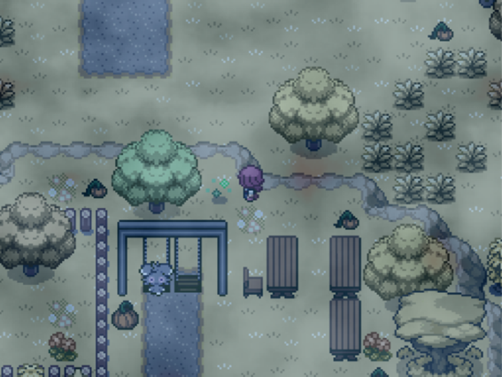
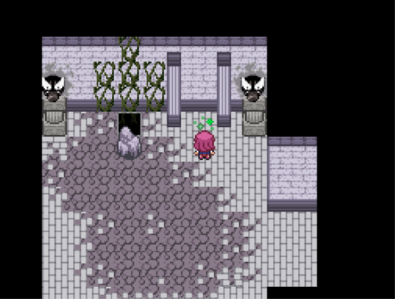

# Rejuvenation 13.5 100% Walkthough

- [About this guide](#about-this-guide)
- [Prologue](#prologue)
- [Intro](#intro)
  - [Passwords](#passwords)
    - [Quality of Life Passwords](#quality-of-life-passwords)
    - [Difficulty Passwords](#difficulty-passwords)
    - [Shenanigans](#shenanigans)
    - [Password Packs](#password-packs)
  - [S.S. Oceana (July XX, 20XX)](#s.s.-oceana-july-xx-20xx)
- [Chapter 1: Crossroads of Destiny](#chapter-1-crossroads-of-destiny)
  - [Oceana Pie](#oceana-pier)
  - [Gearen Laboratory](#gearen-laboratory)
  - [East Gearen City](#east-gearen-city)
    - [Quest 1: Save Starly!)](#quest-1-save-starly)
    - [Quest 2: Buizel Event](#quest-2-buizel-event)
    - [Quest 3: Missing Mother](#quest-3-missing-mother)
    - [Quest 4: Hidden Library](#quest-4-hidden-library)
    - [Quest 5: Love Letter!](#quest-5-love-letter)
    - [Quest 6: Dangerous Pokémon!](#quest-6-dangerous-pokémon)
    - [Quest 7: Battle Request!](#quest-7-battle-request)
    - [Quest 8: Wretched Music](#quest-8-wretched-music)
    - [Quest 9: PictoZumi](#quest-9-pictozumi)
    - [Quest 10: Bad Luck](#quest-10-bad-luck)
  - [Gearen Alleway East Side](#gearen-alleway-east-side)
  - [Abandoned Sewers](#abandoned-sewers)
  - [Game Corner Prizes](#game-corner-prizes)
  - [PoisonHeart Badge](#poisonheart-badge)
  - [Post-Gym Quests](#post-gym-quests)
    - [Quest 11: Zygarde Quest](#quest-11-zygarde-quest)
    - [Quest 12: Virtual League (First Gym)](#quest-12-virtual-league-first-gym)
  - [Route 1 and Goldenwood Forest](#route-1-and-goldenwood-forest)
    - [Quest 13: Lost Girl!](#quest-13-lost-girl)
    - [Quest 14: My Darling Furfrou](#quest-14-my-darling-furfrou)
    - [Quest 15: The Big Catch!](#quest-15-the-big-catch)
  - [Goldenwood Cave](#goldenwood-cave)
    - [Quest 16: Culvier Clan Quest (1st Member)](#quest-16-culvier-clan-quest-1st-member)
  - [The Ruins](#the-ruins)
    - [The Silent Grove [40](#the-silent-grove)](#the-silent-grove)
  - [Goldenwood Xen Attack](#goldenwood-xen-attack)
- [Chapter 2: Redemption](#chapter-2-redemption)
  - [Unlocked on Chapter 2 Start](#unlocked-on-chapter-2-start)
    - [Quest 17: Minccino Event](#quest-17-minccino-event)
  - [Junction Bridge](#junction-bridge)
  - [Route 2](#route-2)
    - [Quest 18: Painter Side Quest](#quest-18-painter-side-quest)
  - [Amethyst Cave 1st Visit](#amethyst-cave-1st-visit)
  - [Post-Amethyst Cave 1st Visit](#post-amethyst-cave-1st-visit)
    - [Quest 19: Karrina's Gang Fight](#quest-19-karrinas-gang-fight)
  - [Sheridan Village](#sheridan-village)
    - [Quest 20: Lost Boyfriend](#quest-20-lost-boyfriend)
  - [Amethyst Grotto](#amethyst-grotto)
    - [Quest 21: Hidden Library 2](#quest-21-hidden-library-2)
    - [Quest 22: Stolen Cargo!](#quest-22-stolen-cargo)
    - [Quest 23: Trade Me!](#quest-23-trade-me)
    - [Quest 24: Fetch an Item!](#quest-24-fetch-an-item)
    - [Quest 25: Battle Request 2](#quest-25-battle-request-2)
    - [Quest 26: Move Relearner Quest](#quest-26-move-relearner-quest)
  - [Diamond Punch Badge? - Badge1.5](#diamond-punch-badge---badge1.5)
  - [Carotos Mountain](#carotos-mountain)
  - [Diamond Punch Badge](#diamond-punch-badge)
- [Chapter 3: Tainted Light](#chapter-3-tainted-light)
  - [Cut Detour](#cut-detour)
  - [Chrysalis Courtyard](#chrysalis-courtyard)
  - [Chrysalis Manor](#chrysalis-manor)
    - [Quest 27: Extra Chrysalis Trial](#quest-27-extra-chrysalis-trial)
  - [Normality Badge](#normality-badge)
- [Chapter 4: Isolation](#chapter-4-isolation)
  - [Detour Before Route 3](#detour-before-route-3)
    - [Quest 12: Virtual League (Second Gym)](#quest-12-virtual-league-second-gym)
  - [Journey to Goldenleaf Town](#journey-to-goldenleaf-town)
    - [Quest 12: Virtual League (Third & Fourth Gyms)](#quest-12-virtual-league-third-fourth-gyms)
    - [Mirage Woods](#mirage-woods)
    - [Quest 28: Broken Bell](#quest-28-broken-bell)
    - [Quest 29: Cranky Crobat](#quest-29-cranky-crobat)
    - [Route 3](#route-3)
    - [Phasial Cave](#phasial-cave)
    - [Quest 28: Broken Bell (Continue)](#quest-28-broken-bell-continue)
    - [The Iron Gate](#the-iron-gate)
  - [Goldenleaf Town](#goldenleaf-town)
    - [Detour Before Wispy Path](#detour-before-wispy-path)
  - [Journey to Wispy Tower](#journey-to-wispy-tower)
    - [Wispy Path](#wispy-path)
    - [Goldenwood Forest Revisit](#goldenwood-forest-revisit)
  - [Wispy Tower](#wispy-tower)
    - [Forsaken Laboratory](#forsaken-laboratory)
  - [Phantasm Badge](#phantasm-badge)
    - [Detour Before Wispy Ruins](#detour-before-wispy-ruins)
    - [Quest 16: Culvier Clan Quest (4th Member)](#quest-16-culvier-clan-quest-4th-member)
- [Chapter 5: Imprisoned](#chapter-5-imprisoned)
  - [Wispy Ruins](#wispy-ruins)
    - [Mystery Egg ](#mystery-egg)
  - [Route 4](#route-4)

**Contents in middle pending to finish. The contents after this point may also be incomplete.**

- [Karma Files (Paragon Route Chapter 0)](#karma-files-paragon-route-chapter-0)
  - [Awakening Adrest](#awakening-adrest)
  - [December 6th \| A Light of Determination](#december-6th-a-light-of-determination)
  - [December 7th \| A Light of Friendship](#december-7th-a-light-of-friendship)
  - [December 10th \| A Light of Feathers](#december-10th-a-light-of-feathers)
    - [Side-story: Become a director](#side-story-become-a-director)
  - [December 11th \| A Light of Fire](#december-11th-a-light-of-fire)
    - [Legendary Wings Quest](#legendary-wings-quest)
    - [Teila Resort December 11th](#teila-resort-december-11th)
  - [December 12th \| A Light of Ice](#december-12th-a-light-of-ice)
  - [December 13th \| 2:00AM.](#december-13th-200am.)
  - [December 15th \| A Light of Family](#december-15th-a-light-of-family)
  - [December 16th \| A Light of Insanity](#december-16th-a-light-of-insanity)
  - [December 20th \| A Light of Violet Rose](#december-20th-a-light-of-violet-rose)
  - [December 21st \| A Light of a Violet Tower](#december-21st-a-light-of-a-violet-tower)
  - [December 22nd \| A Light of a Hidden Truth](#december-22nd-a-light-of-a-hidden-truth)
  - [December 24th \| A Light of a \#######](#december-24th-a-light-of-a)
  - [December 25th \| A Light of a Miracle](#december-25th-a-light-of-a-miracle)
- [Appendices](#appendices)
  - [All Special Evolution Locations](#all-special-evolution-locations)
    - [Moss Rock Evolution Environment](#moss-rock-evolution-environment)
    - [Icy Rock Evolution Environment](#icy-rock-evolution-environment)
    - [Magnetic Evolution Environment](#magnetic-evolution-environment)
    - [Cold Evolution Environment](#cold-evolution-environment)
    - [Alolan Marowak Evolution Environment](#alolan-marowak-evolution-environment)
    - [Galarian Weezing Evolution Environment](#galarian-weezing-evolution-environment)
    - [Alolan Exeggutor Evolution Environment](#alolan-exeggutor-evolution-environment)
    - [Hisuian Lilligant Evolution Environment](#hisuian-lilligant-evolution-environment)
    - [Hisuian Braviary Evolution Environment](#hisuian-braviary-evolution-environment)
    - [Hisuian Sliggoo Evolution Environment](#hisuian-sliggoo-evolution-environment)
    - [Hisuian Avalugg Evolution Environment](#hisuian-avalugg-evolution-environment)
  - [Complete the V13.5 Dex (Pending to Update properly)](#complete-the-v13.5-dex-pending-to-update-properly)
    - [Must Breed](#must-breed)
    - [Must Evolve by Level](#must-evolve-by-level)
    - [Must Evolve by Item](#must-evolve-by-item)
    - [Must Evolve by Friendship](#must-evolve-by-friendship)
    - [Must Evolve by Other Means](#must-evolve-by-other-means)
  - [V13.5 Unobtainable Pokémon](#v13.5-unobtainable-pokémon)
    - [Starter Choices](#starter-choices)
    - [Aevian Forms:](#aevian-forms)
    - [Completely Unobtainable](#completely-unobtainable)
    - [Unobtainable Legendaries Paragon Route:](#unobtainable-legendaries-paragon-route)
    - [Legendaries Renegade Route:](#legendaries-renegade-route)
  - [Pickup Table](#pickup-table)
  - [Crest Descriptions](#crest-descriptions)
- [Eizen Reply](#eizen-reply)
- [New Quests](#new-quests)
  - [Spiteful Ex](#spiteful-ex)
  - [A Souvenir for Mom](#a-souvenir-for-mom)
  - [Tantalizing Temple](#tantalizing-temple)

# About this guide

This guide is based and inspired on BIGJRA's guide for Rejuvenation V13,
you can consider it an upgraded version of it.

Due to BIGJRA wanting to focus on finishing the Reborn guide with no
date for when the Rejuvenation 13.5 would be started, it was asked in
the Discord if someone else was going to make one due to considering
BIGJRA's discontinued.

The format is inspired on his guide, but I can't say it is the same as
if he did it since I do things my way, although since I use his guide
as a base for text and git page, you will likely feel it similar.

I am adding as much detail as I can and I am putting data for important
battles in both Story Mode and Classic Mode, and all items, including
Hidden Items. Still, I heavily recommend using my mod
**ItemfinderUnhideItems** to make all hidden items visible if you wish
to get them all as it will be far easier than following instructions to
take steps.

There are lots of changes from the previous version. Some areas may
still be similar, but others are completely remade. The bosses now have
HP Bars instead of shields. In general, the difficulty of battles on
Classic seems to be the same or has been lowered a bit on some of the
tougher ones.

It is included on the Rejuvenation 13.5 QoL Mod Compilation Pack. They
are all modular, so no need to add anything you don't wish to:
[https://www.rebornevo.com/forums/topic/65994-Rejuvenation-135-qol-mod-compilation-pack-small-bug-fixes/](https://www.rebornevo.com/forums/topic/65994-rejuv-135-qol-mod-compilation-pack-small-bug-fixes/)

I am also using Dred's Excel guide to get information to put on this
written guide, but there are same differences in order of some things
and the rarely wrong encounters:
<https://docs.google.com/spreadsheets/d/1BjtFPXn8G37j621l_68fBcoNx3Qsvrg1idjS6c_Umls/edit?usp=drivesdk>

You can check all Field Effects on a txt that comes with the game. It is
important to use the fields appropriately, so check it when needed. The
game will show which moves you have are boosted or weakened by the
field.

For first time players or those that forgot the \"M\" key toggles a
speed-up of the game.

If you find any errors, please tell me on the forum post or Discord.

# Prologue

The game will start off asking if you want to skip the prologue.
Rejuvenation is a very story-focused game, so I recommend viewing it if
it is your first time playing. If you do skip the prologue, jump ahead
to the **Intro** section.

As soon as you are done reading the Zorua and Pangoro story, you will be
in control of Maria. You have to head downstairs to talk to your mom.
Afterwards you can enter the bottom room on the left side of the first
floor and head downstairs and interact with the summoning table for an
extra scene.

Now, head back upstairs and talk to your dad in the top-left room. Then
return to the kitchen to talk to your mom and once that is done go back
to your room upstairs.

After a scene that indicated something happened downstairs, return there
and talk with the mysterious figure. Head west back down to the basement
to watch the cutscene.

After regaining control, with the character now called Marianette, head
down, right, and up through the hallway. You will watch a final cutscene
before the prologue ends.

# Intro

After either skipping the prologue or finishing it, the game will ask
you which difficulty mode you want. This can be changed latter on Mr.
Luck's tents, but you can't always access them.

As of 13.5 there is only Story Mode and Classic Mode. **This guide will
be showing the teams for both modes, look at the battles of the one you
are using.** If something doesn't match the guide on your difficulty,
please report it. For those looking for harder fights you can pick
Classic Mode as that is the only difference between both modes. Be aware
that the mons of some trainer may vary between both modes, it isn't just
the levels and moves, but the total number and the species.

Register yourself as a trainer. You will choose your pronouns first and
then among genders and six sprites. You can also choose to do a
personality test.

Please note that while the pronouns will affect if you are treated as a
girl, boy, or non-binary in some scenes, usually people will refer to
you as they/them when talking to you in third person regardless of what
you chose. That is fully intended and not a bug.

Now, Amanda will ask if you want to input a password. You have a full
list of passwords in the following link, but there will be a small
explanation of them in the guide:
<https://docs.google.com/spreadsheets/d/1UMWQWrvG-NGLXBNHQUsizrFYM1RImfydUT9WN1IZDT8>

Some will add QoL things while other will make the game harder or
easier. Choose depending on which you wish for yourself or don't choose
any. I heavily recommend at least giving them a look.

## Passwords

You can freely add passwords at the beginning of the game, but if you
want to add them later, you can with some of them (others are game start
only), but at the cost of a Data Drive, which are quite limited. Some
passwords can't be deactivated after being activated.

### Quality of Life Passwords

The **mintyfresh** password allows you start with some mints, which
means fewer soft resets to get our starter with the nature we wish, same
for mons we want to get in our party later.

The **freeexpall** gives you a free Exp All from the beginning. You can
turn it on and off, so I recommend having it.

The **shinycharm** password let you start with a shiny charm from the
beginning, and the **freemegaz** allows you to get a Mega-Z Ring at the
same point. It doesn't include megastones nor Z crystals.

The **easyhms** password is one of my favorites. Giving you all the
Golden Tools to use HMs without having a mon that knows the mov. You
still need to unlock the HM and have the appropriate badge.

The **powerpack** password gives you the EV training keycards from the
beginning, so you can use the rooms to train the EVs of your mons from
the moment you get your starter.

Until here, they are all things you can get later without the passwords,
so they are just a matter of getting the things early on. The following
Quality of Life passwords are different as are things you won't get
unless using a password or a mod.

The **earlyincu** password enables the Incubator in the Daycare. It lets
you get the eggs without having to wait and making them hatch in one
step. It is extremely useful to save time when breeding. Of course, you
have to get to the Daycare to use it.

The **freeremotepc** password is one that puts Rejuvenation at the same
point as current official games in PC access. Before you had to go to a
PC to access the PC, but on recent games, you can access it anywhere
(with very few exceptions) to change your mons. The Remote PC allows you
to do the same using a Key item. Register it to have it easy to access
without having to go to your bag.

The **nopoisondam** password erases the effects of poison on the
overworld, thing that has been happening in the official games for a
while.

The **nodamageroll** password disables the damage variation for battle.

The **pinata** password allows you to get EXP candied from level up
trainers (breeders) without the need of fighting them.

### Difficulty Passwords

There are diverse passwords both to make the game easier and harder
depending on what one you use.

The **litemode** password makes all the opponents have 0EVs and 0IVs,
which will make fights significantly easier.

The **nopenny** password makes opponents give you only a 20% of the
money, which makes buying items a lot harder requiring you to be more
careful with the spending of money.

The **fullevs** password makes all the opponents have 252EVs in each
stat and 31IVs, which will make fights significantly harder.

The **noitems** password makes it so that the player can't use medical
items in battle.

The **moneybags** password makes opponents give you double money, which
makes buying items a lot easier without having to think that much when
buying.

The **fullivs** password makes that all the mons you get got 31 IVs on
all stats.

The **emptyivs** password makes that all the mons you get got 0 IVs on
all stats.

The **leveloffset** password allows you to increase or decrease levels
from all trainers.

The **percentlevel** password allows you to increase or decrease levels
from all trainers by a set percentage.

The **stopitems** password makes it so that the opponents can't use
items in battle.

The **stopgains** password makes it so that your mons won't gain EVs.

The **noexp** password prevents your mons from getting EXP.

The **flatevs** password makes all the opponents have 85 EVs in each
stat.

The **noevcap** password allows the player to gain 252 EVS in each stat.

### Shenanigans

These are more varied.

The **gen5weather** password makes weather become infinite in battle
unless it is changes by another move or ability.

The **unrealtime** password makes time to not be synced with the real
world. If the password is set, you can toggle it on an off in options,
and also set how fast the times goes in-game. I consider this password a
must have from the beginning even if you don't plan to use it
immediately given that you can toggle it on and off at will on options.

The **eeveeepls** password lets you choose Eevee as your starter. Note
that this will only make Eevee appear as an option, but you won't be
forced to choose it.

The **fieldfrenzy** password makes moves boosted by the field more
powerful and weakened moves weaker.

The **nointro** password allows you to skip the intro. If you use it,
you can continue this guide at Chapter 1. I don't recommend skipping it
if this is your first playthrough. Note that you will miss a Friendship
Point Choice if you use this password.

The **9494** password lets you play as Ana, a character you meet on a
Quest later on that you might now if you have played the game before
even if it was on previous versions.

The **terajuma** password lets you skip the game to start directly on
Terajuma, which is the area that has been changed the most between V13
and 13.5. It also allows you to set your route to either Paragon or
Renegade. Your starting team will predefined based on what character you
are playing. Check the password link shared earlier for more details of
those teams.

The **hello eizen.** password exists (the dot at the end is part of the
password), but using it or not just gives you an extra line of text on a
certain Quest if you do things right. No real effect outside that.

### Password Packs

These give you several passwords at once. If you already put the
password individually, don't use the pack.

The **casspack** password activates: noitems, fullivs, easyhms, norolls

The **easymode** password activates: fullivs, moneybags, litemode,
stopitems

The **hardmode** password activates: noitems, nopenny, fullevs, emptyivs

The **qol** password activates: easyhms, nopoisondam, freeexpall

Once you have finished imputing passwords, you will really start the
inro of the game.

## S.S. Oceana (July XX, 20XX)

Once you are in control of your character, exit the room, which will
trigger a talk to Mom.

With certain actions and dialogue choice, you can gain or lose
Friendship Points. I will document all of them in this guide. (Search
\"Friendship Point\" to see them all). Any choice without mention means
that it is irrelevant or just adds very immediate dialogue variation.

**Friendship Point Choice:**
-   I\'m fine. (Mom +2)
-   \... (Mom -1)

Once the dialogue is finished, you can explore the S.S. Oceana. In this
game talking to everyone and everything you see can be vital to
discovering new mons, items, and lore, so it\'s a good idea to talk to
everyone aboard. This guide aims to document everything important, but
it is still good to enjoy the world and talk to its inhabitants.

You can't have mons yet, and there isn't any item in this ship, but
lore-wise there are some important things to do.

Heading to the stairs on the left, in the two rooms you can enter on the
leftmost side, upper and lower rooms, there are two notches in the wall,
which you can interact to spy the conversations of the neighboring room.

The top one is your room and spying from there lets you see a scene
between Mom and another girl, Crescent.

In the room of the lower side, you can hear the conversation between
unknown people, but they are quite suspicious.

Head up the stairs three times to the right to talk to Captain Augustus
Briney, but feel free to explore the rest of the ship, you can even try
to talk to Crescent on the deck. Once you reach the Capitan the
conversation will start. Now you can ask a few things about Aevium, the
region you are about to reach. You should ask for everything if this is
your first time.

Head downstairs and enter the double doors to the upper middle room to
reach the banquet. Talk to Mom to get the banquet started when you\'re
ready.

Once you regain control, follow the path, and watch the events play out.

# Chapter 1: Crossroads of Destiny

## Oceana Pier

Regardless of if you played the part of the S.S Oceana or skipped it,
you are now at shore on Oceana Pier.

You have been saved by Tesla's Talonflame, although you are the only one
who got saved.

Once you regain control, you can explore Oceana Pier.

If you haven\'t touched options yet, activate backups. Saves may get
corrupted, so having a lot of backups helps. Better to lose a bit of
playtime than everything.

If you used the **unrealtime** password, remember to activate the option
in the options menu for it to work since the password makes the option
appear.

Anyways, if you want to talk to the woman on the northeast pier, you can
get an all-expenses paid trip to Hoenn, but it will trigger a game over.
Otherwise, there isn't anything to do here yet, so head into the gate on
the north side. And to the north again to reach East Gearen City.
Continue north into the Gearen Laboratory as trainers won't let you go
on the other directions yet.

Just before entering the lab check the rock on the right to get a hidden
***Ice Heal***.

Now, enter the lab.

## Gearen Laboratory

You need to follow Amanda to proceed, but you can go to the shop and buy
some things if you with so. Depending on the difficulty you are playing
and your passwords, how much you can bear to expend will be different
through the game, so take it in account when buying.

There are only very basic products available here.

**Gearen Lab Shop**

  |**Item**    |**Price**|
  |------------|---------|
  |*Poké Ball* |\$200     |
  |*Potion*    |\$300     |
  |*Repel*     |\$350     |
  |*Antidote*  |\$100     |

Picking some Poké Balls may be a good idea although you will be gifted
some soon. Having a full team is important on this game, so you will
have to catch some mons soon. Of course, depending on your difficulty
and passwords it may be more or less needed.

After following Amanda and seeing the cutscene will be in the starter
room where you will select your starter among the options below. If you
talk to the rainbow-colored machine on the right side, it will randomly
choose for you among the 24 starters.

Starter Choices (You can only pick one):
-   **Bulbasaur**
-   **Charmander**
-   **Squirtle**
-   **Chikorita**
-   **Cyndaquil**
-   **Totodile**
-   **Treecko**
-   **Torchic**
-   **Mudkip**
-   **Turtwig**
-   **Chimchar**
-   **Piplup**
-   **Snivy**
-   **Tepig**
-   **Oshawott**
-   **Chespin**
-   **Fennekin**
-   **Froakie**
-   **Rowlet**
-   **Litten**
-   **Popplio**
-   **Grookey**
-   **Scorbunny**
-   **Sobble**

If you want to complete as most Dex as possible, **Torchic** is the only
option given that Torchic is the only starter that can't be gotten
anywhere else as of 13.5.

With Speed Boost, which is one of the abilities it can have, is the best
starter, which is also the reason it can't be obtained yet if not as
starter. If you want to aim for better IVs, nature, the ability you want
or to have it shiny, you can soft reset with F12, just save before
picking the starter.

The first gym specializes in Poison, so the Grass-type starters may be
difficult to use at first, making you having to rely on another mons you
catch far more. Still, you can choose whatever you want, starters are
all good on their own way even if they all aren't overpowered.

After having your starter, talk with Amanda to have your first battle.
This is one you can win or lose.

**League Scout Amanda (No Field). Story Mode.**
-   Hatenna. Level 4.
    -   Tackle
    -   Play Nice

**League Scout Amanda (No Field). Classic Mode.**
-   Hatenna. Level 5.
    -   Tackle
    -   Play Nice

Note that in this game you can press \"S\" to check the stats of all the
mons in battle, as well as the weather, field, and move effects in play
to aid you in your fights. Note that for enemies, you can only see the
stage increases in their stats as opposes to all stats like your own
mons. After the battle, she\'ll give you ***5 Poké Balls**.*

You should have leveled up in that battle if you won, remember that
there is a hard Level Cap, so you will only be able to reach level 18
until you get your first badge.

Now you can go back down. You need to approach Professor Jenner and
before you can take control again, you will enter another fight. Again,
you can lose.

**Pokémon Trainer Ren (No Field). Story Mode.**
-   Froakie, Level 4.
    -   Pound
    -   Growl

**Pokémon Trainer Ren (No Field). Classic Mode.**
-   Froakie, Level 5.
    -   Pound
    -   Growl

After the fight with Ren, Jenner asks you to visit Route 1 to help his
daughter, Melia. He then gives you the ***Pokédex*** and the
***CyberNav**!*

Leave the room and now there are some things you can do. First, heal
your starter since this time, you haven't gotten healed automatically.

The EV training center can be accessed by talking to the woman on the
lower part of the right counter. If you used the password, you should
have the keys to enter the rooms. You unlock them interacting to the
panels they have at their side. It is a good moment to train your EVs
before you get undesired ones from future battles. This isn't possible
without the password though.

In the EV Training rooms, you will fight trainers with level 1 mons made
to increase EVs quickly. The EVs should increase by 72 when defeating
the six mons the trainer has. Each mon gives you 12.

You should also have a Macho Brace if you used the password. If you
equip it, the EV gain on all stats will be 8 times the normal. With 3
mons you would have the stat maxed, but the trainers have 6 anyway.

There are also items in the training rooms that are specific to gain EVs
of such stat more quickly:
-   HP Room: ***Power Weight***
-   Attack Room: ***Power Bracer***
-   Defense Room: ***Power Belt***
-   Special Attack Room: ***Power Lens***
-   Special Defense Room: ***Power Band***
-   Speed Room: ***Power Anklet***

In these rooms you will find two items close to the entrance, the one
with yellow top heals you as in a Pokémon Center, while the green one
gives you access to the PC. You will see these a lot.

## East Gearen City

Now we can move freely and explore the city, but there are some Quests
to do, first one can be started inside the Gearen Laboratory.

This guide won't cover all trainers, only important ones, but there are
many through the game.

### Quest 1: Save Starly!

Now you can get your first Quest by talking with the girl with an
exclamation on her head inside the Gearen Laboratory and agreeing.
Strictly speaking, this Quest can also be gotten in the Help Plaza, and
in the guide, we will get them there if they can be gotten there from
now on, but since this is the first one, we will pick it up right now.

If you wish to go to the Renegade Route, I recommend avoiding doing
Quests like this that will give you Karma. If you want to go to the
Paragon Route, it is better to do all Quests. Note that you can do
Renegade Route even if you do all Quests that give Karma, but you will
have to be more careful with other things.

In this Quest you need to save the Starly of the poor girl, so rush to
Oceana Pier.

Before entering the gate, but at the very bottom go a bit west to find a
rock that has a hidden ***Poké Ball***. There is a hidden
**GourmetTreat** in the grass field just above it, the hidden item is on
the only tile without grass, which depicts some flowers.

It is possible to trigger another Quest at the Oceana Pier Gate, but
that one can be started at the Help Plaza, so we will be starting it
there later instead of skipping the first step and starting it here. It
works anyway, but for guide purposes we are not skipping steps. Feel
free to Check Quest 5 if you want to trigger the Quest right now.

Once in Oceana Pier, we can go southwest to find the culprits and the
poor Starly, but there is something to do first.

We can make a small detour on the park full of **Fletchling**. This is a
very good incorporation to our team, and the only place where it can be
caught (its evolution Fletchinder is available later though), and they
come with Quick Guard, which is very useful to have. Even if you don't
want to use them in your main team, it is good to have one. On this area
there are two hidden items, a ***[Sweet Heart]*** on the
bottom right and an ***X Accuracy*** two tiles left and one up.

You can also catch a **Male Nidoran** going up from the park and using
the GourmetTreat we got earlier.

Now go to those thugs who kidnapped Starly, and you will have to fight
one of them.

**Gang Member Den (City Field)**
-   Story Mode: Wimpod level 7, and Grubbin level 8.
-   Classic Mode: Wimpod level 8, and Grubbin level 9.

It is always raining when I do this fight, but I am not certain if this
is my luck or something fixed.

After defeating Gang Member Den, a new character called Karen is
introduced and deals with them all. Starly is safe and can return with
the little girl.

When you go to talk to the girl in the lab again, you will be able to
claim your reward at the Help Center latter which is \$890, 2
***Potions*** and also +1 Karma. Still, check the next Quest before
going back to report to the girl.

### Quest 2: Buizel Event

Before going to claim the rewards of the previous Quest we can trigger
another Quest, but this one isn't tracked by the Quest Menu.

Enter the house that is a bit north to you after saving Starly in the
previous Quest, the Ferry Terminal. This Quest must be done before
obtaining the 12th badge, and it is normal in this game to be locked
out some areas for long periods so not get confident you can do it later
despite the time limit seeming far from you.

You have to speak with the blonde guy to learn that he threw away his
Buizel because it was too weak.

You will hear a Buizel after leaving, and then the Buizel appears and
goes in the direction of Gearen City, so we need to follow.

We will be returning to East Gearen City.

We ignored them before, but the patches of grass around Gearen City are
now available, so we can catch some new mons.

**Left East Gearen City Encounters (City Field)**

|**Grass: Morning**   |**%**   |**Grass: Day**   |**%**   |**Grass: Night**    |**%**  |
|---------------------|--------|-----------------|--------|--------------------|-------|
|**Wurmple**          |27      |**Wurmple**      |27      |**Wurmple**         |27     |
|**Alolan Rattata**   |25      |**Bidoof**       |25      |**Alolan Rattata**  |25     |
|**Pidgey**           |15      |**Pidove**       |15      |**Poochyena**       |15     |
|**Patrat**           |15      |**Patrat**       |15      |**Hoothoot**        |15     |
|**Bellsprout**       |12      |**Bellsprout**   |12      |**Oddish**          |12     |
|**Sunkern**          |6       |**Sunkern**      |6       |**Chingling**       |6      |

**Chingling** can help in the fight against the gym dramatically,
especially if you manage to evolve it. Use the Spice Scent of your
CyberNav and set it to 9999, which will give you a mon on every step.
Flee from those you don't want until you get what you desire. Setting it
to 0 prevent all encounters, so don't buy or use Repels.

Now go to the east to reach the right part of East Gearen City, the mons
here are different. If you turn right at the street just below the
Gearen Lab, you can find a hidden item, ***Oran Berry***, at the right
side of the door of the first house you see with one. This house has the
NPC Name Rater, which isn't really useful since you can rename from your
party menu.

Speak with the glasses guy a bit below to get a ***Reverse Candy***. Go
below and on the rock, there is a hidden ***Potion***.

You are probably already fighting some trainers. They are not difficult,
and several of them are avoidable, but it is better to fight them for
easy money and exp.

Return up and go left as soon as you can, now go down to the rock to
find a hidden ***Green Shard***.

Continue east and you will reach the right part of East Gearen City,
which has different encounters than the left part we were before.

Just before the area changes, there is a hidden ***Oran Berry*** on the
cleared patch of grass.

**Right East Gearen City Encounters (City Field)**

  |**Grass: Morning**   |**%**   |**Grass: Day** |**%**   |**Grass: Night**   |**%**  |
  |---------------------|--------|---------------|--------|-------------------|-------|
  |Alolan Rattata       |30      |Bidoof         |30      |Alolan Rattata     |30     |
  |**Paras**            |28      |**Paras**      |28      |**Jigglypuff**     |28     |
  |Patrat               |25      |Patrat         |25      |Poochyena          |25     |
  |Pidgey               |15      |Pidove         |15      |Hoothoot           |15     |
  |**Klink**            |2       |**Klink**      |2       |**Klink**          |2      |

Here it is important to catch a female **Jigglypuff** for breeding. You
can also catch a male one if you don't want to bother with Egg Groups
later.

You will find a blue building going up, enter there and go to the 1F.
You can pick **Iron** here on the right side and an **Old Rod** on the
bottom-left side. With the Old Rod, we can now fish. I recommend
assigning it to have it quick to access.

The third floor is dangerous, there is a battle against a trainer that
has a level 76 mon, so avoid it! There is nothing else to do on this
building for now, so leave.

Align yourself with the upper part of the hose on the lower part of the
street and walk five steps to the right to find a hidden ***Repel***.

Continue to the right and you will see the first patches of grass of
this area put yourself on the second from the left and inspect looking
down to find a hidden ***Tiny Mushroom***.

From this place, you should be able to see a Reverse Candy on the right
area of the patches, near the sea. Go left from here until you are two
tiles away from the rightmost side, you will find a hidden ***Blue
Shard***.

Go a bit up and you will see three garbage containers, there is a hidden
**Antidote** on the middle one.

Up, there is a station area, you can't enter the station but in the
middle of the boxes on the right area there is a hidden ***Exp. Candy
S***.

Now we have to go up from the left of the station. Here you will see the
Truck Guy, who will be able to move us between areas, but right now, we
can't move anywhere else even if we try.

On the left there is a Pokémart that sells *GourmetTreats*, which I
heavily recommend to stock since a lot of mons on the overworld require
them to get a chance to catch them.

**East Gearen Market Shop: Top-left**

  |**Item**          |**Price** |
  |------------------|----------|
  |*Poké Ball*       |\$200     |
  |*Burn Heal*       |\$250     |
  |*Potion*          |\$300     |
  |*GourmetTreat*    |\$1500    |
  |*Repel*           |\$350     |
  |*Reverse Candy*   |\$50      |

Go left to find a man that sells overpriced Poké Balls at \$400, buy
four of them to get a **Voltorb**. It is possible to get more later, but
it is nice to get one now if you can afford the total of \$1600.

Only during the daytime on Tuesday, Thursday, and Saturday there is one
more vendor at the side of the one giving you the Voltorb.

**East Gearen Market Shop: Bottom-right**

  |**Item**         |**Price** |
  |-----------------|----------|
  |*Reverse Candy*  |\$50      |
  |*Soda Pop*       |\$300     |

In the garbage container south of that man and the other merchant, there
is a hidden **Clever Wing**.

We are going to ignore the Petal Salon for now, but let's make a quick
visit to the top building in this area, which sells a couple of special
balls you may want.

Poké Ball Boutique

  
  |**Item**      |**Price** |
  |--------------|----------|
  |*Heavy Ball*  |\$300     |
  |*Moon Ball*   |\$300     |

Go east, and on the rock, there is a hidden ***Potion***.

Go to the east to find the Buizel. You will have to fight its previous
trainer.

**Charmer Buzzington (City Field)**
-   Story Mode: Bulbasaur level 8, Exeggcute level 8, and Rhyhorn level
    9.

-   Classic Mode: Bulbasaur level 9, Exeggcute level 9, and Rhyhorn
    level 10.

Once you defeat him, **Buizel** will want to join you.

Just under the entrance of the hotel at the north, on the left side,
there is a hidden ***Paralyze Heal***.

Move west and north and you will see a **Super Potion** close to a
factory, on the rock behind there is a hidden **Resist Wing**. East and
north from the Super Potion there is a hidden **Super Repel** in a rock.
Just under the barrels on the left side, there is a hidden ***Poké
Ball**.*

If you try to go to all way to the west, you will be back on the left
part of East Gearen City, but in the northern part of it, there is a
hidden ***Yellow Shard*** on the left side of the right building, the
one with blue lines.

Go north and on the right part of the container there is hidden
**GourmetTreat** near a **Female Nidoran** and on the end of the small
way on the top left there is a hidden ***Super Repel***.

Talk to the Female Nidoran and she will flee to the west. We need to
find her again, but I will cover this later.

Put yourself on the dark green grass on the right side looking down to
find a hidden ***Grass Gem***. On the bottom right patch of grass, look
down for a hidden ***Resist Wing***.

Enter the green building, the Emerald Apartments, talk to the man in
front of the elevator and defeat him to become able to use the elevator.
Talk with a green-clothed woman to learn of strange things happening on
the third floor at night.

On the second floor talk with the woman in pink to receive a ***Super
Repel***. You can also find a **Red Shard** on the lower right. The red
haired person will gift you a ***Full Heal***. There is also a trainer
to fight.

Enter the third floor at night to battle a level 5 **Shuppet**. Try to
catch it.

You can now go to the building at the left, which is the Help Center.

We can do a small detour first on the northwestern area.

Note that if you try to cross a bridge to access the northwest area, you
will be stopped by a guy, who will ask you to pay \$300 to cross or
defeat him. Defeating him give you Karma +1, so it is better to defeat
him on Paragon Route and pay on Renegade route. 1 of karma isn't very
relevant, but this one is easy enough to get/reject.

**Tourist Kageyama (City Field)**
-   Story Mode: Torchic level 13, Hippopotas level 12, Wingull level 13

-   Classic Mode: Torchic level 12, Hippopotas level 13, Wingull level
    12

On the rock of this area there is a hidden **Super Potion**. On the
upper side of the lowest container, there is a hidden ***Yellow
Shard***.

Go north and on the flowers between three patches of grass there is a
hidden **Red Shard**.

You can also find the Female Nidoran once again. She will run
south-east. Go to the area just right of the Name Rater and you will
find her again. She will run again, but this time, you won't be told the
direction. She is in front of the Help Center in one of the benches.

She runs again. Go to the northwestern are and cross the bridge south,
then move right across the purple building and you will find her again.
This time you can battle and try to catch her.

In the box that is right there, there is a hidden Burn Heal.

Now return to the Help Center.

If you have talked to the girl in the Gearen Lab after saving Starly,
you will receive the Reward from the Save Starly Quest when speaking to
the girl in the counter and you can also accept more Quests by
inspecting the center of board. This guide is going to do them in order.

### Quest 3: Missing Mother

This Quest gives Karma.

Go all way west to find the Petal Salon, which we ignored before. You
can find the Berry Emporium there.

Berry Emporium

  
  |**Item**      |**Price** |
  |--------------|----------|
  |*Oran Berry*  |\$200     |
  |*Pecha Berry* |\$300     |

Berries may be useful for the gym. Especially Pecha Berries for poison
since that is the type of the first gym leader.

On the upper floor you can find the woman who issued the Quest, Sasha.
Talk with her to start the Quest.

You now have to go to the Aqua Apartments, which we visited before.
Remember the blue building. It is a bit south from the Petal Salon.

Your target is on the second floor. Speak with the girl with the
exclamation mark. Remember to avoid the third floor.

Return to Sasha and talk to her. Now go to the Velvet Apartments. They
are at the left of the Gearen Laboratory so return there and enter.

You can find a **Repel** in the house left of the Velvet Apartments, but
due to the existence of Spice Scent, it is already obsolete, you may
want to get it like others just because you don\'t like to left items on
the floor though.

On the Velvet Apartments Floor 1. Talk with the woman in the middle to
get a ball that is better to catch certain types depending on your
choice:
-   Left: ***Mineral Ball*** (Rock, Steel and Ground)
-   Right: ***Steam Ball*** (Fire and Water)

In the same room you can fight a trainer and ger a ***Great Ball***.

On the Floor 2 there is a **Potion** in the ground and a running
**Pachirisu** that appears only at night. You need to give it a
GourmetTreat to fight him and try to catch it.

On the Floor 3 you can find an ***Exp. Candy XS***. Now talk with the
southwest girl , which is close to the item we just got, and our next
target are the Emerald Apartments, which we already visited before.

In case you forgot, the Emerald Apartments are west of the Petal Salon.

Enter and talk to the red-haired person with an exclamation mark to
proceed. When trying to leave you will trigger a cutscene.

Return to the Petal Salon to report to Sasha. Now, follow her and talk
again in front of a building in Oceana Pier. Enter after her. You will
have to defeat a trainer.

**Prima Donna Stella (Factory Field)**
-   Story Mode: Loppuny level 17.
-   Classic Mode: Loppuny level 19.

It should be easy if you picked Torchic and has evolved into Combusken,
or any other starters that evolve into fighting type. Otherwise, try to
have your mons as higher as you can, before the first badge, you can
only reach level 18 due to the level cap.

If we go back to the Petal Salon we can get a free haircut for one of
our mons, which boosts friendship. Helpful for friendship evolving
Pokémon like Chingling, and if you have it on your team, evolving it
before the gym is really recommended. It will cost \$1500 after the
first and it can be done only once a day.

Go to the Help Center to receive \$550 as a reward and +1 Karma.

### Quest 4: Hidden Library

This Quest gives Karma.

After picking it up you can go to the upper floor of Gearen Lab and in
the right room there you will find a man with an exclamation mark, talk
to him. It is possible to talk to him without having picked up the quest
in the Help Center since the moment you got your starter.

Now go to talk with the woman in front of the Help Center with an
exclamation mark.

Next, then talk to Karrina in south-east Gearen.

Now, you need to talk to the receptionist at the Chrisola Hotel, so we
will be visiting it.

Go through the hotel area at the east and then north to pick **Iron**.

On the west side, at the right of the solitary patch of grass in the
north, there is a hidden **Green Shard**.

Going thought the labyrinth east of the hotel's entrance, you can get
and ***Antidote***, a hidden **Repel** on a rock about at the middle,
**TM83 Infestation**, and in the rock just at its side a hidden **Red
Shard**.

Now enter the Chrisola Hotel.

Entering the Chrisola Hotel gives us a Friendship Point (Saki +1). Talk
to the receptionist.

After you regain control, talk to a man in the bottom right for a
**Super Potion***.*

Enter the right hallway. In the first room you can get **TM126
Whirlpool***.* Now go to the hallway on the left, head into the open
room at the top and interact with the tile down and right from the top
left plant to get \$1500.

Now take the elevator and head to the Casino level and talk to the
red-haired person. They\'ll flush their Coin Case down the drain so we
can pick it up later.

You would have probably noticed a few popups regarding achievements thus
far. Complete them and you will earn AP (Achievement Points), redeemable
here. For now, we probably can\'t get much but you may already have a
lot if you used the passwords. Anyways, talk to the girl on the right
side to get an ***Achievement Card**.*

**AP Shop**

  
|**Item**             |**Price**  |
|---------------------|-----------|
|*Adamant Mint*       |3 AP       |
|*Jolly Mint*         |3 AP       |
|*Brave Mint*         |3 AP       |
|*Timid Mint*         |3 AP       |
|*Modest Mint*        |3 AP       |
|*Quiet Mint*         |3 AP       |
|*Calm Mint*          |3 AP       |
|*Bold Mint*          |3 AP       |
|*PP Up*              |6 AP       |
|*Golden Axe*         |10 AP      |
|*Golden Hammer*      |10 AP      |
|*Golden Surfboard*   |15 AP      |
|*Golden Gauntlet*    |15 AP      |
|*Golden Scuba Gear*  |15 AP      |
|*Golden Wings*       |20 AP      |
|*Golden Jetpack*     |20 AP      |
|*Golden Drift Board* |20 AP      |
|*Golden Claws*       |20 AP      |
|*Exp. All*           |30 AP      |
|*HP Card*            |10 AP      |
|*Atk Card*           |10 AP      |
|*Def Card*           |10 AP      |
|*Speed Card*         |10 AP      |
|*Sp. Atk Card*       |10 AP      |
|*Sp. Def Card*       |10 AP      |
  

Depending on your passwords, the one-time items won't appear to buy
since you will already have them.

We will be visiting the rest of the hotel later, for now return to the
man who asked you to gather information who is waiting for you at the
upper floor of the Gearen Lab and answer his questions.

Go to the Help Center to claim your reward: ***5 Great Balls***, ***3
Timer Balls** and* +1 Karma

### Quest 5: Love Letter!

This Quest gives Karma.

Time for the next quest, we have ben delaying this one quite a while.

Go to the upper floor of Oceane Pier Gate, and receive the ***Love
Letter***.

We also need a Burn Heal, which you either found as a hidden item or
need to buy one in Poke Mart.

Give the Love Letter and the Burn Heal to Cameron, who is east of the
Petal Salon on a bench, and return to the man who gave you the letter
and talk to him.

Go to the Help Center to claim your reward: \$350, a ***Nugget*** and +1
Karma.

### Quest 6: Dangerous Pokémon!

This Quest gives Karma.

After accepting the Quest go to Oceana Pier, and head right.

You will have to fight a Boss Pyroar, the Pride King. Bosses can have
several HP bars and effects may happen when changing from one bar to
another. Remember that you are still on City Field.

**Pride King (City Field). 2HP Bars. Story Mode.**
-   Pyroar. Level 15.
    -   Take Down
    -   Noble Roar
    -   Fire Fang
    -   Roar

**Pride King (City Field). 2HP Bars. Classic Mode.**
-   Pyroar. Level 20.
    -   Take Down
    -   Noble Roar
    -   Fire Fang
    -   Roar

He has two HP bars and when only one is remaining, he will call a Litleo
as support. Having several HP bars and things happening when one is
depleted is something you will get used as this is how bosses work in
Rejuvenation 13.5.

If find it too hard, especially on classic, you can come back to do this
quest later, after we got the first gym badge, but it is perfectly
doable right now.

If you win, **Litleo** will join your team regardless of your opinion.

Go to the Help Center to claim your reward: \$350, a ***Super Potion***
and +1 Karma.

### Quest 7: Battle Request!

This Quest gives Karma.

For this Quest, go to the Chrisola Hotel. Now it is time to head up to
the top floor of the building, the Chrisola Hotel Rooftop.

There is a breeder up here. Every time you beat them, you will get 3
***Exp. Candy S***. Given the existence of a hard level cap, these
breeders make reaching the level cap something very quick. If you have
the pinata password, you get the candies without fighting.

Go under the rightmost part of the bench in the top left area of the
rooftop. From there walk four steps down to find a hidden ***Oran
Berry*** (it should be surrounded by three floor tiles colored).

Starting from being just under the breeder, go eight steps down to find
a ***Resist Wing***.

Finally, from the set of stairs to the heliport on the right side.
Starting from the rightmost parts of the stairs go two steps down and
look to the right to get a hidden ***Reverse Candy**.*

There are encounters in the grass here.

**Chrisola Hotel Rooftop Encounters (City Field)**

|**Grass: Morning/Day** |**%** |**Grass: Night** |**%** |
|-----------------------|------|-----------------|------|
|**Skitty**             |39    |**Purrloin**     |39    |
|**Glameow**            |25    |**Meowth**       |25    |
|**Caterpie**           |22    |**Weedle**       |22    |
|**Meowth**             |10    |**Glameow**      |10    |
|Bellsprout             |4     |Oddish           |4     |

Talk with the white-haired girl, Novae, to start a battle.

**Wanderer Novae (City Field). Story Mode.**
-   Trumbeak, Level 15.
    -   Pluck
    -   Supersonic
    -   Rock Smash
    -   Fury Attack
-   Charjabug, Level 15.
    -   Spark
    -   Bug Bite
    -   Bite
    -   Mud Slap
-   Sandygast, Level 16.
    -   Sand Tomb
    -   Mega Drain
    -   Sand Attack
    -   Astonish
-   Passimian, Level 17.
    -   Rock Smash
    -   Tackle

**Wanderer Novae (City Field). Classic Mode.**
-   Trumbeak, Level 16.
    -   Pluck
    -   Supersonic
    -   Rock Smash
    -   Fury Attack
-   Charjabug, Level 17.
    -   Spark
    -   Bug Bite
    -   Bite
    -   Mud Slap
-   Rockruff, Level 17.
    -   Rock Throw
    -   Bite
    -   Leer
    -   Sand Attack
-   Steenee, Level 18.
    -   Double Slap
    -   Razor Leaf
    -   Play Rough
    -   Synthesis
-   Sandygast, Level 18.
    -   Sand Tomb
    -   Mega Drain
    -   Sand Attack
    -   Astonish
-   Passimian, Level 20.
    -   Rock Smash
    -   Tackle
    -   Smack Down

This is a tough battle on Classic Mode before having your first badge.
You can always come after having it to have a higher level cap if you
are having difficulties in defeating her.

If you defeat here, you can go back to the Help Center to claim your
rewards, which are \$350, a **Pichu** and +1 Karma.

### Quest 8: Wretched Music

Talk to the receptionist at the Chrisola Hotel and agree to go to the
basement.

**Dance Prodigy Rorim B (No Field). Story Mode.**
-   Spinda, Level 14.
    -   Teeter Dance
    -   Dizzy Punch
    -   Psybeam
-   Vivillon, Level 15.
    -   Quiver Dance
    -   Signal Beam
    -   Draining Kiss
-   Pa\'u Style Oricorio, Level 15.
    -   Feather Dance
    -   Teeter Dance
    -   Revelation Dance
-   Ludicolo, Level 16.
    -   Teeter Dance
    -   Rain Dance
    -   Bubble Beam

**Dance Prodigy Rorim B (No Field) Classic Mode.**
-   Spinda, Level 15.
    -   Teeter Dance
    -   Hypnosis
    -   Dizzy Punch
    -   Psybeam
-   Vivillon, Level 16. @ Kee Berry.
    -   Supersonic
    -   Signal Beam
    -   Draining Kiss
    -   Psybeam
-   Pa\'u Style Oricorio, Level 16.
    -   Feather Dance
    -   Teeter Dance
    -   Air Cutter
-   Lombre, Level 17.
    -   Teeter Dance
    -   Rain Dance
    -   Bubble Beam
    -   Knock Off

Be sure to have leveled your mons for this fight, but if you did the
other quests, you should have already done that.

**Friendship Point Choice:**
-   You should stop. (RorimB -1)
-   Yeah, he\'s a jerk. (RorimB +2)
-   The other guests\...? (RorimB +1)

Upstairs, talk to the bell boy in the upper left hallway, and the girl
in the top-left room in the right hallway.

Go back to the basement speaking with the receptionist. Speak with Rorim
B. The quest is done, but we can go to the Basement\[Pool\] using the
elevator and get hidden Repel from the left of the leftmost shelves on
the top. Not useful though.

Return to the Help Center to get your reward: \$1100,
***GourmetTreat***, ***TM119 Magical Leaf*** and +1 Karma.

This is the last one available from a Help Center for now, but there are
still a couple more Quests we can begin now.

### Quest 9: PictoZumi

Go to Magnolia Library, it is the building at the left of the Help
Center..

If you enter the Magnolia Library and pay \$300 you can enter the back
side of the library, but except for three books with a bit of
information about Shadow Pokémon in the right room that you can read,
there is nothing to do here.

To get the quest you need to go upstairs, in the area before paying
anything, and talk with Zumi, which has an exclamation mark to start the
new Quest.

This quest is one of several steps and that can't be completed right
away. The first things we need is a Dedenne, but we can't obtain it
until Route 2, which we can't access yet.

### Quest 10: Bad Luck

We can't progress with the previous quest, so let's pick another one. If
you go down while on the right part of East Gearen City, you should be
able to find Gearen Park.

On the blue flowers close to the entrance there is a hidden ***Blue
Shard***.

**Gearen Park Encounters(Grassy Terrain)**

|**Grass: Morning** |**%** |**Grass: Day** |**%** |**Grass: Night** |**%** |
|-------------------|------|---------------|------|-----------------|------|
|**Pansage**        |32    |**Pansear**    |32    |**Panpour**      |32    |
|**Spearow**        |25    |**Spearow**    |25    |**Spearow**      |25    |
|**Skwovet**        |15    |**Skwovet**    |15    |**Stunky**       |15    |
|**Psyduck**        |15    |**Psyduck**    |15    |**Psyduck**      |15    |
|**Fomantis**       |9     |**Fomantis**   |9     |**Kricketot**    |9     |
|**Seedot**         |2     |**Seedot**     |2     |**Seedot**       |2     |
|**Mankey**         |2     |**Mankey**     |2     |**Mankey**       |2     |

The first time you go down, you can find a hidden **Honey** on the spot
without grass. Don and left, you can find a hidden **Carbos** again in a
space between the grass.

Go north and you will see two purple flowers, the upper one has a hidden
Honey.

Continue north and at night you can investigate a hole to find an
**Unown.** As long as it is night, you can catch as many as you want. Of
course, you can get all the forms if stay there enough time.

Once you are done or tired of the Unown, go down and on the southern
part, there is a hidden ***Yellow Shard*** on the right side of a sand
patch, on the intersect between up and right.

Go north to find the tent, on diagonal right from the flowers there is a
hidden ***Muscle Wing***. On the left side of the tent there is a hidden
***Rare Candy***.

Enter Mr. Luck's tent.

There is a Marshadow called Marshie that will teach you moves. Once you
have learned a move once, it is added to your CyberNav allowing you to
teach it again to any mon any time, so it is highly recommended to learn
each move at least once.

Note that the move tutors in Mr. Luck Tent are all Marshadow. Their
number will increase with your story progress.

**Marshie (Move Tutor)**

|**Bind**         | *2 Red Shards*    |
|**Covet**        | *2 Blue Shards*   |
|**Block**        | *2 Yellow Shards* |
|**Spite**        | *2 Green Shards*  |
|**Swift**        | *2 Yellow Shards* |
|**After You**    | *2 Red Shards*    |
|**Gravity**      | *2 Green Shards*  |
|**Magic Coat**   | *2 Blue Shards*   |
|**Venom Drench** | *2 Blue Shards*   |

Note that the first time you learn a tutor move, it will be registered
on your CyberNav, and you can teach it from there to your mons for free,
so it is a good idea, to unlock as many tutor moves as possible to have
them as a quick access in the future. With the available mons until now,
it is impossible to learn Block, but the others are possible, although
your shard shouldn't be enough yet.

Talk with Mr. Luck and agree to sign a contract with him. You will be
transformed in your legacy outfit. Talk again with him and ask to turn
back. Follow him into the other room.

He will ask you to give him Black Prims, as long as you bring him one,
you will be able to turn back. You can get them from Rainbow Mons that
appear randomly. It is possible that you already have some if you have
been catching mons on the way.

Once you have a Black Prism, talk with Mr. Luck again and ask to change
back. The Quest will be completed. There is no physical reward for
completing the quest, but it is important to complete it because you
unlock a couple of things. Now try to leave and Mr. Luck will stop you.

Now you can bring Black Prims to him and in exchange you can form
contracts with him. You can also use Black Prism to trade items with
Doxie in the same room.

|Green Shard x10  |3 *Black Prism*  |
|Red Shard x10    |3 *Black Prism*  |
|Blue Shard x10   |3 *Black Prism*  |
|Yellow Shard x10 |3 *Black Prism*  |
|Nugget x4        |5 *Black Prism*  |
|Pearl String x3  |8 *Black Prism*  |
|Cell Imprint x2  |10 *Black Prism* |
|Glitter Ball x3  |15 *Black Prism* |

Glitter Balls turn your caught mon into a shiny one, and if you use it
into a shiny mon, the catch rate is multiplied by eight.

The shards are required to use the tutor, and this is a renewable source
of them.

With the contracts you can change your character to one of the other
character you can choose at the beginning.

Besides those, the Technique contract will make the next 20 mons to have
rarer moves but will be more difficult to catch.

The Wealth Contract. You don't receive money on the next ten battles but
the 10 after those will give you double.

The Shiny Contract makes more shiny mons appear but that can randomly
flee.

The Legacy Contract is free to ask, and it will turn you back into your
legacy outfit. You can change back and forth speaking with him, but at a
certain point of the story, if you have the contract active, you become
able to change outfits at will including the Legacy Outfit. Even if you
don't activate it now, it will be a good idea to activate it once you
can select your clothes freely to leave the outfit unlocked.

The Difficulty Contract is free, and it changes the difficulty you
choose when begging the game.

The ??? that requires 999 Black Prisms is the final objective in our
deals with Mr. Luck. You won't receive anything immediately, but there
is a very cool reward you would get at a certain point of the story if
you made this contract.

**NOTE: If you cheat to get the prisms, he will get angry, and you will
lose the prism and get locked out the reward.**

## Gearen Alleway East Side

We are done with the Quests for now, so let's visit an area we haven't
touched yet, the Gearen Alleway. Go to Petal Salon and go up through the
street on the left side. Turn left as soon as you can to enter the
Gearen Alleway.

This area has encounters everywhere, so no grass. There is also
**Drowzee** and the ordinary **Rattata** which you haven't been able to
get anywhere else yet.

**Gearen Alleway Encounters (City Field)**

|**Land**    |**%** |
|------------|------|
|Purrloin    |35    |
|**Drowzee** |31    |
|**Rattata** |20    |
|Pidgey      |10    |
|Klink       |4     |

After a couple of steps, look up to get a hidden ***Red Shard***. Check
the rock at the west end to get a hidden ***Blue Shard***. Go up and
check another rock to get a ***Rare Candy***.

Once you are done here, it is time to continue the main story.

## Abandoned Sewers

To progress the story, approach the gym and you will see a cutscene.

Head to the Berry Emporium to get a ***Pecha Berry?*** from the
attendant. Give it to Veronica, whose other identity is Venam and she
asks you to call her like that.

**Friendship Point Choice:**
-   All me. (Venam +2)
-   Maybe\... (Venam +1)
-   No, actually. (Nothing)

Head to the southeast of town and approach Ren and Venam for a cutscene
to play. Afterwards follow Venam into the sewers.

You\'ll be teaming up with Ren here, who will heal your Pokémon after
every battle. Additionally, if you try to catch Pokémon while with Ren,
you\'ll need to knock one of the two out in order to catch the other,
which can be frustrating, so I recommend waiting until later.

Anyways, there are lots of new Pokémon here:

**Abandoned Sewers Encounters (No Field)**

|**Land**       |**%** |**Old Rod**  |**%** |
|---------------|------|-------------|------|
|Alolan Rattata |30    |**Grimer**   |70    |
|**Trubbish**   |15    |**Qwilfish** |30    |
|Poochyena      |15    |             |      |
|**Gulpin**     |12    |             |      |
|**Ekans**      |10    |             |      |
|**Koffing**    |9     |             |      |
|**Noibat**     |7     |             |      |
|**Geodude**    |2     |             |      |

Head left, and on the second tile from left at the bottom is a hidden
***Poison Gem**.* Head across the bridge and right to get a ***Great
Ball**.* Go up and before crossing the bridge, there is a hidden
***Zinc*** in the bottom right corner. Talk to a bug catcher to get a
***Pecha Berry**.* To the right is a ***Bold Mint**.* Above the girl to
the left is a hidden ***Potion*** and in the thing to the right is
another ***Potion*** hidden there*.*

Heading back down and crossing to the left, if the person at the
Chrisola Hotel flushed it, go down after crossing the left bridge and
then left again to grab the ***Coin Case***. The corner to the right and
down has a hidden ***Reverse Candy**.*

Attempt to enter the room Venam runs into, and it will lock you out.
There\'s an ***Antidote*** to the left.

Head back across the bridge, up and left to the generator room. Start
the third, first, then second generator. Go back into the room Venam
went into for a long cutscene and a battle.

**Garbage Menace. 3HP Bars. (No Field) Story Mode.**
-   Garbodor. Level 10.
    -   Pound
    -   Acid Spray
    -   Double Slap
    -   Attract
**Garbage Menace. 3HP Bars. (No Field) Classic Mode.**
-   Garbodor. Level 12.
    -   Pound
    -   Acid Spray
    -   Double Slap
    -   Attract

This is another boss battle, we are told that this kind of mons are
called Ruthless Pokémon. You already meet one if you did Quest 6. This
one has 3 Hp Bars, so it is more durable, but you have Ren to help.

After the first bar, Garbordor's type will change to Poison/Dark, and
after the second, it will call for a Thrubbish reinforcement.

You can return to the sewers after the cutscene to catch and fish mons
you are missing. You will be alone this time.

## Game Corner Prizes

Since we got a Coin Case, we can get coins and exchange them for prizes
at the Game Corner. Getting everything from the get-go may be difficult,
but if you dedicate it enough time it is possible. There is also no need
to get this right now if you don't want to.

There are 120 coins along the ground in there, try to find them all as
they are free. You can also buy coins with money.

**Game Corner Coin Shop**
  
|**Item**  |**Price** |
|----------|----------|
|50 Coins  |\$1000    |
|500 Coins |\$10000   |
  

With the coins you can get the following prizes.

**Game Corner Left Shop**

|**Item**            |**Price**  | 
|--------------------|-----------|
|*TM70 Flash*        |1000 Coins |
|*TM10 Hidden Power* |5000 Coins |
  

**Game Corner Right Shop**

|**Item**       |**Price**  |
|---------------|-----------|
|**Seel**       |1000 Coins |
|**Spoink**     |4000 Coins |
|**Maractus**   |5000 Coins |
|**Helioptile** |6500 Coins |
  

Having the TMs is always good, and Spoink is good for the gym you are
about to do, but it isn\'t the only psychic mon available, so you may
have already enough to defeat Venam without getting a Spoink.

<u>[Note: Flash can be used outside battle, and we will end up needing it
for a Quest too, so I really recommend getting it right now, to prevent
having to backtrack later on.]</u>

On the left is the Lotto Attendant, who will pick one number a day and
check if it matches, you're the ID of any of your mons, giving you
prizes in case of match, like in the official games. The prizes are the
following:

**Lotto Attendant**

|**Prize**     |**Digits Matched** |
|--------------|-------------------|
|*Master Ball* |5 Matches          |
|*Max Revive*  |4 Matches          |
|*Exp. Share*  |3 Matches          |
|*PP Up*       |2 Matches          |
|*Ultra Ball*  |1 Matches          |
  

Note that due to trade not existing outside of in-game trades, the
number of IDs you can have on your mons are quite limited. If you are
using the mod to have a shared box between saves, you may have some
additional IDs.

Once you are done with the Game Corner, you can go to Gearen Park and
talk with Melia for an optional scene for Friendship Points (Melia +3).

**Friendship Point Choice:**
-   You like photography? (Melia +1)
-   What are you doing? (Nothing)

**Friendship Point Choice:**
-   I love photography! (Melia +2)
-   I appreciate the art! (Melia +1)
-   It\'s not for me. (Neutral)
-   Photography\'s boring. (Melia -2)

Now, you can also head back to Magnolia Library, and you\'ll be able to
battle Ren if you enter paying the \$300. The fight is optional and
except for the experience and money, you will just get a bit of changed
dialogue later.

## PoisonHeart Badge

It\'s time to take on Venam\'s gym in East Gearen.

This gym will require us to play with the tiles until reaching the
Poison-Heart tile.

There are tiles with encounters. Stepping on them is always 100%
encounter.

  
|**Grass**  |**%** |
|-----------|------|
|Koffing    |50    |
|Thrubbish  |25    |
|Grimer     |15    |
|**Skrelp** |10    |
  

If you use the teleport tile diagonal up from the number 2 tile, you
will reach the inside of the shop counter, interact with the trash bin
to get a hidden ***Psychic Gem.***

Reach the end of the two side passages to unlock the left teleport in
the central passage that lets you reach the Poison-Heart tile, but there
is a secret area we can go with the right teleport in the central
passage by touching the tiles with the numbers in the main area in a
certain order.

Touch the tiles following this order: 2,3,3,2,4,3,3,2.

Go the right teleport to reach a special area of Gearen Alleway. It has
the same mons as the ordinary Gearen Alleway, but on the right end you
can find a **Seviper Egg**!

In front of the second rock on the upper part, there is a hidden
***Psychic Gem.*** Check the first box on the lower part to find a
hidden ***Fresh Water***.

There is an event here if you check the sign in the middle of the upper
part. This only happens if you have yet to get the badge.

Now return to the Gym and prepare yourself for your first Gym battle.

**Punk Girl Venam (Concert Venue Field) Story Mode**
-   Toxel. Level 11. @Oran Berry.
    -   Nuzzle
    -   Venam\'s Kiss
    -   Power Punch
    -   Tearful Look
-   Croagunk. Level 12. @Oran Berry.
    -   Fake Out
    -   Encore
    -   Vacuum Wave
    -   Venam's Kiss
-   Alolan Grimer. Level 12.
    -   Bite
    -   Harden
    -   Poison Fang
    -   Shadow Sneak
-   Seviper. Level 13.
    -   Bite
    -   Round
    -   Venam\'s Kiss

**Punk Girl Venam (Concert Venue Field) Classic Mode**
-   Trubbish. Level 13. @Oran Berry.
    -   Rock Blast
    -   Venam\'s Kiss
    -   Thief
    -   Spikes

-   Croagunk. Level 14. @Normal Gem.
    -   Fake Out
    -   Encore
    -   Venam's Kiss
    -   Sucker Punch
-   Ivysaur. Level 14. @Oran Berry.
    -   Venam's Kiss
    -   Poison Powder
    -   Razor Leaf
    -   Leech Seed
-   Alolan Grimer, Level 14. @Oran Berry.
    -   Bite
    -   Acid Armor
    -   Acid Spray
    -   Screech
-   Whirlipede. Level 15.
    -   Twineedle
    -   Rollout
    -   Defense Curl
    -   Venoshock
-   Seviper. Level 16.
    -   Snarl
    -   Rollout
    -   Glare
    -   Venam\'s Kiss

Here you see a big difference between modes since she has full team on
Classic Mode and the levels as usual are higher.

Venam\'s Kiss: Poison. Physical. Power: 75. Accuracy: 100. Chance to
poison: 10%. Despite being a poison-type move, it is super-effective
against Steel-types.

If you got a psychic mon or reached the level cap, 18, you shouldn't be
having a hard time with Venam on Story Mode. Classic Mode is harder, but
it doesn't require any special strategy. Psychic deals great damage, try
to be at the level cap, and have items in case you need them.

After the battle, you\'ll be rewarded with the ***PoisonHeart Badge***!
She\'ll also give you ***TM102 Poison Sweep***! This is a new move that
can be useful in the early game. Your level cap has also increased to
25.

## Post-Gym Quests

### Quest 11: Zygarde Quest

When you try to leave the Gym, you will be stopped by Ayuda, the CEO of
the Help Center Corporation. You will receive the ***Gather Cube*** and
then asked to go the Help Center to speak with him again.

On the main story you will be told that your next objective is Route 1
once you leave the Gym, but we will go later.

Head into Venam\'s house, which is adjacent to the Gym, and upstairs you
will find a ***Poison Barb*** on the top of her bed*.*

One shop has updated inventory now that we have one badge. Head to the
Poké Ball Boutique.

**Poké Ball Boutique: New Items (1 Badge)**

  
|**Item**        |**Price** |
|----------------|----------|----------------
|***Love Ball*** |\$300     |
|***Fast Ball*** |\$300     |
  

Now go back in Gearen Park, and you will be able to give a GourmetTreat
to **Gossifleur** for a battle, which gives you a chance to catch it.

Go to the Help Center and talk with Ayuda. From now on, you can collect
Zygarde Cells, and that is certainly something you want to do. This
quest isn't tracked on the Quest Menu.

The rewards are based on the number of cells you get, the total
objective is 150, but it looks like only one core and 142 cells are
actually in the game right now, and the best reward we can get is for
120 of them.

-   Reward for collecting 5 Cells: ***TM49 Echoed Voice***
-   Reward for collecting 10 Cells: ***Cell Imprint***
-   Reward for collecting 15 Cells: ***Cell Imprint***
-   Reward for collecting 25 Cells: ***Cell Imprint***
-   Reward for collecting 35 Cells: ***Cell Imprint***, ***Soothe
    Bell***
-   Reward for collecting 50 Cells: ***Cell Imprint***, ***Macho
    Brace***
-   Reward for collecting 75 Cells: ***Lucky Egg***
-   Reward for collecting 100 Cells + 1 Core: **Zygarde 10%**
-   Reward for collecting 120 Cells: ***x5 Cell Imprint***, ***x20 EXP
    Candy XL***, ***x1 Modest Mint***

From now on this guide will add images of the locations of the Zygarde
Cells. The images will be taken from this guide made by Dred, you can
also find all Zygarde Cells locations there:
<https://docs.google.com/spreadsheets/d/1BjtFPXn8G37j621l_68fBcoNx3Qsvrg1idjS6c_Umls/edit#gid=920212873>

Now, we are going to get all the cells available up to this point.

Go right from the Help Center and up the alley to find our first Zygarde
Cell.

**ZCell 001: East Gearen City (Left)**

The second one is in Chrisola Hotel Rooftop. It requires being daytime.

**ZCell 002: Chrisola Hotel Rooftop (Daytime)**

The third one is in the Gearen Alleyway but the one you enter through
Venam's Gym, it is easy to see it after you reach the area. If you
forgot, it is the right teleporter of the central passage in the Gym.

**ZCell 003: Gearen Alleyway (Gym Entrance)**

The fourth one is in Oceana Pier, on the park with the Fletchling.

**ZCell 004: Oceana Pier**

That is all we can get for the moment. Sadly, we are short of one cell
to get the first reward.

### Quest 12: Virtual League (First Gym)

Before continuing with the story, we can begin yet another quest. This
is also one that can't be completed immediately as it will require us to
progress in the main story.

Head back to Gearen Lab and talk to the girl sitting by the computer on
the right. Now that we have a badge, she will ask for some help with an
online fangame league. She will then give you a ***Badge Card***. Talk
to her again and agree to help.

You have to choose your starter either Cyndaquil, Totodile, or
Chikorita. Your choice will determine what the final reward is, and your
team will be different for whichever one you choose. If you are planning
to use any of those three in your party, chose it too because you will
want that reward (it is also possible to find the same items in Keckleon
Shop, but they are VERY expensive.).

You have to start with the first Gym Leader. All Gym Leaders are
revamped versions of the Johto leaders and per every win, you will
receive a badge. Of course, those are for this virtual league, they
aren't Aevium Badges.

Your first battle is against Falkner. These would be your team members
based on your starter choice:
-   Chikorita 14. Mareep 12.
-   Cyndaquil 14. Onix 12.
-   Totodile 14. Phanpy 12

**Gym Leader Falkner (Glitch Field). Story Mode.**
-   Hoothoot, Level 10.
    -   Confusion
    -   Peck
    -   Growl
-   Noctowl, Level 11.
    -   Confusion
    -   Peck
    -   Echoed Voice

**Gym Leader Falkner (Glitch Field). Classic Mode.**
-   Hoothoot, Level 11.
    -   Confusion
    -   Peck
    -   Growl
-   Noctowl, Level 12.
    -   Confusion
    -   Peck
    -   Echoed Voice

I have only ever done this quest with Cyndaquil, which has Onix as
partner for this fight. It isn\'t hard to win with these two, but I
don't know if the same will apply to the other two starters.

If you win, you will get a ***Virtual Badge***. We can't do more for
now, so we will have to come back after we have two badges.

## Route 1 and Goldenwood Forest

Once you are ready to leave for the first route, head to the northwest
part of town and enter the train station. Inside the station, you will
meet up again with Tesla, who will buy you a ticket and give you 3
***Potions***.

### Quest 13: Lost Girl!

Talk to the grandfather in the station and agree to help him, then board
the train to reach the first route of the game Route 1. We will be
dealing with this quest together with the next one and the main story.

### Quest 14: My Darling Furfrou

This quest gives Karma.

Talk with the woman at the bench with an ! on her head. You should see
her without issues once you are on Route 1. She will ask us to find her
Furfrou.

At the stations right side, you will find a **Super Repel**.

**Route 1 Encounters (Forest Field)**

|**Grass: Morning** |**%** |**Grass: Day** |**%** |**Grass: Night** |**%** |**Old Rod** | **%** |
|-------------------|------|---------------|------|-----------------|------|------------|-------|
|Caterpie           |30    |Pidove         |32    |**Scatterbug**   |25    |**Finneon** | 100   |
|**Sentret**        |25    |**Scatterbug** |25    |Pidove           |25    |            |       |
|Pidove             |12    |Pidgey         |15    |Weedle           |22    |            |       |
|**Deerling**       |11    |**Deerling**   |10    |Paras            |10    |            |       |
|**Scatterbug**     |10    |Sentret        |9     |**Sewaddle**     |10    |            |       |
|**Furret**         |2     |**Sewaddle**   |7     |**Kakuna**       |4     |            |       |
|                   |      |**Furret**     |2     |**Metapod**      |2     |            |       |
|                   |      |               |      |**Furret**       |2     |            |       |

  

While Finneon is technically available on this map with the Old Rod, you
won\'t be able to use your Old Rod here at this point. You can get it
easily on the next map, so don't worry about it.

On the flower tile on the left side, between trees, there is a hidden
***Potion***.

In that same place, you can see a **Whismur** nearby. If you give it a
GourmetTreat, you will have a chance to get it.

Go north and you will find ***TM40 Quash***. Continue north and enter
Goldenwood Forest.

Melia will join your party here.

**Goldenwood Forest Encounters (Forest Field)**

|**Grass**  |**%** |**Old Rod** |**%** |
|-----------|------|------------|------|
|Poochyena  |25    |Finneon     |100   |
|Sentret    |24    |            |      |
|Deerling   |20    |            |      |
|**Spewpa** |19    |            |      |
|Pidove     |10    |            |      |
|Furret     |2     |            |      |

If you want the 10 forms of Vivillion, you can try your luck evolving
Spewpa since the evolution form depends on the PID, and you can't know
the result. There is no reason to get all forms nor to get them now
unless you are an extreme completionist though.

Go north and when you see a set of stairs go right between the trees and
you will find Furfrou. Return to the lady who gave you the quest to
complete it. You will receive 5 ***Potions***, a ***Great Ball*** and +1
Karma.

### Quest 15: The Big Catch!

This quest gives Karma.

You should have noticed that there is a fisher with an exclamation mark,
talk with him to start this quest. He will ask you for Black Apricorns
to use as lure. We are going to find them at the same time we look for
the granddaughter of the old man that was at the station.

Return to the stairs you saw earlier and go through them. Then, advance
though the left bridge. Go downstairs and follow the path to fins both
the Black Apricorns, pick them until they disappear, and a bit later the
lost child.

On your way you can get some **Yanma** as they are overworld encounters.

On the area the child is, there is a hidden ***Rare Candy*** a bit
southeast of the big rock.

While returning go up instead of crossing the bridge and after a small
set of stairs go west. There is a hidden ***Potion*** in a rock.

Return to the fishermen to progress the quest, you will have to fight
something that resembles a Lairon but it is a machine.

**Friendship Point Choice:**
-   You okay? (Melia +2)
-   That was close... (Nothing)

You will receive **5 *Exp. Candy S***, and **5 *Great Balls*** as reward
and apology. You will algo receive +1 Karma.

Now go back to the city and talks with the grandfather of the girl we
rescued to complete that quest.

You will receive **4 *Exp. Candy S ***as a reward.

Return to the Goldenwood Forest. And go north after the stairs this time
to find a cave you need to enter, the Goldenwood Cave, but before that,
go left and cross the bridge, continue left until seeing a rock left of
some stairs, the rock has a hidden ***Potion***.

There is nothing else you can do on this area and the east exist is
blocked by fighting trained, so go to the cave and process with the
story.

## Goldenwood Cave

**Goldenwood Cave Encounters (Cave Field)**

|**Cave**   |**%** |**Old Rod** |**%** |
|-----------|------|------------|------|
|Geodude    |44    |**Goldeen** |100   |
|Noibat     |35    |            |      |
|**Woobat** |17    |            |      |
|Furret     |4     |            |      |

If you advance a bit, Melia will tell you that once you reach the ruins
you won\'t be able to return soon, so she advises you to do anything you
want to do in the forest before. If you haven't finished the Quests,
notice that you can't fail to complete them. It is good practice to do
them as soon as you can to prevent such things from happening.

After crossing a bridge to the left, there is a hidden ***Tiny
Mushroom*** close to the grass.

There is a hidden ***Potion*** at the side of the tree on the island
after crossing the next bridge to the north.

Continue east through the bridge to find a bifurcation.

### Quest 16: Culvier Clan Quest (1st Member)

While our target for the main quest is north, we have another Quest if
we continue to the east. This quest doesn't appear in the Quest Menu,
and it is impossible to complete on 13.5. You need to defeat 5 trainers
of the Culvier Clan, and only 4 exist as of now. The high-leveled
trained from the 3rd floor on the Aqua Apartments is one of them, but
we are leaving that one for when we are higher level.

Go upstairs to find Mars, the first member of the Culvier Clan, who has
an Aevian Leavanny at the side. Prepare for the fight.

**Culvier Clan Mars (Cave Field). Story Mode.**
-   Aevian Sewaddle, Level 13.
    -   Struggle Bug
    -   Bug Bite
    -   Breaking Swipe
    -   Reflect
-   Aevian Swadloon, Level 15.
    -   Camouflage
    -   Iron Defense
    -   Scale Shot
    -   Bug Bite
-   Aevian Leavanny, Level 17.
    -   Slash
    -   Struggle Bug
    -   Agility
    -   Me First

**Culvier Clan Mars (Cave Field). Classic Mode.**
-   Aevian Sewaddle, Level 15.
    -   Struggle Bug
    -   Bug Bite
    -   Breaking Swipe
    -   Reflect
-   Aevian Swadloon, Level 18.
    -   Camouflage
    -   Iron Defense
    -   Scale Shot
    -   Bug Bite
-   Aevian Leavanny, Level 20.
    -   Slash
    -   Struggle Bug
    -   Agility
    -   Me First

Note that the Aevian versions of the Sewaddle family are all Bug/Dragon.
Defeat Mars and you will receive a ***Star Shard*** as a proof of having
won, you need five for the quest, and an ***Aevian Sewaddle***. This
Quest can't be progressed further for now.

## The Ruins

This time go north at the bifurcation on the bridge and Melia will ask
you if you know about Prism Pokémon. Mr. Luck has already told you about
them if you went to his tent to do the Quest.

There is a Prism Nidorino in front of the mural Melia wanted to study.
We will have to fight it, but we aren\'t allowed to catch it. Go ahead
when you are ready and teach that Prism Nidorino a lesson. It is just a
Prism mon, not a boss, so defeating it should be easy.

**Friendship Point Choice:**
-   Did you get my good side?! (Melia +2)
-   Don't take pictures of me... (Melia -2)

A hole has opened in the mural and Melia rushes to investigate the other
side.

There are 3 hidden items in the area where the Nidorino was. A Great
Ball close to the grass on to the top left corner, a Red Shard a couple
of steps under it close to the column, and a Tiny Mushroom on the rock
on the top right.

Now, follow Melia through the hole in the mural.

Go though the only way to reach The Silent Grove

### The Silent Grove

There is grass here, but there aren't any encounters available.

Follow the only way you can and after some scenes you will be in control
again and asked to fight Melia in the top of the castle-structure-thing.
Go there and fight.

**Pre-Leader Melia (Forest Field) Story Mode.**
-   Buneary, Level 13.
    -   Fake Out
    -   Double Hit
    -   Fire Punch
    -   Baby Doll Eyes
-   Wooloo, Level 14.
    -   Double Kick
    -   Tackle
    -   Defense Curl
    -   Copycat
-   Stufful, Level 15.
    -   Tackle
    -   Leer
    -   Roar
    -   Brutal Swing
-   Togepi, Level 15.
    -   Ancient Power
    -   Echoed Voice
    -   Yawn
    -   Metronome

**Pre-Leader Melia (Forest Field) Classic Mode.**
-   Buneary, Level 15.
    -   Fake Out
    -   Double Hit
    -   Fire Punch
    -   Baby Doll Eyes
-   Wooloo, Level 15.
    -   Double Kick
    -   Tackle
    -   Defense Curl
    -   Copycat
-   Stufful, Level 16.
    -   Tackle
    -   Leer
    -   Roar
    -   Brutal Swing
-   Togepi, Level 17. @Oran Berry.
    -   Ancient Power
    -   Echoed Voice
    -   Yawn
    -   Metronome

Given that the level cap is already 25, I don't think this is a hard
fight, your team is probably far higher leveled than hers at this point.

After the battle, something has happened on Goldenwood Forest so go
there to find what happened.

An Absol will appear when trying to go back to the cave to reach the
Goldenwood Forest, and when an Absol appears in front of you something
bad is close to happen.

Once in the cave the lady of the Furfrou Quest (there is a little text
variation if you completed her quest) will tell you that awful people
showed up, blocked the exit, and stole her Furfrou. They are Team Xen,
who already caused you issues on the ship.

Leave the cave to return to the Goldenwood Forest, which isn't the same
as before with Xen Grunts having invaded it.

## Goldenwood Xen Attack

Once in the Goldenwood Forest, interact with the briefcase, and enter
3845 for an ***Ability Capsule***. You can use it to freely change the
ability of your mons including Hidden Abilities. Then enter 6489.
You\'ll get the ***Snag Machine*** and ***15 Poké Ball***. With this,
you can catch the Shadow Pokémon will start finding in some trainers
from now on. The first one will be a Shadow Meowth.

Note that Shadow Pokémon can't appear as shiny randomly like wild
Pokémon can, but if you use a Glitter Ball they will still turn shiny
after catching them. Remember you can get Glitter Balls on Mr. Luck's
tent by exchanging Black Prism for them. You can't go back right now, so
if you don't have them, there is nothing you can do though.

Go left and talk to the grunt to have a chance to catch a Shadow
Finneon. Melia is with you, but she won\'t battle, still, she will heal
your team if you talk to her which is already very useful.

**Friendship Point Choice:**
-   We have to. (Melia +2)
-   I'm not so sure myself... (Nothing)
-   With that attitude? Nope. (Melia -2)

Now go down and you will end up finding a grunt in front of a woman.
This grunt has a Shadow **Cacnea**, which is a mon you haven\'t been
able to get yet even without being shadow. There is hidden ***Rare
Candy*** on pumpkin that survived the explosion under them.

Head to the blown-up lake when you\'re ready. This time Melia will fight
with you.

**Misfortunate Duo Eli and Sharon (Forest Field). Story Mode.**
-   Murkrow, Level 15.
    -   Wing Attack
    -   Pursuit
    -   Confuse Ray
    -   Astonish
-   Misdreavus, Level 15.
    -   Shadow Sneak
    -   Psywave
    -   Spite
    -   Growl

**Misfortunate Duo Eli and Sharon (Forest Field). Classic Mode.**
-   Murkrow, Level 16.
    -   Wing Attack
    -   Pursuit
    -   Confuse Ray
    -   Haze

-   Misdreavus, Level 16.
    -   Shadow Sneak
    -   Psywave
    -   Spite
    -   Growl
-   Glameow, Level 15.
    -   Feint Attack
    -   Scratch
    -   Hypnosis
    -   Attract
-   Stunky, Level 15.
    -   Poison Gas
    -   Smokescreen
    -   Fury Swipes
    -   Bite

Defeat them and advance forward to get into another battle. Alone this
time.

**Xen Executive Zetta (Forest Field). Story Mode.**
-   Minior. Level 13.
    -   Rollout
    -   Defense Curl
    -   Confuse Ray
    -   Self-Destruct
-   Quilava. Level 14.
    -   Flame Wheel
    -   Quick Attack
    -   Aerial Ace
    -   Smokescreen
-   **Shadow Snorunt**. Level 14.
    -   Nature Power
    -   Stealth Rock
    -   Shadow Sneak
    -   Icy Wind
-   Type: Null. Level 15.
    -   Pursuit
    -   Double Hit
    -   Hidden Power: Fighting
    -   Aerial Ace

**Xen Executive Zetta (Forest Field). Classic Mode.**
-   **Shadow Snorunt**. Level 14.
    -   Nature Power
    -   Stealth Rock
    -   Shadow Sneak
    -   Icy Wind
-   Minior. Level 16.
    -   Rollout
    -   Defense Curl
    -   Confuse Ray
    -   Self-Destruct
-   Quilava. Level 17.
    -   Flame Wheel
    -   Quick Attack
    -   Aerial Ace
    -   Smokescreen
-   Galarian Meowth. Level 16.
    -   Metal Claw
    -   Pay Day
    -   Fake Out
    -   Hone Claws
-   Type: Null. Level 18.
    -   Pursuit
    -   Double Hit
    -   Hidden Power: Fighting
    -   Aerial Ace

Remember to catch the **Shadow Snorunt** as it is the first Snorunt you
get access to, and she is also female, so evolving to Frosslass will be
possible. Of course, Shadow mons can't evolve or level up, but that is
work for latter.

You have ended up in the Dragon Gate Rift. There is grass here, but no
encounters. Go ahead through the only way.

Interact with the object at the side of the bridge and your CyberNav
will become able to receive data on Dimensional Rift Pokémon and you
will receive the data for Code: Evo. You can check it on the Rift Dex
inside your CyberNav.

At the other side, there is a thing that will heal your team if you need
it.

Go north to see a Magikarp evolve into Rift Gyarados. Time to fight.

**Rift Gyarados (Dimensional Field). 2 HP Bars. Story Mode.**
-   Rift Gyarados. Level 18. Type: Water/Ghost.
    -   Shadow Sneak
    -   Bite
    -   Water Pulse
    -   Leer
-   After clearing 1 Hp bar, all stat drops will be healed, the attack
    will drop, and the defense will increase.

**Rift Gyarados (Dimensional Field). 2 HP Bars. Classic Mode.**
-   Rift Gyarados. Level 20. Type: Water/Ghost.
    -   Shadow Sneak
    -   Bit
    -   Water Pulse
    -   Screech
-   After clearing 1 Hp bar, all stat drops will be healed, and the
    defense will increase.

This is a battle you can lose, and the story will progress, but winning
will award you with +1 Karma, so depending on your target route, you
might want to win or lose this fight.

Dark Type attacks are great because they are both super effective and
boosted by the field.

Now you have to go back to the lab. Goldenwood Forest is locked out and
we can't return to it.

Return to East Gearen City and go the Gearen Lab. Enter the room where
we have always spoken with the professor, and you will end up having to
fight while being Melia.

**Xen Executive Madelis (No Field). Story Mode.**
-   Houndoom. Level 18.
    -   Ember
    -   Nasty Plot
    -   Snarl

**Xen Executive Madelis (No Field). Classic Mode.**
-   Houndoom. Level 20.
    -   Incinerate
    -   Nasty Plot
    -   Snarl
    -   Smog

Story Mode: You have a level 18 Togepi, and a Level 17 Buneary. With
both of them, you should be able to win if you aren\'t too unlucky.

Classic Mode: You have the same, but the enemy is tougher. You will need
some luck to win.

Yawn is very useful in both modes. I recommend using Yawn and switching
to Buneary, who will be defeated immediately on Classic Mode, but
Buneary can't do lots of damage to Houndoom except for the useful Fake
Out, which an only be used just after taking her out, so better
sacrifice Buneary than let Togepi be defeated. After Houndoom is
sleeping, it will be easier, but if it wakes up too quickly you will
lose. You have items to heal and revive, use them wisely to survive as
much as you can. Buneary's Fake Outs combined with reviving can do some
damage even if you are defeated on the next turn. If you are lucky to
get stats boosted from Ancient Power and Houndoom doesn't wake up
quickly, your chances will increase a lot.

Winning gives you a +1 Melia Friendship Point, but the story will
progress even if you lose.

After some scenes, the chapter 1 will end.

# Chapter 2: Redemption

You will start the chapter in a cutscene and asked to go to Junction
Bridge to help Venam, but there are a couple of things we can do first,
so reject the offer for now. We can go there later.

## Unlocked on Chapter 2 Start

Now we can enter another part of the sewers through the door that had a
man in front of it on the left side, the one at the side of the purple
building.

Inside we can Find a ***Rare Candy*** and a Zygarde Cell.

**ZCell 005: Abandoned Sewers (West Entrance)**

Continue to a new map to reach the West Side of Gearen Alleway. Just
after reaching the new map turn right before finishing the stars and
inspect the building to get a hidden ***Reverse Candy***. Continue
forward to see a scene with characters we will meet again in the future.

Now, you can give Gourmet Trats to the three **Munna** to have a chance
to get them. A step up from where the rightmost Munna is, there is a
hidden Green Shard, and on the northern container on the right there is
a hidden ***Super Potion***.

On the street on the right side of the grass, at the height of the
northern grass tiles, there is a hidden ***Red Shard***. On the height
of the southern grass tiles, there is a hidden ***Super Repel*** on the
leftmost part of the street.

Go the left side near the water to find a Zygarde Cell and under the
containers a hidden ***Telluric Seed***.

**ZCell 006: Abandoned Sewers (West Entrance)**

Now you can go the Help Center to receive your first reward for the
Zygarde Cells: **TM 49 Echoed Voice**.

### Quest 17: Minccino Event

Go to Chrisola Hotel and enter the top right room of the right hallway,
which will let you see the Minccino inside tun away. We have to look for
it.

First Minccino is at the top left corner of the hotel lobby, then on the
left hallway. You will have to follow and interact again before the poor
Minccino is kidnapped by a Grunt of Team Xen.

Now go to Gearen Park and talk to the two grunts on the top left corner
and defeat them to rescue Minccino.

Return to the room where the quest started, and speak with the woman to
complete the quest, now speak to **Minccino** to catch it.

There are four shadow Pokémon in Team Xen Grunts in East Gearen City, so
before continuing, I recommend fighting them all to catch them. You can
see that three of them are new. Shadow **Wooper** and Shadow Pidove
belong to the same Xen Grunt one that is placed between the Emerald
Apartments and a building with blue color on the lower side. This is
east from the Help Center.

Going north from the last grunt, there is a Team Xen Grunt with a Shadow
**Bonsly.**

On the northwest side, near the station to go to Goldenwood Forest,
there is a Team Xen Grun with a Shadow **Vanillete**.

There aren't any more shadow mons in the city, so go west from here to
reach the Junction Bridge.

## Junction Bridge

You would have been here if you had accepter the earlier teleport, Speak
with Karrina to proceed and enter the laboratory. Prepare for a fight.
You can team with either Ren or Venam

**Mad Scientist Dr. Jenkel (Factory Field). Story Mode**
-   Munna, Level 18. @ Elemental Seed.
    -   Hypnosis
    -   Psybeam
    -   Moonlight
    -   Light Screen
-   Munna, Level 19. @ Elemental Seed.
    -   Hypnosis
    -   Psybeam
    -   Shock Wave
    -   Reflect
-   Musharna, Level 18. @ PULSE Plus. Typing: Psychic/Fairy. Ability:
    Pastel Veil.
    -   Psybeam
    -   Disarming Voice
    -   Charge Beam
    -   Sweet Scent
        -   After finishing 1HP bar, it will trigger Misty Terrain.

**Mad Scientist Dr. Jenkel (Factory Field). Classic Mode**
-   Munna, Level 18. @ Elemental Seed.
    -   Hypnosis
    -   Psybeam
    -   Moonlight
    -   Light Screen
-   Munna, Level 19. @ Elemental Seed.
    -   Hypnosis
    -   Psybeam
    -   Shock Wave
    -   Reflect
-   Musharna, Level 20. @ PULSE Plus. Typing: Psychic/Fairy. Ability:
    Pastel Veil.
    -   Psybeam
    -   Disarming Voice
    -   Charge Beam
    -   Sweet Scent
        -   After finishing 1HP bar, it will trigger Misty Terrain.

Not a difficult fight even on Classic as long as you aren't under
leveled. The partner choice doesn't matter much, but I personally tend
to pick Venam since I like her more.

After the battle, Karrina will gift you the ***TM94 Rock Smash**,* which
allows you to break rocks out of battle*.* If you got the *Golden
Hammer*, with AP Points or the password, you don't need to teach it to
any of your mons to use it.

Use it on the rocks outside, then go down and to the right to see a
**Blitzle**, which you can catch if you give hm a GourmetTreat first.

If you return to Jenkel's laboratory, you can find 3 Cell Batteries on
each side for a total of six. You will need 3 for a quest later on, so
try to save them.

We are done in this area, so we have to go to the station on the eastern
side of the city to continue with the story.

Note that there will be mons on the trees on the next area, which you
can get having a team member with Headbutt. There are several options,
and you can always buy a Seel if none of your current mons know the
move.

On the station you have to buy a ticket for the train for \$300 when
trying to cross the turnstile, our free pass is only for Route 1 . Do
it, ride the train, and a scene will trigger.

**Friendship Point Choice:**
-   You guys alright? (Venam -1)
-   Cheer up, guys\... (Ren +1)
-   \... (Neutral)

## Route 2

One tile down and one right from the purple flower on the top left side,
there is a hidden ***Carbos***.

**Route 2 Encounters (No Field)**

|**Grass: Morning** |**%** |**Grass: Day** |**%** |**Grass: Night** |**%** |
|-------------------|------|---------------|------|-----------------|------|
|Deerling           |30    |**Cherubi**    |44    |**Swirlix**      |25    |
|**Combee**         |25    |**Combee**     |32    |Drowzee          |20    |
|Spearow            |20    |**Volbeat**    |15    |**Spinarak**     |15    |
|**Cherubi**        |15    |**Pidgeotto**  |5     |Oddish           |15    |
|**Dedenne**        |4     |**Dedenne**    |4     |**Illumise**     |12    |
|**Spritzee**       |2     |               |      |Hoothoot         |9     |
|**Swirlix**        |2     |               |      |Chingling        |4     |
  
|**Headbutt Tree** |**%** |
|------------------|------|
|**Aipom**         |55    |
|**Crabrawler**    |20    |
|**Pineco**        |10    |
|**Butterfree**    |5     |
|**Burmy**         |5     |
|Metapod           |4     |
|**Beedrill**      |1     |

We can progress with Zumi's quest if we get a **Dedenne**, it is rare
and it only appear in the morning though. Note that the next gym will be
fighting type, so get prepared training other mons and catching new ones
if you feel the need to.

On a green brush there is a hidden ***Green Shard***. A bit north, on a
pink brush. There is a hidden ***Red Shard***.

Continue the path north and go behind a truck. Under the dark pink
flowers there is a hidden ***Friend Ball***.

### Quest 18: Painter Side Quest

We can't finish this one immediately, nor it appear on the Quest Menu.

Speak with the painter in front of the truck and he will ask you to show
him a Cherrim, one of his three favorite mons. We can find a Cherubi in
this area, so we can advance if we catch one and evolve it (level 25).
You will receive a Miracle Seed and get asked to show a Magcargo,
another of his favorite mons. We can't get one yet.

Try to catch an **Aipom** because we will need to trade it later, catch
more fi you want to keep some for yourself. There is a Headbutt Tree
close to the painter guy and.

Let's continue with the usual progress. We can't go south because there
is a guy with the knee hurting blocking he way, so enter the cave, the
Gemstream Mine.

**Gemstream Mine Encounters (Crystal Cavern)**

|**Cave**      |**%** |**Rock Smash** |**%** |
|--------------|------|---------------|------|
|**Cufant**    |42    |**Diglett**    |50    |
|**Carbink**   |25    |Geodude        |15    |
|**Stunkfisk** |15    |               |      |
|**Dwebble**   |9     |               |      |
|**Onix**      |7     |               |      |
|**Shuckle**   |2     |               |      |

Several new mons available here.

There is a Zygarde Cell here, but only at night.

**ZCell 007: Gemstream Mine (Nighttime)**

Leave the cave and you will be back on Route 2.

As you cross the bridge, you will see a scene with a cloaked figure. Go
north from where the cloaked figure came, and on the easternmost purple
lower before the starts there is a hidden ***Relaxed Mint***.

On the northernmost pink flower on the east side after the first set of
stairs, there is a hidden ***Rose Incense***.

On the cherry tree's side there another Zygarde Cell.

**ZCell 008: Route 2**

Continue east thought the bridge and you will be back on the Gemstream
Mine.

Use the stars to go down, and we are taking a small detour now. Go south
all the way and break the rocks to leave though that exit.

Go west and you will walk behind the waterwalls. There is your first
Mystery Egg here, and a hidden Ability Capsule on a rock at its side.

This Mystery Egg can be one of the following: **Skiddo**, **Mudbray**,
**Galarian Ponyta**.

We haven't got any of the three yet, and which one you get is determine
when creating the save. You can get all of them later, although some are
available sooner than others.

Return to the Gemstream Mine and this time leave through the northern
exit.

Time for another detour. Go south.

Between the two pinch grass close to the first stairs you see, there is
a hidden ***Blue Shard***.

After you reach the southernmost part, go right to find a hidden
***Level Ball***.

Now go west and speak with the fisher. Defeat him. This will be useful
for quite later on when we need this fisher for another quest, you can
defeat it later, but it will be far more under leveled to you than now.
He just has a bunch of Magikarp.

A bit leaf and done from the fisher there is another Zygarde cell and
one tile right and one up form it there is a hidden ***Lemonade***.

**ZCell 009: Route 2**

Go east and down to find another Zygarde Cell.

**ZCell 010: Route 2** 

Near this cell, on the space surrounded by deep pink patches of grass,
there is a hidden **Exp. Candy S**.

Go up a bit and after a set of stairs go all the way up while on the
right side to find a hidden ***Ether*** on the wall.

You will notice that the guy blocking the way is gone, so you can now
each the station without needing to go through the Gemstream Mine
(actually, he disappears as soon as we see that cloaked person appear on
the bridge).

Go back to the south and enter the house, the Keckleon Bazaar. They
wares change every day, so it is good to keep coming. It may be
expensive though.

There are very interesting things available, what you find is a matter
of luck.

The golden item is for a future quest, we can do anything with it for
now.

There are two empty places on the right side. One is to buy an object
that you may not get on a quest, the lower one is the rewards of the
Virtual League that are for the other two starters. They won\'t be
available until you complete that quest though.

On the upper spot of the golden one, there is Mirror Lure or Magnetic
Lure. They are GREAT items. Magnetic Lure makes mons you don't have
registered on your Dex always appear first as long as they can appear on
the area and your first mon has it equipped, so great for Dex completion
(note that if you have 1 form, it is registered, so you have to use
Mirror Lure instead).

Once you have the second badge it can also appear the Mirror Lure, which
makes that if the first mon in your party has it equipped, the
encounters will always be the same mon if it can appear in the wild in
the place you are. It goes by Dex number rather than form, so you can
use it on an Alolan form to get a normal for example. They cost \$2000.

On the left side, the one on the bottom right, has a Black Prism or some
evolution items. This is a source of removable evolution items (***Ice
Stone, Link Heart, Galarica Cuff, Galarica Wreath, Dusk Stone, Dawn
Stone, Shiny Stone***). The price is 25.000 for all the items appearing
here.

On the left of this, there will always be an EV item, or a PP item like
***PP Max***.

Upper right are berries and upper left healing items, if you are lucky
even Max Revives may appear.

Once you have finished your shopping, go east and north to see the
entrance to the Amethyst Cave.

Don't enter, instead, break the northern rock and interact with the big
boulder while being as far east as you can, there is a hidden
***GourmetTreat***.

Now, enter the Amethyst Cave.

## Amethyst Cave 1st Visit

**Amethyst Cave Encounters (Crystal Cavern)**

|**Cave**      |**%** |**Old Rod**  |**%** |
|--------------|------|-------------|------|
|Woobat        |42    |**Remoraid** |70    |
|Geodude       |29    |**Barboach** |30    |
|**Sandsdrew** |15    |             |      |
|Diglett       |10    |             |      |
|Carbink       |4     |             |      |

After seeing the scene, go left and up on the area you see girl looking
at the wall to wiles down and one left from her, there is a hidden
***Nugget***.

Continue west until seeing a wagon, on the right lower part of it there
is a hidden ***Mineral Ball***. You can see a ***Quiet Mint*** on the
left.

Now go all way east until reaching the Amethyst Depths.

**Amethyst Depths Encounters (Crystal Cavern)**

  
|**Cave**  |**%** |
|----------|------|
|Chingling |32    |
|Geodude   |29    |
|Sandsdrew |15    |
|**Natu**  |10    |
|Diglett   |10    |
|Carbink   |4     |

**Natu** is the only new one here.

On the second Joltik on the top you can find a hidden ***HP Up***.

Continue forward until seeing Ren, talk to him.

**Friendship Point Choice:**
-   Is that strange? (Ren +1)
-   What about them? (Neutral)

There is nothing you can do if you go to the right like Ren, so go down,
on the pointy rock there is a hidden ***Potion***. One tile down from
the box, there is a hidden ***Antidote***.

You can now go east through the bridge here, and you will trigger a
scene.

Go east on a straight line and check the box there to find a hidden
***Green Shard***.

Go down and on a rock with a strange form there is a hidden ***Resist
Wing***. Three tiles down, there is a hidden ***Blue Shard***.

Continue forward to reach and even lower level.

You can find a hidden ***Revive***, on the boxes in the middle. You
should be able to see a ***Blue Shard*** from here, pick it up.

Go west through the bridge and up as soon as bridge ends to find a
hidden ***Fire Gem***. There is also a ***Modest Mint*** here to pick.

You can catch the **Lunatone** here if you use a GourmetTreat, so go
ahead.

There is a panel here, it is for a future quest and there are more
panels, but there is no harm in activate this one now, less work for
later.

Return to the west and now use the northern bridge. You will end up in a
rift once again.

We are about to fight another rift mon, so prepare yourself and pick up
the item to update your Rift Dex with the information of Rift
Galvantula. You can choose either Ren or Venam to fight at your side.

**Rift Galvantula (Dimensional Field). 3HP Bars. Story Mode.**
-   Galvantula, Level 22. Ability: Parental Bond. Type: Poison/Electric.
    -   Electroweb
    -   Bug Bite
    -   Cross Poison
    -   Toxic Thread
-   On finishing 1HP bar:
    -   Galvantula breaks out the egg:
        -   Ability change to Unnerve
        -   Moveset update:
            -   Electroweb
            -   Lunge
            -   Cross Poison
            -   Venoshock
    -   SOS call Joltik:
        -   Joltik, Level 17.
            -   Electroweb
            -   String Shot
            -   Struggle Bug
    -   Your side gets broken eggshell (Toxic Spikes) in the ground.
    -   Rift Galvantula restores any stats dropped.

**Rift Galvantula (Dimensional Field). 3HP Bars. Classic Mode.**
-   Galvantula, Level 25. Ability: Parental Bond. Type: Poison/Electric.
    -   Electroweb
    -   Bug Bite
    -   Cross Pison
    -   Toxic Thread
-   On finishing 1HP bar:
    -   Galvantula breaks out the egg:
        -   Ability changes to Unnerve
        -   Moveset update:
            -   Electroweb
            -   Lunge
            -   Cross Poison
            -   Venoshock
    -   SOS call Joltik:
        -   Joltik, Level 20.
            -   Electroweb
            -   String Shot
            -   Struggle Bug
    -   Your side gets broken eggshell (Toxic Spikes) in the ground.
    -   Rift Galvantula restores any stats dropped.

Again, the partner doesn't matter, so whoever you like the most. It
isn't a difficult fight even on Classic, but being slow can be very
annoying.

## Post-Amethyst Cave 1st Visit

**Friendship Point Choice:**
-   You think I can do it? (Neutral)
-   Where do I go next? (Ren +2)

Once you regain control, there are some things to do here.

You will be on Oceana Pier, so return to East Gearen City and go to the
Magnolia Library to progress PictoZumi thanks to the Dedenne we caught
earlier. It only needs to be registered on the Dex, so no need to have
it on the team like with the painter.

You will receive the advanced Pokédex, which is a great improvement that
tells you things like evolution conditions and movesets.

Now she asks you for a Drifloon and mentions Goldenleaf area, we can't
go there yet, so the quest stops the progression here for the time
being.

Go to the Help Centre and talk with Ayuda since you should have already
10 Zygarde Cells, you will receive a ***Cell Imprint***. This item
increases the IVs of a mon, so it is very useful if you aren't playing
with the password that let's you get all mons with maxed IVs.

Now go to Chrisola Hotel, to the first room in the right hallway. Talk
to the girl to become able to receive her Shinx. This is doable the
instant you reach Route 2, but won't work if you do it before riding the
train.

All these things could have done a bit earlier, but since we were coming
here automatically because of the story, I thought it was better to do
them now. Another thing that could have started earlier is the following
Quest, but it couldn't progress until now anyway.

### Quest 19: Karrina's Gang Fight

Go to the entrance of the Abandoned Sewers. A bit south there is the
place Karrina was before, now we can enter the building (you can form
the instant you enter the Amethyst Cave the first time, but Karrina
won't appear there until you have defeated the Rift Galvantula). Go to
the 10F and speak with Karrina, she will ask you to meet at the Amethyst
Cave.

Now, go to the Amethyst Cave as Karrina asked.

Go back to where the rift appeared to get a hidden ***Electric Gem***.
It is on the northern wagon at the left side.

Go back to the entrance od the cave and go north though the bridge.

Just under a breakable rock, there is a hidden ***Red Shard***, you have
to break the rock first to get it.

Go right break a rock and on the wall, there is a hidden ***Super
Potion***. On the middle on the nearby rails, on the right side, there
is a hidden ***Green Shard***.

Brak a rock on the left side, go down a bit and on the wall, there is a
hidden ***Zinc***. GO up to the drill, on the lower left side there is a
hidden ***Mineral Ball***.

On the left wall of the next drill, there is a hidden ***Reverse
Candy***.

Brak the rocks at the west and leave though the door to visit a small,
isolated area on River's End. We can't visit the rest from here, and we
can't enter the building until we got cut, but there are a couple of
hidden items. On the top left cornet, under a brown flower and at the
right side of a white flower, there is a hidden ***Blue Shard***.

On the top-right corner, the pink flower, there is a hidden ***Green
Shard***.

Return to the cave, go east and north upstairs. You will trigger a story
scene and then you can get a hidden ***Electric Gem*** from a pointy
rock right there.

Go past Karrina and speak with the Gang Leader.

**Gang Member Charly (Crystal Cavern Field). Story Mode**
-   Cufant, Level 21
-   Vigoroth, Level 23
-   Mankey, Level 21

**Gang Member Charly (Crystal Cavern Field). Classic Mode**
-   Cufant, Level 23
-   Vigoroth, Level 24
-   Mankey, Level 24

Once you win, you will receive a **Houndour** from Karrina.

Now, go through the norther door to progress through the cave.

Check the right wall just as you enter the new area to find a hidden
***Genius Wing***.

At the bridge, there is a wooden plank put vertically, put yourself
under it and look left to find a hidden ***Reverse Candy***.

You will find a box on the right side; it has a hidden ***X Attack***.
Continue south until changing map.

There is a hidden ***Repel*** on a box in the right side. Follow the
only way available to the east and on the first drill inspect its
lower-right side to get a hidden ***Defense X***. Continue until you see
a pointy rock, it has a hidden ***Rock Gem***. Go through the door.

Turn left as soon as you enter the map and on the left wall there is a
hidden ***Mineral Ball***. Continue until triggering a scene.

You will be sent to the Altered Dimension, there is no mystery here,
just do as you are told. You will have to battle at the end. It is a
double battle.

**Apprentice Nim (Psychic Terrain). Story Mode**
-   Inkay, Level 16.
    -   Psywave
    -   Feint Attack
    -   Hypnosis
    -   Swagger
-   Darumaka, Level 16.
    -   Fire Fang
    -   Bite
    -   Headbutt
    -   Taunt
-   Lunatone, Level 18. @ Passho Berry.
    -   Rock Slide
    -   Ancient Power
    -   Cosmic Power
    -   Confusion
-   Solrock, Level 18. @ Rindo Berry.
    -   Rock Slide
    -   Fire Spin
    -   Psywave
    -   Cosmic Power
**Apprentice Nim (Psychic Terrain). Classic Mode**
-   Inkay, Level 20.
    -   Psywave
    -   Feint Attack
    -   Hypnosis
    -   Swagger
-   Darumaka, Level 20.
    -   Fire Fang
    -   Bite
    -   Headbutt
    -   Taunt
-   Lunatone, Level 21. @ Passho Berry.
    -   Rock Slide
    -   Ancient Power
    -   Cosmic Power
    -   Confusion
-   Solrock, Level 21. @ Rindo Berry.
    -   Rock Slide
    -   Fire Spin
    -   Psywave
    -   Cosmic Power

Remember that priority attacks won't work on grounded mons because the
Psychic Terrain. Except for that, it isn't a hard fight, focus on
Lunatone an Solrock with Dark moves and they do down really quickly. The
other two are less dangerous.

**Friendship Point Choice:**
-   Yes (Nim +2)
-   No. (Nim -2)

You will receive a ***Room ID Card*** from her. Once you can move, you
can find a hidden ***Super Potion*** on the wall at the left of the
stairs, and once you go upstairs, check the right wall for a hidden
***Reverse Candy***.

Cross the door to reach Sheridan Village.

## Sheridan Village

We start with a cutscene introducing us two new characters, Aelita and
the Eldest.

Note that there are trainers and wild mons in Sheridan Village, but at
the beginning, healing will cost money (\$450 what a rip off!), so let's
go solve that issue quickly, but not without some exploration first.

**Sheridan Village Encounters (Forest Field)**

|**Grass: Morning/Day** |**%** | **Grass: Night** |**%** |**Old Rod** |**%** |**Rock Smash** |**%** |
|-----------------------|------| -----------------|------|------------|------|---------------|------|
|**Zigzagoon**          |32    | **Zigzagoon**    |32    |Goldeen     |70    |Geodude        |50    |
|**Makuhita**           |29    | **Makuhita**     |29    |Finneon     |30    |Diglett        |7     |
|Spearow                |15    | Chingling        |21    |            |      |               |      |
|Kricketot              |15    | Hoothoot         |17    |            |      |               |      |
|**Kricketune**         |7     | **Dustox**       |10    |            |      |               |      |
|**Ledyba**             |2     | Kricketot        |5     |            |      |               |      |
|                       |      | **Kricketune**   |5     |            |      |               |      |

Go west to find the general shop

**Sheridan Village General Shop**

|Item            |Price  |
|----------------|-------|
|*Poké Ball*     |\$200  |
|*Great Ball*    |\$600  |
|*Potion*        |\$300  |
|*Super Potion*  |\$700  |
|*Ice Heal*      |\$250  |
|*Antidote*      |\$100  |
|*GourmetTreat*  |\$1500 |
|*Super Repel*   |\$500  |
|*Reverse Candy* |\$50   |

On Monday, Wednesday, Friday, and Sunday mornings, there is a girl with
a Miltank that will give you a free sample of **Moomoo Milk**. Now her
shop is open, but only the mentioned days.

**Sheridan Village Drinks Shop (1 Badge)**

|Item          |Price |
|--------------|------|
|*Berry Juice* |\$100 |
  

Sneak around to the back of the shop and talk with the shop owner, you
will get a ***Super Potion*** for free. On the right tile of the flowers
outside the backdoor, there is a hidden ***Tiny Mushroom***.

You should have already seen the Truck Guy again, now he can move use
between East Gearen City and Sheridan Village. A true timesaver.

Near the Truck Guy there is a Zygarde Cell.

**ZCell 011: Sheridan Village**

You can find a Breeder on the northwest area that will give you 3 Exp.
Candy S. Still, better do it after healing is free, but if you are using
the pinata password, you can get some candies for free now.

Here there is also the Day Care. Soon, you will be able to trade an
**Igglybuff**, so it is a good moment to put a couple of
Jigglypuff/Wigglytuff or at least a female one with a partner of a
compatible Egg Group. If you used the passwords for the incubator,
breeding is really fast.

Go all way to the north to find enter Sheridan Arena, where Keta's house
is located.

**Sheridan Arena Encounters (Forest Field)**

|**Grass: Morning/Day** |**%** |**Grass: Night** |**%** |**Old Rod** |**%** |
|-----------------------|------|-----------------|------|------------|------|
|Makuhita               |31    |Zigzagoon        |30    |Goldeen     |70    |
|Zigzagoon              |30    |Chingling        |21    |Finneon     |30    |
|**Fletchinder**        |15    |Hoothoot         |17    |            |      |
|Kricketot              |15    |Makuhita         |12    |            |      |
|Kricketune             |7     |Dustox           |10    |            |      |
|Ledyba                 |2     |Kricketot        |5     |            |      |
|                       |      |Kricketune       |5     |            |      |

Go north to trigger a scene, after it continue north and knock at the
door of Keta's House.

There are some overworld **Swablu** here, you can catch them.

Now go back to Sheridan Village and find the inn, it is on the northeast
side of the village (bit south of the Help Center). You will see the
Eldest in front of it.

Before going in go to the right side and on some flowers, there is a
hidden ***Ability Capsule***. Now enter the inn.

After a short scene in which Aelita asks you to go upstairs, talk to the
woman on the left side to receive a ***Sweet Heart***.

Enter the room at the lower past of the inn that is not blocked to
exchange your Igglybuff for a **Smoochum** with a ***Twisted Spoon***.

Now go upstairs and speak with Aelita.

**Friendship Point Choice:**
-   I will. (Aelita +3)
-   Why me?? (Aelita -1)

From now on healing is free when you sleep at the inn. You have to sleep
a night to progress.

### Quest 20: Lost Boyfriend

In the room down from the one you wake up when sleeping, you can begin a
new Quest. When you go out of the inn you will be told to go to the
Keta's house to progress the story, but let's do the Quest first.

A girl called Daria wants us to find her missing boyfriend, who is in
the Amethyst Cave. Agree to begin the quest.

Go to the Amethyst Cave and follow the path until you find a basket
filled with plants on the ground. Interact with it. Follow the scram and
you will have to fight and catch the **Solrock**.

Return to the room in the in n and you will get \$8000 for completing
que Quest.

Now go back to Sheridan Arena and head to Keta's House. Talk with
Aelita. Enter the house following her. Follow Keta to the garden.

**Friendship Point Choice:**
-   I am. (Keta +2)
-   But I just got here\... (Keta -2)

## Amethyst Grotto

Once we finished speaking with Keta, let's go to the Amethyst Cave and
go until the entrance. Head west and interact with a rock that has
something on it. A door will open. Enter and go thought the stairs.
Above the left tree there is a hidden ***Moon Ball***.

**Amethyst Grotto Encounters (Blessed Field)**
 
|**Grass**     |**%** |
|--------------|------|
|**Dunsparce** |37    |
|Meowth        |27    |
|Jigglypuff    |27    |
|**Girafarig** |9     |
 

Advance until the main area of the map and go to the lower right side
where there is a rock smash rock and a strength rock. On the leftmost
part, with grass above and the left, there is a hidden ***Red Shard***.
Somewhat above, break a rock and interact behind it, there is a hidden
***Heart Scale.***

Go left and above a strange platform, in the trunk of the tree just
above it there is a hidden ***Red Shard***.

Go up for a scene and you will get the ***Soul Stone***. Accept the fast
travel to Sheridan Village.

Time to do some more Quests, this time the ones of the Help Center. You
may have accepted some if you talked with people with exclamation
bubbles, but in the guide, we are accepting them all on the Help Center.

If you haven't seen it yet, the Help Center is on the northeastern part
of the village, above the inn.

### Quest 21: Hidden Library 2

This Quest has a time limit, and it gives karma.

Accept the Quest and go outside to talk with the man with the big bag.
Use the Truck Guy to return to East Gearen City and go to the Chrisola
Hotel to talk with Karen.

**Friendship Point Choice:**
-   The Hidden Library. (Karen +2)
-   Looking for a BATHROOM (Neutral)

Take a small detour the Gearen Lab and on the room where the professor
used to be, interact with the right room, and use the Room ID Card you
got before. You can find an **Exp. Share** here. Check the notes on the
side. On the wardrobe, there is the ***Audition Tape*** hidden if you
have checked the notes. Use it in the computer to get a cutscene, it is
optional, but it is lore.

Now go the Junction Bridge and enter Dr. Jenkel's lab. Once the scene
finished, go to Gearen Park, and talk to Karen. Enter the library.

You can descend through the shelf that lacks books.

There is only wild Unown here. If you already got them all on the hole
better to put the Spice Scent to 0 to go quick.

Go east and on the new room go up and climb the shelf to be able to
reach the TM you should have seen on your way. It is ***TM63 Embargo***.

Return to the floor and go west to find a Zygarde Cell.

**ZCell 012: Hidden Library**

Leave through the easter door to reach a room with lots of books and an
Elgyem flying around, get all colored books back to the shelf to trigger
the encounter with **Elgyem**. You will need to climb on the shelves to
get some of the books.

<u>[Note: There are more Elgyem later, but note that the shiny forms got
gender difference, despite the normal form not having. On the original
games there is no difference.]</u>

Back to the previous room, go south and enter the southern room. There
is the ***TM19 Secret Power*** here.

Return to the previous room. You can't leave through the western exit,
so only the northern one is left. There is a hidden ***Ether***, just
about a note close to the northern gate.

Go north to trigger a scene. Karen will get a ***Mega Ring***. You will
automatically get +2 Friendship Points with her. She will toss you the
***Ancient Book***, which allows you to translate Garufan books.

You can give it a try with the mural in front, which have two
prophecies.

Go back to Sheridan Village and spoke with the man who gave you the
quest. You can choose if give the Ancient Book to him or not. You will
get a ***Blue Moon Ice Cream*** if you give him the book. It maxes the
friendship when using it. You can go to the Keckleon Bazaar to but the
Ancient Book for \$75.000 if you give it away here. If you give it away,
go to buy it as soon as you can.

Return to the Help Center to get your reward: \$950, ***Water Stone***,
and +1 Karma.

### Quest 22: Stolen Cargo!

This quest gives Karma.

Truck Guy to East Gearen City and then go to Oceana Pier. Southeast
there is a guy in front of a warehouse, talk with him and enter.

Because the electrified floor, you can't really go north, if you try you
will reach the enemies with all your team at 1HP. To prevent this from
happening, you have to fight a trainer with an Electrike, and make it
use Discharge to transform the field from Factory Field into
Short-Circuit.

Now you can go north without issues. Venam will join you for the battle.

**Gang Member Samwell & Gang Member Jacksin (Factory Field or Short
Circuit). Story Mode**
-   Mr. Mime, Level 21 (Samwell)
-   Flaaffy, Level 22 @Eviolite (Samwell)
-   Graveler, Level 23 (Samwell)
-   Porygon, Level 22 (Jacksin)
-   Seaking, Level 23 (Jacksin)

**Gang Member Samwell & Gang Member Jacksin (Factory Field or Short
Circuit). Classic Mode**
-   Mr. Mime, Level 23 (Samwell)
-   Flaaffy, Level 24 (Samwell)
-   Graveler, Level 24 (Samwell)
-   Porygon, Level 24 @Eviolite (Jacksin)
-   Seaking, Level 24 (Jacksin)

They are quite bulky in Classic because of the Eviolite on Porygon and
Flaaffy, and they also hit hard due to the high level.

Once you have won you will get a Friendship Point for Venam. Go through
the only way and activate the panel, which will switch the arrow of the
middle tile. Go through it to find ***TM09 Venoshock***. If the
electricity returned in the battle, you may get affected unless you turn
it down again, but we aren't fighting anymore, so you can just go to
heal once you have picked the TM.

Return to Sheridan and go to the Help Plaza to get your reward: \$950,
five ***GourmetTreat***, and +1 Karma.

### Quest 23: Trade Me!

This quest gives Karma.

Get your spare Aipom and go up to Sheridan Arena, interact with the blue
haired girl on the bridge and trade the Aipom for **Pancham**.

Return to the Help Plaza to get your reward: \$1920, a ***Rare Candy***,
and +1 Karma.

### Quest 24: Fetch an Item!

This quest gives Karma.

Go to the Keckleon Bazaar. Try to get the golden item. If you have at
least \$50.000 they offer to sell to you for \$20000, but as long as you
have at least \$20.000, you can buy it. Otherwise, you are stealing, and
you will be thrown to the THIEF\'S DUNGEON.

If you are thrown there, you have to talk to the grunt and memorize the
map on the wall, if you don't follow the correct path, you are doomed.
The door that corresponds to yellow lets you get an Ice Stone, Dawn
Stone, or Dusk Stone (random chance, only 1).

Escape or leave normally if you paid. Return to the help center and talk
to your client to get a ***Blue Moon Ice Cream*** (only if you stole
it!).

Claim your reward: \$1890, ***Casteliacone*** and +1 Karma.

### Quest 25: Battle Request 2

This quest gives Karma.

You will find Novae at the front of the inn at night, prepare to fight
her again (double battle).

**Dance Prodigy Rorim B and Wanderer Novae (Forest Field). Story Mode.**
-   Oricorio Sensu, Level 23 @Maranga Berry. (Rorim B)
    -   Feather Dance
    -   Teeter Dance
    -   Revelation Dance
    -   Pluck
-   Lombre, Level 24. (Rorim B)
    -   Mega Drain
    -   Rain Dance
    -   Bubble Beam
    -   Knock Off
-   Charjabug, Level 22. (Novae)
    -   Spark
    -   Acrobatics
    -   Dig
    -   Crunch
-   Passimian, Level 24. (Novae)
    -   Rock Tomb
    -   Bulldoze
    -   Rock Smash
    -   Work Up

**Dance Prodigy Rorim B and Wanderer Novae (Forest Field). Classic
Mode.**
-   Galarian Mr. Mime, Level 24. (Rorim B)
    -   Teeter Dance
    -   Icy Wind
    -   Disarming Voice
    -   Psybeam
-   Oricorio Sensu, Level 23 @Maranga Berry. (Rorim B)
    -   Feather Dance
    -   Teeter Dance
    -   Revelation Dance
    -   Pluck
-   Lombre, Level 25. @ Mystic Water. (Rorim B)
    -   Mega Drain
    -   Rain Dance
    -   Bubble Beam
    -   Knock Off
-   Charjabug, Level 24. (Novae)
    -   Spark
    -   Charge
    -   Dig
    -   Crunch
-   Trumbeak, Level 23. (Novae)
    -   Fury Attack
    -   Rock Smash
    -   Pluck
    -   Rock Blast
-   Passimian, Level 25. (Novae)
    -   Rock Tomb
    -   Bulldoze
    -   Low Sweep
    -   Work Up

This time there is quite a difference between mode, on Classic, this
fight may be quite hard, so may want to save it for later. It is
perfectly possible to beat it with a level cap of 25.

After the battle, return to the Help Center to get your reward: \$1600,
**Clobbopus**, and +1 Karma.

### Quest 26: Move Relearner Quest

We can begin this one, but it can't progress until we get Surf.

East of the General Store, there is the Move Tutor House, if you enter
you will see a scene. The sister who is in charge of teaching moves
hasn't returned, so the service isn't active. You will have to rescue
her, but that will be quite later.

This quest isn't tracked on the Quest Menu, and we can't progress more
on it for now.

With no more things to do except to proceed with the story, go to
Sheridan Arena and go north ready to face Keta.

## Diamond Punch Badge? - Badge1.5

Talk with Aelita on the battlefield and Keta will come. Time to fight
him (double battle).

**Sensei Keta (Forest Field). Story Mode**
-   Combusken, Level 22.
    -   Double Kick
    -   Flame Charge
    -   Cut
    -   Protect
-   Galarian Farfetch\'d, Level 23.
    -   Steel Wing
    -   Sand Attack
    -   Gale Strike
    -   Protect
-   Machoke, Level 23.
    -   Chip Away
    -   Low Sweep
    -   Leer
    -   Focus Energy
-   Lucario, Level 22.
    -   Howl
    -   Poison Sweep
    -   Extreme Speed
    -   Gale Strike

**Sensei Keta (Forest Field). Classic Mode**
-   Pignite, Level 23.
    -   Flame Charge
    -   Arm Thrust
    -   Protect
    -   Fire Punch
-   Scraggy, Level 22
    -   Brutal Swing
    -   Gale Strike
    -   Fake Out
    -   Headbutt
-   Galarian Farfetch\'d, Level 23. @ Eviolite.
    -   Gale Strike
    -   Brutal Swing
    -   Pluck
    -   Quick Attack
-   Combusken, Level 22. @ Charcoal.
    -   Cut
    -   Double Kick
    -   Protect
    -   Flame Burst
-   Machoke, Level 23. @ Coba Berry.
    -   Knock Off
    -   Gale Strike
    -   Rock Tomb
    -   Bullet Punch
-   Lucario, Level 24. @ Black Belt
    -   Gale Strike
    -   Poison Sweep
    -   Aerial Ace
    -   Bullet Punch

Gale Strike: Fighting \| Physical \| 60 power \| 100% accuracy \|
Guaranteed critical hit if user is under 50% HP \| On Forest Field,
power is boosted x1.5 and deals additional Grass-type damage.

Again, quite a bit of difference between modes, but the battle isn't
overly complicated even on Classic. As a note, Combusken has Speed Boost
on Classic Mode, but it doesn't on Story Mode.

Sadly, after we win, Keta run behind a waterwall rather than give us our
badge, so we are still stuck at the level cap 25.

Aelita followed Keta, so we must also follow her.

## Carotos Mountain

A scene will play out as soon as you enter.

**Friendship Point Choice:**
-   Yes. (Aelita +1)
-   No. (Aelita -1)

Aelita will team up with you.

**Carotos Mountain Encounters (Volcanic Field)**

|**Cave**     |**%** |**Old Rod** |**%** |
|-------------|------|------------|------|
|**Numel**    |40    |**Numel**   |70    |
|**Slugma**   |30    |**Slugma**  |30    |
|Onix         |19    |            |      |
|**Rolycoly** |9     |            |      |
|**Nosepass** |2     |            |      |

Yes, you can actually fish in the magma. Nothing special there though
since **Numel** and **Slugma** are already the most common in the wild
here.

You can't go though the right way yet, so go north. On the bifurcation
continue north, and on the next bifurcation, go left and pick the
***TM121 Fire Spin***.

Now go full right, crossing the bridge while breaking the rock and then
go north. Once you go downstairs, break a rock move the empty spot
behind it and interact for a ***Blast Powder*** nota that this doesn't
count a hidden item due to how the event is made, so even if you come
here after having the Itemfinder, it won't be detected (this is written
as of 13.5.6, it may be fixed on future versions). You can also see a
***Rare Candy*** on this area. Go back to before crossing the bridge and
now go north to trigger a scene and a fight. You can get Shadow
**Ponyta**.

After the fight, Aelita got kidnapped, follow her.

Keta will be following you now and battle at your side.

You can only go left, so go through the door there.

Step on the red panel in the floor to open the northern door and go
through it. Continue to the only way available and enter another room.

Go to the right side and pick a ***Revival Herb***. Now step on the
Red/Yellow panel and leave though the bottom exit. You will be back at
the beginning of the area, go to the left room again, and now you can
step on the Blue/Green panel. Do it and return to the previous room. You
can no go upwards without being impeded by the barriers.

You will reach a new area with more colored barriers. You can only go
west. You can read some books on the next one; it is optional, but they
provide lore.

Step on the yellow panel and go back to the previous room. You can now
cross the yellow barrier on the north. You will find a new room on the
left of the upper side. You can find an ***Hyper Potion*** here.
Interact with the machine just up of the item and open the case to get
an ***Up-Grade***.

Now step on the green panel on the right side of the room, this will
also close the case we opened earlier, so be sure to get the item first.
Go back to the previous room and now you can go right crossing a green
barrier.

On the new room, go down to see a Blue/Green panel on the floor and a
***Dusk Ball***. Step on the panel and leave the room.

Return to the northwestern room, there is a new case you can access with
a **Mime Jr**. Now step on the green panel on the right side. You will
get access again to the first case in case you missed it earlier.

Return to the previous room, now all the barriers on the middle are
opened, so go north. There is ***Fresh Water*** upstairs. Continue
north.

There are some butterflies in the room. Their color depends on if your
karma is negative or not. The negative one damages you, but if it is
positive, your whole party is healed. Use them at your discretion, the
game tracks the number of those you pick, both positive and negative
being counted separately.

Go north to proceed. Aelita is safe and you are alone again. Continue
north.

You will have to face Madelis who will have a Shadow Armored Mewtwo. The
Snag Machine will stop working, so don't hope to catch it. It is a
double battle with Keta aiding you.

**Xen Executive Madelis (No Field). Story Mode.**
-   Shadow Mewtwo, Level 27. 2HP Bars
    -   Shadow Beam (20 base damage)
        -   After finishing 1 HP bar, Attack and Special Attack go up,
            but Defense and Special Defense go down.
-   Floette, Level 20.
    -   Sunny Day
    -   Aromatherapy
    -   Dazzling Gleam
    -   Protect
-   Salandit, Level 20.
    -   Poison Gas
    -   Flame Burst
    -   Venoshock
    -   Protect
-   Golbat, Level 21.
    -   Wing Attack
    -   Confuse Ray
    -   Double Team
    -   Venoshock
-   Cufant, Level 21.
    -   Stomp
    -   Bulldoze
    -   Growl
    -   Flash Cannon
-   Houndoom, Level 21.
    -   Snarl
    -   Fire Fang
    -   Protect
    -   Nasty Plot

**Xen Executive Madelis (No Field). Classic Mode.**
-   Shadow Mewtwo, Level 30. 2HP Bars
    -   Shadow Beam (40 base damage)
        -   After finishing 1 HP bar, Attack and Special Attack go up,
            but Defense and Special Defense go down.
-   Cufant, Level 24.
    -   Iron Head
    -   Stomp
    -   Growl
    -   Rollout
-   Houndoom, Level 25.
    -   Snarl
    -   Flamethrower
    -   Thunder Fang
    -   Crunch
-   Floette, Level 24. @ Wise Glasses
    -   Magical Leaf
    -   Draining Kiss
    -   Dazzling Gleam
    -   Protect
-   Salandit, Level 23.
    -   Poison Gas
    -   Flame Burst
    -   Venoshock
    -   Protect
-   Golbat, Level 24.
    -   Wing Attack
    -   Confuse Ray
    -   Double Team
    -   Venoshock

You can lose this fight, but winning gives you +1 Friendship Point with
Madelis and +1 Karma. Having beaten Mewtwo is also tracked by the game.

You are in a 12Vs6 thanks to Keta's help, so there is no reason you
can't win this fight. Take out Mewtwo as soon as you can since Shadow
Beam hits hard and to everyone.

You will be teleported to another area with Aelita.

**Friendship Point Choice:**
-   Thanks, Aelita. (Aelita +2)
-   I can handle myself. (Aelita - 2)

Advance a bit for another choice.

**Friendship Point Choice:**
-   He's trying. (Aelita +1)
-   He threw Sheridan away. (Neutral)
-   He's a terrible person (Aelita -4)

Go south to find ***TM43 Flame Charge***. Now go north, there are some
butterflies here too. Interact with the panel to open the door to the
Generator Room. Enter.

You will face a Shadow Quagsire, but your Snag Machine is out of
commission, so you can't catch it.

On the room, interact with the panel. You get the options. Feed doesn't
do anything, but the other two branch the story a bit.

-   Shut Down, lets you input as code to shutting Volcanion down, you
    don't know the code if you are playing normally, but it exists.
    -   XE089321
-   Transfer will send the Volcanion to the Carotos Mountain, despite
    saying initially that would go to the Throne Room, which is the
    place you faced Madelis.

You skip a big fight with Shut Down, and you will be missing a Rift Dex
entry.

If you choose to transfer, you will see a short scene while going south.
Anyway, leave though the southern stairs, which you can now reach
regardless of your chosen option. Interact with the barrier to open it.
If you chose to Shut Down, the barrier will already be opened.

If you transferred Volcanion, now, you will find it after going up a
bit. Agree to fight it and you will end up on Rift Paradise. Pick the
item to get data on your Rift Dex of Code: Statia (this is what you miss
for choosing Shut Down).

Go north to discover the poor Volcanion is just a child, but we will
have to gith it to free it from its pain.

**Rift Volcanion (Dimensional Field). 3HP Bars. Story Mode**
-   Volcanion, Level 24. Ability: Water Absorb.
    -   Steam Eruption
    -   Flamethrower
    -   Scorching Sands
    -   Rock Slide
-   After clearing the first HP Bar, all stats will be lowered and the
    moveset will change:
    -   Scald
    -   Incinerate
    -   Mud Shot
    -   Rock Tomb
-   After clearing the second HP Bar, all stats will be lowered and the
    moveset will change:
    -   Water Gun
    -   Ember
    -   Mud Slap
    -   Rock Throw

**Rift Volcanion (Dimensional Field). 3HP Bars. Classic Mode**
-   Volcanion, Level 28. Ability: Water Absorb.
    -   Steam Eruption
    -   Flamethrower
    -   Scorching Sands
    -   Rock Slide
-   After clearing the first HP Bar, all stats will be lowered and the
    moveset will change:
    -   Scald
    -   Incinerate
    -   Mud Shot
    -   Rock Tomb
-   After clearing the second HP Bar, all stats will be lowered and the
    moveset will change:
    -   Water Gun
    -   Ember
    -   Mud Slap
    -   Rock Throw

It will become weaker the further you progress. It isn't a hard fight
even on Classic, in fact, both modes are the same except for the level
of Volcanion. The only issue on Classic is that the Steam Eruption can
do lots of damage if you aren't resistant to water, but Volcanion is
slow, so once you finish 1HP Bar, it won't be dangerous anymore and fall
down quickly.

After you finished, you will be back in Carotos Mountain.

From here onwards, it the same regardless of if you chose Shut Down or
Transfer earlier.

Now you can go to Madelis Lab again, you have to return to the room you
faced Madelis, the Throne Room. As you reach Madelis Lab, you will see a
teleporter. You can use it to skip the whole barrier puzzle section. The
butterflies are back.

If you proceed, the Madelis Lab will disappear, so everything inside is
missable if you haven't gotten it yet.

Go north and Madelis with throw Mewtwo to you again, but Mewtwo frees
from the armor thanks to Crescent who destroyed three hidden generators.

Still, as a shadow mon, Mewtwo has to obey Madelis, but Keta blocks it,
and we are teleported out with Aelita.

## Diamond Punch Badge

We see an interesting scene with Team Xen.

Back into Sheridan Arena, you will get a choice that doesn't matter, but
one of the options mentions that you are on August 6th, which is
interesting to know.

Before doing as asked, go the house on the southeast of Sheridan, the
one that has an old man on the left side. Inside you will be able to
fight Crescent's Gothitelle.

**Crescent\'s Gothitelle (No Field). 2 HP Bars. Story Mode.**
-   Gothitelle, Level 32.
    -   Fake Tears
    -   Psychic
    -   Flatter
    -   Dark Pulse
-   After clearing 1 HP bar, Defense increase.

**Crescent\'s Gothitelle (No Field). 2 HP Bars. Classic Mode.**
-   Gothitelle, Level 35.
    -   Fake Tears
    -   Psychic
    -   Flatter
    -   Dark Pulse
-   After clearing 1 HP bar, Defense and Special Defense increase.

The level is high, so you may suffer a bit, but it isn't especially hard
if you have some Dark Type mons. If you can't win, you can always come
back after having increased your level cap.

Win and you will be able to pick the **Gothita** in the room.

There is an extra item on the Drink Shop.

**Sheridan Village Drinks Shop New Items (3+ Badges)**

|**Item**      |**Price** |
|--------------|----------|
|*Fresh Water* |\$200     |
  

Now do as asked and go to the gate in the upper part of Sheridan
Village. There, speak with the Eldest, to get the gate to open. Enter
the Spring of Purification.

**Spring of Purification Encounters (Forest Field)**

|**Grass**  |**%** |**Old Rod/Good Rod** |**%** |
|-----------|------|---------------------|------|
|Bellsprout |43    |Goldeen              |100   |
|Zigzagoon  |22    |                     |      |
|Illumise   |10    |                     |      |
|Volbeat    |10    |                     |      |
|Paras      |10    |                     |      |
|Oddish     |5     |                     |      |

Advance until finding a ***Magical Seed***.

Pick up the *Magical Seed* up from the entrance. Head up and talk to the
pair. Go north until changing maps. Continue up and speak with the
Eldest.

The Voice of the Forest will give you the ability to purify Shadow mons
once their heart is open, and you will be told that you must find Saki
Blakeory at Akuwa Town to fix your Snag Machine, but there is no direct
way to go, so we will need to go from Goldenleaf Town, which we can
reach through Route 3 west od Sheridan Village.

**Karma Point Choice:**
-   Are you ok? (+1 Karma)
-   Who\'s Vivian? (Neutral)

Once you are in control, you can purify some mons if you want, they will
have moves they can't usually have, but unless you have them on you
already, you will have to wait as you will trigger a cutscene on you go
out. Accept the teleport.

Go up on Amethyst Grotto and you will trigger a cutscene with Keta's
Spirit. Keta left him with a box to give us, so we will now receive
***TM103 Stacking Shot*** and the ***Diamond Punch Badge*** we deserved
since we won that fight**.**

Our level cap has finally increased to 30, and we will be able to use
cut outside battle, but we need to that that TM first. You can also buy
***Mirror Lure*** on the Keckleon Bazaar. Go down a bit and a scene will
trigger. A dot will light in blue in the triangle on the middle and a
statue of Keta will appear on the northwestern pedestal.

Note that a pink butterfly has appeared on the top of Amethyst grotto.
It allows us to fight against Keta, but the recommended level is 45, and
we can be 30 at most, so that is not something to do now. If you somehow
manage to do it and win the reward is the ***TM17 Protect***. We will be
covering this fight later on in this guide.

Now we must return to the inn at Sheridan Village and speak with Aelita
upstairs to sleep.

Chapter 2 will end.

# Chapter 3: Tainted Light

The chapter will begin with some scenes of the sewers. You wake up at
the inn. There is a choice here, but only the text of the answer
changes, so pick whatever you want. The Eldest will give you 2 ***Super
Potions***. Agree to go with Aelita to get teleported to Route 2.

Now, go to the train. At the station you will find Venam's Mother who
will ask you to help Venam who remained at the city to investigate. Now
talk to Aelita to ride the train and return to East Gearen City, which
has changed quite a bit.

If you have finished the Karrina's Gang Fight you will get 2 Friendship
Points with Aelita. You are told to go to the Abandoned Sewers if you
want to help.

If you go west, there are three women selling things in case you need to
restock something.

The leftmost is the Berry Emporium, which has the same as the shop had
on out first visit. I recommend having at last 1 ***Oran Berry***
because it will be useful later.

The one at the middle is a generals hop that has the same as the one In
Sheridan Village.

The one at the left only has two items to buy: ***Reverse Candy*** and
***Soda Pop***.

The rest of ways are blocked, so go south to the sewers and talk to
Amanda, who is blocking the entrance. You will battle her.

**League Scout Amanda (City Field). Story Mode**
-   Bronzor, Level 21. @ Heat Rock.
    -   Sunny Day
    -   Gyro Ball
    -   Confuse Ray
    -   Psywave
-   Weepinbell, Level 23. @ Miracle Seed.
    -   Razor Leaf
    -   Knock Off
    -   Sleep Powder
    -   Hidden Power Fire
-   Miltank, Level 22.
    -   Stomp
    -   Milk Drink
    -   Thunder Wave
    -   Stacking Shot
-   Hatenna, Level 24. @ Twisted Spoon.
    -   Psybeam
    -   Draining Kiss
    -   Nuzzle
    -   Aromatherapy

**League Scout Amanda (City Field). Classic Mode**
-   Bronzor, Level 24. @ Heat Rock.
    -   Sunny Day
    -   Gyro Ball
    -   Confuse Ray
    -   Psywave
-   Weepinbell, Level 25. @ Miracle Seed.
    -   Razor Leaf
    -   Knock Off
    -   Sleep Powder
    -   Hidden Power Fire
-   Miltank, Level 24.
    -   Stomp
    -   Milk Drink
    -   Thunder Wave
    -   Stacking Shot
-   Hatenna, Level 25. @ Twisted Spoon.
    -   Psybeam
    -   Draining Kiss
    -   Nuzzle
    -   Aromatherapy
-   Druddigon, Level 26. @ Charcoal.
    -   Fire Punch
    -   Dragon Tail
    -   Sunny Day
    -   Metal Claw

If you are on the level cap, you shouldn't have problems even on
Classic, otherwise, it may be though.

After beating her you will receive the ***HM01 Cut***.

**Friendship Point Choice:**
-   I\'ll get it done! (Karrina +2, Aelita +1)
-   \... (Neutral)
-   I\'m kinda scared\... (Karrina -2)

Note that if you got the *Golden Axe*, you can no cut trees without
needing to teach the move, but you will need the move otherwise.

## Cut Detour

Before going forward, we are going to explore a bit thanks to or new
capability to cut trees. Go to the station and return to Route 2.

Go east and upstairs, you will se a tree on another set of stairs, cut
it. Go the middle pink tree and to its left side, look down and find a
hidden ***Blue Shard***.

Go back one set of stairs and west there is another tree you can cut to
find a Zygarde Cell, at night only though.

**ZCell 013: Route 2 (Nighttime)**

Now go to the Amethyst Cave and make your way west after the first
bridge to reach the small area of River's End we visited before. This
time we can enter the building there.

**River's End (Amethyst Entrance) Encounters (No Field)**

|**Grass**              |**%** |
|-----------------------|------|
|**Oricorio (Pom-Pom)** |57    |
|**Cutiefly**           |14    |
|**Yungoos**            |10    |
|Dustox                 |10    |
|Butterfree             |9     |

If you check the book, it seems that this place belongs to Rorim B. You
can't do more than get some new mons. Once you are done, go to Sheridan
Village.

Go left to find a Zygarde Cell and the ***TM54 False Swipe***.

**ZCell 014: Sheridan Village**

Now, return to East Gearen city and enter the Abandoned Sewers. Advance
using Cut whenever you need it and enter the door with the light, to
find yourself in a courtyard.

## Chrysalis Courtyard

**Friendship Point Choice:**
-   Hi Lucha. (Venam +1)
-   You\'re Venam\'s friend? (Venam +2)
-   Have we met? (Neutral)

**Chrysalis Courtyard Encounters** **(Grassy Terrain)**

|**Grass**           |**%** |
|--------------------|------|
|**Alolan Meowth**   |30    |
|**Hoppip**          |20    |
|**Minun**           |14    |
|**Plusle**          |14    |
|**Skiploom**        |10    |
|Girafarig           |10    |
|**Porygon**         |2     |

**Plusle**, **Minun**, and **Alolan Meowth** will be available again
very soon on the next chapter, but it will take a bit longer for the
**Hoppip** line, and a lot longer for **Porygon** (you will have 13
badges by the time you can access Porygon again). You can get everything
you need with ease now that you can have the *Magnetic Lure* and the
*Mirror Lure*, so spending some time getting what you are missing seems
like a good idea.

Returning to what we have to do, finding a way to enter, go the right
and on the rightmost grass, there isa hole through the wall. You can
find an inscription inside : Password #3: 8187

Now, go the left and cross the wall to find a key, use it on the door on
the center passage. Cross the hole left of the second gate and open the
gate from the other side. Now talk with Venam and we will be told to
enter through the window.

## Chrysalis Manor

After a scene, you are kidnapped and your soul sealed because you will
be useful for future rituals, but you can still hear a voice. The
following choices only seem to affect the text, but not only the
immediate one.

You can rest in the bed to heal your team if you need it. Leave the room
and go upstairs. Marianette is on the left room there, enter. The
choices here just offer text variation. Depending on your earlier
choices, the text also changes here. Marianette will join your party.
You can talk to her on every room to get some information.

Speak with the maids to enter the room where Indriad is. We will have to
face three trials and Marianette will give you a nickname, which depend
on what character you are playing.

Go downstair and speak with a maid in the white sofa to trigger an
additional trial.

### Quest 27: Extra Chrysalis Trial

You have to defeat three maids in battle, but you have to find them
first.

We need to do this quest if we want to get all doors of the house open.
It isn't necessary to the main story, but it is for some optional
things.

We will be doing this Quest together with the ordinary trials.

Go left two times to reach the Soul Labyrinth. Dusknoir will be coming
behind you, so you need to be quick and follow the Red Ivy to not miss
your way .If you have to fix your path, you will probably be caught.

The items can be gotten later without Dusknoir, so we will get them
late. You will see one of the maids too, but we can fight her after we
cleared the trial, so no need to do it right now.

<u>[Note: Interacting with the Yellow Butterfly on the minigames like the
trials will allow you to skip them if you have a save where you beat
them. Very useful for replays.]</u>

**Friendship Point Choice:**
-   Yeah, I am. (Marianette -1)
-   It was nothing\... (Marianette +2)
-   You flatter me\... (Marianette +1)
-   Say it again. (Marianette -2)

Now gave to fight a servant with that annoying Dusknoir.

**Servant Moya (Grassy Terrain). Story Mode**
-   Dusknoir, Level 28. 2 Shields.
    -   Shadow Punch
    -   Will-o-Wisp
    -   Infestation
    -   Payback
-   After clearing 1 HP bar, Dusknoir will heal any stat drop, get new
    moves and increase Attack.
    -   Shadow Punch
    -   Will-o-Wisp
    -   Icy Wind
    -   Thunderpunch

**Servant Moya (Grassy Terrain). Classic Mode**
-   Dusknoir, Level 30. @ Dusknoir Crest. 2 Shields.
    -   Shadow Punch
    -   Will-o-Wisp
    -   Infestation
    -   Payback

-   After clearing 1 HP bar, Dusknoir will heal any stat drop, get new
    moves and increase Attack and Defense.
    -   Shadow Punch
    -   Will-o-Wisp
    -   Ice Punch
    -   Thunderpunch

You have Marianette's help, and this shouldn't be a difficult battle if
you got super effective moves.

**Friendship Point Choice:**
-   It was cool. (Neutral)
-   Calm down. (Marianette -3)
-   You were a great help! (Marianette +3)

Go through the northern entrance to save Luca.

**Friendship Point Choice:**
-   You\'re growing. (Marianette +2)
-   Yeah, you are. (Marianette -2)
-   You can change that! (Marianette +3)

Go back to the labyrinth. While returning, we will be getting the items
and that fight with the maid.

Follow the only way, and on the first bifurcation, go north and follow
the way to find a ***Sitrus Berry***. Return and advance until the next
bifurcation again, go north. You will already see the maid, speak with
her for a battle.

**Servant Lara (Grassy Terrain). Story Mode**
-   Herdier, Level 25
-   Sliggoo, Level 25
-   Doublade, Level 25

**Servant Lara (Grassy Terrain). Classic Mode**
-   Herdier, Level 25
-   Sliggoo, Level 25
-   Doublade, Level 26

Once you defeat her, continue west, go down, west again and north to
find an ***Elixir***.

Go down following the red ivy, on the next bifurcation continue south
and proceed until another bifurcation. Here go north and pick ***PP
Up***. Go north again to pick 2 ***Super Potions***.

Go down two times to return to the main path and follow the east way
until the next bifurcation, go south. On the next bifurcation go down,
and proceed to find 2 ***Exp. Candy M***.

Return to the path of the red ivy and continue until finding another
bifurcation, take the leftmost opening in the lower side an advance to
see Password #1: 7896

Now go south from here all the way and you will find a Normal Gem.

Return to the mansion and this time go though the right path. You will
be in the dining room, talk to Marianette until she asks mentions being
hungry. Give her an Oran berry to ger 7 Friendship Points with her.
Continue west to reach a new area.

There is an inscription on the left side with Password #2: 3135

Continue up to fin another maid of the optional trial hiding on the left
corner, half-covered by a tree.

**Servant Yara (Grassy Terrain). Story Mode**
-   Nosepass, Level 26
-   Togetic, Level 26
-   Misdreavus, Level 26

**Servant Yara (Grassy Terrain). Classic Mode**
-   Nosepass, Level 25
-   Togetic, Level 26
-   Misdreavus, Level 26

Strange the higher level on Story Mode, but that is how it is.

We have a puzzle to put both statues on the blue spots. There are
several ways to do it.

Example 1st puzzle: Up, Up, Right, Tight, Left.

Example 2nd puzzle: Up, Left , Left, Up, Up, Right.

Example 3rd puzzle: Right, Up , Left, Left, Left, Down, Right, Down,
Right, Up, Up, Right, Up.

You can now save Lenny.

**Friendship Point Choice:**
-   To instill fear. (Marianette +2)
-   Who knows? (Marianette -1)
-   It\'s a fun hobby! (Marianette -3)

Now, go back to the mansion and left through the southern gate, which
will led you to the courtyard you have been at the beginning before
going to the mansion. Between the two flower gardens of the left side on
the south there is the last maid you were looking for.

**Servant Deandra (Grassy Terrain). Story Mode**
-   Arbok, Level 26
-   Ribombee, Level 25
-   Hypno, Level 26

**Servant Deandra (Grassy Terrain). Classic Mode**
-   Arbok, Level 24
-   Cutiefly, Level 25
-   Hypno, Level 26

Again, the levels are lower on Classic, and there is even one mon
unevolved.

Return to the mansion and talk to the maid in the sofa to get all the
rooms unlocked.

Go left and up, thig time. There are the following items inside: ***Full
Heal***, ***Reverse*** ***Candy***, ***Ability*** ***Capsule***, and
***Elixir***.

If you talk to Marianette and ask about a box, you can fight a
**Bronzor** and catch it. You can do this more than once.

The other place you can go it thought the northern door in the room you
woke up after being rescued, but you can go though while Marianette is
with you, so leave that for later.

On the front courtyard, enter on though the entrance that appeared under
the Absol statues.

This trial will be timed, but you will see the timer.

**Friendship Point Choice:**
-   I\'ll be fine! (Marianette +1)
-   HURRY AND FREE ME! (Marianette -4)
-   It\'s okay, stay calm (Marianette +4)

The first two rooms are easy, and you can get a ***Max Repel*** on the
second one.

The third one is more troublesome. You have to put the colored statues
on their respective colored tiles on the floor without letting Tangrowth
catch you. Finally, you have to also guide Tangrowth to its own tile.

The first two rooms are not too hard, grab the *Max Repel* while you\'re
at it. In the final room, you just must push the colored statues onto
the respective tile without getting caught by Tangrowth, then guide
Tangrowth to its own tile.

**Friendship Point Choice:**
-   You did well. (Marianette +4)
-   You cut it kinda close\... (Marianette -2)

Go north to find the final soul, Venam's soul, you will get some
additional dialogue and a choice only if you have at least 5 Friendship
Points with Marianette.

**Friendship Point Choice:**
-   It\'s okay Marianette. (Marianette +8)
-   I don\'t know\... (Marianette -12)

## Normality Badge

After the cutscene, Marianette is no longer following us, so we can
check that door from before. Enter the three passwords we have found
(7896, 3135, 8187) in the machine. Now advance until speaking with a
blue-haired woman, Anju,

You can get an item if you tell the truth (failing won't let you retry).
The correct answers are the following:

1.  It's fine.
2.  Sheridan is fine.
3.  It's destroyed.

She will give us ***Anju\'s Pendant***. We don't have use for it at this
moment though.

Before continuing, go back East Gearen City to pick up the items Aelita
left for us: *3 **Super Potions**, 4 **Exp. Candy M**, 2 **Exp. Candy
S**, 2 **Chesto Berries**,* a ***Cheri Berry**,* and ***Protective
Pads**.*

Return to the mansion and cross the doors you were told to, the only
ones we haven't visited until now. There is a maid who will give you 5
***Exp. Candy M*** per victory, or just gifted with pinata password. She
has only 3 Audino, and the first two defeat themselves with Healing
Wish.

Go up once you are ready.

<u>[Note: This is your last chance to go to the courtyard and catch the
mons there. Once you won the next fight, you won't be able to
anymore.]</u>

**Child of Light Marianette (Blessed Field). Story Mode**
-   Hisuian Zorua, Level 25. @ Focus Band
    -   Hyper Beam
    -   Confuse Ray
    -   U-Turn
    -   Sucker Punch
-   Indeedee, Level 26. @ Fist Plate.
    -   Round
    -   Future Sight
    -   Multipulse (Fighting)
    -   Wish
-   Chatot, Level 26. @ Earth Plate
    -   Chatter
    -   Nasty Plot
    -   Multipulse (Earth)
    -   Roost
-   Bewear, Level 27.
    -   Strength
    -   Brick Break
    -   Aerial Ace
    -   Brutal Swing

**Child of Light Marianette (Blessed Field). Classic Mode**
-   Delcatty, Level 27. @ Splash Plate.
    -   Cosmic Power
    -   Baton Pass
    -   Hyper Voice
    -   Multipulse (Water)
-   Indeedee, Level 27. @ Fist Plate.
    -   Draining Kiss
    -   Psyshock
    -   Multipulse (Fighting)
    -   Magical Leaf
-   Stantler, Level 27. @ Icicle Plate.
    -   Facade
    -   Work Up
    -   Multipulse (Ice)
    -   Stomping Tantrum
-   Hisuian Zorua, Level 28. @ Focus Sash
    -   Hyper Beam
    -   Will-o-Wisp
    -   Bitter Malice
    -   Extrasensory
-   Chatot, Level 27. @ Iron Plate
    -   Chatter
    -   Nasty Plot
    -   Multipulse (Steel)
    -   Hyper Voice
-   Bewear, Level 29. @ Leftovers
    -   Strength
    -   Brick Break
    -   Aerial Ace
    -   Brutal Swing

Multipulse: Type is the same as the user\'s held Plate (like Judgment)
\| Special \| 65 power \| 100% accuracy \| On Blessed Field, power is
boosted x1.3.

Try to use the field to your advantage with special Psychic moves,
ordinary fighting moves also work well due to type advantage, but be
careful of Hisuian Zorua disguising as another member.

After winning you get the Normality Badge as strange as that is. Anyway,
our level cap goes up to 35, which is great since we can get more mons
fully evolved with this cap, sadly some are at 36, and of course, some
have it even higher, but those are minority.

After the following cutscene the Chrysalis Courtyard and Manor won't be
accessible anymore.

After weaking up, leave Venam's house for a cutscene, in which you will
receive ***TM42 Facade***.

After the cutscene, chapter 3 ends.

# Chapter 4: Isolation

We start the chapter with another cutscene at the Team Xen HQ.

You will be asked where to resume your journey, Sheridan or East Gearen,
for this guide, we are going with East Gearen, but with the Truck Guy,
you can move between the two quickly.

## Detour Before Route 3

On the Poké Ball Boutique, we can buy two new types of balls.

**Poké Ball Boutique New Items (3 Badges)**

|**Item**    |**Price** |
|------------|----------|
|*Nest Ball* |\$1000    |
|*Net Ball*  |\$1000    |

The Berry Emporium also put new berries on their inventory.

**Berry Emporium New Items (3 Badges)**

|**Item**       |**Price** |
|---------------|----------|
|*Rawst Berry*  |\$300     |
|*Chesto Berry* |\$300     |
|*Aspear Berry* |\$300     |

Go to Mr. Luck's tent, there is a new Move Tutor there. A new Marshadow
that is on the bottom left corner.

**Margo (Move Tutor)**

|**Recycle**     |*2 Yellow Shards* |
|**Worry Seed**  |*2 Green Shards*  |
|**Snore**       |*2 Red Shards*    |
|**Shock Wave**  |*2 Blue Shards*   |
|**Water Pulse** |*2 Red Shards*    |
|**Snatch**      |*2 Blue Shards*   |
|**Wonder Room** |*2 Green Shards*  |
|**Magic Room**  |*2 Yellow Shards* |
|**Role Play**   |*2 Yellow Shards* |

Remember that after having learned the move once, you can learn it for
free at any moment from your CyberNav.

Now, go to the northwest station and ride the train to Route 1.

While it is impossible to go to the Goldenwood Forest, we can explore a
part of Route 1 we couldn't before thanks to Cut. You have to go west on
the northern part of the map.

The encounters haven't changed, but on this new part of the map, you can
find an overworld **Teddiursa**. There is only one, but it will respawn
if you return to the map, so you can get as many as you want. If you go
forward, you will find several overworld **Loudred**.

In this area, you can find ***Jolly Mint***, ***TM 122 Screech***, ***TM78
Bulldoze***, and a Zygarde Cell.

**ZCell 015: Route 1**

You can also fight an Exploud. You can't catch it, but it will want to
fight you if it sees you, so while trying to get the items, you will
likely fight it unless you are extremely cautious. Note that it will
call all Loudred to pursue you, so you may need to fight some, but you
can flee from them. This is level 50, so you may want to leave it for
later. The Loudred won't pursue you anymore once the Exploud is
defeated.

Go back to East Gearen City and enter the Gearen Lab.

### Quest 12: Virtual League (Second Gym)

Talk with the girl in the PC near the entrance to continue the Virtual
League. Next fight is against Bugsy.

Your teams will be one of the following based on your starter choice:
-   Bayleef 16. Gastly 16. Flaaffy 16.
-   Quilava 16. Qwilfish 16. Onix 16.
-   Croconaw 16. Growlithe 16. Phanpy 16.

**Gym Leader Bugsy (Glitch Field). Story Mode.**
-   Ariados, Level 13.
    -   Night Shade
    -   Poison Sting
    -   Constrict
-   Ledian, Level 13.
    -   Knock Off
    -   Mach Punch
    -   Comet Punch
-   Scyther, Level 14.
    -   Quick Attack
    -   Wing Attack
    -   Pursuit

**Gym Leader Bugsy (Glitch Field). Classic Mode.**
-   Ariados, Level 14.
    -   Night Shade
    -   Poison Sting
    -   Constrict
-   Ledian, Level 14.
    -   Knock Off
    -   Psybeam
    -   Comet Punch
-   Scyther, Level 15.
    -   Quick Attack
    -   Wing Attack
    -   Pursuit
    -   Fury Cutter

If you went with Cyndaquil as a starter, this is very easy with Quilava
and Onix. Based on team composition, it looks hard if you picked
Chikorita. At worst, go to Mr. Luck's tent to change to Story Mode even
if it is just for this combat if you are unable to win, and change it
back after you win.

After you win, you will get another *Virtual Badge*. For continuing wit
this Quest, we will need to find a different NPC, so we can't progress
more for now.

Go to the Hep Center to claim your reward for obtaining 15 Zygarde
Cells: a **Cell Imprint**.

Now go to Sheridan Village using the Truck Guy

On the Drinks Shop, there are a couple of new items to buy.

**Sheridan Village Drinks Shop New Items (3+ Badges)**

|**Item**      |**Price** |
|--------------|----------|
|*Lemonade*    |\$350     |
|*Moomoo Milk* |\$500     |

On the southern part, you will see a couple of characters with Throh and
Sawk. Speak with them, and you will have to fight.

**Battle Girl Janelle (Forest Field). Story Mode.**
-   Sandslash, Level 30.
    -   Crush Claw
    -   Magnitude
    -   Hone Claws
    -   Stealth Rock
-   Ninjask, Level 30.
    -   Protect
    -   Aerial Ace
    -   Bug Bite
    -   Baton Pass
-   Sneasel, Level 30.
    -   Metal Claw
    -   Hone Claws
    -   Ice Shard
    -   Punishment
-   Galarian Farfetch'd, Level 30
    -   Leaf Blade
    -   Slam
    -   Night Slash
    -   Brick Break

**Battle Girl Janelle (Forest Field). Classic Mode.**
-   Sandslash, Level 32.
    -   Crush Claw
    -   Earthquake
    -   Hone Claws
    -   Stealth Rock
-   Ninjask, Level 32.
    -   Protect
    -   Aerial Ace
    -   Bug Bite
    -   Baton Pass
-   Rampardos, Level 32.
    -   Rock Slide
    -   Zen Headbutt
    -   Fire Punch
    -   Rock Polish
-   Zangoose, Level 33.
    -   Quick Attack
    -   Shadow Claw
    -   Crush Claw
    -   Swords Dance
-   Sneasel, Level 33.
    -   Metal Claw
    -   Hone Claws
    -   Ice Shard
    -   Knock Off
-   Sirfetch'd, Level 35
    -   Leaf Blade
    -   Slash
    -   Night Slash
    -   Brick Break

Win and you will be given a chance to catch **Throh**. You can trade a
Throh for a **Sawk** inside the Day Care, but you can't breed your Throh
right now, so I don't recommend it. He can only breed with Ditto.

<u>[Note: Those two can only be gotten here this way, if you trade the
Throh without breeding it first, you will lose it without being able to
get another one. Once you get a Ditto, you can come back to do
this.]</u>

Leave Sheridan Village by the west exit to progress in the story.

## Journey to Goldenleaf Town

**Route 3 Gate Shop**

|Item        |Price |
|------------|------|
|*Poké Ball* |\$200 |
|*Potion*    |\$300 |
|*Repel*     |\$350 |

Nothing relevant to buy that isn't on other shops we visited. Leave
through the south exit to reach Route 3.

You are told there are two paths but one isn't recommended without
having Flash. Flash has ben available at the casino for quite a while.
If you have it together with Golden Lantern, you can use the move in the
field without having to teach it.

We will be going though both sides since we are exploring everything.

Now go west, and just before the bridge go up, there is a hidden
***Honey***. Advance to see a truck, go to the blue flower at its left
and look up, there is a hidden ***Quiet Mint***.

Under the southern table there is Zygarde Cell.

**ZCell 016: Route 3**

### Quest 12: Virtual League (Third & Fourth Gyms)

Enter the truck, there is also a Move Deleter in the truck, on the right
side, but most likely you don't need her. Speak with the man in the
right to attempt the third gym of the Virtual League.

Your team depending on what you chose as starter:
-   Bayleef 22.Gastly 21. Flaaffy 21.
-   Quilava 22. Qwilfish 21. Onix 21.
-   Croconaw 22. Growlithe 21. Phanpy 21.

**Gym Leader Whitney (Glitch Field). Story Mode**
-   Clefairy, Level 17.
    -   Double Slap
    -   Metronome
    -   Soft-Boiled
-   Jigglypuff, Level 18.
    -   Headbutt
    -   Sing
    -   Bubble Beam
-   Miltank, Level 20.
    -   Milk Drink
    -   Tackle
    -   Rollout
    -   Attract

**Gym Leader Whitney (Glitch Field). Classic Mode**
-   Clefairy, Level 19.
    -   Double Slap
    -   Metronome
    -   Soft-Boiled
-   Jigglypuff, Level 20.
    -   Headbutt
    -   Sing
    -   Thunderpunch
    -   Attract
-   Miltank, Level 21.
    -   Milk Drink
    -   Stomp
    -   Rollout
    -   Attract

If you played the original Johto games, this battle might give you fear,
and here you can't train more.

If you chose Cyndaquil back then, now you can use Qwilfish to set Toxic
Spikes, which helps. You can also Rollout with Qwilfish to quickly
finish Clefairy, which feels like stealing Whitney's star move. Onix can
endure enough after Qwilfish is defeated to win without issues even on
Classic.

After winning, you will get the third ***Virtual Badge***.

This time we can speak with the guy again to get the next badge, no need
to get another badge ourselves.

Your team depending on what you chose as starter:
-   Bayleef 25.Haunter 25. Flaaffy 25. Eevee 25.
-   Quilava 25. Qwilfish 25. Onix 25. Eevee 25.
-   Croconaw 25. Growlithe 25. Donphan 25. Eevee 25.

**Gym Leader Morty (Glitch Field). Story Mode**
-   Misdreavus, Level 20.
    -   Confuse Ray
    -   Mean Look
    -   Protect
    -   Perish Song
-   Haunter, Level 20.
    -   Curse
    -   Night Shade
    -   Rest
    -   Mean Look
-   Mismagius, Level 22.
    -   Me First
    -   Night Shade
    -   Will-O-Wisp
    -   Shock Wave
-   Gengar, Level 25.
    -   Hypnosis
    -   Dream Eater
    -   Shadow Punch
    -   Night Shade

**Gym Leader Morty (Glitch Field). Classic Mode**
-   Misdreavus, Level 22.
    -   Confuse Ray
    -   Mean Look
    -   Protect
    -   Perish Song
-   Haunter, Level 23.
    -   Curse
    -   Night Shade
    -   Rest
    -   Mean Look
-   Mismagius, Level 24.
    -   Me First
    -   Night Shade
    -   Will-O-Wisp
    -   Charge Beam
-   Gengar, Level 25. @ Wide Lens.
    -   Hypnosis
    -   Dream Eater
    -   Ice Punch
    -   Night Shade

First time the Cyndaquil route ends up on the losing side. All parties
are fully at 25, with a new Eevee, but Cyndaquil is the only one that
doesn't get an evolution. Anyway, Qwilfish's Rollout works great.

If you win, you will get the fourth ***Virtual Badge**.* Next part of
Virtual League will be with a different NPC, so we can't progress more
for now.

### Mirage Woods

Go north from the truck to enter the Mirage Woods. This is an important
detour that is better made now.

**Mirage Woods Encounters (Forest Field)**

|**Grass**    |**%** |
|-------------|------|
|Spritzee     |32    |
|**Kecleon**  |32    |
|**Stantler** |25    |
|Doduo        |9     |
|Zangoose     |2     |

It will seem like there is no way, but this forest is covered with
illusions, so you can't trust what you see.

First go north, you will notice that the tree blocking the way is just
an illusion, you will se a rock with a hidden ***Bug Gem.***

Now, go to the tent you can see at your left. The tree blocking your
way, is again, an illusion. The tent is also an illusion, inside there
is a trainer.

If you go right from here, you can open a shortcut to the previous area
by triggering a mirage tree connecting to the grass below. You can only
do with from the northern side you are now.

Continue west, ignore the tree you can cut on the north for now. In a
different colored tree on the bottom, there is a hidden ***Moomoo
Milk***. Just about the flowers you can see on the left, there is a
hidden ***Pretty Wing***. Continue left and cut a tree to notice the TM
there is fake, but if you advance, you will enter a cave where there is
the real ***TM48 Round***. If you put yourself under the lower rock,
step down and interact, you can find a hidden ***Magical Seed***.

Return to the cutting tree we ignored before, it is useless even if we
cut it down, but there another cutting tree between the two trees on the
left, diagonal from a brush surrounded by trees. Now go to the rock wall
to find it is an illusion.

Advance until you see stairs on the right side, ignore them and walk to
the left side to notice some other hidden stairs close to the big rock.

Continue west across four mirage trees. On the left side, there is three
patches of grass with flowers in the middle, put yourself on the right
of the on in the right, and look up. Interact for a hidden Ether.

### Quest 28: Broken Bell

You will se a hiker in front of a truck, talk with him to begin this
quest. We need to go to Mirage Town to ring a bell.

Return to the stairs from before and this time leave thought he east
ones. Continue until seeing a trainer. Defeat her to notice she is an
illusion too.

There is a blue lower right to the trainer go two steps under it and one
right, interact to get a hidden ***Exp. Candy M***.

Now go west until the end to find a hidden Super Repel in some flowers.
Now go up on the previous bifurcation to find a hidden ***Poison Gem***
on some flowers. Go south to cross a mirage tree and then east top cross
another, which will allow us to cross a cliff blocking the way.

Go south and west, on the flores on the north, between the trees, there
is a hidden ***Rawst Berry***.

There seems to be a bridge on the east side, but it is an illusion, go
south cutting a tree and crossing a mirage tree. Go southwest, and when
you see the southernmost flowers, interact with the tile just above them
to find a hidden ***Steam Ball***.

Right from here you can open a shortcut to the entrance it will be great
when we have to leave later. This will remain open even after you change
maps, so you won't need to walk all the way again the next times you
come.

Go all way east this time to cross the real bridge. Go up crossing a
mirage tree. On a green spot on the way at the right, there is a hidden
***X Defend***. On the flowers at the top, there is a hidden ***Reverse
Candy***. Go north though the bridge to reach Mirage Village.

On the northeastern house, thee one in an elevated terrain, you can pick
the ***Itemfinder*** from the upper part of the table. It will great aid
you from now on when looking for hidden items.

On the flowers of the northwest grassy areas, there is a hidden
***Clever Wing***. Go north and walk behind the waterfall.

Here is the bell we were looking for, interact with it, but it is
broken. Enter the house on the right to find Carbos. Enter the house on
the left and speak with the old lady. We will need to go to Phasial Cave
to continue this quest, so we will be doing this when we visit it soon.

If we go down a bit, under the left tree, there are some stairs hidden
by a mirage, Cross them and on the lower brush, there is a hidden Rare
Candy.

Return to the entrance of the town and go right to see two stools and a
table, above the stools, there is a hidden ***Genius Wing***.

Enter the rightmost house, pick the Steam Ball from the table, and talk
with the scientist to begin the next quest.

### Quest 29: Cranky Crobat

Asl with that you can help, and you will begin this quest. We will need
to have Flash for this Quest since it is required to catch the attention
of the Crobat causing issues to the town, and it will be useful later on
Phasial Cave too, so if you haven't bought it yet, go to the Casino and
get it. If you have the Golden Lantern you don't need to teach it, but
you must have it.

Go the upper part of the town and cut the tree before continuing up,
there are stair hidden by an illusion. On the rock you can see on the
right, there is a hidden Reverse Cansy.

Go up to enter the Mirage Cave. There are no encounters here.

We can't get rid of the type of tock you will see on the left, so ignore
it and go to the rock on the right side to find a hidden
***Everstone***, now go downstairs.

Here interact with the rock in the left to find hidden there ***2 Exp.
Candy M***. Go though the northern exit. On the small rock at the ivy's
right side, there is a hidden ***Repel***.

Go downstairs, once you reach the terrain with a different texture, to
steps down and look right to find a hidden ***Nugget***. Continue
downstairs to the next floor. Two tiles left from the rock at the
bottom, there is a hidden Red Shard, and the ***TM66 Payback*** is on
the north.

You will see a group pf small rocks on the left side, two tiles down
from them there is a hidden ***Yellow Shard***. Continue to see the
floor texture change again, on the lar tile at the north before it
changes again to normal there is a hidden Rock Gem. Advance and on the
rock on the right there is a hidden ***Awakening***.

Reach the end of the way and you will be asked to use Flash, remember
that Golden Lantern works, so no need to teach the move if you have it,
but the TM must be owned. Use it and battle will begin.

**Furious Crobat (Cave Field)**
-   Crobat, Level 38. 4 HP Bars. @ Flying Gem
    -   Cross Poison
    -   Bite
    -   Acrobatics
    -   Protect
-   After finishing 2 HP Bars, Tailwind will affect Crobat's side, she
    will get a Sitrus Berry and a moveset update:
    -   Brave Bird
    -   Cross Poison
    -   Protect
    -   Leech Life
-   There are three possible helpers Crobat may call:
    -   Zubat, Level 32.
        -   Confuse Ray
        -   Poison Fang
        -   Torment
        -   Thief
    -   Woobat, Level 32.
        -   Confusion
        -   Charm
        -   Helping Hand
        -   Air Slash
    -   Noibat, Level 32.
        -   Super Fang
        -   Whirlwind
        -   Air Slash
        -   Dragon Rush

This is quite a tough fight, especially if you are like me and forgot to
put properly typed mons for the fight. Crobat does lots of damage, so
better go with mons with endurance. Rock and Steel types are good for
this. Even without them, you can still win the fight, but several of
your mons will go down with it.

If it is too hard for you, you can come back after getting the fourth
badge, which will let you have a higher level cap.

Once you win you will get a **Zubat**. You can get more later in the
story, but only in a single place, they are not everywhere like on other
games.

Go out of the cave and speak with the man who gave you the quest to
finish it. You won't get anything since he will tell you can take the
Zubat as your reward...

You can now leave the Mirage Forest. Use the shortcut mentioned before,
on the other side of the bridge.

### Route 3

**Route 3 North Encounters (No Field)**

|**Grass**    |**%** |**Old Rod** |**%** |
|-------------|------|------------|------|
|Fletchinder  |32    |**Wooper**  |100   |
|**Yamper**   |30    |            |      |
|**Herdier**  |25    |            |      |
|**Doduo**    |9     |            |      |
|**Zangoose** |2     |            |      |
|**Boltund**  |2     |            |      |

You can also interact with **Surskit** dancing on the pond surface when
it approached the shore.

Go down from the truck and cut a tree, there is a hidden ***Sitrus
Berry***. Go down and look down while being on left diagonal from the
sign to find a hidden ***Yellow Shard***.

Now go north, east, and south and continue until you see several trucks.
Everything here requires daytime. Speak with Aelita during the day for
an event.

**Friendship Point Choice:**
-   I\'m starving\... (Aelita +2)
-   No distractions! (Neutral)

The first option isn't only Friendship Point, you will also get
***Vanilla***, ***Chocolate***, or ***Strawberry Ice Cream***.

On the globes of the right stand, there is hidden ***Green Shard***.

Go behind the left stand and access with Cut, to get a Zygarde Cell.

**ZCell 017: Route 3**

Continue to pick ***TM117 Pay Day***. Move a step to the right and
inspect to find a hidden ***Star Piece***.

On the other side, head down and to the right until you come upon a
market. All the events and shops here can only be accessed during
daytime. Talk to Aelita during the day.

**Route 3 Left Shop**

|**Item**        |**Price** |
|----------------|----------|
|*Reverse Candy* |\$50      |
|*Sachet*        |\$1000    |
|*Soda Pop*      |\$300     |
|*Sweet Heart*   |\$100     |
|*Red Nectar*    |\$550     |
|*Whipped Dream* |\$1000    |

Sachet and Whipped Dream are for evolving Swirlix and Spritzee (equip
the item and use Link Heart). In the future we will need 10 Sweet Hearts
for a quest, so there is no harm in buying them now.

**Route 3 Upper Right Shop**

|**Item**            |**Price** |
|--------------------|----------|
|*Vanilla Ice Cream* |\$400     |
|*Choc Ice Cream*    |\$600     |
|*Berry Ice Cream*   |\$800     |

If you are lucky there may be a *Blue Moon Ice Cream* to buy (one
thirtieth chance). We will need a few for a future quest, so if it
appears, get it.

On the lower side, there is a guy that doesn't like the Mystery Egg but
wants a Phantump Egg, keep it in mind for when we can catch a Phantump
later on.

Go down and left, in the spot without grass there is a hidden ***Sassy
Mint***. Continue to the right to see a campfire, go north from the
right side, but remain on the leftmost tile of grass. From the last tile
of grass, walk three steps up and interact to get as hidden Blue Shard.
Continue up for a Zygarde Cell.

**ZCell 018: Route 3**

When you can't go up anymore, go left and cut the tree. There is a
hidden ***Rare Candy***, on the left side of the first tree.

Enter the truck and speak with the man to get ***Rose Tea***.

Continue south to reach the South Area of Route 3. You will notice
because the ground color is different.

**Route 3 South Encounters (Forest Field)**

|**Grass**   |**%** |**Old Rod** |**%** |
|------------|------|------------|------|
|Fletchinder |32    |Wooper      |100   |
|**Nickit**  |30    |            |      |
|Herdier     |25    |            |      |
|Doduo       |9     |            |      |
|**Thievul** |4     |            |      |
|Zangoose    |2     |            |      |

Just on the tile where the color changed go right and inspect some grass
on the rightmost side to get a hidden ***Super Repel***. Continue going
south and on the grass a couple of tiles under a tree at the right of a
set of stairs, there is a hidden ***Red Shard***.

Go upstairs, on the left side of the waterfall, there is ***Mystic
Water***. Go downstairs and go down again, and on some red flowers,
there is a hidden ***Super Potion***.

Crossing the bridge here, go to the left grass tile, of the couple
together, and go a step done, interact to find a hidden ***Honey**.*

We are done with the ordinary way, now let's go to the Phasial Cave. You
can proceed skipping this, but the guide will cover all. We also need to
finish the Broken Bell quest.

### Phasial Cave

Head up to the top of Route 3 and go to the left and into Phasial Cave.

**Phasial Cave Main Areas Encounters (Cave Field)**

|**Cave**            |**%** |**Old Rod** |**%** |
|--------------------|------|------------|------|
|Wooper              |32    |Wooper      |100   |
|**Chewtle**         |25    |            |      |
|**Galarian Meowth** |20    |            |      |
|**Silicobra**       |12    |            |      |
|**Bibarel**         |9     |            |      |
|**Venipede**        |2     |            |      |

Go downstairs and on the pointy rock, there is a hidden ***Rock Gem***.

Go to the left, and on the left of a tower made of stones, there is a
hidden ***Magical Seed***. On the left side you will find an **Ability
Capsule**. Now go right, and you will see a trainer, continue right, and
look down a bit, on a pointy rock there is a hidden ***Steel Gem***. Go
back until the trainer and go down, on another pointy rock on the left
side there is a hidden ***Reverse Candy***. Go down a bit more for a
Zygarde Cell.

**ZCell 019: Phasial Cave**

Go Left as soon as you can, and you will find another Zygarde Cell.

**ZCell 020: Phasial Cave**

Go up and left from here and on the stone tower, there is a hidden
***Mineral Ball***. Go back down and then right when you see water, and
you will find yet another Zygarde Cell.

**ZCell 021: Phasial Cave**

Now go up and right, on the left side of the uppermost giant stone tower
where the floor has changed color, there is a hidden ***Green Shard***.
Continue Right to find a ***Blue Shard***. Go down, on the next spiky
stone on the right you find, there is a hidden Sun Stone.

Continue and on the lower side you will see a small stone tower between
a medium stone tower and a bit stone tower, on the small stone tower,
there is a hidden ***Red Shard***, and the ***Bell Machine*** we need for the
quest, you need to step on it to get it, the graphic will catch your
attention. Continue until finding the stairs. On the right rock there is
a hidden ***Grass Gem***.

Exit the Phasial Cave and return to Mirage Forest to continue with the
quest.

### Quest 28: Broken Bell (Continue)

Go back to the old lady and talk to her. Now the bell is repaired, ring
it. The hiker will come. Now go to where that truck was, now you will
discover it is just an illusion. Pick the ***Telluric Seed***, and enter
the cave. On the top box on the left there is a hidden Moomoo Milk, and
on the vase in the right there is a hidden Yellow Shard. Pick also the
Blackglasses, a really useful item, especially in the content we are
going to face soon.

Approach the Zorua and the hiker will come running from behind you will
have to battle Hiker ??? with a level 46 Zoroark (Night Daze,
Flamethrower, Nasty Plot, Shadow Ball). No variation for Story Mode.
Quite a hard fight because of the level, but Zoroark doesn't have high
defense. You may need priority moves though.

It seems the Hiker himself was the Zoroark. Now interact with **Zorua**
to get it and finish the quest. It can come with three different set of
moves:
-   Memento, Detect
-   Extrasensory, Counter
-   Copycat, Sucker Punch

<u>[Note: This is the only place in the game where you can get a Zorua
(there is a Hisuian Zorua somewhere else though), so if you want to
breed it, you need to endure getting a female one or wait until we get
Ditto. You can save in front of it and try until getting it. Also, for
some reason, Zorua got gender difference in the shiny form only in this
game.]</u>

Two tiles left from the Zorua there is a hidden item: 2 Exp. Candy M.

Now, you can return to the southwest part of Route 3 where Aelita is.

### The Iron Gate

Interact with Aelita since you can't enter, now go to the campfire we
saw earlier (northeast) and interact with the tent.

**Friendship Point Choice:**
-   A Gym Battle! (Ren +1)
-   Wanna see the sights\~ (Ren +1)
-   No reason\... (Ren -2)

Now you have to talk with Alita for a battle.

**Student Aelita (Forest Field) Story Mode**
-   Staravia, Level 27.
    -   Aerial Ace
    -   Take Down
    -   Steel Wing
    -   U-Turn
-   Hawlucha, Level 28. @ Black Belt
    -   Roost
    -   Gale Strike
    -   Aerial Ace
    -   Bulk Up
-   Clobbopus, Level 26. @ Sitrus Berry
    -   Brick Break
    -   Feint
    -   Sucker Punch
    -   Detect
-   Combusken, Level 28. @ Charcoal.
    -   Blaze Kick
    -   Bulk Up
    -   Thunderpunch
    -   Night Slash

**Student Aelita (Forest Field) Classic Mode**
-   Gligar, Level 29.
    -   Aerial Ace
    -   Bulldoze
    -   Steel Wing
    -   U-Turn
-   Staravia, Level 29.
    -   Aerial Ace
    -   Take Down
    -   Steel Wing
    -   U-Turn
-   Hawlucha, Level 31. @ Flying Gem.
    -   Brick Break
    -   Gale Strike
    -   Bounce
    -   Hone Claws
-   Clobbopus, Level 30. @ Sitrus Berry
    -   Sucker Punch
    -   Poison Sweep
    -   Brick Break
    -   Power Up Punch
-   Combusken, Level 31. @ Charcoal.
    -   Blaze Kick
    -   Bulk Up
    -   Thunderpunch
    -   Night Slash

Note that Combusken has Speed Boost. Anyway, this isn't a hard fight
even on Classic Mode.

You can now enter Goldenleaf Town thanks to the password Ren told us.
You won't need to input it manually, so don't worry if you don't
remember it.

## Goldenleaf Town

When you enter you will end up battling Ghost Girl Sariah, but she only
has a mon and should be quick to defeat.

**Goldenleaf Town Encounters (Forest Field)**

|**Grass: Morning** |**%** |**Grass: Day** |**%** |**Grass: Night** |**%** |**Old Rod** |**%** |
|-------------------|------|---------------|------|-----------------|------|------------|------|
|Alolan Meowth      |45    |Alolan Meowth  |35    |Drowzee          |50    |Wooper      |100   |
|**Phanpy**         |32    |Spoink         |32    |**Pumpkaboo**    |32    |            |      |
|**Bunnelby**       |15    |**Bunnelby**   |15    |**Noctowl**      |10    |            |      |
|Pineco             |10    |Pineco         |10    |**Hypno**        |4     |            |      |
|**Diggersby**      |4     |**Diggersby**  |4     |**Drifloon**     |4     |            |      |
|**Cubone**         |4     |**Cubone**     |4     |                 |      |            |      |

For the PictoZumi Quest, we need to catch a **Drifloon**.

Note that **Cubone** can evolve into either **Marowak** or **Alolan
Marowak** depending on the map, but if it is night, it will always
evolve to Alolan Marowak regardless of the map. There is a section on
Appendices detailing the maps. Goldenleaf Town has the normal
**Marowak**, but nearby maps like the southern part of Route 3 will let
you evolve into **Alolan Marowak.**

<u>[Note: Mr. Luck's Tent is also an Alolan Marowak evolution
spot.]</u>

On the pumpkin close to the entrance, under a tree on the left, there is
a hidden ***Honey***. On the house close to the pumpkin, there is a man
on the left that will mention being only interested in art. Talk with
him as we will have to come back for him in a later Quest.

Back in the town, go down to see man blocking a garden, defeat him in
battle to get access. Enter the garden and check the normal tile grass
between taller ones, there is a hidden ***Moon Stone***. Under the
rightmost glass tile on the low side, there is a hidden ***Rare Candy***
respectively. You will see also a ***Rash Mint*** on the left side.
There is also a Zygarde Cell here but only at night.

**ZCell 022: Goldenleaf Town (Nighttime**)

Continue exploring the town to the west to find Ren's House, which will
show you a scene if you enter. Go upstairs and enter the middle room.
There is a ***Wisp*** here, we need 10 of them.

**Wisp 01: Goldenleaf Town (Rens Room)**

Now go to the left room, read the diary and check the couch to get
\$500.

On an orange flower south of this house, there is a hidden ***Ghost
Gem***. Go west until you can go south, put yourself on the orange
flower looking down and interact for a hidden ***Dark Gem***.

Go north and turn right after having passed Ren's House, you will see a
pumpkin that has some grass tiles surrounding it, interact with the tile
above the pumpkin for a hidden ***Red Shard***.

Go upstairs and on the right, on the spot without grass, there is a
hidden ***Rawst Berry***.

Go west and then south to see Mr. Luck. Talk with him and answer yes to
receive ***Ancient Teachings***. This is an item that let us evolve
Quilava, Dewott, and Dartrix into their Hisuian Forms. If you picked one
of them as a starter and want the Hisuian Form, you may want to evolve
it now. Otherwise, you can have them yet.

<u>[Note: Ancient Teaching is a very limited item, I will indicate them
all, but there is no renewable source of the item as of
V13.5.6.]</u>

Go further down to see the Truck Guy and some tables. On the bottom left
one there is a hidden ***Super Potion***, and in the upper-right one
there is a hidden ***Ability Capsule***. There is also a shop in the
building here.

**Goldenleaf Shop**

|**Item**       |**Price** |
|---------------|----------|
|*Great Ball*   |\$600     |
|*Super Potion* |\$700     |
|*GourmetTreat* |\$1500    |
|*Repel*        |\$350     |
|*Super Repel*  |\$500     |
|*Escape Rope*  |\$550     |

Go down a bit and you will see a tree you can cut on the left, cut it.
Interact with some mushrooms there to get a hidden Big Mushroom*.*

Now go a bit north and cross the bridge close to the Truck Guy. You will
see ***TM59 Incinerate*** on a small, elevated area a bit south, pick it
and now go north to the graveyard.

You can find a Zygarde Cell, a Wisp, and a hidden ***Chesto Berry*** on
the grass behind the Wisp.

**ZCell 023: Goldenleaf Town**

**Wisp 02: Goldenleaf
Town**

Now, go to the Gym and speak with Narcissa, you can now go east upstairs
and enter her house, which was previously locked. After the cutscene, go
to the exit below to be on the top of her house. You get another
cutscene that told you to go to Wispy Path next. If you go through the
same exist again, you can find a Zygarde Cell at night.

**ZCell 024: Goldenleaf Town (Nighttime)**

### Detour Before Wispy Path

Detour time again. Go the Gym and cut the tree. Now enter the space
behind the waterfall, The Wispy Ruins.

**Wispy Ruins Encounters (Haunted Field)**

|**Cave**            |**%** |
|--------------------|------|
|**Golett**          |42    |
|**Baltoy**          |17    |
|**Galarian Yamask** |15    |
|**Alolan Graveler** |15    |
|Natu                |9     |
|**Xatu**            |2     |

We can't progress until we got 4 badges, but we can get some new mons,
including a **Galarian Yamask**, who can evolve into **Runerigus** if
you take at least 49 of damage without dying while being inside the
Wispy Ruins and then leveling up.

Try to get a female **Alolan Graveler** since **Alolan Geodude**, could
only be obtained by breeding. You can also wait to get a Ditto though.
If you put a Mirror Lure on an ordinary Graveler, you will only get
Alolan Graveler here, which is really useful.

There is also a Wisp here.

**Wisp 03: Wispy Ruins**

Leave and this time let's go to the northeastern exist of the town to
reach the Forgotten Path.

**Forgotten Path Encounters (Forest Field)**

|**Grass: Morning** |**%** |**Grass: Day** |**%** |**Grass: Night** |**%** |     
|-------------------|------|---------------|------|-----------------|------|
|Alolan Meowth      |40    |Alolan Meowth  |40    |Munna            |40    |
|Phanpy             |30    |Spoink         |30    |Pumpkaboo        |30    |
|Bunnelby           |15    |Bunnelby       |15    |Drowzee          |15    |
|Pineco             |9     |Pineco         |9     |Noctowl          |9     |
|Diggersby          |4     |Diggersby      |4     |**Linoone**      |4     |
|Cubone             |2     |Cubone         |2     |Drifloon         |2     |

Two tiles left and two up from the sign is a hidden ***Green Shard**.*
An empty tile on the left side of the grass towards the top, with
flowers at the top and right, has a hidden ***Super Potion**.*

Take the eastern path cutting the tree and climb the vines. Halfway
there is a Wisp and a hidden ***Super Potion*** just behind it.

**Wisp 04: Forgotten Path**

Continue up to find ***TM39 Rock Tomb***.

After going back down, continue north to see a Zygarde Cell.

**ZCell 025: Forgotten Path**

The top tree in this set to the left of the cell has an ***Ether*** in
its top right tile. Go up and between an orange blower and some gras on
the left side, there is a hidden ***Ghost Gem***. At the left side,
before the stairs, there is a hidden ***Great Ball***. From the grass
tile under the previous hidden item, walk three steps right and interact
to find a hidden ***Burn Heal***.

We can't do more in this area for now, so return to Goldenleaf Town, and
talk with the Truck Guy to go East Gearen City. We can get a reward for
our Zygarde Cells since we got 25 of them. You will get an ***Imprint
Cells***.

Go to the Magnolia Library to progress PictoZumi and receive ***3 Exp.
Candy M***. You won't get a new objective for now.

Talk to an NPC speaking with the receptionist of the Magnolia Library
for a scene. This can only bees seen after the second badge, but it
stops being available after the fifth. You discover the origins form the
Absol you saw back when the incident in Goldenwood Forest.

Pay to enter the library and go to the left room, a girl will give you a
quiz. Give all the correct answers to get a ***Thunderstone***. The
answers are brown, Goldenwood Fores, and Goldenleaf Town.

This is all we can do here for now, so head back to Goldenleaf Town and
leave through the southwestern exit.

## Journey to Wispy Tower

After a scene you will be on the Wispy Path.

### Wispy Path

**Wispy Path Encounters (Forest Field)**

|**Grass**              |**%** |**Old Rod**           |**%** |
|-----------------------|------|----------------------|------|
|Pumpkaboo              |32    |**Basculin Red/Blue** |100   |
|Spewpa                 |25    |                      |      |
|Spoink                 |10    |                      |      |
|**Galarian Zigzagoon** |10    |                      |      |
|Phanpy                 |10    |                      |      |
|**Mightyena**          |9     |                      |      |
|**Galarian Linoone**   |2     |                      |      |
|Drifloon               |2     |                      |      |

Go to the southwestern part to find Wispy Park. Go the side of the right
tree and look up, there is a hidden ***Tiny Mushroom**.* Now, go to the
north of the left tree and look up to find hidden ***Lemonade**.*

Go up, speak with the man to initiate the event to get Espurr, and pick
the Wisp.

**Wisp 05: Wispy Path**

Grab the ***Reverse Candy*** on the right side and you can also find a
Zygarde Cell on the north.

ZCell 026: Wispy Path

Now, talk to **Espurr**. You can do several things, and they will up
your friendship with it. Choosing to give it ice cream, especially Blue
Moon Ice Cream, raises it by a lot. Once you have done enough (at least
1000, one Blue Ice Cream gives 800, but ithers things give far less, so
it will take a while), try to leave while walking with it, and it will
join your party, and you also get +1 Karma.

Cut the tree on the left, and in the space between grass, there is a
hidden ***Ability Capsule***. If you go a step right from the previous
item, and go down until some grass in front of a tree and interact you
will get ***Hyper Potion***.

Now go back to the right side and go up on the bifurcation that led to
the park. Once you are up, seeing the tables of the park, on the lowest
grass tile at the side of the tree there is a hidden ***Ghost Gem***.

Go west until you reach the end of the way and see a pumpkin and a small
tree a bit about it. On the right tile of the small three there is a
hidden ***Rawst Berry***. Between the pumpkin and a big tree there is a
hidden ***Careful Mint***.

Go south until you see a tree greener than the rest, interact with its
right side to find a ***Green Shard***.

Now, go to the gate on the west.

### Goldenwood Forest Revisit

You will see a scene on the gate, where a member of the International
Police "C" will speak about a Dimensional Rift. Based on the
conversation, it has been about a month since the incident at Goldenwood
Forest.

He will fight you before entrusting you to deal with the Dimensional
Rift though. It is a 3vs3, so you will have to choose.

**International Police \"C\" (No Field). Story Mode**
-   Orbeetle, Level 29.
    -   Struggle Bug
    -   Hypnosis
    -   Psybeam
    -   Confuse Ray
-   Golisopod, Level 28. @ Poison Barb.
    -   First Impression Sneak
    -   Swords Dance
    -   Struggle Bug
    -   Slash
-   Galvantula, Level 30. @ Magnet.
    -   Thunder Wave
    -   Sticky Web
    -   Cross Poison
    -   Bug Bite

**International Police \"C\" (No Field). Classic Mode.**
-   Orbeetle, Level 30.
    -   Signal Beam
    -   Hypnosis
    -   Psybeam
    -   Confuse Ray
-   Ariados, Level 31. @ Poison Barb.
    -   Shadow Sneak
    -   Bug Bite
    -   Poison Sweep
    -   Swords Dance
-   Galvantula, Level 32. @ Magnet.
    -   Thunderbolt
    -   Hidden Power Grass
    -   Charge Beam
    -   Signal Beam

It is quite an easy battle if you pick the right types, and we know that
"C" uses bug types. Fire is especially good, especially on Classic Mode.
If you began with a fire starter, you are likely to have enough with it.

**Goldenwood Forest (2nd Visit) Encounters**

|**Grass**     |**%** |**Old Rod** |**%** |
|--------------|------|------------|------|
|Poochyena     |20    |Goldeen     |100   |
|Mightyena     |20    |            |      |
|Pidove        |12    |            |      |
|**Tranquill** |12    |            |      |
|Plusle        |10    |            |      |
|Minun         |10    |            |      |
|Pansage       |10    |            |      |
|Spewpa        |4     |            |      |
|Furret        |2     |            |      |

You will see how the place has change about a month since the incident,
and it has gone quite wild. The encounters have also changed a lot. If
they were this strong the first time we came, we would have suffered.

Let's go to Goldenwood Cave before anything else. With Rock Smash, we
can get some items we couldn't before. The encounters here are unchanged
from before. Go west all the way and break a rock for a ***Nugget***.
Continue the way and then go east to where the Culvier Clan member is.
Breaking he rock on the right lets you get a ***Rare Candy***. There is
a hidden ***Blue Shard*** behind the rock on the left.

You can go back to Goldenwood Forest. GO left all the way and upstairs,
continue up, until you see more stairs, there is a hidden ***Ether*** on
the right just before the stairs.

Go back downstairs and go down another set of stairs you will see, you
will hear a Gyarados roar. Interact a step down the stairs for a hidden
***Nest Ball***.

Continue down and go downstairs on the left side, on the upper spot of
empty space between grass there is a hidden ***GourmetTreat***. Continue
up for a Zygarde Cell.

**ZCell 27: Goldenwood Forest (Second Visit)**

Go down and cross to the west side though the yellow-leaved tree on the
left. Go south and under a rock, there is a hidden ***Sitrus Berry***.
Now return to the big stairs from before and cross the bridge to the
east.

Go up and under the yellow grass on the right, there is a hidden
***Chesto Berry***. Go south and downstairs. Now go east, and on put
yourself on the tile at the right of the green grass that starts a
passageway north. Look right and interact for a hidden ***Reverse
Candy***. Go north, an on the solitary yellow patch of grass on the left
there is a hidden ***Great Ball***. On the northern side, between a
yellow grass and a brown one close to the northern trees, there is a
hidden ***PP Up***.

Now go south all the way. On what used to be a garden, you will find a
Guard Spec. On this same area, on the trunk of the tree there is a
hidden ***Oran Berry***.

Now go down to where the lake used to be and a cutscene will trigger and
you will have to fight Rift Gyarados.

**Dimensional Rift Gyarados (Forest Field). Story Mode.**
-   Rift Gyarados, Level 31. Type: Water/Ghost. 3 HP Bars.
    -   Phantom Force
    -   Waterfall
    -   Bite
    -   Screech
-   After clearing 1HP Bar, Gyarados will become Water/Dragon. Field
    Change to Water Surface.
    -   Dragon Breath
    -   Waterfall
    -   Thunder Fang
    -   Screech
-   After clearing the 2HP Bars, Gyarados will become Fire/Dragon and
    heal stat drops. Field Change to Infernal.
    -   Dragon Breath
    -   Lava Plume
    -   Bite
    -   Screech

**Dimensional Rift Gyarados (Forest Field). Classic Mode.**
-   Rift Gyarados, Level 35. Type: Water/Ghost. 3 HP Bars.
    -   Phantom Force
    -   Waterfall
    -   Grassy Glide
    -   Screech
-   After clearing 1HP Bar, Gyarados will become Water/Dragon. Field
    Change to Water Surface.
    -   Dragon Rush
    -   Waterfall
    -   Thunder Fang
    -   Screech
-   After clearing the 2HP Bars, Gyarados will become Fire/Dragon and
    heal stat drops. Field Change to Infernal.
    -   Dragon Rush
    -   Lava Plume
    -   Crunch
    -   Screech

This can be done with one more badge, so if you find it too hard, you
can come later, but it isn't that hard even on Classic Mode if you are
on the level cap.

After winning, Gyarados will be able to rest in peace and "C" will thank
us and we will get a Mystery Egg and +1 Karma.

The Mystery Egg can be one of the following:
-   **Sizzlipede**
-   **Joltik**
-   **Blipbug**

All of them can be gotten later, so nothing is missable. Like the
previous Mystery Egg, the mon inside is determine when you create your
save.

"C" will bid you farewell and tell you to look for him if you go to
Terajuma.

As an aftereffect of our actions, Goldenwood Forest and Route 1 are
connected again.

Now, interact with the tile above the yellow gras on the lower area to
get a hidden ***Persim Berry***.

Now, go back to Wispy Path and leave from the north to enter Wispy
Tower.

## Wispy Tower

Go right to the area with five trees, and in front of the middle one, at
the right of a flower, there is a hidden ***Bold Mint***. Now enter the
tower since we can't do anything else here.

**Friendship Point Choice:**
-   I accept! (Aelita +2, Narcissa +4)
-   I dunno\... (Aelita -1, Narcissa -2)

Return to Goldenleaf Town and speak with Aelita inside the Pokémon
Center.

**Friendship Point Choice:**
-   It was nothing. (Ren +2, Aelita +2)
-   Kinda uncomfortable. (Ren +1, Aelita +1)
-   Uhh what\'s happening? (Neutral)

You will end up in a battle against Ghost Girl Saria again, nothing to
worry though.

Go upstairs, enter the only room you can and talk to Aelita to go sleep.
There is a couple of choices here, but the change is only on the text.

Someone called Ghost, so go downstairs to find what is happening, seems
that Ghost mons at fault at first sight but they can speak. They are
actually Team Xen Grunts. Defeat the three.

Now return upstairs and go to the top room. You will be arrested despite
being the victim, you will have to beat Shost Girl Sariah once again.
After the fight you get introduced to Mosely, who you met the first time
you put foot on the town.

**Friendship Point Choice:**
-   How\'d you know? (Neutral)
-   I want to go home. (Mosely -2)
-   Time to whoop ass! (Neutral)

Time to return to Wispy Tower. Once inside, go through the newly
revealed path. Talk to Geara and then Mosely and Narcissa will join you.

We\'re going back to Wispy Tower. Enter Wispy Tower and go through the
newly revealed path. You will be on the Forsaken Laboratory. Go down in
the elevator.

### Forsaken Laboratory

After the cutscene, Mosely and Narcissa will join you.

**Forsaken Laboratory Encounters (Short-Circuit Field)**

|**Grass**          |**%** |
|-------------------|------|
|Dunsparce          |35    |
|**Alolan Diglett** |32    |
|**Graveler**       |14    |
|Geodude            |10    |
|**Alolan Dugtrio** |9     |

There are encounters in the grass, and grunts with Shadow Pokémon, but
our Snag Machine is still broken, so we can't catch them.

Go to the leftmost room to pick a ***Revive***. Go to the next room and
advance until finding a password, UNBOUND, which will let us enter the
right side of the Forsaken Laboratory once you input it on the machine
at the side of the barrier.

Go all way to the right to pick an ***Ether***. Now enter the open room.
Progress to get the next password, SOUL, now enter the password in the
machine next to the other door to continue. Inside, interact with the
black and white screen.

**Friendship Point Choice:**
-   Gregory? (Neutral)
-   Sirius hid this. (Neutral)
-   You seriously didn't know? (Mosely -2, Narcissa -2)

Return to the main room, and go north though the way just opened and
prepare to fight a double battle.

**Team Xen Eli and Sharon (Short Circuit Field). Story Mode**
-   Honchkrow, Level 30.
    -   Night Slash
    -   Swagger
    -   Drill Peck
    -   Thunder Wave
-   Mismagius, Level 30.
    -   Mystical Fire
    -   Shadow Ball
    -   Power Gem
    -   Calm Mind
-   Tangela, Level 30.
    -   Giga Drain
    -   Bulldoze
    -   Ancient Power
    -   Knock Off
-   Lickitung, Level 30.
    -   Icy Wind
    -   Body Slam
    -   Rock Slide
    -   Knock Off

**Team Xen Eli and Sharon (Short Circuit Field). Classic Mode**
-   Tangela, Level 31. @ Eviolite.
    -   Giga Drain
    -   Stun Spore
    -   Ancient Power
    -   Knock Off

-   Lickitung, Level 31. @ Leftovers.
    -   Icy Wind
    -   Body Slam
    -   Rock Tomb
    -   Knock Off
-   Honchkrow, Level 32. @ Sitrus Berry.
    -   Feint Attack
    -   Swagger
    -   Drill Peck
    -   Thunder Wave
-   Mismagius, Level 32. @ Sitrus Berry.
    -   Mystical Fire
    -   Hex
    -   Magical Leaf
    -   Psywave

Their main issue is that they can slow you down and paralyze, so the
longer the fight, the slower you will be, unless you are using moves
like Flame Charge to compensate. Anyway, they aren't difficult to beat.

We will be having another battle, so heal first before continuing
upwards.

**Renegade Giratina (Short Circuit Field). Story Mode**
-   Giratina, Level 33. 3HP Bars.
    -   Shadow Claw
    -   Dragon Breath
    -   Slash
    -   Scary Face
-   After you finish 1HP Bar, Giratina will heal stat changes and lower
    your Attack.
-   After you finish 2HP bars, Giratina will lower everyone's Defense
    and Special Defense, but Giratina will get them lowered twos stages
    while you only one.

**Renegade Giratina (Short Circuit Field). Classic Mode**
-   Giratina, Level 35. 3HP Bars.
    -   Shadow Claw
    -   Dragon Breath
    -   Slash
    -   Icy Wind
-   After you finish 1HP Bar, Giratina will heal stat changes and lower
    your Attack and Special Attack.
-   After you finish 2HP bars, Giratina will lower everyone's Defense
    and Special Defense.

If you got a Dark Type mon and Dark Type moves, this fight isn't that
difficult. Other type weakness of Giratina also work, but Dark Type
moves are easily available even for non-Dark Types. You can also try to
use the Short-Circuit Field to your advantage.

Now time to fight Geara, it is a double battle. You will be healed
before fortunately.

**Xen Executive Geara (Short Circuit Field). Story Mode**
-   Clefairy, Level 32.
    -   Light Screen
    -   Gravity
    -   Icy Wind
    -   Dazzling Gleam
-   Persian, Level 30.
    -   Dig
    -   Covet
    -   Aerial Ace
    -   Taunt
-   Morgrem, Level 30.
    -   Reflect
    -   Assurance
    -   Fake Out
    -   Foul Play
-   Haunter, Level 32.
    -   Hex
    -   Sucker Punch
    -   Spite
    -   Venoshock

**Xen Executive Geara (Short Circuit Field). Classic Mode**
-   Persian, Level 31. @ Normal Gem.
    -   Dig
    -   Covet
    -   Aerial Ace
    -   Seed Bomb
-   Alolan Marowak, Level 32. @ Thick Club.
    -   Bonemerang
    -   Shadow Bone
    -   Fire Punch
    -   Will-o-Wisp
-   Masquerain, Level 32. @ Charti Berry.
    -   Struggle Bug
    -   Shadow Ball
    -   Bubblebeam
    -   Air Slash
-   Morgrem, Level 33. @ Light Clay.
    -   Reflect
    -   Light Screen
    -   Dazzling Gleam
    -   Foul Play
-   Clefairy, Level 34. @ Eviolite.
    -   Thunder Wave
    -   Follow Me
    -   Icy Wind
    -   Dazzling Gleam
-   Haunter, Level 34. @ Wise Glasses.
    -   Shadow Ball
    -   Sucker Punch
    -   Will-o-Wisp
    -   Clear Smog

Geara is quite strong, but the most troublesome one is Eviolite
Clefairy, with Morgrem and Reflect/Light Screen being second. Marowak
hits hard, but you are likely faster and if have dark type moves on both
your mons, you will defeat it before it can attack.

After the cutscenes, you will be back in town. We have to go to the Gym,
but if you want some candies, there is a new breeder at the left of the
shop that will give you 5 Exp. Candy M per victory or talk (pinata
password).

## Phantasm Badge

Once you enter the gym, or rather the Goldenleaf Theatre, you will get
into a cutscene.

**Friendship Point Choice:**
-   This will work. (Ren +2)
-   I\'m unsure\... (Ren +1)
-   It\'s a stupid idea. (Ren -2)

Go up and enter the left door once you can.

**Backstage Theatre (Haunted Field)**

|**Walking**  |**%** |
|-------------|------|
|Shuppet      |25    |
|**Raticate** |22    |
|Rattata      |20    |
|**Duskull**  |15    |
|**Banette**  |10    |
|**Yamask**   |8     |

Yes, there are encounters here. Get them for your Dex if you wish, but
if you want aid to fight this gym there are better choices. For example,
you can go to earlier maps to get a Moxie Mightyena, and the Zorua you
got from the quest it is also good if you level it to the cap and evolve
it in the process.

Enter the left door, and you will se part of Narcissa's acting before
regaining control. Talk to Mimikyu and read the sign. Go out. You have
to follow the lighted torches to progress. It may look like walking in
circles, but as long as you properly follow the torches, it will be
fine.

Continue until you have to walk through a mirror. You can heal and use
PC before continuing. God moment to save. Proceed to the north until Ren
stops you when you interact with a back mirror.

**Friendship Point Choice:**
-   Go ahead, Ren. (Ren +4)
-   No. (Ren -4)

**Pokémon Trainer Ren. (Haunted Field). Story Mode**
-   Sableye, Level 30.
    -   Recover
    -   Confuse Ray
    -   Night Shade
    -   Secret Power
-   Growlithe, Level 31.
    -   Howl
    -   Flame Charge
    -   Double Kick
    -   Thunder Fang
-   Cacturne, Level 31.
    -   Needle Arm
    -   Secret Power
    -   Leech Seed
    -   Spiky Shield
-   Frogadier, Level 32. @ Mystic Water.
    -   Water Pledge
    -   Icy Wind
    -   Lick
    -   Hidden Power Electric
-   Corvisquire, Level 35. @ Eviolite.
    -   Frill Peck
    -   Rock Smash
    -   Pluck
    -   Spite

**Pokémon Trainer Ren. (Haunted Field). Classic Mode**
-   Sableye, Level 33. @ Leftovers.
    -   Recover
    -   Confuse Ray
    -   Night Shade
    -   Secret Power
-   Arcanine, Level 33. @ Sitrus Berry.
    -   Howl
    -   Flamethrower
    -   Hidden Power Ghost
    -   Thunder Fang
-   Cacturne, Level 34. @ Occa Berry.
    -   Needle Arm
    -   Secret Power
    -   Leech Seed
    -   Spiky Shield
-   Vibrava, Level 33.
    -   Ominous Wind
    -   Bulldoze
    -   Dragon Pulse
    -   Rock Tomb
-   Frogadier, Level 34. @ Mystic Water.
    -   Water Pledge
    -   Icy Wind
    -   Secret Power
    -   Hidden Power Ghost
-   Corvisquire, Level 35. @ Eviolite.
    -   Spite
    -   Roost
    -   Take Down
    -   Drill Peck

I feel bad for Ren, but he isn't a challenge here. When you defeat him,
you will be healed.

Go up and interact with the mirror to cross it.

On the battlefield, which is the theatre in front of the public, you can
head down to the spectator area to grab the following items: ***Super
Potion***, ***Rawst Berry***, and ***Rare Candy***.

Go to your spot in the battlefield to begin the battle.

**Actress Narcissa (Haunted Field over Forest Field). Story Mode**
-   Aevian Mismagius, Level 31.
    -   Spectral Scream
    -   Magical Leaf
    -   Forest Curse
    -   Confuse Ray
-   Mimikyu, Level 30.
    -   Copycat
    -   Curse
    -   Shadow Claw
    -   Slash
-   Lampent, Level 32.
    -   Flame Charge
    -   Confuse Ray
    -   Night Shade
    -   Fire Spin
-   Dusclops, Level 35. @ Leftovers.
    -   Spectral Scream
    -   Night Shade
    -   Spite
    -   Will-o-Wisp

**Actress Narcissa (Haunted Field over Forest Field). Classic Mode**
-   Drifblim, Level 32. @ Kasi Berry.
    -   Spectral Scream
    -   Night Shade
    -   Hidden Power Fighting
    -   Icy Wind
-   Mimikyu, Level 32.
    -   Shadow Claw
    -   Copycat
    -   Play Rough
    -   Shadow Sneak
-   Polteageist, Level 33. @ Colbur Berry.
    -   Will-o-Wisp
    -   Spectral Scream
    -   Mega Drain
    -   Psyshock
-   Lampent, Level 34. @ Magical Seed
    -   Confuse Ray
    -   Fire Spin
    -   Spectral Scream
    -   Hidden Power Grass
-   Aevian Mismagius, Level 34. @ Spooky Plate.
    -   Hone Claws
    -   Shadow Sneak
    -   Shadow Claw
    -   Seed Bomb
-   Dusclops, Level 35. @ Sitrus Berry.
    -   Night Shade
    -   Will-o-Wisp
    -   Spectral Scream
    -   Pain Split

Spectral Scream: Ghost \| Special \| 65 power \| 100% accuracy \| 60%
chance to raise user\'s Defense by 1 stage \| On Haunted Field, power is
boosted x1.5 \| Turns Blessed Field into Haunted Field.

Being honest, the Moxie Mightyena and Zoroark I recommended earlier are
more than enough to clear this gym without issues. Narcissa's team is
quite slow, and its defenses aren't enough to withstand super effective
moves. If you got a mon with Flame Charge, like Combusken or Talonflame,
it turns Ghost Type on Haunted field and gets boosted, so it is also a
good choice.

After winning you will get the ***Phantasm Badge*** and ***TM30 Shadow
Ball***. Our level cap increased to 40, which most mons that evolve by
leveling up will be enough to evolve, not all of course. You will abuse
the breeder on the town to reach the cap immediately if you wish after
you regain control, but first, there is cutscene time.

### Detour Before Wispy Ruins

In the cutscene, you will discover that to go to Route 4, you have to
cross the Wispy Ruins, but not the small area behind the waterfall, the
main one that you can acce3ss from under the Giratina Statue.

You can talk to people in the town to notice a change in their opinions
about outsiders.

Talk with the old lady on the house close to the entrance of the town to
get 3 ***Dusk Balls***.

On the western part of the town, go to the right house, one with three
people, you can get a *Super Potion* by talking to the one in the
middle, a ***Revive*** with the one in the right, and a ***Full Heal***
with the one on the left.

On the house on the left of the previous one, you can get a
**Snubbull**.

Now, go behind the waterfall to the small area of Wispy Ruins we
accessed before. Press the Yellow switch on the floor, and since you got
4 badges, it will open the door. Open the chest for a scene and a ***Big
Nugget***.

Now, go the graveyard at night to find a **Misdreavus**, feed it to have
a chance to get it.

Go to Wispy Tower to find a Wisp.

**Wisp 06: Wispy Tower (4 Badges)**

It is possible to evolve a Slugma into Magcargo now, do it and go to the
painter in route 2 to receive ***Charcoal***. Now he asks for Emolga,
which we should be able to catch on our way to Akuwa Town.

Since we are already on Route 2, go to the Amethyst Grotto to try out
Luck with Sensei Keta. The recommended level is 45, and we are 40, but
it will be quite long until we get our fifth badge and can return here.

**Sensei Keta (Blessed Field). Story Mode**
-   Ninetales, Level 41.
    -   Flamethrower
    -   Confuse Ray
    -   Hex
    -   Extrasensory
-   Krookodile, Level 40.
    -   Crunch
    -   Earthquake
    -   Hone Claws
    -   Outrage
-   Lapras, Level 41. @Sitrus Berry
    -   Surf
    -   Dragon Pulse
    -   Freeze Dry
    -   Ancient Power
-   Gallade, Level 42. @Sitrus Berry
    -   Sacred Sword
    -   Zen Headbutt
    -   Shadow Sneak
    -   Slash

**Sensei Keta (Blessed Field). Classic Mode**
-   Espeon, Level 44.
    -   Calm Mind
    -   Psyshock
    -   Dazzling Gleam
    -   Hyper Voice
-   Roserade, Level 44. @Icicle Plate
    -   Magical Leaf
    -   Nature Power
    -   Sludge Bomb
    -   Stun Spore
-   Ninetales, Level 44. @Magical Seed
    -   Mystical Fire
    -   Will-O-Wisp
    -   Hex
    -   Extrasensory
-   Krookodile, Level 43. @Dragon Gem
    -   Crunch
    -   Earthquake
    -   Hone Claws
    -   Outrage
-   Lapras, Level 44. @Sitrus Berry
    -   Surf
    -   Psychic
    -   Freeze Dry
    -   Ancient Power
-   Gallade, Level 44. @Black Belt
    -   Sacred Sword
    -   Psycho Cut
    -   Bulk Up
    -   Leaf Blade

This time, the difference between Classic Mode and Story Mode can be the
real difference to win or lose. Two less mons and levels far closer to
our level cap in Story Mode. You may need to go meta on his team to win
at this point, and luck may also play a good part.

I used a strategy to make it far easier, and defeat everyone without
losing even a single mon on Classic Mode, but it requires some work.

First, you need the Shinx you got from Chrisola Hotel since it comes
with Ice Fang. Breed it with a female Poochyena or Mightyena to get one
with Ice Fang. You may need to breed that Shinx first if you got a
female one since Shinx must be male.

Now breed the Ice Fang Poochyena with a Rattata o Raticate for example
since they learn Sucker Punch before the level cap. Now we will have a
Poochyena with Ice Fang and Sucker Punch. Continue breeding until you
get one with Moxie or use an Ability Capsule.

Put all EVs on Atack and Speed (hopefully perfect IVs on those two too,
use the training rooms on Gearen Lab to easily train the EVs), and the
nature Adamant to max attack (use a mint to get it easily). Level it up
to the cap, equip Blackglasses and go to fight.

Sucker Punch will OHKO five of the six, and it moves first, so you won't
get damaged, except Krookodile who will need to be defeated with Ice
Fang, but you should be faster. Thanks to Moxie, each time you defeat an
opponent, you get stronger, so after defeating Espeon, which is quite
easy because it is weak to Sucker Punch, the rest won't be able to
resist.

This may fail if an opponent uses a move that is not of direct damage.
If your Mightyena is defeated, you can try with the rest of your party
if they got priority moves or reset to hope better luck the next one. I
think the IA focuses on damage since they can certainly 1HKO Mightyena
with their attacks.

Defeating him gives you, Blue Shard, Red Shard, Green Shard, Black
Prism, Exp. Candy L, and ***TM17 Protect***, this last one is really
useful and the main reason it would be good to get it as soon as
possible. You can fight once per day in game. The rewards will be the
same except the TM.

### Quest 16: Culvier Clan Quest (4th Member)

Actually, with the same Mightyena and adding a Zoroark with Knock Off,
you can defeat the Culvier Clan member who has the Level 10 Abra, Level
45 Kadabra, and Level 85 Alakazam, who is supposed to be fourth. She is
in the 3rd Floor of the Aqua Building in East Gearen City.

**Challenger Mercury (No Field)**
-   Abra, Level 10. @ Focus Sash
    -   Light Screen
    -   Thunderwave
    -   Trick Room
    -   Reflect
-   Kadabra, Level 45. @ Red Card
    -   Psychic
    -   Energy Ball
    -   Shadow Ball
    -   Calm Mind
-   Alakazam, Level 85. @ Twisted Spoon
    -   Psychic
    -   Dazzling Gleam
    -   Toxic
    -   Recover

No difference between modes here.

Crunch the abra twice to kill it (has Focus Sash, but it will use Trick
Room the first turn, which actually helps us, although Abra will move a
second time on the next turn before us), and then Crunch or Sucker Punch
as Alakazam comes out, you should go first even with Crunch thanks to
the Trick Room, and it deals more damage. Once Mightyena falls to
Dazzling Gleam, take out Zoroark, be certain your last mon isn't weak to
Fairy, so Alakazam will likely use Psychic, which you are immune to.
Alakazam has TwistedSpoon, so Knock Off deals lots of damage, and due to
Trick Room, you are faster. Once Alakazam falls, the remaining one is a
level 45 Kadabra with Red Card equipped, Knock Off to defeat it in one
hit.

Defeat her and you will get a Star Shard, one of the five required for
the quest. There is no further reward, so there is actually no need to
defeat her now, but the level cap with all badges available on 13.5 is
90, which isn't a lot past Alakazam's level anyway, and you will be
faster, so Trick Room may not benefit you by then.

Return to Goldenleaf Town and head into Wispy Ruins to finish the
chapter.

# Chapter 5: Imprisoned

## Wispy Ruins

You will see scene of the Team Xen before regaining control already
inside the Wispy Ruins.

Advance for a scene with a Banette, and advance to the next room.
Continue east until finding a Wisp.

**Wisp 07: Wispy Ruins(Statue Entrance)**

You can't do anything in the right door, so go up to the northern room
and you will be thrown to the Wispy Chasm by two Shuppet.

**Wispy Chasm Encounters**

|**Cave**           |**%** |
|-------------------|------|
|Golett             |42    |
|Galarian Zigzagoon |19    |
|Yamask             |15    |
|Alolan Graveler    |15    |
|Baltoy             |5     |
|Galarian Linoone   |2     |
|**Claydol**        |2     |

We have to trap those Shuppet into the corners.

From the start move northwest first, then west, and then down to see the
first one. Approach it and it will move. Follow the instructions: go
down, left, down, up, right, right.

From here go up, and if you go west to find the second one. Once it
moves for the first time, go down, left, down, then right until you
can\'t anymore, then up. You can also pick up a ***Max Repel***.

If you go south, you will see a **Phantump** as a static encounter, we
need a female one to breed and get the egg we need to trade for a
Mystery Egg. There is a hidden ***Yellow Shard*** if you check the
leftmost tile just as you reach the platform with the Phantump.

Go all way north, you will see another Phantump on the way (catch it
too, if you get a male and a female, you don\'t have to worry about egg
groups), and you will reach a gate with a bit 2. Press the yellow
switch, enter, and get a scene and a ***Dawn Stone***.

Now, go to the easternmost area to find the third, which you need to
trap un the center. Approaching from the south, going east and then
north at the end of the way. Then, follow the Shuppet counterclockwise
and it basically traps itself in the middle.

Go north from this Shuppet was to pick a ***Cleanse Tag***.

Go to where the punk guy is, and then go one step up and full west to
get ***Calcium***. Return east and this time go north and west and the
next bifurcation, we will find the last Shuppet. Follow the
instructions: go up, left, left, down, left, up, up, up, down, right,
right, right, right, jump to the right platform and move up, left, down,
down, down.

From here go west to see the four Shuppet, who will open the way for us.
We can leave, but there are still things to do here. Go north and press
the yellow switch, enter the door with the giant 1 that has just opened
to get a scene and a ***Dusk Stone***.

Now we can go up. Here you will quickly see a Zygarde Cell.

**ZCell 028: Wispy Ruins**

Once you go right, we will have returned to the place we were before
being thrown down.

### Mystery Egg

Since we got the Phantump, let's leave for Sheridan Village to get an
egg and trade it. You are close to the entrance, so leave and use Truck
Guy to reach Sheridan Village really fast.

Once we got out egg, let's go to Route 3 and exchange it for the Mystery
Egg. Be careful it doesn't hatch in the way. Although if you got the
Remote PC from the password, you can just take it out of your pc there.

As the previous Mystery Eggs, the content of this one is determined when
you create the save. Some can be gotten earlier than others, but on this
version, you can get them all later.

**Route 2 Mystery Egg:**
-   **Azurill**
-   **Aron**
-   **Absol**
-   **Togepi**
-   **Sneasel**
-   **Dhelmise**
-   **Aevian Litwick**
-   **Axew**
-   **Mienfoo**
-   **Pawniard**
-   **Trapinch**
-   **Hippopotas**
-   **Cottonee**
-   **Darumaka**
-   **Hatenna**
-   **Starly**
-   **Tyrunt**
-   **Larvesta**
-   **Mareanie**
-   **Stufful**
-   **Rookidee**

Of these, **Azurill** is the only one you have to breed on purpose since
it isn't available on the wild, static encounters, or events. You have
to breed a Marill/Azumarill with Sea Incense to get one, but of course,
we have neither the item nor the required parents right now, but they
will appear in the future.

Return to Wispy Ruins and continue north from the room where you fell
down previously.

Follow the path until you reach a larger room, you will see a trainer here. 
You can’t go to the left, which is a shortcut to an earlier part of Wispy 
Ruins when you have Rock Climb, so go left. On the leftmost area,
continue north hopping trough the platforms, and on the other side,
you will trigger a cutscene and have to fight.

**PokeGang Banette and PokeGang Scrafty (Haunted Field). Story Mode.**
- Shuppet, Level 31. (PokeGang Banette)
- Duskull, Level 32. (PokeGang Banette)
- Lampent, Level 32. (PokeGang Banette)
- Banette, Level 35. (PokeGang Banette)
- Scraggy, Level 31. (PokeGang Scrafty)
- Scraggy, Level 31. (PokeGang Scrafty)
- Pancham, Level 32. (PokeGang Scrafty)
- Gurdurr, Level 33. (PokeGang Scrafty)
- Scrafty, Level 35. (PokeGang Scrafty)

**PokeGang Banette and PokeGang Scrafty (Haunted Field). Classic Mode.**
- Shuppet, Level 36. (PokeGang Banette)
  - Shadow Sneak
  - Phantom Force
  - Knock Off
  - Night Shade
- Lampent, Level 36. (PokeGang Banette)
  - Flame Burst
  - Clear Smog
  - Hex
  - Confuse Ray
- Banette, Level 37. (PokeGang Banette)
  - Knock Off
  - Double Team
  - Cotton Guard
  - Shadow Claw
- Scraggy, Level 36. (PokeGang Scrafty)
  - Feint Attack
  - Brick Break
  - Chip Away
  - Wake-Up Slap
- Gurdurr, Level 36. (PokeGang Scrafty)
  - Rock Slide
  - Bulk Up
  - Chip Away
  - Scary Face
- Scrafty, Level 37. (PokeGang Scrafty)
  - Brick Break
  - Crunch
  - Poison Jab
  - Work Up

Story mode has one mon extra per team, but far lower levels and not predefined moves on the script. Either way, this shouldn’t be a difficult fight if you are at the level cap or have super effective moves.
Now, you are free to advance to Route 4.

## Route 4

You will trigger a cutscene as soon as you reach this route. As you are told, this is a massive Reservoir.
There are a lot of scattered items, and they refresh once a day. Good way to farm them.
Each spawn item point has four possible options, and they are chosen randomly each day. 
These items are shown as white sparkles on the ground, you will see one at your right as you regain control.

This point can have ONE of the following four each day: ***Tiny Mushroom***, ***Cheri Berry***, ***Poké Ball***, ***Energy Root***.

Before continuing south to progress the story, we shall take up the stairs  at the right of the item to reach the Adventurer’s Cliff, a part of Route 4 South Area with some things to pick.

**Route 4 South Area Encounters (Grassy Terrain)**

|**Grass: Morning** |**%** |**Grass: Day** |**%** |**Grass: Night** |**%** |**Old Rod** | **%** |
|-------------------|------|---------------|------|-----------------|------|------------|-------|
|**Bounsweet**      |20    |**Bounsweet**  |49    |**Bounsweet**    |42    |**Finneon** | 100   |
|**Sunflora**       |20    |**Sunflora**   |15    |Meowth           |30    |            |       |
|Sunkern            |20    |Fletchinder    |12    |Tranquill        |19    |            |       |
|Meowth             |17    |Tranquill      |10    |**Togedemaru**   |5     |            |       |
|Tranquill          |14    |Meowth         |5     |Plusle           |2     |            |       |
|**Togedemaru**     |5     |**Togedemaru** |5     |Linoone          |2     |            |       |
|Plusle             |2     |Minun          |2     |                 |      |            |       |
|Linoone            |2     |Linoone        |2     |                 |      |            |       |

Go the westernmost side to find an overworld Kircketot if it is day, and a Zygarde Cell at night.
There is also an item that can be ONE of the following choices:  Tiny Mushroom, Honey, Persim Berry, Poké Ball. There is also a chance, you can see a Ranger who will gift you 2 Blue Shards if you speak with him, but his appearance is as random as the items.

Go through the northern stars and then west and through more stairs. 
Here there is an overworld Misdreavus if it is night, and a hidden Leaf Stone in the southern flowers.

Go back a bit and this time pick the stairs at the east side to find TM100 Confide.
You can now go back to the southern part and follow the way to progress with the story.

**The guide is still work-in progress, so from here onwards, iy isn't available yet, but thee Karma files and some 13.5 new quests are available although may not be complete with all details.**

# Karma Files (Paragon Route Chapter 0)

## Awakening Adrest

Walk to Erin in the League Administration Area to begin the Karma Files.

**Friendship Point Choice:**
-   Do what? (No change)
-   Time to awaken Adrest. (No change)
-   Your hair is nice today. (Erin +1)

Then you are given another choice.

-   I need time... (Let's you go to your destination Obelisk on your
    own)
-   Let's walk. (Moves you directly to the Obelisk)

Once you are into the Obelisk map, talk with it and select Yes to
continue.

You will be in Zeight, go thought the only way and in the next room talk
to the sleeping Adrest and select Yes.

You will be interrupted and given another choice. This time, it is just
the text that changes based on what you say, so choose freely. Theres
another choice, but whatever you say, there is no change.

Go on your way and you will find some blue butterflies as long as you
have positive Karma. If you touch them your soul will be Rejuvenated.
Continue upwards and you will be thrown into a battle.

**Interceptor Crescent (Deep Earth Field)**
-   Aevian Bronzong. Level 86. @Leftovers.
    -   Iron Defense
    -   Body Press
    -   Heavy Slam
    -   Terrain Pulse
-   Weavile. Level 87. @Life Orb.
    -   Low Kick
    -   Icicle Crash
    -   Throat Chop
    -   Psycho Cut
-   Metagross. Level 88. @Metagrossite.
    -   Zen Headbutt
    -   Gyro ball
    -   Grass Knot
    -   Earthquake
-   Garchomp. Level 87. @Focus Sash.
    -   Earthquake
    -   Dragon Rush
    -   Iron Tail
    -   Stone Edge
-   Malamar. Level 88. @Iron Ball
    -   Superpower
    -   Fling
    -   Rock Slide
    -   Psycho Cut
-   Crescent\'s Gothitelle. Boss Level 90. @Gothitelle Crest
    -   Gravity
    -   Grass Knot
    -   Psychic
    -   Thunderbolt

She is quite strong, makes full use of the field, and when Gothitelle
goes out, she will petrify your Pokémon, but she can be beaten without
any specific strategy. IF she is giving you a hard time, try to play the
same game as her and make use of the Deep Earth Field.

Once you defeat her, you will be given another choice, but it just
changes small dialogue.

After changing map, you will get another choice, this time it has
effect.

**Friendship Point Choice:**
-   You good? (No change)
-   Still Crying? (Crescent -1)

Now go to talk to the dormant Adrest again and select Yes. The next
option just has change in a single line of text.

After lot of story content, you will be able to manage your character
again. Well, you aren't you specifically, but you have your Pokémon
party, not like it matters.

Investigate the are to reach an elevator. Try to use it, but it won't
work. Melia will be on the hall after you go out and the story will
continue.

Go back to the elevator, now it will move, and you will reach a new
floor. Leave the elevator and check the diary on the floor.

After that you will return to the world you know, and be you again.
There is a choice that doesn't matter.

Enter the Obelisk again and you will be on Zeight again, but it will
look very different than before, when saving it is shown as the Plane of
Harmony, I will keep calling it Zeight. Advance a bit to continue the
story, there is a choice, but it is irrelevant.

Interact with the terminal and grant Melia access. There is a choice
with a little dialogue change, but nothing important.

## December 6th \| A Light of Determination

You start a new day speaking with Melia, the choice here doesn\'t
matter, small text change.

Zeight again walk forwards and the day will end.

## December 7th \| A Light of Friendship

You need to talk with Erin to continue the story, but there is a new
quest **Legendary Wings** you can activate in that same room. It asks us
to check **Magrodar Crater**, **Route 11**, and **Goldenwood Park**.
Note that you need to have completed the Goldenwood Forest Restoration
Project to do this quest. Anyway, we will do it later, for now talk with
Erin.

There is a choice, but it is just a bit of text change. Talk again and
choose Let's go, to move to continue with the story.

Move forward to get a choice.

**Friendship Point Choice:**
-   Aelita (Aelita +2)
-   Ren (Ren +2)

Now you can speak about your friends. You can choose to speak with them
all.

Once you finish speaking about them, it it's the turn to reply about how
you feel. It doesn't matter as just some text changes in reply to your
words.

Now you are alone with Crescent, the first choice here doesn't matter,
but the second does.

**Friendship Point Choice:**
-   It's not fair. (Crescent +1)
-   I'm sorry. (Nothing)

Continue with the story and you get your eighth stamp on Somniam Mall
thanks to Crecent threats.

Now you are in control again. Look for Venam and Melia and talk with
them. Both got new outfits and hairstyle, Venam's purple hair is just a
wig though. There are two choices to make, the first is just change in
the reply, but the second one has friendship points.

**Friendship Point Choice:**
-   They are like your old Friends (Crescent -1)
-   Just give them time. (Crescent +1)
-   Sometimes it can't work (Nothing)

Now, you are in control again, so go to speak with Erin, Kanon is with
her.

**Friendship Point Choice:**
-   They like you. (Crescent -1)
-   That was rough. (Nothing)
-   Why so hesitant? (Crescent +1)

Once you can move again, go up to talk with Aelita who is making a fuss
because she can't but where she wants and the staff is a total jerk.
Crecent almost murder's him, well without Aelita stopping her, the jerk
would be dead.

**Friendship Point Choice:**
-   Something wrong? (Crescent +1)
-   Aelita's nice. (Crescent -1)
-   Why so hesitant? (Crescent -2)

Go down to the table where your friends are and talk with Melia to
progress. You can now ask Crescent lots of things.

After you are done Crescent with talk about who she is and where she
came from. You can skip it, but if it is your first time, it is worth
listening to it. After the story Crescent will leave alone.

Note that if your friendship with Crescent is at least 4, you will get a
different dialogue that if it is less when she leaves.

Now you have to go to the Night Market and approach Ren.

**Friendship Point Choice:**
-   You look great! (Ren +3)
-   I miss Robo-Ren (Nothing)
-   Yikes. (Ren -2)

There is another choice, but this one only changes the reply. Once
inside the restaurant, you have another two choices about what food pick
for Crescent and you, but it only affects what food is mentioned to be
eaten.

You get another choice after leaving the restaurant, but only small
dialogue is affected by it.

You will be back to Zeight and given a choice that can give friendship
points.

**Friendship Point Choice:**
-   We can do this... (Melia +2)
-   Maybe we're screwed... (Melia -2)
-   No idea. (Nothing)

Leave Zeight and you will find yourself at The Silent Grove. The choice
here doesn't matter.

You will get the control again, go north to find an old acquaintance.
The choice doesn't matter.

## December 10th \| A Light of Feathers

You will be on the League Administration Area at the beginning of a new
day. Ren ask you to go to Talon's, if you agree you will get teleported
there. After being teleported, enter the house.

Go up and the story will continue.

**Friendship Point Choice:**
-   How are things, Huey? (Huey +2, Lavender +2, Reina +3)
-   Sup. (Nothing)
-   (Ignore) (Huey -2, Lavender -2, Reina -4)

Now we got dragged into investigating the 7 Wonders of Grand Deam City.

First, we have to go to Somniam Mall and interact with fountain in front
of Ren.

**Shooting Star (Water Surface)**
-   Starmie. Boss Level 88. 2 Hp Bars. @Petaya Berry.
    -   Surf
    -   Thunderbolt
    -   Recover
    -   Psychic
-   Lowered stats restored after finishing 1 Hp Bar, change to Rainbow
    Field, and the moves change.
    -   Tri Attack
    -   Dazzling Gleam
    -   Cosmic Power
    -   Psyshock

It isn't a hard fight. Starmie hits hard, but its defenses aren't high
enough.

Ince the battle is over you continue with the story.

**Friendship Point Choice:**
-   Do it anyway! (Nothing)
-   Robo-Ren would break. (Ren +2)

Once you can move again, your new objective will be to take the subway
to the District of Hope. You will need three Zinc bottles, which you can
but at the mall if you don't have enough. Ren will be waiting for you at
the station.

**Friendship Point Choice:**
-   Not cool, Ren! (Nothing)
-   Okay, you got me. (Ren +2)
-   I wasn't scared... (Ren +1)
-   You're an idiot. (Ren -2)

Go down and into the graveyard. The grave you need to talk to is the one
under the old woman, which have candles with blue fire instead of red.

**Old Lady Haggie (City Field)**
-   Stoutland. Level 87 (78 shown in the game but 87 on files.).
-   Arcanine. Level 90 (81 shown in the game but 90 on files).
-   Samurott. Level 91 (81 shown in the game but 91 on files).

She isn't hard to defeat.

**Friendship Point Choice:**
-   Me too... (Ren +2)
-   So there's no ghost? (Nothing)
-   We should take the Zinc. (Ren -2)

Go south to the Judicial District. Go up in the small garden left of the
Pokémon Center and interact with the mailbox.

Next is the turn of Beautifly's Beautiful Boutique where we need to buy
three items in a specific order. It is on Dream District next to the
Pokémon Center and south of Night Market.

You need to buy Ruby Headpiece, Coat Ruby Red, and Coath Dark Jeans in
that specific order.

Next mystery, so it is the turn to take the train to Central Square and
then from Central Square to Somniam Mall. The choice here only alter the
reply.

Turn to go to Mika Café, from where you are go a bit west and then up
once you can.

Speak with the Maid, if you never spoke to her before, you will discover
that she was Angie's maid before. If you have already talked to her at
least once, you will be able to continue the story once you talk to her.

This will come to a battle against a level 90 Sinistea on a Dimensional
Field. Defeat it or catch it to continue.

**Friendship Point Choice:**
-   Oof... My Stomach... (Ren +3)
-   It wasn't that bad. (Ren +1)
-   I liked it. (Ren -1)
-   Rumbly Tumbly... (Nothing)

After this we already have six of the seven wonders, so just one more to
go at the top of the Central Building.

It happens that everything was set up by Talon. The mysteries are his
Gym's test, and the seven wonder is to fight him. You already have his
badge, so Talon says it is a battle for fun.

**Cartographer Talon (Sky Field)**
-   Noivern. Level 87. @Life Orb.
    -   Flamethrower
    -   Defog
    -   Hurricane
    -   Dragon Pulse
-   Drifblim. Level 87. @Elemental Seed.
    -   Acrobatics
    -   Tailwind
    -   Explosion
    -   Will-O-Wisp
-   Oricorio. Level 88. @ Oricorio Crest.
    -   Revelation Dance
    -   Hurricane
    -   Hidden Power (Grass)
    -   Tailwind
-   Butterfree. Level 89. @Butterfreenite.
    -   Sleep Powder
    -   Hurricane
    -   Quiver Dance
    -   Bug Buzz
-   Salamence. Level 89. @Elemental Seed.
    -   Dragon Dance
    -   Dragon Claw
    -   Fly
    -   Aqua Tail
-   Braviary. Level 90. @Life Orb
    -   Sky Attack
    -   Crush Claw
    -   Close Combat
    -   Fly

He isn't too strong. If you have a full team at the current level cap,
which is 90, you should be able to defeat it without too much issue as
long as you play normally.

You will be at Rhodea's apartment. Talk with Venam.

**Friendship Point Choice** (Venam must have at least 10 Friendship
Points):
-   I haven't noticed? (Venam +3)
-   Yeah, I have... (Nothing)

Now we are taking a detour, if you want to skip it talk with Lavender
instead of following the next section.

### Side-story: Become a director

Check the notes in the table with an exclamation mark which mention that
at PokeStar Studio they are looking for an aspiring movie director.

Leave the building and go west, you will be stopped by a man called Dyre
Rektor who invites you to visit the PokeStar Studios. Go there and
follow Dyre. The two choices here don't matter, just slight text change.
The next choice is forced, if you say no, it will repeat until you
agree.

Go to the west of the theatre to Dyre's office. Talk with the clerk in
front of the door and you will be able to enter. Then go to the right
and you will reach Dyre's office. Again, the choice is only a small
change in text.

Agree to go back home and check the briefcase and select Let's get
started. The next two choices just change a bit of text, but the result
is the same.

Go back to the studio. Talk with Aelita and select Lights, camera,
action!

It is important to boost the morale of our actors, so we need to speak
with some of them.

Talk to Ren at your left, and then to Melia, the choice just affects a
bit of dialogue.

Check the bathroom, is occupied, so we need to check back later. Now go
to the dressing room and tank to Venam. The choice changes Venam's
reply, but nothing else.

The last important character to talk now is Kai who is in a corner of
the dressing room.

Now that you talked to all relevant people, go the director's chair to
start filming.

The filming is linear, so complete it, and then we will have to speak
again with some of the actors.

First talk to Aelita, who is close to you. The choice is just change in
how she replies.

Next talk with Erin, again the choice isn't relevant, just story fluff.

Move to the right and near the bathroom, speak with Kai. The choice
doesn\'t mater.

Talk to the bathroom again, but it is still occupied. Now go to the
dressing room and speak with Wran. Finally, speak with Melia on the same
room.

Now back to the director's chair to discover how Ren looks.

Now talk with Ren, he is a bit north still in his costume. The choice
doesn't matter.

Talk with the chair again to continue the filming.

In the filming your Pokémon and bag are changed. You can get 4
additional items exploring the map, but they can't be taken out the
Movie World, so unless you think you will need them, you can ignore
them. Choices here are inconsequential.

Firebrand Enya (No Field)
-   Togedemaru. Level 10 (12 in script).
    -   Tackle
    -   Thunder Shock
    -   Defense Curl
    -   Rollout
-   Frillish. Level 10 (12 in script).
    -   Absorb
    -   Bubble
    -   Water Sport
    -   Night Shade
-   Snorunt. Level 11 (13 in script).
    -   Powder Snow
    -   Astonish
    -   Headbutt
    -   Leer

Your Pokémon are Meditite Level 12. Sandygast Level 12, and Shinx Level
13. Meditite, the lead by default unless you swapped before the battle,
can defeat Togedemaru with ease. Shinx can one-shot Frillish with Spark.
And Shinx can also defeat Snorunt without too much issue, so this battle
isn't that much.

Once in the sewers, go south and then west, near an item, there is a
black box, interact with it to pick it up, you will need it later. You
will always be healed after fighting.

Continue until you reach a dead end and are prompted to find tools. Go
up and left before going down again to find a blue shovel. With it you
can clear the blue boxes. They are closer to the entrance on the lower
part.

After going through the new way, you will be attacked by a group of
Rattata and Trubbish. You will be automatically healed after the battle,
so don't worry if some mon dies as long as you win the fight.

After the fight you get a Trubbish and your Shinx evolves to Luxio. You
also get a green shovel that can be used to clean the green trash on the
starting area.

Interact with the wooden plank to use it as a seesaw, with the box you
got earlier as counterweight.

You are in a new area now. There is another table to use as a seesaw
upwards, and a new box on the southern part. Pick the box and use it as
a counterweight.

Advance until finding a red shovel, which you can use to continue your
path by removing red trash. You can open the way until the main path
once again, the shovel is enduring, but it can't break the yellow trash
blocking the stairs, so use it to clear other red trash in the lower
area, which you should identify easy at this point.

Now you can get a brand-spanking new yellow shovel to clear the way to
the stairs. You can also clear some yellow trash on the upper area you
have reached jumping before where you can find Max Revive.

Once you are ready go to the stairs. Advance until triggering a
cutscene.

-   **Monstrosity Boss. 2 Hp Bar. Level 16. Poison/Dark.**
    -   Poison Fang
    -   Bite
    -   Tail Whip
    -   Secret Power
-   After clearing 1 Hp Bar, its attack increased, but the defense and
    special defense decrease

Hits very hard, but this is a 2vs1, so it isn't that hard to defeat,
although some mons will faint.

With this the second recording is complete.

Turn again to speak with the actors. Speak with Venam, choices don't
matter. Next is Wren's turn.

Check the bathroom again, the person inside will speak more than before,
but you still can't enter. Now, go to the dressing room and speak with
Melia.

Go to your director chair to trigger a new cutscene. Choice doesn't
matter.

If you have been talking with everyone as prompted in the guide, you
will be able to Kai next to where you are after the cutscene.

You will receive a Thank-You Card that you can use once the movie
premiers to get a gift.

Go back to your director chair to enter the final filming session.

**Mayor Lucile (No Field)**
-   Joltik. Level 11.
    -   String Shot
    -   Electroweb
    -   Signal Beam
    -   Cross Poison
-   Chinchou. Level 12.
    -   Confuse Ray
    -   Bubble Beam
    -   Thunder Wave
    -   Electro Ball
-   Helioptile. Level 13.
    -   Quick Attack
    -   Charge
    -   Thunder Wave
    -   Thunder Shock
-   Morpeko. Level 14.
    -   Tickle
    -   Bite
    -   Quick Attack
    -   Spark

Set up Toxic Spikes at the beginning and the battle is very easy due to
the extra damage of the poison, which no one in Lucile's party can heal.

Now you have to advance through the base of the enemy team. Just go to
both open rooms to disable the terminals, which opens the door at the
top, go through it. It is an elevator, so use it to reach another floor.

Here you have to deactivate six terminals without being spotted by the
grunts. If you are spotted you will return to the start of the floor.
The deactivated terminals will remain deactivated though.

Cross the opened door to use the elevator to reach a new floor, advance
though the only way to trigger another cutscene.

**Splicer Admin Sierra (Factory Field)**
-   Cubone. Level 18.
    -   Bone Club
    -   Leer
    -   Headbutt
    -   Focus Energy
-   Ponyta. Level 19.
    -   Flame Wheel
    -   Ember
    -   Stomp
    -   Leer
-   Magnemite. Level 20.
    -   Thunder Shock
    -   Supersonic
    -   Mirror Shot
    -   Thunder Wave
-   Galarian Darumaka. Level 19.
    -   Avalanche
    -   Work Up
    -   Bite
    -   Taunt
-   Ferroseed Level 20.
    -   Mirror Shot
    -   Acid Spray
    -   Thunderbolt
    -   Metal Claw
-   Metang Level 22.
    -   Confusion
    -   Metal Claw
    -   Bullet Punch
    -   Icy Wind

This is a double battle with Adelinde's help, but Adelinde's mons will
go down quite quickly. Poison Spikes doesn't work on three mons, and two
of them are out at the beginning, but Sierra can switch her mons, so
setting them up is still an option. Meditite is quite good for the Steel
ones though. Luxio's Spark is boosted by the field, so although it isn't
super effective on any, it is very useful.

The film finished, and now you have to talk to Kai. Agree to enter a new
cutscene. The choice doesn\'t matter.

You get Quest Complete, although this didn't appear in the quest menu at
all. Now you can go to the dressing room to receive your gift, which is
a new outfit based on the protagonist. There is a different one for each
character regardless of the gender.

Now, return to Rhodea's Apartment and talk with Lavender and select Yes
to continue with the story.

Back in Zeight again go up and the story will continue automatically.
The choices here just have slight text change.

## December 11th \| A Light of Fire

### Legendary Wings Quest

Since you will appear at Teila Resort, it is a good moment to start the
**Legendary Wings** quest.

You need to go to the Magrodar Crater and advance and you will find the
**Moltres**. Catch it.

Now fly to East Gearen City, and go to the Goldenwood Forest, which
should be restored as Goldenwood Park to proceed correctly. Close to the
exist, go south and cross the bridge to find Zapdos. Catch it.

Now you need to go to Route 11, to the island where Seabound Cave is, do
fly to Evergreen Forest and go south. At the top if the island, Articuno
will be waiting for you. Catch it.

Once you got all three legendary birds the Legendary wings Quest will
update, so return to the League Administration Area and speak with the
person who gave you the quest.

There is no reward for completing the quest, but it will show as
completed.

### Teila Resort December 11th

Returning to the story, go to Tesla's Villa in Teila Resort. The choice
here doesn't matter. Now talk with Amber.

You need to go upstairs for a battle. You have to select 3 Pokémon and
you are paired with Aelita who also choses three. Your opponents are
Venam and Amber.

**Music Enthusiast Amber and Punk Girl Venam (Volcanic Top Field)**
-   **Amber**
    -   Camerupt. Level 76 (85 in script). @Solid Rock.
        -   Fever Pitch
        -   Hidden Power (Electric)
        -   Magnitude
        -   Stealth Rock
    -   Aevian Gyarados Level 77 (86 in script). @Air Balloon
        -   Fever Pitch
        -   Scald
        -   Work Up
    -   Aevian Toxtricity. Level 77 (86in script). @Air Balloon.
        -   Fever Pitch
        -   Acid Spray
        -   Hyper Voice
        -   Draco Meteor
-   **Venam**
    -   Scolipede. Level 84 (86 in script). @Tellutic Seed.
        -   Venam's Kiss
        -   Mega Horn
        -   Rock Slide
        -   Protect
    -   Toxtricity. Level 85 (87 in script). @Elemental Seed.
        -   Overdrive
        -   Hyper Voice
        -   Sludge Bomb
        -   Hidden Power (Fire)
    -   Seviper. Level 85. @Seviper Crest.
        -   Sludge Wave
        -   Giga Drain
        -   Flame Thrower
        -   Dark Pulse

Not a difficult fight. Having earth moves is recommended once you have
broken the Air Ballons.

**Friendship Point Choice:**
-   They're just coping. (Aelita +2)
-   Sore losers, both of em... (Nothing)

You are asked to check Venam, so leave the house, or try it, because
Crawli will enter just at that moment blocking you. Change of plans, go
to Jyannobi.

Enter the temple, east of Jyannobi and go up for a cutscene.

Go up to Route 6 and talk with Aelita.

Optional ships for items:

Advance through the Route until grunts attack you on the entrance of a
battleship, they aren't a threat.

Advance though the battleship. Activate the panel at the top left first
to grab a Rare Candy and then the one of the top right to reach the
stairs. Open the boxes to receive EV increasing items, TN139 Speed Swap,
and heal your party. Now enter the portal and leave the ship.

Now go to the ship at the northwest part, where the enemies are far
stronger (close to 70).

After the first two pairs of enemies, you can access two chests, one has
evolutionary stones and the other shards.

After another couple of grunts you can get other three chests. Exp
Candy, Black prisms, a Cherish Ball, a Glitter Ball, a Dream Ball, Ev
enhancement items, Electrode Crest, and you get healed.

End of optional ships.

Go to the battleship west of where you sailed originally. Defeat the
grunts and go through the central door and you will trigger a new
cutscene.

Go downstairs and move through the floor defeating the grunt in your way
and speak with Amber. Activate the panel to move the boxes, creating a
way to cross the boxes walking on them.

Approach Venam for a cutscene. Continue moving and go left, climb the
boxes again and left to activate another panel opening a new way through
the boxes. Walk down the next stairs to the floor level, walk down and
left to activate another panel, return to up the boxes and continue
through the new way created by the moved box and down the stairs to the
floor level again.

Continue forward to activate another panel which open a door upstairs.
You will face a weird Xen Mage, with shiny Pokémon that are very
powerful but not resistant, if you are fast, you can one hit Toxtricity
and Silvally (ground), while Togekiss, is the more resistant despite
being the lead.

**Friendship Point Choice:**
-   You're right... (Venam +2)
-   Hm... (Nothing)
-   I'm not so sure... (Aelita +2)

Return to the entrance of the route and talk with Crawli. Next choice
just have slight change of text.

Enter Tesla's house and go the living room for your movie night.

## December 12th \| A Light of Ice

Begin the new day talking with Erin. You end up in Forst Rystrine. Go
east and use Rock Smash to find Erin and Kanon. Talk with Kanon to
continue and enter the building.

## December 13th \| 2:00AM.

You are thrown into a battle in a strange setting almost immediately.
You will face consecutive battles, and they all are double battles.

**Inevitable Grief 01010010 01110110 (Deep Earth Field)**
-   Silvally. Level 81.
    -   Swords Dance
    -   Multi Attack
    -   Zen Headbutt
    -   Iron Head
-   Corviknight. Level 82. @Leftovers
    -   Roost
    -   Brave Bird
    -   Iron Head
    -   U-Turn
-   Charizard. Level 81. @Charizardite X
    -   Fire Punch
    -   Dragon Claw
    -   Thunderpunch
    -   Will-O-Wisp
-   Seviper. Level 82. @Seviper Crest
    -   Sludge Wave
    -   Sludge Bomb
    -   Flame Thrower
    -   Dark Pulse

It is quite an easy fight, but you will be thrown into another
immediately, and no heals in the middle of course.

**Inevitable Grief 01000001 01000101 (Deep Earth Field)**
-   Cherrim. Level 81. @Cherrim Crest
    -   Helping Hand
    -   Giga Drain
    -   Nature Power
    -   Synthesis
-   Hawlucha. Level 82. @Telluric Seed
    -   Swords Dance
    -   Close Combat
    -   Acrobatics
    -   X-Scissor
-   Absol. Level 82. @Absolite
    -   Throat Chop
    -   Ice Beam
    -   Flame Thrower
    -   Night Slash
-   Zangoose. Level 81. @Zangoose Crest
    -   Facade
    -   Close Combat
    -   Quick Attack
    -   Giga Drain

Again, the enemies aren't that strong, but this isn't the last battle.

**Inevitable Grief 01001101 (Deep Earth Field)**
-   Zoroark. Level 81. @Zoroark Crest
    -   Psychic
    -   Nasty Plot
    -   Dark Pulse
    -   Sludge Bomb
-   Mimikyu. Level 81. @Spooky Plate
    -   Hone Claws
    -   Play Rough
    -   Shadow Claw
    -   Shadow Sneak
-   Snorlax. Level 82. @Snorlaxite
    -   Return
    -   Earthquake
    -   Crunch
    -   Heavy Slam
-   Togekiss. Level 82. @Babiri Berry
    -   Aura Sphere
    -   Glided Helix
    -   Nasty Plot
    -   Heat Wave

Again, not a big deal if your party is balanced and variety of attacks.

After this, you will have complete the Gauntlet and get the End of
Night, the Obliteration Spell.

You will se Kanon going to Fort Rystrine and given a choice that doesn't
matter.

## December 15th \| A Light of Family

You are back in control in the League Administration Area. Talk to Melia
to proceed, the choice doesn't matter.

Go the southernmost part of Zorrialyn Coast and to the left after that
to find Crescent.

You have a choice here, it doesn't matter, but if you want extra
dialogue, choosing About Crescent gives you a bit extra, you will still
ask about S.S Oceana after that anyway.

You can now ask several things. The story will continue once you select:
Ask about: Futura Plans (\*). Still, it you want to learn about
everything, leave that for the last.

You can activate Interceptor Wish here, which gives you some extra
dialogue and the chance to use your own team instead of Melia's who we
are controlling now. Ther isn't any fight, so the only difference is the
extra dialogue.

Talk with Erin to proceed.

Back in Oblitus Town go north and interact with the squares there. Back
to your character interact with the Obelisk. Move forward to trigger
cutscene.

You can again use the Interceptor's Wish if you want to get your team
and a tiny bit of dialogue. This time there is a battle though.

The Regice you fight is Ice/Ghost and level 94, and you are fighting on
a Frozen Dimensional Field. Has a OHKO move and you are lower level, so
it can work.

You are now in the Crystal Queendom, and you must free Alice from the
one controlling her. Move up.

**Ice Soldier (Frozen Dimension Field)**
-   Guardian Regice. Level 90. Ice/Ghost.
    -   Hail
    -   Surf
    -   Psychic
    -   Cold Truth
-   After the first HP bar is finished, Glitch Field will happen, and
    will get Hyper Beam. Item is now @Leftovers.
-   It can summon Mega Spiritomb and Sableye as support.

This one Hits VERY hard, especially with the Hyper Beam. Mega Sableye is
very hard to kill and goes burning + Protect and Recover. Very annoying
fight. Spiritomb will appear once Mega Sableye is defeated even if
Regice has already been defeated, but it isn't an issue.

## December 16th \| A Light of Insanity

You are yourself again, go up to trigger a cutscene. Now leave Zeight.

Go to Alamissa Urben and go up to talk with Ryland.

Karen will appear and release the three legendary beasts. You have to
defeat or catch them all, so go ahead. You are in Dessert Field.

To catch them you have to have them with only 1 Hp bar left, and they
all have 2 HP bars. The fields also change when finishing the first Hp
bar.

**Entei** is on the top left with Alexandra. Change to Volcanic Top
Field.

**Raikou** in the right with Ryland. Change to Electric Terrain Field.

**Suicune** is bottom left with Damian. Change to Underwater Field.

Once you are done with them, return to where Karen is and talk with
Ryland.

## December 20th \| A Light of Violet Rose

You will be in front of the Rose Theatre, enter.

Go the first door you see when going to the left to trigger a cutscene.
Then go to the opposite room by going dawn. As of 13.5.2 it is bugged
and required you to press a button to interact after entering he room to
trigger the conversation.

Go all the way to the right and leave to see the hot springs. Speak with
Texen there.

Now to the right and approach Crescent. First two choices are irrelevant
with just change in direct reply.

**Friendship Point Choice:**
-   Extreme sadness. (Nothing)
-   Hopelessness (Nothing)
-   Happiness! (Crescent +1)
-   What is this question?! (Crescent -2)

Honestly the only option to increase friendship is quite against common
sense for most people, but we are talking of Crescent. Next answers
aren't like that though.

**Friendship Point Choice:**
-   It is okay to remember... (Crescent +2)
-   Don't forget them... (Crescent -2)

Now go back inside and enter the central room to go to the second floor.
Enter the first room and speak with Erin and agree with her to proceed
with the story.

You will find yourself in the lower floor again, leave the central room
and go to the right and enter the upper room. There talk with the kimono
girl, Konatsu, to proceed.

Return to Erin's room.

**Friendship Point Choice:**
-   Is it handwritten? (Erin +2)
-   Can you tell who wrote it? (Nothing)

Now you have some options, you will proceed once you select "done", but
you can select all the others first.

You will be outside and need to talk with Texen who is still in the hot
springs.

Try to return inside and you will be blocked by Ayuna, a kimono girl,
talk to her, the choice doesn't matter, just small text. Now you can go
back to Erin's room. After the cutscene, leave the room and go up the
stairs that appeared nearby. Proceed though the only way.

Go up to leave the room. You need to go to the Kimono girls, but the
door on the south side is blocked, so you need to go around.

Stairs appeared on the room. Use them and go forward until you trigger a
cutscene. Move forward again to change maps where you will find Ayuna,
the Kimono Girl who spoke with you earlier when coming back from the hot
springs. The rest of Kimono Girls are also there.

You will have to fight the Kimono Girls that have Vaporeon and Glaceon.
They hit quite hard, and the field is Beach.

Go back to the floor with the stair leading to the attic with the staff
and use them to reach the staff's room.

Speak with Erin to progress.

## December 21st \| A Light of a Violet Tower

After a cutscene, you can see Eris's Hidden Scene if you have at least
10 points of friendship with her. It is pure story and I really recombed
it if it is your first time.

You will be speaking with Melia and given a choice, it isn't relevant.

Leave the Rose Theatre.

## December 22nd \| A Light of a Hidden Truth

After a cutscene, you are in Zeight, move forward to trigger another
cutscene.

Now once you speak with Melia, you will advance to the 24th directly.
If you for some reason haven't completed the Gauntlet yet, you won't be
able to advance until completing it.

## December 24th \| A Light of a \#######

Unless Amber is dead, you will be at the backstage of her concert.

Advance until triggering a cutscene.

You will be on the concert, you will get a dedication if your friendship
with amber is at least 10, which at the same time will increase in 2
your friendship with Aelita and 3 your friendship with Venam. You can
listen to songs selecting them with left and right keys, You can finish
it at any moment pressing any key that is not to move though the songs.

Finish it when you want and continue through the cutscene.

You are now at the rooftop of the Central Building. Talk to Amber.

**Friendship Point Choice:**
-   They'd support you. (Amber +1)
-   They'd probably laugh (Amber -2)
-   Maybe they'd cringe (Amber +2)

You will be not at Amberette Town. Once you can control your character
go to the Time Gate.

**Tiempa (Deep Earth)**
-   Dialga. 2 Hp Bars. Level 85. @Adamant Orb
    -   Earth Power
    -   Flash Cannon
    -   Power Gem
    -   Dragon Pulse

-   After the 1st HP bar.
    -   Earth Power
    -   Flash Canon
    -   Power Gem
    -   Dragon Pulse

You will be fully healed before the next boos fight.

**Spacea (Deep Earth)**
-   Palkia. 3 Hp Bars. Level 85. @Lustrous Orb
    -   Surf
    -   Thunderbolt
    -   Dragon Pulse
    -   Flamethrower
-   After the 1st HP bar.
    -   Thunder
    -   Fire Blast
    -   Spatial Rend
    -   Hydro Pump
-   After the 2nd HP Bar.
    -   Change forms to Origin
    -   Boosts defense and Sp. Attack
    -   Cures status and stat drops.
-   Spacea can summon a Minior as aid and can also steal your Pokémon
    turning them to her side, but if you defeat it, it will return to
    you alive.

You will get a choice after defeating both, but it is just small text
change.

You are back into the strange alternate future you went not long after
the beginning of the karma files.

Interact with Black Monument in the middle of the room.

## December 25th \| A Light of a Miracle

The "Merry Christmas..." choice will end the conversation early, while
the How are you feeling" will led to another choice. None of them matter
more than for story fluff.

You will have to input two passwords. They are POKÉMON and REJUVENATION.

Now you will be able to check three secret files. When you are done
select "Done." To continue.

Then you will be given another two secret files, same as before once you
are finished.

Once you are in control, go up and follow the only path and talk with
Crescent.

**Friendship Point Choice:**
-   You are not and outlier... (Nothing)
-   Is this really okay? (Crescent -2)
-   It was a good idea. (Crecent +1)

With this the Chapter 0 of the Paragon Route is complete.

# Appendices

## All Special Evolution Locations

This information is taken from the game files.

### Moss Rock Evolution Environment

<u>[Note that everyone who can evolve here, can also evolve with a Leaf
Stone.]</u>

**Pokémon with evolution on this location:**
-   Eevee -\> Leafeon

**Maps to evolve:**
-   Great Terajuma Falls

### Icy Rock Evolution Environment

<u>[Note that everyone who can evolve here, can also evolve with an Ice
Stone.]</u>

**Pokémon with evolution on this location:**
-   Eevee -\> Glaceon

**Maps to evolve:**
-   Evergreen Cave \[North\], only the map where the Ice Rock is.

### Magnetic Evolution Environment

<u>[Note that everyone who can evolve here, can also evolve with a
Thunderstone.]</u>

**Pokémon with evolution on this location:**
-   Magneton -\> Magnezone
-   Nosepass -\> Probopass
-   Charjabug -\> Vikavolt

**Maps to evolve:**
-   Terajuma Excavation Site
-   West Gearen Generator Room

### Cold Evolution Environment

**Pokémon with evolution on this location:**
-   Crabrawler -\> Crabominable

**Maps to evolve:**
-   Valor Mountain (Ice)
-   Evergreen Cave \[North\]
-   Evergreen Cave \[South\]
-   Tower of Theolia
-   Crystal Fairytale
-   Tower Cellar
-   Battlefield of the Gods
-   Spring of Preservation
-   Seabound Cave

### Alolan Marowak Evolution Environment

<u>[Note: You that if it is night, the map won't matter and you will get
this evolution form anyway.]</u>

**Pokémon with evolution on this location:**
-   Cubone -\> Alolan Marowak

**Maps to evolve:**
-   Mr. Luck\'s Tent
-   Goldenwood Forest
-   The Silent Grove
-   Den of Verity
-   Route 3 (South)
-   Wispy Path
-   Wispy Tower
-   Goldenleaf Theatre
-   Backstage Theatre
-   Forsaken Laboratory
-   Blacksteeple Castle
-   Celgearn Castle
-   Nightmare Toy Box
-   New Game (Puppet Master's Map)
-   Darchlight Manor
-   Darchlight Woods

### Galarian Weezing Evolution Environment

**Pokémon with evolution on this location:**
-   Koffing -\> Alolan Weezing

**Maps to evolve:**
-   West Gearen City
-   West Gearen Power Plant
-   West Gearen Generator Room
-   West Gearen Sewage Management
-   Blakeory Manor
-   Route Z

### Alolan Exeggutor Evolution Environment

<u>[Note: You must use a Leaf Stone while being on the environment. Most
are in Terajuma.]</u>

**Pokémon with evolution on this location:**
-   Exeggcute -\> Alolan Exeggutor

**Maps to evolve:**
-   Sheridan Village
-   Terajuma Shipyard
-   I.N.K.
-   Kakori Village
-   Kakori Depths
-   Ranger HQ
-   Help Plaza (Kakori Village)
-   Kakori Gym
-   Parks and Rec. Center
-   Botanical Garden
-   Terajuma Lighthouses
-   Terajuma Jungle
-   Deep Terajuma Jungle
-   Great Terajuma Falls
-   Jirukala Cavern
-   Temple Outskirts
-   Darchlight Village
-   Mt. Terajuma
-   Weather Institute
-   Valor Cliffside
-   Valor Summit
-   Route 5
-   Aquamarine Cave
-   Aquamarine Depths
-   Aquamarine Chamber
-   Secluded Shore
-   Route 6
-   Stange Shack
-   Teila Resort
-   Tesla\'s Villa
-   Club S.T.F.U.
-   Mynori Sea
-   Cutscene World
-   Kristiline Town (unfrozen only)
-   Help Plaza (Kristiline Village)
-   Hiyoshi City
-   Dream
-   PokeStar Studios

### Hisuian Lilligant Evolution Environment

<u>[Note: You must use a Sun Sonte while being on the
environment.]</u>

**Pokémon with evolution on this location:**
-   Petilil -\> Hisuian Lilligant

**Maps to evolve:**
-   Sheridan Village
-   Help Plaza (Sharidan Village)
-   Spring of Purification
-   Sensei\'s House
-   Sensei\'s Garden
-   Texen\'s House
-   Sheridan Village (past)
-   Spring of Purification (past)
-   Route 9
-   Rose Theatre
-   Forlorned Cavern

### Hisuian Braviary Evolution Environment

**Pokémon with evolution on this location:**
-   Rufflet -\> Hisuian Braviary

**Maps to evolve:**
-   Valor Mountain (Ice)
-   Terajuma Beach (map with blue water only)
-   Mirimura Cave
-   Jyannobi Pass (inside the buildings only)
-   Tyluric Temple (outside only)
-   Evergreen Island
-   Evergreen Forest
-   Spring of Preservation
-   Evergreen Cave \[North\]
-   Evergreen Cave \[South\]
-   Seabound Cave
-   Zeight (Diamond Route-related map only)
-   3rd HQ (Den of Souls 3rd Layer)

### Hisuian Sliggoo Evolution Environment

**Pokémon with evolution on this location:**
-   Goomy -\> Hisuian Sliggoo

**Maps to evolve:**
-   Kingdom of Goomidra
-   Castle of Goomidra

### Hisuian Avalugg Evolution Environment

<u>[Note that everyone who can evolve here, can also evolve with an Fire
Stone.]</u>

**Pokémon with evolution on this location:**
-   Bergmite -\> Hisuian Avalugg

**Maps to evolve:**
-   Mt. Terajuma

## Complete the V13.5 Dex (Pending to Update properly)

While you wait for the next episode, if you\'d like, you can fill your
Dex as much as possible. Note that I assume everything in bold above has
been obtained already. I will only be listing everything here that you
must evolve/breed in V13 that we haven\'t already done so for a quest.

The best place to post up for battles is the Route 9 grinder. Lead with
a Ghost/Fighting type and go nuts, you\'ll get Exp. Candy for winning.
Friendship berries are available at Maman\'s Camp. As for item
evolutions <u>**[they\'re all available in the Shopping
District.]**</u>

If the lead Pokémon has Smoke Ball equipped or the ability is Run Away,
you will always obtain an uncaught mon (as long as there is any on the
area). Magnetic Lure has the same effect.

Mirror Lure makes the wild Pokémon the same as your lead if that Pokémon
can appear. Useful for Shiny hunting

Note: Most of this isn't updated to 13.5.6

### Must Breed

|**Pokémon**                                  |**Incense (if any)** |
|---------------------------------------------|---------------------|
|**Azurill** (If not gotten from Mystery Egg) |Sea Incense          |
|**Munchlax**                                 |Full Incense         |
|**Roggenrola**                               |                     |  
|**Pikipek**                                  |                     |
|**Alolan Geodude**                           |                     |

### Must Evolve by Level

|**Pokémon**           |**Level**            |
|----------------------|---------------------|
|**Charmeleon**        |16                   |
|**Charizard**         |36                   |
|**Wartortle**         |16                   |
|**Blastoise**         |36                   |
|**Haunter**           |25                   |
|**Seadra**            |32                   |
|**Electabuzz**        |30                   |
|**Magmar**            |30                   |
|**Omastar**           |40                   |
|**Kabutops**          |40                   |
|**Dragonair**         |30                   |
|**Dragonite**         |55                   |
|**Bayleef**           |16                   |
|**Meganium**          |32                   |
|**Quilava**           |14                   |
|**Typhlosion**        |36                   |
|**Azumarill**         |18                   |
|**Pupitar**           |30                   |
|**Tyranitar**         |55                   |
|**Grovyle**           |16                   |
|**Sceptile**          |36                   |
|**Marshtomp**         |16                   |
|**Swampert**          |36                   |
|**Kirlia**            |20                   |
|**Gardevoir**         |30                   |
|**Breloom**           |23                   |
|**Slaking**           |36                   |
|**Exploud**           |40                   |
|**Lairon**            |32                   |
|**Aggron**            |42                   |
|**Grumpig**           |32                   |
|**Flygon**            |45                   |
|**Armaldo**           |40                   |
|**Shelgon**           |30                   |
|**Salamence**         |50                   |
|**Metang**            |20                   |
|**Metagross**         |45                   |
|**Grotle**            |18                   |
|**Torterra**          |32                   |
|**Monferno**          |14                   |
|**Infernape**         |36                   |
|**Prinplup**          |16                   |
|**Staravia**          |14                   |
|**Staraptor**         |34                   |
|**Rampardos**         |30                   |
|**Bastiodon**         |30                   |
|**Wormadam**          |20F                  |
|**Gabite**            |24                   |
|**Garchomp**          |48                   |
|**Toxicroak**         |37                   |
|**Tangrowth**         |38\* (Ancient Power) |
|**Yanmega**           |33\* (Ancient Power) |
|**Servine**           |17                   |
|**Serperior**         |36                   |
|**Pignite**           |17                   |
|**Emboar**            |36                   |
|**Dewott**            |17                   |
|**Samurott**          |36                   |
|**Gurdurr**           |25                   |
|**Krookodile**        |40                   |
|**Darmanitan**        |35                   |
|**Scrafty**           |39                   |
|**Carracosta**        |37                   |
|**Archeops**          |37                   |
|**Zoroark**           |30                   |
|**Gothorita**         |32                   |
|**Gothitelle**        |41                   |
|**Galvantula**        |36                   |
|**Klinklang**         |49                   |
|**Lampent**           |41                   |
|**Fraxure**           |38                   |
|**Haxorus**           |48                   |
|**Mienshao**          |50                   |
|**Zweilous**          |50                   |
|**Hydreigon**         |64                   |
|**Volcarona**         |59                   |
|**Quilladin**         |16                   |
|**Chesnaught**        |36                   |
|**Braixen**           |16                   |
|**Delphox**           |36                   |
|**Frogadier**         |16                   |
|**Greninja**          |36                   |
|**Pyroar**            |35                   |
|**Floette**           |19                   |
|**Meowstic**          |25                   |
|**Sliggoo**           |40                   |
|**Dartrix**           |17                   |
|**Decidueye**         |34                   |
|**Torracat**          |17                   |
|**Incineroar**        |34                   |
|**Brionne**           |17                   |
|**Primarina**         |34                   |
|**Araquanid**         |24                   |
|**Bewear**            |27                   |
|**Golisopod**         |30                   |
|**Palossand**         |42                   |
|**Hakamo-o**          |35                   |
|**Kommo-o**           |45                   |
|**Thwackey**          |16                   |
|**Rillaboom**         |35                   |
|**Raboot**            |16                   |
|**Cinderace**         |35                   |
|**Drizzile**          |16                   |
|**Inteleon**          |35                   |
|**Corvisquire**       |18                   |
|**Corviknight**       |38                   |
|**Dottler**           |10                   |
|**Carkol**            |18                   |
|**Coalossal**         |34                   |
|**Centiskorch**       |28                   |
|**Toxtricity**        |30                   |
|**Hattrem**           |32                   |
|**Hatterene**         |42                   |
|**Morgrem**           |32                   |
|**Grimmsnarl**        |42                   |
|**Cursola**           |38                   |
|**Mr. Rime**          |42                   |
|**Alcremie**          |42                   |
|**Overqwil**          |28\* (Barb Barrage)  |
|**Wyrdeer**           |31\* (Psyshield Bash)|
|**Basculegion**       |52\* (Double Edge)   |
|**Galarian Rapidash** |40                   |
|**Hisuian Zoroark**   |30                   |
|**Aevian Gyarados**   |20                   |
|**Aevian Flaaffy**    |15                   |
|**Aevian Ampharos**   |30                   |
|**Aevian Glalie**     |42                   |
|**Aevian Breloom**    |23                   |
|**Aevian Bronzong**   |33                   |
|**Aevian Swadloon**   |20                   |
|**Aevian Leavanny**   |32\* (Dragon Claw)   |
|**Aevian Lampent**    |34\* (Zap Cannon)    |
|**Aevian Golisopod**  |30                   |
|**Aevian Palossand**  |42                   |
|**Aevian Hakamo-o**   |35                   |
|**Aevian Kommo-o**    |45                   |

### Must Evolve by Item

|**Pokémon**            |**Item(s)**                |
|-----------------------|---------------------------|
|**Clefable**           |Moon Stone                 |
|**Ninetales**          |Fire Stone                 |
|**Alakazam**           |Link Heart                 |
|**Machamp**            |Link Heart                 |
|**Victreebel**         |Leaf Stone                 |
|**Golem**              |Link Heart                 |
|**Gengar**             |Link Heart                 |
|**Exeggutor**          |Leaf Stone                 |
|**Vaporeon**           |Water Stone                |
|**Jolteon**            |Thunderstone               |
|**Flareon**            |Fire Stone                 |
|**Bellossom**          |Sun Stone                  |
|**Slowking**           |King\'s Rock + Link Heart  |
|**Scizor**             |Metal Coat + Link Heart    |
|**Kingdra**            |Dragon Scale + Link Heart  |
|**Porygon2**           |Up-Grade + Link Heart      |
|**Milotic**            |Prism Scale + Link Heart   |
|**Honchkrow**          |Dusk Stone                 |
|**Rhyperior**          |Protector + Link Heart     |
|**Electivire**         |Electrizer + Link Heart    |
|**Magmortar**          |Magmarizer + Link Heart    |
|**Togekiss**           |Shiny Stone                |
|**Porygon-Z**          |Dubious Disc + Link Heart  |
|**Gallade**            |Male + Dawn Stone          |
|**Dusknoir**           |Reaper Cloth + Link Heart  |
|**Froslass**           |Female + Dawn Stone        |
|**Simisage**           |Leaf Stone                 |
|**Simisear**           |Fire Stone                 |
|**Simipour**           |Water Stone                |
|**Gigalith**           |Link Heart                 |
|**Conkeldurr**         |Link Heart                 |
|**Lilligant**          |Sun Stone                  |
|**Cinccino**           |Shiny Stone                |
|**Escavalier**         |Link Heart                 |
|**Eelektross**         |Thunderstone               |
|**Chandelure**         |Dusk Stone                 |
|**Accelgor**           |Link Heart                 |
|**Florges**            |Shiny Stone                |
|**Aromatisse**         |Whipped Dream + Link Heart |
|**Gourgeist**          |Link Heart                 |
|**Flapple**            |Tart Apple                 |
|**Appletun**           |Sweet Apple                |
|**Polteageist**        |Chipped Pot                |
|**Kleavor**            |Black Augurite             |
|**Alolan Raichu**      |Apophyll Pancakes          |
|**Alolan Ninetales**   |Ice Stone                  |
|**Alolan Golem**       |Link Heart                 |
|**Galarian Slowbro**   |Galarica Cuff              |
|**Galarian Slowking**  |Galarica Wreath            |
|**Hisuian Arcanine**   |Fire Stone                 |
|**Hisuian Electrode**  |Leaf Stone                 |
|**Hisuian Typhlosion** |Ancient Teachings          |
|**Hisuian Samurott**   |Ancient Teachings          |
|**Hisuian Decidueye**  |Ancient Teachings          |
|**Aevian Parasect**    |Xen Waste                  |
|**Aevian Milotic**     |Prism Scale + Link Heart   |
|**Aevian Roserade**    |Sun Stone                  |
|**Aevian Mismagius**   |Leaf Stone                 |
|**Aevian Froslass**    |Female + Water Stone       |
|**Aevian Musharna**    |Nightmare Fuel             |
|**Aevian Chandelure**  |Thunderstone               |
|**Aevian Toxtricity**  |Fire Stone                 |

### Must Evolve by Friendship

|**Pokémon**        |**Time (if any)**|
|-------------------|-----------------|
|**Crobat**         |                 |
|**Togetic**        |                 |
|**Espeon**         |Day              |
|**Umbreon**        |Night            |
|**Blissey**        |                 |
|**Lucario**        |Day              |
|**Frosmoth**       |Night            |
|**Alolan Persian** |                 |
|**Aevian Roselia** |Day              |

### Must Evolve by Other Means

|**Pokémon**           |**Condition**                                                   |
|----------------------|----------------------------------------------------------------|
|**Hitmonchan**        |20, Atk\<Def                                                    |
|**Hitmonlee**         |20, Atk\>Def                                                    |
|**Hitmontop**         |20, Atk=Def                                                     |
|**Weavile**           |Razor Claw + Level @ Night                                      |
|**Gliscor**           |Razor Fang + Level @ Night                                      |
|**Magnezone**         |Level in: Magnetic Evolution Environment/ Use Thunderstone\*    |
|**Probopass**         |Level in: Magnetic Evolution Environment/ Use Thunderstone\*    |
|**Leafeon**           |Level in: Great Terajuma Falls: Moss Rock/ Use Leaf Stone\*     |
|**Glaceon**           |Level in: Evergreen Cave\[North\]: Icy Rock/ Use Ice Stone\*    |                  
|**Mamoswine**         |Relearn Ancient Power + Level                                   |
|**Tyrantrum**         |39, Daytime                                                     |
|**Aurorus**           |39, Nighttime                                                   |
|**Goodra**            |50, Requires overworld rain (Sheridan Wetlands!)                |
|**Gumshoos**          |20, Daytime                                                     |
|**Vikavolt**          |Level in: Magnetic Evolution Environment/ Use Thunderstone\*    |
|**Obstagoon**         |35, Nighttime                                                   |
|**Sirfetch\'d**       |Get 3 crits in one battle                                       |
|**Runerigus**         |Wispy Ruins: Take at least 49 damage without dying and level up |
|**Sneasler**          |Razor Claw + Level @ Day                                        |
|**Alolan Raticate**   |20, Nighttime                                                   |
|**Alolan Marowak**    |28, Nighttime / 28, Alolan Marowak Evolution Environment\*      |
|**Galarian Mr.Mime**  |Level with Mimic (L.15) at Icy Rock                             |
|**Hisuian Lilligant** |Sun Stone at Sheridan Village\*                                 |
|**Hisuian Braviary**  |Level in: Hisuian Braviary Evolution Environment\*              |
|**Hisuian Sliggoo**   |Level in: Kingdom of Goomidra/Castle of Goomidra\*              |
|**Hisuian Goodra**    |50, Requires overworld rain (Sheridan Wetlands!)                |
|**Hisuian Avalugg**   |28, Mt. Terajuma / Use Fire Stone\*                             |

<u>[\*Note: For those evolving on determined maps, check the All Special
Evolution Locations for details.]</u>

## V13.5 Unobtainable Pokémon

### Starter Choices

You can only get at most one of these lines, when selecting your starter
(13.5 marks Torchic as the obvious choice since it is the only
evolutionary line being starter only):
-   **Torchic**
-   **Combusken** (evolve Torchic level 16)
-   **Blaziken** (evolve Combusken level 36)

### Aevian Forms:

On V13.5 **Aevian Larvesta** can only be gotten from the Mystery Egg you
get from completing all Kakori Help Plaza requests, and this is decided
when you create a new save, so you would need to restart the game to try
again. Using the **terajuma** password and the **SWM -** **SharedPC**
mod of the modpack, it is possible to shorten the time for this by
starting again at Terajuma until getting the **Aevian Larvesta** and
then sending it to the main save through the shared box, but it is up to
you if that is considered legit or cheating.

The same mod can also be used to transfer legendries exclusive from
Paragon Route to Renegade Route and vice versa as long as you have both
saves thanks to the Shared Box.

**Aevian Volcarona** can only be obtained by evolving **Aevian
Larvesta** at level 59.

### Completely Unobtainable

You can\'t get any of the following Pokémon yet under any circumstances
(updated based on dev's words):
-   **Drilbur**
-   **Excadrill**
-   **Galarian Darumaka**
-   **Galarian Darmanitan**
-   **Ferroseed**
-   **Ferrothorn**
-   **Honedge**
-   **Doublade**
-   **Aegislash**
-   **Dracozolt**
-   **Arctozolt**
-   **Dracovish**
-   **Arctovish**
-   **Dreepy**
-   **Drakloak**
-   **Dragapult**
-   **Ursaluna**

### Unobtainable Legendaries Paragon Route:

At the moment, none of the following legendries are available either in
Paragon Route (a couple that are exclusive from Renegade are marked as
such):
-   **Galarian Articuno**
-   **Galarian Zapdos**
-   **Galarian Moltres**
-   **Mewtwo**
-   **Mew**
-   **Lugia**
-   **Ho-oh**
-   **Celebi**
-   **Latias**
-   **Latios**
-   **Kyogre**
-   **Groudon**
-   **Rayquaza**
-   **Jirachi**
-   **Deoxys**
-   **Dialga**
-   **Palkia**
-   **Regigigas**
-   **Heatran**
-   **Giratina**
-   **Cresselia**
-   **Manaphy**
-   **Darkrai**
-   **Shaymin Sky Form** (Shaymin can be obtained but not the flower)
-   **Arceus**
-   **Victini**
-   **Cobalion**
-   **Virizion**
-   **Terrakion**
-   **Tornadus**
-   **Thundurus**
-   **Reshiram**
-   **Zekrom**
-   **Landorus**
-   **Kyurem**
-   **Keldeo**
-   **Meloetta**
-   **Genesect** (It can be gotten in Renegade Route)
-   **Xerneas**
-   **Yveltal**
-   **Diancie** (It can be gotten in Renegade Route)
-   **Hoopa**
-   **Volcanion**
-   **Tapu Koko**
-   **Tapu Lele**
-   **Tapu Bulu**
-   **Tapu Fini**
-   **Cosmog**
-   **Cosmoem**
-   **Solgaleo**
-   **Lunala**
-   **Nihilego**
-   **Buzzwole**
-   **Pheromosa**
-   **Xurkitree**
-   **Celesteela**
-   **Kartana**
-   **Guzzlord**
-   **Magearna**
-   **Marshadow**
-   **Poipole**
-   **Naganadel**
-   **Stakataka**
-   **Blacephalon**
-   **Zeraora**
-   **Meltan**
-   **Melmetal**
-   **Zacian**
-   **Zamazenta**
-   **Eternatus**
-   **Kubfu**
-   **Urshifu**
-   **Zarude**
-   **Regieleki**
-   **Regidrago**
-   **Glastrier**
-   **Spectrier**
-   **Calyrex**
-   **Enamorus**

### Legendaries Renegade Route:

**Raikou**, **Entei**, and **Suicune** are exclusive to Paragon Route,
so they can't be obtained in Renegade Route.

As marked on the previous section, **Genesect** and **Diancie** are
exclusive of this Route, so they can be obtained, but **Diancie** only
if you didn't kill Karrina in Castle Zygara.

Other legendaries unavailable on Paragon Route are also unavailable on
Renegade Route.

## Pickup Table

|**Level** |**30%** |**10%** |**10%** |**10%** |**10%** |**10%** |**10%** |**4%** |**4%** |**1%** |**1%** |
|----------|--------|--------|--------|--------|--------|--------|--------|--------|--------|--------|--------|
|1-10 | | | | | | | | | | ||
|11-20 | | | | | | | | | | ||
|21-30 | | | | | | | | | | ||
|31-40 | | | | | | | | | | ||
|41-50 | | | | | | | | | | ||
|51-60 | | | | | | | | | | ||
|61-70 | | | | | | | | | | ||
|71-80 | | | | | | | | | | ||
|81-90 | | | | | | | | | | ||
|91+ | | | | | | | | | | ||

<table id="pickup-table">
<colgroup>
<col style="width: 20%" />
<col style="width: 8%" />
<col style="width: 8%" />
<col style="width: 8%" />
<col style="width: 8%" />
<col style="width: 8%" />
<col style="width: 8%" />
<col style="width: 8%" />
<col style="width: 8%" />
<col style="width: 8%" />
<col style="width: 8%" />
<col style="width: 8%" />
</colgroup>
<thead>
<tr class="header">
<th>Level</th>
<th>30%</th>
<th>10%</th>
<th>10%</th>
<th>10%</th>
<th>10%</th>
<th>10%</th>
<th>10%</th>
<th>4%</th>
<th>4%</th>
<th>1%</th>
<th>1%</th>
</tr>
</thead>
<tbody>
<tr class="odd">
<td>1-10</td>
<td></td>
<td></td>
<td></td>
<td></td>
<td></td>
<td></td>
<td></td>
<td></td>
<td></td>
<td></td>
<td></td>
</tr>
<tr class="even">
<td>11-20</td>
<td></td>
<td></td>
<td></td>
<td></td>
<td></td>
<td></td>
<td></td>
<td></td>
<td></td>
<td></td>
<td></td>
</tr>
<tr class="odd">
<td>21-30</td>
<td></td>
<td></td>
<td></td>
<td></td>
<td></td>
<td></td>
<td></td>
<td></td>
<td></td>
<td></td>
<td></td>
</tr>
<tr class="even">
<td>31-40</td>
<td></td>
<td></td>
<td></td>
<td></td>
<td></td>
<td></td>
<td></td>
<td></td>
<td></td>
<td></td>
<td></td>
</tr>
<tr class="odd">
<td>41-50</td>
<td></td>
<td></td>
<td></td>
<td></td>
<td></td>
<td></td>
<td></td>
<td></td>
<td></td>
<td></td>
<td></td>
</tr>
<tr class="even">
<td>51-60</td>
<td></td>
<td></td>
<td></td>
<td></td>
<td></td>
<td></td>
<td></td>
<td></td>
<td></td>
<td></td>
<td></td>
</tr>
<tr class="odd">
<td>61-70</td>
<td></td>
<td></td>
<td></td>
<td></td>
<td></td>
<td></td>
<td></td>
<td></td>
<td></td>
<td></td>
<td></td>
</tr>
<tr class="even">
<td>71-80</td>
<td></td>
<td></td>
<td></td>
<td></td>
<td></td>
<td></td>
<td></td>
<td></td>
<td></td>
<td></td>
<td></td>
</tr>
<tr class="odd">
<td>81-90</td>
<td></td>
<td></td>
<td></td>
<td></td>
<td></td>
<td></td>
<td></td>
<td></td>
<td></td>
<td></td>
<td></td>
</tr>
<tr class="even">
<td>91+</td>
<td></td>
<td></td>
<td></td>
<td></td>
<td></td>
<td></td>
<td></td>
<td></td>
<td></td>
<td></td>
<td></td>
</tr>
</tbody>
</table>

## Crest Descriptions

The information about Crests has been taken from the [wiki](https://rejuvenation.wiki.gg/wiki/Crests).

- [Aevian Ampharos](https://rejuvenation.wiki.gg/wiki/Aevian_Ampharos_Crest):
  - The move in the first move slot is boosted by 50% if it is not Electric- or Ice-type, 20% otherwise. Damage from super effective attacks is reduced by 30%.
  - Location: District of Hope graveyard, from Zumi after finishing the \"PictoZumi\" quest and the movie quest in PokeStar studios.

- [Ariados](https://rejuvenation.wiki.gg/wiki/Ariados_Crest):
  - Ariados\'s speed is increase by 50%. Deals critical hits against slowed or poisoned targets.
  - Location: Route 6 - Underwater Archive.

- [Bastiodon](https://rejuvenation.wiki.gg/wiki/Bastiodon_Crest):
  - Attackers take 50% of the damage they deal as recoil, and the wearer is healed the same amount.
  - Location: Kingdom of Goomidra - Shop.

- [Beheeyem](https://rejuvenation.wiki.gg/wiki/Beheeyem_Crest):
  - May disable opponent\'s move and faster opponents do reduced damage.
  - Location: N/A.

- [Boltund](https://rejuvenation.wiki.gg/wiki/Boltund_Crest)
  - Gain a 1.5x boost to biting moves if Boltund moves before target.
  - Location: Route 4 - Cairo\'s Red Essence Shop (13 Badges).

- [Castform](https://rejuvenation.wiki.gg/wiki/Castform_Crest):
  - Castform uses the first weather move it knows. Its Forecast forms also become empowered.
  - Location: Weather Institute - Received from a Ranger.

- [Cherrim](https://rejuvenation.wiki.gg/wiki/Cherrim_Crest)
  - It forces Cherrim into Sunshine Form and activates Flower Gift regardless of weather.
  - Location: Nastasia\'s Airship - Gift from Aelita.

- [Cinccino](https://rejuvenation.wiki.gg/wiki/Cinccino_Crest):
  - All moves turn into multi-hit moves (2-5 hits at 30% the BP).
  - Location: Route 4 - Cairo\'s Red Essence Shop (13 Badges).

- [Claydol](https://rejuvenation.wiki.gg/wiki/Claydol_Crest)
  - Claydol\'s Special attacks use its Defense stat. The power of beam moves is increased by 50%.
  - Location:  Castle Zygara.

- [Cofagrigus](https://rejuvenation.wiki.gg/wiki/Cofagrigus_Crest):
  - It increases Cofagrigus\'s Sp. Def and Sp. Atk by 25%. 
  - Location: Zorrialyn Labyrinth - Crypt.

- Crabominable:
  - Powers up moves by 50% if holder takes damage before using them. Defenses raised by 20%
  - Location: Evergreen Island - Reward for showing The Emperor to Nana.

- Cryogonal:
  - Increases Cryogonal\'s Sp. Def by 20%, then increases its other stats by 10% of its Sp. Def.
  - Location:Gearan Lab - From Alex in the Development Room.

- [Darmanitan](https://rejuvenation.wiki.gg/wiki/Darmanitan_Crest):
  - Darmanitan is forced into Zen Mode while holding this crest.
  - Location: Castle Zygara.

- [Dedenne](https://rejuvenation.wiki.gg/wiki/Dedenne_Crest):
  - Dedenne\'s Physical attacks use its Speed stat rather than its Attack stat.
  - Location: Kingdom of Goomidra - Shop.

- [Delcatty](https://rejuvenation.wiki.gg/wiki/Delcatty_Crest):
  - The power of its non-KO\'d friends increases Delcatty\'s stats by 10% each.
  - Location: Route 4 - Cairo\'s Red Essence Shop (15 Badges).

- [Druddigon](https://rejuvenation.wiki.gg/wiki/Druddigon_Crest):
  - Heals in the sun and from Fire moves. Fire and Dragon moves get boosted by 30%.
  - Location: Route 4 - Cairo\'s Red Essence Shop (8 Badges).

- [Dusknoir](https://rejuvenation.wiki.gg/wiki/Dusknoir_Crest):
  - It increases Dusknoir\'s Attack by 20% and boosts weaker moves.
  - Location: Sashila Village - Reward from the Archaeologist.

- Electrode:
  - The targets Defense stat is halved when Electrode is attacking.
  - Location: Route 6 - Center chest of the Xen Battleship closest to Valor Mountain.

- [Empoleon](https://rejuvenation.wiki.gg/wiki/Empoleon_Crest):
  - Empoleon\'s Ice-type moves are boosted by 50%, and Speed is doubled in Hail and on Ice Fields.
  Location: Route 11 - Spring Maintenance, reward from Jolene.

- [Fearow](https://rejuvenation.wiki.gg/wiki/Fearow_Crest):
  - Increases the power of stabbing moves by 50%. Increase critical hit ratio by 1.
  - Location: Zorrialyn Labyrinth - 2nd Floor.

- Furret:
  - Upon switching in, Furret loses 25% of its Max Hp to create a substitute.
  - Location: Telia Resort - Tesla\'s villa, in your room.

- [Feraligatr](https://rejuvenation.wiki.gg/wiki/Feraligatr_Crest):
  - First move has higher priority if it\'s damaging. Biting moves deal 50% more damage.
  - Location: West Gearen City - Reward from Barbara or Route 2 - Kecleon\'s Shop.

- [Glaceon](https://rejuvenation.wiki.gg/wiki/Glaceon_Crest):
  - It takes resisted damage from Rock and Fighting attacks.
  - Location: Zorrialyn Labyrinth - 3rd Floor.

- [Gothitelle](https://rejuvenation.wiki.gg/wiki/Gothitelle_Crest):
 - Using Dark and Psychic type moves swaps between respective types. Recovers HP.
 - Location: Fort Rystrine - Inside the lowest building, on the left hand side.

- [Hypno](https://rejuvenation.wiki.gg/wiki/Hypno_Crest):
  - It increases Hypno\'s Special Attack and Accuracy by 50%.
  - Zorrialyn Labyrinth - 2nd Floor.

- [Infernape](https://rejuvenation.wiki.gg/wiki/Infernape_Crest):
  - Infernape\'s Attacking and Defensive stats are swapped. 1/16th Max Hp is restored every turn.
  - Location: Goomidra Castle - Reward from King Goodroh.

- [Leafeon](https://rejuvenation.wiki.gg/wiki/Leafeon_Crest):
  - It takes resisted damage from Fire and Flying attacks. 
  - Location: Zorrialyn Labyrinth - 3rd Floor.

- [Ledian](https://rejuvenation.wiki.gg/wiki/Ledian_Crest):
  - Ledian punches four times at once. Secondary effects only occur on the first two hits.
  - Location: Zone Zero - Reward from Challenger Venus.

- Luvdisc:
  - The Base Power of all damaging moves matches Luvdisc\'s happiness, capping at a Base Power of 250.
  - Location: Zorrialyn Labyrinth - 4th floor, held by a Luvdisc in the south-west room.

- [Luxray](https://rejuvenation.wiki.gg/wiki/Luxray_Crest):
  - STAB on Dark moves and gains Dark-type resistances. Normal type moves are Galvanized.
  Location: Route 4 - Cairo\'s Red Essence Shop (8 Badges).

- [Magcargo](https://rejuvenation.wiki.gg/wiki/Magcargo_Crest):
  - It swaps Magcargo\'s Defense and Speed and increases Sp. Atk by 10%.
  - Location: Zorrialyn Labyrinth - 1st Floor.

- [Meganium](https://rejuvenation.wiki.gg/wiki/Meganium_Crest):
  - Meganium and allies take reduced damage and recover every turn.
  - West Gearen City - reward from Barbara or Route 2 - Kecleon\'s Shop.

- [Noctowl](https://rejuvenation.wiki.gg/wiki/Noctowl_Crest):
  - Increases Special Defense upon being hit. Increases Defense by 20%.
  - Location: Route 4 - Cairo\'s Red Essence Shop.

- [Oricorio](https://rejuvenation.wiki.gg/wiki/Oricorio_Crest):
  - It increases Oricorio\'s Speed and Sp. Atk stat by 25%.
  - Location: Zorrialyn Labyrinth - 1st Floor.

- [Phione](https://rejuvenation.wiki.gg/wiki/Phione_Crest):
  - Phione is granted a 50% increase in defenses and Aqua Ring.
  - Location: Kristiline Town - Reward from Aquis after Tale of Two Hearts is completed.

- [Probopass](https://rejuvenation.wiki.gg/wiki/Probopass_Crest):
  - Levitates. Mini-noses do 3-hit 20BP type-based damage after a damaging move.
  - Location: Route 4 - Cairo\'s Red Essence Shop (13 Badges).

- [Rampardos](https://rejuvenation.wiki.gg/wiki/Rampardos_Crest):
  - Rampardos will always hang on with 1 HP regardless of HP once per battle and does not take recoil.
  - Location: Kingdom of Goomidra - Shop.

- [Relicanth](https://rejuvenation.wiki.gg/wiki/Relicanth_Crest):
  - It increases Relicanth\'s Attack by 20% and Sp. Def by 30%.
  - Location: Zorrialyn Labyrinth - 4th Floor.

- Reuniclus:
  - Move category changes user to a Physical Fighting or Special Psychic type. First move determines initial form.
  - Location: Fort Rystrine - Inside the lowest building, on the left hand side. 

- [Samurott](https://rejuvenation.wiki.gg/wiki/Samurott_Crest):
  - Gains Fighting-type STAB and resistances. Slicing moves always result in critical hit.
  - Location: Route 4 - Cairo\'s Red Essence Shop (8 Badges).

- [Sawsbuck](https://rejuvenation.wiki.gg/wiki/Sawsbuck_Crest):
  - Replaces Normal-Type with seasonal type. Normal-type moves become seasonal type and are boosted by 20%.
  - Location: Rose Theater - After completing the Kimono girls side quest, talk to the Kimono girl in the crowd.

- [Seviper](https://rejuvenation.wiki.gg/wiki/Seviper_Crest):
  - It causes Seviper to hit harder against healthier foes. Speed increased by 50%.
  - Location: Zorrialyn Labyrinth - 1st Floor.

- Shiinotic:
  - Drains 1/16th hp from status Pokémon at the end of the turn. Draining effect recovery is boosted by 30%.
  - Location: Darchlight Manor - In the safe.

- Simipour:
  - Gains Grass type STAB and resistances. Normal type moves become Grass type. Offenses boosted by 20%.
  - Route 4 - Cairo\'s Red Essence Shop.

- Simisage:
  - Gains Fire type STAB and resistances. Normal type moves become Fire type. Offenses boosted by 20%.
  - Route 4 - Cairo\'s Red Essence Shop.

- Simisear:
  - Gains Water type STAB and resistances. Normal type moves become Water type. Offenses boosted by 20%.
  - Route 4 - Cairo\'s Red Essence Shop.

- [Silvally](https://rejuvenation.wiki.gg/wiki/Silvally_Crest):
  - Has a special effect for each held Memory and boosts that type\'s attacks.
  - Location: N/A.

- [Skuntank](https://rejuvenation.wiki.gg/wiki/Skuntank_Crest):
  - Nullifies damage and boosts Attack when hit by a Ground-type move. Increases Attack and Sp. Atk by 20%.
  - Location: Zorrialyn Labyrinth - 4th Floor.

- [Spiritomb](https://rejuvenation.wiki.gg/wiki/Spiritomb_Crest):
  - Spiritomb becomes stronger for each defeated ally. Recovers health based on KO\'d enemies.
  - Location: Castle Zygara.

- [Stantler](https://rejuvenation.wiki.gg/wiki/Stantler_Crest):
  - Increases Stantler\'s and Wyrdeer\'s Attack and Accuracy by 50%.
  - Location: Zorrialyn Labyrinth - 2nd Floor.

- [Swalot](https://rejuvenation.wiki.gg/wiki/Swalot_Crest):
  - Stockpiles gained after an attack. Belch always usable and followed by Spit Up.
  - Location: Route 4 - Cairo\'s Red Essence Shop (13 Badges).

- [Thievul](https://rejuvenation.wiki.gg/wiki/Thievul_Crest):
  - Decreases opponent\'s Sp. Atk by one stage, increasing Thievul\'s by one stage on switch.
  - Location: Route 4 - Cairo\'s Red Essence Shop (8 Badges).

- [Torterra](https://rejuvenation.wiki.gg/wiki/Torterra_Crest):
  - Torterra\'s resistances and weaknesses are swapped, retaining immunities. Attacks restore HP.
  - Location: Castle Zygara.

- [Typhlosion](https://rejuvenation.wiki.gg/wiki/Typhlosion_Crest):
  - Typhlosion\'s Attack is equivalent with Sp. Atk, and contact moves do an additional hit of damage.
  - Location: West Gearen City - reward from Barbara or Route 2 - Kecleon\'s Shop.

- [Vespiquen](https://rejuvenation.wiki.gg/wiki/Vespiquen_Crest):
  - Attack Order and Defense Order grant a 50% boost to Offenses or Defenses, which switch around when the other is used.
  - Location: Lost Castle - After interacting with the 9 badge doors.

- [Whiscash](https://rejuvenation.wiki.gg/wiki/Whiscash_Crest):
  - Nullifies damage and boosts Attack when hit by a Grass-type move. Increase Atk and Sp. Atk by 20%.
  - Location: Kingdom of Goomidra - Shop.

- [Zangoose](https://rejuvenation.wiki.gg/wiki/Zangoose_Crest):
  - Zangoose becomes poisoned upon switching in, and restores HP while poisoned.
  - Location: Route 6 - Underwater Archive.

- [Zoroark](https://rejuvenation.wiki.gg/wiki/Zoroark_Crest):
  - Grants the ability and STAB of the copied Pokémon to Unovan Zoroark.
  - Location: Garufa Sanctuary - Behind the Hisuan Zorua.

## Eizen Reply

Akora

## New Quests

### Spiteful Ex

Find the ex-boyfriend on The Black Alley and trach him as lesson. The
choices don't matter, you will have to fight him anyway.

**Cool Trainer Guy (City Field)**
-   Scrafty. Level 66.
-   Obstagoon. Level 67.
-   Staraptor. Level 66.
-   Machamp. Level 67.

Beating him increases your GDC reputation by 20, but then he spreads
rumors about you and diminish by 50.

Go back to the girl who gave you the quest and she will give up a
Train Pass completing the Quest. With the Train pass, the travel on
trains in GDC becomes cheaper.

### A Souvenir for Mom

Talk to a girl in Jyannobi Pass with an exclamation mark on her head.
She will ask for Souvenir for her mom.

At Terajuma Beach talk with the man on the Politoed Stall to receive a
souvenir.

Return to Jyannobi Pass and speak with the girl again, but she didn't
think her mother would like that souvenir, so she asks you to try to buy
one a Teila Resort.

Enter the northernmost house, the lobby of Teila Resort, and talk with
the receptionist to progress with the quest. There is no indication of
quest progress like with the other souvenir.

This time the girl accepts the souvenir, and the Quest is completed. You
get a Zygarde Cell and a Fighting Memory.

### Tantalizing Temple

Try to enter the Tyluric temple to start the quest.

**Friendship Point Choice:**
-   Why are you so interested (Talon +2)
-   What is in for you? (Talon +1)
-   No thanks. (Talon -1, Flora +2)

Continua advancing, once you are in big outside area, surf the water
downwards to proceed. Crossing an area at the north with tornadoes,
leads to a zone with some static Grookey and Slakoth.

**Friendship Point Choice:**
-   I'm not afraid (Talon +3, Florin+1, Flora+1)
-   Hell no. (Talon -2, Florin+1, Flora+2)

Go down and then right. On the new map go up until the mural.

A tornado activated in the room, touch them until a big tornado appears
in the top, walk into it.

On the next room, you need to move the panels so that the ball emitted
when being on the panel reached its target.

You need to move them all once except for the one on the top left, which
has to remain without moving. Interact with the new mural.

**Friendship Point Choice:**
-   How petty... (Talon +2, Florin+1)
-   I would do the same. (Talon +1, Florin+2)
-   This is boring me to tears (Talon -2, Florin -1)

Go though the newly opened door and read the new mural. Now go back
outside since a new tornado appeared there.

Once outside go north crossing the water again and ride the tornado to
teach another part of the map. Go left until finding a door. Enter.
Accept to proceed further to enter a new cutscene.

**Rift Carnivine. 3 Hp Bars. Grass/Dragon.**
-   Carnivine. Level 40.
    -   Dragon Dance
    -   Seed Bomb
    -   Dragon Pulse
    -   Flame Bursh
-   I can call Rift Tangela and Tangrowth as supports.
-   After finishing the first HP bar, type changes to Grass/Steel, and
    the moves are:
    -   Shift Gear
    -   Seed Bomb
    -   Iron head
    -   Knock Off
-   After finishing the second Hp bar, type changes to Grass/Bug, and
    the moves are:
    -   Quiver Dance
    -   Seed Bomb
    -   Pollen Puff
    -   Knock Off

The quest will be completed after you defeat Rift Carnivine.

Return to this temple once you got able to use Magma Drift outside
battles and surf all the way to the left of the first magma zone you
fine, south of where you had tea with Talon's group. You will need to
have in your time Pokémon of the following types. Ground Flying, Gligar
and Gliscor work. Electric Flying, Emolga and Zapdos work. Pure Flying,
only Rookidee and Corvisquire work.

Speaking with the monument with the correct Pokémon will activate stairs
to advance forward.

Now you can face a boss.

**Wacky Lizard. 2 Hp Bar.**
-   Keckleon. Level 80. @Sitrus Berry.
    -   Play Rough
    -   Thunderpunch
    -   Bounce
    -   Earthquake
-   It will start changing types among those of Tornadus, Thundurus,
    Landorus and Enamorus. After Losing the @Sitrus Berry it will gain
    a @Life Orb.
-   After losing an Hp bar, any drop in stats will be cured.
-   You must defeat it when it is type is Fairy/Flying like Enamorus.

A chest will appear after defeating the boss, and from there you will
get a Togepi.
